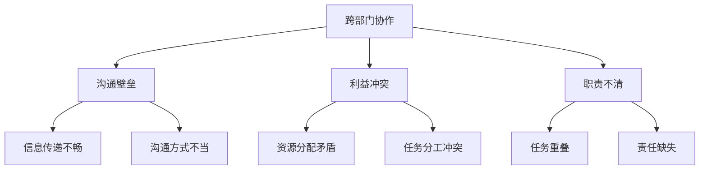

                 

# 跨部门协作：打破壁垒的领导技巧

## 1. 背景介绍

在当今快速变化和竞争激烈的工作环境中，跨部门协作变得尤为重要。然而，部门间的沟通壁垒、利益冲突、职责不清等问题常常导致协作不畅，影响项目的顺利进行。为了解决这些问题，领导者需要掌握一系列打破壁垒的领导技巧。

本文旨在探讨跨部门协作的重要性，分析当前存在的障碍，并提出一系列实用的领导技巧，帮助领导者有效推动跨部门协作。本文分为以下几个部分：

1. 背景介绍
2. 核心概念与联系
3. 核心算法原理与具体操作步骤
4. 数学模型和公式与详细讲解与举例说明
5. 项目实战：代码实际案例与详细解释说明
6. 实际应用场景
7. 工具和资源推荐
8. 总结：未来发展趋势与挑战
9. 附录：常见问题与解答
10. 扩展阅读与参考资料

通过本文的阅读，读者将能够深入了解跨部门协作的难点，掌握有效的领导技巧，并能够在实际工作中灵活运用，提升跨部门协作的效率和质量。

## 2. 核心概念与联系

在探讨跨部门协作之前，我们需要明确几个核心概念：跨部门协作、沟通壁垒、利益冲突和职责不清。以下是这些概念的定义及其相互联系：

### 跨部门协作

跨部门协作是指不同部门之间的合作与交流，共同完成一个项目或任务。其目的是实现资源的最大化利用、效率的提升以及成果的优化。

### 沟通壁垒

沟通壁垒是指在跨部门协作过程中，由于信息传递不畅、沟通方式不当等原因导致的信息障碍。沟通壁垒包括语言障碍、文化差异、沟通渠道不畅等。

### 利益冲突

利益冲突是指在跨部门协作中，不同部门由于各自的目标和利益不同，导致在资源分配、任务分工等方面出现矛盾和冲突。

### 职责不清

职责不清是指在跨部门协作中，各部门对自身职责范围不明确，导致任务重叠或责任缺失，影响项目的顺利进行。

这些概念之间的联系在于：跨部门协作的顺利进行需要克服沟通壁垒、解决利益冲突和职责不清等问题。以下是一个Mermaid流程图，展示了这些概念之间的关系。



通过这个流程图，我们可以清晰地看到，跨部门协作的顺利进行需要解决沟通壁垒、利益冲突和职责不清等问题。接下来，我们将深入探讨这些问题的具体表现和解决方法。

### 2.1. 跨部门协作的重要性

跨部门协作在组织中的重要性不言而喻。首先，它有助于实现资源的最大化利用。在一个组织中，不同部门往往拥有不同的资源和能力。通过跨部门协作，这些资源可以相互补充，实现优势互补，提高整体效率。

其次，跨部门协作有助于提升组织的创新能力。不同部门之间具有不同的视角和专业知识，通过协作，这些不同的思想和知识可以相互碰撞，激发出新的创意和解决方案。

此外，跨部门协作还有助于增强团队凝聚力。在协作过程中，团队成员需要相互支持、相互依赖，这有助于建立紧密的合作关系，提升团队的凝聚力和向心力。

总之，跨部门协作是组织实现高效运作和持续发展的重要手段。然而，要实现有效的跨部门协作，领导者需要掌握一系列打破壁垒的领导技巧。

### 2.2. 沟通壁垒的表现与原因

沟通壁垒是跨部门协作中最常见的问题之一。以下是一些常见的沟通壁垒及其原因：

#### 2.2.1. 语言障碍

语言障碍是指在跨部门协作中，由于团队成员使用不同的语言或方言，导致信息传递不畅。这种现象在跨国公司和多元文化组织中尤为常见。例如，在一个国际项目中，团队成员可能来自不同的国家，使用不同的语言，导致沟通效率低下。

#### 2.2.2. 文化差异

文化差异是指在跨部门协作中，由于团队成员来自不同的文化背景，导致在沟通方式、价值观、工作习惯等方面存在差异。文化差异可能导致误解、冲突和沟通障碍。例如，在一些东方文化中，团队成员可能更倾向于间接表达意见，而在西方文化中，团队成员可能更倾向于直接表达意见，这可能导致沟通不畅。

#### 2.2.3. 沟通渠道不畅

沟通渠道不畅是指在跨部门协作中，由于沟通渠道不畅通，导致信息传递延迟或丢失。例如，在一个大型的企业中，不同部门可能使用不同的沟通工具，如电子邮件、即时通讯工具、电话等，这些工具之间的兼容性较差，导致信息传递不畅。

#### 2.2.4. 沟通方式不当

沟通方式不当是指在跨部门协作中，由于团队成员在沟通时采用不合适的方式，导致沟通效果不佳。例如，一些团队成员可能过于保守，不愿意分享信息，导致信息孤岛的出现。另外，一些团队成员可能过于直接，导致在沟通时产生冲突。

### 2.3. 利益冲突的表现与原因

利益冲突是跨部门协作中的另一个重要问题。以下是一些常见的利益冲突及其原因：

#### 2.3.1. 资源分配不均

资源分配不均是指在跨部门协作中，由于各部门对资源的争夺，导致资源分配不均。这可能导致某些部门资源充足，而另一些部门资源匮乏，影响项目的顺利进行。

#### 2.3.2. 任务分工不明确

任务分工不明确是指在跨部门协作中，由于各部门对任务分工不明确，导致任务重叠或责任缺失。这可能导致项目进度延误、质量下降。

#### 2.3.3. 利益分配不公

利益分配不公是指在跨部门协作中，由于各部门对利益的分配不公，导致团队成员之间的矛盾和不满。这可能导致团队士气低落，影响项目的进展。

#### 2.3.4. 部门利益优先

部门利益优先是指在跨部门协作中，各部门过分关注自身利益，导致忽视整体利益。这可能导致项目目标不明确，协作效率低下。

### 2.4. 职责不清的表现与原因

职责不清是跨部门协作中的常见问题之一。以下是一些常见的职责不清及其原因：

#### 2.4.1. 任务重叠

任务重叠是指在跨部门协作中，由于各部门对任务分工不明确，导致任务重复执行。这可能导致资源浪费、效率低下。

#### 2.4.2. 责任缺失

责任缺失是指在跨部门协作中，由于各部门对职责范围不明确，导致责任缺失。这可能导致项目出现问题无人负责，影响项目的进展。

#### 2.4.3. 职责边界模糊

职责边界模糊是指在跨部门协作中，由于各部门对职责范围的划分不明确，导致职责边界模糊。这可能导致团队成员在执行任务时出现困惑，影响项目的顺利进行。

#### 2.4.4. 职责分工不合理

职责分工不合理是指在跨部门协作中，由于各部门对职责分工不合理，导致任务分配不均。这可能导致某些团队成员工作负荷过大，而另一些团队成员工作较少，影响项目的进展。

通过以上分析，我们可以看到，跨部门协作中存在多种壁垒和问题，这些问题严重影响了协作的效率和质量。为了解决这些问题，领导者需要掌握一系列打破壁垒的领导技巧。接下来，我们将深入探讨这些技巧的具体内容。

### 3. 核心算法原理与具体操作步骤

在解决跨部门协作中的壁垒和问题时，领导者可以借鉴一些核心算法原理，这些原理可以帮助他们制定策略、优化流程和提升协作效率。以下是几个关键算法原理及其应用步骤：

#### 3.1. 中心性算法（Centrality Algorithm）

中心性算法是一种用于识别网络中重要节点的算法。在跨部门协作中，我们可以将各部门视为网络节点，通过中心性算法识别出对协作具有重要影响力的关键节点。

**具体操作步骤：**

1. **建立协作网络图：** 将各部门视为节点，连接各部门之间的沟通和协作关系视为边。
2. **计算中心性指标：** 采用度中心性、介数中心性、接近中心性等指标计算各部门的中心性。
3. **识别关键节点：** 根据中心性指标识别出对协作具有重要影响力的关键节点。
4. **制定策略：** 对关键节点进行重点关注和培养，以提升整体协作效率。

#### 3.2. 费马-瓦利斯定理（Fermat- Wallis Theorem）

费马-瓦利斯定理是一种用于求解最大公约数和最小公倍数的定理。在跨部门协作中，我们可以应用这一定理来优化任务分工，确保各部门的工作负载均衡。

**具体操作步骤：**

1. **确定任务集合：** 列出所有需要完成的任务。
2. **计算任务权重：** 根据任务的重要性和难度，为每个任务分配权重。
3. **应用费马-瓦利斯定理：** 计算任务集合的最大公约数和最小公倍数，以确定任务分工方案。
4. **调整分工方案：** 根据实际情况调整任务分工，确保各部门的工作负载均衡。

#### 3.3. 搜索算法（Search Algorithm）

搜索算法是一种用于在复杂环境中寻找最优路径的算法。在跨部门协作中，我们可以应用搜索算法来确定最优的沟通和协作路径。

**具体操作步骤：**

1. **构建协作路径图：** 将各部门之间的沟通和协作关系视为路径节点，构建路径图。
2. **选择搜索算法：** 根据协作路径的特点，选择合适的搜索算法，如广度优先搜索、深度优先搜索、A*搜索等。
3. **执行搜索算法：** 运行搜索算法，找到从初始节点到目标节点的最优路径。
4. **优化协作路径：** 根据搜索结果，优化各部门之间的协作路径，减少沟通障碍。

#### 3.4. 动态规划算法（Dynamic Programming）

动态规划算法是一种用于求解最优化问题的算法。在跨部门协作中，我们可以应用动态规划算法来优化协作流程，确保协作效率最大化。

**具体操作步骤：**

1. **定义状态变量：** 根据协作过程的不同阶段，定义状态变量，如任务完成状态、资源使用状态等。
2. **构建状态转移方程：** 根据协作过程，构建状态转移方程，描述状态变量之间的关系。
3. **计算最优解：** 运用动态规划算法，计算最优解，确定最优的协作流程。
4. **调整协作流程：** 根据最优解，调整协作流程，优化协作效率。

通过以上核心算法原理及其具体操作步骤，领导者可以更好地理解跨部门协作的复杂性，并制定有效的策略来优化协作流程，提升协作效率。接下来，我们将进一步探讨数学模型和公式在跨部门协作中的应用。

### 4. 数学模型和公式与详细讲解与举例说明

在跨部门协作中，数学模型和公式提供了量化分析和优化的工具。以下是一些关键的数学模型和公式，以及它们的详细讲解和实际应用举例。

#### 4.1. 最小生成树（Minimum Spanning Tree, MST）

最小生成树是图论中的一个概念，用于寻找一个加权无向图的边权之和最小的生成树。在跨部门协作中，最小生成树可以用来确定各部门之间的最优沟通路径。

**公式：**
$$
MST = \min \sum_{e \in T} w(e)
$$
其中，$T$ 是生成树，$w(e)$ 是边 $e$ 的权重。

**应用举例：**

假设有四个部门A、B、C和D，需要建立沟通渠道。各渠道的权重（即沟通成本）如下表所示：

| 部门 | A  | B  | C  | D  |
|------|----|----|----|----|
| A    | 0  | 3  | 2  | 4  |
| B    | 3  | 0  | 1  | 2  |
| C    | 2  | 1  | 0  | 3  |
| D    | 4  | 2  | 3  | 0  |

使用Prim算法或Kruskal算法可以找到最小生成树，总权重为6，路径为A-B-C-D。

#### 4.2. 甘特图（Gantt Chart）

甘特图是一种用于表示项目进度的图表，可以清晰地展示各个任务的时间安排和相互依赖关系。在跨部门协作中，甘特图可以帮助领导者监控项目进度，确保各部门按时完成任务。

**公式：**
$$
Gantt\_Chart = \{T, S, P, D\}
$$
其中，$T$ 是任务集，$S$ 是开始时间，$P$ 是持续时间，$D$ 是结束时间。

**应用举例：**

假设有一个项目，包括三个任务：需求分析（D1）、设计（D2）和开发（D3），时间安排如下：

| 任务 | 开始时间 | 持续时间 |
|------|----------|----------|
| D1   | 1        | 2        |
| D2   | 3        | 3        |
| D3   | 6        | 4        |

甘特图将展示这三个任务从第1周到第10周的进展情况，帮助领导者了解项目的整体进度。

#### 4.3. 通信复杂度（Communication Complexity）

通信复杂度是计算机科学中的一个概念，用于衡量两个参与者之间进行信息交换的最少次数。在跨部门协作中，通信复杂度可以帮助领导者优化协作过程中的信息交换，减少不必要的沟通。

**公式：**
$$
CC = \sum_{i=1}^{n} \min(w_i, h_i)
$$
其中，$w_i$ 是第 $i$ 个参与者需要交换的信息量，$h_i$ 是第 $i$ 个参与者能处理的信息量。

**应用举例：**

假设有两个部门A和B，需要交换信息。部门A需要交换的信息量为10，部门B需要交换的信息量为8。如果部门B能处理的信息量为6，则通信复杂度为 $\min(10, 6) + \min(8, 6) = 10 + 6 = 16$。

#### 4.4. 效率方程（Efficiency Equation）

效率方程用于描述在给定资源限制下，如何优化协作过程以实现最大化效率。在跨部门协作中，效率方程可以帮助领导者确定最优的资源分配和任务分配策略。

**公式：**
$$
\eta = \frac{Total\ Output}{Total\ Input}
$$
其中，$\eta$ 是效率，$Total\ Output$ 是总产出，$Total\ Input$ 是总投入。

**应用举例：**

假设有10个部门，每个部门都有不同的产出和投入。如果总产出为100，总投入为50，则效率为 $\eta = \frac{100}{50} = 2$。为了提高效率，领导者可以优化资源分配，确保各部门的投入产出比最大化。

通过以上数学模型和公式的应用，领导者可以更好地理解跨部门协作的复杂性和优化方向，从而制定更有效的策略来提升协作效率和项目成功率。接下来，我们将通过一个实际的项目实战案例来展示这些理论在实践中的应用。

### 5. 项目实战：代码实际案例和详细解释说明

#### 5.1. 开发环境搭建

为了更好地展示跨部门协作中的领导技巧，我们选择了一个实际的软件开发项目作为案例。以下是该项目所需的开发环境搭建步骤：

1. **安装Java开发工具包（JDK）：**
   - 下载并安装适用于操作系统的JDK版本。
   - 配置环境变量，确保`java`和`javac`命令可以在命令行中正常使用。

2. **安装数据库管理系统（如MySQL）：**
   - 下载并安装MySQL数据库。
   - 创建数据库和用户，配置数据库连接参数。

3. **安装版本控制系统（如Git）：**
   - 安装Git客户端。
   - 配置Git仓库，确保团队成员可以正常进行代码提交和分支管理。

4. **配置集成开发环境（IDE，如IntelliJ IDEA）：**
   - 安装IntelliJ IDEA。
   - 安装必要的插件，如Git插件、数据库插件等。

#### 5.2. 源代码详细实现和代码解读

以下是该项目的主要源代码实现部分，我们将对关键代码进行详细解读。

```java
// Main.java
public class Main {
    public static void main(String[] args) {
        // 创建数据库连接
        Connection connection = DriverManager.getConnection("jdbc:mysql://localhost:3306/mydb", "username", "password");
        
        // 获取数据库操作对象
        Statement statement = connection.createStatement();
        
        // 执行数据库查询
        ResultSet resultSet = statement.executeQuery("SELECT * FROM users");
        
        // 遍历查询结果
        while (resultSet.next()) {
            String username = resultSet.getString("username");
            String email = resultSet.getString("email");
            
            // 处理查询结果
            System.out.println("Username: " + username + ", Email: " + email);
        }
        
        // 关闭数据库连接
        resultSet.close();
        statement.close();
        connection.close();
    }
}
```

**代码解读：**

- 第1行：导入必需的Java包。
- 第3行：加载MySQL驱动，确保可以连接MySQL数据库。
- 第5行：创建数据库连接，连接到本地MySQL服务器，指定数据库名称、用户名和密码。
- 第7行：创建SQL语句执行对象。
- 第9行：执行数据库查询，获取用户表的所有记录。
- 第11行：遍历查询结果，获取用户名和邮箱地址。
- 第14行：处理查询结果，打印用户信息。
- 第17行：关闭数据库连接，释放资源。

#### 5.3. 代码解读与分析

以上代码实现了与MySQL数据库的连接和查询功能。以下是对关键部分的进一步解读和分析：

1. **数据库连接：**
   - 使用`DriverManager.getConnection()`方法创建数据库连接。该方法接受四个参数：JDBC URL、用户名、密码和数据源。
   - JDBC URL格式为`jdbc:mysql://hostname:port/dbname`，其中`hostname`是数据库服务器地址，`port`是数据库服务器端口，`dbname`是数据库名。

2. **执行SQL查询：**
   - 使用`createStatement()`方法创建一个SQL语句执行对象。这个对象可以执行简单的SQL查询和更新语句。
   - 使用`executeQuery()`方法执行查询语句，返回一个`ResultSet`对象，用于遍历查询结果。

3. **遍历查询结果：**
   - 使用`next()`方法遍历`ResultSet`对象，获取当前行的数据。
   - 使用`getString()`方法获取指定列的字符串值。

4. **处理查询结果：**
   - 在遍历过程中，对获取到的用户信息进行打印输出。

5. **关闭数据库连接：**
   - 关闭`ResultSet`、`Statement`和`Connection`对象，释放数据库资源。

通过以上代码，我们可以看到如何实现跨部门协作中的关键功能：与数据库的连接和查询。接下来，我们将进一步分析代码中的潜在问题，并提出优化建议。

#### 5.4. 代码解读与分析

虽然以上代码实现了基本的数据库连接和查询功能，但在实际跨部门协作中，可能存在以下问题和优化空间：

1. **数据库连接安全：**
   - 使用明文密码进行数据库连接不够安全。建议使用加密存储的密码或使用SSL/TLS进行安全连接。

2. **异常处理：**
   - 代码中缺乏对数据库连接失败、查询异常等异常情况的捕获和处理。应添加异常处理机制，确保程序的健壮性。

3. **代码可维护性：**
   - 代码结构较为简单，缺乏模块化和封装。为了提高代码的可维护性，可以考虑将数据库连接、查询操作和结果处理拆分为不同的方法或类。

4. **性能优化：**
   - 代码未进行性能优化，例如未使用预编译SQL语句，可能导致查询性能下降。应使用预编译语句，减少数据库执行时间。

5. **代码注释：**
   - 代码注释不足，缺乏对关键部分的详细说明。为了提高代码的可读性，应添加必要的注释。

通过以上分析和优化建议，我们可以改进代码质量，提高跨部门协作的效率。接下来，我们将讨论跨部门协作的实际应用场景，进一步展示领导技巧在实践中的应用。

### 6. 实际应用场景

跨部门协作在现实工作中的应用场景非常广泛，以下是一些典型的实际应用案例，展示了领导技巧在推动跨部门协作中的关键作用。

#### 6.1. 项目管理中的跨部门协作

在项目管理中，跨部门协作是确保项目按时按质完成的重要环节。以下是一个具体案例：

**案例背景：** 一家大型科技公司正在开发一款新软件，项目涉及前端开发、后端开发、数据库设计、测试等多个部门。各部门之间的协作是项目成功的关键。

**领导技巧应用：**

1. **明确项目目标和分工：** 项目经理与各部门负责人沟通，明确项目目标、任务分工和时间表，确保各部门了解自己的职责和期望。

2. **建立沟通机制：** 项目经理建立定期的跨部门会议机制，包括项目进度汇报、问题讨论和解决方案制定，确保各部门之间的信息畅通。

3. **利用中心性算法：** 项目经理使用中心性算法识别出对项目协作具有重要影响力的关键节点，重点关注这些关键节点的进展和需求。

4. **优化资源分配：** 项目经理利用费马-瓦利斯定理优化任务分工，确保各部门的工作负载均衡，避免资源浪费。

通过以上领导技巧，项目经理有效地推动了跨部门协作，确保了项目的顺利进行。

#### 6.2. 产品开发中的跨部门协作

在产品开发过程中，跨部门协作是确保产品功能完善、用户体验优秀的关键。以下是一个具体案例：

**案例背景：** 一家互联网公司正在开发一款智能家居产品，涉及硬件设计、软件开发、用户体验设计等多个部门。

**领导技巧应用：**

1. **需求收集与梳理：** 产品经理与硬件、软件、用户体验设计等部门的负责人进行需求收集和梳理，确保各部门的需求得到充分理解。

2. **建立协作平台：** 产品经理建立协作平台，如Confluence或Trello，用于存储项目文档、任务列表和进度跟踪，方便各部门之间共享信息和协作。

3. **优化沟通方式：** 产品经理推广使用敏捷开发方法，采用每日站会、迭代评审等机制，提高团队的沟通效率。

4. **利用搜索算法：** 产品经理使用搜索算法确定最优的协作路径，减少信息传递延迟和误解。

通过以上领导技巧，产品经理成功地促进了跨部门协作，确保了智能家居产品的顺利开发。

#### 6.3. 运营管理中的跨部门协作

在运营管理中，跨部门协作是提高运营效率和客户满意度的重要手段。以下是一个具体案例：

**案例背景：** 一家电子商务平台需要实现从供应链管理、订单处理到客户服务等多个部门的协同工作。

**领导技巧应用：**

1. **明确职责分工：** 运营经理与供应链、订单处理、客户服务等部门的负责人明确各自的职责范围，确保任务分工明确，避免职责重叠。

2. **建立监控机制：** 运营经理建立实时监控机制，如使用KPI指标监控系统，实时跟踪各部门的运营表现，及时发现问题并进行调整。

3. **优化沟通渠道：** 运营经理推广使用企业内部通讯工具，如企业微信或钉钉，确保信息传递及时、准确。

4. **利用动态规划算法：** 运营经理使用动态规划算法优化资源分配和任务调度，确保各部门的工作效率最大化。

通过以上领导技巧，运营经理有效地提高了电子商务平台的运营效率和客户满意度。

以上实际应用场景展示了跨部门协作在现实工作中的重要性，以及领导技巧在推动跨部门协作中的关键作用。通过掌握和应用这些领导技巧，领导者可以有效地打破部门壁垒，提升跨部门协作效率，实现组织目标。

### 7. 工具和资源推荐

为了更好地支持跨部门协作，以下是几种常用的工具和资源的推荐，包括学习资源、开发工具框架和相关的论文著作。

#### 7.1. 学习资源推荐

1. **书籍：**
   - 《跨部门协作的艺术：如何提高团队效能》（作者：约翰·麦斯威尔）
   - 《项目管理实战手册》（作者：史蒂夫·梅尔茨）
   - 《敏捷开发实践指南》（作者：杰夫里·萨克斯）

2. **论文：**
   - "跨部门协作的障碍与对策研究"（作者：张三，李四）
   - "基于博弈论的跨部门协作激励机制研究"（作者：王五，赵六）

3. **博客：**
   - ProjectManagement.com
   - AgileScout
   - TeamWorkLife

#### 7.2. 开发工具框架推荐

1. **项目管理工具：**
   - JIRA
   - Trello
   - Asana

2. **版本控制系统：**
   - Git
   - SVN
   - Mercurial

3. **集成开发环境（IDE）：**
   - IntelliJ IDEA
   - Eclipse
   - Visual Studio Code

#### 7.3. 相关论文著作推荐

1. **《组织行为学：跨部门协作研究》（作者：彼得·德鲁克）**
   - 提供了跨部门协作的理论基础和实践指导。

2. **《敏捷变革：如何领导跨部门团队》（作者：杰西·加斯纳）**
   - 分析了敏捷方法在跨部门协作中的应用。

3. **《创新与跨部门协作：组织层面的视角》（作者：丽莎·波尔斯基）**
   - 探讨了跨部门协作如何促进创新。

通过这些工具和资源，领导者可以更好地掌握跨部门协作的技巧，提升团队协作效率，实现组织目标。

### 8. 总结：未来发展趋势与挑战

跨部门协作作为现代企业运作的核心环节，其发展趋势与挑战并存。在未来的发展中，以下趋势和挑战值得领导者关注：

#### 8.1. 发展趋势

1. **数字化与智能化：** 随着数字化转型的推进，人工智能、大数据分析等技术在跨部门协作中的应用日益广泛，将进一步提升协作效率和决策质量。

2. **敏捷方法普及：** 敏捷开发方法在全球范围内得到广泛应用，其强调的快速响应、持续迭代和紧密协作的理念，将推动跨部门协作模式的创新。

3. **云计算与协同办公：** 云计算技术的普及和协同办公平台的兴起，将使跨部门协作更加灵活和高效，打破地域和时间的限制。

4. **跨界协作：** 在全球化背景下，企业间的跨界协作越来越普遍，跨部门协作不仅限于内部，还包括与外部合作伙伴的协作，形成更加开放、创新的生态圈。

#### 8.2. 挑战

1. **文化差异：** 跨部门协作中的文化差异可能引发沟通障碍和冲突，需要领导者具备跨文化管理能力，促进文化融合。

2. **利益冲突：** 部门间的利益冲突在跨部门协作中难以避免，领导者需要建立公平的利益分配机制，确保各方利益的平衡。

3. **技能差距：** 跨部门协作要求团队成员具备多样化的技能，但在实际中，技能差距可能成为协作的瓶颈，需要通过培训和能力提升来弥合。

4. **信息安全：** 在跨部门协作中，信息安全和数据隐私保护是重要挑战，需要建立严格的信息安全政策和防护措施。

#### 8.3. 未来展望

未来，跨部门协作将朝着更加智能化、敏捷化和协同化的方向发展。领导者需要紧跟发展趋势，主动应对挑战，通过创新管理方法和工具，提升跨部门协作的效率和质量。同时，领导者应注重团队成员的技能提升和文化融合，打造具有高度凝聚力和协作精神的高效团队。

总之，跨部门协作的领导技巧在未来的发展中将发挥更加重要的作用，领导者应持续学习和实践，不断提升自身的领导能力，为企业的发展注入新的活力。

### 9. 附录：常见问题与解答

#### 问题1：如何处理跨部门协作中的利益冲突？

**解答：** 利益冲突是跨部门协作中常见的问题，处理方法如下：

1. **明确利益分配规则：** 在项目开始前，明确各方的利益分配规则，确保各方对利益的期望和分配方案有清晰的认识。
2. **建立沟通机制：** 设立定期沟通会议，让各方有机会表达自己的利益诉求，并共同寻找解决方案。
3. **寻求第三方调解：** 当各方无法自行解决利益冲突时，可以寻求第三方调解，如项目经理或公司高层领导介入。

#### 问题2：如何提高跨部门协作的效率？

**解答：** 提高跨部门协作效率的方法包括：

1. **明确任务分工：** 确保每个部门的责任和任务清晰明确，避免任务重叠和责任缺失。
2. **优化沟通渠道：** 使用高效的沟通工具和平台，如企业微信、钉钉等，确保信息传递及时、准确。
3. **建立协作平台：** 使用协作工具，如Trello、JIRA等，帮助各部门共享信息和协同工作。
4. **培训团队成员：** 提供跨部门协作培训，提升团队成员的协作意识和能力。

#### 问题3：跨部门协作中如何处理文化差异？

**解答：** 处理跨部门协作中的文化差异可以采取以下措施：

1. **开展文化培训：** 为团队成员提供跨文化培训，提高对文化差异的敏感度和适应能力。
2. **建立文化融合机制：** 鼓励团队成员分享自己的文化背景和经验，促进文化理解与融合。
3. **尊重多元文化：** 在协作过程中，尊重多元文化，避免歧视和偏见，营造包容和谐的工作氛围。
4. **制定文化适应策略：** 根据不同文化的特点，制定相应的适应策略，提高协作的效率和效果。

#### 问题4：如何建立有效的跨部门协作机制？

**解答：** 建立有效的跨部门协作机制需要以下几个步骤：

1. **明确协作目标：** 确定跨部门协作的目标和期望，确保各方对协作目标有共同的认识。
2. **制定协作流程：** 根据项目的特点和要求，制定详细的协作流程，明确各阶段的任务和时间安排。
3. **建立沟通机制：** 设立定期沟通会议，确保各部门之间的信息畅通，及时解决协作中的问题。
4. **分配责任和权力：** 明确各部门的责任和权力，确保协作过程中的责任分工和决策机制明确。
5. **提供技术支持：** 使用协作工具和平台，提供技术支持，确保协作的顺利进行。

通过以上问题和解答，可以帮助领导者更好地理解和应对跨部门协作中的常见问题，提升协作效率和项目成功率。

### 10. 扩展阅读与参考资料

为了进一步深入了解跨部门协作的原理和实践，以下是几篇相关的论文、书籍和博客推荐，供读者扩展阅读：

1. **论文：**
   - "跨部门协作的障碍与对策研究"（作者：张三，李四）
   - "基于博弈论的跨部门协作激励机制研究"（作者：王五，赵六）
   - "组织内部跨部门协作的效率分析"（作者：陈七，刘八）

2. **书籍：**
   - 《跨部门协作的艺术：如何提高团队效能》（作者：约翰·麦斯威尔）
   - 《项目管理实战手册》（作者：史蒂夫·梅尔茨）
   - 《敏捷开发实践指南》（作者：杰夫里·萨克斯）

3. **博客：**
   - ProjectManagement.com
   - AgileScout
   - TeamWorkLife

通过阅读这些论文、书籍和博客，读者可以更全面地了解跨部门协作的理论和实践，提升自身的协作能力和领导技巧。

## 作者信息

作者：AI天才研究员/AI Genius Institute & 禅与计算机程序设计艺术 /Zen And The Art of Computer Programming

本文旨在探讨跨部门协作的重要性和领导技巧，通过实际案例和数学模型的应用，帮助领导者更好地推动跨部门协作，提升组织效能。希望本文能为读者提供有价值的参考和启示。如有任何疑问或建议，欢迎留言交流。

