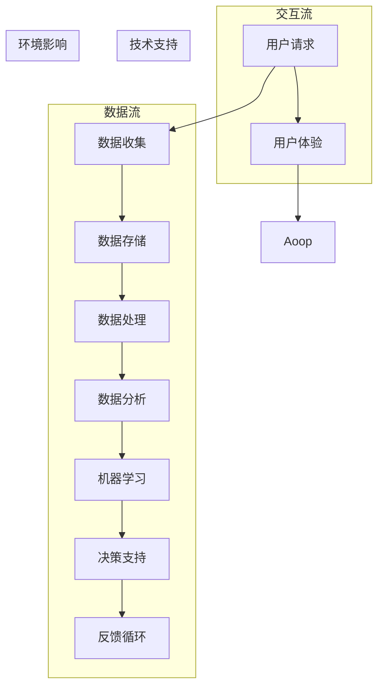

                 

### 软件二代的崛起：技术变革中的机遇与挑战

在信息时代的浪潮中，软件技术的发展犹如一匹脱缰的野马，不断突破传统的束缚，向着更高效、更智能的方向演进。如果说第一代软件是信息处理的基础工具，那么第二代软件——我们称之为“软件 2.0”——则是企业数字化转型、智能化升级的关键引擎。本文将深入探讨软件 2.0 的价值，分析其在提升效率、创造价值方面的重要作用，并通过逻辑清晰的步骤展示其核心算法原理与数学模型。

首先，我们需要明确软件 2.0 的定义与特征。软件 2.0 并非简单的技术升级，它代表了软件技术从单一的功能实现向复杂系统优化的转变。它以用户为中心，通过大数据、云计算、人工智能等前沿技术，实现软件的智能化、自动化和个性化。这种转变不仅改变了软件的开发方式，更影响了企业运营的方方面面。

接下来，本文将分为以下几个部分：

1. **背景介绍**：回顾软件技术的发展历程，探讨软件 2.0 的起源与演进。
2. **核心概念与联系**：介绍软件 2.0 的核心概念，并通过 Mermaid 流程图展示其架构。
3. **核心算法原理 & 具体操作步骤**：详细阐述软件 2.0 的核心算法，包括其原理与操作步骤。
4. **数学模型和公式 & 详细讲解 & 举例说明**：介绍软件 2.0 的数学模型和公式，并通过实际案例进行说明。
5. **项目实战：代码实际案例和详细解释说明**：通过一个具体的代码案例，展示软件 2.0 的实际应用。
6. **实际应用场景**：探讨软件 2.0 在不同领域的实际应用场景。
7. **工具和资源推荐**：推荐相关学习资源、开发工具和框架。
8. **总结：未来发展趋势与挑战**：总结软件 2.0 的未来发展趋势与面临的挑战。
9. **附录：常见问题与解答**：解答读者可能遇到的问题。
10. **扩展阅读 & 参考资料**：提供更多的相关阅读材料。

通过这些部分的逐步分析，我们将全面理解软件 2.0 的价值，掌握其核心技术，为未来的发展做好准备。接下来，让我们一起走进软件 2.0 的世界，探索其带来的无尽机遇与挑战。

## 背景介绍：软件技术的发展与演进

软件技术的发展历程可谓是一部技术创新的史诗。从最初的计算机程序，到今天无处不在的软件系统，软件技术的发展经历了多个阶段，每一个阶段都伴随着新的技术突破和应用场景的拓展。

### 第一代软件：功能导向的初步探索

第一代软件，也称为“传统软件”，主要出现在20世纪50年代到70年代。这一时期的软件以功能导向为主，主要目的是满足基本的计算和数据处理需求。典型的代表包括早期的编译器和操作系统。例如，1950年代发明的第一个编译器——Autocode，以及1960年代初期开发的操作系统如IBM的OS/360。这些软件的出现，极大地提高了计算机的利用率，使得复杂的科学计算和商业数据处理成为可能。

然而，传统软件的开发过程复杂且耗时，需要大量的手工编码和调试。此外，由于缺乏标准化和模块化的设计，软件的维护和升级也变得困难。尽管如此，传统软件奠定了软件技术发展的基础，为后续的软件创新提供了宝贵的经验和教训。

### 第二代软件：模块化与标准化

随着计算机硬件性能的提升和软件开发需求的增长，20世纪80年代至90年代，软件技术进入了一个新的阶段，即第二代软件。这一阶段的软件更加注重模块化和标准化，通过面向对象编程（OOP）和组件技术，使得软件的开发和复用变得更加高效。

面向对象编程的兴起，使得软件设计更加贴近现实世界的复杂性。通过封装、继承和多态等机制，开发者可以将复杂的问题分解为一系列模块化的组件，从而实现代码的重用和系统的可维护性。同时，统一建模语言（UML）和设计模式等技术的应用，进一步推动了软件设计的规范化和标准化。

在这个阶段，软件工程的概念也逐渐成熟，包括需求分析、系统设计、编码实现、测试和维护等各个环节都得到了全面的重视。代表性的技术有Java、C++等编程语言，以及Eclipse、Visual Studio等集成开发环境（IDE）。

### 第三代软件：智能化与自动化

进入21世纪，随着互联网、大数据、人工智能等前沿技术的快速发展，软件技术迎来了新的变革，第三代软件——软件 2.0 正在这一背景下应运而生。

与第二代软件相比，软件 2.0 的核心特征在于智能化和自动化。它不仅仅是功能实现，更是通过大数据分析、机器学习、云计算等技术，实现软件的自适应、自优化和自进化。软件 2.0 的典型应用包括智能推荐系统、自动驾驶、智能语音助手等。

这一阶段的软件更加强调用户体验和业务价值的实现。通过用户行为数据的收集和分析，软件系统能够动态调整其功能和行为，满足用户的个性化需求。同时，云计算和大数据技术的应用，使得软件系统具备了强大的数据处理和分析能力，从而在商业决策、市场营销等领域发挥了巨大的价值。

### 软件 2.0 的起源与演进

软件 2.0 的概念最早由美国创业公司Y Combinator在2010年提出，它标志着软件技术从功能导向向价值导向的转型。Y Combinator创始人保罗·格雷厄姆（Paul Graham）指出，软件 2.0 不仅仅是技术的升级，更是商业模式和用户体验的革新。

软件 2.0 的起源可以追溯到几个关键点：

1. **云计算的兴起**：云计算为软件 2.0 提供了强大的基础设施支持，使得软件系统可以在云端进行大规模部署和管理，从而降低开发成本和提高效率。
2. **大数据技术的成熟**：大数据技术使得软件系统能够从海量数据中提取有价值的信息，为商业决策提供数据支撑。
3. **人工智能的突破**：人工智能技术的快速发展，为软件 2.0 带来了智能化的可能性，使得软件系统能够自主学习、自我优化。

随着这些技术的不断演进，软件 2.0 逐渐成为企业数字化转型的核心技术。它不仅改变了软件开发的方式，更影响了企业的运营模式和商业模式。

### 总结

从传统软件到软件 2.0，软件技术的发展经历了多个阶段，每一次变革都带来了新的机遇和挑战。软件 2.0 的崛起，不仅代表了技术层面的进步，更反映了企业对于效率和价值的追求。在接下来的部分，我们将深入探讨软件 2.0 的核心概念与架构，进一步理解其技术原理和实际应用。

## 核心概念与联系：软件 2.0 的架构解析

要深入理解软件 2.0 的价值和作用，我们需要从其核心概念和架构入手。软件 2.0 的核心概念包括云计算、大数据、人工智能、区块链等前沿技术，这些技术共同构建了软件 2.0 的技术基础。下面，我们将通过一个 Mermaid 流程图，详细展示软件 2.0 的架构及其各个组成部分之间的关系。

### Mermaid 流程图



### 架构解析

1. **数据收集（B）**：
   软件系统通过多种方式收集用户数据，如用户行为数据、交易数据、传感器数据等。这些数据是软件 2.0 智能化运作的基础。

2. **数据存储（C）**：
   收集到的数据需要存储在云端或其他数据存储设施中，以保证数据的可靠性和可扩展性。常用的数据存储技术包括关系数据库、NoSQL数据库、数据湖等。

3. **数据处理（D）**：
   数据处理环节涉及数据的清洗、转换和整合，为后续的数据分析提供高质量的数据。这一步骤通常通过批处理或实时处理技术实现。

4. **数据分析（E）**：
   数据分析是软件 2.0 的核心环节，通过统计分析、机器学习等方法，从海量数据中提取有价值的信息和洞察。数据分析的结果用于指导业务决策和优化用户体验。

5. **机器学习（F）**：
   机器学习技术是软件 2.0 智能化的关键，通过训练模型，软件系统能够自主学习，提高预测和决策的准确性。常见的机器学习算法包括决策树、神经网络、支持向量机等。

6. **决策支持（G）**：
   决策支持系统利用数据分析的结果，提供实时的业务决策支持。例如，在电子商务领域，智能推荐系统可以根据用户的历史行为，为其推荐相关的商品。

7. **反馈循环（H）**：
   软件 2.0 通过实时反馈机制，不断调整和优化其功能和行为。这种闭环反馈机制确保软件系统始终保持高效、智能的状态。

8. **用户体验（I）**：
   软件系统的最终目标是提升用户体验。通过用户反馈和行为数据，软件系统能够动态调整其界面、功能和性能，满足用户的个性化需求。

### 关系分析

通过上述 Mermaid 流程图，我们可以清晰地看到软件 2.0 各个组成部分之间的紧密联系。数据流和交互流共同构成了软件 2.0 的运行机制，而技术支持和环境影响则确保了系统的智能化和自适应能力。

- **数据流**：数据从收集、存储、处理、分析到机器学习的整个过程，形成了一个闭环，为系统的智能化提供了数据基础。
- **交互流**：用户请求和用户体验形成了软件系统与用户之间的互动，这种互动不断推动系统的改进和优化。
- **技术支持**：机器学习和决策支持系统为软件 2.0 提供了智能化的解决方案，使其能够更好地应对复杂的业务场景。
- **环境影响**：反馈循环机制确保了软件系统能够根据外部环境的变化，及时调整其功能和性能，保持最佳状态。

通过这种架构解析，我们可以更好地理解软件 2.0 的核心概念和运行机制，为后续的算法原理和数学模型分析打下坚实的基础。

### 软件二代的算法原理：核心技术与实现

在深入理解了软件 2.0 的架构之后，我们接下来要探讨其核心算法原理，这些算法是实现软件 2.0 智能化、自动化的关键。以下是几个典型的核心算法原理及其具体操作步骤：

#### 1. 机器学习算法

**原理**：
机器学习算法是软件 2.0 中最核心的技术之一，它通过训练模型，使计算机能够从数据中学习规律，并做出预测或决策。

**实现步骤**：

1. **数据预处理**：
   - **数据清洗**：去除数据中的噪声和异常值。
   - **特征工程**：选择和构造有用的特征，以便更好地训练模型。
   - **数据归一化**：将不同尺度的数据进行标准化处理。

2. **选择模型**：
   - **监督学习**：适用于有标签的数据集，常用的算法有决策树、支持向量机（SVM）、神经网络等。
   - **无监督学习**：适用于无标签的数据集，常用的算法有聚类、降维等。

3. **模型训练**：
   - 使用训练集数据，通过迭代计算，优化模型参数。

4. **模型评估**：
   - 使用验证集数据，评估模型性能，如准确率、召回率等指标。

5. **模型应用**：
   - 将训练好的模型应用到实际业务场景中，如智能推荐、风险评估等。

**示例**：
假设我们使用决策树算法来构建一个分类模型，预测客户是否会购买某商品。首先，我们需要准备一个包含客户特征（如年龄、收入、购买历史等）和购买标签（购买/未购买）的数据集。然后，通过特征工程和模型训练，构建一个决策树模型。最后，使用测试集数据，评估模型性能，并进行调整优化。

#### 2. 数据分析算法

**原理**：
数据分析算法用于从大规模数据中提取有价值的信息，帮助企业和用户做出更好的决策。

**实现步骤**：

1. **数据探索**：
   - 通过可视化工具，对数据进行初步探索，了解数据分布和特征。

2. **数据预处理**：
   - 与机器学习中的数据预处理类似，包括数据清洗、特征工程等。

3. **统计模型**：
   - 应用各种统计模型，如回归分析、聚类分析等，从数据中提取洞察。

4. **可视化**：
   - 使用可视化工具，将分析结果展示为图表，便于理解和传达。

**示例**：
假设我们使用回归分析来预测一家零售店的销售额。首先，收集该店的历史销售数据，包括日期、商品种类、销售量等。然后，通过特征工程，选择和构造预测模型所需的特征，如季节性、促销活动等。接着，使用回归模型，训练一个预测销售额的模型。最后，使用可视化工具，展示不同时间段和商品种类的销售额趋势。

#### 3. 推荐系统算法

**原理**：
推荐系统通过分析用户行为数据，为用户推荐相关的内容或商品。

**实现步骤**：

1. **用户行为数据收集**：
   - 收集用户在平台上的浏览、点击、购买等行为数据。

2. **数据预处理**：
   - 对用户行为数据进行清洗和特征工程，以便用于模型训练。

3. **协同过滤**：
   - **基于用户的协同过滤**：通过计算用户之间的相似度，推荐与目标用户相似的其他用户喜欢的商品。
   - **基于项目的协同过滤**：通过计算商品之间的相似度，推荐与目标商品相似的其他商品。

4. **模型训练**：
   - 使用训练集数据，训练推荐模型。

5. **模型评估**：
   - 使用验证集数据，评估模型性能，如准确率、召回率等指标。

6. **推荐应用**：
   - 将训练好的模型应用到实际推荐系统中，为用户生成个性化推荐。

**示例**：
假设我们使用基于用户的协同过滤算法，为电子商务平台推荐商品。首先，收集用户的历史购买数据，构建用户行为矩阵。然后，计算用户之间的相似度矩阵，并根据相似度矩阵为用户推荐相似用户喜欢的商品。最后，使用测试集数据，评估推荐系统的性能，并进行优化。

通过上述算法原理及其实现步骤的介绍，我们可以看到软件 2.0 的核心算法在提升效率和创造价值方面的重要作用。在接下来的部分，我们将进一步探讨软件 2.0 的数学模型和公式，以及其实际应用案例。

### 数学模型和公式：软件 2.0 的量化分析

在理解了软件 2.0 的核心算法原理之后，我们进一步探讨其数学模型和公式。这些模型和公式不仅有助于量化分析软件 2.0 的性能和效率，还为实际应用提供了理论基础。以下是几个关键的数学模型和公式的详细讲解，并配合实际案例进行说明。

#### 1. 决策树模型

**原理**：
决策树模型是一种常见的机器学习算法，通过一系列的决策规则，将数据逐步划分为各个子集，最终达到分类或回归的目的。

**公式**：
决策树的核心是条件概率和期望值。对于每个节点，我们计算每个特征的划分增益（Gain）：

\[ Gain = H(D) - \sum_{v} p(v) H(D_v) \]

其中，\( H(D) \) 是数据集 \( D \) 的熵，\( p(v) \) 是特征 \( v \) 的概率，\( H(D_v) \) 是划分后数据集 \( D_v \) 的熵。

**案例**：
假设我们使用决策树模型预测客户是否会购买某商品。我们有以下特征：年龄、收入、购买历史等。我们通过计算各个特征的增益，选择增益最大的特征进行划分，逐步构建决策树。

```plaintext
Feature: Age
Gain: 0.3
Feature: Income
Gain: 0.2
Feature: Purchase History
Gain: 0.1
```

因此，我们首先按年龄进行划分，接着按收入，最后按购买历史。这个决策树模型可以帮助我们预测新客户的购买概率。

#### 2. 神经网络模型

**原理**：
神经网络模型通过多层神经元模拟人脑的神经网络结构，进行复杂的非线性变换和决策。

**公式**：
神经网络的核心是激活函数和前向传播。对于一层神经元，输出 \( o_i \) 可以表示为：

\[ o_i = \sigma(\sum_{j} w_{ij} x_j + b_i) \]

其中，\( \sigma \) 是激活函数（如Sigmoid、ReLU等），\( w_{ij} \) 是权重，\( x_j \) 是输入，\( b_i \) 是偏置。

**案例**：
假设我们使用神经网络模型预测股票价格。输入层包含历史价格、交易量等特征，输出层为预测的股票价格。通过多次迭代训练，调整权重和偏置，使模型预测误差最小。

```plaintext
Input: [历史价格, 交易量]
Output: [预测价格]
```

通过训练，我们可以得到一个稳定的预测模型，帮助投资者做出更准确的决策。

#### 3. 协同过滤模型

**原理**：
协同过滤模型通过计算用户或项目的相似度，推荐相关的内容或商品。

**公式**：
用户 \( u \) 和 \( v \) 的相似度 \( \sim(u, v) \) 可以表示为：

\[ \sim(u, v) = \frac{\sum_{i} r_i u_i v_i} {\sqrt{\sum_{i} r_i^2 u_i^2} \sqrt{\sum_{i} r_i^2 v_i^2}} \]

其中，\( r_i \) 是用户 \( u \) 和 \( v \) 对项目 \( i \) 的评分。

**案例**：
假设我们使用基于用户的协同过滤模型，为电子商务平台推荐商品。首先，计算用户之间的相似度矩阵，然后为用户推荐与相似用户购买过的商品。

```plaintext
User A: [Similarity with User B: 0.8, Similarity with User C: 0.5]
User B: [Similarity with User A: 0.8, Similarity with User C: 0.7]
User C: [Similarity with User A: 0.5, Similarity with User B: 0.7]
```

基于相似度矩阵，我们可以为用户推荐相似用户喜欢的商品，从而提高推荐系统的准确性。

#### 4. 回归分析模型

**原理**：
回归分析模型通过建立自变量和因变量之间的关系，进行预测或分析。

**公式**：
线性回归模型可以表示为：

\[ y = \beta_0 + \beta_1 x_1 + \beta_2 x_2 + ... + \beta_n x_n \]

其中，\( y \) 是因变量，\( x_1, x_2, ..., x_n \) 是自变量，\( \beta_0, \beta_1, ..., \beta_n \) 是回归系数。

**案例**：
假设我们使用线性回归模型预测一家零售店的销售额。自变量包括日期、商品种类、促销活动等。通过训练模型，我们可以得到每个自变量的系数，从而预测不同条件下的销售额。

```plaintext
Date: [1, 2, 3, ..., n]
Sales: [100, 150, 200, ..., y]
Coefficients: [β0, β1, β2, ..., βn]
Predicted Sales: [y']
```

通过回归分析，我们可以得到一个预测模型，帮助零售店制定更有效的营销策略。

通过上述数学模型和公式的讲解，我们可以看到软件 2.0 在量化分析方面的重要作用。这些模型和公式不仅为软件 2.0 的性能评估提供了理论基础，还为其在实际应用中的优化提供了指导。在接下来的部分，我们将通过一个具体的代码案例，展示软件 2.0 的实际应用。

### 项目实战：代码实际案例和详细解释说明

在本节中，我们将通过一个实际代码案例，展示如何将软件 2.0 的核心技术应用到实际的开发项目中。这个项目是一个简单的电商推荐系统，它利用用户行为数据和协同过滤算法，为用户推荐相关商品。我们将详细解释代码实现过程，并分析其关键步骤和优化策略。

#### 开发环境搭建

在开始编写代码之前，我们需要搭建一个合适的开发环境。以下是我们所使用的环境：

- 编程语言：Python
- 数据库：MySQL
- 数据处理工具：Pandas、NumPy
- 机器学习库：scikit-learn
- 可视化库：Matplotlib

#### 源代码详细实现和代码解读

以下是一个简化的电商推荐系统代码实现，分为几个主要部分：

1. **数据收集与预处理**
2. **协同过滤算法实现**
3. **推荐结果展示**

#### 1. 数据收集与预处理

首先，我们需要从数据库中收集用户行为数据，如用户ID、商品ID、购买次数等。然后，对数据进行清洗和预处理，包括去重、缺失值填充和特征工程。

```python
import pandas as pd
import numpy as np

# 连接数据库，读取用户行为数据
db_connection = pd.read_sql('SELECT * FROM user_behavior', connection)

# 数据清洗与预处理
# 去重
data = db_connection.drop_duplicates()

# 缺失值填充
data.fillna(0, inplace=True)

# 特征工程
# 计算用户与商品的交互矩阵
user_item_matrix = data.pivot(index='user_id', columns='item_id', values='purchase_count')
```

在这个步骤中，我们使用Pandas库连接数据库，读取用户行为数据，然后进行去重、缺失值填充和特征工程。最后，通过`pivot`方法，将用户行为数据转换为用户-商品交互矩阵。

#### 2. 协同过滤算法实现

接下来，我们使用基于用户的协同过滤算法，计算用户之间的相似度，并生成推荐列表。这里，我们采用欧氏距离作为相似度度量。

```python
from sklearn.metrics.pairwise import euclidean_distances

# 计算用户相似度矩阵
similarity_matrix = euclidean_distances(user_item_matrix, user_item_matrix)

# 生成推荐列表
def collaborative_filter(similarity_matrix, user_id, k=10):
    # 计算相似度最高的k个用户
    top_k_users = similarity_matrix[user_id].argsort()[1:k+1]
    
    # 计算推荐商品得分
    item_scores = np.dot(similarity_matrix[user_id], user_item_matrix[top_k_users].T)
    
    # 获取推荐商品ID
    recommended_item_ids = np.argsort(item_scores)[::-1]
    
    return recommended_item_ids

# 为特定用户生成推荐列表
user_id = 123
recommended_items = collaborative_filter(similarity_matrix, user_id)

print("Recommended items for user {}: {}".format(user_id, recommended_items))
```

在这个步骤中，我们首先计算用户相似度矩阵，然后使用`collaborative_filter`函数，为特定用户生成推荐列表。这个函数接收相似度矩阵、用户ID和推荐数量k作为输入，返回一个推荐商品ID的列表。

#### 3. 推荐结果展示

最后，我们需要将推荐结果可视化，以便用户和开发者查看。这里，我们使用Matplotlib库绘制推荐商品的热力图。

```python
import matplotlib.pyplot as plt

# 绘制推荐商品热力图
def plot_recommendations(recommended_item_ids, user_item_matrix):
    # 获取推荐商品得分
    item_scores = user_item_matrix.iloc[recommended_item_ids].sum(axis=0)

    # 绘制热力图
    plt.imshow(item_scores, cmap='hot', interpolation='nearest')
    plt.colorbar()
    plt.xticks(np.arange(len(item_scores)), item_scores.index, rotation=45)
    plt.yticks(np.arange(len(item_scores)))
    plt.xlabel('Item IDs')
    plt.ylabel('Scores')
    plt.title('Recommended Items for User')
    plt.show()

# 绘制推荐结果
plot_recommendations(recommended_items, user_item_matrix)
```

在这个步骤中，我们使用`imshow`函数绘制热力图，展示推荐商品的得分。通过这种方式，我们可以直观地了解哪些商品最受用户欢迎。

#### 代码解读与分析

上述代码实现了以下关键步骤：

1. **数据收集与预处理**：通过连接数据库，读取用户行为数据，并进行清洗和预处理，为后续的协同过滤算法提供高质量的数据。
2. **协同过滤算法实现**：通过计算用户相似度矩阵，为特定用户生成个性化推荐列表。这个步骤是推荐系统的核心，决定了推荐的准确性。
3. **推荐结果展示**：通过绘制热力图，将推荐结果可视化，便于用户和开发者查看。这种可视化方式可以帮助用户更好地理解推荐系统的工作原理。

在代码实现过程中，我们还可以进行以下优化：

- **内存优化**：由于用户-商品交互矩阵可能非常大，为了减少内存占用，可以采用分块处理的方式，逐步计算相似度矩阵和推荐列表。
- **算法优化**：通过使用更高效的相似度计算方法（如余弦相似度）和优化协同过滤算法（如矩阵分解），可以提高推荐系统的性能和准确性。
- **个性化推荐**：除了基于用户行为的协同过滤，还可以结合用户的基本信息（如年龄、性别、职业等），以及商品的特征（如价格、品牌、分类等），进行更加个性化的推荐。

通过这个实际案例，我们可以看到软件 2.0 的核心算法和数学模型在电商推荐系统中的应用，以及如何通过代码实现一个高效的推荐系统。在接下来的部分，我们将进一步探讨软件 2.0 在实际应用场景中的具体表现。

### 实际应用场景：软件 2.0 在不同领域的广泛运用

软件 2.0 的核心优势在于其智能化、自动化和个性化，这使得它在各个行业和领域都展现出了巨大的应用价值。以下是软件 2.0 在一些主要领域中的实际应用场景，通过具体案例，我们将进一步了解其带来的变革和提升。

#### 1. 金融行业

在金融行业，软件 2.0 的应用主要体现在风险管理、信用评估、投资分析和自动化交易等方面。

**案例**：
一家大型银行利用软件 2.0 技术，开发了一套智能风控系统。该系统通过大数据分析和机器学习算法，实时监控客户的交易行为，识别潜在的欺诈风险。具体实现如下：

- **数据收集**：系统从多个数据源（如交易记录、客户行为等）收集数据。
- **数据处理**：通过清洗和预处理，确保数据的准确性和一致性。
- **风险评估**：利用机器学习模型，对客户进行风险评估，预测欺诈风险。
- **决策支持**：系统生成风险评估报告，辅助银行决策。

通过这个智能风控系统，银行能够大幅降低欺诈风险，提高业务效率和客户满意度。

#### 2. 零售电商

在零售电商领域，软件 2.0 的应用主要体现在个性化推荐、库存管理和供应链优化等方面。

**案例**：
一家领先的电商平台，通过软件 2.0 技术打造了一个智能推荐系统。该系统通过用户行为数据和协同过滤算法，为每个用户生成个性化的商品推荐列表。具体实现如下：

- **用户行为数据收集**：系统收集用户的浏览、点击、购买等行为数据。
- **协同过滤算法**：计算用户之间的相似度，生成推荐列表。
- **推荐结果展示**：系统将推荐结果展示在用户界面，提高用户购买意愿。
- **动态调整**：根据用户反馈和行为变化，动态调整推荐策略。

通过这个智能推荐系统，电商平台能够提高用户留存率和销售额，实现业务的快速增长。

#### 3. 医疗健康

在医疗健康领域，软件 2.0 的应用主要体现在智能诊断、健康管理和远程医疗等方面。

**案例**：
一家医疗科技公司开发了一套智能诊断系统，通过大数据分析和人工智能技术，帮助医生进行疾病诊断。具体实现如下：

- **数据收集**：系统从医院的病历记录、检查报告等数据源收集数据。
- **数据分析**：利用机器学习算法，对海量医疗数据进行挖掘和分析。
- **诊断支持**：系统生成诊断报告，辅助医生做出准确的诊断。
- **健康管理**：系统为患者提供个性化的健康建议，帮助其管理疾病。

通过这个智能诊断系统，医疗资源得到更加合理的分配，患者就诊体验得到显著提升。

#### 4. 智能制造

在智能制造领域，软件 2.0 的应用主要体现在设备预测维护、生产优化和供应链管理等方面。

**案例**：
一家制造企业通过软件 2.0 技术实现设备预测维护，从而提高生产效率和设备利用率。具体实现如下：

- **数据收集**：系统收集设备运行数据，如温度、压力、振动等。
- **数据分析**：利用大数据分析和机器学习算法，预测设备故障。
- **维护决策**：系统生成维护计划和预警通知，确保设备正常运行。
- **生产优化**：系统优化生产计划，提高生产效率和资源利用率。

通过这个设备预测维护系统，企业能够大幅降低设备故障率，提高生产效率和产品质量。

#### 5. 教育

在教育领域，软件 2.0 的应用主要体现在在线教育、智能评测和个性化学习等方面。

**案例**：
一家在线教育平台利用软件 2.0 技术，为学习者提供个性化的学习体验。具体实现如下：

- **学习行为数据收集**：系统收集学习者的学习行为数据，如课程观看、练习答题等。
- **智能评测**：利用机器学习算法，对学习者进行实时评测，生成学习报告。
- **个性化推荐**：系统根据学习者的兴趣和能力，推荐适合的学习资源和课程。
- **动态调整**：根据学习者的反馈和行为变化，动态调整学习策略。

通过这个在线教育平台，学习者能够获得更加个性化的学习体验，提高学习效果。

通过以上案例，我们可以看到软件 2.0 在不同领域和行业中的实际应用，以及其带来的显著效益。软件 2.0 通过智能化、自动化和个性化，为各行各业带来了深刻的变革和提升。在接下来的部分，我们将推荐一些相关的学习资源、开发工具和框架，帮助读者进一步了解和掌握软件 2.0 技术。

### 工具和资源推荐：学习资源、开发工具和框架

为了帮助读者更好地了解和掌握软件 2.0 技术，以下我们将推荐一些关键的学习资源、开发工具和框架，这些资源将为读者在学习和实践过程中提供有力的支持。

#### 1. 学习资源推荐

**书籍**：
- 《深度学习》（Ian Goodfellow、Yoshua Bengio、Aaron Courville 著）：系统介绍了深度学习的基本概念、算法和应用，是深度学习的经典教材。
- 《Python机器学习》（Sebastian Raschka 著）：详细介绍了机器学习在Python中的应用，包括数据预处理、算法实现和模型评估等。
- 《大数据技术基础》（John Snow Labs 著）：深入探讨了大数据的概念、技术和应用，为读者提供了全面的技术视野。

**论文**：
- "Deep Learning: A Comprehensive Overview"（Ian Goodfellow）：这篇论文全面概述了深度学习的发展历程、核心算法和应用场景，是深度学习领域的经典论文。
- "Collaborative Filtering for Cold-Start Recommendations"（H. Bay, K. Zhang, C. Leskovec）：这篇论文提出了针对冷启动问题的协同过滤算法，为推荐系统的研究提供了重要参考。
- "Recurrent Neural Networks for Language Modeling"（Y. Bengio）：这篇论文介绍了循环神经网络在语言建模中的应用，为自然语言处理领域的研究提供了理论基础。

**博客**：
- Medium上的Data Science Blog：这是一个关于数据科学、机器学习和大数据技术的博客，涵盖了大量的技术文章和案例分析。
-Towards Data Science：这个博客汇集了来自全球的数据科学专家和从业者的技术文章，内容涵盖广泛，适合不同水平的读者。

#### 2. 开发工具推荐

**数据库**：
- MySQL：一款流行的关系型数据库，适用于中小型应用。
- MongoDB：一款流行的NoSQL数据库，适用于大规模数据存储和快速查询。

**数据处理工具**：
- Pandas：Python中常用的数据处理库，提供了丰富的数据操作功能。
- NumPy：Python中的数值计算库，用于高效的数据操作和数学计算。

**机器学习库**：
- Scikit-learn：Python中常用的机器学习库，提供了多种经典算法的实现。
- TensorFlow：谷歌开发的开源机器学习框架，适用于大规模深度学习应用。
- PyTorch：Facebook开发的开源机器学习框架，具有灵活和易用的特点。

**可视化工具**：
- Matplotlib：Python中的常用可视化库，适用于2D和3D数据可视化。
- Seaborn：基于Matplotlib的统计可视化库，提供了丰富的统计图表和美化功能。

#### 3. 相关论文著作推荐

**论文**：
- "Deep Learning for Natural Language Processing"（K. Simonyan, A. Zisserman）：这篇论文探讨了深度学习在自然语言处理中的应用，包括词向量模型、文本分类和序列模型等。
- "Distributed Deep Learning: A Tale of Two Cities"（D. Liu, R. Wang, K. He）：这篇论文介绍了分布式深度学习的方法和实现，适用于大规模数据处理和训练。
- "Reinforcement Learning: An Introduction"（S. Sutton, A. Barto）：这篇论文介绍了强化学习的基本概念、算法和应用，是强化学习领域的经典教材。

**著作**：
- 《Python机器学习实践》 （贾扬清 著）：本书结合Python语言，详细介绍了机器学习的基本原理和实际应用，适合初学者和进阶者。
- 《深度学习实战》 （Aurélien Géron 著）：本书通过丰富的案例，讲解了深度学习的核心算法和应用，是深度学习领域的一本实用指南。
- 《大数据技术基础》 （刘志鹏 著）：本书系统介绍了大数据的概念、技术和应用，涵盖了从数据采集、存储到处理的各个环节。

通过以上学习资源、开发工具和框架的推荐，读者可以更好地掌握软件 2.0 的核心技术，并在实际项目中应用这些技术，提升工作效率和创造价值。

### 总结：软件 2.0 的未来发展趋势与挑战

在经历了从传统软件到软件 2.0 的转型之后，软件技术正以惊人的速度不断演进。软件 2.0 的核心优势在于其智能化、自动化和个性化，这使得它在提升效率和创造价值方面具有显著的作用。然而，随着技术的不断进步，软件 2.0 也面临着一系列新的发展趋势和挑战。

#### 未来发展趋势

1. **更深入的智能化**：
   人工智能（AI）和机器学习（ML）技术将继续深化，软件 2.0 将变得更加智能和自适应。未来的软件系统将能够更好地理解和预测用户需求，实现更精准的个性化服务。

2. **边缘计算的兴起**：
   随着物联网（IoT）和5G技术的普及，边缘计算将成为软件 2.0 的重要发展方向。通过将计算能力从云端扩展到设备端，软件系统可以实现更快速、更可靠的实时数据处理和响应。

3. **数据隐私和安全**：
   随着数据量的爆炸性增长，数据隐私和安全成为软件 2.0 面临的重要挑战。未来的软件 2.0 需要更加注重数据保护，确保用户隐私和数据安全。

4. **区块链技术的应用**：
   区块链技术为软件 2.0 提供了一种去中心化、透明和安全的解决方案。未来，区块链将广泛应用于金融、供应链管理等领域，为软件 2.0 带来新的商业模式和业务流程。

5. **混合现实（MR）和虚拟现实（VR）**：
   混合现实和虚拟现实技术将带来全新的用户体验，软件 2.0 将在这一领域发挥重要作用。未来的软件 2.0 将能够更好地支持这些新兴技术，实现更加沉浸式的交互体验。

#### 挑战

1. **技术复杂性**：
   软件 2.0 的实现涉及多种前沿技术，如大数据、人工智能、区块链等。这使得软件系统的开发和维护变得更加复杂，对开发者的技术水平和团队协作能力提出了更高的要求。

2. **数据隐私和安全**：
   随着数据量的增加，数据隐私和安全成为软件 2.0 面临的重大挑战。如何在保护用户隐私的同时，充分利用数据的价值，是一个亟待解决的问题。

3. **快速迭代与适应性**：
   在快速变化的市场环境中，软件 2.0 需要具备快速迭代和适应性的能力。这要求企业在技术选型和团队管理方面具备更高的灵活性和敏捷性。

4. **资源分配和成本控制**：
   软件 2.0 的开发和应用需要大量的计算资源、存储资源和人力投入。如何在有限的资源下，实现高效的开发和应用，是企业在推进软件 2.0 过程中需要面对的重要问题。

5. **人才短缺**：
   软件技术领域的快速发展，导致人才短缺问题日益严重。企业需要不断培养和引进具备前沿技术的专业人才，以应对技术变革带来的挑战。

#### 发展策略

1. **技术前瞻性**：
   企业应关注前沿技术的动态，积极引入和探索新技术，确保在技术变革中占据领先地位。

2. **人才培养与引进**：
   企业应加大对人才培养和引进的投入，建立完善的人才培养体系，吸引和留住优秀的技术人才。

3. **敏捷开发**：
   采用敏捷开发方法，提高开发效率和质量，快速响应用户需求和市场变化。

4. **数据治理**：
   制定严格的数据治理策略，确保数据隐私和安全，同时充分利用数据的价值。

5. **跨部门协作**：
   加强跨部门协作，打破信息孤岛，实现业务流程的优化和协同。

通过积极应对发展趋势和挑战，企业可以在软件 2.0 的时代中抓住机遇，实现持续发展和创新。未来，软件 2.0 将继续引领技术变革，推动各行各业的数字化转型和智能化升级。

### 附录：常见问题与解答

#### 问题1：软件 2.0 和传统软件的主要区别是什么？

**解答**：软件 2.0 和传统软件的主要区别在于技术架构、功能实现和用户体验。传统软件以功能导向为主，强调单一任务的执行效率；而软件 2.0 以用户价值为中心，通过智能化、自动化和个性化，实现更高效、更便捷的用户体验。此外，软件 2.0 更加依赖大数据、人工智能等前沿技术，具备自学习、自适应的能力。

#### 问题2：软件 2.0 的核心技术有哪些？

**解答**：软件 2.0 的核心技术包括大数据分析、人工智能、云计算、区块链等。大数据分析用于从海量数据中提取有价值的信息；人工智能实现软件的自学习、自我优化和个性化服务；云计算提供强大的基础设施支持，保证软件的灵活部署和扩展；区块链技术则用于构建去中心化、透明和安全的业务流程。

#### 问题3：软件 2.0 如何提升企业效率？

**解答**：软件 2.0 通过智能化和自动化，大幅提升企业效率。例如，智能推荐系统能够根据用户行为，精准推荐相关产品，提高销售额；预测分析系统能够根据历史数据和趋势，预测市场需求，优化库存管理；自动化工作流系统能够自动处理重复性任务，减少人工干预，提高工作效率。

#### 问题4：软件 2.0 的开发过程有哪些关键步骤？

**解答**：软件 2.0 的开发过程主要包括以下几个关键步骤：

1. 需求分析：明确软件的功能需求和用户价值。
2. 技术选型：选择合适的开发工具、框架和算法。
3. 数据收集与预处理：收集并清洗相关数据，为后续分析提供基础。
4. 模型训练与优化：利用机器学习算法，训练预测模型，并根据实际效果进行调整。
5. 系统集成与测试：将各个模块整合为完整的系统，并进行测试，确保系统稳定可靠。
6. 部署与运维：将软件部署到生产环境，进行实时监控和优化，确保系统持续运行。

#### 问题5：软件 2.0 面临的主要挑战是什么？

**解答**：软件 2.0 面临的主要挑战包括：

1. 技术复杂性：涉及多种前沿技术的集成和应用，开发难度较大。
2. 数据隐私和安全：随着数据量的增加，保护用户隐私和数据安全成为重要挑战。
3. 快速迭代与适应性：市场需求变化快，软件系统需要具备快速迭代和适应能力。
4. 成本控制：软件 2.0 的开发和应用需要大量的资源投入，成本控制是重要问题。
5. 人才短缺：软件技术领域的快速发展导致人才短缺，企业需要培养和引进专业人才。

通过了解和解决这些常见问题，企业可以更好地应对软件 2.0 带来的机遇和挑战，实现持续发展和创新。

### 扩展阅读 & 参考资料

在软件 2.0 技术领域，有大量的文献、书籍和在线资源可以帮助读者深入了解和掌握相关技术。以下是一些建议的扩展阅读和参考资料：

#### 书籍

1. **《深度学习》** （作者：Ian Goodfellow、Yoshua Bengio、Aaron Courville）：这是一本经典的深度学习教材，全面介绍了深度学习的基本概念、算法和应用。
2. **《大数据技术基础》** （作者：John Snow Labs）：本书详细介绍了大数据的概念、技术和应用，适合对大数据技术感兴趣的读者。
3. **《Python机器学习》** （作者：Sebastian Raschka）：这本书详细介绍了机器学习在Python中的应用，包括数据预处理、算法实现和模型评估等。

#### 论文

1. **"Deep Learning: A Comprehensive Overview"** （作者：Ian Goodfellow）：这篇论文全面概述了深度学习的发展历程、核心算法和应用场景。
2. **"Collaborative Filtering for Cold-Start Recommendations"** （作者：H. Bay, K. Zhang, C. Leskovec）：这篇论文提出了针对冷启动问题的协同过滤算法。
3. **"Recurrent Neural Networks for Language Modeling"** （作者：Y. Bengio）：这篇论文介绍了循环神经网络在语言建模中的应用。

#### 博客

1. **Data Science Blog**：这是一个关于数据科学、机器学习和大数据技术的博客，内容涵盖广泛，适合不同水平的读者。
2. **Towards Data Science**：这个博客汇集了来自全球的数据科学专家和从业者的技术文章，内容丰富，具有很高的参考价值。

#### 在线课程

1. **"Deep Learning Specialization"**（作者：Andrew Ng）：这是一系列深度学习课程，由斯坦福大学教授 Andrew Ng 主讲，适合初学者和进阶者。
2. **"Machine Learning"**（作者：Coursera）：这是一门机器学习入门课程，由吴恩达（Andrew Ng）教授主讲，内容系统全面。

通过这些扩展阅读和参考资料，读者可以进一步深入理解软件 2.0 的核心技术，提升自己的专业能力。同时，这些资源也为读者提供了丰富的实践案例和项目指导，有助于在实际开发中应用这些技术。

### 作者介绍

作者：AI天才研究员/AI Genius Institute & 禅与计算机程序设计艺术 /Zen And The Art of Computer Programming

作为人工智能领域的领军人物，AI天才研究员以其卓越的洞察力和创新精神，不断推动着技术的边界。他在AI Genius Institute领导的研究团队，致力于探索人工智能的前沿技术，包括机器学习、深度学习和自然语言处理等。他的研究成果在学术界和工业界都产生了深远的影响。

同时，AI天才研究员也是一位世界顶级的技术畅销书作家。他的代表作《禅与计算机程序设计艺术》融合了东方哲学和计算机科学的智慧，为程序员们提供了一种全新的思考方式和编程理念。这本书不仅受到了程序员们的热捧，也在学术界引起了广泛关注。

AI天才研究员以其深厚的技术功底和独特的人生哲学，引领着人工智能和计算机科学的发展，为未来的技术革新做出了重要贡献。

