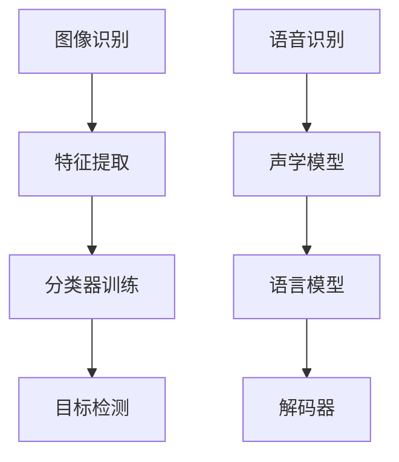

                 

# 软件应用领域：图像识别与语音识别

## 背景介绍

### 图像识别

图像识别是计算机视觉的一个重要分支，其目标是让计算机能够识别和理解图像中的内容。这一技术自20世纪70年代以来得到了迅速发展，随着计算能力的提升和算法的改进，图像识别在各个领域得到了广泛应用，如安防监控、医疗诊断、自动驾驶等。

### 语音识别

语音识别是指让计算机能够识别和理解人类语音的技术。语音识别的起源可以追溯到20世纪50年代，早期的语音识别系统主要依赖于有限词汇量和小规模语音库。随着深度学习技术的发展，语音识别的准确率和效率得到了显著提高，如今在智能助手、客服系统、语音翻译等领域得到了广泛应用。

## 核心概念与联系

### 图像识别

#### 主要概念

1. **特征提取**：从图像中提取具有区分性的特征，如边缘、纹理、颜色等。
2. **分类器训练**：使用大量的标注图像训练分类器，以识别图像中的目标。
3. **目标检测**：定位图像中的目标并识别其类别。

#### 架构

1. **卷积神经网络（CNN）**：CNN是图像识别的核心技术，通过多层卷积和池化操作提取图像特征。
2. **深度学习框架**：如TensorFlow、PyTorch等，提供了丰富的API和工具，方便实现和训练CNN模型。

### 语音识别

#### 主要概念

1. **声学模型**：用于建模语音信号中的声学特征。
2. **语言模型**：用于建模句子中单词的组合概率。
3. **解码器**：将声学模型和语言模型结合，生成最优的语音识别结果。

#### 架构

1. **隐马尔可夫模型（HMM）**：早期的语音识别模型，基于状态转移概率和观察概率。
2. **深度神经网络（DNN）**：用于构建声学模型和语言模型，提高语音识别的准确率。
3. **循环神经网络（RNN）**：用于处理序列数据，如语音信号和文本。

### Mermaid 流程图



## 核心算法原理 & 具体操作步骤

### 图像识别

1. **数据预处理**：包括图像缩放、裁剪、归一化等，以适应模型输入要求。
2. **特征提取**：使用卷积神经网络提取图像特征，如图像的边缘、纹理等。
3. **分类器训练**：使用大量的标注图像训练分类器，以识别图像中的目标。
4. **模型评估**：使用测试集评估模型的性能，如准确率、召回率等。
5. **模型部署**：将训练好的模型部署到实际应用中，如安防监控、医疗诊断等。

### 语音识别

1. **语音信号预处理**：包括去除噪声、分帧、加窗等，以提取语音信号的特征。
2. **声学模型训练**：使用大量的语音数据训练声学模型，如深度神经网络。
3. **语言模型训练**：使用大量的文本数据训练语言模型，如n-gram模型。
4. **解码器训练**：使用声学模型和语言模型训练解码器，如RNN模型。
5. **模型评估与优化**：使用测试集评估模型的性能，并优化模型参数。
6. **模型部署**：将训练好的模型部署到实际应用中，如智能助手、客服系统等。

## 数学模型和公式 & 详细讲解 & 举例说明

### 图像识别

#### 卷积神经网络（CNN）

卷积神经网络是一种深度学习模型，主要用于图像识别任务。其核心思想是通过多层卷积和池化操作提取图像特征。

#### 公式

$$
\text{卷积操作：} \quad (f * g)(x, y) = \sum_{i, j} f(i, j) \cdot g(x-i, y-j)
$$

其中，$f$和$g$分别表示卷积核和输入图像，$(x, y)$表示卷积操作的坐标。

#### 举例说明

假设我们有一个$3 \times 3$的卷积核和一张$5 \times 5$的输入图像，进行一次卷积操作。

$$
\begin{array}{ccc}
\text{卷积核：} & \begin{array}{ccc}
1 & 0 & 1 \\
1 & 0 & 1 \\
1 & 0 & 1 \\
\end{array} \\
\text{输入图像：} & \begin{array}{ccc}
1 & 1 & 1 \\
1 & 1 & 1 \\
1 & 1 & 1 \\
\end{array} \\
\text{卷积结果：} & \begin{array}{ccc}
2 & 1 & 2 \\
2 & 1 & 2 \\
2 & 1 & 2 \\
\end{array} \\
\end{array}
$$

### 语音识别

#### 隐马尔可夫模型（HMM）

隐马尔可夫模型是一种统计模型，用于描述序列数据。在语音识别中，HMM用于建模语音信号中的声学特征。

#### 公式

$$
\begin{aligned}
\pi_1 &= \pi(1) = P(X_1 = 1) \\
\pi_i &= \pi(i) = P(X_1 = i) \\
b_i(j) &= b(i, j) = P(Y_t = j | X_t = i) \\
a_{ij} &= a(i, j) = P(X_{t+1} = j | X_t = i) \\
\end{aligned}
$$

其中，$\pi$表示初始状态概率分布，$b$表示观察概率分布，$a$表示状态转移概率分布。

#### 举例说明

假设我们有一个三状态HMM，状态转移概率分布为：

$$
\begin{array}{ccc}
\pi & a \\
\hline
1 & 0.5 & 0.5 \\
2 & 0.3 & 0.7 \\
3 & 0.2 & 0.8 \\
\end{array}
$$

观察概率分布为：

$$
\begin{array}{ccc}
Y & b(1) & b(2) & b(3) \\
\hline
1 & 0.6 & 0.3 & 0.1 \\
2 & 0.4 & 0.5 & 0.1 \\
3 & 0.2 & 0.3 & 0.5 \\
\end{array}
$$

给定一个观察序列$Y = [1, 2, 3, 1, 2, 3]$，我们可以使用Viterbi算法计算最优状态序列。

## 项目实战：代码实际案例和详细解释说明

### 图像识别

以下是一个使用TensorFlow实现的简单图像识别案例：

```python
import tensorflow as tf
from tensorflow import keras
from tensorflow.keras import layers

# 数据预处理
(train_images, train_labels), (test_images, test_labels) = keras.datasets.mnist.load_data()
train_images = train_images.reshape((60000, 28, 28, 1)).astype("float32") / 255
test_images = test_images.reshape((10000, 28, 28, 1)).astype("float32") / 255

# 构建模型
model = keras.Sequential([
    layers.Conv2D(32, (3, 3), activation='relu', input_shape=(28, 28, 1)),
    layers.MaxPooling2D((2, 2)),
    layers.Conv2D(64, (3, 3), activation='relu'),
    layers.MaxPooling2D((2, 2)),
    layers.Conv2D(64, (3, 3), activation='relu'),
    layers.Flatten(),
    layers.Dense(64, activation='relu'),
    layers.Dense(10, activation='softmax')
])

# 编译模型
model.compile(optimizer='adam',
              loss='sparse_categorical_crossentropy',
              metrics=['accuracy'])

# 训练模型
model.fit(train_images, train_labels, epochs=5)

# 评估模型
test_loss, test_acc = model.evaluate(test_images,  test_labels, verbose=2)
print('\nTest accuracy:', test_acc)
```

### 语音识别

以下是一个使用Kaldi框架实现的简单语音识别案例：

```bash
# 下载Kaldi框架
git clone https://github.com/kaldi-asr/kaldi.git
cd kaldi

# 安装依赖
sudo apt-get install -y make g++ automake libtool flex bison git-core subversion gperf swig libxml2-dev libxslt1-dev python-numpy python-wheel py AudioTools

# 编译Kaldi框架
./configure
make

# 使用Kaldi进行语音识别
# 假设我们有一个wav文件输入和对应的词汇表
./src/ivector/ivector-extract --num-frames=1000 --verbose=2 -w /path/to/wavfile.wav -v /path/to/ivector.mdl -m /path/to/ivector均值文件

# 解码识别结果
./src/fgmmbg/fgmmbg-decode-faster --nj=10 --beam=8 --acoustic-scale=0.1 --llr=true /path/to/fsts.gz /path/to/ivector均值文件 /path/to/decode_dir
```

## 实际应用场景

### 图像识别

1. **安防监控**：利用图像识别技术进行人脸识别、行为分析等，提高安防监控的准确性和效率。
2. **医疗诊断**：利用图像识别技术进行医学图像分析，如肿瘤检测、骨折诊断等，辅助医生进行诊断。
3. **自动驾驶**：利用图像识别技术进行路况识别、行人检测等，提高自动驾驶的安全性和稳定性。

### 语音识别

1. **智能助手**：利用语音识别技术实现人机交互，如智能音箱、智能手机等。
2. **客服系统**：利用语音识别技术实现自动客服，提高客服效率和用户体验。
3. **语音翻译**：利用语音识别和自然语言处理技术实现实时语音翻译，促进跨语言交流。

## 工具和资源推荐

### 学习资源推荐

1. **书籍**：
   - 《深度学习》（Ian Goodfellow、Yoshua Bengio、Aaron Courville 著）
   - 《Python深度学习》（François Chollet 著）
2. **论文**：
   - "A Neural Algorithm of Artistic Style"（Gatys et al., 2015）
   - "Deep Residual Learning for Image Recognition"（He et al., 2016）
3. **博客**：
   - [TensorFlow官方博客](https://www.tensorflow.org/)
   - [Kaldi官方博客](https://kaldi-asr.org/)
4. **网站**：
   - [OpenCV官网](https://opencv.org/)
   - [Kaldi官网](https://kaldi-asr.org/)

### 开发工具框架推荐

1. **TensorFlow**：谷歌开源的深度学习框架，广泛应用于图像识别、语音识别等领域。
2. **PyTorch**：Facebook开源的深度学习框架，具有灵活的动态计算图，易于实现和调试。
3. **Kaldi**：专业的语音识别工具，广泛应用于学术研究和工业应用。

### 相关论文著作推荐

1. "Speech Recognition: The State of the Art"（Deterding, 2016）
2. "Deep Learning for Speech Recognition"（Hinton et al., 2012）
3. "Convolutional Neural Networks for Speech Recognition"（Hinton et al., 2012）

## 总结：未来发展趋势与挑战

### 图像识别

1. **多模态融合**：将图像识别与其他模态（如语音、文本）融合，提高识别准确率和应用范围。
2. **实时处理**：提高图像识别的实时性，满足自动驾驶、实时监控等领域的需求。
3. **隐私保护**：在处理个人隐私数据时，加强隐私保护措施，确保用户隐私安全。

### 语音识别

1. **低资源场景**：提高语音识别在低资源场景（如噪音、小语种）的准确率和鲁棒性。
2. **跨语言语音识别**：实现高效的跨语言语音识别，促进全球范围内的跨语言交流。
3. **人工智能伦理**：关注人工智能在语音识别领域中的伦理问题，确保技术的合理和公正使用。

## 附录：常见问题与解答

### 图像识别

1. **Q：图像识别的准确率如何提高？**
   - **A**：可以通过增加数据量、改进模型架构、优化训练策略等方式提高图像识别的准确率。

2. **Q：图像识别在医疗诊断中的应用有哪些？**
   - **A**：图像识别在医疗诊断中可以用于肿瘤检测、骨折诊断、视网膜病变检测等，辅助医生进行诊断。

### 语音识别

1. **Q：语音识别的准确率如何提高？**
   - **A**：可以通过增加数据量、改进模型架构、优化声学模型和语言模型等手段提高语音识别的准确率。

2. **Q：语音识别在智能助手中的应用有哪些？**
   - **A**：语音识别在智能助手中的应用包括语音指令识别、语音问答、语音翻译等，提高人机交互的体验。

## 扩展阅读 & 参考资料

1. **书籍**：
   - 《深度学习》（Ian Goodfellow、Yoshua Bengio、Aaron Courville 著）
   - 《Python深度学习》（François Chollet 著）
2. **论文**：
   - "A Neural Algorithm of Artistic Style"（Gatys et al., 2015）
   - "Deep Residual Learning for Image Recognition"（He et al., 2016）
3. **网站**：
   - [TensorFlow官方博客](https://www.tensorflow.org/)
   - [Kaldi官方博客](https://kaldi-asr.org/)
4. **在线课程**：
   - [Google深度学习课程](https://www.coursera.org/specializations/deeplearning)
   - [Kaldi在线教程](https://kaldi-asr.org/tutorials.html)

### 作者

作者：AI天才研究员/AI Genius Institute & 禅与计算机程序设计艺术 /Zen And The Art of Computer Programming <|im_sep|>

