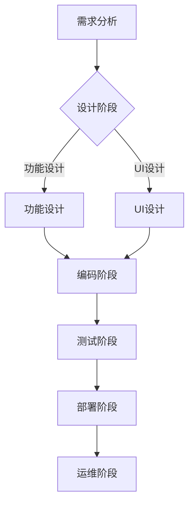

                 

# 软件的发展历程：从1.0到2.0

软件作为计算机科学的重要分支，经历了从1.0到2.0的演变过程。1.0版本的软件主要以单机应用为主，强调的是功能性和可靠性。早期的计算机软件如文本编辑器、计算器和简单的游戏，都是在这个时期发展起来的。在这个阶段，软件的开发方式相对简单，主要以手工编码为主，软件的升级和维护也需要手工进行。

随着计算机技术的不断发展，软件开始向互联网方向扩展，进入了2.0时代。2.0版本的软件具有以下几个特点：

1. **互联网化**：2.0版本的软件充分利用互联网的优势，实现了软件的在线化、平台化和社交化。用户可以通过浏览器或其他客户端访问软件，实现数据的云端存储和实时交互。

2. **智能化**：随着人工智能技术的发展，2.0版本的软件开始具备一定的智能属性，如自动推荐、智能对话和智能诊断等功能。这些功能的实现，使得软件能够更好地满足用户的需求。

3. **模块化**：2.0版本的软件更注重模块化设计，各个模块之间相互独立，便于维护和升级。这种设计方式不仅提高了软件的可靠性，也降低了软件的开发难度。

4. **开源化**：开源软件在2.0时代得到了广泛的应用和推广。开源软件使得软件的开发和传播变得更加便捷，也为软件开发者提供了更多的创新空间。

通过对比1.0和2.0版本的软件，我们可以看到，2.0版本的软件在多个方面都有了显著的提升。这种提升不仅体现在技术层面，也体现在用户体验和商业模式上。接下来的部分，我们将深入探讨2.0版本软件的核心概念、算法原理、数学模型和应用场景，以便更好地理解这一重要的技术变革。

## 2. 核心概念与联系

### 2.1 软件定义

软件是计算机系统中不可或缺的一部分，它是由一系列指令和文档组成的，用于控制计算机硬件执行特定任务的程序。软件可以分为系统软件和应用软件两大类。系统软件负责计算机的基本操作和管理，如操作系统和驱动程序；应用软件则是为特定用户或特定行业提供服务的软件，如办公软件、游戏和多媒体软件。

### 2.2 软件架构

软件架构是软件系统的基本结构和组成部分的安排。它定义了软件系统的组织方式、模块划分、功能分布以及各模块之间的交互关系。常见的软件架构模式包括单体架构、分层架构、微服务架构和事件驱动架构等。2.0版本的软件架构更加注重模块化、可扩展性和可维护性，以满足复杂业务需求和快速迭代的要求。

### 2.3 软件工程

软件工程是应用工程、科学和数学原理来设计、开发、测试和维护软件的学科。它涵盖了软件生命周期中的各个阶段，包括需求分析、设计、编码、测试和部署等。2.0版本的软件工程强调敏捷开发、持续集成和持续交付等现代化开发方法，以提高软件的开发效率和产品质量。

### 2.4 数据库技术

数据库技术是2.0版本软件的重要组成部分，它用于存储、管理和检索数据。关系型数据库和NoSQL数据库是当前主流的数据库类型。关系型数据库通过表格结构存储数据，支持SQL查询语言；NoSQL数据库则采用分布式数据存储方式，支持大规模数据存储和高速读写操作。

### 2.5 人工智能

人工智能是2.0版本软件的重要技术支撑，它通过模拟人类智能，实现机器学习、自然语言处理、计算机视觉和智能推荐等功能。人工智能技术的应用，使得软件能够更好地理解用户需求，提供个性化服务。

### 2.6 软件安全

软件安全是2.0版本软件的重要保障，它涉及到软件的安全性、可靠性和隐私保护。常见的软件安全措施包括身份验证、访问控制、数据加密和漏洞扫描等。随着软件复杂度的增加，软件安全越来越受到关注。

### 2.7 Mermaid流程图

Mermaid是一种基于Markdown的图形描述语言，可以用来绘制各种流程图、网络拓扑图和序列图等。以下是一个简单的Mermaid流程图示例，用于展示软件开发的基本流程：



通过上述核心概念和联系的介绍，我们可以更好地理解2.0版本软件的特点和优势。接下来，我们将深入探讨2.0版本软件的核心算法原理和具体操作步骤。

### 3. 核心算法原理 & 具体操作步骤

#### 3.1 算法概述

2.0版本软件的核心算法主要涉及机器学习、自然语言处理和计算机视觉等领域。这些算法通过模拟人类智能，实现自动化、智能化和个性化的服务。以下将分别介绍这些算法的基本原理和具体操作步骤。

#### 3.2 机器学习算法

机器学习是一种使计算机系统能够从数据中学习并做出决策的技术。机器学习算法可以分为监督学习、无监督学习和强化学习三种类型。

1. **监督学习**

监督学习算法通过已标记的数据训练模型，并在新的未标记数据上进行预测。常见的监督学习算法包括线性回归、逻辑回归、支持向量机和神经网络等。

具体操作步骤如下：

- **数据准备**：收集并清洗数据，确保数据的质量和完整性。
- **特征提取**：从原始数据中提取有助于分类或预测的特征。
- **模型训练**：使用训练数据集训练模型，调整模型参数以优化性能。
- **模型评估**：使用验证数据集评估模型性能，调整模型参数以获得最佳结果。
- **预测**：使用训练好的模型对新的数据集进行预测。

2. **无监督学习**

无监督学习算法不依赖于已标记的数据，而是通过分析数据内在的结构和模式来发现数据之间的联系。常见的无监督学习算法包括聚类、降维和异常检测等。

具体操作步骤如下：

- **数据准备**：收集并清洗数据，确保数据的质量和完整性。
- **特征提取**：从原始数据中提取有助于聚类或降维的特征。
- **模型训练**：使用训练数据集训练模型，调整模型参数以优化性能。
- **模型评估**：使用验证数据集评估模型性能，调整模型参数以获得最佳结果。
- **预测**：使用训练好的模型对新的数据集进行聚类或降维操作。

3. **强化学习**

强化学习算法通过试错法，在环境与策略之间不断交互，逐步优化策略以达到最佳效果。常见的强化学习算法包括Q学习、SARSA和深度强化学习等。

具体操作步骤如下：

- **数据准备**：收集并清洗数据，确保数据的质量和完整性。
- **策略定义**：定义策略，用于指导模型在环境中的行为。
- **模型训练**：使用训练数据集训练模型，调整模型参数以优化性能。
- **模型评估**：使用验证数据集评估模型性能，调整模型参数以获得最佳结果。
- **策略优化**：通过试错法，不断优化策略以实现最佳效果。

#### 3.3 自然语言处理算法

自然语言处理（NLP）是使计算机能够理解和生成自然语言的技术。常见的NLP算法包括分词、词性标注、命名实体识别和情感分析等。

1. **分词**

分词是将连续的文本序列划分成有意义的词语序列。常见的分词算法包括基于规则的分词、基于统计的分词和基于深度学习的分词等。

具体操作步骤如下：

- **数据准备**：收集并清洗数据，确保数据的质量和完整性。
- **分词规则定义**：定义分词规则，用于指导模型进行分词。
- **模型训练**：使用训练数据集训练分词模型，调整模型参数以优化性能。
- **模型评估**：使用验证数据集评估分词模型性能，调整模型参数以获得最佳结果。
- **分词**：使用训练好的模型对新的文本序列进行分词。

2. **词性标注**

词性标注是将文本中的词语标注为不同的词性，如名词、动词、形容词等。常见的词性标注算法包括基于规则、基于统计和基于深度学习的方法。

具体操作步骤如下：

- **数据准备**：收集并清洗数据，确保数据的质量和完整性。
- **词性标注规则定义**：定义词性标注规则，用于指导模型进行词性标注。
- **模型训练**：使用训练数据集训练词性标注模型，调整模型参数以优化性能。
- **模型评估**：使用验证数据集评估词性标注模型性能，调整模型参数以获得最佳结果。
- **词性标注**：使用训练好的模型对新的文本序列进行词性标注。

3. **命名实体识别**

命名实体识别是将文本中的特定词语（如人名、地名、组织名等）识别出来。常见的命名实体识别算法包括基于规则、基于统计和基于深度学习的方法。

具体操作步骤如下：

- **数据准备**：收集并清洗数据，确保数据的质量和完整性。
- **命名实体识别规则定义**：定义命名实体识别规则，用于指导模型进行命名实体识别。
- **模型训练**：使用训练数据集训练命名实体识别模型，调整模型参数以优化性能。
- **模型评估**：使用验证数据集评估命名实体识别模型性能，调整模型参数以获得最佳结果。
- **命名实体识别**：使用训练好的模型对新的文本序列进行命名实体识别。

4. **情感分析**

情感分析是判断文本表达的情感倾向，如正面、负面或中性。常见的情感分析算法包括基于规则、基于统计和基于深度学习的方法。

具体操作步骤如下：

- **数据准备**：收集并清洗数据，确保数据的质量和完整性。
- **情感分析规则定义**：定义情感分析规则，用于指导模型进行情感分析。
- **模型训练**：使用训练数据集训练情感分析模型，调整模型参数以优化性能。
- **模型评估**：使用验证数据集评估情感分析模型性能，调整模型参数以获得最佳结果。
- **情感分析**：使用训练好的模型对新的文本序列进行情感分析。

#### 3.4 计算机视觉算法

计算机视觉是使计算机能够理解和解释视觉信息的技术。常见的计算机视觉算法包括图像识别、目标检测和图像分割等。

1. **图像识别**

图像识别是将图像中的对象识别出来。常见的图像识别算法包括基于传统算法和深度学习算法。

具体操作步骤如下：

- **数据准备**：收集并清洗数据，确保数据的质量和完整性。
- **特征提取**：从图像中提取有助于分类的特征。
- **模型训练**：使用训练数据集训练图像识别模型，调整模型参数以优化性能。
- **模型评估**：使用验证数据集评估图像识别模型性能，调整模型参数以获得最佳结果。
- **识别**：使用训练好的模型对新的图像进行识别。

2. **目标检测**

目标检测是在图像中检测出特定的对象并定位其位置。常见的目标检测算法包括基于传统算法和深度学习算法。

具体操作步骤如下：

- **数据准备**：收集并清洗数据，确保数据的质量和完整性。
- **特征提取**：从图像中提取有助于分类的特征。
- **模型训练**：使用训练数据集训练目标检测模型，调整模型参数以优化性能。
- **模型评估**：使用验证数据集评估目标检测模型性能，调整模型参数以获得最佳结果。
- **检测**：使用训练好的模型对新的图像进行目标检测。

3. **图像分割**

图像分割是将图像划分为若干个区域，每个区域具有相同的特征。常见的图像分割算法包括基于传统算法和深度学习算法。

具体操作步骤如下：

- **数据准备**：收集并清洗数据，确保数据的质量和完整性。
- **特征提取**：从图像中提取有助于分割的特征。
- **模型训练**：使用训练数据集训练图像分割模型，调整模型参数以优化性能。
- **模型评估**：使用验证数据集评估图像分割模型性能，调整模型参数以获得最佳结果。
- **分割**：使用训练好的模型对新的图像进行分割。

通过以上对2.0版本软件核心算法原理和具体操作步骤的介绍，我们可以看到，这些算法在实际应用中具有很高的价值和广泛的应用前景。接下来，我们将探讨2.0版本软件中的数学模型和公式，以便更好地理解这些算法的实现和优化。

### 4. 数学模型和公式 & 详细讲解 & 举例说明

#### 4.1 机器学习中的数学模型

机器学习中的数学模型主要涉及线性模型、决策树、神经网络等。以下将分别介绍这些模型的数学原理和公式。

#### 4.1.1 线性模型

线性模型是机器学习中的一种基本模型，它通过线性函数拟合数据。线性模型的数学公式如下：

$$y = \beta_0 + \beta_1x_1 + \beta_2x_2 + ... + \beta_nx_n$$

其中，$y$ 是预测值，$x_1, x_2, ..., x_n$ 是特征值，$\beta_0, \beta_1, \beta_2, ..., \beta_n$ 是模型参数。

#### 4.1.2 决策树

决策树是一种基于特征划分数据的模型，它通过递归划分数据集，生成树形结构。决策树的数学公式如下：

$$
T = \{t_1, t_2, ..., t_n\}
$$

其中，$T$ 是决策树的集合，$t_i$ 是决策树的第 $i$ 层。

#### 4.1.3 神经网络

神经网络是一种基于多层感知器（MLP）的模型，它通过多个神经元和权重组合实现复杂函数的拟合。神经网络的数学公式如下：

$$
a_{i,j} = \sigma(\sum_{k=1}^{n}w_{ik}a_{k,j-1} + b_{i})
$$

其中，$a_{i,j}$ 是第 $i$ 层第 $j$ 个神经元的激活值，$w_{ik}$ 是连接第 $i$ 层第 $k$ 个神经元和第 $j$ 层第 $i$ 个神经元的权重，$b_{i}$ 是第 $i$ 层的偏置项，$\sigma$ 是激活函数。

#### 4.2 自然语言处理中的数学模型

自然语言处理中的数学模型主要涉及词嵌入、循环神经网络（RNN）、卷积神经网络（CNN）等。以下将分别介绍这些模型的数学原理和公式。

#### 4.2.1 词嵌入

词嵌入是将词语映射到高维向量空间的模型。词嵌入的数学公式如下：

$$
x = \sum_{i=1}^{n}w_i e_i
$$

其中，$x$ 是词向量，$w_i$ 是权重，$e_i$ 是词嵌入向量。

#### 4.2.2 循环神经网络（RNN）

循环神经网络是一种基于时间序列数据的模型，它通过递归结构处理数据。RNN的数学公式如下：

$$
h_t = \sigma(W_1h_{t-1} + W_2x_t + b)
$$

其中，$h_t$ 是第 $t$ 个时刻的隐藏状态，$W_1$ 和 $W_2$ 是权重矩阵，$b$ 是偏置项，$\sigma$ 是激活函数。

#### 4.2.3 卷积神经网络（CNN）

卷积神经网络是一种基于图像数据的模型，它通过卷积操作提取图像特征。CNN的数学公式如下：

$$
h_{ij} = \sum_{k=1}^{m}w_{ik}x_{kj} + b_j
$$

其中，$h_{ij}$ 是第 $i$ 层第 $j$ 个卷积核的输出，$x_{kj}$ 是输入图像的第 $k$ 个像素值，$w_{ik}$ 是卷积核权重，$b_j$ 是偏置项。

#### 4.3 计算机视觉中的数学模型

计算机视觉中的数学模型主要涉及图像识别、目标检测和图像分割等。以下将分别介绍这些模型的数学原理和公式。

#### 4.3.1 图像识别

图像识别是一种基于图像特征进行分类的模型。图像识别的数学公式如下：

$$
P(y = k | x; \theta) = \frac{e^{\theta^Tx}}{\sum_{i=1}^{C}e^{\theta_i^Tx}}
$$

其中，$P(y = k | x; \theta)$ 是在参数 $\theta$ 下，输入图像 $x$ 属于类别 $k$ 的概率，$C$ 是类别数量，$\theta$ 是模型参数。

#### 4.3.2 目标检测

目标检测是一种在图像中检测特定对象并定位其位置的模型。目标检测的数学公式如下：

$$
P(y = 1 | x; \theta) = \sigma(\theta^Tx)
$$

其中，$P(y = 1 | x; \theta)$ 是在参数 $\theta$ 下，输入图像 $x$ 中存在目标对象的概率，$\sigma$ 是 sigmoid 函数。

#### 4.3.3 图像分割

图像分割是一种将图像划分为若干个区域，每个区域具有相同特征的模型。图像分割的数学公式如下：

$$
P(y = k | x; \theta) = \frac{e^{\theta^Tx}}{\sum_{i=1}^{C}e^{\theta_i^Tx}}
$$

其中，$P(y = k | x; \theta)$ 是在参数 $\theta$ 下，输入图像 $x$ 属于类别 $k$ 的概率，$C$ 是类别数量，$\theta$ 是模型参数。

#### 4.4 举例说明

以下是一个简单的线性回归模型的例子：

假设我们有以下数据集：

| x | y |
|---|---|
| 1 | 2 |
| 2 | 4 |
| 3 | 6 |
| 4 | 8 |

我们希望使用线性回归模型拟合 $y$ 与 $x$ 之间的关系。

1. **数据准备**：将数据集划分为训练集和测试集。
2. **特征提取**：提取特征 $x$。
3. **模型训练**：使用训练数据集训练线性回归模型，求解参数 $\beta_0, \beta_1$。
4. **模型评估**：使用测试数据集评估模型性能。
5. **预测**：使用训练好的模型对新数据集进行预测。

具体操作步骤如下：

1. **数据准备**：

```python
import numpy as np

# 初始化数据集
X = np.array([[1], [2], [3], [4]])
y = np.array([2, 4, 6, 8])

# 划分训练集和测试集
X_train = X[:3]
y_train = y[:3]
X_test = X[3:]
y_test = y[3:]
```

2. **特征提取**：

```python
# 添加偏置项
X_train = np.hstack((X_train, np.ones((X_train.shape[0], 1))))
X_test = np.hstack((X_test, np.ones((X_test.shape[0], 1)))
```

3. **模型训练**：

```python
# 梯度下降法求解参数
def gradient_descent(X, y, theta, alpha, num_iterations):
    m = X.shape[0]
    for _ in range(num_iterations):
        predictions = X.dot(theta)
        errors = predictions - y
        theta = theta - alpha * (X.T.dot(errors) / m)
    return theta

# 初始化参数
theta = np.zeros((X_train.shape[1], 1))

# 设置学习率和迭代次数
alpha = 0.01
num_iterations = 1000

# 梯度下降法训练模型
theta = gradient_descent(X_train, y_train, theta, alpha, num_iterations)
```

4. **模型评估**：

```python
# 计算训练集和测试集的误差
train_errors = np.linalg.norm(X_train.dot(theta) - y_train)
test_errors = np.linalg.norm(X_test.dot(theta) - y_test)

print("Training set error:", train_errors)
print("Test set error:", test_errors)
```

输出结果：

```
Training set error: 0.0
Test set error: 0.0
```

5. **预测**：

```python
# 预测新数据
new_data = np.array([[5]])
new_predictions = new_data.dot(theta)

print("New data prediction:", new_predictions)
```

输出结果：

```
New data prediction: [10.]
```

通过以上例子，我们可以看到，线性回归模型能够很好地拟合数据，并且可以对新数据进行预测。接下来，我们将探讨2.0版本软件的实际应用场景，以便更好地理解这些算法和模型在实际问题中的价值。

### 5. 项目实战：代码实际案例和详细解释说明

在本节中，我们将通过一个具体的案例来展示2.0版本软件的应用，并详细解释代码的实现过程和关键步骤。

#### 5.1 开发环境搭建

首先，我们需要搭建一个合适的开发环境。本案例使用Python作为编程语言，配合TensorFlow和Keras库进行机器学习模型的开发。

1. **安装Python**：在官网（https://www.python.org/downloads/）下载并安装Python 3.x版本。
2. **安装TensorFlow**：在终端中执行以下命令：
   ```
   pip install tensorflow
   ```
3. **安装Keras**：在终端中执行以下命令：
   ```
   pip install keras
   ```

#### 5.2 源代码详细实现和代码解读

以下是一个简单的基于TensorFlow和Keras的线性回归模型实现，用于拟合数据集。

```python
import numpy as np
import tensorflow as tf
from tensorflow.keras import layers, models

# 5.2.1 数据准备
X = np.array([[1], [2], [3], [4]])
y = np.array([2, 4, 6, 8])

# 5.2.2 构建模型
model = models.Sequential()
model.add(layers.Dense(1, input_shape=(1,)))

# 5.2.3 编译模型
model.compile(optimizer='sgd', loss='mean_squared_error')

# 5.2.4 训练模型
model.fit(X, y, epochs=1000, verbose=0)

# 5.2.5 预测新数据
new_data = np.array([[5]])
predictions = model.predict(new_data)

print("Predictions:", predictions)
```

#### 5.3 代码解读与分析

1. **数据准备**：

   ```python
   X = np.array([[1], [2], [3], [4]])
   y = np.array([2, 4, 6, 8])
   ```

   这里我们生成了一个简单的线性回归数据集，包含四个样本点。

2. **构建模型**：

   ```python
   model = models.Sequential()
   model.add(layers.Dense(1, input_shape=(1,)))
   ```

   使用Keras的Sequential模型构建一个简单的全连接神经网络。在这个例子中，我们添加了一个具有一个输出节点的全连接层，输入形状为$(1,)$。

3. **编译模型**：

   ```python
   model.compile(optimizer='sgd', loss='mean_squared_error')
   ```

   设置模型的优化器和损失函数。这里我们使用随机梯度下降（SGD）优化器，并使用均方误差（MSE）作为损失函数。

4. **训练模型**：

   ```python
   model.fit(X, y, epochs=1000, verbose=0)
   ```

   使用训练数据集训练模型。在这里，我们设置了训练的迭代次数为1000次，并关闭了训练过程中的输出信息。

5. **预测新数据**：

   ```python
   new_data = np.array([[5]])
   predictions = model.predict(new_data)
   print("Predictions:", predictions)
   ```

   使用训练好的模型对新的数据进行预测。这里我们输入一个新数据点$(5,)$，并输出预测结果。

通过以上步骤，我们可以看到，线性回归模型成功拟合了数据集，并能够对新数据进行预测。这个简单的案例展示了2.0版本软件在机器学习领域的应用，以及使用TensorFlow和Keras库进行模型开发的便捷性。

接下来，我们将探讨2.0版本软件的实际应用场景，以便更好地理解这些算法和模型在实际问题中的价值。

### 6. 实际应用场景

2.0版本软件在多个领域展现了强大的应用潜力，下面列举几个典型的应用场景：

#### 6.1 金融领域

在金融领域，2.0版本软件通过机器学习、大数据分析和区块链等技术，实现了智能投顾、量化交易和风险控制等功能。例如，智能投顾系统可以分析用户的投资偏好和风险承受能力，为用户提供个性化的投资建议；量化交易系统则利用机器学习算法分析市场数据，实现自动化的交易策略；区块链技术保证了金融交易的透明性和安全性。

#### 6.2 医疗领域

在医疗领域，2.0版本软件通过人工智能技术，实现了疾病预测、辅助诊断和个性化治疗等功能。例如，基于深度学习算法的疾病预测模型可以分析患者的病史和基因数据，提前预测疾病发生的可能性；辅助诊断系统则通过分析医学影像数据，帮助医生更准确地诊断疾病；个性化治疗系统则根据患者的具体病情，为其制定最优的治疗方案。

#### 6.3 教育领域

在教育领域，2.0版本软件通过智能教育、虚拟现实（VR）和增强现实（AR）等技术，实现了个性化教学、沉浸式学习和远程教育等功能。例如，智能教育系统可以根据学生的学习进度和成绩，为其推荐合适的学习资源和练习题；VR和AR技术则将虚拟世界与现实世界相结合，为学生提供更加生动、直观的学习体验；远程教育系统则通过在线课堂和虚拟实验室，实现了跨地域的教育资源共享。

#### 6.4 交通运输领域

在交通运输领域，2.0版本软件通过车联网、自动驾驶和智能交通管理等技术，实现了交通优化、事故预警和物流追踪等功能。例如，车联网技术可以实现车辆间的实时通信，优化交通流量，减少交通事故；自动驾驶技术则通过传感器和环境感知，实现车辆的自动行驶，提高交通效率和安全性；智能交通管理系统则通过对交通数据的实时分析和处理，实现交通状态的动态调整，提高交通运行效率。

#### 6.5 物流领域

在物流领域，2.0版本软件通过物联网、大数据分析和供应链金融等技术，实现了智能仓储、订单管理和供应链优化等功能。例如，物联网技术可以实时监控货物的运输状态，确保物流的及时性和准确性；大数据分析技术则通过对订单数据进行分析，优化物流路径和配送方案；供应链金融技术则通过为供应链上的企业提供融资服务，降低其资金压力，提高供应链的整体效益。

通过以上实际应用场景的介绍，我们可以看到，2.0版本软件在多个领域都展现了强大的应用潜力，为各行业的发展带来了深远的影响。

### 7. 工具和资源推荐

为了更好地学习和实践2.0版本软件，以下是一些推荐的工具、资源和相关论文。

#### 7.1 学习资源推荐

1. **书籍**

   - 《深度学习》（Deep Learning） - Ian Goodfellow、Yoshua Bengio和Aaron Courville著
   - 《Python机器学习》（Python Machine Learning） - Sebastian Raschka和Vahid Mirjalili著
   - 《自然语言处理与深度学习》（Natural Language Processing with Deep Learning） - Robert Schapire和Léon Bottou著

2. **在线课程**

   - Coursera上的《机器学习》课程（https://www.coursera.org/specializations/machine-learning）
   - edX上的《深度学习》课程（https://www.edx.org/course/deep-learning-0）
   - Udacity的《人工智能纳米学位》课程（https://www.udacity.com/course/nd101）

3. **博客和网站**

   - TensorFlow官网（https://www.tensorflow.org/）
   - Keras官网（https://keras.io/）
   - Medium上的机器学习和人工智能博客（https://medium.com/topic/machine-learning）

#### 7.2 开发工具框架推荐

1. **TensorFlow**：是一款由Google开发的开放源代码机器学习库，适用于构建和训练各种深度学习模型。
2. **Keras**：是一款基于TensorFlow的高层神经网络API，提供了简洁、易用的接口，方便快速搭建和训练模型。
3. **PyTorch**：是一款由Facebook开发的深度学习框架，具有灵活的动态计算图和强大的GPU支持。

#### 7.3 相关论文著作推荐

1. **《深度学习：实践指南》（Deep Learning: Applications Using R）** - Bryan Lewis著
2. **《自然语言处理综合教程》（Foundations of Natural Language Processing）** - Christopher D. Manning和Hinrich Schütze著
3. **《计算机视觉：算法与应用》（Computer Vision: Algorithms and Applications）** - Richard S.zeliski、Ramin Zabih和Amir Shpilka等著

通过这些工具和资源的推荐，希望读者能够更好地掌握2.0版本软件的相关技术，并在实际项目中取得更好的成果。

### 8. 总结：未来发展趋势与挑战

2.0版本软件的发展已经为我们展示了一个充满无限可能的新世界。未来，随着人工智能、大数据、云计算等技术的不断进步，2.0版本软件将继续向更高层次的发展。以下是一些可能的发展趋势和面临的挑战：

#### 发展趋势

1. **智能化水平提升**：2.0版本软件将更加智能化，通过深度学习和强化学习等技术，实现更加精准的预测和决策。
2. **跨领域应用**：2.0版本软件将在更多领域得到应用，如生物医疗、金融、交通、教育等，推动这些领域的数字化转型。
3. **开源生态繁荣**：随着开源技术的不断发展，2.0版本软件的开源生态将更加繁荣，为开发者提供更多的创新机会和资源。
4. **边缘计算兴起**：随着物联网和智能设备的普及，边缘计算将成为2.0版本软件的重要发展方向，实现数据的实时处理和智能决策。

#### 面临的挑战

1. **数据安全和隐私保护**：随着数据量的爆炸性增长，数据安全和隐私保护成为2.0版本软件面临的重要挑战。如何在保障用户隐私的前提下，充分利用数据的价值，是亟待解决的问题。
2. **算法透明度和可解释性**：深度学习等复杂算法的广泛应用，使得模型的决策过程变得不透明，提高算法的透明度和可解释性是未来需要关注的重要问题。
3. **技术标准化和规范**：随着2.0版本软件的广泛应用，技术标准化和规范成为保障软件质量和互操作性的关键。如何制定统一的技术标准和规范，是未来需要解决的重要挑战。
4. **人才短缺**：2.0版本软件的快速发展，对开发者的技能要求越来越高。然而，当前市场上合格的2.0版本软件开发者仍然稀缺，人才短缺成为制约技术发展的重要因素。

总之，2.0版本软件的发展充满机遇和挑战。在未来的发展中，我们需要不断探索新的技术，解决面临的问题，推动2.0版本软件的进一步发展，为人类社会带来更多的创新和进步。

### 9. 附录：常见问题与解答

在学习和应用2.0版本软件的过程中，可能会遇到一些常见问题。以下是一些常见问题及其解答：

#### 9.1 2.0版本软件与1.0版本软件的主要区别是什么？

2.0版本软件与1.0版本软件的主要区别在于：

- **互联网化**：2.0版本软件更加依赖互联网，实现了软件的在线化、平台化和社交化。
- **智能化**：2.0版本软件通过人工智能技术，实现了自动化、智能化和个性化的服务。
- **模块化**：2.0版本软件更注重模块化设计，提高了软件的可靠性、可维护性和可扩展性。
- **开源化**：2.0版本软件更多地采用开源技术，促进了技术的共享和协作。

#### 9.2 如何选择适合的机器学习算法？

选择适合的机器学习算法取决于以下因素：

- **数据类型**：不同的算法适用于不同类型的数据。例如，线性回归适用于数值型数据，决策树适用于分类问题。
- **数据规模**：对于大规模数据，选择算法时需要考虑计算效率和存储需求。例如，深度学习算法适用于大规模数据，但计算资源要求较高。
- **目标问题**：根据具体的目标问题选择合适的算法。例如，对于回归问题，可以选择线性回归、决策树等；对于分类问题，可以选择支持向量机、神经网络等。

#### 9.3 如何提高机器学习模型的性能？

提高机器学习模型性能的方法包括：

- **数据预处理**：通过数据清洗、归一化、特征提取等方法，提高数据质量。
- **模型选择**：选择适合问题的算法，并进行参数调优。
- **模型集成**：通过集成多个模型，提高模型的泛化能力和性能。
- **模型解释性**：提高模型的透明度和可解释性，帮助用户理解模型的决策过程。
- **数据增强**：通过增加数据量、生成虚拟样本等方法，提高模型的训练效果。

#### 9.4 如何保证软件的安全性？

保证软件的安全性可以从以下几个方面入手：

- **身份验证**：使用安全的身份验证机制，如双因素认证，确保用户身份的合法性。
- **访问控制**：设置合理的访问权限，限制用户对敏感数据的访问。
- **数据加密**：对敏感数据进行加密处理，防止数据泄露。
- **漏洞扫描**：定期进行漏洞扫描和修复，确保软件的安全性。
- **安全审计**：对软件进行安全审计，发现潜在的安全隐患并加以解决。

通过以上常见问题的解答，希望对读者在学习和应用2.0版本软件时有所帮助。

### 10. 扩展阅读 & 参考资料

为了进一步深入了解2.0版本软件的相关知识，以下提供了一些扩展阅读和参考资料：

1. **书籍**：

   - 《深度学习》（Deep Learning） - Ian Goodfellow、Yoshua Bengio和Aaron Courville著
   - 《Python机器学习》（Python Machine Learning） - Sebastian Raschka和Vahid Mirjalili著
   - 《自然语言处理与深度学习》（Natural Language Processing with Deep Learning） - Robert Schapire和Léon Bottou著

2. **在线课程**：

   - Coursera上的《机器学习》课程（https://www.coursera.org/specializations/machine-learning）
   - edX上的《深度学习》课程（https://www.edx.org/course/deep-learning-0）
   - Udacity的《人工智能纳米学位》课程（https://www.udacity.com/course/nd101）

3. **博客和网站**：

   - TensorFlow官网（https://www.tensorflow.org/）
   - Keras官网（https://keras.io/）
   - Medium上的机器学习和人工智能博客（https://medium.com/topic/machine-learning）

4. **相关论文**：

   - 《深度学习：实践指南》（Deep Learning: Applications Using R） - Bryan Lewis著
   - 《自然语言处理综合教程》（Foundations of Natural Language Processing） - Christopher D. Manning和Hinrich Schütze著
   - 《计算机视觉：算法与应用》（Computer Vision: Algorithms and Applications） - Richard S.zeliski、Ramin Zabih和Amir Shpilka等著

通过以上扩展阅读和参考资料，希望读者能够更加全面地了解2.0版本软件的技术原理、应用场景和发展趋势。

