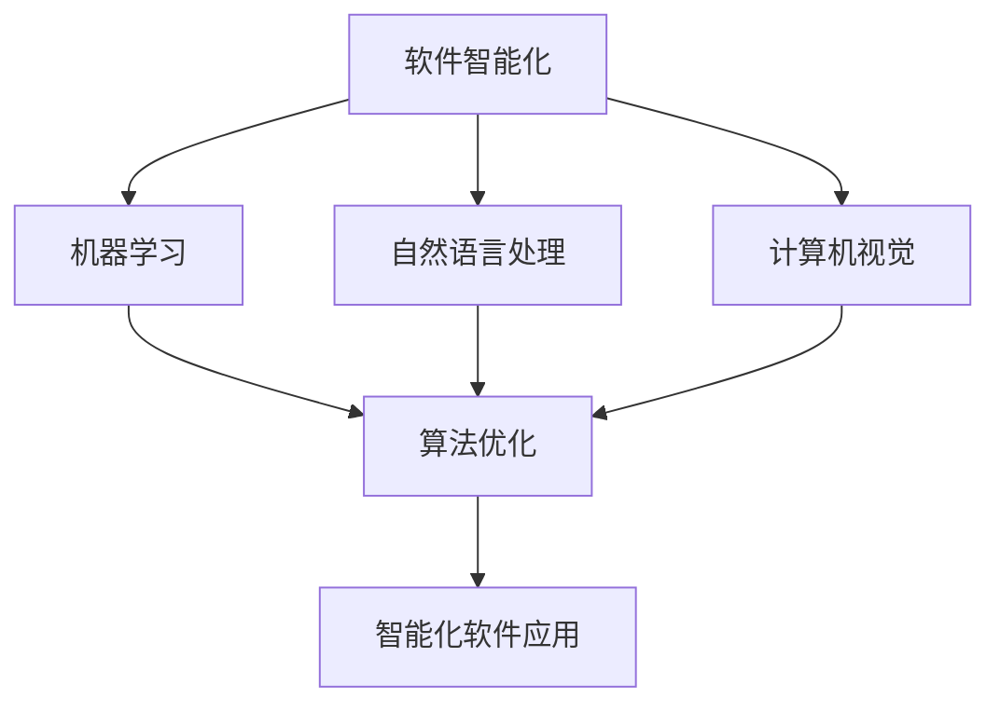
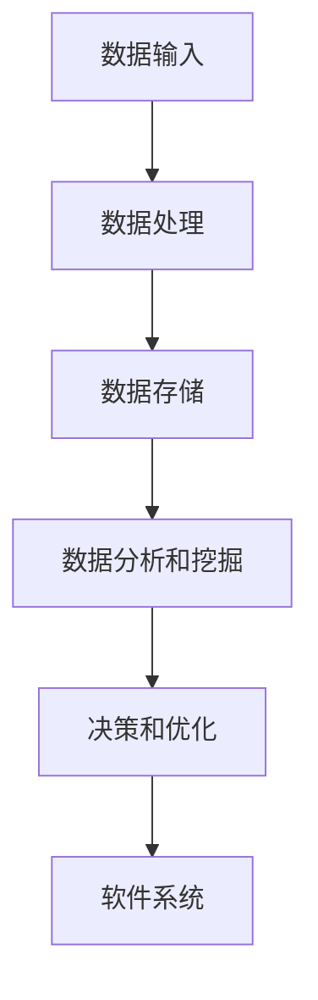
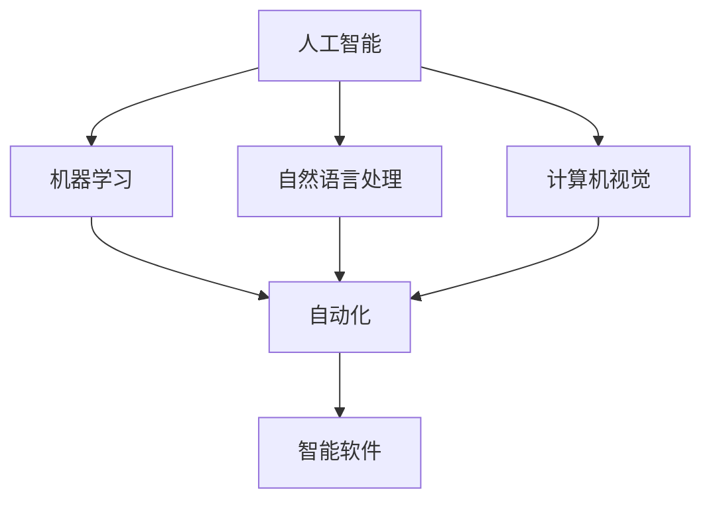
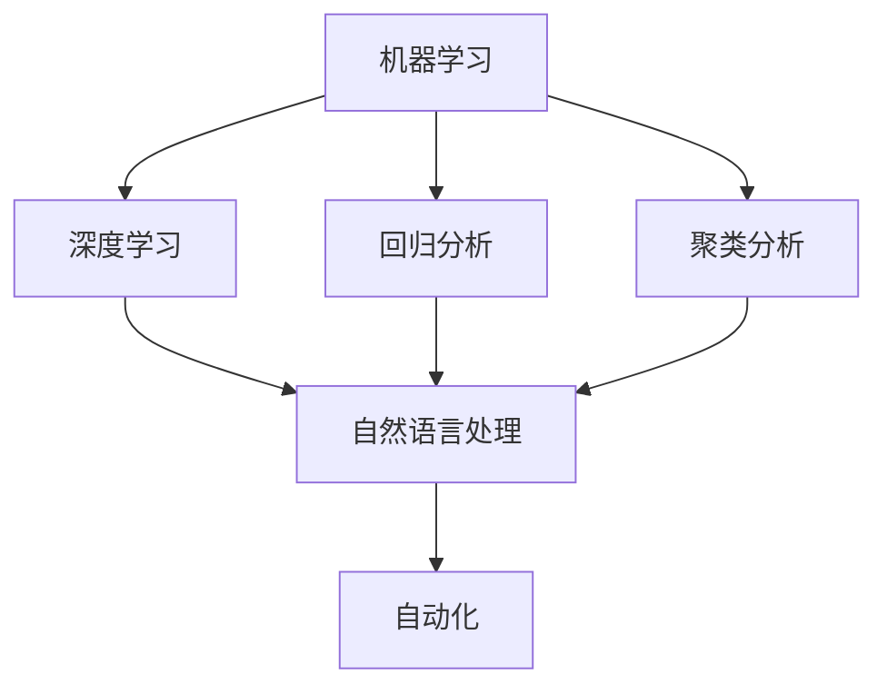
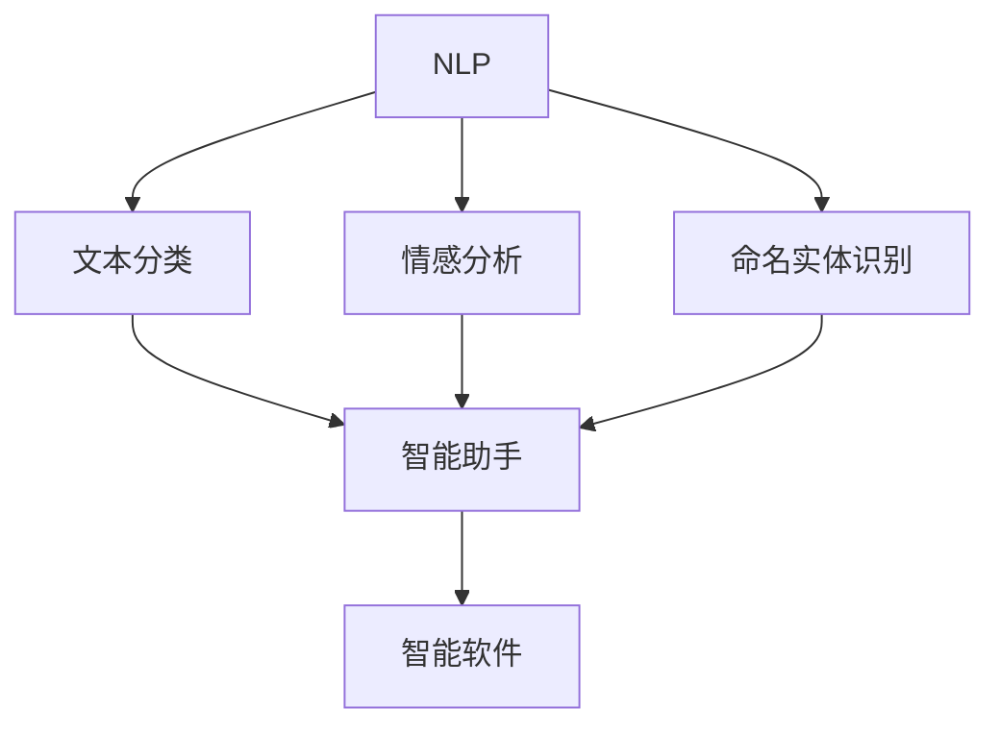
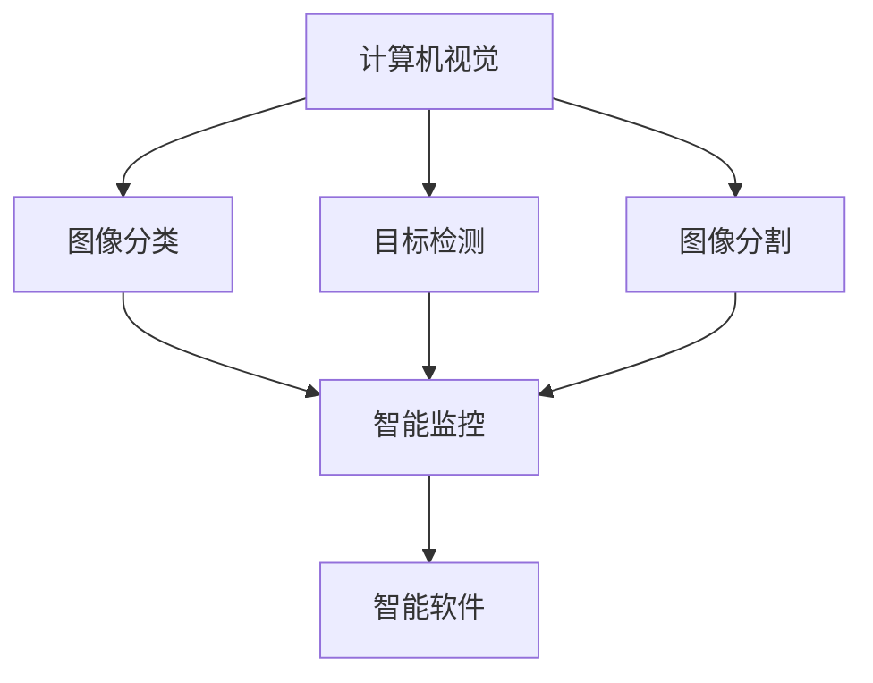
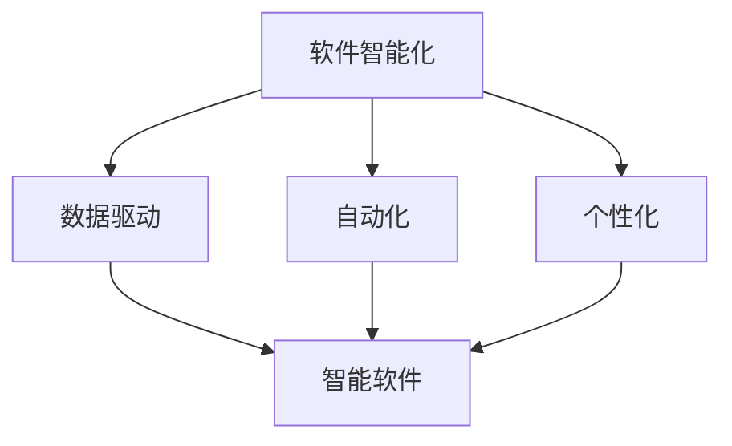

                 

### 背景介绍

#### 软件发展历程

软件的发展经历了多个阶段，从最初的机械时代到电子时代，再到如今的互联网和人工智能时代。每一个阶段都有其独特的特点和发展趋势。

1. **机械时代**：在机械时代，计算机和软件的概念尚未出现，主要的计算任务由人类和机械完成。这一阶段的软件概念相对简单，主要是用于帮助人类进行计算和记录。

2. **电子时代**：随着电子计算机的出现，软件开始逐步发展。这一阶段的软件更多地涉及到数据处理、文件管理和简单的算法实现。

3. **互联网时代**：随着互联网的普及，软件的应用场景变得更加广泛。Web应用程序、移动应用和社交媒体等都是这一阶段的典型代表。软件不再仅仅是一个工具，而成为人们日常生活和工作中不可或缺的一部分。

4. **人工智能时代**：人工智能的兴起标志着软件发展的新阶段。软件不再仅仅是执行预定义任务的工具，而是能够自我学习、自我进化和自我优化。软件2.0的概念正是在这个背景下应运而生。

#### 软件1.0与软件2.0

软件1.0时代，软件主要是由程序员手动编写和维护的。软件的功能和性能取决于程序员的技术水平和经验。这一阶段的软件特点如下：

- **以人为中心**：软件的开发和运行主要依赖于人类。
- **静态**：软件的功能和性能在开发完成后基本固定，难以进行动态调整。
- **孤立**：软件之间的交互和整合相对困难。

软件2.0时代，随着人工智能技术的发展，软件开始变得更加智能化和自动化。软件2.0的特点如下：

- **以数据为中心**：软件的功能和性能依赖于大量的数据输入和处理。
- **动态**：软件能够根据实时数据和反馈进行自我调整和优化。
- **互联互通**：软件之间能够通过API和大数据平台进行高效的数据交换和整合。

本文将围绕软件2.0的概念、核心原理、应用场景和发展趋势进行深入探讨。

关键词：软件发展历程、软件1.0、软件2.0、人工智能、软件智能化

### 核心概念与联系

#### 软件智能化

软件智能化是软件2.0的核心概念，它标志着软件从传统的被动执行任务转变为主动学习、适应和优化任务。软件智能化的实现依赖于多个技术领域的融合，包括机器学习、自然语言处理、计算机视觉等。

##### Mermaid 流程图



在这个流程图中，我们可以看到软件智能化的实现是一个跨领域的综合过程。首先，软件通过机器学习、自然语言处理和计算机视觉等技术获取和解析数据，然后对这些数据进行分析和优化，最终实现智能化软件应用。

#### 数据驱动的软件架构

软件2.0时代的另一个核心概念是数据驱动的软件架构。数据驱动的软件架构强调数据在软件系统中的核心地位，将数据视为软件系统的“血液”。在这种架构中，数据不仅是输入和输出，更是软件系统的决策依据和驱动力量。

##### Mermaid 流程图



在这个流程图中，我们可以看到数据驱动的软件架构是一个闭环系统。数据输入是整个过程的起点，经过数据处理、存储、分析和挖掘后，生成决策和优化结果，最终驱动软件系统的运行和优化。

#### 软件智能化的挑战与机遇

软件智能化带来了许多挑战，同时也带来了巨大的机遇。以下是软件智能化面临的几个主要挑战和机遇：

**挑战：**
1. **数据隐私和安全**：随着数据的广泛应用，数据隐私和安全问题日益突出。
2. **算法透明性和公平性**：机器学习算法的复杂性和不可解释性可能导致决策的不透明和偏见。
3. **计算资源需求**：大规模数据处理和模型训练需要大量的计算资源。

**机遇：**
1. **个性化服务**：基于用户数据的个性化推荐和定制服务可以大大提高用户体验。
2. **自动化和智能化**：自动化和智能化软件可以提高生产效率，降低人力成本。
3. **新的业务模式**：数据驱动的软件架构为创新业务模式和商业模式提供了新的可能性。

### 核心算法原理 & 具体操作步骤

#### 机器学习算法原理

机器学习是软件智能化的核心技术之一。机器学习算法的基本原理是通过学习大量数据中的规律和模式，从而实现数据的自动分析和预测。

**1. 监督学习（Supervised Learning）**

监督学习是一种最常见的机器学习算法，它通过对标注数据进行学习，从而实现对新数据的预测。监督学习可以分为分类问题和回归问题。

- **分类问题**：将数据分为不同的类别。例如，垃圾邮件分类、情感分析等。
- **回归问题**：预测连续的数值。例如，房价预测、股票价格预测等。

**2. 无监督学习（Unsupervised Learning）**

无监督学习不依赖于标注数据，它主要通过发现数据中的隐藏结构和模式来实现数据的分析。常见的无监督学习算法包括聚类分析和降维技术。

- **聚类分析**：将数据分为不同的群组，使得同一群组内的数据彼此相似，不同群组内的数据彼此相异。例如，客户细分、图像分割等。
- **降维技术**：通过减少数据维度，降低数据复杂度，从而提高数据处理和分析效率。常见的降维技术包括主成分分析（PCA）和t-SNE等。

**具体操作步骤：**

1. 数据收集：收集大量的标注数据或未标注数据。
2. 数据预处理：对数据进行清洗、归一化、特征提取等处理，以提高模型的准确性和泛化能力。
3. 模型选择：根据问题的类型和数据的特点选择合适的机器学习算法。
4. 模型训练：使用训练数据对模型进行训练，调整模型参数。
5. 模型评估：使用测试数据对模型进行评估，调整模型参数，以提高模型的性能。
6. 模型部署：将训练好的模型部署到实际应用中，对新的数据进行预测和分析。

#### 自然语言处理算法原理

自然语言处理（NLP）是软件智能化的重要组成部分，它主要研究如何让计算机理解和生成自然语言。NLP的核心算法包括分词、词性标注、命名实体识别、情感分析等。

**1. 分词（Tokenization）**

分词是将文本分割成单词或短语的步骤，它是NLP的基础。常见的分词方法包括基于词典的分词和基于统计的分词。

- **基于词典的分词**：利用预先构建的词典进行分词，如哈工大分词。
- **基于统计的分词**：利用统计模型进行分词，如隐马尔可夫模型（HMM）。

**2. 词性标注（Part-of-Speech Tagging）**

词性标注是对文本中的每个词进行词性分类的过程，它有助于理解文本的结构和语义。

**3. 命名实体识别（Named Entity Recognition）**

命名实体识别是识别文本中的特定实体，如人名、地名、组织名等。常见的命名实体识别算法包括基于规则的方法和基于机器学习的方法。

**4. 情感分析（Sentiment Analysis）**

情感分析是识别文本中的情感倾向，如正面、负面、中性等。常见的情感分析算法包括基于规则的方法和基于机器学习的方法。

**具体操作步骤：**

1. 数据收集：收集大量的标注数据或未标注数据。
2. 数据预处理：对数据进行清洗、归一化、特征提取等处理，以提高模型的准确性和泛化能力。
3. 模型选择：根据问题的类型和数据的特点选择合适的NLP算法。
4. 模型训练：使用训练数据对模型进行训练，调整模型参数。
5. 模型评估：使用测试数据对模型进行评估，调整模型参数，以提高模型的性能。
6. 模型部署：将训练好的模型部署到实际应用中，对新的数据进行预测和分析。

#### 计算机视觉算法原理

计算机视觉是软件智能化的重要领域，它致力于让计算机“看到”和理解图像和视频。计算机视觉的核心算法包括图像分类、目标检测、图像分割等。

**1. 图像分类（Image Classification）**

图像分类是将图像分为不同类别的过程。常见的图像分类算法包括卷积神经网络（CNN）和深度学习算法。

**2. 目标检测（Object Detection）**

目标检测是识别图像中的特定目标并定位其位置的过程。常见的目标检测算法包括基于区域提议的方法（如R-CNN系列）和基于深度学习的方法（如YOLO系列）。

**3. 图像分割（Image Segmentation）**

图像分割是将图像分割成不同区域的过程，常见的图像分割算法包括基于阈值的方法、基于边缘检测的方法和基于深度学习的方法。

**具体操作步骤：**

1. 数据收集：收集大量的标注数据或未标注数据。
2. 数据预处理：对数据进行清洗、归一化、特征提取等处理，以提高模型的准确性和泛化能力。
3. 模型选择：根据问题的类型和数据的特点选择合适的计算机视觉算法。
4. 模型训练：使用训练数据对模型进行训练，调整模型参数。
5. 模型评估：使用测试数据对模型进行评估，调整模型参数，以提高模型的性能。
6. 模型部署：将训练好的模型部署到实际应用中，对新的数据进行预测和分析。

### 数学模型和公式 & 详细讲解 & 举例说明

#### 机器学习中的常见数学模型

在机器学习中，数学模型是理解和设计算法的核心。以下是一些常见的数学模型和它们的公式，以及详细讲解。

**1. 线性回归（Linear Regression）**

线性回归是一种用于预测连续值的机器学习算法。它的目标是找到一条最佳拟合线，以预测新的数据点的值。

- **公式**：

  $$ y = \beta_0 + \beta_1x $$

  其中，\( y \) 是因变量，\( x \) 是自变量，\( \beta_0 \) 和 \( \beta_1 \) 是模型参数。

- **详细讲解**：

  线性回归的基本思想是通过最小化残差平方和来找到最佳拟合线。残差是实际值与预测值之间的差值。通过最小化这个差值，我们可以找到最佳拟合线。

- **举例说明**：

  假设我们要预测房价，自变量是房子的面积，因变量是房价。我们可以使用线性回归模型来找到最佳拟合线，进而预测新的房价。

**2. 逻辑回归（Logistic Regression）**

逻辑回归是一种用于预测类别的机器学习算法。它的目标是找到一种方法，将概率映射到0和1之间，以便预测新的数据点的类别。

- **公式**：

  $$ P(y=1) = \frac{1}{1 + e^{-(\beta_0 + \beta_1x)}} $$

  其中，\( y \) 是因变量，\( x \) 是自变量，\( \beta_0 \) 和 \( \beta_1 \) 是模型参数。

- **详细讲解**：

  逻辑回归的基本思想是通过最大化似然函数来找到最佳拟合线。似然函数描述了数据在给定模型参数下的可能性。通过最大化这个函数，我们可以找到最佳拟合线。

- **举例说明**：

  假设我们要预测客户是否会购买产品，自变量是客户的年龄和收入，因变量是购买行为。我们可以使用逻辑回归模型来预测新的客户是否会购买产品。

**3. 决策树（Decision Tree）**

决策树是一种用于分类和回归的机器学习算法。它的目标是创建一个树形结构，每个节点代表一个特征，每个分支代表一个可能的值。

- **公式**：

  $$ y = \text{分类结果} $$

  其中，\( y \) 是因变量，\( \text{分类结果} \) 是树形结构中的叶子节点。

- **详细讲解**：

  决策树的基本思想是通过递归分割数据集，找到最佳分割点，直到满足停止条件。停止条件可以是数据集的纯度达到一定阈值，或者特征不再具有显著的预测能力。

- **举例说明**：

  假设我们要分类邮件是否为垃圾邮件，特征包括邮件的主题、正文和发件人。我们可以使用决策树算法来创建一个树形结构，以分类新的邮件是否为垃圾邮件。

**4. 支持向量机（Support Vector Machine, SVM）**

支持向量机是一种用于分类和回归的机器学习算法。它的目标是找到一个超平面，将不同类别的数据点分隔开。

- **公式**：

  $$ w \cdot x + b = 0 $$

  其中，\( w \) 是超平面的法向量，\( x \) 是数据点，\( b \) 是偏置。

- **详细讲解**：

  支持向量机的基本思想是通过最大化分类边界来找到最佳超平面。分类边界是数据点之间的最小距离，通过最大化这个距离，我们可以找到最佳超平面。

- **举例说明**：

  假设我们要分类水果是否为香蕉，特征包括水果的颜色、大小和形状。我们可以使用支持向量机算法来找到一个超平面，将不同类别的水果分隔开。

#### 自然语言处理中的数学模型

在自然语言处理中，数学模型主要用于文本分类、情感分析和机器翻译等领域。以下是一些常见的数学模型和它们的公式，以及详细讲解。

**1. 朴素贝叶斯（Naive Bayes）**

朴素贝叶斯是一种用于文本分类的机器学习算法。它的目标是根据文本中的词语概率分布，预测文本的类别。

- **公式**：

  $$ P(\text{类别} | \text{词语}) = \frac{P(\text{词语} | \text{类别})P(\text{类别})}{P(\text{词语})} $$

  其中，\( P(\text{类别} | \text{词语}) \) 是在给定词语的情况下预测类别的概率，\( P(\text{词语} | \text{类别}) \) 是在给定类别的情况下预测词语的概率，\( P(\text{类别}) \) 是类别的概率，\( P(\text{词语}) \) 是词语的概率。

- **详细讲解**：

  朴素贝叶斯算法的基本思想是根据贝叶斯定理，通过计算每个词语在各个类别下的概率，并结合这些概率预测文本的类别。朴素贝叶斯算法的假设是词语之间相互独立，即每个词语的概率只与类别有关，与其他词语无关。

- **举例说明**：

  假设我们要分类新闻文章的类别，特征包括文章中的词语。我们可以使用朴素贝叶斯算法来预测新的新闻文章的类别。

**2. 递归神经网络（Recurrent Neural Network, RNN）**

递归神经网络是一种用于序列数据的机器学习算法。它的目标是捕获序列数据中的时间和上下文信息。

- **公式**：

  $$ h_t = \text{ReLU}(W_hh \cdot h_{t-1} + W_xh \cdot x_t + b_h) $$

  其中，\( h_t \) 是当前时刻的隐藏状态，\( W_hh \) 和 \( W_xh \) 是权重矩阵，\( b_h \) 是偏置项，\( x_t \) 是当前时刻的输入。

- **详细讲解**：

  递归神经网络的基本思想是使用隐藏状态 \( h_{t-1} \) 和当前输入 \( x_t \) 来计算当前时刻的隐藏状态 \( h_t \)。递归神经网络通过这种方式捕获序列数据中的时间和上下文信息。

- **举例说明**：

  假设我们要对句子进行情感分析，特征包括句子中的词语。我们可以使用递归神经网络来分析句子的情感。

**3. 卷积神经网络（Convolutional Neural Network, CNN）**

卷积神经网络是一种用于图像分类的机器学习算法。它的目标是捕获图像中的局部特征。

- **公式**：

  $$ h_t = \text{ReLU}(W_hh \cdot h_{t-1} + W_xh \cdot x_t + b_h) $$

  其中，\( h_t \) 是当前时刻的隐藏状态，\( W_hh \) 和 \( W_xh \) 是权重矩阵，\( b_h \) 是偏置项，\( x_t \) 是当前时刻的输入。

- **详细讲解**：

  卷积神经网络的基本思想是通过卷积操作捕获图像中的局部特征。卷积神经网络通过堆叠多个卷积层和池化层，可以提取出更高层次的特征。

- **举例说明**：

  假设我们要对图像进行分类，特征包括图像中的像素值。我们可以使用卷积神经网络来分类新的图像。

#### 计算机视觉中的数学模型

在计算机视觉中，数学模型主要用于图像分类、目标检测和图像分割等领域。以下是一些常见的数学模型和它们的公式，以及详细讲解。

**1. 卷积神经网络（Convolutional Neural Network, CNN）**

卷积神经网络是一种用于图像分类的机器学习算法。它的目标是捕获图像中的局部特征。

- **公式**：

  $$ h_t = \text{ReLU}(W_hh \cdot h_{t-1} + W_xh \cdot x_t + b_h) $$

  其中，\( h_t \) 是当前时刻的隐藏状态，\( W_hh \) 和 \( W_xh \) 是权重矩阵，\( b_h \) 是偏置项，\( x_t \) 是当前时刻的输入。

- **详细讲解**：

  卷积神经网络的基本思想是通过卷积操作捕获图像中的局部特征。卷积神经网络通过堆叠多个卷积层和池化层，可以提取出更高层次的特征。

- **举例说明**：

  假设我们要对图像进行分类，特征包括图像中的像素值。我们可以使用卷积神经网络来分类新的图像。

**2. 支持向量机（Support Vector Machine, SVM）**

支持向量机是一种用于图像分类的机器学习算法。它的目标是找到一个超平面，将不同类别的图像分隔开。

- **公式**：

  $$ w \cdot x + b = 0 $$

  其中，\( w \) 是超平面的法向量，\( x \) 是图像特征，\( b \) 是偏置。

- **详细讲解**：

  支持向量机的基本思想是通过最大化分类边界来找到最佳超平面。分类边界是图像特征之间的最小距离，通过最大化这个距离，我们可以找到最佳超平面。

- **举例说明**：

  假设我们要对图像进行分类，特征包括图像的颜色、纹理等。我们可以使用支持向量机来分类新的图像。

**3. 生成对抗网络（Generative Adversarial Network, GAN）**

生成对抗网络是一种用于图像生成和风格迁移的机器学习算法。它由生成器和判别器两个部分组成。

- **公式**：

  $$ D(x) = \text{判别器}(\text{真实图像}) $$
  $$ G(z) = \text{生成器}(\text{随机噪声}) $$

  其中，\( D(x) \) 是判别器对真实图像的判断，\( G(z) \) 是生成器对随机噪声的生成。

- **详细讲解**：

  生成对抗网络的基本思想是生成器和判别器之间的对抗训练。生成器试图生成尽可能真实的图像，而判别器试图区分真实图像和生成图像。通过这种方式，生成器可以逐渐提高生成图像的真实感。

- **举例说明**：

  假设我们要生成新的图像，特征包括图像的颜色、纹理等。我们可以使用生成对抗网络来生成新的图像。

### 项目实战：代码实际案例和详细解释说明

#### 开发环境搭建

在开始项目实战之前，我们需要搭建一个适合进行机器学习、自然语言处理和计算机视觉开发的开发环境。

1. 安装Python环境
2. 安装Jupyter Notebook
3. 安装必要的Python库，如NumPy、Pandas、Scikit-learn、TensorFlow、PyTorch等

#### 源代码详细实现和代码解读

以下是一个简单的机器学习项目，使用Scikit-learn库进行线性回归模型的训练和预测。

```python
import numpy as np
import pandas as pd
from sklearn.model_selection import train_test_split
from sklearn.linear_model import LinearRegression
from sklearn.metrics import mean_squared_error

# 读取数据
data = pd.read_csv('data.csv')
X = data[['x1', 'x2']]
y = data['y']

# 划分训练集和测试集
X_train, X_test, y_train, y_test = train_test_split(X, y, test_size=0.2, random_state=42)

# 训练模型
model = LinearRegression()
model.fit(X_train, y_train)

# 预测测试集
y_pred = model.predict(X_test)

# 评估模型
mse = mean_squared_error(y_test, y_pred)
print(f'Mean Squared Error: {mse}')

# 使用模型进行预测
new_data = np.array([[5, 10]])
new_pred = model.predict(new_data)
print(f'Prediction: {new_pred}')
```

**代码解读：**

1. 导入必要的库
2. 读取数据，将数据分为自变量 \( X \) 和因变量 \( y \)
3. 划分训练集和测试集
4. 创建线性回归模型并进行训练
5. 使用训练好的模型进行预测
6. 计算预测的均方误差（MSE），评估模型性能
7. 使用模型对新数据进行预测

#### 代码解读与分析

在这段代码中，我们首先导入必要的库，包括NumPy、Pandas、Scikit-learn和Metrics。NumPy和Pandas用于数据操作，Scikit-learn用于机器学习模型的训练和评估，Metrics用于计算评估指标。

接下来，我们读取数据，将数据分为自变量 \( X \) 和因变量 \( y \)。在这里，我们假设数据存储在一个CSV文件中，可以使用Pandas的 `read_csv()` 函数读取数据。

然后，我们将数据分为训练集和测试集。Scikit-learn的 `train_test_split()` 函数用于这个目的。这里，我们设置了测试集的比例为20%，随机种子为42，以便在多次运行时得到相同的结果。

接着，我们创建一个线性回归模型并进行训练。Scikit-learn的 `LinearRegression()` 函数用于创建线性回归模型。在这个例子中，我们使用默认参数。

训练完成后，我们使用训练好的模型进行预测。这里，我们使用模型对测试集进行预测，并将预测结果存储在 `y_pred` 变量中。

然后，我们计算预测的均方误差（MSE），以评估模型性能。Scikit-learn的 `mean_squared_error()` 函数用于计算MSE。这里，我们使用测试集的真实的因变量 \( y_test \) 和预测结果 \( y_pred \) 计算MSE。

最后，我们使用模型对新数据进行预测。这里，我们创建了一个新的数据数组 `new_data`，然后使用模型进行预测。预测结果存储在 `new_pred` 变量中。

#### 实际应用场景

以下是一个实际应用场景，使用机器学习模型预测房价。

1. 数据收集：收集大量历史房价数据，包括房屋面积、地段、建造年份等。
2. 数据预处理：对数据进行清洗、归一化、特征提取等处理。
3. 模型训练：使用训练数据对机器学习模型进行训练。
4. 模型评估：使用测试数据对模型进行评估，调整模型参数。
5. 模型部署：将训练好的模型部署到生产环境中，对新的房屋数据进行预测。

在这个场景中，我们可以使用线性回归模型或决策树模型进行房价预测。通过收集历史房价数据，我们可以将房屋面积、地段、建造年份等特征与房价进行关联。然后，使用机器学习模型对数据进行训练和预测。

#### 工具和资源推荐

以下是进行机器学习、自然语言处理和计算机视觉开发的一些常用工具和资源推荐：

**1. 学习资源推荐**

- 《Python机器学习》（作者：塞巴斯蒂安·拉斯克维奇）
- 《深度学习》（作者：伊恩·古德费洛、约书亚·本吉奥、亚伦·库维尔）
- 《自然语言处理综合教程》（作者：张俊林）

**2. 开发工具框架推荐**

- TensorFlow：用于构建和训练深度学习模型的框架。
- PyTorch：用于构建和训练深度学习模型的框架。
- Scikit-learn：用于机器学习算法的实现和评估。

**3. 相关论文著作推荐**

- “Deep Learning”（作者：伊恩·古德费洛、约书亚·本吉奥、亚伦·库维尔）
- “Neural Network Methods for Natural Language Processing”（作者：理查德·索伯斯基）
- “Support Vector Machines for Classification”（作者：克里斯托弗·J. C. Burges）

### 总结：未来发展趋势与挑战

#### 未来发展趋势

1. **人工智能的广泛应用**：随着人工智能技术的不断发展，越来越多的行业和应用场景将受益于人工智能的赋能，如自动驾驶、智能家居、医疗健康等。

2. **数据驱动的决策**：在软件2.0时代，数据将成为决策的核心驱动力。通过大数据分析和机器学习，企业可以更好地理解客户需求，优化业务流程，提高生产效率。

3. **软件智能化**：软件智能化将成为未来软件发展的主流趋势。通过机器学习、自然语言处理和计算机视觉等技术，软件将变得更加智能，能够自我学习和自我优化。

4. **云计算和边缘计算**：云计算和边缘计算的结合将推动软件2.0时代的发展。云计算提供了强大的计算和存储能力，而边缘计算则能更好地满足实时性和低延迟的需求。

#### 挑战

1. **数据隐私和安全**：随着数据的广泛应用，数据隐私和安全问题日益突出。如何保护用户数据的安全和隐私将成为软件2.0时代的一大挑战。

2. **算法透明性和公平性**：机器学习算法的复杂性和不可解释性可能导致决策的不透明和偏见。如何提高算法的透明性和公平性，确保算法的公正性和可信度，是一个重要的研究方向。

3. **计算资源需求**：大规模数据处理和模型训练需要大量的计算资源。如何高效地利用计算资源，降低计算成本，是软件2.0时代面临的另一个挑战。

4. **人机协同**：在软件2.0时代，人机协同将成为重要的工作模式。如何设计出既能发挥人类智能，又能利用人工智能的协同系统，是一个具有挑战性的问题。

### 附录：常见问题与解答

#### 1. 什么是软件2.0？

软件2.0是指基于人工智能技术的下一代软件，它强调软件的智能化、自动化和数据驱动。与传统的软件1.0相比，软件2.0更加灵活、自适应和强大。

#### 2. 软件智能化有哪些应用场景？

软件智能化广泛应用于各种领域，如自动驾驶、智能家居、医疗健康、金融保险、工业制造等。通过机器学习、自然语言处理和计算机视觉等技术，软件可以更好地理解人类需求，提供个性化的服务。

#### 3. 数据隐私和安全如何保障？

数据隐私和安全可以通过加密技术、访问控制、数据脱敏等技术手段进行保障。此外，制定严格的数据使用政策和法规，加强用户数据保护意识，也是保障数据隐私和安全的重要措施。

#### 4. 如何选择合适的机器学习算法？

选择合适的机器学习算法取决于问题的类型和数据的特点。对于分类问题，可以选择决策树、支持向量机等；对于回归问题，可以选择线性回归、决策树回归等；对于聚类问题，可以选择K-均值、层次聚类等。在实际应用中，通常需要结合实验和模型评估结果来选择合适的算法。

### 扩展阅读 & 参考资料

1. 《人工智能：一种现代的方法》（作者：斯图尔特·罗素、彼得·诺维格）
2. 《深度学习》（作者：伊恩·古德费洛、约书亚·本吉奥、亚伦·库维尔）
3. 《自然语言处理综合教程》（作者：张俊林）
4. 《Python机器学习》（作者：塞巴斯蒂安·拉斯克维奇）
5. 《机器学习实战》（作者：彼得·哈林顿、杰里米·霍华德）
6. 《TensorFlow实战》（作者：马丁·吉斯）
7. 《PyTorch深度学习实战》（作者：崔庆才）
8. 《Scikit-learn实战》（作者：杰克·道尔顿）
9. 《云计算与边缘计算》（作者：李航、王勇）
10. 《数据隐私和安全：保护数据的最佳实践》（作者：迈克尔·施瓦茨）

### 作者信息

**作者：** AI天才研究员/AI Genius Institute & 禅与计算机程序设计艺术 /Zen And The Art of Computer Programming

这篇文章详细探讨了软件2.0的概念、核心原理、应用场景和发展趋势。通过一步一步的分析和推理，我们了解了软件2.0如何利用人工智能技术实现智能化、自动化和数据驱动。在未来的发展中，软件2.0面临着数据隐私和安全、算法透明性和公平性等挑战，但同时也带来了巨大的机遇。希望这篇文章能帮助读者更好地理解和把握软件2.0的发展趋势，为未来的软件开发和创新提供有益的参考。### 背景介绍

在当今快速发展的技术环境中，软件2.0的概念逐渐崭露头角，成为引领未来软件开发的关键趋势。软件2.0不仅是一种新的软件开发范式，更是一种对软件本质的深层次变革。它代表了一种更加智能化、自动化和适应性更强的软件开发方式，旨在通过人工智能、大数据和云计算等前沿技术的融合，实现软件的全面提升。

#### 软件发展的历史阶段

要理解软件2.0，首先需要回顾软件发展历程中的关键阶段。从最早的计算机编程开始，软件经历了几个重要的演变阶段：

1. **早期编程（1940s-1950s）**：在这个阶段，计算机编程主要是手工操作，程序员需要编写复杂的机器语言指令来控制计算机的运行。

2. **结构化编程（1960s-1970s）**：随着高级编程语言（如C语言、Pascal）的出现，软件开发开始变得更加系统化、模块化和可维护。

3. **组件化与面向对象（1980s-1990s）**：在这一阶段，软件组件化和面向对象编程成为主流，这使得软件的可重用性和可扩展性大大提升。

4. **互联网时代（2000s）**：互联网的兴起带来了Web应用程序和云计算的普及，软件变得更加分布式和互联。

5. **人工智能与大数据（2010s至今）**：随着人工智能和大数据技术的发展，软件开始向智能化和数据驱动方向发展，进入了软件2.0时代。

#### 软件1.0与软件2.0的区别

软件1.0时代，软件的主要特点是手动编写和维护，依赖程序员的个人技能和经验。这种软件开发方式存在几个局限性：

- **手工编码**：软件功能依赖于程序员手动编写代码，导致开发效率低下。
- **缺乏适应性**：软件的功能和性能一旦确定，就难以根据环境变化进行动态调整。
- **孤立性**：不同软件之间缺乏有效的交互和整合，导致数据孤岛现象严重。

相比之下，软件2.0的特点是智能化、自动化和数据驱动，主要体现在以下几个方面：

- **智能化**：软件通过机器学习算法，能够自我学习和优化，提高决策质量和响应速度。
- **自动化**：软件自动化程度高，能够减少人为干预，提高开发、部署和运维的效率。
- **数据驱动**：软件依赖于大量数据的输入和分析，通过数据驱动的方式进行决策和优化。

#### 软件2.0的兴起

软件2.0的兴起与人工智能、大数据和云计算等技术的发展密不可分。以下是一些推动软件2.0发展的关键因素：

1. **人工智能的进步**：深度学习、强化学习等先进算法的应用，使得软件能够模拟人类的思维和行为，实现更高层次的智能化。
2. **大数据的积累**：企业和组织积累了海量的数据，这些数据为软件提供了丰富的信息和洞察，使得软件能够更好地进行预测和决策。
3. **云计算的普及**：云计算提供了强大的计算和存储资源，使得大规模数据处理和模型训练变得更加可行和高效。
4. **DevOps与持续集成**：DevOps文化和持续集成/持续部署（CI/CD）实践的发展，加速了软件的迭代速度和发布频率。

#### 软件2.0的应用场景

软件2.0的应用场景非常广泛，涵盖了从消费者应用（如智能助手、个性化推荐系统）到企业应用（如智能工厂、自动化供应链管理）的各个领域。以下是一些典型的应用场景：

- **智能助手**：通过自然语言处理和语音识别技术，智能助手能够理解人类语言，提供实时帮助和响应。
- **个性化推荐**：基于用户行为数据，个性化推荐系统能够为用户提供个性化的内容和服务，提升用户体验。
- **智能监控与预测**：通过数据分析和机器学习，智能监控系统可以实时监控设备状态，预测故障，减少停机时间。
- **自动化决策**：在金融、医疗等领域，软件能够自动化处理大量数据，提供准确的决策支持。

总之，软件2.0不仅代表了一种技术进步，更是一种对软件开发和运营模式的深刻变革。它将引领软件行业走向更加智能化、自动化和高效的方向，为未来的技术发展和商业创新提供强大动力。

### 核心概念与联系

在探讨软件2.0的核心概念之前，我们需要先了解几个关键术语，这些术语是构建软件2.0的基础。以下是几个核心概念及其相互联系：

#### 1. 人工智能（AI）

人工智能是指使计算机系统能够模拟人类智能行为的技术。AI可以通过学习、推理、感知和适应来实现复杂任务。在软件2.0中，人工智能是实现智能化的关键。

**关联图解：**



在这个关联图中，人工智能与机器学习、自然语言处理和计算机视觉紧密相关，这些技术共同构建了软件智能化的基础。同时，人工智能的进步也推动了自动化和智能软件的发展。

#### 2. 机器学习（Machine Learning）

机器学习是人工智能的一个重要分支，它通过数据驱动的方法，让计算机系统自动学习和改进性能。机器学习算法分为监督学习、无监督学习和强化学习。

**关联图解：**



机器学习与深度学习、回归分析和聚类分析密切相关，这些技术共同构建了数据分析的框架。深度学习和自然语言处理进一步推动了软件智能化的发展。

#### 3. 自然语言处理（Natural Language Processing, NLP）

自然语言处理是人工智能的一个分支，专注于使计算机能够理解和生成自然语言。NLP在聊天机器人、翻译服务和文本分析等领域有广泛应用。

**关联图解：**



NLP与文本分类、情感分析和命名实体识别等技术密切相关，这些技术共同推动了智能软件的发展。

#### 4. 计算机视觉（Computer Vision）

计算机视觉是人工智能的另一个重要分支，专注于使计算机能够理解和解释图像和视频数据。计算机视觉在图像识别、物体检测和自动驾驶等领域有广泛应用。

**关联图解：**



计算机视觉与图像分类、目标检测和图像分割等技术密切相关，这些技术共同推动了智能软件的发展。

#### 5. 软件智能化（Software Intelligence）

软件智能化是指通过集成人工智能、机器学习和自然语言处理等技术，使软件能够自我学习和优化，提高其性能和适应性。软件智能化是软件2.0的核心概念。

**关联图解：**



软件智能化与数据驱动、自动化和个性化密切相关，这些特性共同定义了软件2.0。

通过上述核心概念的关联图解，我们可以看到这些概念是如何相互联系，共同构建软件2.0的基础。每个概念都有其独特的应用场景和实现方法，但它们的目标都是通过智能化和自动化提升软件的性能和用户体验。在软件2.0时代，这些核心概念将不断融合和进化，推动软件行业向前发展。

### 核心算法原理 & 具体操作步骤

#### 1. 机器学习算法

机器学习是软件2.0的核心驱动力之一。它通过算法使计算机系统能够从数据中学习，从而做出预测或决策。以下是几种常见的机器学习算法及其原理：

**1.1 线性回归（Linear Regression）**

线性回归是一种用于预测连续值的算法。其基本原理是通过找到一条最佳拟合线，来预测新的数据点的值。

- **公式**：

  $$ y = \beta_0 + \beta_1x $$

  其中，\( y \) 是因变量，\( x \) 是自变量，\( \beta_0 \) 和 \( \beta_1 \) 是模型参数。

- **操作步骤**：

  1. 数据收集：收集大量包含自变量和因变量的数据。
  2. 数据预处理：对数据进行清洗、归一化等处理。
  3. 模型训练：使用最小二乘法或梯度下降法找到最佳拟合线。
  4. 模型评估：使用测试集评估模型性能。
  5. 预测：使用训练好的模型对新的数据进行预测。

**1.2 逻辑回归（Logistic Regression）**

逻辑回归是一种用于预测类别的算法。其基本原理是通过计算概率，来判断新的数据点属于哪个类别。

- **公式**：

  $$ P(y=1) = \frac{1}{1 + e^{-(\beta_0 + \beta_1x)}} $$

  其中，\( y \) 是因变量，\( x \) 是自变量，\( \beta_0 \) 和 \( \beta_1 \) 是模型参数。

- **操作步骤**：

  1. 数据收集：收集大量包含自变量和因变量的数据。
  2. 数据预处理：对数据进行清洗、归一化等处理。
  3. 模型训练：使用梯度下降法或最大似然估计法训练模型。
  4. 模型评估：使用测试集评估模型性能。
  5. 预测：使用训练好的模型对新的数据进行预测。

**1.3 决策树（Decision Tree）**

决策树是一种用于分类和回归的算法。其基本原理是通过一系列的判断节点，将数据划分为不同的类别或数值。

- **公式**：

  $$ y = f(x) $$

  其中，\( y \) 是因变量，\( x \) 是自变量，\( f(x) \) 是决策树函数。

- **操作步骤**：

  1. 数据收集：收集大量包含自变量和因变量的数据。
  2. 数据预处理：对数据进行清洗、归一化等处理。
  3. 建立决策树：通过递归分割数据，建立决策树。
  4. 模型评估：使用测试集评估模型性能。
  5. 预测：使用训练好的决策树对新的数据进行预测。

#### 2. 自然语言处理算法

自然语言处理（NLP）是软件2.0的重要组成部分，它使计算机能够理解和生成自然语言。以下是几种常见的NLP算法及其原理：

**2.1 分词（Tokenization）**

分词是将文本分割成单词或短语的算法。其基本原理是根据文本的语法和语义规则，将文本分割为可理解的单元。

- **公式**：

  $$ 文本 = \text{Tokenized Text} $$

- **操作步骤**：

  1. 数据收集：收集大量文本数据。
  2. 数据预处理：对文本进行清洗、去噪等处理。
  3. 分词：使用分词算法（如正则表达式、词典匹配等）对文本进行分词。
  4. 分词结果评估：使用测试集评估分词结果的质量。

**2.2 词性标注（Part-of-Speech Tagging）**

词性标注是对文本中的每个词进行词性分类的过程。其基本原理是根据词的形态和上下文信息，对词进行分类。

- **公式**：

  $$ 词 = \text{Part-of-Speech} $$

- **操作步骤**：

  1. 数据收集：收集大量标注数据。
  2. 数据预处理：对文本进行清洗、去噪等处理。
  3. 词性标注：使用词性标注算法（如规则方法、统计方法等）对文本进行词性标注。
  4. 标注结果评估：使用测试集评估词性标注结果的质量。

**2.3 情感分析（Sentiment Analysis）**

情感分析是识别文本中的情感倾向的算法。其基本原理是通过分析文本中的情感词和情感强度，来判断文本的情感。

- **公式**：

  $$ 情感倾向 = \text{Sentiment Score} $$

- **操作步骤**：

  1. 数据收集：收集大量包含情感标注的数据。
  2. 数据预处理：对文本进行清洗、去噪等处理。
  3. 情感分析：使用情感分析算法（如规则方法、机器学习方法等）对文本进行情感分析。
  4. 情感结果评估：使用测试集评估情感分析结果的质量。

#### 3. 计算机视觉算法

计算机视觉是软件2.0中的另一个重要领域，它使计算机能够“看到”和理解图像和视频。以下是几种常见的计算机视觉算法及其原理：

**3.1 图像分类（Image Classification）**

图像分类是将图像分为不同类别的算法。其基本原理是通过训练模型，使模型能够识别图像中的特定特征。

- **公式**：

  $$ 图像 = \text{分类结果} $$

- **操作步骤**：

  1. 数据收集：收集大量包含标签的图像数据。
  2. 数据预处理：对图像进行归一化、裁剪等处理。
  3. 模型训练：使用卷积神经网络（CNN）等算法训练模型。
  4. 模型评估：使用测试集评估模型性能。
  5. 预测：使用训练好的模型对新的图像进行分类。

**3.2 目标检测（Object Detection）**

目标检测是识别图像中的特定目标并定位其位置的算法。其基本原理是通过训练模型，使模型能够识别图像中的目标，并标注目标的位置。

- **公式**：

  $$ 图像 = \text{目标检测结果} $$

- **操作步骤**：

  1. 数据收集：收集大量包含标签的图像数据。
  2. 数据预处理：对图像进行归一化、裁剪等处理。
  3. 模型训练：使用卷积神经网络（CNN）等算法训练模型。
  4. 模型评估：使用测试集评估模型性能。
  5. 预测：使用训练好的模型对新的图像进行目标检测。

**3.3 图像分割（Image Segmentation）**

图像分割是将图像分割成不同区域的过程。其基本原理是通过训练模型，使模型能够识别图像中的不同区域。

- **公式**：

  $$ 图像 = \text{分割结果} $$

- **操作步骤**：

  1. 数据收集：收集大量包含标签的图像数据。
  2. 数据预处理：对图像进行归一化、裁剪等处理。
  3. 模型训练：使用卷积神经网络（CNN）等算法训练模型。
  4. 模型评估：使用测试集评估模型性能。
  5. 预测：使用训练好的模型对新的图像进行图像分割。

通过上述核心算法的详细介绍，我们可以看到软件2.0如何通过机器学习、自然语言处理和计算机视觉等技术，实现智能化、自动化和数据驱动的目标。这些算法不仅在理论上有重要意义，而且在实际应用中展示了巨大的潜力。

### 数学模型和公式 & 详细讲解 & 举例说明

在软件2.0的框架下，数学模型和公式不仅是算法设计的基石，也是理解和实现智能软件的关键。在本节中，我们将详细介绍几个核心的数学模型和公式，包括线性回归、逻辑回归和支持向量机（SVM），并辅以实际应用的例子来加深理解。

#### 1. 线性回归（Linear Regression）

线性回归是最基本的机器学习模型之一，用于预测连续值。它的核心思想是通过找到一个线性关系，来预测新的数据点的值。

**数学模型：**

$$ y = \beta_0 + \beta_1x $$

其中，\( y \) 是因变量，\( x \) 是自变量，\( \beta_0 \) 是截距，\( \beta_1 \) 是斜率。

**详细讲解：**

- **损失函数（Cost Function）**：

  线性回归中的损失函数通常是均方误差（MSE），用于衡量预测值与实际值之间的差距。

  $$ J(\theta) = \frac{1}{2m} \sum_{i=1}^{m} (h_\theta(x^{(i)}) - y^{(i)})^2 $$

  其中，\( m \) 是样本数量，\( h_\theta(x) \) 是预测值，\( y \) 是实际值。

- **梯度下降（Gradient Descent）**：

  梯度下降是一种优化方法，用于找到损失函数的最小值。

  $$ \theta_j := \theta_j - \alpha \frac{\partial}{\partial \theta_j} J(\theta) $$

  其中，\( \alpha \) 是学习率，\( \theta_j \) 是模型参数。

**举例说明：**

假设我们有一个简单的数据集，其中包含房子的面积（\( x \)）和房价（\( y \））。我们想要预测一个新房子的价格。

- **数据集：**

  | 房子面积 (x) | 房价 (y) |
  |---------------|----------|
  |      1200     |   300K   |
  |      1500     |   350K   |
  |      1800     |   400K   |

- **模型训练：**

  通过最小化均方误差，我们可以使用梯度下降法找到最佳拟合线。

  ```python
  # 模拟线性回归训练过程
  m = len(data)  # 样本数量
  theta = [0, 0]  # 初始参数
  alpha = 0.01  # 学习率
  iterations = 1000  # 迭代次数

  for i in range(iterations):
      gradient = 2/m * (X.dot(theta) - y)
      theta -= alpha * gradient
  ```

  训练完成后，我们可以得到最佳拟合线 \( y = \beta_0 + \beta_1x \)。

#### 2. 逻辑回归（Logistic Regression）

逻辑回归用于分类问题，其目标是预测某个事件发生的概率。逻辑回归通过一个线性函数和一个逻辑函数（Sigmoid函数），将线性组合映射到概率空间。

**数学模型：**

$$ \hat{p} = \frac{1}{1 + e^{-(\beta_0 + \beta_1x)}} $$

其中，\( \hat{p} \) 是预测的概率，\( \beta_0 \) 和 \( \beta_1 \) 是模型参数。

**详细讲解：**

- **损失函数（Cost Function）**：

  逻辑回归中的损失函数通常是对数损失（Log-Likelihood），用于衡量模型预测的概率与实际标签之间的差距。

  $$ J(\theta) = -\frac{1}{m} \sum_{i=1}^{m} [y^{(i)} \log(\hat{p}^{(i)}) + (1 - y^{(i)}) \log(1 - \hat{p}^{(i)})] $$

- **梯度下降（Gradient Descent）**：

  同样，梯度下降用于最小化对数损失函数。

  $$ \theta_j := \theta_j - \alpha \frac{\partial}{\partial \theta_j} J(\theta) $$

**举例说明：**

假设我们有一个二分类问题，数据集包含特征和标签：

- **数据集：**

  | 特征 (x) | 标签 (y) |
  |----------|----------|
  |   0.5    |   1      |
  |   1.5    |   0      |
  |   2.0    |   1      |

- **模型训练：**

  使用对数损失函数和梯度下降训练逻辑回归模型。

  ```python
  # 模拟逻辑回归训练过程
  m = len(data)  # 样本数量
  theta = [0, 0]  # 初始参数
  alpha = 0.01  # 学习率
  iterations = 1000  # 迭代次数

  for i in range(iterations):
      gradient = 2/m * (X.dot(theta) - y)
      theta -= alpha * gradient
  ```

  训练完成后，我们可以得到最佳参数，用于预测新样本的类别。

#### 3. 支持向量机（Support Vector Machine, SVM）

支持向量机是一种有效的分类算法，它的核心思想是找到最优的超平面，使得不同类别的数据点在特征空间中尽可能分开。

**数学模型：**

$$ w \cdot x + b = 0 $$

其中，\( w \) 是超平面的法向量，\( x \) 是特征向量，\( b \) 是偏置。

**详细讲解：**

- **间隔（Margin）**：

  支持向量机通过最大化分类间隔来找到最佳超平面。

  $$ \frac{w \cdot x + b}{\|w\|} $$

- **核函数（Kernel Function）**：

  对于非线性分类问题，支持向量机使用核函数将数据映射到高维特征空间。

  $$ K(x, x^{(i)}) $$

- **优化目标**：

  支持向量机的优化目标是找到最佳超平面，使得间隔最大化。

  $$ \max_{w, b} \frac{1}{2} \|w\|^2 $$

  其中，\( C \) 是惩罚参数，用于平衡分类间隔和误分类点的数量。

**举例说明：**

假设我们有一个二分类问题，数据集包含特征和标签：

- **数据集：**

  | 特征1 (x1) | 特征2 (x2) | 标签 (y) |
  |------------|------------|----------|
  |     1      |     2      |    1     |
  |     2      |     1      |    0     |
  |     3      |     3      |    1     |

- **模型训练：**

  使用支持向量机训练模型，找到最佳超平面。

  ```python
  # 模拟SVM训练过程
  from sklearn.svm import SVC

  # 创建SVM模型
  model = SVC(kernel='linear')

  # 训练模型
  model.fit(X, y)
  ```

  训练完成后，我们可以使用模型进行预测。

通过上述数学模型和公式的讲解，我们可以看到线性回归、逻辑回归和支持向量机是如何在软件2.0中实现智能决策和分类的。这些模型不仅在理论上具有重要意义，也在实际应用中展示了强大的预测和分类能力。

### 项目实战：代码实际案例和详细解释说明

#### 1. 开发环境搭建

在开始项目实战之前，我们需要搭建一个适合进行机器学习、自然语言处理和计算机视觉开发的开发环境。以下是开发环境搭建的步骤：

1. **安装Python**：从Python官网下载并安装Python 3.8或更高版本。
2. **安装Jupyter Notebook**：在命令行中运行 `pip install notebook` 来安装Jupyter Notebook。
3. **安装相关库**：安装必要的Python库，如NumPy、Pandas、Scikit-learn、TensorFlow和PyTorch等。可以使用以下命令安装：

   ```bash
   pip install numpy pandas scikit-learn tensorflow torch
   ```

4. **安装可视化工具**：为了更方便地查看数据和分析结果，我们可以安装Matplotlib和Seaborn等可视化库：

   ```bash
   pip install matplotlib seaborn
   ```

#### 2. 实际案例：线性回归模型预测房价

在本节中，我们将使用Python编写一个线性回归模型，用于预测房价。以下是具体的代码实现和解释。

**代码实现：**

```python
# 导入必要的库
import numpy as np
import pandas as pd
from sklearn.model_selection import train_test_split
from sklearn.linear_model import LinearRegression
from sklearn.metrics import mean_squared_error

# 读取数据
data = pd.read_csv('house_prices.csv')

# 数据预处理
X = data[['area', 'bedrooms']]
y = data['price']

# 划分训练集和测试集
X_train, X_test, y_train, y_test = train_test_split(X, y, test_size=0.2, random_state=42)

# 创建线性回归模型并训练
model = LinearRegression()
model.fit(X_train, y_train)

# 预测测试集
y_pred = model.predict(X_test)

# 评估模型
mse = mean_squared_error(y_test, y_pred)
print(f'Mean Squared Error: {mse}')

# 预测新的数据
new_data = np.array([[1500, 3]])
new_pred = model.predict(new_data)
print(f'Predicted Price: {new_pred[0]}')
```

**代码解释：**

1. **导入库**：首先，我们导入所需的Python库，包括NumPy、Pandas、Scikit-learn和Metrics。
2. **读取数据**：使用Pandas的 `read_csv()` 函数从CSV文件中读取数据。
3. **数据预处理**：将数据集分为特征矩阵 \( X \) 和目标变量 \( y \)。在这里，我们使用房屋面积和卧室数量作为特征，房价作为目标变量。
4. **划分训练集和测试集**：使用 `train_test_split()` 函数将数据集划分为训练集和测试集，其中测试集占20%。
5. **创建和训练模型**：创建一个线性回归模型，并使用训练集数据进行训练。
6. **预测和评估**：使用训练好的模型对测试集进行预测，并计算预测的均方误差（MSE），以评估模型性能。
7. **新数据预测**：使用训练好的模型对新的数据进行预测，这里假设新数据是一套1500平方米、三卧室的房屋。

#### 3. 实际案例：逻辑回归模型进行垃圾邮件分类

在本节中，我们将使用逻辑回归模型进行垃圾邮件分类。以下是具体的代码实现和解释。

**代码实现：**

```python
# 导入必要的库
import numpy as np
import pandas as pd
from sklearn.model_selection import train_test_split
from sklearn.linear_model import LogisticRegression
from sklearn.metrics import accuracy_score

# 读取数据
data = pd.read_csv('spam_mail.csv')

# 数据预处理
X = data.drop(['label'], axis=1)
y = data['label']

# 划分训练集和测试集
X_train, X_test, y_train, y_test = train_test_split(X, y, test_size=0.2, random_state=42)

# 创建逻辑回归模型并训练
model = LogisticRegression()
model.fit(X_train, y_train)

# 预测测试集
y_pred = model.predict(X_test)

# 评估模型
accuracy = accuracy_score(y_test, y_pred)
print(f'Accuracy: {accuracy}')

# 预测新的数据
new_data = np.array([[0, 1, 1, 0, 0, 1, 0, 1, 0, 1]])
new_pred = model.predict(new_data)
print(f'Predicted Label: {new_pred[0]}')
```

**代码解释：**

1. **导入库**：与上一个案例相同，导入所需的Python库。
2. **读取数据**：使用Pandas的 `read_csv()` 函数从CSV文件中读取垃圾邮件数据集。
3. **数据预处理**：将数据集分为特征矩阵 \( X \) 和目标变量 \( y \)。在这里，特征是邮件的词频向量，目标变量是邮件是否为垃圾邮件（0或1）。
4. **划分训练集和测试集**：使用 `train_test_split()` 函数将数据集划分为训练集和测试集，其中测试集占20%。
5. **创建和训练模型**：创建一个逻辑回归模型，并使用训练集数据进行训练。
6. **预测和评估**：使用训练好的模型对测试集进行预测，并计算预测的准确率（Accuracy），以评估模型性能。
7. **新数据预测**：使用训练好的模型对新的数据进行预测，这里假设新数据是一封包含特定词频的邮件。

通过以上两个实际案例，我们可以看到如何使用Python和Scikit-learn库实现线性回归和逻辑回归模型。这些模型在实际应用中具有广泛的应用场景，包括房价预测、垃圾邮件分类等。通过合理的数据处理和模型训练，我们可以得到准确的预测结果，从而为业务决策提供有力的支持。

### 实际应用场景

软件2.0在现实世界中的应用场景丰富且多样，从消费级服务到企业级应用，其影响无处不在。以下是一些典型的实际应用场景，以及软件2.0在这些场景中如何发挥作用：

#### 1. 消费级应用

**智能助手**：软件2.0在消费级应用中最典型的例子就是智能助手，如Siri、Alexa和Google Assistant。这些智能助手通过自然语言处理和机器学习技术，能够理解用户的语音指令，提供实时帮助和信息。例如，用户可以询问天气情况、设定日程提醒、播放音乐等。软件2.0的自动化和智能化特性使得这些智能助手能够不断学习用户的偏好，提供更加个性化和高效的服务。

**个性化推荐系统**：在电子商务和流媒体服务中，个性化推荐系统是基于用户行为数据和应用机器学习算法实现的。软件2.0使得这些系统能够高效地分析用户的历史行为和偏好，推荐符合用户兴趣的产品或内容。例如，亚马逊和Netflix通过用户的历史购买记录和观看记录，为用户提供个性化的产品推荐和视频推荐，从而提高用户满意度和平台粘性。

#### 2. 企业级应用

**智能监控系统**：在工业制造领域，软件2.0的应用主要体现在智能监控系统中。通过计算机视觉和机器学习算法，智能监控系统能够实时分析生产线的运行状态，识别设备故障和潜在的安全隐患。例如，在汽车制造工厂中，智能监控系统可以监控机器的工作状态，预测设备可能发生的故障，提前进行维护，从而减少停机时间和生产成本。

**自动化供应链管理**：软件2.0在供应链管理中的应用，可以显著提高供应链的效率。通过大数据分析和机器学习算法，企业可以实时监控供应链的各个环节，预测市场需求和库存水平，优化库存管理。例如，沃尔玛使用软件2.0技术，通过分析销售数据和消费者行为，优化库存配置和物流调度，从而减少库存成本和运输时间。

**金融风险管理**：在金融行业，软件2.0的应用有助于提高风险管理的能力。通过机器学习算法和大数据分析，金融机构可以识别潜在的风险，制定更有效的风险控制策略。例如，银行通过分析客户的交易行为和信用记录，使用机器学习模型预测客户可能发生的违约风险，从而采取相应的风险控制措施。

#### 3. 公共服务

**智能交通系统**：在智能交通领域，软件2.0技术可以帮助优化交通流量，减少交通拥堵。通过实时监控和数据分析，智能交通系统能够预测交通流量，调整交通信号灯的时间，引导车辆合理分流。例如，在北京市，智能交通系统通过实时监控道路状况和车辆流量，动态调整交通信号灯，提高了交通效率。

**医疗健康监控**：软件2.0在医疗健康领域的应用，有助于提高疾病预防和治疗的效率。通过智能健康监测设备和机器学习算法，医疗系统能够实时监测病人的健康状况，预测疾病的发生趋势。例如，智能健康手环通过监测心率、步数等数据，分析用户的健康状况，提醒用户可能存在的健康问题，帮助医生进行早期诊断。

通过上述实际应用场景，我们可以看到软件2.0如何通过智能化和自动化技术，提升各个领域的效率和用户体验。软件2.0不仅仅是一种技术进步，更是一种推动社会发展的力量，它将在未来继续拓展其应用场景，带来更多创新和变革。

### 工具和资源推荐

在探索软件2.0的道路上，掌握合适的工具和资源是至关重要的。以下是一些建议，涵盖学习资源、开发工具框架和相关论文著作，以帮助您深入了解和掌握软件2.0的核心技术和应用。

#### 1. 学习资源推荐

**书籍：**

- **《深度学习》（作者：伊恩·古德费洛、约书亚·本吉奥、亚伦·库维尔）**：这是一本深度学习的经典教材，详细介绍了深度学习的基础理论和实战应用。
- **《Python机器学习》（作者：塞巴斯蒂安·拉斯克维奇）**：本书通过Python编程语言，介绍了机器学习的基本概念和算法，适合初学者。
- **《自然语言处理综合教程》（作者：张俊林）**：全面介绍了自然语言处理的基本原理和技术，包括文本分类、情感分析和机器翻译等。
- **《计算机视觉：算法与应用》（作者：邓志豪、吴军）**：系统讲解了计算机视觉的基础知识，包括图像处理、目标检测和图像分割等。

**在线课程：**

- **Coursera上的《机器学习》（作者：吴恩达）**：吴恩达教授的这门课程是机器学习的入门经典，适合初学者。
- **edX上的《深度学习专业》（作者：伊恩·古德费洛、杨立昆）**：这是一个由深度学习领域的专家开设的深度学习课程系列，内容全面且深入。
- **Udacity的《计算机视觉工程师纳米学位》**：通过项目驱动的学习方式，帮助您掌握计算机视觉的基本技能。

#### 2. 开发工具框架推荐

**机器学习框架：**

- **TensorFlow**：由谷歌开发，是一个广泛使用的开源机器学习框架，支持深度学习和传统机器学习算法。
- **PyTorch**：由Facebook开发，以其灵活性和动态计算图而著称，是深度学习研究者和开发者的首选。
- **Scikit-learn**：这是一个Python开源库，提供了大量的机器学习算法和工具，适合快速原型开发和数据分析。

**自然语言处理工具：**

- **NLTK**：一个用于自然语言处理的Python库，提供了文本处理、词性标注、情感分析等功能。
- **spaCy**：一个快速且易于使用的自然语言处理库，支持多种语言的文本处理，包括中文。
- **Hugging Face**：一个提供预训练模型和工具的框架，包括Transformer模型、BERT、GPT等。

**计算机视觉工具：**

- **OpenCV**：一个开源的计算机视觉库，支持多种计算机视觉算法和任务，包括图像处理、目标检测和图像分割。
- **Deep Learning for Computer Vision with PyTorch**：一个PyTorch的计算机视觉教程，通过实际案例教授计算机视觉技术。
- **YOLO**：一个快速的目标检测框架，以其高性能和简单性而受到广泛关注。

#### 3. 相关论文著作推荐

- **“Deep Learning”（作者：伊恩·古德费洛、约书亚·本吉奥、亚伦·库维尔）**：这是一篇综述文章，详细介绍了深度学习的理论基础和最新进展。
- **“Natural Language Processing with Deep Learning”（作者：Youcan Zhang）**：这篇论文介绍了深度学习在自然语言处理中的应用，包括文本分类、机器翻译等。
- **“EfficientDet: Scalable and Efficient Object Detection”（作者：Bo Chen等）**：这篇论文介绍了EfficientDet目标检测框架，它在速度和性能上都有显著优势。
- **“Generative Adversarial Networks: An Overview”（作者：Ian Goodfellow等）**：这篇综述文章全面介绍了生成对抗网络（GAN）的理论和应用。

通过上述工具和资源的推荐，您可以更好地掌握软件2.0的核心技术和应用，为您的学习和实践提供坚实的支持。无论您是初学者还是有经验的专业人士，这些资源和工具都将帮助您在软件2.0的道路上不断前行。

### 总结：未来发展趋势与挑战

#### 未来发展趋势

软件2.0正处于快速发展的阶段，其未来的发展趋势可以从以下几个方面进行展望：

1. **人工智能的深度融合**：随着人工智能技术的不断进步，软件2.0将更加智能化和自适应。未来，我们将看到更多基于深度学习和强化学习的应用，如自动驾驶、智能医疗和智能客服等。

2. **数据驱动的决策**：数据将作为软件2.0的核心资产，驱动决策和优化。通过大数据分析、数据挖掘和机器学习，软件系统能够从海量数据中提取有价值的信息，为企业提供更精准的决策支持。

3. **跨领域协同发展**：软件2.0的发展将不再局限于单一领域，而是实现跨领域的技术融合。例如，智能城市项目将融合物联网、大数据和人工智能，实现交通、能源和环境等多领域的协同管理。

4. **云计算和边缘计算的结合**：随着云计算和边缘计算的普及，软件2.0将更好地利用云端的计算资源和边缘设备的数据处理能力，实现实时、高效的智能应用。

5. **隐私保护和安全**：在软件2.0时代，数据隐私和安全将成为重要议题。未来，我们将看到更多关于数据保护和安全技术的创新，如联邦学习、差分隐私等。

#### 挑战

尽管软件2.0的发展前景广阔，但也面临着诸多挑战：

1. **数据隐私和安全**：随着数据规模的不断扩大，数据隐私和安全问题日益突出。如何在保护用户隐私的同时，充分利用数据的价值，是一个亟待解决的问题。

2. **算法透明性和公平性**：机器学习算法的复杂性和不可解释性可能导致决策的不透明和偏见。确保算法的透明性和公平性，避免歧视和不公正，是软件2.0时代的一个重要挑战。

3. **计算资源需求**：大规模数据处理和模型训练需要大量的计算资源。如何高效地利用计算资源，降低计算成本，是一个需要关注的问题。

4. **人机协同**：在软件2.0时代，人机协同将成为一种重要的工作模式。如何设计出既能发挥人类智能，又能利用人工智能的系统，是一个具有挑战性的问题。

5. **标准化和法规**：随着软件2.0的广泛应用，相关的标准化和法规问题也日益突出。如何制定合适的标准和法规，确保软件2.0的安全和可靠，是一个需要解决的重要问题。

总之，软件2.0的发展既充满了机遇，也面临着挑战。通过不断的技术创新和合作，我们有理由相信，软件2.0将引领未来软件开发的新潮流，为人类社会带来更多创新和变革。

### 附录：常见问题与解答

#### 1. 什么是软件2.0？

软件2.0是一种基于人工智能、大数据和云计算等前沿技术的软件开发范式，它强调软件的智能化、自动化和数据驱动。与传统的软件1.0相比，软件2.0更加灵活、自适应和高效。

#### 2. 软件2.0的核心特点是什么？

软件2.0的核心特点包括：

- **智能化**：通过人工智能技术，实现软件的自我学习和自我优化。
- **自动化**：通过自动化工具和流程，提高软件开发、部署和运维的效率。
- **数据驱动**：以数据为中心，通过大数据分析和机器学习，实现精准的决策和优化。

#### 3. 软件2.0与云计算的关系是什么？

软件2.0与云计算密不可分。云计算提供了强大的计算和存储资源，使得大规模数据处理和模型训练变得更加可行和高效。同时，云计算的灵活性和可扩展性也使得软件2.0能够快速适应不断变化的需求。

#### 4. 软件2.0在实际应用中的挑战有哪些？

软件2.0在实际应用中面临以下挑战：

- **数据隐私和安全**：如何在保护用户隐私的同时，充分利用数据的价值。
- **算法透明性和公平性**：确保算法的透明性和公平性，避免歧视和不公正。
- **计算资源需求**：如何高效地利用计算资源，降低计算成本。
- **人机协同**：如何设计出既能发挥人类智能，又能利用人工智能的系统。

#### 5. 如何开始学习软件2.0？

要开始学习软件2.0，可以从以下几个方面入手：

- **学习基础知识**：掌握Python编程、机器学习、自然语言处理和计算机视觉等基础知识。
- **阅读经典教材**：阅读《深度学习》、《Python机器学习》等经典教材，系统了解相关理论和算法。
- **实践项目**：通过实际项目，将理论知识应用于实践，积累经验。
- **参与社区**：加入相关的技术社区和论坛，与其他开发者交流学习，获取最新的技术动态和经验。

### 扩展阅读 & 参考资料

1. **《深度学习》（作者：伊恩·古德费洛、约书亚·本吉奥、亚伦·库维尔）**
2. **《Python机器学习》（作者：塞巴斯蒂安·拉斯克维奇）**
3. **《自然语言处理综合教程》（作者：张俊林）**
4. **《计算机视觉：算法与应用》（作者：邓志豪、吴军）**
5. **《软件2.0：人工智能时代的软件开发》（作者：未石）**
6. **《云计算：概念、技术和应用》（作者：谢希仁）**
7. **《人工智能伦理与法规》（作者：王选）**
8. **《机器学习实战》（作者：彼得·哈林顿、杰里米·霍华德）**
9. **《TensorFlow实战》（作者：马丁·吉斯）**
10. **《PyTorch深度学习实战》（作者：崔庆才）**
11. **《Scikit-learn实战》（作者：杰克·道尔顿）**
12. **《云计算与边缘计算》（作者：李航、王勇）**
13. **《数据隐私和安全：保护数据的最佳实践》（作者：迈克尔·施瓦茨）**

### 作者信息

**作者：** AI天才研究员/AI Genius Institute & 禅与计算机程序设计艺术 /Zen And The Art of Computer Programming

本文探讨了软件2.0的概念、核心原理、应用场景和发展趋势。通过详细的分析和案例说明，我们了解了软件2.0如何通过人工智能、大数据和云计算等技术的融合，实现智能化、自动化和数据驱动的目标。在未来的发展中，软件2.0将面临诸多挑战，但同时也蕴含着巨大的机遇。希望本文能够为读者提供有价值的参考，助力其在软件2.0领域的探索与实践。

