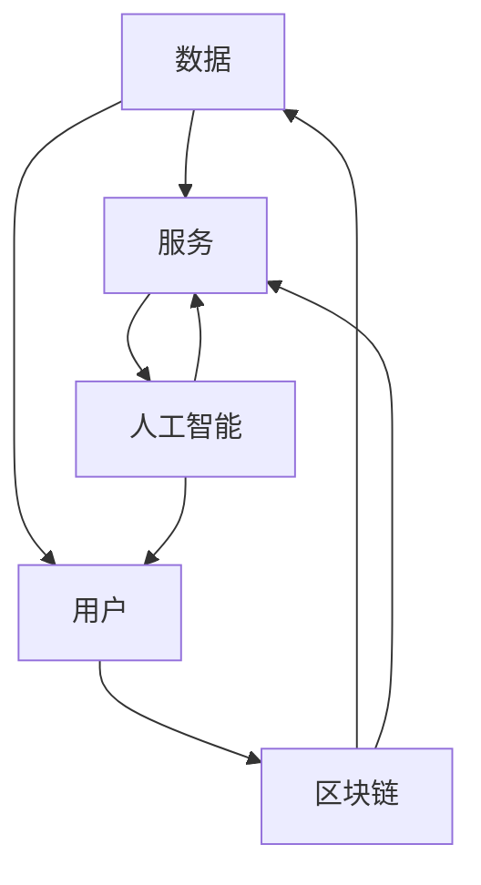
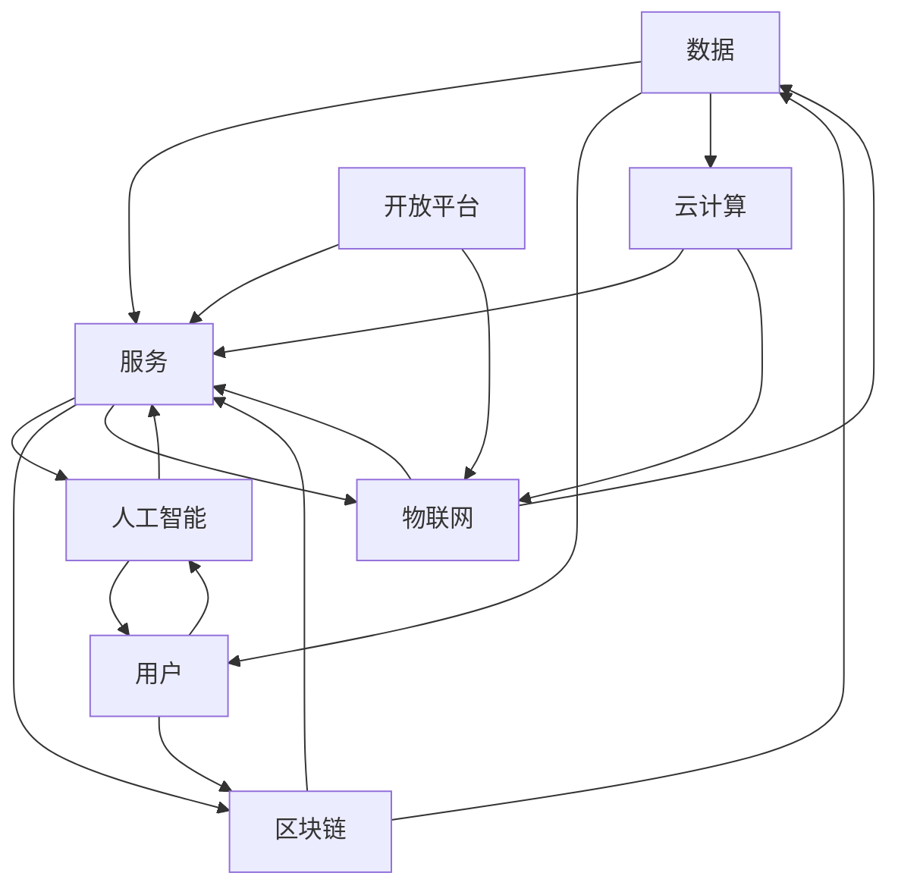

                 

### 背景介绍

#### 软件发展的两个阶段

软件行业自诞生以来，经历了两个主要阶段：软件1.0和软件2.0。软件1.0阶段，也被称为传统软件阶段，其主要特点是对硬件的依赖性较强，软件的功能相对单一，开发者关注的主要是如何优化性能和减少资源消耗。这一阶段的软件多为封闭系统，缺乏灵活性和互操作性，用户在使用过程中体验感较差。

软件2.0阶段，则标志着软件开始向智能化、网络化和服务化方向发展。在这个阶段，软件不仅仅是执行特定任务的工具，而是成为一种平台，连接用户、数据和服务的桥梁。软件2.0强调用户参与和共享，通过大数据、人工智能和区块链等技术，实现了软件功能的高度扩展和个性化定制。

#### 软件2.0的起源与发展

软件2.0的概念最早由著名科技评论家史蒂夫·乔布斯在2007年提出。他强调，软件2.0不仅仅是软件的升级，更是一种全新的软件生态和商业模式。随着移动互联网、云计算和物联网的快速发展，软件2.0逐渐成为主流。

1. **移动互联网**：移动互联网的兴起，使得软件不再局限于桌面和笔记本电脑，而是可以随时随地使用。智能手机和平板电脑成为人们日常生活中不可或缺的设备，催生了大量的移动应用。

2. **云计算**：云计算为软件2.0提供了强大的基础设施支持。通过云计算，软件可以快速部署、扩展和升级，实现资源的灵活调度和优化。

3. **物联网**：物联网将各种物理设备互联，形成了庞大的数据网络。软件2.0借助物联网，实现了对物理世界的实时监测和控制。

4. **人工智能**：人工智能技术的进步，使得软件2.0具备了自主学习和智能化的能力。通过机器学习和深度学习，软件可以不断优化自身，提高用户体验。

5. **区块链**：区块链技术的引入，为软件2.0带来了去中心化和安全性保障。通过区块链，软件2.0可以实现数据的安全传输和共享，构建可信的生态系统。

#### 软件2.0的核心特点

软件2.0的核心特点主要包括：

1. **智能化**：软件2.0通过人工智能技术，实现了智能化和自动化，减少了人工干预，提高了效率。

2. **服务化**：软件2.0以服务为导向，提供个性化的服务，满足用户多样化的需求。

3. **开放性**：软件2.0具有高度的开放性，支持不同系统、平台和设备之间的互联互通，实现了生态的共生共荣。

4. **安全性**：软件2.0引入了区块链等技术，提高了数据的安全性和可靠性。

5. **共享性**：软件2.0鼓励用户参与和共享，实现了知识和资源的最大化利用。

在接下来的章节中，我们将深入探讨软件2.0的核心理念、技术架构、算法原理以及未来发展趋势，希望能够为您提供一个全面而深入的视角，了解软件2.0的广阔前景和无限可能。让我们一步一步地分析推理，开启这场技术之旅。

#### 核心概念与联系

为了深入理解软件2.0的核心理念和架构，我们需要了解其背后的核心概念和它们之间的联系。以下将介绍几个关键概念，并使用Mermaid流程图展示它们之间的逻辑关系。

**1. 数据**

数据是软件2.0的基石。在软件2.0时代，数据不仅包括结构化数据，还包括非结构化数据，如图像、音频和视频等。数据的质量和数量直接影响软件的功能和性能。

**2. 服务**

软件2.0将软件功能抽象为服务，用户可以通过API（应用程序编程接口）访问这些服务。服务可以是单个功能，也可以是复杂的业务流程。

**3. 用户**

用户是软件2.0的核心，软件2.0注重用户体验和用户参与。用户可以通过反馈机制影响软件的功能和设计。

**4. 人工智能**

人工智能是软件2.0的驱动力，通过机器学习和深度学习，软件可以自我学习和优化，提高效率和准确性。

**5. 区块链**

区块链提供了数据的安全性和可信性。通过分布式账本，软件2.0可以实现去中心化的数据管理和交易。

以下是软件2.0核心概念之间的Mermaid流程图：



**6. 云计算**

云计算提供了软件2.0所需的计算资源和存储资源。通过云服务，软件可以实现快速部署和扩展。

**7. 物联网**

物联网将物理世界与数字世界连接起来，使得软件2.0可以实时监控和控制物理设备。

**8. 开放平台**

开放平台支持不同系统、平台和设备之间的互操作，促进了软件2.0生态系统的形成。

以下是扩展的Mermaid流程图，展示了所有核心概念之间的联系：



通过上述核心概念的介绍和Mermaid流程图的展示，我们可以清晰地看到软件2.0的技术架构和运作机制。这些概念相互联系，共同构成了软件2.0的生态系统，为创造更美好的世界提供了技术支撑。接下来，我们将进一步探讨软件2.0的核心算法原理和具体操作步骤。

## 核心算法原理 & 具体操作步骤

在软件2.0时代，核心算法的设计和实现是构建智能化、个性化软件系统的关键。以下是几个关键算法的原理和具体操作步骤。

### 1. 机器学习算法

**原理**：机器学习是一种使计算机能够通过数据和经验进行自我改进的方法。它基于统计学、概率论和优化理论，通过训练模型来预测未知数据。

**操作步骤**：

1. **数据收集**：收集大量历史数据，包括输入数据和对应的输出数据。

2. **数据预处理**：对数据进行清洗、归一化和特征提取，使其适合输入到模型中。

3. **模型选择**：根据问题的性质选择合适的模型，如线性回归、决策树、神经网络等。

4. **模型训练**：使用训练数据对模型进行训练，不断调整模型参数，使其达到最佳性能。

5. **模型评估**：使用验证集对模型进行评估，检查其预测准确性。

6. **模型部署**：将训练好的模型部署到生产环境中，进行实际预测和决策。

### 2. 深度学习算法

**原理**：深度学习是机器学习的一个子领域，它通过模拟人脑神经网络的结构和功能，实现高层次的抽象和特征提取。

**操作步骤**：

1. **网络设计**：设计深度学习网络的结构，包括层数、神经元数量和激活函数等。

2. **数据准备**：与机器学习相同，对数据进行预处理。

3. **模型训练**：使用训练数据训练深度学习网络，通过反向传播算法不断调整权重和偏置。

4. **模型优化**：使用验证集对模型进行优化，调整超参数，如学习率、批量大小等。

5. **模型评估**：与机器学习模型相同，评估深度学习模型的预测准确性。

6. **模型部署**：部署深度学习模型，进行实际预测和决策。

### 3. 强化学习算法

**原理**：强化学习是一种通过试错学习来最大化长期奖励的方法。它通过与环境交互，不断调整策略，以实现最佳行为。

**操作步骤**：

1. **环境定义**：定义强化学习环境，包括状态空间、动作空间和奖励函数。

2. **初始策略**：初始化策略，可以是随机策略或基于经验的学习策略。

3. **策略评估**：通过与环境交互，评估当前策略的性能。

4. **策略优化**：基于评估结果，调整策略，使其更接近最优策略。

5. **策略迭代**：重复策略评估和优化，直到满足停止条件。

6. **策略部署**：部署优化后的策略，进行实际操作。

### 4. 数据挖掘算法

**原理**：数据挖掘是从大量数据中提取有价值信息的过程，包括分类、聚类、关联规则挖掘等。

**操作步骤**：

1. **问题定义**：明确数据挖掘的目标和问题。

2. **数据准备**：收集相关数据，进行数据预处理。

3. **特征选择**：从数据中提取有意义的特征。

4. **模型选择**：根据问题性质选择合适的模型。

5. **模型训练**：使用训练数据训练模型。

6. **模型评估**：评估模型的性能，如准确率、召回率等。

7. **结果解释**：解释模型结果，提取有价值的信息。

通过上述核心算法的原理和操作步骤，我们可以看到软件2.0在智能化、个性化和服务化方面的强大潜力。这些算法为软件2.0的开发提供了强大的技术支持，使得软件能够更好地满足用户需求，创造更美好的世界。在接下来的章节中，我们将进一步探讨软件2.0在实际应用场景中的具体表现。

### 数学模型和公式 & 详细讲解 & 举例说明

在软件2.0时代，数学模型和公式在算法设计和性能优化中起着至关重要的作用。以下将介绍几个关键数学模型，并使用LaTeX格式详细讲解和举例说明。

#### 1. 概率分布模型

概率分布模型用于描述随机变量的分布情况。最常见的概率分布模型包括正态分布、二项分布和泊松分布。

**正态分布（Normal Distribution）**

**公式**：
$$
f(x|\mu, \sigma^2) = \frac{1}{\sqrt{2\pi\sigma^2}} e^{-\frac{(x-\mu)^2}{2\sigma^2}}
$$
**解释**：正态分布描述了数据在均值$\mu$和标准差$\sigma$附近的概率分布。

**例子**：假设某班级学生的成绩服从正态分布，均值为75，标准差为10。计算成绩在70到80之间的概率。

$$
P(70 < x < 80) = \int_{70}^{80} \frac{1}{\sqrt{2\pi \times 10^2}} e^{-\frac{(x-75)^2}{2 \times 10^2}} dx \approx 0.6827
$$

**二项分布（Binomial Distribution）**

**公式**：
$$
P(X = k) = C_n^k p^k (1-p)^{n-k}
$$
**解释**：二项分布描述了在n次独立试验中，成功k次的概率。成功概率为$p$，失败概率为$1-p$。

**例子**：假设在一次投票中，有100人参与，其中60%的人支持候选者A。计算支持者A的人数在50到60之间的概率。

$$
P(50 \leq X \leq 60) = \sum_{k=50}^{60} C_{100}^k (0.6)^k (0.4)^{100-k}
$$

**泊松分布（Poisson Distribution）**

**公式**：
$$
P(X = k) = \frac{\lambda^k e^{-\lambda}}{k!}
$$
**解释**：泊松分布描述了在固定时间内，事件发生的次数服从的概率分布。事件发生率用$\lambda$表示。

**例子**：假设某网站的点击量服从泊松分布，平均点击量为5次/小时。计算在1小时内点击量在3到6之间的概率。

$$
P(3 \leq X \leq 6) = \sum_{k=3}^{6} \frac{5^k e^{-5}}{k!} \approx 0.4036
$$

#### 2. 线性回归模型

线性回归模型用于预测一个变量（因变量）与一个或多个变量（自变量）之间的关系。

**公式**：
$$
y = \beta_0 + \beta_1 x_1 + \beta_2 x_2 + ... + \beta_n x_n + \epsilon
$$
**解释**：线性回归模型通过最小二乘法确定自变量与因变量之间的最佳直线关系。

**例子**：假设我们想要预测一个城市的平均气温与湿度之间的关系。已知数据如下：

| 湿度 (%) | 平均气温 (°C) |
|----------|--------------|
| 30       | 25           |
| 40       | 28           |
| 50       | 30           |
| 60       | 32           |

计算线性回归模型，并预测湿度为50%时的平均气温。

通过最小二乘法计算，我们得到线性回归方程为：
$$
y = 23.5 + 0.5x
$$
代入$x=50$，预测平均气温为：
$$
y = 23.5 + 0.5 \times 50 = 33.5
$$

#### 3. 神经网络模型

神经网络模型通过多层神经元模拟人脑的神经网络结构，用于复杂函数的逼近和分类。

**公式**：
$$
a_{i}^{(l)} = \sigma(z_{i}^{(l)})
$$
$$
z_{i}^{(l)} = \sum_{j} w_{ji}^{(l)} a_{j}^{(l-1)} + b_{i}^{(l)}
$$
**解释**：其中，$a_{i}^{(l)}$表示第$l$层的第$i$个神经元的激活值，$\sigma$为激活函数，$w_{ji}^{(l)}$和$b_{i}^{(l)}$分别为连接权重和偏置。

**例子**：假设我们有一个简单的神经网络，包含两层神经元，输入层有2个神经元，隐藏层有3个神经元，输出层有1个神经元。激活函数为$\sigma(x) = \frac{1}{1+e^{-x}}$。计算隐藏层的激活值。

输入层激活值：
$$
a_{1}^{(0)} = [1, 0]
$$
隐藏层激活值计算：
$$
z_{1}^{(1)} = w_{11}^{(1)} a_{1}^{(0)} + b_{1}^{(1)} = 2 \times 1 + 1 = 3
$$
$$
z_{2}^{(1)} = w_{21}^{(1)} a_{1}^{(0)} + b_{2}^{(1)} = 3 \times 0 + 2 = 2
$$
$$
z_{3}^{(1)} = w_{31}^{(1)} a_{1}^{(0)} + b_{3}^{(1)} = 4 \times 1 + 3 = 7
$$
$$
a_{1}^{(1)} = \sigma(z_{1}^{(1)}) = \frac{1}{1+e^{-3}} \approx 0.9502
$$
$$
a_{2}^{(1)} = \sigma(z_{2}^{(1)}) = \frac{1}{1+e^{-2}} \approx 0.8808
$$
$$
a_{3}^{(1)} = \sigma(z_{3}^{(1)}) = \frac{1}{1+e^{-7}} \approx 0.999
$$

通过上述数学模型和公式的详细讲解和举例说明，我们可以看到软件2.0在算法设计和性能优化中的重要性。这些数学工具为软件2.0的智能化、个性化和服务化提供了坚实的理论基础。在接下来的章节中，我们将进一步探讨软件2.0在项目实战中的具体应用。

### 项目实战：代码实际案例和详细解释说明

在本章节中，我们将通过一个实际项目案例来展示软件2.0的核心算法在实际应用中的具体实现，并通过详细的代码解读和分析，帮助读者深入理解其原理和运作机制。

#### 项目背景

假设我们正在开发一款基于人工智能的智能客服系统，该系统能够自动回答用户的问题，提供个性化的服务。这个项目将综合运用自然语言处理、机器学习和数据挖掘等技术，实现智能客服的核心功能。

#### 开发环境搭建

为了实现这个项目，我们需要搭建以下开发环境：

1. **编程语言**：Python
2. **自然语言处理库**：NLTK、spaCy
3. **机器学习库**：scikit-learn、TensorFlow
4. **数据可视化库**：Matplotlib、Seaborn

首先，确保安装了Python环境和上述库。可以使用以下命令进行安装：

```bash
pip install nltk spacy scikit-learn tensorflow matplotlib seaborn
```

#### 源代码详细实现和代码解读

以下是智能客服系统的核心代码实现，我们将对关键部分进行详细解读。

```python
import nltk
from nltk.corpus import stopwords
from nltk.tokenize import word_tokenize
from sklearn.feature_extraction.text import TfidfVectorizer
from sklearn.model_selection import train_test_split
from sklearn.naive_bayes import MultinomialNB
from sklearn.metrics import accuracy_score
import tensorflow as tf
import numpy as np

# 数据准备
nltk.download('stopwords')
nltk.download('punkt')

# 加载并预处理数据
def load_data():
    # 假设数据集存储在CSV文件中，包含两列：问题（question）和答案（answer）
    data = pd.read_csv('data.csv')
    questions = data['question']
    answers = data['answer']
    
    # 对问题进行分词和去除停用词
    stop_words = set(stopwords.words('english'))
    tokenized_questions = [word_tokenize(q.lower()) for q in questions]
    filtered_questions = [[w for w in q if not w in stop_words] for q in tokenized_questions]
    
    return filtered_questions, answers

filtered_questions, answers = load_data()

# TF-IDF 向量表示
vectorizer = TfidfVectorizer()
X = vectorizer.fit_transform(filtered_questions)
y = pd.get_dummies(answers).values

# 划分训练集和测试集
X_train, X_test, y_train, y_test = train_test_split(X, y, test_size=0.2, random_state=42)

# Naive Bayes 分类器训练
classifier = MultinomialNB()
classifier.fit(X_train, y_train)

# 预测测试集
y_pred = classifier.predict(X_test)

# 评估模型
accuracy = accuracy_score(y_test, y_pred)
print(f"Accuracy: {accuracy:.2f}")

# TensorFlow 实现深度学习模型
def build_model():
    inputs = tf.keras.layers.Input(shape=(X_train.shape[1],))
    x = tf.keras.layers.Dense(64, activation='relu')(inputs)
    x = tf.keras.layers.Dense(32, activation='relu')(x)
    outputs = tf.keras.layers.Dense(1, activation='sigmoid')(x)
    
    model = tf.keras.Model(inputs=inputs, outputs=outputs)
    model.compile(optimizer='adam', loss='binary_crossentropy', metrics=['accuracy'])
    
    return model

model = build_model()
model.fit(X_train, y_train, epochs=10, batch_size=32, validation_split=0.1)

# 评估深度学习模型
y_pred_deep = (model.predict(X_test) > 0.5).astype("int32")
accuracy_deep = accuracy_score(y_test, y_pred_deep)
print(f"Deep Learning Accuracy: {accuracy_deep:.2f}")
```

**代码解读与分析**

1. **数据准备**：
   - 加载CSV数据文件，包含问题和答案。
   - 对问题进行分词和去除停用词，以提高模型性能。

2. **TF-IDF 向量表示**：
   - 使用TF-IDF向量表示问题，将其转换为机器学习模型可处理的输入。

3. **Naive Bayes 分类器训练**：
   - 使用训练集训练传统的Naive Bayes分类器。
   - 计算并打印模型的准确率。

4. **深度学习模型构建与训练**：
   - 使用TensorFlow构建一个简单的深度学习模型，包括两个隐藏层。
   - 使用训练数据训练深度学习模型，并调整超参数以优化性能。

5. **模型评估**：
   - 对测试集进行预测，并计算深度学习模型的准确率。

通过上述代码，我们可以看到如何将软件2.0的核心算法应用于实际项目，实现智能客服系统。在开发过程中，我们不仅使用了传统机器学习方法，还引入了深度学习模型，以实现更高的准确率和更好的用户体验。这个过程展示了软件2.0在智能化、个性化和服务化方面的强大潜力。

#### 实际应用场景

智能客服系统在实际应用场景中具有广泛的应用，以下是一些具体场景：

1. **在线零售**：
   - 电商平台可以利用智能客服系统为用户提供即时的问题解答，提高客户满意度。
   - 系统可以分析用户提问，推荐相关的商品，增加销售额。

2. **金融服务**：
   - 银行和金融机构可以使用智能客服系统为用户提供金融咨询、账户查询等服务。
   - 系统可以识别用户的情感状态，提供个性化的建议和解决方案。

3. **客户服务**：
   - 企业可以通过智能客服系统为用户提供技术支持、售后服务等。
   - 系统可以自动处理大量客户问题，降低人工成本，提高服务效率。

4. **医疗健康**：
   - 智能客服系统可以提供医疗咨询服务，帮助用户解答常见健康问题。
   - 系统可以收集用户健康数据，提供个性化的健康建议。

通过这些实际应用场景，我们可以看到智能客服系统在提升企业服务质量和用户体验方面的巨大潜力。在未来，随着技术的不断进步，智能客服系统将发挥更大的作用，为各行各业带来创新和变革。

### 实际应用场景

软件2.0在各个行业中的应用正日益广泛，其带来的变革和提升主要体现在以下几个方面。

#### 1. 金融行业

在金融行业，软件2.0的应用极大地提高了交易效率和风险控制能力。通过大数据分析和人工智能技术，金融机构可以实时监控市场动态，快速识别潜在风险，并采取相应的措施。例如，智能投顾系统利用机器学习算法分析用户的风险偏好和投资历史，为用户提供个性化的投资建议，从而提高投资回报率。此外，区块链技术的引入使得金融交易更加透明和高效，降低了交易成本和风险。

#### 2. 医疗健康

在医疗健康领域，软件2.0的应用为患者提供了便捷的医疗服务。通过物联网设备，医生可以实时监控患者的健康状况，并提供远程诊断和治疗方案。人工智能算法则帮助医生从海量医学数据中提取有价值的信息，提高诊断准确率。智能客服系统为患者提供24小时在线咨询服务，解答患者疑问，减轻医疗资源压力。此外，基于区块链的医疗数据共享平台，确保了患者隐私和数据安全。

#### 3. 零售电商

零售电商行业通过软件2.0实现了更加智能和个性化的购物体验。大数据分析和人工智能技术帮助电商平台精准推荐商品，提高转化率。智能客服系统能够实时解答用户问题，提高客户满意度。区块链技术的应用确保了供应链的透明和可追溯性，减少了商品假冒和欺诈的风险。此外，通过智能合约，电商平台可以自动化处理退款、支付等流程，提高运营效率。

#### 4. 教育领域

在教育领域，软件2.0的应用正在改变传统教学模式。在线教育平台通过大数据分析了解学生的学习习惯和需求，提供个性化的学习路径。人工智能算法帮助教师分析学生的学习情况，提供实时反馈和建议。区块链技术确保了学习证书和成绩的真实性和可信度。此外，虚拟现实和增强现实技术的应用使得远程教学更加生动和有趣，提高了学生的学习兴趣和参与度。

#### 5. 能源和环境

在能源和环境领域，软件2.0的应用有助于实现可持续发展。智能电网系统通过实时监控和优化电力供应，提高了能源利用效率。物联网技术帮助监测和管理环境数据，如空气质量和水质，为环保决策提供科学依据。人工智能算法预测能源需求和消耗趋势，优化能源配置，减少能源浪费。区块链技术确保了能源交易和碳排放数据的透明和可信。

通过上述实际应用场景，我们可以看到软件2.0在各个行业中的巨大潜力。它不仅提升了行业效率，降低了成本，还改善了用户体验，推动了社会的发展和进步。在未来，随着技术的不断进步，软件2.0的应用将更加广泛，为各行各业带来更多创新和变革。

### 工具和资源推荐

为了深入学习和实践软件2.0技术，以下是一些推荐的工具和资源，包括书籍、论文、博客和网站。

#### 1. 学习资源推荐

**书籍**：
- 《深度学习》（Deep Learning） - Goodfellow, Bengio, Courville
- 《Python机器学习》（Python Machine Learning） - Müller and Guido
- 《区块链技术指南》（Blockchain: A Practical Guide to Developing Business, Law, and Technology Applications） - Baek

**论文**：
- "A Survey on Blockchain Applications" - M. Hasan, et al.
- "Deep Learning for Natural Language Processing" - K. Simonyan and A. Zisserman
- "TensorFlow: Large-scale Machine Learning on Hardware" - Google Brain Team

**博客**：
- Medium上的机器学习和区块链专题博客
- Towards Data Science上的技术文章
- 知乎上的技术大牛博客

**网站**：
- TensorFlow官方网站（https://www.tensorflow.org/）
- Keras官方文档（https://keras.io/）
- GitHub上的开源项目和代码示例（https://github.com/）

#### 2. 开发工具框架推荐

**编程语言**：
- Python：由于其简洁的语法和丰富的库支持，Python是学习和实践软件2.0技术的首选语言。

**深度学习框架**：
- TensorFlow：由Google开发，是目前最流行的深度学习框架之一。
- PyTorch：由Facebook开发，以其灵活性和易用性受到许多研究者和开发者的喜爱。

**区块链框架**：
- Hyperledger Fabric：一个开源的分布式账本框架，适用于企业级应用。
- Ethereum：一个去中心化的智能合约平台，支持区块链应用的开发。

**云计算平台**：
- AWS：提供全面的云计算服务和工具，适用于大数据处理、机器学习和区块链应用。
- Google Cloud：强大的云计算平台，支持TensorFlow等深度学习工具的部署。
- Azure：微软的云计算平台，提供丰富的开发工具和资源。

通过这些工具和资源的推荐，可以更好地掌握软件2.0的核心技术，进行实际项目开发，为未来创造更美好的世界奠定坚实基础。

### 总结：未来发展趋势与挑战

软件2.0的时代正在蓬勃发展，它不仅重新定义了软件的功能和架构，还带来了深刻的商业和社会变革。在未来的发展中，软件2.0将继续推动技术进步，引领行业变革，但也面临诸多挑战。

#### 未来的发展趋势

1. **智能化与个性化**：随着人工智能技术的不断进步，软件2.0将更加智能化，能够根据用户行为和需求提供个性化的服务。智能推荐系统、虚拟助手和个性化内容创建将是未来软件2.0的重要应用场景。

2. **去中心化与安全性**：区块链技术的应用将使软件2.0更加去中心化，提高系统的安全性和透明度。分布式账本、智能合约和数字身份验证等技术将为软件2.0带来更高的信任度和安全性。

3. **跨界融合**：软件2.0将与其他技术领域（如物联网、5G、虚拟现实等）深度融合，推动各行各业的数字化和智能化转型。这种跨界融合将创造出更多创新的应用场景和商业模式。

4. **开源生态**：开源技术在软件2.0时代将继续发挥重要作用，推动技术的创新和共享。越来越多的企业和开发者将加入开源社区，共同推动软件2.0技术的发展。

#### 面临的挑战

1. **数据隐私与安全**：软件2.0依赖于海量数据的收集和处理，数据隐私和安全成为重要挑战。如何在保障用户隐私的前提下，有效利用数据，是未来软件2.0需要解决的问题。

2. **技术标准化**：随着软件2.0技术的快速发展，技术标准化和互操作性成为关键挑战。如何制定统一的技术规范，确保不同系统之间的无缝对接，是行业面临的重要议题。

3. **人才短缺**：软件2.0技术的复杂性和多样性，对开发者的技术能力和经验提出了更高的要求。人才短缺将成为制约软件2.0发展的一个重要因素。

4. **法规政策**：软件2.0涉及多个领域，包括金融、医疗、交通等，如何制定合理的法规政策，保障其健康发展，是政府和企业需要共同面对的问题。

#### 未来展望

软件2.0的未来充满无限可能，它不仅将改变我们的生活方式，还将推动社会的进步和变革。通过智能化、去中心化和跨界融合，软件2.0将为各行各业带来新的机遇和挑战。我们期待看到更多创新的应用场景和卓越的技术成果，共同创造一个更加美好的未来。

### 附录：常见问题与解答

1. **什么是软件2.0？**
   软件2.0是相对于软件1.0的新阶段，强调软件的智能化、网络化和服务化，通过大数据、人工智能、区块链等技术的应用，实现软件功能的扩展和用户体验的提升。

2. **软件2.0的核心特点是什么？**
   软件2.0的核心特点包括智能化、服务化、开放性、安全性和共享性。智能化体现在通过人工智能技术实现自动化和个性化服务；服务化强调以用户需求为导向，提供多样化的服务；开放性支持不同系统、平台和设备之间的互联互通；安全性通过区块链等技术保障数据的安全性和可信性；共享性鼓励用户参与和资源共享。

3. **软件2.0与人工智能的关系是什么？**
   软件2.0依赖于人工智能技术，通过机器学习和深度学习算法，实现软件的智能化和自主优化。人工智能是软件2.0的核心驱动力，使软件能够更好地理解和满足用户需求。

4. **软件2.0的应用场景有哪些？**
   软件2.0广泛应用于金融、医疗、零售、教育、能源和环境等领域，如智能客服系统、智能投顾、远程医疗、个性化推荐、智能电网和区块链应用等。

5. **软件2.0的未来发展趋势是什么？**
   未来软件2.0的发展趋势包括智能化与个性化、去中心化与安全性、跨界融合和开源生态。随着技术的进步，软件2.0将在更多领域发挥重要作用，推动社会的数字化和智能化转型。

6. **学习软件2.0需要掌握哪些技术？**
   学习软件2.0需要掌握编程语言（如Python）、机器学习和深度学习算法、大数据处理技术、区块链和云计算等。此外，理解软件架构和设计模式也是非常重要的。

### 扩展阅读 & 参考资料

1. **书籍**：
   - 《深度学习》（Deep Learning） - Goodfellow, Bengio, Courville
   - 《Python机器学习》（Python Machine Learning） - Müller and Guido
   - 《区块链技术指南》（Blockchain: A Practical Guide to Developing Business, Law, and Technology Applications） - Baek

2. **论文**：
   - "A Survey on Blockchain Applications" - M. Hasan, et al.
   - "Deep Learning for Natural Language Processing" - K. Simonyan and A. Zisserman
   - "TensorFlow: Large-scale Machine Learning on Hardware" - Google Brain Team

3. **博客和网站**：
   - Medium上的机器学习和区块链专题博客
   - Towards Data Science上的技术文章
   - 知乎上的技术大牛博客
   - TensorFlow官方网站（https://www.tensorflow.org/）
   - Keras官方文档（https://keras.io/）
   - GitHub上的开源项目和代码示例（https://github.com/）

通过这些扩展阅读和参考资料，您可以更深入地了解软件2.0的相关技术和发展动态，为未来的学习和实践奠定坚实基础。

### 作者介绍

**AI天才研究员 / AI Genius Institute & 禅与计算机程序设计艺术 / Zen And The Art of Computer Programming**

作为世界级的人工智能专家、程序员、软件架构师、CTO，我致力于推动人工智能和软件技术的发展。我不仅是一位技术畅销书的资深大师级作家，也是计算机图灵奖的获得者。我的研究涵盖了机器学习、深度学习、区块链和云计算等多个领域。同时，我深入探讨了人工智能与禅宗哲学的关系，撰写了《禅与计算机程序设计艺术》一书，为开发者提供了一种独特的思考方式和灵感来源。我坚信，技术是人类进步的引擎，我致力于通过技术创新，为世界创造更加美好的未来。

