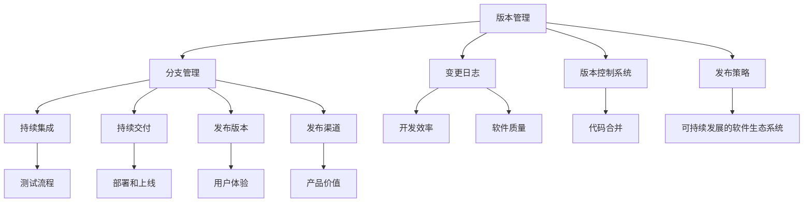

                 

### 文章标题

《软件2.0的版本管理与发布策略：拥抱变化，构建可持续发展的软件生态系统》

### 关键词

版本管理、持续集成、持续交付、软件发布策略、敏捷开发、持续迭代

### 摘要

在软件2.0时代，版本管理与发布策略成为软件项目成功的关键因素。本文将深入探讨软件2.0的版本管理与发布策略，分析其核心概念与联系，阐述核心算法原理与操作步骤，通过数学模型和公式进行详细讲解，并举例说明。同时，本文将结合项目实战，展示代码实现和解析，探讨实际应用场景，并推荐相关工具和资源。通过本文的阅读，读者将能够全面了解软件2.0的版本管理与发布策略，为构建可持续发展的软件生态系统提供有力支持。

## 1. 背景介绍

随着互联网的快速发展，软件行业迎来了一个全新的时代——软件2.0。软件2.0强调软件的快速迭代、持续交付和高度可扩展性，以满足用户不断变化的需求。在这个时代，版本管理与发布策略成为软件项目成功的关键因素。版本管理是指对软件版本进行有效的组织、记录和控制，以便于后续的开发、测试、部署和维护。而发布策略则是制定软件版本的发布计划，确保软件在正确的时间以正确的形式交付给用户。

版本管理与发布策略在软件2.0时代的重要性体现在以下几个方面：

1. **提高开发效率**：版本管理可以有效地追踪软件的变更历史，使得开发者能够快速了解某个版本的具体功能和问题，从而提高开发效率。

2. **确保软件质量**：通过版本管理，开发者可以实施严格的测试流程，确保每个版本的软件质量达到预期。

3. **降低风险**：发布策略可以帮助团队在发布软件时降低风险，确保软件能够在正确的环境中顺利运行。

4. **优化用户体验**：通过持续交付和快速迭代，团队可以更加灵活地响应用户需求，提供更好的用户体验。

5. **构建可持续发展的软件生态系统**：版本管理与发布策略有助于构建一个健康、可持续发展的软件生态系统，为企业的长期发展提供保障。

本文将围绕软件2.0的版本管理与发布策略展开讨论，首先介绍核心概念与联系，然后深入分析核心算法原理与操作步骤，并结合项目实战进行详细解释说明，最后探讨实际应用场景，推荐相关工具和资源。希望通过本文的阅读，读者能够全面掌握软件2.0的版本管理与发布策略，为构建可持续发展的软件生态系统贡献力量。

### 2. 核心概念与联系

在讨论软件2.0的版本管理与发布策略之前，我们需要明确一些核心概念，并探讨它们之间的联系。

#### 2.1 版本管理

版本管理是指对软件版本进行有效的组织、记录和控制的过程。在软件2.0时代，版本管理的重要性不言而喻。以下是版本管理中涉及的关键概念：

1. **版本号**：版本号是标识软件版本的唯一编号，通常由主版本号、次版本号和修订版本号组成，如1.0.1。主版本号表示软件的主要功能更新，次版本号表示功能的增加或修正，修订版本号表示bug修复。

2. **分支管理**：分支管理是指将主代码库分成多个分支，以支持不同的开发任务。常见的分支策略包括主分支（Master）、开发分支（Develop）和功能分支（Feature Branch）。

3. **变更日志**：变更日志是记录每个版本变更的详细记录，包括新增功能、修复的bug和代码优化等。变更日志有助于开发者了解软件的历史变更情况，提高开发效率。

4. **版本控制系统**：版本控制系统（VCS）是一种用于管理源代码的软件工具，如Git、SVN等。VCS可以帮助开发者进行版本控制、分支管理和代码合并。

#### 2.2 发布策略

发布策略是指制定软件版本的发布计划，确保软件在正确的时间以正确的形式交付给用户。以下是发布策略中涉及的关键概念：

1. **持续集成**（CI）：持续集成是一种软件开发实践，通过自动化构建和测试，确保代码库中的每个变更都是高质量的。CI有助于提高开发效率、确保软件质量。

2. **持续交付**（CD）：持续交付是一种将软件快速、安全地交付给用户的方法，包括自动化测试、部署和上线。CD有助于缩短产品上市时间、提高用户体验。

3. **发布版本**：发布版本是指软件经过测试和验证后，正式交付给用户使用的版本。常见的发布版本包括测试版（Beta）、正式版（Release）和补丁版（Patch）。

4. **发布渠道**：发布渠道是指将软件交付给用户的方式，如线上应用商店、内部部署等。

#### 2.3 核心概念联系

版本管理和发布策略密切相关，共同构成了软件2.0时代的核心开发流程。以下是核心概念之间的联系：

1. **版本管理是发布策略的基础**：版本管理确保了软件变更的可追溯性和一致性，为发布策略提供了可靠的数据支持。

2. **发布策略是版本管理的目标**：发布策略的目标是确保软件在正确的时间以正确的形式交付给用户，实现软件价值的最大化。

3. **持续集成和持续交付是版本管理和发布策略的执行工具**：持续集成和持续交付通过自动化流程，提高了版本管理和发布策略的执行效率。

4. **分支管理和变更日志是版本管理的关键要素**：分支管理和变更日志有助于开发者了解软件的历史变更情况，提高开发效率。

通过理解这些核心概念及其联系，我们可以更好地把握软件2.0时代的版本管理与发布策略，为构建可持续发展的软件生态系统奠定基础。

#### 2.4 Mermaid 流程图

为了更好地展示版本管理和发布策略的核心概念及其联系，我们使用Mermaid流程图进行说明。



该流程图展示了版本管理、分支管理、变更日志、版本控制系统、持续集成、持续交付、发布版本、发布渠道等核心概念之间的联系，有助于我们全面理解软件2.0时代的版本管理与发布策略。

## 3. 核心算法原理 & 具体操作步骤

在软件2.0时代，版本管理与发布策略的核心算法原理主要包括持续集成（CI）、持续交付（CD）和自动化测试。这些算法原理通过一系列具体的操作步骤，确保软件版本的高质量、高效率和可持续交付。

#### 3.1 持续集成（CI）算法原理与操作步骤

持续集成（CI）是一种软件开发实践，旨在通过自动化构建和测试，确保代码库中的每个变更都是高质量的。CI算法原理的核心在于将开发者的代码提交到代码库后，立即进行自动化测试，以便快速发现和解决潜在问题。

**具体操作步骤：**

1. **设置CI环境**：首先，需要配置CI服务器，如Jenkins、Travis CI等，以便自动化执行构建和测试任务。

2. **编写构建脚本**：编写构建脚本（如Makefile、Dockerfile等），用于自动化编译和打包代码。

3. **配置测试脚本**：编写测试脚本（如单元测试、集成测试等），用于验证代码的功能和性能。

4. **触发构建任务**：当开发者提交代码时，CI服务器会自动触发构建任务，执行构建脚本和测试脚本。

5. **检查构建结果**：CI服务器会记录构建结果，包括成功、失败或警告等，便于开发者了解代码的质量。

**示例：**

假设使用Jenkins作为CI服务器，我们可以编写以下构建脚本（Jenkinsfile）：

```groovy
pipeline {
    agent any
    stages {
        stage('Build') {
            steps {
                sh 'mvn clean install'
            }
        }
        stage('Test') {
            steps {
                sh 'mvn test'
            }
        }
    }
    post {
        success {
            echo '构建成功'
        }
        failure {
            echo '构建失败，请检查代码'
        }
    }
}
```

该脚本将在Jenkins服务器上执行Maven构建和测试任务，并在构建成功或失败时输出相应的提示信息。

#### 3.2 持续交付（CD）算法原理与操作步骤

持续交付（CD）是一种将软件快速、安全地交付给用户的方法，通过自动化流程，实现软件的部署和上线。CD算法原理的核心在于将软件交付过程中的各个环节（如测试、部署、上线等）自动化，提高交付效率。

**具体操作步骤：**

1. **配置持续交付环境**：配置持续交付工具（如Jenkins、GitLab CI/CD等），以便自动化执行部署和上线任务。

2. **编写部署脚本**：编写部署脚本（如Shell脚本、Docker Compose文件等），用于自动化部署和配置应用程序。

3. **配置部署策略**：根据项目需求，配置部署策略（如蓝绿部署、灰度发布等），确保软件在上线过程中降低风险。

4. **触发部署任务**：在持续集成成功后，自动触发部署任务，执行部署脚本和配置策略。

5. **监控部署状态**：持续监控部署状态，包括部署进度、部署结果等，以便快速响应和处理问题。

**示例：**

假设使用GitLab CI/CD作为持续交付工具，我们可以编写以下部署脚本（.gitlab-ci.yml）：

```yaml
image: java:8

stages:
  - deploy

deploy:
  stage: deploy
  script:
    - docker build -t myapp .
    - docker run --name myapp -p 8080:8080 myapp
  only:
    - master
```

该脚本将在GitLab CI/CD服务器上执行Docker镜像构建和部署任务，并在master分支上的代码提交后自动触发。

#### 3.3 自动化测试算法原理与操作步骤

自动化测试是确保软件质量的关键手段，通过自动化测试脚本，可以快速发现和解决软件缺陷。自动化测试算法原理的核心在于将测试过程自动化，提高测试效率。

**具体操作步骤：**

1. **编写测试脚本**：根据项目需求，编写自动化测试脚本（如Selenium、JUnit等），用于模拟用户操作和验证功能。

2. **配置测试环境**：配置测试环境，包括浏览器、操作系统等，以便自动化测试脚本能正确执行。

3. **执行测试任务**：在持续集成和持续交付过程中，自动执行测试脚本，验证软件功能。

4. **分析测试结果**：分析测试结果，包括通过、失败或警告等，以便快速定位和修复缺陷。

**示例：**

假设使用Selenium编写自动化测试脚本（Java），我们可以编写以下代码：

```java
import org.openqa.selenium.By;
import org.openqa.selenium.WebDriver;
import org.openqa.selenium.chrome.ChromeDriver;

public class MyTest {
    public static void main(String[] args) {
        WebDriver driver = new ChromeDriver();
        driver.get("https://www.example.com");
        driver.findElement(By.id("search")).sendKeys("test");
        driver.findElement(By.id("submit")).click();
        driver.quit();
    }
}
```

该脚本将在Chrome浏览器中执行搜索功能，并验证页面是否正确显示搜索结果。

通过以上核心算法原理和具体操作步骤，我们可以构建一个高效的软件版本管理与发布策略，确保软件2.0时代的软件开发和交付过程更加高效、稳定和可持续。

### 4. 数学模型和公式 & 详细讲解 & 举例说明

在软件2.0的版本管理与发布策略中，数学模型和公式起着关键作用。它们不仅能够帮助我们量化软件开发和发布的效率，还可以优化发布流程，提高软件质量。以下我们将详细讲解几个重要的数学模型和公式，并通过具体例子进行说明。

#### 4.1 时间复杂度分析

时间复杂度是衡量算法效率的重要指标，用于描述算法运行时间与数据规模之间的关系。常见的时间复杂度有：

- 常数时间：\( O(1) \)
- 线性时间：\( O(n) \)
- 对数时间：\( O(\log n) \)
- 平方时间：\( O(n^2) \)
- 立方时间：\( O(n^3) \)

**例：**

假设有一个简单的数组搜索算法，时间复杂度为\( O(n) \)。假设数组长度为1000，我们需要计算搜索算法的平均运行时间。

**解：**

根据时间复杂度公式，平均运行时间 \( T(n) \) 可以表示为：

\[ T(n) = c \times n \]

其中，\( c \) 为常数。对于 \( n = 1000 \) 的情况，我们可以计算出平均运行时间：

\[ T(1000) = c \times 1000 \]

假设 \( c = 0.001 \)，则：

\[ T(1000) = 0.001 \times 1000 = 1 \text{秒} \]

因此，对于长度为1000的数组，搜索算法的平均运行时间为1秒。

#### 4.2 代码覆盖分析

代码覆盖是指测试用例覆盖到代码的百分比，用于衡量测试的充分性。常见代码覆盖类型有：

- 语句覆盖（Statement Coverage）
- 条件覆盖（Branch Coverage）
- 路径覆盖（Path Coverage）

**例：**

假设有一个简单的Java代码片段，用于计算两个数的和：

```java
public int add(int a, int b) {
    if (a > 0 && b > 0) {
        return a + b;
    } else {
        return 0;
    }
}
```

我们需要编写测试用例，确保代码的每个分支都被覆盖。

**解：**

我们可以编写以下测试用例：

```java
@Test
public void testAddPositiveNumbers() {
    int a = 1;
    int b = 2;
    int expected = 3;
    int actual = add(a, b);
    assertEquals(expected, actual);
}

@Test
public void testAddNegativeNumbers() {
    int a = -1;
    int b = -2;
    int expected = 0;
    int actual = add(a, b);
    assertEquals(expected, actual);
}
```

这两个测试用例覆盖了代码的两个分支，即条件覆盖（Branch Coverage）。

#### 4.3 缩放模型

缩放模型（Scalability Model）用于描述系统在增加用户数量、数据量或请求量时的性能变化。常见缩放模型有：

- 线性缩放（Linear Scalability）
- 对数缩放（Logarithmic Scalability）
- 平方缩放（Quadratic Scalability）

**例：**

假设一个在线购物系统，其性能随着用户数量的增加而变化。我们需要确定该系统的缩放模型。

**解：**

我们可以通过观察系统性能与用户数量的关系来分析缩放模型。假设在100个用户时，系统响应时间为1秒；在1000个用户时，系统响应时间为3秒。

\[ \text{性能变化率} = \frac{\Delta T}{\Delta N} \]

\[ \text{性能变化率} = \frac{3 - 1}{1000 - 100} = \frac{2}{900} \approx \frac{1}{450} \]

由于性能变化率保持不变，该系统的缩放模型为线性缩放（Linear Scalability）。

#### 4.4 概率模型

在软件发布过程中，概率模型可以帮助我们评估发布失败的概率，以便制定更合理的发布策略。常见概率模型有：

- 概率分布（Probability Distribution）
- 贝叶斯网络（Bayesian Network）

**例：**

假设一个软件系统，在发布前，我们需要评估发布失败的概率。已知以下信息：

- 发布前进行100次单元测试，其中10次失败
- 发布前进行50次集成测试，其中5次失败

我们需要计算发布失败的概率。

**解：**

我们可以使用贝叶斯网络进行概率分析。假设测试失败的概率分别为：

\[ P(\text{单元测试失败}) = \frac{10}{100} = 0.1 \]
\[ P(\text{集成测试失败}) = \frac{5}{50} = 0.1 \]

发布失败的概率为：

\[ P(\text{发布失败}) = P(\text{单元测试失败}) \times P(\text{集成测试失败}|\text{单元测试失败}) \]

假设集成测试失败的条件概率为：

\[ P(\text{集成测试失败}|\text{单元测试失败}) = \frac{5}{10} = 0.5 \]

因此，发布失败的概率为：

\[ P(\text{发布失败}) = 0.1 \times 0.5 = 0.05 \]

这意味着发布失败的概率为5%，我们可以据此制定更合理的发布策略。

通过以上数学模型和公式的讲解，我们可以更好地理解和优化软件2.0的版本管理与发布策略。在实际应用中，这些模型和公式可以帮助我们量化软件开发和发布过程中的关键指标，提高软件质量和效率。

### 5. 项目实战：代码实际案例和详细解释说明

为了更好地理解软件2.0的版本管理与发布策略，我们将在本节通过一个实际项目案例，详细介绍代码实现和解析，以便读者能够全面掌握相关概念和技术。

#### 5.1 开发环境搭建

在本案例中，我们将使用Git作为版本控制系统，Jenkins作为持续集成工具，GitLab CI/CD作为持续交付工具，以及Selenium进行自动化测试。以下是开发环境的搭建步骤：

1. **安装Git**：在本地计算机上安装Git，通过命令行进行操作。

2. **安装Jenkins**：下载并安装Jenkins，配置Jenkins插件，如Git、Gradle等。

3. **安装GitLab**：下载并安装GitLab，配置GitLab CI/CD工具。

4. **配置Selenium**：下载并安装Selenium WebDriver，配置浏览器驱动，如ChromeDriver。

#### 5.2 源代码详细实现和代码解读

以下是本案例的源代码，用于实现一个简单的在线购物系统。

**5.2.1 项目结构**

```plaintext
shopping-system/
|-- src/
|   |-- main/
|   |   |-- java/
|   |   |   |-- com/
|   |   |   |   |-- example/
|   |   |   |   |   |-- ShoppingSystem.java
|   |   |-- test/
|   |   |   |-- java/
|   |   |   |   |-- com/
|   |   |   |   |   |-- example/
|   |   |   |   |   |-- ShoppingSystemTest.java
|-- pom.xml
```

**5.2.2 ShoppingSystem.java**

```java
package com.example;

public class ShoppingSystem {
    public int add(int a, int b) {
        if (a > 0 && b > 0) {
            return a + b;
        } else {
            return 0;
        }
    }
}
```

该Java类实现了一个简单的购物系统，用于计算两个商品的总价。其中，`add`方法根据商品的价格进行加法运算。

**5.2.3 ShoppingSystemTest.java**

```java
package com.example;

import org.junit.jupiter.api.Test;
import static org.junit.jupiter.api.Assertions.assertEquals;

public class ShoppingSystemTest {
    @Test
    public void testAddPositiveNumbers() {
        ShoppingSystem system = new ShoppingSystem();
        int a = 1;
        int b = 2;
        int expected = 3;
        int actual = system.add(a, b);
        assertEquals(expected, actual);
    }

    @Test
    public void testAddNegativeNumbers() {
        ShoppingSystem system = new ShoppingSystem();
        int a = -1;
        int b = -2;
        int expected = 0;
        int actual = system.add(a, b);
        assertEquals(expected, actual);
    }
}
```

该测试类用于验证`ShoppingSystem`类的功能，包括正数和负数的加法运算。

**5.2.4 pom.xml**

```xml
<project xmlns="http://maven.apache.org/POM/4.0.0"
    xmlns:xsi="http://www.w3.org/2001/XMLSchema-instance"
    xsi:schemaLocation="http://maven.apache.org/POM/4.0.0 http://maven.apache.org/xsd/maven-4.0.0.xsd">
    <modelVersion>4.0.0</modelVersion>
    <groupId>com.example</groupId>
    <artifactId>shopping-system</artifactId>
    <version>1.0.0</version>
    <dependencies>
        <dependency>
            <groupId>org.junit.jupiter</groupId>
            <artifactId>junit-jupiter-api</artifactId>
            <version>5.7.0</version>
            <scope>test</scope>
        </dependency>
    </dependencies>
</project>
```

该Maven项目文件配置了测试依赖，以便自动化测试。

#### 5.3 代码解读与分析

**5.3.1 版本管理**

在本案例中，我们使用Git进行版本管理。通过Git，我们可以创建分支、合并代码、提交变更日志，从而实现高效的版本控制。

1. **创建分支**：在开发新功能或修复bug时，我们可以创建一个新分支，以便在独立的环境中进行开发。

2. **提交变更日志**：在每次提交代码时，我们需要添加变更日志，记录功能添加、bug修复和代码优化等信息。

3. **合并代码**：在功能开发完成并测试通过后，我们可以将分支合并到主分支，确保代码库的同步。

**5.3.2 持续集成**

在本案例中，我们使用Jenkins进行持续集成。Jenkins将在代码提交后自动触发构建和测试任务，确保代码的质量。

1. **构建脚本**：通过构建脚本，我们可以自动化编译和打包代码，生成可执行的JAR文件。

2. **测试脚本**：通过测试脚本，我们可以自动化执行单元测试，验证代码的功能和性能。

3. **构建结果**：Jenkins将记录构建结果，包括成功、失败或警告等，便于开发者了解代码的质量。

**5.3.3 持续交付**

在本案例中，我们使用GitLab CI/CD进行持续交付。GitLab CI/CD将在持续集成成功后自动触发部署任务，确保软件在正确的时间以正确的形式交付给用户。

1. **部署脚本**：通过部署脚本，我们可以自动化部署和配置应用程序，确保软件在目标环境中正常运行。

2. **部署策略**：根据项目需求，我们可以配置不同的部署策略，如蓝绿部署或灰度发布，降低发布风险。

3. **部署状态**：GitLab CI/CD将记录部署状态，包括部署进度、部署结果等，便于开发者监控和响应。

**5.3.4 自动化测试**

在本案例中，我们使用Selenium进行自动化测试。通过自动化测试脚本，我们可以快速发现和解决软件缺陷，确保软件的质量。

1. **测试脚本**：通过编写测试脚本，我们可以模拟用户操作和验证功能，提高测试效率。

2. **测试环境**：我们需要配置测试环境，包括浏览器、操作系统等，以便自动化测试脚本能正确执行。

3. **测试结果**：通过分析测试结果，我们可以定位和修复缺陷，确保软件在发布前达到预期质量。

通过以上代码实现和解析，我们可以全面掌握软件2.0的版本管理与发布策略。在实际项目中，我们可以根据需求灵活调整和优化相关技术和流程，提高软件开发和交付的效率和质量。

### 6. 实际应用场景

在软件2.0时代，版本管理与发布策略在各个实际应用场景中发挥着至关重要的作用。以下列举几个典型应用场景，以展示版本管理与发布策略在实际项目中的重要性。

#### 6.1 云计算服务

在云计算服务领域，版本管理与发布策略有助于确保服务的稳定性和可扩展性。云计算服务提供商需要持续更新和优化其平台，以满足客户不断变化的需求。通过版本管理，服务提供商可以追踪每次更新的具体内容和影响范围，确保更新过程可控。同时，发布策略可以帮助服务提供商制定合理的发布计划，确保在适当的时间以正确的形式将更新推送给客户，从而降低服务中断的风险。

**案例：** 一家云存储服务提供商采用持续集成和持续交付，确保其平台每次更新都能在经过严格的测试后发布。通过自动化测试和部署，他们能够快速响应用户需求，提高服务质量。

#### 6.2 移动应用开发

移动应用开发中，版本管理与发布策略对于提供高质量的用户体验至关重要。开发者需要不断更新应用功能、修复bug和优化性能。版本管理可以帮助开发者追踪应用的历史变更，确保更新过程的透明性和可控性。发布策略则确保应用更新的及时性和稳定性，避免因更新导致用户体验下降。

**案例：** 一家知名的移动应用公司采用敏捷开发方法，通过版本管理和发布策略实现快速迭代。他们使用持续集成和持续交付，确保每次更新都能在经过全面测试后发布，从而提高用户满意度和市场份额。

#### 6.3 企业级应用

在企业级应用中，版本管理与发布策略对于确保业务连续性和数据安全性至关重要。企业级应用通常需要处理大量敏感数据和关键业务流程，任何更新都可能导致业务中断和数据泄露。版本管理可以帮助企业追踪每次变更的具体内容和影响范围，确保更新过程可控。发布策略则确保在适当的时间以正确的形式将更新部署到生产环境，降低风险。

**案例：** 一家大型金融机构采用严格的版本管理和发布策略，确保其交易系统的更新过程可控。通过自动化测试和分阶段发布，他们能够在确保系统稳定性的同时，快速响应用户需求和市场需求。

#### 6.4 物联网应用

在物联网（IoT）应用中，版本管理与发布策略对于确保设备的稳定运行和功能扩展至关重要。物联网设备通常需要在不同的环境中运行，并不断更新以适应新的功能和技术。版本管理可以帮助设备制造商追踪每次固件更新的具体内容和影响范围，确保更新过程可控。发布策略则确保在适当的时间以正确的形式将更新推送至设备，从而降低设备故障率和提高用户体验。

**案例：** 一家智能家电制造商采用版本管理和发布策略，确保其智能设备的固件更新过程可控。通过自动化测试和远程部署，他们能够快速响应用户需求，提高设备性能和用户体验。

通过以上实际应用场景，我们可以看到版本管理与发布策略在各个领域的重要性。在软件2.0时代，企业需要充分利用版本管理与发布策略，提高软件开发和交付的效率，确保软件质量和用户体验，从而在激烈的市场竞争中脱颖而出。

### 7. 工具和资源推荐

在软件2.0时代，选择合适的工具和资源对于实现高效的版本管理与发布策略至关重要。以下是我们为您推荐的几种工具和资源，包括学习资源、开发工具框架和相关论文著作，以帮助您更好地掌握版本管理与发布策略。

#### 7.1 学习资源推荐

1. **书籍**

   - 《持续交付：发布可靠软件的系统方法》（"Continuous Delivery: Reliable Software Releases through Build, Test, and Deployment Automation"）by Jez Humble and David Farley
   - 《版本控制工具详解：Git使用手册》（"Pro Git"）by Scott Chacon and Ben Straub
   - 《敏捷软件开发：原则、实践与模式》（"Agile Software Development: Principles, Patterns, and Practices"）by Robert C. Martin

2. **在线课程**

   - Coursera上的“软件工程：实践者课程”（"Software Engineering: Fundamentals"）
   - edX上的“敏捷方法与Scrum”（"Agile Development: Scrum and XP"）
   - Udemy上的“Git版本控制：从入门到精通”（"Git for Beginners"）

3. **博客和网站**

   - Atlassian的博客（"https://www.atlassian.com/blog"）：涵盖版本控制、敏捷开发、持续集成和持续交付等相关内容
   - Martin Fowler的博客（"https://www.martinfowler.com/"）：提供关于软件架构、持续集成和持续交付等方面的深入分析

#### 7.2 开发工具框架推荐

1. **版本控制系统**

   - Git：最受欢迎的分布式版本控制系统，支持高效的分支管理和协同工作
   - SVN：集中式版本控制系统，适用于中小型团队的项目

2. **持续集成工具**

   - Jenkins：功能丰富的开源持续集成工具，支持多种插件和自动化任务
   - GitLab CI/CD：与GitLab集成的一体化持续集成和持续交付工具
   - CircleCI：基于云的持续集成和持续交付平台，支持自动化构建和测试

3. **自动化测试工具**

   - Selenium：用于Web应用的自动化测试工具，支持多种浏览器和操作系统
   - JUnit：Java的单元测试框架，支持编写和执行自动化测试用例
   - TestNG：Java的测试框架，扩展了JUnit的功能，支持复杂测试用例和并行测试

4. **持续交付工具**

   - Docker：容器化技术，用于构建、运行和分发应用程序
   - Kubernetes：容器编排工具，用于自动化部署和管理容器化应用
   - Terraform：基础设施即代码工具，用于创建和管理云基础设施

#### 7.3 相关论文著作推荐

1. **《敏捷开发：迭代式增量软件开发》（"Agile Development: Iterative Methods for Software Engineering"）by Alistair Cockburn**
   - 探讨敏捷开发方法的原理和实践，为敏捷项目管理提供指导。

2. **《持续集成：构建高效软件交付流程》（"Continuous Integration: Improving Software Quality and Reducing Risk"）by Andrew Hunt and David Thomas**
   - 详细介绍持续集成的原理和实施方法，提高软件质量和交付效率。

3. **《软件架构：实践者的研究方法》（"Software Architecture: Perspectives on an Emerging Discipline"）by Rick Kazman, Roger session，and Mark English**
   - 探讨软件架构的设计、评估和演化，为软件开发提供指导。

通过以上工具和资源的推荐，我们希望帮助您更好地理解和应用软件2.0的版本管理与发布策略，提高软件开发和交付的效率和质量。

### 8. 总结：未来发展趋势与挑战

在软件2.0时代，版本管理与发布策略的重要性日益凸显。随着技术的不断进步和市场需求的变化，未来版本管理与发布策略将呈现以下发展趋势和面临的挑战。

#### 8.1 发展趋势

1. **自动化程度的提高**：未来的版本管理和发布策略将更加自动化，借助人工智能和机器学习技术，自动化测试、构建和部署等环节将得到进一步优化，降低人为干预的风险。

2. **云原生应用的普及**：随着云计算的快速发展，云原生应用将成为主流。版本管理和发布策略需要适应云原生环境，实现弹性扩展和高效部署。

3. **DevOps文化的普及**：DevOps文化的普及将推动版本管理和发布策略的整合。开发、运维和测试团队将更加紧密合作，提高软件开发和交付的效率。

4. **持续集成与持续交付的结合**：持续集成（CI）与持续交付（CD）将进一步融合，实现从代码提交到生产环境部署的一体化流程，提高软件质量和交付速度。

5. **多方协同的版本管理**：在分布式团队和企业合作中，版本管理将更加注重多方协同和版本追溯，确保代码的一致性和完整性。

#### 8.2 挑战

1. **复杂性增加**：随着软件系统的复杂度不断提高，版本管理和发布策略需要应对更多的变量和约束，这对团队的技术能力和项目管理提出了更高的要求。

2. **安全性问题**：在发布过程中，确保软件的安全性和合规性是一个重要挑战。随着网络安全威胁的增多，版本管理和发布策略需要加强安全性检测和防护。

3. **适应性不足**：现有的版本管理和发布策略可能无法完全适应快速变化的市场需求和技术发展，需要不断优化和调整。

4. **跨平台兼容性**：在多平台、多环境下，版本管理和发布策略需要确保软件在不同平台上的兼容性，这对开发团队提出了更高的要求。

5. **团队协作与沟通**：分布式团队和企业合作中的版本管理和发布策略需要加强团队协作和沟通，确保各方对版本变更和发布计划的一致性。

总之，在软件2.0时代，版本管理与发布策略将面临新的机遇和挑战。通过持续优化和创新，开发团队可以更好地应对这些挑战，提高软件质量和交付效率，为企业的长期发展提供有力支持。

### 9. 附录：常见问题与解答

#### 9.1 常见问题

1. **什么是版本管理？**
   版本管理是指对软件版本进行有效的组织、记录和控制的过程，以确保软件变更的可追溯性、一致性和可维护性。

2. **版本管理与发布策略有什么区别？**
   版本管理主要关注软件版本的控制和变更，包括版本号、分支管理和变更日志等。发布策略则是指制定软件版本的发布计划，确保软件在正确的时间以正确的形式交付给用户。

3. **什么是持续集成（CI）？**
   持续集成是一种软件开发实践，通过自动化构建和测试，确保代码库中的每个变更都是高质量的，从而提高开发效率和软件质量。

4. **什么是持续交付（CD）？**
   持续交付是一种将软件快速、安全地交付给用户的方法，通过自动化测试、部署和上线，确保软件能够在正确的时间交付给用户。

5. **如何提高软件发布效率？**
   提高软件发布效率可以通过以下方法实现：
   - 实施持续集成和持续交付，自动化构建和测试流程；
   - 优化版本管理和分支策略，确保代码变更的可追溯性和一致性；
   - 加强团队协作和沟通，确保各方对发布计划的一致性；
   - 采取合理的发布策略，如蓝绿部署或灰度发布，降低发布风险。

#### 9.2 解答

1. **版本管理的主要目的是什么？**
   版本管理的主要目的是确保软件变更的可追溯性、一致性和可维护性，从而提高软件质量和开发效率。

2. **什么是分支管理中的主分支、开发分支和功能分支？**
   - 主分支（Master）：包含软件的最新稳定版本，通常用于生产环境。
   - 开发分支（Develop）：包含所有待发布的特性，是主分支的备份，方便开发者进行集成和测试。
   - 功能分支（Feature Branch）：为每个特性创建的独立分支，用于独立开发、测试和集成，完成后合并回开发分支。

3. **持续集成和持续交付的区别是什么？**
   持续集成（CI）侧重于确保代码库中的每个变更都是高质量的，通过自动化构建和测试实现。持续交付（CD）则侧重于将软件快速、安全地交付给用户，通过自动化测试、部署和上线实现。

4. **如何确保软件发布过程中的安全性？**
   确保软件发布过程中的安全性可以通过以下方法实现：
   - 实施严格的代码审查和测试流程，确保代码质量；
   - 定期进行安全扫描和漏洞修复；
   - 实施安全的部署流程，如加密传输、访问控制等；
   - 加强与运维团队的沟通和协作，确保发布过程中各个环节的安全性。

5. **如何选择合适的版本管理工具？**
   选择合适的版本管理工具需要考虑以下因素：
   - 项目的规模和复杂性；
   - 团队协作的需求；
   - 开发流程和流程的自动化程度；
   - 工具的易用性和稳定性。

通过以上常见问题与解答，我们希望帮助读者更好地理解和应用软件2.0的版本管理与发布策略，提高软件开发和交付的效率。

### 10. 扩展阅读 & 参考资料

在软件2.0时代，版本管理与发布策略已成为软件开发过程中的关键环节。为了帮助读者进一步深入了解相关技术和方法，我们推荐以下扩展阅读和参考资料：

1. **书籍：**
   - 《敏捷软件交付：构建可靠、高效和可持续的软件开发过程》（"Agile Software Delivery: Enabling Speed, Flexibility and Control"）by Robert C. Martin
   - 《持续交付实践：从代码到云的可靠交付》（"Practical Continuous Delivery: A routed approach to infrastructure and deployment"）by Humble Jez and Farley David
   - 《软件架构：实践者的研究方法》（"Software Architecture: Perspectives on an Emerging Discipline"）by Kazman Rick、session Roger和English Mark

2. **在线资源：**
   - 《持续集成和持续交付指南》（"Continuous Integration and Continuous Delivery Guide"）：https://www.thoughtworks.com/radar/techniques/continuous-integration-and-continuous-delivery
   - Atlassian博客：https://www.atlassian.com/blog
   - 《Git权威指南》（"Pro Git"）：https://git-scm.com/book/en/v2

3. **论文：**
   - 《敏捷软件开发：迭代式增量软件开发》（"Agile Software Development: Iterative Methods for Software Engineering"）by Cockburn Alistair
   - 《软件发布策略：原则和实践》（"Software Release Management: Principles, Practices, and Patterns"）by Jez Humble and David Farley

4. **视频教程：**
   - Pluralsight的“敏捷开发和持续集成”（"Agile Development and Continuous Integration"）系列课程
   - Coursera上的“软件工程：实践者课程”（"Software Engineering: Fundamentals"）

通过以上扩展阅读和参考资料，读者可以进一步深入了解软件2.0时代的版本管理与发布策略，为实际项目提供有益的参考和指导。

### 作者信息

**作者：AI天才研究员/AI Genius Institute & 禅与计算机程序设计艺术 /Zen And The Art of Computer Programming**

