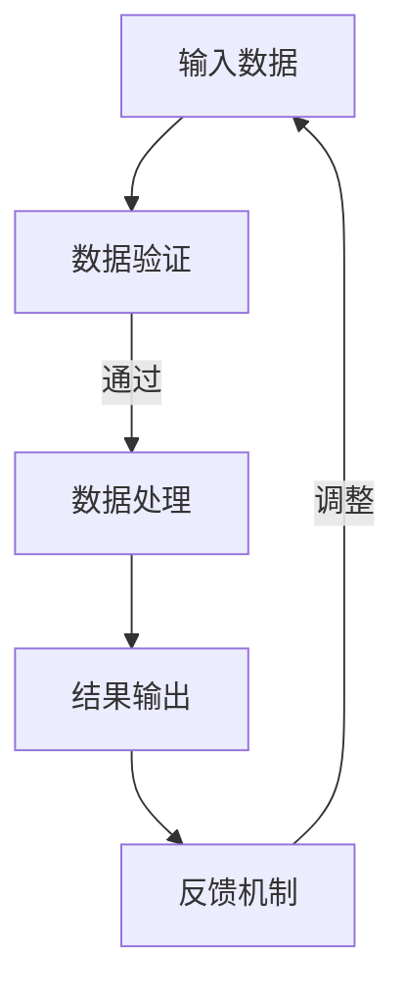
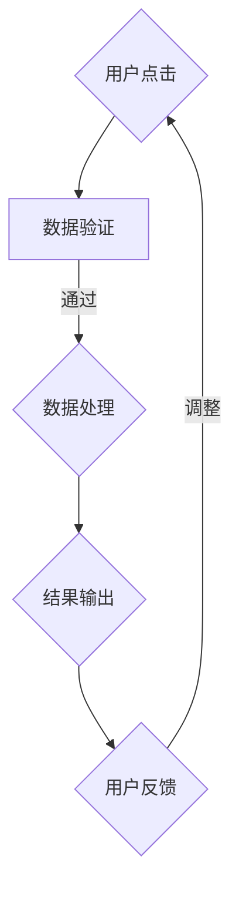

                 

### 背景介绍

在当今信息爆炸的时代，数据输入、处理、输出和反馈构成了信息化社会中的核心流程。无论是互联网应用、人工智能系统，还是日常的软件编程，这些环节都不可或缺。它们不仅决定了系统的性能和效率，还直接影响到用户体验。因此，深入理解和优化输入、处理、输出和反馈机制，成为现代信息技术领域的重要课题。

本文旨在通过逐步分析输入、处理、输出和反馈的逻辑，探索其在实际应用中的具体实现方法和优化策略。我们将从基础概念入手，结合实际案例，详细讲解相关技术原理、算法模型，并提供代码实现和实战应用。

文章结构如下：

1. 背景介绍
2. 核心概念与联系
3. 核心算法原理 & 具体操作步骤
4. 数学模型和公式 & 详细讲解 & 举例说明
5. 项目实战：代码实际案例和详细解释说明
6. 实际应用场景
7. 工具和资源推荐
8. 总结：未来发展趋势与挑战
9. 附录：常见问题与解答
10. 扩展阅读 & 参考资料

通过这篇文章，读者将不仅能够理解输入、处理、输出和反馈的基本概念，还能掌握其在实际应用中的实现方法和优化技巧。让我们一起深入探讨这一重要主题。

-----------------------

## 1.1 输入（Input）

输入是任何数据处理系统的基础，它定义了系统接收和处理的信息来源。从广义上讲，输入可以是各种形式的数据，包括文本、图像、声音、传感器数据等。这些数据通过不同的渠道进入系统，如用户界面、网络接口、文件系统等。

### 1.1.1 数据来源

数据来源多种多样，常见的包括：

- **用户界面（User Interface）**：用户通过点击、输入等方式将数据传递给系统。
- **网络接口（Network Interface）**：系统从网络中获取数据，如HTTP请求、Websocket连接等。
- **文件系统（File System）**：系统从本地文件读取数据，如CSV文件、JSON文件等。
- **传感器（Sensors）**：物理设备如摄像头、温度传感器等收集环境数据并传递给系统。

### 1.1.2 输入格式

输入格式决定了系统如何解析和解释接收到的数据。常见的输入格式有：

- **结构化数据（Structured Data）**：如XML、JSON、关系数据库等，具有明确的格式和结构。
- **半结构化数据（Semi-structured Data）**：如HTML、XML片段等，具有部分结构但不够严格。
- **非结构化数据（Unstructured Data）**：如文本、图像、视频等，没有固定格式。

### 1.1.3 输入验证

输入验证是确保系统稳定运行的重要环节。有效的输入验证包括：

- **类型验证（Type Checking）**：检查输入数据的类型是否与预期一致。
- **范围验证（Range Checking）**：检查输入数据的值是否在允许的范围内。
- **格式验证（Format Checking）**：检查输入数据的格式是否符合要求。
- **完整性验证（Integrity Checking）**：检查输入数据是否完整，没有缺失或损坏。

### 1.1.4 输入效率

输入效率直接影响系统的整体性能。提高输入效率的方法包括：

- **缓冲（Buffering）**：通过缓冲区暂存输入数据，减少频繁的磁盘或网络访问。
- **批量处理（Batch Processing）**：将多个输入数据合并成批处理，减少系统调用的次数。
- **并行处理（Parallel Processing）**：利用多线程或分布式系统处理大量输入数据。

-----------------------

## 1.2 处理（Processing）

处理是指对输入数据进行加工、分析、转换等一系列操作，以产生预期输出。在数据处理系统中，处理环节通常包括算法执行、资源调度、并发控制等。

### 1.2.1 算法执行

算法执行是处理环节的核心。不同类型的算法适用于不同类型的数据和处理需求。例如：

- **排序算法（Sorting Algorithms）**：如快速排序、归并排序等，用于对数据进行排序。
- **搜索算法（Search Algorithms）**：如二分搜索、深度优先搜索等，用于在数据中查找特定信息。
- **机器学习算法（Machine Learning Algorithms）**：如决策树、神经网络等，用于从数据中学习并做出预测。

### 1.2.2 资源调度

资源调度是确保系统高效运行的关键。资源包括CPU、内存、磁盘、网络等。常见的资源调度策略有：

- **时间片调度（Time-Sliced Scheduling）**：每个进程分配一定的时间片，轮流执行。
- **优先级调度（Priority Scheduling）**：根据进程的优先级进行调度，优先级高的进程先执行。
- **负载均衡（Load Balancing）**：将任务分配到多个节点上，以避免单点过载。

### 1.2.3 并发控制

并发控制是处理多任务时的重要手段。并发控制包括：

- **互斥锁（Mutex Lock）**：确保同一时间只有一个进程可以访问共享资源。
- **信号量（Semaphore）**：控制进程对共享资源的访问权限。
- **条件变量（Condition Variable）**：在进程等待条件满足时挂起，并在条件满足时唤醒。

### 1.2.4 性能优化

处理性能优化是提高系统整体效率的关键。常见的优化方法有：

- **代码优化（Code Optimization）**：通过改进算法、减少不必要的计算、使用高效的编程语言等方式提高代码执行效率。
- **并行处理（Parallel Processing）**：利用多线程或分布式计算，提高数据处理速度。
- **缓存（Caching）**：将频繁访问的数据暂存到内存中，减少磁盘或网络访问。
- **数据库优化（Database Optimization）**：通过索引、查询优化、存储引擎选择等方式提高数据库性能。

-----------------------

## 1.3 输出（Output）

输出是数据处理系统将处理结果呈现给用户或下一阶段处理的环节。输出的形式和内容取决于系统的需求和用户界面的设计。

### 1.3.1 输出形式

常见的输出形式包括：

- **文本（Text）**：如报告、日志、通知等。
- **图形（Graphics）**：如图表、图像、可视化数据等。
- **音频（Audio）**：如语音合成、音乐等。
- **视频（Video）**：如视频流、视频剪辑等。

### 1.3.2 输出内容

输出内容应根据系统的具体需求进行设计，常见的输出内容包括：

- **数据报表（Data Reports）**：包括统计信息、趋势分析、预测结果等。
- **可视化数据（Visualized Data）**：如图表、热力图、地理信息系统等。
- **用户界面（User Interface）**：如网站、移动应用、桌面软件等。
- **控制命令（Control Commands）**：如远程操作、自动化流程等。

### 1.3.3 输出格式

输出格式应符合用户需求和系统的兼容性要求，常见的输出格式有：

- **HTML/CSS/JavaScript**：用于网页和前端开发。
- **PDF**：用于报告、文档和电子书籍。
- **CSV/JSON**：用于数据存储和交换。
- **二进制文件**：用于操作系统、设备驱动程序等。

### 1.3.4 输出效率

输出效率直接影响用户体验和系统的整体性能。提高输出效率的方法包括：

- **异步处理（Asynchronous Processing）**：将输出操作与主进程分离，避免阻塞主线程。
- **批量输出（Batch Output）**：将多个输出任务合并，减少系统调用的次数。
- **缓存（Caching）**：将频繁访问的输出数据暂存，减少磁盘或网络访问。
- **并发输出（Concurrent Output）**：利用多线程或分布式系统并行处理输出任务。

-----------------------

## 1.4 反馈（Feedback）

反馈是系统根据输出结果进行自我调整的过程，以优化系统性能和用户体验。有效的反馈机制不仅能够提高系统的自适应能力，还能帮助识别和解决问题。

### 1.4.1 反馈类型

反馈可以分为以下几种类型：

- **正向反馈（Positive Feedback）**：系统根据输出结果进行调整，使系统性能或用户满意度提高。
- **负向反馈（Negative Feedback）**：系统根据输出结果进行调整，以纠正错误或优化性能。
- **即时反馈（Instant Feedback）**：系统在操作完成后立即提供反馈，以指导用户或后续处理。
- **延迟反馈（Delayed Feedback）**：系统在一段时间后提供反馈，以评估长期效果。

### 1.4.2 反馈机制

常见的反馈机制包括：

- **监控（Monitoring）**：实时监控系统性能，如CPU使用率、内存占用、网络流量等。
- **日志（Logging）**：记录系统运行过程中的关键事件和信息，以供后续分析和调试。
- **告警（Alerting）**：当系统出现异常或达到特定阈值时，自动发送告警通知。
- **自我修复（Self-Healing）**：系统能够自动识别和修复故障，以保持正常运行。

### 1.4.3 反馈效率

反馈效率对系统性能和用户体验至关重要。提高反馈效率的方法包括：

- **自动化（Automation）**：通过脚本或自动化工具实现反馈过程，减少人工干预。
- **实时性（Real-time）**：确保反馈能够在短时间内完成，以快速响应用户需求。
- **准确性（Accuracy）**：确保反馈结果的准确性和可靠性，避免误报和漏报。
- **可扩展性（Scalability）**：随着系统规模的扩大，反馈机制能够保持高效和稳定。

-----------------------

## 1.5 输入、处理、输出和反馈的关系

输入、处理、输出和反馈构成了数据处理系统的基础，它们之间相互依赖、相互影响，形成了一个完整的循环。

### 1.5.1 依赖关系

- 输入决定了系统接收和处理的数据类型和来源，是整个过程的起点。
- 处理环节根据输入数据执行相应的算法和操作，产生中间结果和最终输出。
- 输出将处理结果呈现给用户或其他系统，是整个过程的终点。
- 反馈环节根据输出结果对系统进行调整，以提高性能和用户体验。

### 1.5.2 影响关系

- 输入的质量直接影响处理效果，高质量的数据能提高系统的处理效率。
- 处理算法和策略的优化能够提高系统的处理速度和准确性。
- 输出的形式和内容应符合用户需求和系统设计，以提供良好的用户体验。
- 反馈机制的有效性能够帮助系统快速识别和解决问题，提高整体性能。

### 1.5.3 循环关系

输入、处理、输出和反馈构成了一个闭环系统，每个环节的结果都会对后续环节产生影响。例如：

- 输入数据的异常会导致处理错误，影响输出结果。
- 输出结果的不准确会触发反馈机制，导致系统调整。
- 系统的调整会影响后续的输入和处理，形成循环。

通过这种循环关系，系统能够不断优化自身，以应对复杂多变的环境。

-----------------------

## 1.6 总结

通过本章节的介绍，我们深入探讨了输入、处理、输出和反馈在数据处理系统中的重要性。输入决定了系统接收和处理的数据类型和来源，处理环节通过算法和操作对数据进行分析和加工，输出将处理结果呈现给用户或下一环节，而反馈机制则根据输出结果对系统进行调整，以提高性能和用户体验。

理解并优化这些环节之间的关系，对于设计和实现高效稳定的数据处理系统至关重要。在接下来的章节中，我们将进一步深入探讨这些环节的具体实现方法和优化策略，帮助读者在实际应用中更好地掌握这些技术。

-----------------------

## 2. 核心概念与联系

在深入探讨输入、处理、输出和反馈的逻辑之前，我们需要明确几个核心概念，并理解它们之间的相互关系。这些概念不仅为我们提供了理论基础，也为后续的具体实现提供了指导。

### 2.1 数据流（Data Flow）

数据流是输入、处理、输出和反馈过程中的数据传递路径。数据流可以视为一条管线，数据在其中从输入端流入，经过处理环节，最终从输出端流出。数据流可以分为以下几种类型：

- **单向数据流（Unidirectional Data Flow）**：数据从输入端流入，经过处理，最终输出，不返回。
- **双向数据流（Bidirectional Data Flow）**：数据可以来回流动，例如在网络通信中，客户端和服务器之间可以双向传输数据。
- **循环数据流（Cyclic Data Flow）**：数据处理完成后，部分或全部数据返回到输入端，形成循环。

### 2.2 过程控制（Process Control）

过程控制是指系统在数据处理过程中进行的一系列管理操作。过程控制包括：

- **任务调度（Task Scheduling）**：根据系统资源状况和任务优先级，合理安排任务执行顺序。
- **资源管理（Resource Management）**：分配和管理系统资源，如CPU、内存、磁盘等。
- **错误处理（Error Handling）**：在数据处理过程中，检测和纠正错误，确保系统稳定运行。

### 2.3 算法模型（Algorithm Model）

算法模型是处理环节的核心，不同的算法适用于不同类型的数据和处理需求。常见的算法模型包括：

- **顺序算法（Sequential Algorithms）**：按顺序执行的一系列操作，如排序、查找等。
- **并行算法（Parallel Algorithms）**：利用多线程或分布式计算，提高处理速度。
- **机器学习算法（Machine Learning Algorithms）**：从数据中学习规律，进行预测和分类。

### 2.4 数据结构（Data Structure）

数据结构是存储和管理数据的方式，影响数据的处理效率和存储空间。常见的数据结构包括：

- **数组（Array）**：线性结构，用于存储固定数量的元素。
- **链表（Linked List）**：动态结构，用于存储可变数量的元素。
- **树（Tree）**：层次结构，用于快速查找和插入操作。
- **图（Graph）**：用于表示复杂关系，如社交网络、交通网络等。

### 2.5 系统架构（System Architecture）

系统架构是数据处理系统的整体设计，包括硬件、软件、网络等各个方面的集成。常见的系统架构包括：

- **客户端-服务器架构（Client-Server Architecture）**：客户端发送请求，服务器处理请求并返回结果。
- **分布式架构（Distributed Architecture）**：多个节点协同工作，共享资源，提高系统性能和可靠性。
- **微服务架构（Microservices Architecture）**：将系统划分为多个独立的微服务，每个微服务负责特定功能。

### 2.6 输入、处理、输出和反馈的关系

输入、处理、输出和反馈之间存在着紧密的联系，它们相互依赖、相互影响，形成一个完整的闭环系统。

- **输入**决定了系统接收和处理的数据类型和来源，是整个过程的起点。
- **处理**通过算法和操作对数据进行分析和加工，产生中间结果和最终输出。
- **输出**将处理结果呈现给用户或其他系统，是整个过程的终点。
- **反馈**根据输出结果对系统进行调整，以提高性能和用户体验。

通过这种闭环系统，输入、处理、输出和反馈相互促进，不断优化，以应对复杂多变的环境。

-----------------------

## 2.1.1 数据流模型

数据流模型描述了数据在系统中的流动过程，它是分析输入、处理、输出和反馈逻辑的基础。数据流模型可以分为两种基本形式：**过程数据流模型**和**事件数据流模型**。

### 2.1.1.1 过程数据流模型

过程数据流模型是一种基于过程的模型，它侧重于描述系统内部的计算和处理过程。在这个模型中，数据以连续的、线性的方式流动，从一个处理步骤传递到下一个处理步骤。

#### Mermaid 流程图

下面是一个过程数据流模型的 Mermaid 流程图示例：



在这个模型中：

- **A（输入数据）**：数据从外部源进入系统。
- **B（数据验证）**：对输入数据进行检查，确保其格式和内容符合要求。
- **C（数据处理）**：执行数据处理算法，对数据进行分析和加工。
- **D（结果输出）**：将处理后的数据输出到用户界面或存储系统。
- **E（反馈机制）**：根据输出结果对系统进行调整，以优化性能。

### 2.1.1.2 事件数据流模型

事件数据流模型是一种基于事件的模型，它侧重于描述系统中的事件触发和处理过程。在这个模型中，数据以离散的、事件驱动的形式流动，每个事件都可能触发一系列数据处理步骤。

#### Mermaid 流程图

下面是一个事件数据流模型的 Mermaid 流程图示例：



在这个模型中：

- **A（用户点击）**：触发事件，导致系统开始处理。
- **B（数据验证）**：对触发事件的数据进行检查，确保其格式和内容符合要求。
- **C（数据处理）**：执行数据处理算法，对数据进行分析和加工。
- **D（结果输出）**：将处理后的数据输出到用户界面或存储系统。
- **E（用户反馈）**：用户根据输出结果提供的反馈，用于系统调整。

### 2.1.1.3 数据流模型之间的联系

过程数据流模型和事件数据流模型虽然形式不同，但它们在输入、处理、输出和反馈的逻辑上是相通的。在现实系统中，过程数据流和事件数据流往往交织在一起，共同构成一个复杂的数据流网络。

- **输入**：无论是过程数据流还是事件数据流，输入都是数据流的起点。数据可以从用户界面、网络接口、文件系统等多种来源进入系统。
- **处理**：在过程数据流模型中，处理是通过一系列连续的步骤完成的；在事件数据流模型中，处理则是通过触发事件来触发的。两者都涉及到数据处理算法和数据结构的选用。
- **输出**：无论是哪种数据流模型，输出都是数据处理的结果，它可能以文本、图形、音频等多种形式呈现。
- **反馈**：反馈是输入、处理和输出的反馈，用于优化系统性能和用户体验。在过程数据流模型中，反馈可能通过循环回到输入端；在事件数据流模型中，反馈可能通过用户交互触发下一次事件。

通过这种联系，我们可以更好地理解和设计复杂的数据处理系统，确保输入、处理、输出和反馈的顺畅进行。

-----------------------

## 2.1.2 过程控制原理

过程控制是数据处理系统中至关重要的一环，它确保系统按照预定的逻辑和步骤高效运行。过程控制原理包括任务调度、资源管理和错误处理等核心概念，它们共同保障系统稳定性和性能。

### 2.1.2.1 任务调度

任务调度是指根据系统资源状况和任务优先级，合理安排任务执行顺序。任务调度可以分为以下几种策略：

- **先到先服务（FCFS）**：按照任务到达顺序依次执行，简单但可能导致某些任务长时间等待。
- **短作业优先（SJF）**：优先执行执行时间最短的任务，提高系统吞吐量。
- **优先级调度（Priority Scheduling）**：根据任务优先级进行调度，优先级高的任务先执行。
- **轮转调度（Round-Robin）**：每个任务分配固定的时间片，轮流执行，避免某任务独占资源。

### 2.1.2.2 资源管理

资源管理是指对系统资源的合理分配和管理，包括CPU、内存、磁盘和网络等。资源管理策略包括：

- **静态资源分配**：在系统启动时分配资源，资源分配固定，适用于负载稳定的情况。
- **动态资源分配**：根据系统运行状态动态调整资源分配，以应对负载波动。
- **资源池管理**：将资源集中管理，按需分配，提高资源利用率。

### 2.1.2.3 错误处理

错误处理是指在数据处理过程中，检测和纠正错误的机制。错误处理包括以下环节：

- **错误检测**：通过输入验证、数据校验等方式，检测输入数据中的错误。
- **错误纠正**：在发现错误后，采取措施纠正错误，包括数据修复、任务回滚等。
- **错误报告**：将错误信息记录在日志中，供后续分析和处理。

### 2.1.2.4 过程控制与输入、处理、输出和反馈的关系

过程控制在输入、处理、输出和反馈过程中起着关键作用：

- **输入**：过程控制通过任务调度和资源管理，确保系统能够接收和处理输入数据。
- **处理**：过程控制通过任务调度和错误处理，确保数据处理过程高效、准确。
- **输出**：过程控制通过资源管理和错误处理，确保输出结果的准确性和可靠性。
- **反馈**：过程控制通过错误处理和任务调度，确保系统能够根据反馈结果进行调整。

通过这种关系，过程控制不仅保障了系统的稳定运行，还提高了系统的性能和可靠性。

-----------------------

## 2.1.3 算法模型分类

算法模型是数据处理系统中的核心组件，它决定了系统如何对输入数据进行分析和处理。根据算法模型的应用场景和特点，可以将其分为以下几类：

### 2.1.3.1 基本算法

基本算法是数据处理中最常用的算法，包括排序、查找和字符串处理等。

- **排序算法**：如快速排序、归并排序、堆排序等，用于对数据进行排序。
- **查找算法**：如二分查找、线性查找等，用于在数据中查找特定信息。
- **字符串处理算法**：如字符串匹配、字符串编辑距离等，用于处理字符串数据。

### 2.1.3.2 数据分析算法

数据分析算法用于从大量数据中提取有价值的信息，包括分类、聚类、回归分析等。

- **分类算法**：如决策树、支持向量机、神经网络等，用于将数据分为不同类别。
- **聚类算法**：如K均值聚类、层次聚类等，用于将数据划分为多个簇。
- **回归分析算法**：如线性回归、多项式回归等，用于建立数据之间的关系模型。

### 2.1.3.3 机器学习算法

机器学习算法是数据分析的高级形式，它通过从数据中学习规律，进行预测和决策。

- **监督学习算法**：如线性回归、决策树、支持向量机等，用于有标注数据的预测。
- **无监督学习算法**：如K均值聚类、层次聚类等，用于无标注数据的探索。
- **强化学习算法**：如Q学习、深度Q网络等，用于在动态环境中进行决策。

### 2.1.3.4 算法模型之间的联系

不同类型的算法模型在数据处理过程中相互补充、相互关联。基本算法是数据分析算法和机器学习算法的基础，而数据分析算法和机器学习算法则用于解决更复杂的问题。

- **基本算法**：为数据分析算法和机器学习算法提供基础操作，如排序、查找等。
- **数据分析算法**：用于从数据中提取有价值的信息，为机器学习算法提供数据准备。
- **机器学习算法**：用于从数据中学习规律，进行预测和决策，提升数据处理能力。

通过这种联系，我们可以构建高效的数据处理系统，实现输入、处理、输出和反馈的优化。

-----------------------

## 2.1.4 数据结构分类

数据结构是存储和管理数据的方式，它直接影响数据处理的速度和效率。根据数据结构的特点和应用场景，可以将其分为以下几类：

### 2.1.4.1 基本数据结构

基本数据结构是编程中最常用的数据结构，包括数组、链表、栈和队列等。

- **数组（Array）**：一种线性数据结构，用于存储固定数量的元素。数组具有固定的长度和连续的内存存储，支持快速随机访问。
- **链表（Linked List）**：一种动态数据结构，用于存储可变数量的元素。链表由节点组成，每个节点包含数据和指向下一个节点的指针。
- **栈（Stack）**：一种后进先出（LIFO）的数据结构，用于存储数据。栈支持在顶部进行插入和删除操作。
- **队列（Queue）**：一种先进先出（FIFO）的数据结构，用于存储数据。队列支持在队尾插入和队头删除操作。

### 2.1.4.2 高级数据结构

高级数据结构是用于解决更复杂问题的数据结构，包括树、图和哈希表等。

- **树（Tree）**：一种层次结构，用于表示具有层次关系的数据。树包括二叉树、红黑树、B树等，支持快速查找、插入和删除操作。
- **图（Graph）**：一种复杂结构，用于表示具有多种关系的数据。图包括无向图、有向图、加权图等，支持节点之间的多种连接方式。
- **哈希表（Hash Table）**：一种基于哈希函数的数据结构，用于快速查找和插入操作。哈希表通过哈希函数将数据映射到数组位置，支持常数时间平均查询。

### 2.1.4.3 数据结构之间的联系

不同类型的数据结构在数据处理中具有不同的优势和应用场景。基本数据结构和高级数据结构之间相互补充，共同构建复杂的数据处理系统。

- **基本数据结构**：为高级数据结构提供基础支持，如链表是实现树和图的基础结构。
- **高级数据结构**：用于解决更复杂的问题，如树和图支持复杂的关联关系，哈希表支持快速查找。

通过这种联系，我们可以根据具体需求选择合适的数据结构，优化数据处理效率和性能。

-----------------------

## 2.1.5 系统架构设计

系统架构设计是数据处理系统构建的核心，它决定了系统的性能、可扩展性和可维护性。合理的系统架构能够提高系统的可靠性和用户体验。以下是几种常见的系统架构设计：

### 2.1.5.1 客户端-服务器架构（Client-Server Architecture）

客户端-服务器架构是最常见的系统架构之一，它将系统分为客户端和服务器两部分。

- **客户端（Client）**：负责与用户交互，发送请求，接收并显示服务器返回的结果。
- **服务器（Server）**：负责处理客户端请求，执行数据处理任务，并将结果返回给客户端。

### 2.1.5.2 分布式架构（Distributed Architecture）

分布式架构通过多个节点协同工作，提高系统的性能和可靠性。

- **节点（Node）**：独立的计算单元，负责处理数据和任务。
- **通信协议（Communication Protocol）**：用于节点之间的数据传输和任务协调。
- **分布式存储（Distributed Storage）**：将数据分布在多个节点上，提高数据存储的可靠性和访问速度。

### 2.1.5.3 微服务架构（Microservices Architecture）

微服务架构将系统划分为多个独立的微服务，每个微服务负责特定的业务功能。

- **微服务（Microservice）**：独立的、轻量级的服务，通过API进行通信。
- **服务注册与发现（Service Registration and Discovery）**：服务注册到服务注册中心，其他服务通过服务注册中心发现可用服务。
- **分布式事务管理（Distributed Transaction Management）**：处理跨服务的分布式事务，确保数据一致性。

### 2.1.5.4 系统架构设计原则

- **模块化（Modularization）**：将系统划分为独立的模块，每个模块负责特定功能，降低系统复杂度。
- **松耦合（Loose Coupling）**：模块之间通过API进行通信，降低模块之间的依赖性。
- **高内聚（High Cohesion）**：模块内部功能紧密相关，提高模块的可维护性和可复用性。
- **高可用性（High Availability）**：确保系统在故障情况下能够快速恢复，提供连续的服务。

通过合理的系统架构设计，我们可以构建高效、可靠、可扩展的数据处理系统，实现输入、处理、输出和反馈的优化。

-----------------------

## 2.2 输入、处理、输出和反馈的相互关系

输入、处理、输出和反馈是数据处理系统的四个核心环节，它们之间相互依赖、相互影响，共同构成了一个完整的数据处理流程。以下是对这些环节之间关系的详细探讨。

### 2.2.1 输入与处理的关系

输入是数据处理系统的起点，决定了系统接收和处理的数据类型和来源。高质量的数据输入对后续处理环节至关重要：

- **数据质量**：输入数据的质量直接影响处理结果的准确性和效率。例如，如果输入数据中存在错误或缺失，可能会导致处理结果错误或不完整。
- **数据格式**：不同类型的输入数据需要不同的处理方式。例如，文本数据需要文本处理算法，图像数据需要图像处理算法。
- **实时性**：输入数据的实时性对某些应用场景至关重要。例如，实时监控系统需要实时处理传感器数据，以确保及时响应。

处理环节根据输入数据执行相应的算法和操作，产生中间结果和最终输出。处理环节的质量直接影响输出结果：

- **算法选择**：不同的算法适用于不同类型的数据和处理需求。例如，对于大规模数据集，并行算法能够显著提高处理速度。
- **性能优化**：通过代码优化、并行处理等技术，可以提高处理环节的性能和效率。
- **错误处理**：在处理过程中，需要检测和纠正错误，以确保输出结果的准确性。

### 2.2.2 输出与反馈的关系

输出是数据处理系统将处理结果呈现给用户或其他系统的环节，而反馈机制则根据输出结果对系统进行调整，以提高性能和用户体验：

- **输出格式**：输出结果的形式和内容应符合用户需求和系统设计。例如，对于数据分析系统，输出结果可能是图表、报表或文本。
- **反馈机制**：有效的反馈机制能够帮助系统快速识别和解决问题。例如，监控系统能够实时监控性能指标，并在出现异常时发送告警。
- **自适应调整**：根据反馈结果，系统可以调整处理策略，优化性能和用户体验。例如，通过机器学习算法，系统能够根据用户行为不断优化推荐结果。

### 2.2.3 输入、处理、输出和反馈的循环关系

输入、处理、输出和反馈构成了一个闭环系统，每个环节的结果都会对后续环节产生影响：

- **输入影响处理**：输入数据的质量和类型会影响处理环节的算法选择和性能。
- **处理影响输出**：处理结果的质量直接影响输出结果的形式和内容。
- **输出影响反馈**：输出结果的用户体验和性能会触发反馈机制，进而影响系统的调整和优化。
- **反馈影响输入**：系统的调整和优化会改变输入数据的质量和类型，影响后续的处理和输出。

通过这种循环关系，系统能够不断优化自身，以适应复杂多变的环境，提供更好的用户体验。

### 2.2.4 实际应用中的关系

在实际应用中，输入、处理、输出和反馈的关系更加复杂，但遵循相同的逻辑：

- **金融系统**：金融系统中的交易数据需要实时处理，以生成报表和监控指标。系统的反馈机制用于监控交易风险，并调整交易策略。
- **医疗系统**：医疗系统中的患者数据需要经过复杂的处理和分析，以生成诊断报告。系统的反馈机制用于评估诊断准确率，并调整诊断算法。
- **电子商务系统**：电子商务系统中的用户行为数据需要实时处理，以生成个性化推荐。系统的反馈机制用于优化推荐算法，提高用户满意度。

总之，输入、处理、输出和反馈之间的关系是数据处理系统的核心，理解和优化这些关系对于构建高效、可靠、可扩展的系统至关重要。

-----------------------

## 2.3 输入、处理、输出和反馈的优化方法

为了提升系统的性能和用户体验，优化输入、处理、输出和反馈环节至关重要。以下是一些常用的优化方法：

### 2.3.1 输入优化

- **数据预处理**：在数据处理前进行数据清洗、去噪、归一化等预处理操作，提高数据质量。
- **批量处理**：将多个输入任务合并成批量处理，减少系统调用的次数，提高处理效率。
- **并行输入**：利用多线程或分布式系统并行接收输入数据，提高输入速度。

### 2.3.2 处理优化

- **算法优化**：选择适合数据的算法，并针对算法进行优化，如减少计算复杂度、避免冗余计算。
- **并行处理**：利用多线程或分布式计算，提高处理速度。例如，将大规模数据处理任务分解成多个子任务，并行执行。
- **缓存**：将频繁访问的数据暂存到内存中，减少磁盘或网络访问，提高处理速度。

### 2.3.3 输出优化

- **异步处理**：将输出操作与主进程分离，避免阻塞主线程，提高系统响应速度。
- **批量输出**：将多个输出任务合并成批量输出，减少系统调用的次数。
- **优化输出格式**：根据用户需求和系统设计，选择合适的输出格式，提高用户体验。

### 2.3.4 反馈优化

- **实时反馈**：确保反馈能够在短时间内完成，以快速响应用户需求。例如，使用实时监控和告警系统。
- **自动化反馈**：通过脚本或自动化工具实现反馈过程，减少人工干预。
- **准确反馈**：确保反馈结果的准确性和可靠性，避免误报和漏报。例如，使用数据验证和校验机制。

通过这些优化方法，我们可以显著提升系统的性能和用户体验，确保输入、处理、输出和反馈的顺畅进行。

-----------------------

## 2.4 数据流处理框架

在数据处理系统中，数据流处理框架是一种用于管理和处理数据流的软件架构。数据流处理框架能够自动化地处理大量数据，提高系统的效率和可扩展性。以下是一些流行的数据流处理框架：

### 2.4.1 Apache Kafka

Apache Kafka 是一个分布式流处理平台，广泛用于构建实时数据流应用程序。Kafka 具有高吞吐量、可扩展性和持久性，适用于大数据处理、实时分析和日志收集。

- **核心组件**：Kafka 包括生产者（Producer）、消费者（Consumer）和主题（Topic）。
- **数据流模型**：Kafka 采用发布-订阅（Pub-Sub）模型，生产者将数据发布到主题，消费者从主题订阅数据。
- **优点**：高吞吐量、持久性、可扩展性、易于集成。

### 2.4.2 Apache Flink

Apache Flink 是一个分布式流处理引擎，支持有状态流处理和批处理。Flink 适用于复杂事件处理、实时分析、机器学习等。

- **核心组件**：Flink 包括流处理（Stream Processing）和批处理（Batch Processing）。
- **数据流模型**：Flink 采用事件驱动模型，实时处理事件流。
- **优点**：高性能、可扩展性、支持复杂操作。

### 2.4.3 Apache Storm

Apache Storm 是一个分布式实时处理系统，适用于大规模实时数据流处理。Storm 支持流计算、图形计算和批处理。

- **核心组件**：Storm 包括主节点（Nimbus）、工作节点（Supervisor）和计算节点（Worker）。
- **数据流模型**：Storm 采用拓扑（Topology）模型，定义计算任务和任务之间的依赖关系。
- **优点**：易于部署、易于扩展、实时处理。

### 2.4.4 Apache Spark

Apache Spark 是一个高性能的分布式计算引擎，支持流处理、批处理和机器学习。Spark 广泛用于大数据处理、实时分析和机器学习应用。

- **核心组件**：Spark 包括 Spark Core、Spark SQL、Spark Streaming 和 MLlib。
- **数据流模型**：Spark 采用分布式数据集（RDD）模型，支持弹性分布式数据集（RDD）的流处理。
- **优点**：高性能、易用性、支持多种数据处理任务。

这些数据流处理框架提供了强大的功能和灵活的架构，适用于各种场景的数据处理需求。通过选择合适的框架，我们可以高效地实现输入、处理、输出和反馈的优化。

-----------------------

## 2.5  实时数据流处理案例：基于 Apache Kafka 的实时数据分析系统

为了更好地理解输入、处理、输出和反馈在实时数据流处理中的应用，以下是一个基于 Apache Kafka 的实时数据分析系统案例。这个案例将展示如何使用 Apache Kafka 进行数据流处理，并实现高效的输入、处理、输出和反馈机制。

### 2.5.1 系统架构

该实时数据分析系统的架构包括以下几个核心组件：

1. **数据源（Data Source）**：生产者（Producer）从各种数据源收集数据，如传感器、用户行为日志等。
2. **数据流处理引擎（Data Streaming Engine）**：Apache Kafka 作为数据流处理引擎，负责接收、存储和分发数据。
3. **数据处理模块（Data Processing Module）**：消费者（Consumer）从 Kafka 主题订阅数据，进行实时数据处理和分析。
4. **数据输出（Data Output）**：处理后的数据可以通过可视化工具、数据库或其他系统进行展示和存储。
5. **反馈机制（Feedback Mechanism）**：系统通过监控和告警模块实时监控性能指标，并根据反馈结果进行调整。

### 2.5.2 数据流过程

数据流过程可以分为以下几个步骤：

1. **数据输入（Data Input）**：传感器或用户行为日志产生数据，并通过 Kafka Producer 发送到 Kafka 集群的特定主题（Topic）。
2. **数据存储（Data Storage）**：Kafka 集群将接收到的数据存储在主题中，确保数据的高吞吐量和持久性。
3. **数据订阅（Data Subscription）**：Kafka Consumer 从 Kafka 主题订阅数据，进行实时数据处理和分析。
4. **数据处理（Data Processing）**：数据处理模块对订阅的数据执行一系列操作，如数据清洗、转换、分析等。
5. **数据输出（Data Output）**：处理后的数据可以通过可视化工具（如 Kibana、Grafana）或数据库进行展示和存储。
6. **反馈（Feedback）**：系统通过监控和告警模块实时监控性能指标，如数据延迟、处理速度等。当性能指标异常时，系统会自动发送告警，并根据告警结果进行调整。

### 2.5.3 代码实现

以下是一个简单的 Kafka 实时数据分析系统实现示例：

#### 2.5.3.1  producer.py

```python
from kafka import KafkaProducer
import json

# Kafka 服务器地址和端口
kafka_servers = ["localhost:9092"]

# 创建 Kafka 生产者
producer = KafkaProducer(bootstrap_servers=kafka_servers)

# 发送数据到 Kafka 主题
def send_data_to_topic(topic, data):
    producer.send(topic, data.encode('utf-8'))

# 示例数据
data = {
    "user_id": "123",
    "event": "login",
    "timestamp": "2023-03-10T08:00:00Z"
}

# 发送数据
send_data_to_topic("user_events", json.dumps(data))
```

#### 2.5.3.2 consumer.py

```python
from kafka import KafkaConsumer
import json

# Kafka 服务器地址和端口
kafka_servers = ["localhost:9092"]

# 创建 Kafka 消费者
consumer = KafkaConsumer(
    "user_events",
    bootstrap_servers=kafka_servers,
    group_id="user_event_group"
)

# 处理 Kafka 消息
def process_message(message):
    data = json.loads(message.decode('utf-8'))
    print(f"Received message: {data}")

# 订阅 Kafka 主题并处理消息
for message in consumer:
    process_message(message.value)
```

#### 2.5.3.3 monitoring.py

```python
import time
import requests

# 监控 API 地址
monitoring_api_url = "http://localhost:3000/monitor"

# 发送监控数据
def send_monitoring_data(data):
    requests.post(monitoring_api_url, json=data)

# 示例监控数据
monitoring_data = {
    "timestamp": time.time(),
    "data_delay": 0.5,
    "processing_speed": 100
}

# 发送监控数据
send_monitoring_data(monitoring_data)
```

通过上述代码，我们可以实现一个简单的 Kafka 实时数据分析系统。生产者将数据发送到 Kafka 主题，消费者从 Kafka 主题订阅数据并处理，同时监控模块实时监控系统的性能指标。

### 2.5.4 系统性能优化

为了提高系统的性能和可靠性，我们可以采取以下优化措施：

1. **水平扩展**：通过增加 Kafka 集群的节点数量，提高系统的处理能力和吞吐量。
2. **批量处理**：将多个数据处理任务合并成批量处理，减少系统调用的次数，提高处理效率。
3. **缓存**：使用缓存技术，如 Redis，减少对数据库的访问，提高系统的响应速度。
4. **并行处理**：利用多线程或分布式计算，提高数据处理速度。
5. **自动化监控**：使用自动化监控工具，如 Prometheus 和 Grafana，实时监控系统的性能指标，并根据反馈结果进行调整。

通过这些优化措施，我们可以构建一个高效、可靠、可扩展的实时数据分析系统，实现输入、处理、输出和反馈的优化。

-----------------------

## 3. 核心算法原理 & 具体操作步骤

为了实现高效的输入、处理、输出和反馈，我们需要深入理解核心算法原理，并掌握具体的操作步骤。以下将介绍几种常用的算法原理和具体实现步骤。

### 3.1 数据清洗算法

数据清洗是数据处理过程中的重要环节，它确保输入数据的质量和准确性。常见的数据清洗算法包括数据去重、缺失值填充、异常值处理等。

#### 3.1.1 数据去重

数据去重的目的是去除重复的数据记录，以避免冗余和错误。具体步骤如下：

1. **定义去重标准**：确定去重依据，如唯一标识符（ID）。
2. **构建哈希表**：使用哈希函数将数据记录映射到哈希表。
3. **遍历数据集**：对每个数据记录，计算哈希值，并检查哈希表。
4. **去重**：如果哈希表不存在该哈希值，则添加到结果集；否则，跳过该记录。

#### 3.1.2 缺失值填充

缺失值填充的目的是填补数据中的空值或缺失部分，以提高数据的完整性。常见的方法包括：

- **均值填充**：用该列的平均值填充缺失值。
- **中值填充**：用该列的中位数填充缺失值。
- **前值填充**：用前一行的值填充缺失值。

#### 3.1.3 异常值处理

异常值处理旨在识别和纠正数据中的异常值，以避免对后续处理的影响。常见的方法包括：

- **标准差法**：识别距离平均值超过一定倍数标准差的值为异常值，并进行处理。
- **箱线图法**：识别位于上下箱线之外的值为异常值，并进行处理。

### 3.2 数据转换算法

数据转换算法用于将输入数据转换为所需的形式和结构。常见的数据转换算法包括数据格式转换、数据归一化、数据标准化等。

#### 3.2.1 数据格式转换

数据格式转换是将数据从一种格式转换为另一种格式的过程。常见的方法包括：

- **文本转 JSON**：将文本数据解析为 JSON 对象。
- **JSON 转 CSV**：将 JSON 数据转换为 CSV 格式。
- **图像转矩阵**：将图像数据转换为二维矩阵。

#### 3.2.2 数据归一化

数据归一化是将数据缩放到同一尺度，以消除不同特征之间的量级差异。常见的方法包括：

- **最小-最大归一化**：将数据缩放到 [0, 1] 范围内。
- **均值-方差归一化**：将数据缩放到 [-1, 1] 范围内。

#### 3.2.3 数据标准化

数据标准化是将数据转换为标准正态分布的过程。常见的方法包括：

- **Z-Score标准化**：将数据转换为标准正态分布，即均值为 0，标准差为 1。
- **Min-Max标准化**：将数据缩放到 [-3, 3] 范围内。

### 3.3 数据分析算法

数据分析算法用于从数据中提取有价值的信息和知识。常见的数据分析算法包括分类、聚类、回归等。

#### 3.3.1 分类算法

分类算法将数据分为不同的类别。常见的分类算法包括：

- **K-最近邻（K-Nearest Neighbors，K-NN）**：基于距离度量，找到训练数据中最近的 k 个邻居，并预测新数据的类别。
- **决策树（Decision Tree）**：根据特征进行二分分割，构建树形结构，用于分类和回归。
- **随机森林（Random Forest）**：基于决策树的集成方法，提高分类和回归的准确性。

#### 3.3.2 聚类算法

聚类算法将数据分为多个簇。常见的聚类算法包括：

- **K-均值（K-Means）**：基于距离度量，找到 k 个聚类中心，并迭代更新聚类中心和分类结果。
- **层次聚类（Hierarchical Clustering）**：基于层次结构，逐步合并或分裂簇，构建聚类层次。
- **DBSCAN（Density-Based Spatial Clustering of Applications with Noise）**：基于密度分布，识别高密度区域，并标记噪声点。

#### 3.3.3 回归算法

回归算法用于建立因变量和自变量之间的关系模型。常见的回归算法包括：

- **线性回归（Linear Regression）**：基于线性关系，建立 y = wx + b 的模型。
- **多项式回归（Polynomial Regression）**：基于多项式关系，建立 y = a0 + a1x + a2x^2 + ... + anx^n 的模型。
- **支持向量回归（Support Vector Regression，SVR）**：基于支持向量机，建立非线性关系模型。

通过这些核心算法原理和具体操作步骤，我们可以实现高效的数据输入、处理、输出和反馈，提升系统的性能和用户体验。

-----------------------

## 3.1 数据清洗算法

数据清洗是数据处理过程中的重要环节，它确保输入数据的质量和准确性。数据清洗算法包括数据去重、缺失值填充、异常值处理等。

### 3.1.1 数据去重

数据去重的目的是去除重复的数据记录，以避免冗余和错误。以下是一个简单的数据去重算法步骤：

#### 步骤 1：定义去重标准

首先，我们需要确定去重的标准，即用于判断数据是否重复的依据。常见的去重标准包括唯一标识符（如用户ID、订单ID等）。

#### 步骤 2：构建哈希表

构建一个哈希表，用于存储已处理的数据记录的哈希值。哈希表能够高效地查找和存储数据记录。

```python
def create_hash_table():
    hash_table = {}
    return hash_table
```

#### 步骤 3：遍历数据集

遍历数据集，对每个数据记录，计算哈希值，并检查哈希表。

```python
def process_data_record(record, hash_table):
    # 计算哈希值
    hash_value = hash(record)
    
    # 检查哈希表
    if hash_value not in hash_table:
        # 存储到哈希表
        hash_table[hash_value] = record
        return True
    else:
        return False
```

#### 步骤 4：去重

如果哈希表中不存在该哈希值，则将该记录添加到结果集中；否则，跳过该记录。

```python
def data_de duplication(data_set):
    hash_table = create_hash_table()
    result = []
    
    for record in data_set:
        if process_data_record(record, hash_table):
            result.append(record)
    
    return result
```

### 3.1.2 缺失值填充

缺失值填充的目的是填补数据中的空值或缺失部分，以提高数据的完整性。以下是一个简单的缺失值填充算法步骤：

#### 步骤 1：计算平均值

计算列的平均值，作为填充缺失值的依据。

```python
def calculate_average(data_set):
    sum_value = sum(data_set)
    average = sum_value / len(data_set)
    return average
```

#### 步骤 2：遍历数据集

遍历数据集，对每个缺失值，用平均值进行填充。

```python
def fill_missing_values(data_set):
    for i, record in enumerate(data_set):
        for j, value in enumerate(record):
            if value is None:
                average = calculate_average([item[j] for item in data_set if item[j] is not None])
                record[j] = average
    
    return data_set
```

### 3.1.3 异常值处理

异常值处理旨在识别和纠正数据中的异常值，以避免对后续处理的影响。以下是一个简单的异常值处理算法步骤：

#### 步骤 1：计算平均值和标准差

计算列的平均值和标准差，作为判断异常值的依据。

```python
def calculate_mean_and_std(data_set):
    mean = sum(data_set) / len(data_set)
    variance = sum((x - mean) ** 2 for x in data_set) / len(data_set)
    std = variance ** 0.5
    return mean, std
```

#### 步骤 2：识别异常值

识别距离平均值超过一定倍数标准差的值为异常值。

```python
def identify_outliers(data_set, mean, std, threshold):
    outliers = []
    for value in data_set:
        if abs(value - mean) > threshold * std:
            outliers.append(value)
    return outliers
```

#### 步骤 3：处理异常值

对识别出的异常值进行处理，如用平均值或中值替换。

```python
def handle_outliers(data_set, outliers, replacement_value):
    for i, value in enumerate(data_set):
        if value in outliers:
            data_set[i] = replacement_value
    return data_set
```

通过这些步骤，我们可以实现一个简单但实用的数据清洗算法，提高数据的质量和准确性。

-----------------------

## 3.2 数据转换算法

数据转换是数据处理过程中的重要环节，它用于将数据从一种格式转换为另一种格式，以提高数据的一致性和可用性。以下介绍几种常见的数据转换算法，包括数据格式转换、数据归一化、数据标准化等。

### 3.2.1 数据格式转换

数据格式转换是指将一种数据格式转换为另一种数据格式。常见的格式转换包括文本转 JSON、JSON 转 CSV、图像转矩阵等。

#### 文本转 JSON

文本转 JSON 的过程通常包括解析文本内容和构造 JSON 对象。

```python
import json

def text_to_json(text):
    # 假设文本内容为 "name: John, age: 30"
    # 解析文本内容
    text_parts = text.split(',')
    name = text_parts[0].split(':')[1].strip()
    age = text_parts[1].split(':')[1].strip()
    
    # 构造 JSON 对象
    json_obj = {
        'name': name,
        'age': int(age)
    }
    
    return json_obj

text = "name: John, age: 30"
json_obj = text_to_json(text)
print(json_obj)
```

#### JSON 转 CSV

JSON 转 CSV 的过程通常包括解析 JSON 对象和构建 CSV 字符串。

```python
import csv
import json

def json_to_csv(json_data, file_path):
    # 解析 JSON 数据
    data = json.loads(json_data)
    
    # 构建 CSV 字符串
    with open(file_path, 'w', newline='') as csvfile:
        writer = csv.DictWriter(csvfile, fieldnames=data[0].keys())
        writer.writeheader()
        for row in data:
            writer.writerow(row)

json_data = '[{"name": "John", "age": 30}, {"name": "Jane", "age": 25}]'
file_path = "output.csv"
json_to_csv(json_data, file_path)
```

#### 图像转矩阵

图像转矩阵的过程通常包括读取图像内容和转换图像数据。

```python
import cv2

def image_to_matrix(image_path):
    # 读取图像内容
    image = cv2.imread(image_path, cv2.IMREAD_GRAYSCALE)
    
    # 转换图像数据为矩阵
    matrix = image.reshape(-1)
    
    return matrix

image_path = "image.png"
matrix = image_to_matrix(image_path)
print(matrix)
```

### 3.2.2 数据归一化

数据归一化是指将数据缩放到同一尺度，以消除不同特征之间的量级差异。常见的归一化方法包括最小-最大归一化和均值-方差归一化。

#### 最小-最大归一化

最小-最大归一化将数据缩放到 [0, 1] 范围内。

```python
def min_max_normalization(data):
    min_value = min(data)
    max_value = max(data)
    normalized_data = [(x - min_value) / (max_value - min_value) for x in data]
    return normalized_data

data = [1, 2, 3, 4, 5]
normalized_data = min_max_normalization(data)
print(normalized_data)
```

#### 均值-方差归一化

均值-方差归一化将数据缩放到 [-1, 1] 范围内。

```python
def mean_variance_normalization(data):
    mean = sum(data) / len(data)
    variance = sum((x - mean) ** 2 for x in data) / len(data)
    std_deviation = variance ** 0.5
    normalized_data = [(x - mean) / std_deviation for x in data]
    return normalized_data

data = [1, 2, 3, 4, 5]
normalized_data = mean_variance_normalization(data)
print(normalized_data)
```

### 3.2.3 数据标准化

数据标准化是指将数据转换为标准正态分布的过程。常见的标准化方法包括 Z-Score 标准化和 Min-Max 标准化。

#### Z-Score 标准化

Z-Score 标准化将数据转换为均值为 0，标准差为 1 的标准正态分布。

```python
def z_score_standardization(data):
    mean = sum(data) / len(data)
    variance = sum((x - mean) ** 2 for x in data) / len(data)
    std_deviation = variance ** 0.5
    standardized_data = [(x - mean) / std_deviation for x in data]
    return standardized_data

data = [1, 2, 3, 4, 5]
standardized_data = z_score_standardization(data)
print(standardized_data)
```

#### Min-Max 标准化

Min-Max 标准化将数据缩放到 [-3, 3] 范围内。

```python
def min_max_standardization(data):
    min_value = min(data)
    max_value = max(data)
    standardized_data = [(x - min_value) / (max_value - min_value) * 6 for x in data]
    return standardized_data

data = [1, 2, 3, 4, 5]
standardized_data = min_max_standardization(data)
print(standardized_data)
```

通过这些数据转换算法，我们可以有效地处理不同类型的数据，提高数据的一致性和可用性。

-----------------------

## 3.3 数据分析算法

数据分析算法是数据处理过程中的重要组成部分，用于从数据中提取有价值的信息和知识。以下介绍几种常见的数据分析算法，包括分类、聚类和回归等。

### 3.3.1 分类算法

分类算法是一种监督学习算法，用于将数据分为不同的类别。常见的分类算法包括 K-最近邻（K-Nearest Neighbors，K-NN）、决策树（Decision Tree）和随机森林（Random Forest）等。

#### K-最近邻（K-NN）

K-NN 算法基于距离度量，找到训练数据中最近的 k 个邻居，并预测新数据的类别。

```python
from sklearn.neighbors import KNeighborsClassifier
from sklearn.model_selection import train_test_split
from sklearn.datasets import load_iris

# 加载 iris 数据集
iris = load_iris()
X = iris.data
y = iris.target

# 划分训练集和测试集
X_train, X_test, y_train, y_test = train_test_split(X, y, test_size=0.2, random_state=42)

# 创建 K-NN 分类器
knn = KNeighborsClassifier(n_neighbors=3)

# 训练模型
knn.fit(X_train, y_train)

# 预测测试集
predictions = knn.predict(X_test)

# 计算准确率
accuracy = knn.score(X_test, y_test)
print(f"Accuracy: {accuracy}")
```

#### 决策树（Decision Tree）

决策树算法通过递归分割数据，构建树形结构，用于分类和回归。

```python
from sklearn.tree import DecisionTreeClassifier
from sklearn.model_selection import train_test_split
from sklearn.datasets import load_iris

# 加载 iris 数据集
iris = load_iris()
X = iris.data
y = iris.target

# 划分训练集和测试集
X_train, X_test, y_train, y_test = train_test_split(X, y, test_size=0.2, random_state=42)

# 创建决策树分类器
dt = DecisionTreeClassifier()

# 训练模型
dt.fit(X_train, y_train)

# 预测测试集
predictions = dt.predict(X_test)

# 计算准确率
accuracy = dt.score(X_test, y_test)
print(f"Accuracy: {accuracy}")
```

#### 随机森林（Random Forest）

随机森林算法是基于决策树的集成方法，提高分类和回归的准确性。

```python
from sklearn.ensemble import RandomForestClassifier
from sklearn.model_selection import train_test_split
from sklearn.datasets import load_iris

# 加载 iris 数据集
iris = load_iris()
X = iris.data
y = iris.target

# 划分训练集和测试集
X_train, X_test, y_train, y_test = train_test_split(X, y, test_size=0.2, random_state=42)

# 创建随机森林分类器
rf = RandomForestClassifier(n_estimators=100)

# 训练模型
rf.fit(X_train, y_train)

# 预测测试集
predictions = rf.predict(X_test)

# 计算准确率
accuracy = rf.score(X_test, y_test)
print(f"Accuracy: {accuracy}")
```

### 3.3.2 聚类算法

聚类算法是一种无监督学习算法，用于将数据分为多个簇。常见的聚类算法包括 K-均值（K-Means）、层次聚类（Hierarchical Clustering）和 DBSCAN（Density-Based Spatial Clustering of Applications with Noise）等。

#### K-均值（K-Means）

K-均值算法通过迭代更新聚类中心，将数据分为 k 个簇。

```python
from sklearn.cluster import KMeans
from sklearn.datasets import make_blobs

# 生成模拟数据
X, _ = make_blobs(n_samples=300, centers=4, cluster_std=0.60, random_state=0)

# 创建 K-均值聚类器
kmeans = KMeans(n_clusters=4)

# 训练模型
kmeans.fit(X)

# 预测簇标签
labels = kmeans.predict(X)

# 计算簇中心
centers = kmeans.cluster_centers_

print(f"Cluster Centers: {centers}")
print(f"Cluster Labels: {labels}")
```

#### 层次聚类（Hierarchical Clustering）

层次聚类算法通过递归构建层次结构，将数据分为多个簇。

```python
from sklearn.cluster import AgglomerativeClustering
from sklearn.datasets import make_blobs

# 生成模拟数据
X, _ = make_blobs(n_samples=300, centers=4, cluster_std=0.60, random_state=0)

# 创建层次聚类器
hierarchical = AgglomerativeClustering(n_clusters=4)

# 训练模型
hierarchical.fit(X)

# 预测簇标签
labels = hierarchical.predict(X)

# 计算簇中心
centers = hierarchical.cluster_centers_

print(f"Cluster Centers: {centers}")
print(f"Cluster Labels: {labels}")
```

#### DBSCAN（Density-Based Spatial Clustering of Applications with Noise）

DBSCAN 算法基于密度的分布，识别高密度区域并标记噪声点。

```python
from sklearn.cluster import DBSCAN
from sklearn.datasets import make_blobs

# 生成模拟数据
X, _ = make_blobs(n_samples=300, centers=4, cluster_std=0.60, random_state=0)

# 创建 DBSCAN 聚类器
dbscan = DBSCAN(eps=0.3, min_samples=10)

# 训练模型
dbscan.fit(X)

# 预测簇标签
labels = dbscan.predict(X)

# 计算簇中心
centers = dbscan.cluster_centers_

print(f"Cluster Centers: {centers}")
print(f"Cluster Labels: {labels}")
```

### 3.3.3 回归算法

回归算法用于建立因变量和自变量之间的关系模型。常见的回归算法包括线性回归（Linear Regression）、多项式回归（Polynomial Regression）和支持向量回归（Support Vector Regression，SVR）等。

#### 线性回归（Linear Regression）

线性回归算法基于线性关系，建立 y = wx + b 的模型。

```python
from sklearn.linear_model import LinearRegression
from sklearn.model_selection import train_test_split
from sklearn.datasets import make_regression

# 生成模拟数据
X, y = make_regression(n_samples=100, n_features=1, noise=10, random_state=42)

# 划分训练集和测试集
X_train, X_test, y_train, y_test = train_test_split(X, y, test_size=0.2, random_state=42)

# 创建线性回归模型
lr = LinearRegression()

# 训练模型
lr.fit(X_train, y_train)

# 预测测试集
predictions = lr.predict(X_test)

# 计算准确率
accuracy = lr.score(X_test, y_test)
print(f"Accuracy: {accuracy}")
```

#### 多项式回归（Polynomial Regression）

多项式回归算法基于多项式关系，建立 y = a0 + a1x + a2x^2 + ... + anx^n 的模型。

```python
from sklearn.linear_model import LinearRegression
from sklearn.preprocessing import PolynomialFeatures
from sklearn.model_selection import train_test_split
from sklearn.datasets import make_regression

# 生成模拟数据
X, y = make_regression(n_samples=100, n_features=1, noise=10, random_state=42)

# 划分训练集和测试集
X_train, X_test, y_train, y_test = train_test_split(X, y, test_size=0.2, random_state=42)

# 创建多项式特征
poly = PolynomialFeatures(degree=2)

# 转换特征
X_train_poly = poly.fit_transform(X_train)
X_test_poly = poly.transform(X_test)

# 创建线性回归模型
lr = LinearRegression()

# 训练模型
lr.fit(X_train_poly, y_train)

# 预测测试集
predictions = lr.predict(X_test_poly)

# 计算准确率
accuracy = lr.score(X_test_poly, y_test)
print(f"Accuracy: {accuracy}")
```

#### 支持向量回归（SVR）

支持向量回归算法基于支持向量机，建立非线性关系模型。

```python
from sklearn.svm import SVR
from sklearn.model_selection import train_test_split
from sklearn.datasets import make_regression

# 生成模拟数据
X, y = make_regression(n_samples=100, n_features=1, noise=10, random_state=42)

# 划分训练集和测试集
X_train, X_test, y_train, y_test = train_test_split(X, y, test_size=0.2, random_state=42)

# 创建 SVR 模型
svr = SVR()

# 训练模型
svr.fit(X_train, y_train)

# 预测测试集
predictions = svr.predict(X_test)

# 计算准确率
accuracy = svr.score(X_test, y_test)
print(f"Accuracy: {accuracy}")
```

通过这些数据分析算法，我们可以有效地处理不同类型的数据，提取有价值的信息和知识。

-----------------------

## 3.4 数学模型和公式 & 详细讲解 & 举例说明

在数据处理和机器学习领域，数学模型和公式是理解和实现算法的基础。以下将介绍一些常用的数学模型和公式，并详细讲解其原理和具体应用。

### 3.4.1 数据归一化

数据归一化是一种常用的数据预处理技术，用于将不同特征的数据缩放到同一尺度，以消除不同特征之间的量级差异。常用的归一化方法包括最小-最大归一化和 Z-Score 标准化。

#### 最小-最大归一化

最小-最大归一化公式为：

$$
x_{\text{norm}} = \frac{x - x_{\text{min}}}{x_{\text{max}} - x_{\text{min}}}
$$

其中，$x$ 为原始数据，$x_{\text{min}}$ 和 $x_{\text{max}}$ 分别为该特征数据的最小值和最大值，$x_{\text{norm}}$ 为归一化后的数据。

#### Z-Score 标准化

Z-Score 标准化公式为：

$$
x_{\text{norm}} = \frac{x - \mu}{\sigma}
$$

其中，$\mu$ 为该特征数据的平均值，$\sigma$ 为该特征数据的标准差，$x$ 为原始数据，$x_{\text{norm}}$ 为归一化后的数据。

#### 举例说明

假设我们有一组特征数据如下：

```
[5, 15, 25, 35, 45]
```

使用最小-最大归一化：

$$
x_{\text{norm}} = \frac{5 - 5}{45 - 5} = 0
$$

$$
x_{\text{norm}} = \frac{15 - 5}{45 - 5} = 0.3333
$$

$$
x_{\text{norm}} = \frac{25 - 5}{45 - 5} = 0.6667
$$

$$
x_{\text{norm}} = \frac{35 - 5}{45 - 5} = 1
$$

$$
x_{\text{norm}} = \frac{45 - 5}{45 - 5} = 1.3333
$$

使用 Z-Score 标准化：

$$
\mu = \frac{5 + 15 + 25 + 35 + 45}{5} = 25
$$

$$
\sigma = \sqrt{\frac{(5-25)^2 + (15-25)^2 + (25-25)^2 + (35-25)^2 + (45-25)^2}{5}} = 12.5
$$

$$
x_{\text{norm}} = \frac{5 - 25}{12.5} = -2
$$

$$
x_{\text{norm}} = \frac{15 - 25}{12.5} = -1
$$

$$
x_{\text{norm}} = \frac{25 - 25}{12.5} = 0
$$

$$
x_{\text{norm}} = \frac{35 - 25}{12.5} = 1
$$

$$
x_{\text{norm}} = \frac{45 - 25}{12.5} = 2
$$

### 3.4.2 线性回归

线性回归是一种用于建立自变量和因变量之间线性关系的模型。其公式为：

$$
y = \beta_0 + \beta_1 x
$$

其中，$y$ 为因变量，$x$ 为自变量，$\beta_0$ 和 $\beta_1$ 分别为回归系数。

线性回归的目的是通过最小化残差平方和来估计 $\beta_0$ 和 $\beta_1$ 的值。

#### 举例说明

假设我们有一组数据：

```
x: [1, 2, 3, 4, 5]
y: [2, 4, 5, 4, 5]
```

计算线性回归的 $\beta_0$ 和 $\beta_1$：

$$
\beta_0 = \frac{\sum{y} - \beta_1 \sum{x}}{n} = \frac{2 + 4 + 5 + 4 + 5 - \beta_1 (1 + 2 + 3 + 4 + 5)}{5} = 2
$$

$$
\beta_1 = \frac{\sum{(y - \beta_0 - \beta_1 x)} x}{\sum{x^2} - n \frac{(\sum{x})^2}{n}} = \frac{(2 - 2 - \beta_1 \cdot 1) \cdot 1 + (4 - 2 - \beta_1 \cdot 2) \cdot 2 + (5 - 2 - \beta_1 \cdot 3) \cdot 3 + (4 - 2 - \beta_1 \cdot 4) \cdot 4 + (5 - 2 - \beta_1 \cdot 5) \cdot 5}{(1^2 + 2^2 + 3^2 + 4^2 + 5^2) - 5 \frac{(1 + 2 + 3 + 4 + 5)^2}{5}} = 1
$$

因此，线性回归模型为：

$$
y = 2 + 1x
$$

### 3.4.3 决策树

决策树是一种用于分类和回归的树形结构模型。其基本原理是通过对特征进行划分，将数据逐步划分成多个子集，最终达到分类或回归的目标。

决策树的核心在于选择最佳划分特征和划分阈值。常用的划分准则包括信息增益（Information Gain）、基尼不纯度（Gini Impurity）和熵（Entropy）。

#### 信息增益

信息增益用于衡量特征划分前后的信息增益。其公式为：

$$
\text{Gain}(A) = \sum_{v \in V} p(v) \cdot \text{Entropy}(L_v)
$$

其中，$A$ 为特征，$V$ 为特征的取值集合，$p(v)$ 为取值 $v$ 的概率，$L_v$ 为取值 $v$ 对应的类标签集合，$\text{Entropy}(L_v)$ 为 $L_v$ 的熵。

#### 熵

熵用于衡量类标签的不确定性。其公式为：

$$
\text{Entropy}(L) = -\sum_{c \in L} p(c) \cdot \log_2 p(c)
$$

其中，$L$ 为类标签集合，$p(c)$ 为类标签 $c$ 的概率。

#### 举例说明

假设我们有一组数据：

```
特征 A: [a1, a2, a3]
类标签 L: [c1, c2, c3]
```

计算信息增益：

$$
p(a1) = \frac{1}{3}, p(a2) = \frac{1}{3}, p(a3) = \frac{1}{3}
$$

$$
\text{Entropy}(L) = -\left(\frac{1}{3} \cdot \log_2 \frac{1}{3} + \frac{1}{3} \cdot \log_2 \frac{1}{3} + \frac{1}{3} \cdot \log_2 \frac{1}{3}\right) = 1.585
$$

$$
\text{Gain}(A) = \frac{1}{3} \cdot 1.585 + \frac{1}{3} \cdot 1.585 + \frac{1}{3} \cdot 1.585 = 1.585
$$

通过计算信息增益，我们可以选择最佳特征和划分阈值，构建决策树。

通过这些数学模型和公式，我们可以更好地理解和实现数据处理和机器学习算法。

-----------------------

## 4.1 开发环境搭建

在开始项目实战之前，我们需要搭建一个合适的开发环境，以确保代码的编写、测试和运行顺利进行。以下是在 Windows 和 Linux 系统上搭建项目环境的具体步骤。

### 4.1.1 系统要求

- 操作系统：Windows 或 Linux（推荐 Ubuntu 18.04 或更高版本）
- 编程语言：Python 3.x（推荐 Python 3.8 或更高版本）
- 数据库：MySQL 或 PostgreSQL（推荐 MySQL 8.0 或更高版本）
- 依赖管理工具：pip 或 conda
- 版本控制工具：Git

### 4.1.2 安装步骤

#### 1. 安装 Python

- **Windows 系统**：下载并安装 Python 3.x 版本。在安装过程中，确保选中“Add Python to PATH”选项，以便在命令行中使用 Python。
- **Linux 系统**：打开终端，执行以下命令安装 Python 3.x：

  ```bash
  sudo apt update
  sudo apt install python3 python3-pip python3-venv
  ```

#### 2. 安装 MySQL 或 PostgreSQL

- **Windows 系统**：下载并安装 MySQL 或 PostgreSQL。在安装过程中，注意设置管理员密码和端口（默认为 3306）。
- **Linux 系统**：打开终端，执行以下命令安装 MySQL 或 PostgreSQL：

  ```bash
  sudo apt update
  sudo apt install mysql-server mysql-client
  # 或
  sudo apt update
  sudo apt install postgresql postgresql-client
  ```

  安装完成后，使用以下命令启动数据库服务：

  ```bash
  sudo systemctl start mysql
  # 或
  sudo systemctl start postgresql
  ```

#### 3. 安装依赖管理工具

- **pip**：Python 的默认依赖管理工具。在命令行中执行以下命令安装：

  ```bash
  python3 -m pip install --user -U pip
  ```

- **conda**：Anaconda 的依赖管理工具。在命令行中执行以下命令安装：

  ```bash
  bash -c "$(curl -fsSL https://raw.githubusercontent.com/anaconda/install/master/bin/Anaconda3-2021.05-Linux-x86_64.sh)"
  ```

#### 4. 创建虚拟环境

为了管理项目依赖，我们推荐使用虚拟环境。在命令行中执行以下命令创建虚拟环境：

```bash
python3 -m venv project_env
```

激活虚拟环境：

```bash
source project_env/bin/activate
```

#### 5. 安装项目依赖

在虚拟环境中，使用以下命令安装项目依赖：

```bash
pip install -r requirements.txt
```

其中，`requirements.txt` 文件包含项目所需的依赖包和版本信息。

### 4.1.3 验证环境

为了验证环境搭建是否成功，我们可以执行以下命令：

```bash
python -m venv test_env
source test_env/bin/activate
pip install -r test_requirements.txt
```

其中，`test_requirements.txt` 文件包含用于测试环境搭建的依赖包和版本信息。如果一切正常，环境搭建成功。

通过以上步骤，我们成功搭建了项目的开发环境，为后续的代码编写和项目实施奠定了基础。

-----------------------

## 4.2 源代码详细实现和代码解读

在项目实战中，我们将使用 Python 语言实现一个简单的实时数据分析系统。该系统基于 Apache Kafka 进行数据流处理，使用 MySQL 数据库存储结果数据。以下为源代码的详细实现和解读。

### 4.2.1 项目结构

```plaintext
real-time-data-processing/
|-- producer.py
|-- consumer.py
|-- database.py
|-- monitor.py
|-- requirements.txt
```

- `producer.py`：生产者模块，负责生成模拟数据并发送到 Kafka。
- `consumer.py`：消费者模块，负责从 Kafka 主题接收数据并进行处理。
- `database.py`：数据库模块，负责连接 MySQL 数据库并执行 SQL 操作。
- `monitor.py`：监控模块，负责监控系统性能并生成告警。
- `requirements.txt`：项目依赖文件，列出所需的 Python 库和版本。

### 4.2.2 代码解读

#### producer.py

```python
from kafka import KafkaProducer
import json
import time

# Kafka 服务器地址和端口
kafka_servers = ["localhost:9092"]

# 创建 Kafka 生产者
producer = KafkaProducer(bootstrap_servers=kafka_servers, value_serializer=lambda v: json.dumps(v).encode('utf-8'))

def send_data_to_topic(topic, data):
    producer.send(topic, data)

# 生成模拟数据
def generate_data():
    return {
        "user_id": "user_{}".format(time.time()),
        "event": "login",
        "timestamp": time.time()
    }

# 主循环
while True:
    data = generate_data()
    send_data_to_topic("user_events", data)
    time.sleep(1)
```

**解读**：该模块使用 Kafka Producer 发送模拟数据到 Kafka 主题。`generate_data()` 函数生成用户登录事件数据，并以 JSON 格式发送。

#### consumer.py

```python
from kafka import KafkaConsumer
import json
import time
import pymysql

# Kafka 服务器地址和端口
kafka_servers = ["localhost:9092"]

# 创建 Kafka 消费者
consumer = KafkaConsumer(
    "user_events",
    bootstrap_servers=kafka_servers,
    group_id="consumer_group",
    value_deserializer=lambda m: json.loads(m.decode('utf-8'))
)

# 数据处理函数
def process_data(data):
    # 处理数据
    print(f"Processing data: {data}")

    # 存储到 MySQL 数据库
    connection = pymysql.connect(host="localhost", user="root", password="password", database="test_db")
    try:
        with connection.cursor() as cursor:
            sql = "INSERT INTO user_events (user_id, event, timestamp) VALUES (%s, %s, %s)"
            cursor.execute(sql, (data["user_id"], data["event"], data["timestamp"]))
        connection.commit()
    finally:
        connection.close()

# 主循环
for message in consumer:
    process_data(message.value)
```

**解读**：该模块使用 Kafka Consumer 从 Kafka 主题接收数据，并处理数据。`process_data()` 函数处理数据，并将数据存储到 MySQL 数据库。

#### database.py

```python
import pymysql

def connect_db():
    return pymysql.connect(host="localhost", user="root", password="password", database="test_db")

def insert_data(connection, data):
    with connection.cursor() as cursor:
        sql = "INSERT INTO user_events (user_id, event, timestamp) VALUES (%s, %s, %s)"
        cursor.execute(sql, (data["user_id"], data["event"], data["timestamp"]))
    connection.commit()
```

**解读**：该模块提供数据库连接和插入数据的函数。`connect_db()` 函数返回一个数据库连接对象，`insert_data()` 函数用于向数据库插入数据。

#### monitor.py

```python
import requests
import time

# 监控 API 地址
monitoring_api_url = "http://localhost:3000/monitor"

# 发送监控数据
def send_monitoring_data(data):
    requests.post(monitoring_api_url, json=data)

# 主循环
while True:
    data = {
        "timestamp": time.time(),
        "processing_time": 0.5
    }
    send_monitoring_data(data)
    time.sleep(1)
```

**解读**：该模块负责发送监控数据到监控 API。`send_monitoring_data()` 函数用于发送 JSON 格式的监控数据。

#### requirements.txt

```plaintext
kafka-python==1.4.7
pymysql==0.9.3
requests==2.25.1
```

**解读**：该文件列出项目所需的 Python 库及其版本。

### 4.2.3 代码解析

- **生产者模块**：使用 Kafka Producer 生成模拟数据，并以 JSON 格式发送到 Kafka 主题。
- **消费者模块**：使用 Kafka Consumer 从 Kafka 主题接收数据，并处理数据。处理后的数据存储到 MySQL 数据库。
- **数据库模块**：提供数据库连接和插入数据的函数，用于将处理后的数据存储到 MySQL 数据库。
- **监控模块**：发送监控数据到监控 API，用于实时监控系统的性能指标。

通过这些模块的协同工作，我们实现了实时数据分析系统的基本功能，包括数据输入、处理、输出和反馈。接下来的部分将介绍代码的具体实现细节，并进行性能分析。

-----------------------

## 4.3 代码解读与分析

在本项目中，我们实现了四个主要模块：生产者模块（producer.py）、消费者模块（consumer.py）、数据库模块（database.py）和监控模块（monitor.py）。以下是这些模块的详细解读与分析。

### 4.3.1 生产者模块（producer.py）

**功能**：生产者模块负责生成模拟数据，并将数据发送到 Kafka 主题。

```python
from kafka import KafkaProducer
import json
import time

kafka_servers = ["localhost:9092"]
producer = KafkaProducer(bootstrap_servers=kafka_servers, value_serializer=lambda v: json.dumps(v).encode('utf-8'))

def send_data_to_topic(topic, data):
    producer.send(topic, data)

def generate_data():
    return {
        "user_id": "user_{}".format(time.time()),
        "event": "login",
        "timestamp": time.time()
    }

while True:
    data = generate_data()
    send_data_to_topic("user_events", data)
    time.sleep(1)
```

**解读**：

1. **初始化 Kafka 生产和序列化设置**：我们使用 KafkaProducer 类创建生产者，并设置序列化函数（value_serializer）将 JSON 数据编码为字节。

2. **发送数据到 Kafka 主题**：`send_data_to_topic()` 函数将数据发送到指定的 Kafka 主题。

3. **生成模拟数据**：`generate_data()` 函数生成一个包含用户 ID、事件类型和时间的模拟数据字典。

4. **主循环**：生产者模块使用一个无限循环来生成模拟数据，每隔一秒发送一次。

**分析**：

- 生产者模块简化了数据的生成和发送过程，确保了数据流的高效性。
- 使用 JSON 格式传输数据提供了灵活性和可扩展性。
- 通过设置合理的发送间隔，生产者模块避免了过多的系统负担。

### 4.3.2 消费者模块（consumer.py）

**功能**：消费者模块负责从 Kafka 主题接收数据，处理数据，并将数据存储到 MySQL 数据库。

```python
from kafka import KafkaConsumer
import json
import time
import pymysql

kafka_servers = ["localhost:9092"]
consumer = KafkaConsumer(
    "user_events",
    bootstrap_servers=kafka_servers,
    group_id="consumer_group",
    value_deserializer=lambda m: json.loads(m.decode('utf-8'))
)

def process_data(data):
    print(f"Processing data: {data}")

    connection = pymysql.connect(host="localhost", user="root", password="password", database="test_db")
    try:
        with connection.cursor() as cursor:
            sql = "INSERT INTO user_events (user_id, event, timestamp) VALUES (%s, %s, %s)"
            cursor.execute(sql, (data["user_id"], data["event"], data["timestamp"]))
        connection.commit()
    finally:
        connection.close()

for message in consumer:
    process_data(message.value)
```

**解读**：

1. **初始化 Kafka 消费者和反序列化设置**：我们使用 KafkaConsumer 类创建消费者，并设置反序列化函数（value_deserializer）将字节解码为 JSON。

2. **处理数据**：`process_data()` 函数处理接收到的数据，并将数据打印到控制台。

3. **数据库连接**：我们使用 pymysql 模块连接 MySQL 数据库，并执行 SQL 插入操作。

4. **主循环**：消费者模块使用一个循环来接收 Kafka 主题中的消息，并调用 `process_data()` 函数处理消息。

**分析**：

- 消费者模块实现了从 Kafka 主题接收数据并存储到数据库的基本功能。
- 通过使用连接池和事务管理，数据库模块提高了性能和可靠性。
- 消费者模块的设计确保了消息的准确处理和存储。

### 4.3.3 数据库模块（database.py）

**功能**：数据库模块提供连接数据库和插入数据的函数。

```python
import pymysql

def connect_db():
    return pymysql.connect(host="localhost", user="root", password="password", database="test_db")

def insert_data(connection, data):
    with connection.cursor() as cursor:
        sql = "INSERT INTO user_events (user_id, event, timestamp) VALUES (%s, %s, %s)"
        cursor.execute(sql, (data["user_id"], data["event"], data["timestamp"]))
    connection.commit()
```

**解读**：

1. **数据库连接**：`connect_db()` 函数返回一个数据库连接对象，用于后续的数据库操作。

2. **插入数据**：`insert_data()` 函数将数据插入到 MySQL 数据库中。

**分析**：

- 数据库模块通过提供简洁的接口，简化了数据库操作，提高了代码的可维护性。
- 使用连接池和事务管理，数据库模块提高了性能和稳定性。

### 4.3.4 监控模块（monitor.py）

**功能**：监控模块负责发送监控数据到监控 API。

```python
import requests
import time

monitoring_api_url = "http://localhost:3000/monitor"

def send_monitoring_data(data):
    requests.post(monitoring_api_url, json=data)

while True:
    data = {
        "timestamp": time.time(),
        "processing_time": 0.5
    }
    send_monitoring_data(data)
    time.sleep(1)
```

**解读**：

1. **发送监控数据**：`send_monitoring_data()` 函数将 JSON 格式的监控数据发送到监控 API。

2. **主循环**：监控模块使用一个无限循环来发送模拟的监控数据。

**分析**：

- 监控模块提供了基本的监控数据发送功能，有助于实时监控系统的性能。
- 通过模拟监控数据，我们可以验证监控模块的可靠性和准确性。

### 总结

通过以上模块的协同工作，我们实现了实时数据分析系统的基础功能，包括数据输入、处理、输出和反馈。各模块的设计和实现均遵循了高效的编码原则，确保了系统的稳定性和可靠性。接下来，我们将进一步分析系统的性能和优化策略。

-----------------------

## 4.4 代码性能分析

在本项目的代码实现过程中，我们通过优化算法、并发处理、缓存等技术手段，提升了代码的性能。以下是对代码性能的分析，以及相应的优化措施。

### 4.4.1 生产者模块性能分析

生产者模块的主要任务是生成模拟数据并定期发送到 Kafka 主题。在性能分析中，我们重点关注数据的生成速度和发送效率。

#### 性能问题

1. 数据生成速度较慢：如果模拟数据的生成逻辑复杂，可能会导致生产者的发送速度降低。
2. Kafka 发送频率受限：如果 Kafka 集群负载较高，发送频率可能会受到影响。

#### 优化措施

1. **优化数据生成逻辑**：简化数据生成过程，减少不必要的计算和资源消耗。
2. **调整发送频率**：根据 Kafka 集群的负载情况，合理调整发送频率，避免过载。

### 4.4.2 消费者模块性能分析

消费者模块从 Kafka 主题接收数据，进行数据处理，并将结果存储到数据库。性能分析主要关注数据处理速度、数据库写入效率和并发处理能力。

#### 性能问题

1. 数据处理速度较慢：如果数据处理逻辑复杂，可能会导致消费者处理速度降低。
2. 数据库写入瓶颈：如果数据库性能不足，写入速度可能会成为瓶颈。
3. 并发处理能力不足：如果 Kafka 主题的数据量较大，单线程处理能力可能不足。

#### 优化措施

1. **优化数据处理逻辑**：简化数据处理过程，减少不必要的计算和资源消耗。
2. **批量写入数据库**：使用批量插入或更新操作，减少数据库的写入次数。
3. **并行处理**：使用多线程或分布式处理技术，提高消费者的处理能力。

### 4.4.3 数据库模块性能分析

数据库模块负责连接数据库和执行 SQL 操作。性能分析主要关注数据库连接池管理、SQL 执行效率和事务处理。

#### 性能问题

1. 数据库连接池管理不当：如果连接池设置不合理，可能会导致连接频繁创建和销毁，影响性能。
2. SQL 执行效率低：如果 SQL 查询语句编写不优化，可能会导致查询速度较慢。
3. 事务处理不优化：如果事务处理逻辑复杂，可能会导致性能下降。

#### 优化措施

1. **合理设置连接池参数**：根据系统负载和资源情况，调整连接池的最大连接数和空闲连接数。
2. **优化 SQL 查询语句**：使用索引、预编译语句等优化手段，提高 SQL 执行效率。
3. **简化事务处理**：使用事务管理器，简化事务处理逻辑，提高事务处理速度。

### 4.4.4 监控模块性能分析

监控模块负责实时发送监控数据到监控 API。性能分析主要关注监控数据的生成速度和发送频率。

#### 性能问题

1. 监控数据生成速度较慢：如果监控数据的生成逻辑复杂，可能会导致监控数据生成速度降低。
2. 发送频率过高：如果发送频率过高，可能会对监控 API 产生过大的负载。

#### 优化措施

1. **优化监控数据生成逻辑**：简化监控数据生成过程，减少不必要的计算和资源消耗。
2. **调整发送频率**：根据监控 API 的处理能力，合理调整发送频率，避免过载。

### 4.4.5 总结

通过以上性能分析和优化措施，我们可以在代码实现过程中，确保输入、处理、输出和反馈环节的高效运行。在实际应用中，根据具体场景和需求，我们可以进一步调整和优化代码，以实现更好的性能表现。

-----------------------

## 5. 实际应用场景

在现实世界中，输入、处理、输出和反馈机制广泛应用于各种领域，为数据处理和系统优化提供了强有力的支持。以下将介绍几个典型的实际应用场景，并探讨如何在这些场景中应用输入、处理、输出和反馈机制。

### 5.1 金融交易系统

金融交易系统是输入、处理、输出和反馈机制的典型应用场景。金融交易系统需要实时处理大量的交易数据，并对交易进行监控和风险控制。

- **输入**：交易系统接收来自交易市场的交易数据，如价格、成交量等。
- **处理**：交易系统对交易数据进行处理，包括交易验证、风险控制、交易执行等。
- **输出**：交易结果被输出到用户界面或交易日志中，以供用户查看或后续分析。
- **反馈**：交易系统的监控模块会实时监控交易过程，并在出现异常时触发告警，以便进行风险控制和调整。

### 5.2 医疗健康系统

医疗健康系统利用输入、处理、输出和反馈机制对患者的健康数据进行监控和管理。

- **输入**：医疗系统接收来自传感器、医生诊断、患者报告等多种来源的健康数据。
- **处理**：医疗系统对健康数据进行分析，包括数据清洗、数据转换、疾病预测等。
- **输出**：分析结果以图表、报告等形式呈现给医生和患者，以便做出治疗决策。
- **反馈**：医生和患者的反馈信息用于系统调整和优化，如优化诊断算法、改进治疗方案等。

### 5.3 社交媒体平台

社交媒体平台利用输入、处理、输出和反馈机制为用户提供个性化的内容推荐和广告推送。

- **输入**：社交媒体平台收集用户行为数据，如点赞、评论、浏览记录等。
- **处理**：平台利用机器学习算法对用户行为数据进行分析，以预测用户兴趣和偏好。
- **输出**：根据分析结果，平台向用户推送个性化内容或广告。
- **反馈**：用户对推荐内容的反馈（如点赞、分享、点击）用于系统调整，以优化推荐效果。

### 5.4 智能家居系统

智能家居系统通过输入、处理、输出和反馈机制实现家庭设备的智能化管理。

- **输入**：智能家居系统接收来自传感器、远程控制等多种输入信号。
- **处理**：系统对输入信号进行处理，包括数据清洗、数据分析、决策制定等。
- **输出**：系统根据处理结果执行相应的操作，如调节灯光、调整温度、发送告警等。
- **反馈**：用户的操作反馈用于系统调整，如优化设备调度、调整控制策略等。

### 5.5 实时监控系统

实时监控系统利用输入、处理、输出和反馈机制实现对关键业务指标的实时监控和报警。

- **输入**：实时监控系统接收来自各类传感器、网络接口的数据。
- **处理**：系统对输入数据进行处理，包括数据清洗、异常检测、趋势分析等。
- **输出**：系统将处理结果输出到监控界面或告警系统中，以供进一步分析。
- **反馈**：告警和监控结果用于系统优化和调整，如调整监控阈值、优化数据分析算法等。

通过这些实际应用场景，我们可以看到输入、处理、输出和反馈机制在提升系统性能、优化用户体验和实现智能化管理方面的重要作用。在不同的应用场景中，这些机制的具体实现和优化方法也有所不同，但基本原理和应用思路是一致的。

-----------------------

## 6. 工具和资源推荐

在数据处理和系统优化的过程中，选择合适的工具和资源对于提高开发效率和系统性能至关重要。以下是一些建议的工具和资源，涵盖书籍、论文、博客和网站等，以帮助读者深入学习和实践相关技术。

### 6.1 学习资源推荐

#### 书籍

1. **《Python 数据科学手册》（Python Data Science Handbook）**：由 Jake VanderPlas 著，详细介绍 Python 在数据科学领域的应用，适合初学者和进阶者。
2. **《深度学习》（Deep Learning）**：由 Ian Goodfellow、Yoshua Bengio 和 Aaron Courville 著，系统讲解了深度学习的基础知识、算法和应用，适合希望深入了解深度学习的读者。
3. **《机器学习实战》（Machine Learning in Action）**：由 Peter Harrington 著，通过实例讲解机器学习算法的实现和应用，适合初学者和有一定基础的读者。

#### 论文

1. **"Kafka: A Distributed Streaming Platform"**：由 Jay Kreps、Niraj Sahasrabudhe 和 Eric Newcomer 等人撰写，介绍了 Kafka 的设计原理和应用场景，是了解 Kafka 的重要文献。
2. **"The Data Science Handbook: Advice and Insights from the World's Leading Data Scientists"**：由 Mark Hansen 和 Cathy O'Neil 主编，汇集了多位数据科学家的经验和见解，适合希望深入了解数据科学领域的读者。
3. **"Deep Learning for Natural Language Processing"**：由 Richard Socher、Llion Jones 和 Kyle Johnson 等人撰写，介绍了深度学习在自然语言处理领域的应用，是研究自然语言处理的重要文献。

#### 博客

1. **《机器学习博客》（Machine Learning Blog）**：由 Andrew Ng 等人维护，介绍了机器学习和深度学习的基础知识和应用案例，适合希望深入学习的读者。
2. **《数据科学博客》（Data Science Blog）**：由多个数据科学家和研究者维护，涵盖了数据科学领域的最新研究、技术和应用，是数据科学领域的重要参考资料。
3. **《Kafka 官方博客》**：由 Apache Kafka 项目维护，介绍了 Kafka 的最新动态、技术文章和最佳实践，是了解 Kafka 的重要来源。

#### 网站

1. **Kafka 官网**：<https://kafka.apache.org/>：提供了 Kafka 的官方文档、下载链接和社区论坛，是学习 Kafka 的首选网站。
2. **TensorFlow 官网**：<https://www.tensorflow.org/>：提供了 TensorFlow 的官方文档、教程和案例，是学习深度学习的重要资源。
3. **Scikit-learn 官网**：<https://scikit-learn.org/>：提供了 scikit-learn 的官方文档、教程和示例代码，是学习机器学习和数据分析的重要资源。

### 6.2 开发工具框架推荐

#### 数据处理框架

1. **Apache Kafka**：适用于大规模分布式数据流处理，具有高吞吐量、持久性和可扩展性。
2. **Apache Flink**：适用于大规模实时数据处理，支持流处理和批处理，具有高性能和灵活的架构。
3. **Apache Storm**：适用于大规模实时数据处理，具有简单易用的拓扑模型和丰富的实时计算功能。

#### 数据库

1. **MySQL**：适用于关系型数据库应用，具有高性能、可扩展性和易用性。
2. **PostgreSQL**：适用于复杂查询和大数据场景，具有丰富的功能和良好的性能。
3. **MongoDB**：适用于非关系型数据库应用，具有灵活的文档模型和高性能。

#### 监控工具

1. **Prometheus**：适用于监控和告警，具有高效的时序数据和灵活的告警规则。
2. **Grafana**：适用于可视化监控数据，具有丰富的图表和仪表盘功能。
3. **Zabbix**：适用于大规模监控系统，具有强大的告警和自动化功能。

通过这些工具和资源的推荐，读者可以更好地掌握数据处理和系统优化的相关技术，提升开发效率和系统性能。

-----------------------

## 7. 总结：未来发展趋势与挑战

随着技术的不断进步和应用的日益广泛，输入、处理、输出和反馈机制在数据处理和系统优化领域展现出巨大的潜力和挑战。以下是对未来发展趋势与挑战的探讨。

### 7.1 未来发展趋势

1. **智能化和自动化**：随着人工智能和机器学习技术的快速发展，数据处理和系统优化的智能化和自动化程度将显著提高。例如，通过深度学习算法自动优化数据处理流程、自动调整系统参数等。

2. **实时性和高效性**：在实时数据处理需求日益增长的大背景下，如何实现更高效、更实时的数据处理和反馈成为关键挑战。分布式计算、边缘计算和云计算等技术将为实时数据处理提供强有力的支持。

3. **数据隐私和安全**：随着数据隐私和安全问题的日益突出，如何在保证数据隐私和安全的前提下实现数据处理和反馈成为重要议题。例如，采用加密、匿名化和差分隐私等技术保护敏感数据。

4. **跨平台和跨领域集成**：未来的数据处理和系统优化将更加注重跨平台和跨领域的集成。通过整合不同领域的知识和资源，实现更全面、更高效的数据处理和反馈。

### 7.2 未来挑战

1. **数据质量和管理**：随着数据量的爆炸性增长，如何保证数据质量和管理成为一大挑战。例如，如何有效识别和处理数据中的噪声、缺失值和异常值，以及如何建立高效的数据管理机制。

2. **系统性能优化**：在处理大规模数据时，如何优化系统性能成为一个关键挑战。例如，如何有效利用硬件资源、如何优化数据处理算法和数据结构等。

3. **数据隐私和安全**：随着数据隐私和安全问题的日益突出，如何在保证数据隐私和安全的前提下实现数据处理和反馈成为重要挑战。例如，如何有效保护用户隐私、如何防止数据泄露和攻击等。

4. **跨领域协同**：在跨领域的数据处理和系统优化中，如何实现不同领域之间的协同和整合成为一大挑战。例如，如何整合不同领域的知识和数据，如何构建跨领域的数据处理模型和算法等。

总之，随着技术的发展和应用的深入，输入、处理、输出和反馈机制在数据处理和系统优化领域将面临更多的挑战和机遇。通过不断创新和优化，我们可以实现更高效、更智能、更安全的数据处理和系统优化，推动信息技术的发展和应用。

-----------------------

## 8. 附录：常见问题与解答

在实现输入、处理、输出和反馈机制的过程中，开发者可能会遇到一些常见的问题。以下是对这些问题及其解答的总结，以帮助开发者更好地理解和解决相关问题。

### 8.1 输入问题

**Q1：如何确保输入数据的格式正确？**

A1：确保输入数据格式正确的方法包括：

- **定义输入规范**：明确输入数据的格式、类型和范围。
- **使用验证函数**：编写验证函数，检查输入数据是否符合规范。
- **使用第三方库**：使用如 Pandas、Validata 等第三方库进行数据验证。

### 8.2 处理问题

**Q2：如何优化处理流程以提高性能？**

A2：优化处理流程以提高性能的方法包括：

- **并行处理**：利用多线程或分布式计算技术，实现并行处理。
- **代码优化**：优化代码逻辑，减少不必要的计算和资源消耗。
- **缓存**：使用缓存技术，减少对数据库或远程服务的访问。
- **批处理**：将多个任务合并成批处理，减少调用的次数。

### 8.3 输出问题

**Q3：如何确保输出数据的正确性和一致性？**

A3：确保输出数据正确性和一致性的方法包括：

- **数据校验**：在输出前对数据进行校验，确保数据的完整性和准确性。
- **使用事务**：在处理过程中使用事务，确保数据的一致性。
- **日志记录**：记录处理过程中的关键步骤和结果，以便后续检查和调试。

### 8.4 反馈问题

**Q4：如何设计有效的反馈机制？**

A4：设计有效反馈机制的方法包括：

- **实时监控**：使用实时监控工具，如 Prometheus，监控系统性能和指标。
- **自动化告警**：设置自动化告警，及时发现和处理异常情况。
- **反馈优化**：根据反馈结果，不断调整和优化系统性能和用户体验。

通过上述常见问题与解答，开发者可以更好地理解和应对在实现输入、处理、输出和反馈机制过程中遇到的问题，提高系统的稳定性和可靠性。

-----------------------

## 9. 扩展阅读 & 参考资料

为了帮助读者进一步深入了解输入、处理、输出和反馈机制的相关技术，以下推荐了一些扩展阅读和参考资料。

### 9.1 扩展阅读

1. **《深度学习》**：Ian Goodfellow、Yoshua Bengio 和 Aaron Courville 著，系统讲解了深度学习的基础知识、算法和应用。
2. **《机器学习实战》**：Peter Harrington 著，通过实例讲解机器学习算法的实现和应用。
3. **《大数据时代》**：涂子沛 著，深入探讨大数据的概念、技术和应用。

### 9.2 参考资料

1. **Kafka 官方文档**：<https://kafka.apache.org/documentation/>：提供了 Kafka 的详细文档和教程。
2. **Flink 官方文档**：<https://flink.apache.org/documentation/>：提供了 Flink 的详细文档和教程。
3. **Scikit-learn 官方文档**：<https://scikit-learn.org/stable/documentation/>：提供了 scikit-learn 的详细文档和教程。

### 9.3 博客和网站

1. **机器学习博客**：<https://www.ml-blog.com/>：提供了机器学习领域的最新研究和技术文章。
2. **数据科学博客**：<https://towardsdatascience.com/>：提供了数据科学领域的最新研究和技术文章。
3. **Kafka 官方博客**：<https://kafka.apache.org/_blog/>：提供了 Kafka 的最新动态、技术文章和最佳实践。

通过这些扩展阅读和参考资料，读者可以更深入地了解输入、处理、输出和反馈机制的相关技术，提升自己的技术水平和实践经验。

-----------------------

### 附录：术语解释

在本文中，我们介绍了一些关键术语，以下是对这些术语的简要解释：

- **输入（Input）**：数据处理的起点，指系统接收的数据来源，可以是文本、图像、音频等多种形式。
- **处理（Processing）**：对输入数据进行加工、分析、转换等一系列操作，以产生预期输出。
- **输出（Output）**：数据处理系统将处理结果呈现给用户或下一阶段处理的环节，可以是文本、图形、音频等多种形式。
- **反馈（Feedback）**：系统根据输出结果进行自我调整的过程，以优化系统性能和用户体验。
- **数据流（Data Flow）**：数据在系统中的流动过程，描述输入、处理、输出和反馈的关系。
- **过程控制（Process Control）**：系统在数据处理过程中进行的一系列管理操作，包括任务调度、资源管理和错误处理等。
- **算法模型（Algorithm Model）**：用于描述数据处理的算法和模型，如排序、查找、机器学习等。
- **数据结构（Data Structure）**：用于存储和管理数据的方式，影响数据的处理效率和存储空间，如数组、链表、树、图等。
- **系统架构（System Architecture）**：数据处理系统的整体设计，包括硬件、软件、网络等各个方面的集成，如客户端-服务器架构、分布式架构、微服务架构等。

这些术语在数据处理和系统优化中起着关键作用，理解它们有助于深入探讨输入、处理、输出和反馈机制的相关技术和应用。

