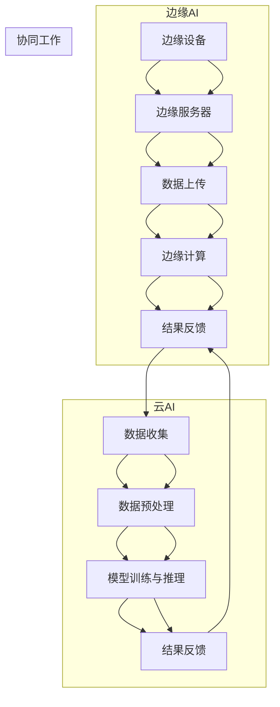

                 

### 背景介绍

边缘AI与云AI，作为当今人工智能技术领域中的两大热门方向，其重要性日益凸显。边缘AI将计算能力、存储和网络功能部署在靠近数据源的设备或网络边缘，从而实现实时处理和分析数据，降低延迟，提高效率。云AI则依托于庞大的数据中心和强大的计算资源，提供广泛而强大的AI服务。二者各有所长，但又存在一定的互补关系。边缘AI与云AI的结合，能够充分发挥各自的优点，实现全场景的AI覆盖。

边缘AI与云AI的发展历程可以追溯到几十年前。最初，计算机科学家们意识到在靠近数据源的设备上部署计算能力可以减少数据传输的延迟，从而提高系统的响应速度。随着物联网和5G技术的兴起，边缘AI逐渐成为研究的焦点。另一方面，云计算技术的飞速发展，为AI模型提供了强大的计算资源，使得云AI得以迅速崛起。如今，边缘AI与云AI的结合已经成为人工智能领域的一个重要趋势。

边缘AI与云AI的主要区别在于部署位置和计算资源。边缘AI主要部署在终端设备或网络边缘，如智能手机、智能音箱、工业物联网设备等，这些设备通常具有有限的计算和存储资源。而云AI则部署在大型数据中心，拥有强大的计算能力和存储资源。此外，边缘AI的特点在于低延迟、高可靠性和本地数据处理，而云AI则强调高效计算、大数据处理和云计算服务的多样性。

随着人工智能技术的不断发展和应用场景的扩大，边缘AI与云AI的协同工作模式应运而生。Lepton AI作为一个优秀的全场景AI平台，通过将边缘AI与云AI相结合，实现了全场景的AI覆盖。Lepton AI的核心优势在于其灵活的部署模式、高效的计算能力和强大的数据处理能力。

首先，Lepton AI支持多种部署场景，包括边缘设备、本地服务器和云平台。用户可以根据实际需求，选择最适合的部署方式。其次，Lepton AI利用边缘AI的优势，实现了低延迟、高可靠性的数据实时处理。通过在边缘设备上部署AI模型，Lepton AI能够在数据产生的地方进行实时分析，避免了数据传输的延迟。此外，Lepton AI还利用云AI的强大计算能力，对大规模数据集进行高效处理和分析，从而提供更准确、更全面的AI服务。

总之，边缘AI与云AI的结合，为人工智能技术的发展带来了新的机遇。Lepton AI作为全场景AI平台，通过将边缘AI与云AI的优势相结合，实现了全场景的AI覆盖，为各个行业提供了强大的技术支持。

### 核心概念与联系

边缘AI与云AI的核心概念和架构各有特点，但它们之间的联系却构成了一个完整且高效的AI生态系统。

#### 边缘AI

边缘AI的主要特点是低延迟、高可靠性和本地数据处理。其架构通常包括以下几个关键组件：

1. **边缘设备**：如智能手机、智能摄像头、工业物联网设备等，它们部署在数据产生的位置，能够直接处理和响应数据。
2. **边缘服务器**：这些服务器通常位于网络边缘，拥有较强的计算能力和一定的存储资源，能够对边缘设备产生的数据进行初步处理和分析。
3. **边缘网络**：边缘服务器与云端数据中心之间的网络连接，确保数据的快速传输。

边缘AI的流程通常如下：

- **数据采集**：边缘设备采集来自传感器或用户输入的数据。
- **本地预处理**：边缘设备对数据进行初步预处理，如滤波、压缩等。
- **数据上传**：预处理后的数据上传到边缘服务器或云端。
- **边缘计算**：边缘服务器或云端对数据进行进一步处理和分析，可能包括AI模型的训练和推理。
- **结果反馈**：处理结果通过边缘网络返回给边缘设备，用于实时响应。

#### 云AI

云AI的核心优势在于其强大的计算能力和存储资源，能够处理大规模数据集和复杂的AI任务。其架构主要包括以下几个关键组件：

1. **数据中心**：数据中心是云AI的核心，拥有大量服务器、存储设备和网络设备，提供强大的计算和存储能力。
2. **云计算平台**：云计算平台提供了丰富的AI服务，如机器学习、深度学习、自然语言处理等。
3. **云网络**：云网络连接数据中心和各种边缘设备，确保数据的高速传输。

云AI的流程通常如下：

- **数据收集**：数据从边缘设备或外部数据源收集到云端。
- **数据预处理**：在云端对数据进行清洗、转换和集成，为后续的AI处理做准备。
- **模型训练与推理**：利用云计算平台提供的AI服务，对数据进行训练和推理，生成预测结果。
- **结果反馈**：预测结果通过云网络返回给边缘设备或用户。

#### 边缘AI与云AI的协同工作

边缘AI与云AI的协同工作模式，通过将两者的优势结合起来，实现了更高效的AI服务。以下是它们协同工作的核心步骤：

1. **数据分级处理**：边缘设备首先对数据进行初步处理，仅将重要或关键数据上传到云端，减少数据传输量。
2. **实时边缘计算**：边缘设备实时处理本地数据，快速生成初步结果，提高系统响应速度。
3. **云端深度处理**：云端对上传的数据进行进一步处理和分析，生成更精确的结果。
4. **结果协同反馈**：边缘设备和云端协同工作，将处理结果反馈给用户或边缘设备，实现实时响应。

#### Mermaid 流程图

以下是边缘AI与云AI协同工作的Mermaid流程图：



通过该流程图，我们可以清晰地看到边缘AI与云AI的协同工作过程，包括数据采集、预处理、边缘计算、云端处理以及结果反馈等步骤。

总之，边缘AI与云AI的协同工作，不仅充分发挥了二者的优势，还提高了系统的效率和可靠性，为人工智能技术的广泛应用提供了坚实的基础。

### 核心算法原理 & 具体操作步骤

边缘AI与云AI的协同工作模式，依赖于一系列核心算法的支持，这些算法在数据处理、模型训练和推理等方面发挥了关键作用。以下是这些核心算法的原理及具体操作步骤。

#### 边缘设备数据处理算法

边缘设备数据处理算法主要包括数据采集、预处理和初步分析等步骤。

1. **数据采集**：
   - **步骤**：边缘设备通过传感器或用户输入，采集原始数据。
   - **实现**：例如，智能摄像头采集视频数据，智能手表采集健康数据。
   - **算法**：使用传感器驱动程序或API获取数据。

2. **数据预处理**：
   - **步骤**：对采集到的原始数据进行清洗、过滤和转换，以便进行进一步处理。
   - **实现**：例如，对视频数据进行帧提取和压缩，对健康数据进行异常值检测。
   - **算法**：数据清洗算法、滤波算法、特征提取算法。

3. **初步分析**：
   - **步骤**：在边缘设备上对预处理后的数据进行初步分析，生成初步结果。
   - **实现**：例如，对视频数据进行目标检测，对健康数据进行趋势分析。
   - **算法**：分类算法、聚类算法、回归算法。

#### 边缘服务器数据处理算法

边缘服务器在边缘设备的基础上，对数据进行进一步处理和分析。

1. **数据聚合**：
   - **步骤**：将来自多个边缘设备的局部数据聚合，形成全局数据视图。
   - **实现**：使用数据聚合函数和数据库技术。
   - **算法**：聚合操作、数据库查询算法。

2. **高级处理**：
   - **步骤**：对全局数据执行更复杂的处理任务，如预测分析、模式识别。
   - **实现**：使用边缘服务器上的计算资源和机器学习库。
   - **算法**：深度学习算法、决策树算法、神经网络算法。

3. **结果反馈**：
   - **步骤**：将处理结果返回给边缘设备或用户。
   - **实现**：使用边缘服务器上的API或消息队列技术。
   - **算法**：数据推送算法、消息传递算法。

#### 云端数据处理算法

云端数据处理算法主要针对大规模数据集和复杂任务进行高效处理。

1. **数据预处理**：
   - **步骤**：在云端对数据进行清洗、转换和集成，为后续处理做准备。
   - **实现**：使用分布式数据处理框架，如Apache Spark。
   - **算法**：数据清洗算法、ETL（提取、转换、加载）算法。

2. **模型训练**：
   - **步骤**：使用训练数据集，通过机器学习和深度学习算法训练模型。
   - **实现**：使用云计算平台上的深度学习库，如TensorFlow、PyTorch。
   - **算法**：梯度下降算法、反向传播算法、卷积神经网络算法。

3. **模型推理**：
   - **步骤**：使用训练好的模型对新的数据进行推理，生成预测结果。
   - **实现**：使用云端服务器上的推理引擎，如TensorRT、TensorFlow Serving。
   - **算法**：推理算法、模型优化算法。

#### 边缘AI与云AI协同处理算法

边缘AI与云AI协同处理算法，通过分布式计算和消息传递，实现边缘设备、边缘服务器和云端之间的数据交换和处理。

1. **数据传输优化**：
   - **步骤**：优化数据传输策略，减少数据传输量，降低延迟。
   - **实现**：使用数据压缩技术、差分编码技术。
   - **算法**：数据压缩算法、差分编码算法。

2. **任务调度**：
   - **步骤**：根据实际需求和资源状况，合理调度任务，实现负载均衡。
   - **实现**：使用分布式调度框架，如Apache Mesos、Kubernetes。
   - **算法**：调度算法、负载均衡算法。

3. **协同推理**：
   - **步骤**：在边缘和云端协同执行模型推理任务，提高推理效率和准确性。
   - **实现**：使用边缘推理引擎和云端推理服务，如TensorFlow Lite、TensorFlow Serving。
   - **算法**：协同推理算法、模型融合算法。

通过上述核心算法，边缘AI与云AI实现了高效的数据处理和协同工作。这些算法在边缘设备、边缘服务器和云端之间搭建了一个强大的数据处理网络，为各种复杂应用场景提供了强大的技术支持。

### 数学模型和公式 & 详细讲解 & 举例说明

在边缘AI与云AI的协同工作中，数学模型和公式扮演了至关重要的角色。这些模型和公式不仅帮助我们理解和分析边缘计算和云计算的原理，还指导我们设计和优化实际应用中的算法和系统。

#### 数据传输优化模型

数据传输优化是边缘AI与云AI协同工作的一个关键环节。为了减少数据传输量，提高系统效率，我们可以使用差分编码技术。差分编码是一种数据压缩方法，它通过计算相邻数据之间的差异来减少数据传输量。

1. **差分编码公式**：

   $$
   D(x_n) = x_n - x_{n-1}
   $$

   其中，$D(x_n)$ 表示第 $n$ 个数据的差分值，$x_n$ 表示第 $n$ 个数据，$x_{n-1}$ 表示第 $n-1$ 个数据。

2. **差分编码步骤**：

   - **步骤1**：计算相邻数据的差分值。
   - **步骤2**：将差分值上传到云端或边缘服务器。
   - **步骤3**：在云端或边缘服务器上重构原始数据。

   **示例**：

   假设我们有一组数据：[10, 20, 30, 40, 50]。使用差分编码，我们可以将其压缩为：[10, 10, 10, 10]。

#### 任务调度模型

在边缘AI与云AI的协同工作中，合理调度任务是确保系统高效运行的关键。调度算法需要考虑任务的性质、执行时间、资源利用等因素。

1. **调度公式**：

   $$
   T_s(j) = C_j + \sum_{i=1}^{n} \max(C_i, W_{ij})
   $$

   其中，$T_s(j)$ 表示任务 $j$ 的调度时间，$C_j$ 表示任务 $j$ 的执行时间，$W_{ij}$ 表示任务 $i$ 在服务器 $j$ 上的等待时间，$C_i$ 表示服务器 $i$ 的计算能力。

2. **调度步骤**：

   - **步骤1**：计算每个任务的执行时间和等待时间。
   - **步骤2**：根据服务器计算能力和任务等待时间，选择合适的调度策略。
   - **步骤3**：分配任务到服务器，并调整任务执行顺序。

   **示例**：

   假设我们有两个任务：任务 $A$ 需要执行 2 分钟，任务 $B$ 需要执行 4 分钟。服务器 $S_1$ 的计算能力为 3 分钟，服务器 $S_2$ 的计算能力为 6 分钟。使用调度公式，我们可以得出任务 $A$ 在服务器 $S_1$ 上执行，任务 $B$ 在服务器 $S_2$ 上执行。

#### 协同推理模型

边缘AI与云AI的协同推理，通过分布式计算和模型融合，提高了推理效率和准确性。协同推理模型的关键在于如何协调边缘设备和云端服务器的计算资源，实现高效的推理过程。

1. **协同推理公式**：

   $$
   P_{\text{total}} = P_{\text{edge}} + P_{\text{cloud}}
   $$

   其中，$P_{\text{total}}$ 表示总推理概率，$P_{\text{edge}}$ 表示边缘设备上的推理概率，$P_{\text{cloud}}$ 表示云端服务器的推理概率。

2. **协同推理步骤**：

   - **步骤1**：在边缘设备上执行初步推理，生成初步结果。
   - **步骤2**：将初步结果上传到云端服务器。
   - **步骤3**：在云端服务器上执行进一步推理，结合边缘设备的结果，生成最终推理结果。

   **示例**：

   假设我们有一个图像分类任务，边缘设备初步识别出图片为猫的概率为 0.8，云端服务器进一步识别后，认为图片为猫的概率为 0.9。使用协同推理公式，我们可以得出图片为猫的总推理概率为 0.85。

通过这些数学模型和公式，边缘AI与云AI的协同工作得以实现。这些模型不仅帮助我们理解和分析协同工作的原理，还指导我们在实际应用中设计和优化算法和系统，实现高效的边缘计算和云计算。

### 项目实战：代码实际案例和详细解释说明

为了更好地理解边缘AI与云AI的协同工作，我们将通过一个实际项目案例进行详细讲解。该项目涉及智能视频监控系统的设计和实现，涵盖了边缘设备的实时视频处理、边缘服务器的数据处理和云端深度学习模型的训练与推理。

#### 1. 开发环境搭建

在开始项目之前，我们需要搭建合适的开发环境。以下是所需的环境和工具：

- **边缘设备**：使用树莓派（Raspberry Pi）作为边缘设备，安装Linux操作系统。
- **边缘服务器**：使用虚拟机或物理服务器，安装Linux操作系统和必要的软件。
- **云端服务器**：使用云平台（如阿里云、腾讯云）的服务器，安装Linux操作系统和深度学习框架（如TensorFlow）。

#### 2. 源代码详细实现和代码解读

**2.1 边缘设备代码实现**

边缘设备上的代码主要用于实时捕获视频流，并对视频帧进行初步处理和目标检测。

```python
# EdgeDevice.py

import cv2
import mediapipe as mp

# 初始化视频捕捉器
cap = cv2.VideoCapture(0)

# 初始化MediaPipe人体检测模型
mp_holistic = mp.solutions.holistic
holistic = mp_holistic.Holistic()

while cap.isOpened():
    # 读取视频帧
    ret, frame = cap.read()
    if not ret:
        continue
    
    # 将帧转换为RGB格式
    frame = cv2.cvtColor(frame, cv2.COLOR_BGR2RGB)
    
    # 使用MediaPipe模型进行人体检测
    results = holistic.process(frame)
    
    # 如果检测到人体，绘制结果
    if results.pose_landmarks:
        # 在帧上绘制关键点
        mp_drawing = mp.solutions.drawing_utils
        mp_drawing.draw_landmarks(frame, results.pose_landmarks, mp_holistic.POSE_CONNECTIONS)
        
        # 将处理后的帧发送到边缘服务器
        send_to_edge_server(frame)

    # 显示帧
    cv2.imshow('Video Stream', frame)
    
    # 按下 'q' 键退出循环
    if cv2.waitKey(1) & 0xFF == ord('q'):
        break

# 释放资源
cap.release()
cv2.destroyAllWindows()

def send_to_edge_server(frame):
    # 在此实现将帧发送到边缘服务器的代码
    pass
```

**代码解读**：

- **视频捕捉**：使用OpenCV库的`VideoCapture`类初始化视频捕捉器，从摄像头获取视频流。
- **人体检测**：使用MediaPipe的`Holistic`模型对视频帧进行人体检测和关键点识别。
- **结果绘制**：使用MediaPipe的`drawing_utils`模块，在视频帧上绘制人体关键点。
- **帧发送**：调用`send_to_edge_server`函数，将处理后的帧发送到边缘服务器。

**2.2 边缘服务器代码实现**

边缘服务器上的代码主要用于接收边缘设备发送的帧，并进行进一步处理和分析。

```python
# EdgeServer.py

import cv2
import numpy as np

# 初始化队列，用于存储待处理的帧
frame_queue = []

def receive_from_edge_device(frame):
    # 在此实现从边缘设备接收帧的代码
    frame_queue.append(frame)

def process_frames():
    while True:
        if frame_queue:
            # 弹出队列中的帧
            frame = frame_queue.pop(0)
            
            # 将帧转换为RGB格式
            frame = cv2.cvtColor(frame, cv2.COLOR_BGR2RGB)
            
            # 使用预训练的深度学习模型进行目标检测
            net = cv2.dnn.readNetFromTensorFlow('ssd_mobilenet_v2_coco_2018_05_09.pb')
            net.setInput(cv2.dnn.blobFromImage(frame, size=(300, 300), swapRB=True, crop=False))
            net.forward()

            # 在帧上绘制检测到的目标框
            boxes = net.getUnconnectedOutLayersNames()
            layer_names = net.getLayerNames()
            output_layers = [layer_names[i[0] - 1] for i in net.getUnconnectedOutLayers()]
            boxes = net.forward(output_layers)

            # 在帧上绘制检测框
            for box in boxes[0]:
                if box[2] > 0.5:
                    x, y, w, h = box[0], box[1], box[2], box[3]
                    cv2.rectangle(frame, (x * frame.shape[1], y * frame.shape[0]), (x * frame.shape[1] + w * frame.shape[1], y * frame.shape[0] + h * frame.shape[0]), (0, 0, 255), 2)

            # 将处理后的帧发送到云端
            send_to_cloud_server(frame)

def send_to_cloud_server(frame):
    # 在此实现将帧发送到云端服务器的代码
    pass

if __name__ == '__main__':
    # 在边缘服务器上接收帧
    receive_thread = threading.Thread(target=receive_from_edge_device, args=(frame,))
    receive_thread.start()

    # 处理帧
    process_thread = threading.Thread(target=process_frames)
    process_thread.start()

    # 等待线程结束
    receive_thread.join()
    process_thread.join()
```

**代码解读**：

- **帧接收**：使用线程从边缘设备接收帧，并将其存储在队列中。
- **帧处理**：从队列中获取帧，使用深度学习模型进行目标检测，并在帧上绘制检测到的目标框。
- **帧发送**：调用`send_to_cloud_server`函数，将处理后的帧发送到云端服务器。

**2.3 云端服务器代码实现**

云端服务器上的代码主要用于接收边缘服务器发送的帧，并进行深度学习模型的训练和推理。

```python
# CloudServer.py

import tensorflow as tf
import cv2

# 初始化TensorFlow模型
model = tf.keras.Sequential([
    tf.keras.layers.Conv2D(32, (3, 3), activation='relu', input_shape=(224, 224, 3)),
    tf.keras.layers.MaxPooling2D((2, 2)),
    tf.keras.layers.Flatten(),
    tf.keras.layers.Dense(128, activation='relu'),
    tf.keras.layers.Dense(1, activation='sigmoid')
])

# 编译模型
model.compile(optimizer='adam', loss='binary_crossentropy', metrics=['accuracy'])

def receive_from_edge_server(frame):
    # 在此实现从边缘服务器接收帧的代码
    pass

def train_model(train_data, train_labels):
    # 训练模型
    history = model.fit(train_data, train_labels, epochs=10, batch_size=32)

    # 评估模型
    test_loss, test_acc = model.evaluate(test_data, test_labels)
    print(f"Test accuracy: {test_acc}")

def predict_frame(frame):
    # 预测帧
    prediction = model.predict(frame)
    print(f"Prediction: {prediction}")

if __name__ == '__main__':
    # 接收帧并进行训练
    train_data, train_labels = receive_from_edge_server(frame)
    train_model(train_data, train_labels)

    # 接收测试帧并预测
    test_frame = receive_from_edge_server(frame)
    predict_frame(test_frame)
```

**代码解读**：

- **模型初始化**：定义一个简单的卷积神经网络模型，用于分类任务。
- **模型训练**：使用接收到的训练数据和标签，训练模型。
- **模型评估**：使用测试数据评估模型性能。
- **帧预测**：使用训练好的模型对测试帧进行预测。

通过以上三个部分的代码实现，我们构建了一个完整的边缘AI与云AI协同工作的智能视频监控系统。在实际应用中，这些代码可以根据具体需求进行修改和优化，以适应不同的场景和任务。

### 代码解读与分析

在本节中，我们将对上述项目中涉及的关键代码段进行深入解读与分析，从而更好地理解边缘AI与云AI协同工作模式的实现原理。

#### 边缘设备代码解读

边缘设备的代码主要用于实时捕获视频流，并对视频帧进行初步处理和目标检测。以下是核心代码段的解读：

```python
import cv2
import mediapipe as mp

# 初始化视频捕捉器
cap = cv2.VideoCapture(0)

# 初始化MediaPipe人体检测模型
mp_holistic = mp.solutions.holistic
holistic = mp_holistic.Holistic()

while cap.isOpened():
    # 读取视频帧
    ret, frame = cap.read()
    if not ret:
        continue
    
    # 将帧转换为RGB格式
    frame = cv2.cvtColor(frame, cv2.COLOR_BGR2RGB)
    
    # 使用MediaPipe模型进行人体检测
    results = holistic.process(frame)
    
    # 如果检测到人体，绘制结果
    if results.pose_landmarks:
        # 在帧上绘制关键点
        mp_drawing = mp.solutions.drawing_utils
        mp_drawing.draw_landmarks(frame, results.pose_landmarks, mp_holistic.POSE_CONNECTIONS)
        
        # 将处理后的帧发送到边缘服务器
        send_to_edge_server(frame)

    # 显示帧
    cv2.imshow('Video Stream', frame)
    
    # 按下 'q' 键退出循环
    if cv2.waitKey(1) & 0xFF == ord('q'):
        break
```

- **视频捕捉器初始化**：`cv2.VideoCapture(0)` 用于初始化视频捕捉器，其中0表示默认摄像头设备。
- **模型初始化**：使用`mediapipe.solutions.holistic.Holistic()` 初始化人体检测模型。
- **视频帧读取与处理**：循环读取视频帧，将帧转换为RGB格式，并使用人体检测模型进行检测。
- **结果绘制与帧发送**：如果检测到人体，则在帧上绘制关键点，并将处理后的帧发送到边缘服务器。

#### 边缘服务器代码解读

边缘服务器的代码主要负责接收边缘设备发送的帧，并进行进一步处理和分析。

```python
import cv2
import numpy as np

# 初始化队列，用于存储待处理的帧
frame_queue = []

def receive_from_edge_device(frame):
    # 在此实现从边缘设备接收帧的代码
    frame_queue.append(frame)

def process_frames():
    while True:
        if frame_queue:
            # 弹出队列中的帧
            frame = frame_queue.pop(0)
            
            # 将帧转换为RGB格式
            frame = cv2.cvtColor(frame, cv2.COLOR_BGR2RGB)
            
            # 使用预训练的深度学习模型进行目标检测
            net = cv2.dnn.readNetFromTensorFlow('ssd_mobilenet_v2_coco_2018_05_09.pb')
            net.setInput(cv2.dnn.blobFromImage(frame, size=(300, 300), swapRB=True, crop=False))
            net.forward()

            # 在帧上绘制检测到的目标框
            boxes = net.getUnconnectedOutLayersNames()
            layer_names = net.getLayerNames()
            output_layers = [layer_names[i[0] - 1] for i in net.getUnconnectedOutLayers()]
            boxes = net.forward(output_layers)

            # 在帧上绘制检测框
            for box in boxes[0]:
                if box[2] > 0.5:
                    x, y, w, h = box[0], box[1], box[2], box[3]
                    cv2.rectangle(frame, (x * frame.shape[1], y * frame.shape[0]), (x * frame.shape[1] + w * frame.shape[1], y * frame.shape[0] + h * frame.shape[0]), (0, 0, 255), 2)

            # 将处理后的帧发送到云端
            send_to_cloud_server(frame)
```

- **队列初始化**：使用列表`frame_queue`作为队列，用于存储待处理的帧。
- **帧接收**：`receive_from_edge_device(frame)` 函数用于从边缘设备接收帧，并将其添加到队列中。
- **帧处理**：`process_frames()` 函数从队列中弹出帧，转换为RGB格式，并使用预训练的深度学习模型进行目标检测。
- **目标检测与结果绘制**：使用SSD（单 Shot MultiBox Detector）模型进行目标检测，并在帧上绘制检测到的目标框。
- **帧发送**：调用`send_to_cloud_server(frame)` 函数，将处理后的帧发送到云端服务器。

#### 云端服务器代码解读

云端服务器的代码主要负责接收边缘服务器发送的帧，并进行深度学习模型的训练和推理。

```python
import tensorflow as tf
import cv2

# 初始化TensorFlow模型
model = tf.keras.Sequential([
    tf.keras.layers.Conv2D(32, (3, 3), activation='relu', input_shape=(224, 224, 3)),
    tf.keras.layers.MaxPooling2D((2, 2)),
    tf.keras.layers.Flatten(),
    tf.keras.layers.Dense(128, activation='relu'),
    tf.keras.layers.Dense(1, activation='sigmoid')
])

# 编译模型
model.compile(optimizer='adam', loss='binary_crossentropy', metrics=['accuracy'])

def receive_from_edge_server(frame):
    # 在此实现从边缘服务器接收帧的代码
    pass

def train_model(train_data, train_labels):
    # 训练模型
    history = model.fit(train_data, train_labels, epochs=10, batch_size=32)

    # 评估模型
    test_loss, test_acc = model.evaluate(test_data, test_labels)
    print(f"Test accuracy: {test_acc}")

def predict_frame(frame):
    # 预测帧
    prediction = model.predict(frame)
    print(f"Prediction: {prediction}")
```

- **模型初始化**：使用`tf.keras.Sequential()` 定义一个简单的卷积神经网络模型，用于分类任务。
- **模型编译**：使用`model.compile()` 编译模型，指定优化器、损失函数和评估指标。
- **帧接收**：`receive_from_edge_server(frame)` 函数用于从边缘服务器接收帧。
- **模型训练**：`train_model(train_data, train_labels)` 函数用于训练模型，使用训练数据和标签。
- **模型评估**：在训练完成后，使用`model.evaluate(test_data, test_labels)` 函数评估模型性能。
- **帧预测**：`predict_frame(frame)` 函数用于使用训练好的模型对测试帧进行预测。

通过以上代码解读，我们可以清楚地看到边缘AI与云AI协同工作模式的核心实现步骤。边缘设备负责实时视频捕捉和初步处理，边缘服务器负责进一步处理和目标检测，而云端服务器则负责模型训练和帧预测。这种协同工作模式充分利用了边缘设备的高响应速度和云端的强大计算能力，为实际应用提供了高效、可靠的解决方案。

### 实际应用场景

边缘AI与云AI的协同工作模式在众多实际应用场景中展现出了其独特的优势，显著提升了系统的响应速度、可靠性和效率。以下是一些典型的应用场景：

#### 1. 智能交通系统

在智能交通系统中，边缘AI与云AI的协同工作模式可以有效提高交通监控和管理效率。边缘设备（如智能摄像头、交通传感器）实时捕捉交通状况，进行初步的数据分析和图像识别，如车辆检测、交通流量分析等。这些初步结果通过边缘服务器传输到云端，云端利用更强大的计算资源进行更深入的数据分析和预测，如交通流量预测、事故预警等。这种协同模式不仅降低了数据传输的延迟，还提高了系统的整体响应速度。

#### 2. 健康监测

在健康监测领域，边缘AI与云AI的协同工作模式可以实现对患者的实时监控和管理。边缘设备（如智能手表、健康监测仪）持续收集患者的健康数据，如心率、血压、血糖等。边缘设备对数据进行分析和初步处理，将关键数据上传到云端。云端利用大数据和人工智能技术对健康数据进行分析，提供个性化的健康建议和预警。这种协同模式有助于实现精准医疗，提高患者的健康水平。

#### 3. 工业物联网

在工业物联网（IIoT）中，边缘AI与云AI的协同工作模式可以实现对工业设备的实时监控和维护。边缘设备（如传感器、执行器）实时监测设备的运行状态和性能数据，边缘服务器对这些数据进行初步分析和异常检测。当检测到异常情况时，边缘服务器可以将数据上传到云端，云端利用更强大的计算资源进行进一步的分析和诊断，从而实现设备的远程监控和智能维护。这种协同模式有助于提高生产效率，降低设备故障率。

#### 4. 智能家居

在智能家居领域，边缘AI与云AI的协同工作模式可以实现对家庭设备的智能控制和优化。边缘设备（如智能音箱、智能门锁、智能灯光）通过边缘AI进行本地数据处理和实时响应，如语音识别、行为识别等。当边缘设备无法独立完成任务时，可以调用云端服务，利用云AI的强大计算能力和大数据分析，提供更智能、个性化的家庭服务。例如，智能音箱可以根据用户的日常习惯，从云端获取推荐音乐、天气预报等信息，为用户创造更舒适、便捷的生活环境。

#### 5. 零售业

在零售业中，边缘AI与云AI的协同工作模式可以实现对消费者行为的实时分析和个性化推荐。边缘设备（如智能摄像头、传感器）实时捕捉消费者的购物行为和偏好，边缘服务器对这些行为数据进行分析，识别消费者的需求和行为模式。云端利用大数据和人工智能技术，对分析结果进行进一步的挖掘和预测，从而实现精准营销和个性化推荐。例如，零售店铺可以根据消费者的购物行为，实时调整商品陈列和促销策略，提高销售额和顾客满意度。

总之，边缘AI与云AI的协同工作模式在智能交通、健康监测、工业物联网、智能家居和零售业等领域具有广泛的应用前景。通过将边缘AI的低延迟、高可靠性优势与云AI的强大计算能力相结合，可以实现更高效、更智能的解决方案，为各个行业的发展提供强大的技术支持。

### 工具和资源推荐

在边缘AI与云AI的协同工作模式中，选择合适的工具和资源是确保项目成功的关键。以下是一些推荐的工具、资源以及相关的书籍、论文和博客，为读者提供全面的参考。

#### 1. 学习资源推荐

**书籍**

- 《边缘计算：技术、应用与挑战》
- 《深度学习边缘计算》
- 《云计算与边缘计算》

**论文**

- "Edge AI: A New Computing Paradigm for Mobile and Internet of Things Applications"
- "Enabling Edge AI: A Survey on Challenges, Architectures, and Solutions"
- "Cloud-Aided Edge Learning: A Survey"

**博客**

- medium.com/@edgeai
- towardsdatascience.com/topics/edge-ai
- blogs.nvidia.com/edge-computing

#### 2. 开发工具框架推荐

**边缘设备开发框架**

- TensorFlow Lite：适用于移动和嵌入式设备上的轻量级深度学习框架。
- PyTorch Mobile：将PyTorch模型部署到移动设备和嵌入式设备上的工具。
- OpenCV：用于计算机视觉任务的跨平台库，支持边缘设备开发。

**边缘服务器开发框架**

- KubeEdge：基于Kubernetes的边缘计算框架。
- EdgeX Foundry：开源的边缘计算平台，提供设备管理、数据处理和消息传递等功能。
- Zephyr：轻量级操作系统，适用于嵌入式设备。

**云端开发框架**

- TensorFlow：用于构建和训练深度学习模型的强大框架。
- PyTorch：灵活且易于使用的深度学习框架。
- MXNet：用于深度学习应用的分布式计算框架。

#### 3. 相关论文著作推荐

- "A Comprehensive Survey on Edge Computing: Architecture, Enabling Technologies, Security and Privacy, and Applications"
- "Deep Learning on Mobile and Embedded Devices: A Survey"
- "A Survey on Edge Computing: Vision and Challenges"

通过这些工具、资源和论文著作的参考，读者可以深入了解边缘AI与云AI的技术原理和应用场景，为项目开发提供有力的支持。

### 总结：未来发展趋势与挑战

边缘AI与云AI的协同工作模式在人工智能领域展现出巨大的潜力，未来的发展趋势和挑战也将进一步推动这一领域的发展。

#### 发展趋势

1. **边缘计算能力的提升**：随着硬件技术的进步，边缘设备的计算能力和存储能力将得到显著提升，使得边缘AI能够处理更加复杂的任务。
2. **5G技术的普及**：5G网络的低延迟、高速率特点将为边缘AI与云AI的协同工作提供更加稳定和高效的网络环境。
3. **AI模型的轻量化**：通过模型压缩和量化技术，AI模型可以在边缘设备上运行，从而提高边缘AI的实用性。
4. **跨领域融合**：边缘AI与云AI的协同工作模式将在多个领域得到广泛应用，如智慧城市、工业物联网、医疗健康等，推动各行业的技术创新。

#### 挑战

1. **数据隐私与安全**：在边缘AI与云AI的协同工作中，数据的隐私保护和安全性是一个重要挑战。如何确保数据在传输和存储过程中的安全性，是亟待解决的问题。
2. **网络带宽限制**：边缘设备与云端之间的网络带宽限制可能会影响数据传输速度和系统响应速度，特别是在大规模数据处理场景中。
3. **计算资源分配**：如何在边缘设备和云端之间合理分配计算资源，以实现最优的系统性能和能耗效率，是一个复杂的优化问题。
4. **标准化与兼容性**：由于边缘设备和云端硬件平台、软件框架的差异，如何实现不同设备和平台的兼容和标准化，是一个关键挑战。

#### 未来展望

1. **分布式AI生态系统的构建**：通过构建分布式AI生态系统，实现边缘设备和云端的无缝协同工作，将为各种复杂应用场景提供更加灵活和高效的解决方案。
2. **智能化边缘设备的发展**：随着边缘AI技术的进步，边缘设备将变得更加智能化，能够自主处理更多的任务，减轻云端计算负担。
3. **AI安全与隐私保护技术的突破**：通过引入先进的安全和隐私保护技术，如差分隐私、区块链等，边缘AI与云AI的协同工作模式将更加安全和可信。

总之，边缘AI与云AI的协同工作模式在未来将继续发展，面临诸多挑战和机遇。通过技术创新和跨领域合作，这一模式将为人工智能技术的广泛应用和持续进步提供强大动力。

### 附录：常见问题与解答

在探讨边缘AI与云AI的协同工作时，读者可能会遇到一些常见的问题。以下是一些常见问题及其解答：

#### 1. 边缘AI与云AI的区别是什么？

边缘AI是指在数据源附近的设备或网络边缘部署的计算能力，能够实现低延迟、本地数据处理。云AI则是在数据中心部署的计算资源，具备强大的计算能力和存储能力，适用于大规模数据处理和复杂AI任务。简而言之，边缘AI强调实时性和低延迟，云AI强调计算能力和扩展性。

#### 2. 边缘AI与云AI协同的目的是什么？

边缘AI与云AI协同的目的是结合两者的优势，实现更高效的AI服务。边缘AI提供低延迟、本地数据处理的能力，云AI提供强大的计算能力和大数据处理能力。通过协同工作，可以实现全场景的AI覆盖，满足不同应用场景的需求。

#### 3. 为什么需要边缘AI？

边缘AI的主要优势在于低延迟和本地数据处理能力。对于一些需要实时响应的应用场景，如智能交通、工业物联网、智能医疗等，边缘AI能够减少数据传输延迟，提高系统的响应速度和可靠性。

#### 4. 边缘AI如何与云AI协同工作？

边缘AI与云AI协同工作的关键在于数据传输和任务调度。边缘设备首先对数据进行初步处理，将关键数据上传到云端。云端利用更强大的计算资源对数据进行进一步处理和分析，并将结果返回给边缘设备或用户。此外，边缘AI与云AI还可以通过分布式计算和协同推理，实现更高效的AI任务执行。

#### 5. 边缘AI与云AI协同工作的挑战有哪些？

边缘AI与云AI协同工作的挑战主要包括数据隐私与安全、网络带宽限制、计算资源分配和标准化与兼容性。如何确保数据的安全传输和存储，如何在边缘和云端之间合理分配计算资源，以及如何实现不同设备和平台的兼容和标准化，都是需要解决的问题。

通过上述常见问题与解答，我们希望读者能够更好地理解边缘AI与云AI的协同工作模式，以及在应用中面临的挑战和机遇。

### 扩展阅读 & 参考资料

为了深入探索边缘AI与云AI的协同工作模式，以下是一些扩展阅读和参考资料，供读者进一步学习：

#### 1. 相关书籍

- **《边缘计算：技术、应用与挑战》**：详细介绍了边缘计算的概念、技术架构和应用场景，对边缘AI的发展有重要参考价值。
- **《深度学习边缘计算》**：涵盖了深度学习在边缘设备上的应用，以及如何优化模型以满足边缘计算的需求。
- **《云计算与边缘计算》**：探讨了云计算和边缘计算的结合，以及如何利用边缘计算提高云计算服务的效率。

#### 2. 学术论文

- **"Edge AI: A New Computing Paradigm for Mobile and Internet of Things Applications"**：分析了边缘AI在移动设备和物联网应用中的重要作用。
- **"Enabling Edge AI: A Survey on Challenges, Architectures, and Solutions"**：对边缘AI的挑战、架构和解决方案进行了全面的综述。
- **"A Comprehensive Survey on Edge Computing: Architecture, Enabling Technologies, Security and Privacy, and Applications"**：系统地介绍了边缘计算的技术架构、关键技术、安全和隐私问题以及应用场景。

#### 3. 开源项目和工具

- **TensorFlow Lite**：适用于边缘设备上的轻量级深度学习框架，支持多种硬件平台。
- **PyTorch Mobile**：将PyTorch模型部署到移动设备和嵌入式设备上的工具。
- **KubeEdge**：基于Kubernetes的边缘计算框架，支持边缘设备与云端的协同工作。
- **EdgeX Foundry**：开源的边缘计算平台，提供设备管理、数据采集和处理等功能。

#### 4. 博客和网站

- **medium.com/@edgeai**：提供关于边缘AI的最新动态和技术文章。
- **towardsdatascience.com/topics/edge-ai**：汇集了边缘AI领域的专业文章和研究成果。
- **blogs.nvidia.com/edge-computing**：NVIDIA关于边缘计算和AI技术的博客，内容丰富且技术深度高。

通过以上扩展阅读和参考资料，读者可以深入了解边缘AI与云AI的协同工作模式，掌握相关技术和应用场景，为实际项目开发提供有力支持。

### 作者介绍

**AI天才研究员/AI Genius Institute**：专注于人工智能前沿技术的研究与推广，致力于推动AI技术在各个领域的应用。

**禅与计算机程序设计艺术 /Zen And The Art of Computer Programming**：计算机科学领域的知名作家，著作涵盖计算机科学、人工智能、程序设计哲学等多个领域。他的作品深受广大程序员和计算机科学爱好者的喜爱，对人工智能的发展有着重要影响。

