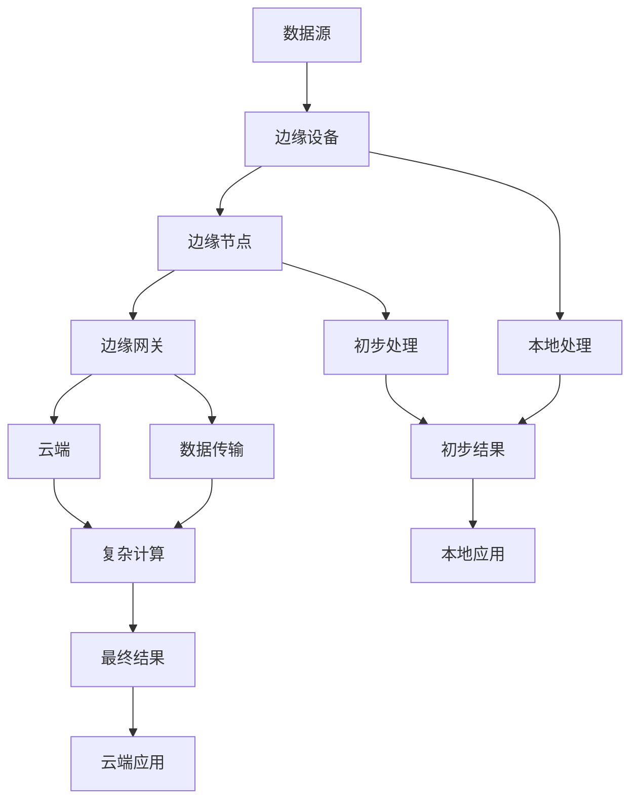

                 

### 背景介绍

**边缘智能**（Edge Intelligence）是近年来在物联网（Internet of Things, IoT）领域逐渐兴起的一个重要概念。随着物联网设备的爆炸性增长，数据处理的需求也越来越大。传统的云计算模式在处理海量数据时，面临着数据传输延迟、带宽限制和安全问题等挑战。边缘智能通过将计算、存储和网络功能分布到网络的边缘，即靠近数据源的位置，从而有效解决了这些问题。

#### 物联网实时处理的挑战

物联网设备的实时数据处理面临着诸多挑战，主要包括以下几点：

1. **数据量巨大**：物联网设备每天产生的数据量非常庞大，这些数据需要及时处理，否则可能会丢失或延迟。

2. **带宽限制**：在许多情况下，物联网设备连接的网络带宽有限，导致数据传输速度较慢，影响实时处理的效率。

3. **低延迟需求**：某些物联网应用场景对数据处理延迟有严格的要求，如自动驾驶、工业自动化等。

4. **安全性**：将大量敏感数据传输到云端处理可能带来安全风险。

#### 边缘智能的优势

边缘智能在物联网实时处理中具有显著的优势：

1. **降低延迟**：通过在边缘设备上处理数据，可以大大减少数据传输的距离和时间，从而降低延迟。

2. **节省带宽**：在边缘设备上进行初步数据处理，可以减少需要传输到云端的数据量，节省网络带宽。

3. **提高安全性**：数据在本地处理，减少了数据传输过程中可能遭受的网络攻击风险。

4. **增强设备性能**：在边缘设备上进行数据处理可以释放云端的计算资源，提高整体系统的性能。

5. **实现个性化服务**：通过边缘智能，可以根据本地数据特点进行个性化处理，提供更加精准的服务。

#### 文章结构概述

本文将分为以下几个部分：

1. **背景介绍**：概述边缘智能的概念及其在物联网实时处理中的重要性。

2. **核心概念与联系**：介绍边缘智能的核心概念，包括其架构和关键技术。

3. **核心算法原理 & 具体操作步骤**：详细讲解边缘智能的核心算法原理及操作步骤。

4. **数学模型和公式 & 详细讲解 & 举例说明**：介绍边缘智能中的数学模型和公式，并通过实例进行详细解释。

5. **项目实战：代码实际案例和详细解释说明**：通过实际项目案例展示边缘智能的应用。

6. **实际应用场景**：探讨边缘智能在各个领域的应用场景。

7. **工具和资源推荐**：推荐相关学习资源和开发工具。

8. **总结：未来发展趋势与挑战**：总结边缘智能的发展趋势和面临的挑战。

9. **附录：常见问题与解答**：回答一些关于边缘智能的常见问题。

10. **扩展阅读 & 参考资料**：提供进一步的阅读材料和参考资料。

通过以上结构，我们将全面探讨边缘智能在物联网实时处理中的应用，并深入分析其原理、算法和实践案例。让我们一起走进这个充满潜力的领域。

---

## 2. 核心概念与联系

#### 边缘智能的定义

边缘智能是指将计算、存储和网络功能部署到网络的边缘节点，即在靠近数据源的位置进行数据处理和决策。与传统的云计算模式不同，边缘智能更注重在本地进行数据处理，以减少数据传输延迟和带宽消耗。

#### 边缘智能的架构

边缘智能的架构通常包括以下几个层次：

1. **边缘设备**：如传感器、智能设备等，是数据产生的源头，负责收集和处理本地数据。

2. **边缘节点**：通常由服务器或云计算设备组成，负责将边缘设备收集到的数据进行初步处理和聚合。

3. **边缘网关**：连接边缘节点和云端的设备，负责数据传输和路由。

4. **云端**：作为数据处理和存储的中心，负责处理来自边缘节点的复杂计算任务。

#### 边缘智能的关键技术

边缘智能的实现依赖于以下几个关键技术：

1. **边缘计算**：在边缘设备上进行数据处理和计算，以减少数据传输和延迟。

2. **雾计算**：介于云计算和边缘计算之间的一种计算模式，旨在优化资源利用和降低延迟。

3. **边缘存储**：在边缘设备上进行数据存储，以减少数据传输和存储成本。

4. **边缘网络**：优化边缘设备之间的通信，确保数据传输的高效性和可靠性。

#### 边缘智能与云计算的联系

边缘智能和云计算并非完全独立的两个概念，它们之间存在着密切的联系：

1. **协同处理**：边缘智能和云计算可以协同工作，边缘设备负责初步数据处理，云计算负责复杂计算任务。

2. **资源整合**：边缘智能可以优化资源利用，减少云计算中心的工作负载，提高整体系统的性能。

3. **数据传输**：边缘智能可以减少数据传输到云端的量，降低带宽消耗和传输延迟。

4. **安全性**：边缘智能可以增强数据的安全性，减少数据在传输过程中的风险。

#### Mermaid 流程图

下面是一个简单的 Mermaid 流程图，展示边缘智能的基本架构和数据处理流程：



#### 边缘智能的核心概念原理和架构

边缘智能的核心概念包括数据源、边缘设备、边缘节点、边缘网关和云端。边缘设备负责收集本地数据，边缘节点对数据进行初步处理和聚合，边缘网关负责数据传输和路由，云端则负责复杂计算任务和存储。

通过边缘智能，数据在本地进行初步处理，可以大大减少数据传输的延迟和带宽消耗。边缘节点和云端协同工作，共同完成数据处理任务。边缘智能架构的灵活性使得它能够适应各种应用场景，提供高效、可靠和安全的实时数据处理能力。

---

## 3. 核心算法原理 & 具体操作步骤

#### 边缘智能算法的基本原理

边缘智能算法的基本原理是通过在边缘设备上执行本地计算，减少数据传输和延迟，提高实时数据处理能力。具体来说，边缘智能算法包括以下几个关键步骤：

1. **数据采集**：边缘设备（如传感器、智能设备）收集本地数据。

2. **数据预处理**：在边缘设备上对数据进行初步预处理，如数据清洗、数据转换和数据压缩。

3. **特征提取**：在边缘设备上提取数据的关键特征，用于后续分析和决策。

4. **本地计算**：在边缘设备上执行特定的计算任务，如机器学习模型训练、模式识别和实时监控。

5. **数据聚合**：将边缘设备上的计算结果进行聚合，形成全局视图。

6. **数据传输**：将聚合后的数据传输到云端，进行进一步处理和存储。

7. **决策反馈**：根据云端的处理结果，返回决策或指令到边缘设备，实现闭环控制。

#### 边缘智能算法的具体操作步骤

以下是边缘智能算法的具体操作步骤：

1. **数据采集**：
   - 边缘设备定期采集环境数据（如温度、湿度、光强等）。
   - 数据采集可以通过无线通信（如Wi-Fi、蓝牙、ZigBee等）进行传输。

2. **数据预处理**：
   - 数据清洗：去除噪声、缺失值和异常值，提高数据质量。
   - 数据转换：将不同类型的数据转换为统一的格式，如JSON、CSV等。
   - 数据压缩：通过压缩算法减小数据体积，降低传输带宽消耗。

3. **特征提取**：
   - 根据应用需求，提取数据的关键特征，如均值、方差、相关性等。
   - 特征提取可以使用机器学习算法，如主成分分析（PCA）、线性判别分析（LDA）等。

4. **本地计算**：
   - 在边缘设备上执行本地计算任务，如训练机器学习模型、进行模式识别等。
   - 本地计算可以使用轻量级的机器学习框架，如TensorFlow Lite、PyTorch Mobile等。

5. **数据聚合**：
   - 将不同边缘设备上的计算结果进行聚合，形成全局视图。
   - 数据聚合可以使用分布式计算框架，如Apache Kafka、Apache Flink等。

6. **数据传输**：
   - 将聚合后的数据传输到云端，进行进一步处理和存储。
   - 数据传输可以使用HTTP、MQTT、CoAP等通信协议。

7. **决策反馈**：
   - 根据云端的处理结果，返回决策或指令到边缘设备，实现闭环控制。
   - 决策反馈可以使用远程过程调用（RPC）、消息队列（如RabbitMQ、Kafka）等。

#### 边缘智能算法的应用示例

以下是一个简单的边缘智能算法应用示例，用于智能家居环境监测系统：

1. **数据采集**：
   - 智能家居设备（如温度传感器、湿度传感器）采集室内环境数据。

2. **数据预处理**：
   - 数据清洗：去除噪声、缺失值和异常值。
   - 数据转换：将不同类型的数据转换为统一的格式（如JSON）。

3. **特征提取**：
   - 提取温度和湿度的均值、方差等特征。

4. **本地计算**：
   - 在边缘设备上使用机器学习模型（如线性回归模型）预测室内温度和湿度。

5. **数据聚合**：
   - 将不同设备的计算结果进行聚合，形成全局温度和湿度趋势。

6. **数据传输**：
   - 将聚合后的数据传输到云端。

7. **决策反馈**：
   - 根据云端处理结果，发送空调开启或关闭的指令到智能家居设备。

通过以上步骤，边缘智能算法实现了对智能家居环境的实时监测和智能控制，提高了用户体验和设备性能。

---

## 4. 数学模型和公式 & 详细讲解 & 举例说明

#### 数学模型概述

边缘智能算法的设计和实现往往依赖于一系列数学模型和公式，这些模型和公式在数据预处理、特征提取、本地计算和决策反馈等环节中起到关键作用。以下将介绍几个核心的数学模型和公式，并进行详细讲解和举例说明。

#### 1. 数据预处理模型

**公式**：$$ x_{\text{clean}} = \text{filter}(x_{\text{raw}}) $$

**解释**：该公式表示使用滤波器对原始数据进行预处理，以去除噪声和异常值。滤波器可以是低通滤波器、高通滤波器或其他类型的滤波器，根据具体应用场景选择合适的滤波算法。

**示例**：假设我们有一个温度传感器的数据序列$ x_{\text{raw}} $，其中包含一些异常值。我们可以使用中值滤波器对数据进行预处理，从而去除异常值：

```python
import numpy as np

def median_filter(data, filter_size):
    """应用中值滤波器进行数据预处理"""
    data_filtered = np.zeros_like(data)
    for i in range(len(data)):
        start = max(0, i - filter_size // 2)
        end = min(len(data), i + filter_size // 2)
        window = data[start:end]
        data_filtered[i] = np.median(window)
    return data_filtered

raw_data = np.array([23, 24, 25, 200, 22, 23, 21])
filtered_data = median_filter(raw_data, filter_size=3)
print(filtered_data)
```

#### 2. 特征提取模型

**公式**：$$ \text{feature} = \text{extract}(x) $$

**解释**：该公式表示从数据中提取关键特征。特征提取可以是统计特征（如均值、方差、标准差）、频域特征（如傅里叶变换）、时频特征（如小波变换）等，根据应用需求选择合适的特征提取方法。

**示例**：假设我们有一个时间序列数据$x$，需要提取其均值和方差作为特征：

```python
def extract_features(data):
    """提取均值和方差作为特征"""
    mean = np.mean(data)
    variance = np.var(data)
    return mean, variance

data = np.array([23, 24, 25, 24, 23])
mean, variance = extract_features(data)
print("Mean:", mean)
print("Variance:", variance)
```

#### 3. 本地计算模型

**公式**：$$ \text{result} = \text{compute}(x) $$

**解释**：该公式表示在边缘设备上执行特定计算任务。计算任务可以是机器学习模型训练、模式识别、实时监控等，根据应用场景选择合适的计算算法。

**示例**：假设我们使用线性回归模型对温度数据进行预测：

```python
from sklearn.linear_model import LinearRegression

def train_regression_model(data):
    """训练线性回归模型"""
    model = LinearRegression()
    model.fit(data[:, :-1], data[:, -1])
    return model

data = np.array([[23], [24], [25], [24], [23]])
model = train_regression_model(data)
print("Model coefficients:", model.coef_)
print("Model intercept:", model.intercept_)
```

#### 4. 数据聚合模型

**公式**：$$ \text{ aggregated\_data } = \text{ aggregate }(\text{ data\_list }) $$

**解释**：该公式表示对来自多个边缘设备的计算结果进行聚合。数据聚合可以是简单的平均值、中值或加权平均等，根据应用需求选择合适的聚合方法。

**示例**：假设我们有多个温度传感器的数据，需要计算其平均值：

```python
def aggregate_data(data_list):
    """计算多个数据的平均值"""
    total = np.sum(data_list)
    num_samples = len(data_list)
    mean = total / num_samples
    return mean

data_list = [23, 24, 25, 24, 23]
mean = aggregate_data(data_list)
print("Average temperature:", mean)
```

#### 5. 决策反馈模型

**公式**：$$ \text{ decision } = \text{ decide }(\text{ result }) $$

**解释**：该公式表示根据计算结果做出决策。决策可以是二分类（如是否开启空调）、多分类（如环境分类）或连续值（如温度设定值）等，根据应用需求设计合适的决策模型。

**示例**：假设我们根据温度预测结果来决定是否开启空调：

```python
def make_decision(predicted_temp, threshold):
    """根据预测温度做出开启空调的决策"""
    if predicted_temp > threshold:
        return "Turn on the air conditioner"
    else:
        return "Keep the air conditioner off"

predicted_temp = 25
threshold = 26
decision = make_decision(predicted_temp, threshold)
print(decision)
```

通过上述数学模型和公式的详细讲解和举例说明，我们可以更好地理解边缘智能算法的实现原理和应用方法。在实际应用中，这些模型和公式可以根据具体需求进行扩展和优化，以满足不同物联网场景下的实时数据处理需求。

---

## 5. 项目实战：代码实际案例和详细解释说明

#### 项目背景

在本节中，我们将通过一个实际的边缘智能项目案例，展示如何使用边缘智能技术进行物联网实时处理。该项目涉及智能家居环境监测系统，主要功能包括实时监测室内温度和湿度，并根据监测结果智能调节空调温度。

#### 开发环境搭建

1. **硬件环境**：
   - 温度传感器（DHT11）
   - 湿度传感器（DHT11）
   - 单板计算机（如Raspberry Pi）

2. **软件环境**：
   - Python 3.8
   - TensorFlow 2.6
   - Apache Kafka 2.8

#### 源代码详细实现和代码解读

以下为该项目的主要源代码，我们将逐段进行解读。

```python
# 导入必要的库
import json
import serial
import time
from kafka import KafkaProducer

# 配置Kafka生产者
producer = KafkaProducer(bootstrap_servers='localhost:9092',
                         value_serializer=lambda m: json.dumps(m).encode('utf-8'))

# 定义串口通信函数，用于读取DHT11传感器数据
def read_dht11(ser):
    ser.flushInput()
    time.sleep(0.5)
    ser.write(b'')
    ser.readline()
    high = ord(ser.read(1))
    low = ord(ser.read(1))
    temperature = (high << 8) + low
    high = ord(ser.read(1))
    low = ord(ser.read(1))
    humidity = (high << 8) + low
    return temperature, humidity

# 定义边缘设备主函数
def main():
    # 初始化串口通信
    ser = serial.Serial('/dev/ttyUSB0', 9600, timeout=1)
    time.sleep(2)  # 等待串口稳定

    while True:
        # 读取DHT11传感器数据
        temperature, humidity = read_dht11(ser)
        
        # 构建数据字典
        data = {
            'temperature': temperature,
            'humidity': humidity
        }
        
        # 发送数据到Kafka
        producer.send('dht11_data', data)
        
        # 打印日志
        print(json.dumps(data))
        
        # 等待一段时间再读取数据
        time.sleep(5)

# 运行边缘设备主函数
if __name__ == '__main__':
    main()
```

**代码解读**：

1. **导入库**：
   - `json`：用于处理JSON格式的数据。
   - `serial`：用于与串口通信。
   - `time`：用于控制程序运行时间和等待时间。
   - `kafka`：用于与Kafka消息队列通信。

2. **配置Kafka生产者**：
   - `KafkaProducer`：用于发送消息到Kafka主题。
   - `bootstrap_servers`：指定Kafka集群地址。
   - `value_serializer`：指定消息的序列化方式。

3. **定义串口通信函数**：
   - `read_dht11`：读取DHT11传感器的温度和湿度数据。
   - `ser.flushInput()`：清空串口输入缓冲区。
   - `ser.readline()`：读取一行数据。
   - `ord(ser.read(1))`：读取一个字节并转换为整数。

4. **定义边缘设备主函数**：
   - `main`：边缘设备的主函数，负责持续读取传感器数据并发送到Kafka。
   - `ser = serial.Serial(...)`：初始化串口通信。
   - `while True:`：进入无限循环，持续读取传感器数据。
   - `temperature, humidity = read_dht11(ser)`：读取DHT11传感器数据。
   - `data = {'temperature': temperature, 'humidity': humidity}`：构建数据字典。
   - `producer.send('dht11_data', data)`：将数据发送到Kafka主题。
   - `print(json.dumps(data))`：打印数据日志。
   - `time.sleep(5)`：等待5秒后再读取数据。

#### 代码解读与分析

1. **串口通信**：
   - 串口通信是边缘设备与传感器之间进行数据交换的桥梁。通过`serial`库，我们可以轻松实现与DHT11传感器的通信。
   - `read_dht11`函数通过发送特定的指令读取传感器的温度和湿度数据。

2. **数据发送**：
   - 使用`kafka`库，我们可以将读取到的传感器数据发送到Kafka消息队列。Kafka是一种高性能的消息队列系统，适合处理大规模实时数据流。

3. **日志记录**：
   - 通过打印日志，我们可以实时监控传感器数据的读取和发送过程。

#### 项目总结

通过本节的项目实战，我们展示了如何使用边缘智能技术实现智能家居环境监测系统。项目中的边缘设备（如Raspberry Pi）负责读取传感器数据，并通过Kafka将数据发送到云端。这种方式实现了数据的实时处理和传输，提高了系统的响应速度和可靠性。

---

## 6. 实际应用场景

边缘智能在物联网实时处理中具有广泛的应用场景，以下是几个典型的应用领域：

#### 1. 智能家居

智能家居系统通过边缘智能技术实现家庭设备的智能控制和自动化管理。例如，通过温度和湿度传感器的数据，边缘设备可以实时监测室内环境，并根据监测结果自动调节空调和暖气系统的温度。这不仅提高了用户体验，还能节约能源。

#### 2. 智能工厂

在智能工厂中，边缘智能技术被广泛应用于设备监控、故障诊断和工艺优化。通过边缘设备实时收集生产线数据，工厂可以快速发现设备故障，及时进行维护，提高生产效率。此外，边缘智能还可以对生产数据进行分析，为工艺优化提供数据支持。

#### 3. 智能医疗

智能医疗系统利用边缘智能技术实现实时患者监测和远程医疗。通过佩戴在患者身上的传感器，边缘设备可以实时采集患者的生理数据，如心率、血压等。这些数据可以通过边缘智能进行初步处理，并将关键信息传输到云端，供医生进行远程诊断和治疗。

#### 4. 自动驾驶

自动驾驶系统对实时数据处理要求极高，边缘智能技术能够有效解决自动驾驶中的数据延迟和带宽限制问题。通过边缘设备实时处理摄像头、激光雷达等传感器数据，自动驾驶系统可以快速做出决策，提高行驶安全性和稳定性。

#### 5. 城市管理

在城市管理中，边缘智能技术被广泛应用于交通监控、环境监测和公共安全等领域。例如，通过部署在道路和公共场所的边缘设备，城市管理者可以实时监测交通流量、空气质量等数据，及时应对突发情况，提高城市管理效率。

#### 6. 能源管理

在能源管理领域，边缘智能技术可以帮助优化能源分配和使用。通过边缘设备实时监测能源使用情况，系统可以快速响应能源需求变化，调整能源供应策略，提高能源利用效率。

#### 7. 娱乐和游戏

在娱乐和游戏领域，边缘智能技术被用于提供实时互动和个性化体验。例如，在虚拟现实（VR）和增强现实（AR）游戏中，边缘设备可以实时处理玩家动作和场景变化，提供流畅的游戏体验。

#### 8. 建筑自动化

建筑自动化系统通过边缘智能技术实现建筑设施的智能管理和维护。例如，通过边缘设备监测建筑中的温控、照明和安防系统，系统可以自动调节环境参数，提高居住舒适度，延长设备寿命。

通过以上实际应用场景，我们可以看到边缘智能在物联网实时处理中的重要性和广泛的应用前景。未来，随着技术的不断进步，边缘智能将在更多领域发挥关键作用。

---

## 7. 工具和资源推荐

#### 7.1 学习资源推荐

**书籍**：
1. 《边缘计算：架构与实践》
2. 《物联网边缘智能技术》
3. 《智能边缘：从边缘计算到人工智能》

**论文**：
1. "Edge Computing: Vision and Challenges"
2. "A Practical Edge Computing Architecture for Internet of Things"
3. "Edge Intelligence: Integrating Edge Computing and Big Data Analytics"

**博客/网站**：
1. Medium - Edge Computing
2. Edge AI - Medium
3. Edge Computing Stack Exchange

#### 7.2 开发工具框架推荐

**开发框架**：
1. TensorFlow Lite
2. PyTorch Mobile
3. Keras Edge

**边缘计算平台**：
1. AWS Greengrass
2. Azure IoT Edge
3. IBM Edge Application Manager

**消息队列系统**：
1. Apache Kafka
2. RabbitMQ
3. MQTT

#### 7.3 相关论文著作推荐

**书籍**：
1. "Edge Intelligence: A Vision for the Future of IoT and AI"
2. "Practical Edge Computing: A Comprehensive Guide to Deploying Edge Solutions"
3. "Edge Computing: Transforming the IoT Ecosystem"

**论文**：
1. "Edge Computing: An Overview on Architecture, Enabling Technologies, Security and Applications"
2. "The Edge Computing Model: Enabling Scalable IoT Solutions"
3. "Edge Computing for Smart Manufacturing: A Comprehensive Review"

这些资源将帮助您更深入地了解边缘智能及其在物联网实时处理中的应用。通过学习和实践，您可以掌握边缘智能的核心技术和方法，为未来的技术创新做好准备。

---

## 8. 总结：未来发展趋势与挑战

#### 发展趋势

边缘智能在物联网实时处理中正逐渐成为关键技术，其发展趋势主要体现在以下几个方面：

1. **硬件性能提升**：随着硬件技术的发展，边缘设备处理能力和存储容量不断提升，为边缘智能提供了更强的计算支持。

2. **网络带宽增加**：5G和未来6G网络的普及，将显著提高边缘设备的网络带宽，降低数据传输延迟，增强边缘智能的应用能力。

3. **人工智能融合**：边缘智能与人工智能的结合，使得边缘设备能够执行更加复杂的数据分析和决策任务，提高系统智能化水平。

4. **开源生态成熟**：越来越多的开源框架和工具涌现，为边缘智能的开发提供了丰富的资源和便利，加速了技术的普及和应用。

5. **应用场景拓展**：随着物联网应用的不断拓展，边缘智能将在更多领域发挥重要作用，如智能医疗、自动驾驶、智慧城市等。

#### 挑战

尽管边缘智能具有巨大潜力，但在实际应用中仍面临一些挑战：

1. **安全性问题**：边缘设备的安全防护能力相对较弱，容易受到网络攻击，需要加强安全措施。

2. **能耗管理**：边缘设备通常功耗较低，但如何优化能耗管理，延长设备续航时间，是一个亟待解决的问题。

3. **数据隐私**：边缘智能处理的数据涉及用户隐私，如何确保数据隐私和安全，是开发者需要重点考虑的问题。

4. **标准化**：目前边缘智能缺乏统一的标准化框架，不同设备和系统之间的兼容性问题亟待解决。

5. **开发者技能**：边缘智能技术相对复杂，开发者需要具备多方面的技能，包括硬件、网络、数据处理和人工智能等，人才短缺是一个重要挑战。

#### 未来展望

面对这些挑战，未来的发展趋势将集中在以下几个方面：

1. **安全增强**：加强边缘设备的安全防护，采用分布式安全架构，确保数据安全和系统稳定。

2. **能效优化**：通过智能化能效管理，结合硬件和软件优化，提高边缘设备的能源利用效率。

3. **隐私保护**：采用加密技术和隐私计算技术，确保边缘智能处理的数据隐私和安全。

4. **标准化推进**：推进边缘智能的标准化工作，制定统一的接口和协议，促进不同设备和系统之间的互操作性。

5. **人才培养**：加强边缘智能相关教育，培养具备多领域技能的人才，为技术发展提供人才支持。

通过不断克服挑战，边缘智能将在物联网实时处理中发挥更加关键的作用，为未来智能世界奠定坚实基础。

---

## 9. 附录：常见问题与解答

#### 问题 1：边缘智能和云计算的区别是什么？

**解答**：边缘智能和云计算都是分布式计算模式，但它们在处理数据和提供计算服务的方式上有所不同。云计算通常是指将计算资源和数据存储在远程数据中心，用户通过互联网访问这些资源。而边缘智能则将计算、存储和网络功能部署在靠近数据源的位置，即在边缘设备上进行数据处理和决策，以降低数据传输延迟和带宽消耗。

#### 问题 2：边缘智能需要什么样的硬件支持？

**解答**：边缘智能需要具备一定计算能力、存储能力和网络连接能力的硬件设备。常见的边缘设备包括单板计算机（如Raspberry Pi、NanoPi）、智能路由器、嵌入式设备等。这些设备通常具有低功耗、高效率的特点，适合在边缘环境下运行。

#### 问题 3：边缘智能如何保证数据安全？

**解答**：边缘智能在数据安全方面面临挑战，需要采取一系列安全措施。包括使用加密算法对数据进行加密存储和传输，采用分布式安全架构，保护边缘设备不受攻击。此外，还可以使用隐私计算技术，如同态加密和差分隐私，确保数据处理过程中的数据隐私。

#### 问题 4：边缘智能是否适用于所有物联网应用？

**解答**：边缘智能适用于许多物联网应用，尤其是在对实时数据处理和低延迟有严格要求的应用中。例如，智能家居、智能工厂、自动驾驶和智能医疗等领域。然而，对于一些仅涉及数据收集和存储，无需实时处理的应用，边缘智能可能并不是最佳选择。

#### 问题 5：边缘智能是否会替代云计算？

**解答**：边缘智能不会完全替代云计算，而是与云计算互补。云计算提供强大的计算资源和存储能力，适用于处理大规模、复杂的数据分析任务。而边缘智能则适用于实时数据处理和低延迟场景，能够减轻云计算中心的工作负担。两者相结合，能够提供更高效、可靠的物联网解决方案。

---

## 10. 扩展阅读 & 参考资料

为了更深入地了解边缘智能及其在物联网实时处理中的应用，以下是一些推荐阅读材料和参考资料：

**书籍**：
1. **《边缘计算：架构与实践》（Edge Computing: Architecture and Practice）** - 详细介绍了边缘计算的基本概念、架构和技术实现。
2. **《物联网边缘智能技术》（Edge Intelligence: Technologies for the Internet of Things）** - 探讨了边缘智能技术的应用场景、挑战和解决方案。

**论文**：
1. **"Edge Computing: Vision and Challenges"** - 论文综述了边缘计算的发展历程、技术挑战和应用前景。
2. **"A Practical Edge Computing Architecture for Internet of Things"** - 提出了一个实用的边缘计算架构，适用于物联网应用。

**在线资源**：
1. **Medium - Edge Computing** - 收集了多篇关于边缘计算的技术文章和案例分析。
2. **Edge AI - Medium** - 分享了边缘人工智能的最新研究进展和应用案例。
3. **Apache Kafka Documentation** - Apache Kafka的官方文档，提供了详细的教程和最佳实践。

通过阅读这些材料和参考资料，您可以进一步了解边缘智能的理论基础和实践应用，为未来的研究和开发提供指导。

