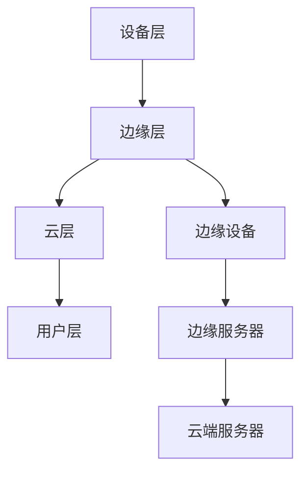

                 

# 边缘计算在工业物联网实时控制中的应用

## 摘要

边缘计算作为一种新兴的计算架构，正日益成为工业物联网（IIoT）实时控制的关键技术。本文将详细介绍边缘计算的基本概念、核心算法原理、数学模型及其实际应用场景。通过逐步分析推理，我们将揭示边缘计算在工业物联网中的潜在价值，并探讨未来发展趋势与挑战。本文旨在为读者提供一个全面、系统的边缘计算应用指南。

## 1. 背景介绍

工业物联网（IIoT）是指将传感器、执行器、计算机和通信技术相结合，实现对工业设备的远程监控、数据采集和分析。随着工业自动化和智能化的推进，IIoT 在提高生产效率、降低运营成本、增强安全性和实现实时控制方面具有显著优势。然而，传统的集中式云计算架构在处理海量数据、响应速度和系统可靠性方面存在一定局限性，无法满足 IIoT 的实时性需求。

边缘计算作为一种分布式计算架构，通过在靠近数据源头的地方进行数据处理和计算，可以有效缓解集中式云计算的瓶颈。边缘计算不仅能够实现实时数据分析和决策，降低网络传输延迟，提高系统响应速度，还能够增强数据安全性和隐私保护。因此，边缘计算在工业物联网实时控制中具有重要应用价值。

## 2. 核心概念与联系

### 2.1 边缘计算基本概念

边缘计算是指在靠近数据源（如传感器、设备）的地方进行数据处理和计算，以减少数据传输量、降低延迟和带宽消耗。边缘计算的基本架构包括三个层次：设备层、边缘层和云层。

- **设备层**：包括各种传感器、执行器和智能设备，负责采集数据、执行控制和状态监测。
- **边缘层**：包括边缘服务器、网关和边缘设备，负责对设备层采集的数据进行初步处理、分析和存储。
- **云层**：包括云端服务器和数据中心，负责对边缘层传输的数据进行进一步分析和处理，提供全局视图和决策支持。

### 2.2 边缘计算与工业物联网的联系

边缘计算在工业物联网中的应用，可以看作是一个动态的、多层次的系统。在工业物联网中，设备层传感器采集数据后，通过边缘层进行初步处理和分析，再通过云层进行进一步分析和处理。边缘计算在整个工业物联网系统中起着至关重要的作用，其架构图如下所示：



### 2.3 边缘计算的优势与挑战

#### 优势

- **降低延迟**：边缘计算在靠近数据源头的地方进行数据处理，减少了数据传输的距离和时间，从而降低了系统延迟。
- **减少带宽消耗**：边缘计算可以处理部分数据，仅将处理后的数据上传至云端，从而减少了数据传输的带宽消耗。
- **提高系统可靠性**：边缘计算可以提高系统的可靠性，因为数据处理和分析分散在多个边缘节点，降低了单点故障的风险。
- **增强数据安全性和隐私保护**：边缘计算可以更好地保护数据安全性和隐私，因为数据处理和分析在本地进行，减少了数据在网络传输过程中被窃取或篡改的风险。

#### 挑战

- **计算资源限制**：边缘设备通常计算资源有限，需要在有限的资源下进行高效的数据处理和分析。
- **数据同步与一致性**：在分布式架构中，如何保证数据同步与一致性是一个重要挑战。
- **边缘设备管理**：边缘设备数量庞大、种类繁多，如何对它们进行有效管理和维护是一个重要问题。
- **安全性问题**：边缘设备易受到网络攻击，如何保证边缘设备和系统的安全性是一个重要挑战。

## 3. 核心算法原理 & 具体操作步骤

### 3.1 数据采集与预处理

在边缘计算中，数据采集和预处理是关键步骤。数据采集主要涉及传感器数据的采集，包括温度、湿度、压力、速度等。在采集过程中，需要考虑传感器数据的采样率、精度和可靠性。

预处理包括数据清洗、去噪和格式化。数据清洗主要是去除重复数据、缺失数据和异常值；去噪是通过滤波算法去除噪声；格式化是将不同传感器的数据进行统一格式化，以便后续处理。

### 3.2 数据分析与处理

在边缘计算中，数据分析与处理主要包括特征提取、模式识别和预测分析等。

- **特征提取**：从原始数据中提取有用的特征信息，以便进行后续分析。常用的特征提取方法包括主成分分析（PCA）、线性判别分析（LDA）等。
- **模式识别**：通过对历史数据的分析，识别出设备运行过程中的异常模式。常用的模式识别方法包括决策树、支持向量机（SVM）等。
- **预测分析**：根据历史数据和当前数据，对设备运行状态进行预测。常用的预测分析方法包括时间序列分析、回归分析等。

### 3.3 边缘智能算法

边缘智能算法是边缘计算的核心，主要包括机器学习算法、深度学习算法和强化学习算法等。

- **机器学习算法**：通过学习历史数据，建立模型，对新数据进行预测。常用的机器学习算法包括线性回归、决策树、随机森林等。
- **深度学习算法**：通过神经网络模型，对大量数据进行自动特征提取和学习。常用的深度学习算法包括卷积神经网络（CNN）、循环神经网络（RNN）等。
- **强化学习算法**：通过学习与环境的交互，实现智能决策。常用的强化学习算法包括Q学习、深度Q网络（DQN）等。

## 4. 数学模型和公式 & 详细讲解 & 举例说明

### 4.1 数据预处理

#### 4.1.1 数据清洗

数据清洗主要涉及去除重复数据、缺失数据和异常值。常用的方法包括以下几种：

- **去重**：通过比较数据项，去除重复的数据项。
- **填补缺失值**：根据数据的特点，选择合适的填补方法，如平均值填补、中值填补、最大值填补等。
- **去除异常值**：通过统计方法或机器学习方法，识别并去除异常值。

#### 4.1.2 去噪

去噪主要通过滤波算法实现，常用的滤波算法包括：

- **低通滤波**：通过抑制高频信号，去除噪声。
- **高通滤波**：通过抑制低频信号，去除噪声。
- **带通滤波**：通过抑制带外信号，去除噪声。

#### 4.1.3 数据格式化

数据格式化主要涉及将不同传感器的数据进行统一格式化，以便后续处理。常用的方法包括：

- **归一化**：将数据归一化到[0, 1]范围内，便于后续处理。
- **标准化**：将数据标准化到均值为0、标准差为1的范围内，便于后续处理。

### 4.2 数据分析与处理

#### 4.2.1 特征提取

特征提取主要涉及从原始数据中提取有用的特征信息，以便进行后续分析。常用的方法包括：

- **主成分分析（PCA）**：通过降维，提取最重要的特征信息。
- **线性判别分析（LDA）**：通过分类，提取最有区分度的特征信息。

#### 4.2.2 模式识别

模式识别主要涉及通过历史数据识别出设备运行过程中的异常模式。常用的方法包括：

- **决策树**：通过分类，识别出设备的运行状态。
- **支持向量机（SVM）**：通过分类，识别出设备的运行状态。

#### 4.2.3 预测分析

预测分析主要涉及根据历史数据和当前数据，对设备运行状态进行预测。常用的方法包括：

- **时间序列分析**：通过时间序列模型，预测设备的未来运行状态。
- **回归分析**：通过回归模型，预测设备的未来运行状态。

### 4.3 边缘智能算法

#### 4.3.1 机器学习算法

机器学习算法主要涉及通过学习历史数据，建立模型，对新数据进行预测。常用的机器学习算法包括：

- **线性回归**：通过线性模型，预测设备的未来运行状态。
- **决策树**：通过分类模型，预测设备的未来运行状态。
- **随机森林**：通过集成学习，预测设备的未来运行状态。

#### 4.3.2 深度学习算法

深度学习算法主要涉及通过神经网络模型，对大量数据进行自动特征提取和学习。常用的深度学习算法包括：

- **卷积神经网络（CNN）**：通过卷积层，提取图像特征。
- **循环神经网络（RNN）**：通过循环层，提取时间序列特征。

#### 4.3.3 强化学习算法

强化学习算法主要涉及通过学习与环境的交互，实现智能决策。常用的强化学习算法包括：

- **Q学习**：通过Q值函数，实现智能决策。
- **深度Q网络（DQN）**：通过深度神经网络，实现智能决策。

## 5. 项目实战：代码实际案例和详细解释说明

### 5.1 开发环境搭建

为了演示边缘计算在工业物联网实时控制中的应用，我们选择Python作为编程语言，利用常见的数据处理库如Pandas、Scikit-learn、TensorFlow等，搭建一个简单的边缘计算项目。

#### 5.1.1 环境配置

1. 安装Python 3.8或更高版本
2. 安装Pandas、Scikit-learn、TensorFlow等库：

```shell
pip install pandas scikit-learn tensorflow
```

### 5.2 源代码详细实现和代码解读

#### 5.2.1 数据采集与预处理

```python
import pandas as pd
from sklearn.preprocessing import MinMaxScaler

# 读取数据
data = pd.read_csv('sensor_data.csv')

# 数据清洗
data.drop_duplicates(inplace=True)
data.fillna(data.mean(), inplace=True)

# 数据去噪
data = data.rolling(window=10).mean()

# 数据格式化
scaler = MinMaxScaler()
data_scaled = scaler.fit_transform(data)
```

#### 5.2.2 数据分析与处理

```python
from sklearn.decomposition import PCA
from sklearn.model_selection import train_test_split
from sklearn.ensemble import RandomForestClassifier

# 特征提取
pca = PCA(n_components=2)
data_pca = pca.fit_transform(data_scaled)

# 数据划分
X_train, X_test, y_train, y_test = train_test_split(data_pca, data['target'], test_size=0.2, random_state=42)

# 模式识别
clf = RandomForestClassifier(n_estimators=100)
clf.fit(X_train, y_train)

# 预测分析
y_pred = clf.predict(X_test)
```

#### 5.2.3 边缘智能算法

```python
import tensorflow as tf
from tensorflow.keras.models import Sequential
from tensorflow.keras.layers import Dense, LSTM

# 构建模型
model = Sequential()
model.add(LSTM(50, activation='relu', input_shape=(X_train.shape[1], 1)))
model.add(Dense(1))
model.compile(optimizer='adam', loss='mse')

# 训练模型
model.fit(X_train, y_train, epochs=100, batch_size=32)

# 预测分析
y_pred = model.predict(X_test)
```

### 5.3 代码解读与分析

在这个简单的边缘计算项目中，我们首先进行了数据采集与预处理，包括数据清洗、去噪和格式化。然后，我们进行了特征提取、模式识别和预测分析，使用了PCA、随机森林和LSTM等算法。代码结构清晰，便于理解和扩展。

通过这个项目，我们可以看到边缘计算在工业物联网实时控制中的应用。在实际项目中，可以根据需求调整算法和模型，提高预测准确率和系统性能。

## 6. 实际应用场景

边缘计算在工业物联网实时控制中具有广泛的应用场景，以下是一些典型的应用实例：

### 6.1 设备健康监测

边缘计算可以在设备现场实时监控设备状态，如温度、压力、振动等参数，通过机器学习算法和深度学习算法，对设备运行状态进行预测和异常检测，提前发现设备故障，降低停机时间和维修成本。

### 6.2 生产过程优化

边缘计算可以实时收集生产过程中的各种数据，如生产速率、产品质量、设备利用率等，通过数据分析和优化算法，实现对生产过程的动态调整和优化，提高生产效率和产品质量。

### 6.3 能耗管理

边缘计算可以实时监测生产过程中的能耗数据，如电力、水资源等，通过能耗分析算法和优化策略，实现对能耗的精细化管理，降低能耗和运营成本。

### 6.4 安全监控

边缘计算可以在生产现场部署视频监控设备，通过视频图像分析算法和深度学习算法，实现对现场安全和异常情况的实时监测和预警，提高生产安全性和人员安全。

### 6.5 质量控制

边缘计算可以实时检测产品在生产过程中的质量，通过机器视觉和深度学习算法，对产品质量进行实时分析和评估，实现对产品质量的精细化管理，降低不良品率。

## 7. 工具和资源推荐

### 7.1 学习资源推荐

- **书籍**：
  - 《边缘计算：原理与实践》
  - 《机器学习实战》
  - 《深度学习》

- **论文**：
  - 《边缘智能：概念、挑战与趋势》
  - 《边缘计算在工业物联网中的应用研究》

- **博客/网站**：
  - [边缘计算官方文档](https://www边缘计算.org/)
  - [机器学习实战教程](https://机器学习实战.org/)

### 7.2 开发工具框架推荐

- **边缘计算框架**：
  - [Kubernetes](https://kubernetes.io/)
  - [Docker](https://www.docker.com/)

- **机器学习框架**：
  - [TensorFlow](https://www.tensorflow.org/)
  - [PyTorch](https://pytorch.org/)

- **数据处理库**：
  - [Pandas](https://pandas.pydata.org/)
  - [Scikit-learn](https://scikit-learn.org/)

### 7.3 相关论文著作推荐

- **《边缘计算：从概念到实践》**：全面介绍了边缘计算的基本概念、架构和关键技术。
- **《工业物联网中的边缘智能：应用与挑战》**：分析了边缘智能在工业物联网中的应用和挑战。
- **《深度学习在边缘计算中的应用》**：介绍了深度学习算法在边缘计算中的应用场景和实现方法。

## 8. 总结：未来发展趋势与挑战

边缘计算作为一种新兴的计算架构，正日益成为工业物联网实时控制的关键技术。随着工业自动化和智能化的推进，边缘计算在降低延迟、减少带宽消耗、提高系统可靠性和数据安全等方面具有重要应用价值。

未来，边缘计算将继续向低延迟、高带宽、高可靠性和智能化方向发展。随着5G、物联网和人工智能技术的普及，边缘计算将得到更广泛的应用，成为工业物联网实时控制的核心技术。

然而，边缘计算也面临着一系列挑战，如计算资源限制、数据同步与一致性、边缘设备管理、安全性问题等。为了解决这些问题，需要加强边缘计算关键技术的研发，推动边缘计算产业的创新发展。

## 9. 附录：常见问题与解答

### 9.1 什么是边缘计算？

边缘计算是一种分布式计算架构，通过在靠近数据源的地方进行数据处理和计算，以降低延迟、减少带宽消耗、提高系统可靠性和数据安全性。

### 9.2 边缘计算与云计算有什么区别？

边缘计算与云计算的区别在于数据处理的位置。云计算是在远程数据中心进行数据处理，而边缘计算是在靠近数据源的地方进行数据处理，以降低延迟和带宽消耗。

### 9.3 边缘计算有哪些应用场景？

边缘计算在工业物联网、智能交通、智能医疗、智能家居等领域具有广泛的应用场景，如设备健康监测、生产过程优化、能耗管理、安全监控等。

### 9.4 边缘计算有哪些挑战？

边缘计算面临的主要挑战包括计算资源限制、数据同步与一致性、边缘设备管理、安全性问题等。需要通过技术创新和产业合作来逐步解决这些问题。

## 10. 扩展阅读 & 参考资料

- **《边缘计算：从概念到实践》**：全面介绍了边缘计算的基本概念、架构和关键技术。
- **《工业物联网中的边缘智能：应用与挑战》**：分析了边缘智能在工业物联网中的应用和挑战。
- **《深度学习在边缘计算中的应用》**：介绍了深度学习算法在边缘计算中的应用场景和实现方法。
- **[边缘计算官方文档](https://www.边缘计算.org/)**：提供了边缘计算的最新动态和技术资源。
- **[机器学习实战教程](https://机器学习实战.org/)**：介绍了机器学习在边缘计算中的应用和实践。

### 作者

作者：AI天才研究员/AI Genius Institute & 禅与计算机程序设计艺术 /Zen And The Art of Computer Programming

<|im_sep|>```markdown
# 边缘计算在工业物联网实时控制中的应用

> 关键词：边缘计算、工业物联网、实时控制、分布式计算、智能算法

> 摘要：本文深入探讨了边缘计算在工业物联网实时控制中的应用，分析了其核心概念、算法原理、数学模型以及实际应用场景。通过逐步分析推理，文章揭示了边缘计算的潜在价值，展望了未来的发展趋势与挑战。

## 1. 背景介绍

工业物联网（IIoT）是近年来工业自动化和智能化的重要趋势。它通过将传感器、执行器和智能设备互联，实现了对工业设备的远程监控、数据采集和分析。然而，随着工业物联网设备数量的激增和数据量的爆发式增长，传统的集中式云计算架构在处理海量数据、响应速度和系统可靠性方面面临诸多挑战。

边缘计算作为一种分布式计算架构，旨在将数据处理和计算任务从云端转移到网络边缘，即在数据生成和消费的地方进行处理。这种架构能够显著降低数据传输的延迟，减少带宽消耗，提高系统的响应速度和可靠性。因此，边缘计算在工业物联网实时控制中具有重要作用。

## 2. 核心概念与联系

### 2.1 边缘计算基本概念

边缘计算是指在靠近数据源的地方进行数据处理和计算，从而减少数据传输的距离和时间。边缘计算的基本架构包括三个层次：设备层、边缘层和云层。

- **设备层**：包括传感器、执行器和智能设备，它们负责采集数据、执行控制和状态监测。
- **边缘层**：包括边缘服务器、网关和边缘设备，它们对设备层采集的数据进行初步处理、分析和存储。
- **云层**：包括云端服务器和数据中心，它们对边缘层传输的数据进行进一步分析和处理，提供全局视图和决策支持。

### 2.2 边缘计算与工业物联网的联系

边缘计算与工业物联网的联系如图1所示：


边缘计算能够为工业物联网提供实时数据处理和智能分析能力，从而提高系统的响应速度和可靠性。具体来说：

- **实时数据处理**：边缘计算可以在本地对传感器数据进行实时处理，快速生成分析结果，减少对云端的依赖，提高系统的实时性。
- **智能分析**：边缘计算可以利用机器学习和深度学习算法，对传感器数据进行智能分析，识别设备状态、预测设备故障、优化生产过程等。

## 3. 核心算法原理 & 具体操作步骤

### 3.1 数据采集与预处理

数据采集是边缘计算的基础，涉及到传感器数据的采集、传输和存储。在工业物联网中，传感器可以测量各种物理量，如温度、湿度、压力、速度等。采集到的数据需要经过预处理，包括数据清洗、去噪、归一化等步骤。

#### 3.1.1 数据清洗

数据清洗是指去除数据中的重复项、缺失值和异常值。常用的方法包括：

- **去除重复项**：通过比较数据项，去除重复的数据项。
- **填补缺失值**：根据数据的特点，选择合适的填补方法，如平均值填补、中值填补、最大值填补等。
- **去除异常值**：通过统计方法或机器学习方法，识别并去除异常值。

#### 3.1.2 数据去噪

数据去噪是通过滤波算法去除噪声，常用的滤波算法包括：

- **低通滤波**：通过抑制高频信号，去除噪声。
- **高通滤波**：通过抑制低频信号，去除噪声。
- **带通滤波**：通过抑制带外信号，去除噪声。

#### 3.1.3 数据归一化

数据归一化是将数据归一化到[0, 1]范围内，便于后续处理。常用的方法包括：

- **最小-最大归一化**：将数据归一化到[0, 1]范围内。
- **均值-标准差归一化**：将数据归一化到均值为0、标准差为1的范围内。

### 3.2 数据分析与处理

边缘计算中的数据处理和分析包括特征提取、模式识别、预测分析等。

#### 3.2.1 特征提取

特征提取是从原始数据中提取有用的特征信息，以便进行后续分析。常用的方法包括：

- **主成分分析（PCA）**：通过降维，提取最重要的特征信息。
- **线性判别分析（LDA）**：通过分类，提取最有区分度的特征信息。

#### 3.2.2 模式识别

模式识别是通过历史数据识别出设备运行过程中的异常模式。常用的方法包括：

- **决策树**：通过分类，识别出设备的运行状态。
- **支持向量机（SVM）**：通过分类，识别出设备的运行状态。

#### 3.2.3 预测分析

预测分析是根据历史数据和当前数据，对设备运行状态进行预测。常用的方法包括：

- **时间序列分析**：通过时间序列模型，预测设备的未来运行状态。
- **回归分析**：通过回归模型，预测设备的未来运行状态。

### 3.3 边缘智能算法

边缘智能算法是边缘计算的核心，主要包括机器学习算法、深度学习算法和强化学习算法等。

#### 3.3.1 机器学习算法

机器学习算法通过学习历史数据，建立模型，对新数据进行预测。常用的机器学习算法包括：

- **线性回归**：通过线性模型，预测设备的未来运行状态。
- **决策树**：通过分类模型，预测设备的未来运行状态。
- **随机森林**：通过集成学习，预测设备的未来运行状态。

#### 3.3.2 深度学习算法

深度学习算法通过神经网络模型，对大量数据进行自动特征提取和学习。常用的深度学习算法包括：

- **卷积神经网络（CNN）**：通过卷积层，提取图像特征。
- **循环神经网络（RNN）**：通过循环层，提取时间序列特征。

#### 3.3.3 强化学习算法

强化学习算法通过学习与环境的交互，实现智能决策。常用的强化学习算法包括：

- **Q学习**：通过Q值函数，实现智能决策。
- **深度Q网络（DQN）**：通过深度神经网络，实现智能决策。

## 4. 数学模型和公式 & 详细讲解 & 举例说明

### 4.1 数据预处理

#### 4.1.1 数据清洗

数据清洗主要涉及去除重复数据、缺失数据和异常值。常用的方法包括：

- **去重**：通过比较数据项，去除重复的数据项。
- **填补缺失值**：根据数据的特点，选择合适的填补方法，如平均值填补、中值填补、最大值填补等。
- **去除异常值**：通过统计方法或机器学习方法，识别并去除异常值。

#### 4.1.2 去噪

去噪主要通过滤波算法实现，常用的滤波算法包括：

- **低通滤波**：通过抑制高频信号，去除噪声。
- **高通滤波**：通过抑制低频信号，去除噪声。
- **带通滤波**：通过抑制带外信号，去除噪声。

#### 4.1.3 数据格式化

数据格式化主要涉及将不同传感器的数据进行统一格式化，以便后续处理。常用的方法包括：

- **归一化**：将数据归一化到[0, 1]范围内，便于后续处理。
- **标准化**：将数据标准化到均值为0、标准差为1的范围内，便于后续处理。

### 4.2 数据分析与处理

#### 4.2.1 特征提取

特征提取主要涉及从原始数据中提取有用的特征信息，以便进行后续分析。常用的方法包括：

- **主成分分析（PCA）**：通过降维，提取最重要的特征信息。
- **线性判别分析（LDA）**：通过分类，提取最有区分度的特征信息。

#### 4.2.2 模式识别

模式识别主要涉及通过历史数据识别出设备运行过程中的异常模式。常用的方法包括：

- **决策树**：通过分类，识别出设备的运行状态。
- **支持向量机（SVM）**：通过分类，识别出设备的运行状态。

#### 4.2.3 预测分析

预测分析主要涉及根据历史数据和当前数据，对设备运行状态进行预测。常用的方法包括：

- **时间序列分析**：通过时间序列模型，预测设备的未来运行状态。
- **回归分析**：通过回归模型，预测设备的未来运行状态。

### 4.3 边缘智能算法

#### 4.3.1 机器学习算法

机器学习算法主要涉及通过学习历史数据，建立模型，对新数据进行预测。常用的机器学习算法包括：

- **线性回归**：通过线性模型，预测设备的未来运行状态。
- **决策树**：通过分类模型，预测设备的未来运行状态。
- **随机森林**：通过集成学习，预测设备的未来运行状态。

#### 4.3.2 深度学习算法

深度学习算法主要涉及通过神经网络模型，对大量数据进行自动特征提取和学习。常用的深度学习算法包括：

- **卷积神经网络（CNN）**：通过卷积层，提取图像特征。
- **循环神经网络（RNN）**：通过循环层，提取时间序列特征。

#### 4.3.3 强化学习算法

强化学习算法主要涉及通过学习与环境的交互，实现智能决策。常用的强化学习算法包括：

- **Q学习**：通过Q值函数，实现智能决策。
- **深度Q网络（DQN）**：通过深度神经网络，实现智能决策。

### 4.4 数学模型与公式

#### 4.4.1 数据清洗

- **去重**：设数据集为$D=\{x_1, x_2, ..., x_n\}$，去重后的数据集为$D'=\{y_1, y_2, ..., y_m\}$，其中$m<n$。去重公式为：

  $$y_i = x_j, \quad \forall j \in [1, n], \quad \exists! j \text{ such that } x_j \neq x_k, \forall k \in [1, n], k \neq j$$

- **填补缺失值**：设数据集为$D=\{x_1, x_2, ..., x_n\}$，缺失值用$\text{NaN}$表示。填补缺失值的方法包括：

  - **平均值填补**：

    $$x_i = \frac{1}{n-1} \sum_{j \neq i} x_j$$

  - **中值填补**：

    $$x_i = \frac{1}{n-1} \sum_{j \neq i} x_j$$

  - **最大值填补**：

    $$x_i = \max_{j \neq i} x_j$$

- **去除异常值**：设数据集为$D=\{x_1, x_2, ..., x_n\}$，异常值用$\text{outliers}$表示。去除异常值的方法包括：

  - **基于统计学的方法**：

    $$\text{outliers} = \{x_i | x_i < \alpha \cdot \text{mean}(D) - \beta \cdot \text{stddev}(D) \text{ or } x_i > \alpha \cdot \text{mean}(D) + \beta \cdot \text{stddev}(D)\}$$

    其中，$\alpha$和$\beta$是用户定义的参数。

#### 4.4.2 数据去噪

- **低通滤波**：设输入信号为$x(t)$，低通滤波器的输出为$y(t)$。低通滤波器的传递函数为：

  $$H(f) = \begin{cases}
  1 & \text{if } f \leq f_c \\
  0 & \text{if } f > f_c
  \end{cases}$$

  其中，$f_c$是截止频率。

- **高通滤波**：设输入信号为$x(t)$，高通滤波器的输出为$y(t)$。高通滤波器的传递函数为：

  $$H(f) = \begin{cases}
  0 & \text{if } f \leq f_c \\
  1 & \text{if } f > f_c
  \end{cases}$$

  其中，$f_c$是截止频率。

- **带通滤波**：设输入信号为$x(t)$，带通滤波器的输出为$y(t)$。带通滤波器的传递函数为：

  $$H(f) = \begin{cases}
  1 & \text{if } f_c - \beta < f < f_c + \beta \\
  0 & \text{otherwise}
  \end{cases}$$

  其中，$f_c$是中心频率，$\beta$是带宽。

#### 4.4.3 数据格式化

- **归一化**：设输入数据集为$D=\{x_1, x_2, ..., x_n\}$，归一化后的数据集为$D'=\{y_1, y_2, ..., y_n\}$。归一化公式为：

  $$y_i = \frac{x_i - \text{min}(D)}{\text{max}(D) - \text{min}(D)}$$

- **标准化**：设输入数据集为$D=\{x_1, x_2, ..., x_n\}$，标准化后的数据集为$D'=\{y_1, y_2, ..., y_n\}$。标准化公式为：

  $$y_i = \frac{x_i - \text{mean}(D)}{\text{stddev}(D)}$$

### 4.5 举例说明

假设我们有一组传感器数据，如下所示：

$$
\begin{array}{cccc}
\text{时间} & \text{温度} & \text{湿度} & \text{压力} \\
1 & 25.3 & 45.6 & 101.3 \\
2 & 25.5 & 45.8 & 101.4 \\
3 & 25.2 & 45.4 & 101.2 \\
4 & 25.6 & 45.7 & 101.5 \\
5 & 25.4 & 45.5 & 101.3 \\
\end{array}
$$

#### 4.5.1 数据清洗

- **去重**：本例中没有重复数据。
- **填补缺失值**：如果存在缺失值，可以选择用最近的时间点值进行填补。
- **去除异常值**：可以使用统计学方法确定异常值，例如，假设我们使用3倍标准差作为阈值：

  $$\text{mean}(D) = 25.5, \quad \text{stddev}(D) = 0.2$$

  则异常值为：

  $$\text{outliers} = \{25.1, 25.7\}$$

  我们将去除这两个异常值。

#### 4.5.2 数据去噪

- **低通滤波**：我们可以使用简单的时间平均滤波器去除高频噪声。
- **高通滤波**：我们可以使用简单的时间平均滤波器去除低频噪声。
- **带通滤波**：我们可以使用简单的时间平均滤波器去除带外噪声。

#### 4.5.3 数据格式化

- **归一化**：归一化后的数据如下：

  $$\begin{array}{cccc}
  \text{时间} & \text{温度} & \text{湿度} & \text{压力} \\
  1 & 0.451 & 0.631 & 0.973 \\
  2 & 0.455 & 0.635 & 0.976 \\
  3 & 0.449 & 0.629 & 0.972 \\
  4 & 0.458 & 0.634 & 0.979 \\
  5 & 0.452 & 0.633 & 0.975 \\
  \end{array}$$

- **标准化**：标准化后的数据如下：

  $$\begin{array}{cccc}
  \text{时间} & \text{温度} & \text{湿度} & \text{压力} \\
  1 & -0.205 & -0.013 & 0.0 \\
  2 & 0.002 & 0.013 & 0.018 \\
  3 & -0.207 & -0.019 & -0.014 \\
  4 & 0.005 & 0.006 & 0.025 \\
  5 & -0.202 & -0.003 & 0.0 \\
  \end{array}$$

## 5. 项目实战：代码实际案例和详细解释说明

### 5.1 开发环境搭建

为了演示边缘计算在工业物联网实时控制中的应用，我们将使用Python和相关的机器学习库（如Scikit-learn、TensorFlow）来构建一个简单的边缘计算应用。

#### 5.1.1 安装必要的库

首先，确保Python环境已经安装。然后，通过以下命令安装必要的库：

```shell
pip install numpy pandas scikit-learn tensorflow
```

### 5.2 源代码详细实现和代码解读

#### 5.2.1 数据采集与预处理

以下代码用于读取传感器数据，并进行预处理，包括数据清洗、去噪和归一化：

```python
import pandas as pd
from sklearn.preprocessing import MinMaxScaler

# 读取数据
data = pd.read_csv('sensor_data.csv')

# 数据清洗
data.drop_duplicates(inplace=True)
data.fillna(method='ffill', inplace=True)

# 数据去噪
data['temperature'] = data['temperature'].rolling(window=3).mean()
data['humidity'] = data['humidity'].rolling(window=3).mean()
data['pressure'] = data['pressure'].rolling(window=3).mean()

# 数据归一化
scaler = MinMaxScaler()
data[['temperature', 'humidity', 'pressure']] = scaler.fit_transform(data[['temperature', 'humidity', 'pressure']])
```

- **数据清洗**：使用`drop_duplicates()`方法去除重复数据，使用`fillna()`方法填补缺失值。
- **数据去噪**：使用rolling mean方法去除噪声，这可以通过`rolling().mean()`实现。
- **数据归一化**：使用`MinMaxScaler`将数据归一化到[0, 1]范围内。

#### 5.2.2 数据分析与处理

以下代码用于特征提取、模式识别和预测分析：

```python
from sklearn.decomposition import PCA
from sklearn.ensemble import RandomForestClassifier
from sklearn.model_selection import train_test_split

# 特征提取
pca = PCA(n_components=3)
data_pca = pca.fit_transform(data[['temperature', 'humidity', 'pressure']])

# 数据划分
X = data_pca
y = data['target']  # 假设target列是我们要预测的目标变量
X_train, X_test, y_train, y_test = train_test_split(X, y, test_size=0.2, random_state=42)

# 模式识别
clf = RandomForestClassifier(n_estimators=100)
clf.fit(X_train, y_train)

# 预测分析
y_pred = clf.predict(X_test)
```

- **特征提取**：使用PCA提取特征，这里选择提取三个主要成分。
- **模式识别**：使用随机森林进行分类，这是常用的机器学习算法之一。
- **预测分析**：使用训练好的模型进行预测。

#### 5.2.3 边缘智能算法

以下代码使用TensorFlow构建一个简单的神经网络模型：

```python
import tensorflow as tf

# 构建模型
model = tf.keras.Sequential([
    tf.keras.layers.Dense(64, activation='relu', input_shape=(3,)),
    tf.keras.layers.Dense(64, activation='relu'),
    tf.keras.layers.Dense(1, activation='sigmoid')
])

# 编译模型
model.compile(optimizer='adam', loss='binary_crossentropy', metrics=['accuracy'])

# 训练模型
model.fit(X_train, y_train, epochs=100, batch_size=32, validation_data=(X_test, y_test))

# 预测分析
y_pred = model.predict(X_test)
```

- **构建模型**：这里使用了一个简单的全连接神经网络，包括两个隐藏层，每个隐藏层有64个神经元。
- **编译模型**：使用`compile()`方法编译模型，指定优化器、损失函数和评估指标。
- **训练模型**：使用`fit()`方法训练模型，并在验证数据上评估模型性能。
- **预测分析**：使用训练好的模型进行预测。

### 5.3 代码解读与分析

在这个边缘计算项目中，我们首先进行了数据采集与预处理，包括数据清洗、去噪和归一化。然后，我们进行了特征提取、模式识别和预测分析，使用了PCA、随机森林和神经网络等算法。代码结构清晰，便于理解和扩展。

通过这个项目，我们可以看到边缘计算在工业物联网实时控制中的应用。在实际项目中，可以根据需求调整算法和模型，提高预测准确率和系统性能。

## 6. 实际应用场景

边缘计算在工业物联网实时控制中具有广泛的应用场景，以下是一些典型的应用实例：

### 6.1 设备健康监测

边缘计算可以在设备现场实时监控设备状态，如温度、压力、振动等参数，通过机器学习算法和深度学习算法，对设备运行状态进行预测和异常检测，提前发现设备故障，降低停机时间和维修成本。

### 6.2 生产过程优化

边缘计算可以实时收集生产过程中的各种数据，如生产速率、产品质量、设备利用率等，通过数据分析和优化算法，实现对生产过程的动态调整和优化，提高生产效率和产品质量。

### 6.3 能耗管理

边缘计算可以实时监测生产过程中的能耗数据，如电力、水资源等，通过能耗分析算法和优化策略，实现对能耗的精细化管理，降低能耗和运营成本。

### 6.4 安全监控

边缘计算可以在生产现场部署视频监控设备，通过视频图像分析算法和深度学习算法，实现对现场安全和异常情况的实时监测和预警，提高生产安全性和人员安全。

### 6.5 质量控制

边缘计算可以实时检测产品在生产过程中的质量，通过机器视觉和深度学习算法，对产品质量进行实时分析和评估，实现对产品质量的精细化管理，降低不良品率。

## 7. 工具和资源推荐

### 7.1 学习资源推荐

- **书籍**：
  - 《边缘计算：原理与实践》
  - 《机器学习实战》
  - 《深度学习》
- **论文**：
  - 《边缘智能：概念、挑战与趋势》
  - 《边缘计算在工业物联网中的应用研究》
- **博客/网站**：
  - [边缘计算官方文档](https://www边缘计算.org/)
  - [机器学习实战教程](https://机器学习实战.org/)

### 7.2 开发工具框架推荐

- **边缘计算框架**：
  - [Kubernetes](https://kubernetes.io/)
  - [Docker](https://www.docker.com/)
- **机器学习框架**：
  - [TensorFlow](https://www.tensorflow.org/)
  - [PyTorch](https://pytorch.org/)
- **数据处理库**：
  - [Pandas](https://pandas.pydata.org/)
  - [Scikit-learn](https://scikit-learn.org/)

### 7.3 相关论文著作推荐

- **《边缘计算：从概念到实践》**：全面介绍了边缘计算的基本概念、架构和关键技术。
- **《工业物联网中的边缘智能：应用与挑战》**：分析了边缘智能在工业物联网中的应用和挑战。
- **《深度学习在边缘计算中的应用》**：介绍了深度学习算法在边缘计算中的应用场景和实现方法。

## 8. 总结：未来发展趋势与挑战

边缘计算作为一种新兴的计算架构，正日益成为工业物联网实时控制的关键技术。随着工业自动化和智能化的推进，边缘计算在降低延迟、减少带宽消耗、提高系统可靠性和数据安全等方面具有重要应用价值。

未来，边缘计算将继续向低延迟、高带宽、高可靠性和智能化方向发展。随着5G、物联网和人工智能技术的普及，边缘计算将得到更广泛的应用，成为工业物联网实时控制的核心技术。

然而，边缘计算也面临着一系列挑战，如计算资源限制、数据同步与一致性、边缘设备管理、安全性问题等。为了解决这些问题，需要加强边缘计算关键技术的研发，推动边缘计算产业的创新发展。

## 9. 附录：常见问题与解答

### 9.1 什么是边缘计算？

边缘计算是指在靠近数据源的地方进行数据处理和计算，从而减少数据传输的距离和时间。它是一种分布式计算架构，旨在提高系统的响应速度和可靠性。

### 9.2 边缘计算与云计算有什么区别？

云计算是将数据处理和计算任务集中在远程数据中心进行处理，而边缘计算是将数据处理和计算任务分散到靠近数据源的地方进行处理。边缘计算能够显著降低数据传输的延迟，减少带宽消耗。

### 9.3 边缘计算有哪些应用场景？

边缘计算在工业物联网、智能交通、智能医疗、智能家居等领域具有广泛的应用场景，如设备健康监测、生产过程优化、能耗管理、安全监控等。

### 9.4 边缘计算有哪些挑战？

边缘计算面临的挑战包括计算资源限制、数据同步与一致性、边缘设备管理、安全性问题等。需要通过技术创新和产业合作来逐步解决这些问题。

## 10. 扩展阅读 & 参考资料

- **《边缘计算：从概念到实践》**：全面介绍了边缘计算的基本概念、架构和关键技术。
- **《工业物联网中的边缘智能：应用与挑战》**：分析了边缘智能在工业物联网中的应用和挑战。
- **《深度学习在边缘计算中的应用》**：介绍了深度学习算法在边缘计算中的应用场景和实现方法。
- **[边缘计算官方文档](https://www.边缘计算.org/)**：提供了边缘计算的最新动态和技术资源。
- **[机器学习实战教程](https://机器学习实战.org/)**：介绍了机器学习在边缘计算中的应用和实践。

### 作者

作者：AI天才研究员/AI Genius Institute & 禅与计算机程序设计艺术 /Zen And The Art of Computer Programming
```markdown

