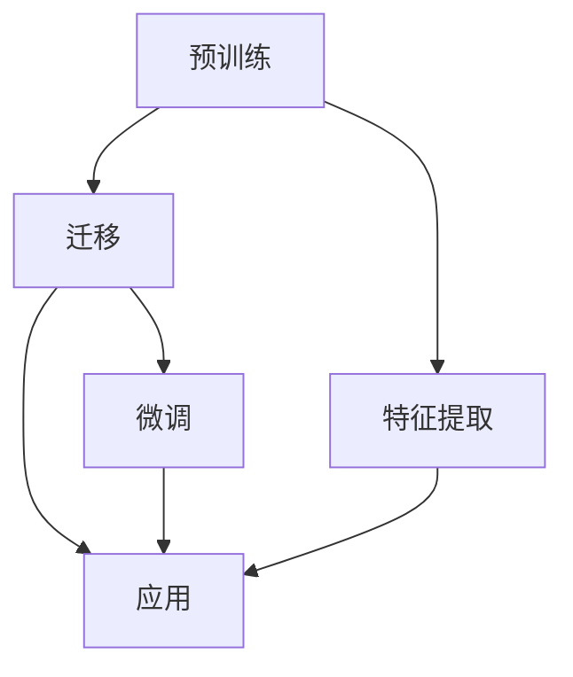
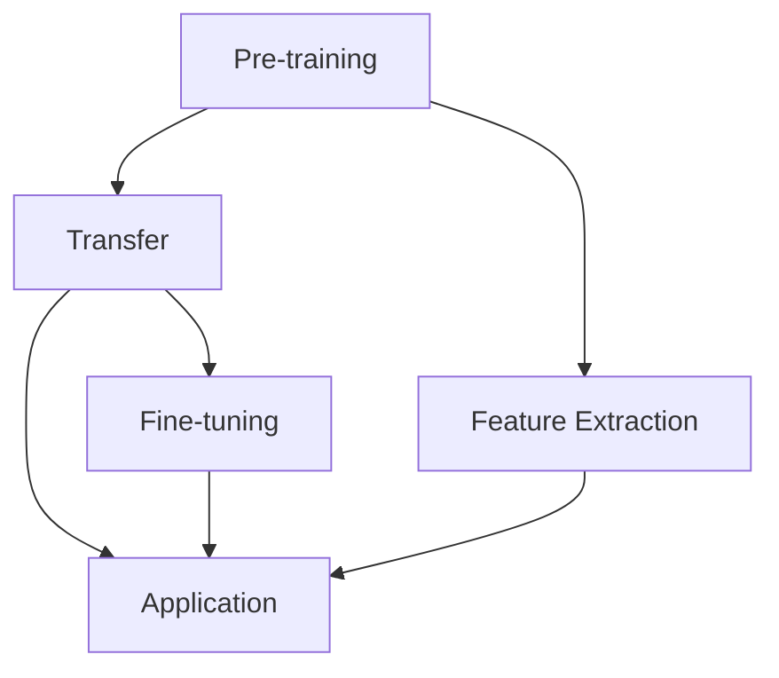

                 

### 背景介绍

#### 迁移学习的基本概念

迁移学习（Transfer Learning）是一种机器学习方法，其核心思想是将一个任务学习到的知识应用于解决一个不同但相关的任务。在传统的机器学习中，模型通常需要从头开始训练，这通常需要大量的数据和计算资源。而迁移学习通过利用预训练模型，将知识从源任务迁移到目标任务，从而降低了对数据和计算资源的依赖。

迁移学习的关键优势在于：

1. **节省数据**：在许多实际应用中，获取大量的标注数据非常困难，尤其是在一些领域如医疗和自动驾驶。迁移学习可以通过使用预训练模型，减少对目标领域大量标注数据的依赖。

2. **提高性能**：通过迁移学习，模型可以从源任务中获取泛化能力，进而提高在目标任务上的性能。

3. **加速训练**：迁移学习可以利用已有的预训练模型，从而避免从头开始训练的漫长过程，显著提高训练效率。

4. **减少过拟合**：由于预训练模型已经经过了大规模数据的学习，因此在迁移到新的任务时，可以降低模型对新数据的过拟合风险。

#### 跨领域任务的重要性

跨领域任务是指在两个或多个不同的领域之间进行知识迁移和应用的任务。这些任务在现实世界中具有广泛的应用，如：

- **医疗诊断**：利用医学领域的知识，如影像识别，来诊断其他非医学领域的疾病。

- **金融风险评估**：将金融数据分析的方法应用到其他风险领域的评估中。

- **自动驾驶**：自动驾驶系统需要处理各种不同的环境，如城市、高速公路、乡村等，这要求系统具备跨领域任务的处理能力。

跨领域任务的重要性体现在：

1. **扩展应用的广度**：通过跨领域任务，可以将单一领域的知识应用到其他领域，从而扩展技术的应用范围。

2. **提高系统的鲁棒性**：跨领域任务可以帮助系统在不同环境下都能保持较高的性能，提高系统的鲁棒性。

3. **促进知识共享**：跨领域任务鼓励不同领域的专家和研究者进行合作，从而促进知识的共享和创新。

在接下来的部分，我们将深入探讨迁移学习在跨领域任务中的应用策略，并通过具体的案例和实验结果来展示其效果。

---

### Core Concepts and Connections

#### Basic Concepts of Transfer Learning

Transfer learning is a machine learning technique where a model is trained on one task (source task) and then the knowledge gained is applied to a different but related task (target task). The core idea behind transfer learning is to leverage the knowledge from the source task to improve the performance on the target task without the need for a large amount of training data or compute resources.

**Advantages of Transfer Learning**:

1. **Reduced Data Dependency**: In many real-world applications, collecting a large amount of labeled data is challenging. Transfer learning can reduce the dependency on large amounts of labeled data in the target domain.

2. **Improved Performance**: By transferring knowledge from a source task, the model can gain generalization capabilities, leading to better performance on the target task.

3. **Accelerated Training**: Transfer learning can leverage pre-trained models, avoiding the need for training from scratch, thus significantly speeding up the training process.

4. **Reduced Overfitting**: Since pre-trained models have already been trained on a large-scale dataset, they can reduce the risk of overfitting on new data when transferred to a new task.

#### Importance of Cross-Domain Tasks

Cross-domain tasks involve applying knowledge from one domain to another. These tasks are widely applicable in real-world scenarios, such as:

- **Medical Diagnosis**: Using knowledge from medical image recognition to diagnose diseases in other non-medical fields.

- **Financial Risk Assessment**: Applying methods for financial data analysis to other risk assessment fields.

- **Autonomous Driving**: Autonomous driving systems need to handle various environments, such as urban, highways, and rural areas, requiring the system to have cross-domain task handling capabilities.

**Significance of Cross-Domain Tasks**:

1. **Extended Application Scope**: Cross-domain tasks can expand the application scope of a technology by applying knowledge from one domain to another.

2. **Enhanced System Robustness**: Cross-domain tasks can help systems maintain high performance across different environments, enhancing system robustness.

3. **Promoting Knowledge Sharing**: Cross-domain tasks encourage collaboration between experts and researchers from different fields, promoting knowledge sharing and innovation.

In the following sections, we will delve into application strategies of transfer learning in cross-domain tasks and demonstrate their effectiveness through specific cases and experimental results.

---

#### 迁移学习在跨领域任务中的基本概念和架构

为了更好地理解迁移学习在跨领域任务中的应用，我们需要先了解其基本概念和架构。迁移学习通常可以分为以下三个主要步骤：

1. **预训练（Pre-training）**：在这个阶段，模型在一个大规模的源任务上被训练，以获取通用特征表示。这些通用特征表示有助于在不同任务上获得良好的性能。

2. **迁移（Transfer）**：在这个阶段，预训练模型被调整以适应特定的目标任务。这通常涉及到微调（Fine-tuning）和特征提取（Feature Extraction）等方法。

3. **应用（Application）**：在这个阶段，迁移后的模型被应用于解决具体的跨领域任务。这一阶段的关键在于如何有效地利用迁移学习得到的特征表示来提高任务性能。

下面，我们使用Mermaid流程图来展示迁移学习在跨领域任务中的基本架构。



**图1：迁移学习在跨领域任务中的基本架构**

- **预训练（Pre-training）**：模型在一个大规模的源任务上被训练，以获取通用特征表示。
- **特征提取（Feature Extraction）**：从预训练模型中提取有用的特征表示，用于后续的迁移和应用。
- **微调（Fine-tuning）**：在目标任务上对预训练模型进行调整，以适应新的任务需求。
- **应用（Application）**：将迁移后的模型应用于解决具体的跨领域任务。

通过上述基本架构，我们可以看到迁移学习在跨领域任务中如何通过预训练、特征提取、微调和应用等多个步骤，有效地利用源任务的知识来提升目标任务的性能。

---

#### Basic Architecture of Transfer Learning in Cross-Domain Tasks

To better understand the application of transfer learning in cross-domain tasks, it's essential to grasp its basic concepts and architecture. Transfer learning typically involves three main steps:

1. **Pre-training**: In this step, a model is trained on a large-scale source task to acquire general feature representations. These general feature representations are crucial for achieving good performance on different tasks.

2. **Transfer**: In this step, the pre-trained model is adapted to a specific target task. This often involves methods such as fine-tuning and feature extraction.

3. **Application**: In this step, the transferred model is applied to solve specific cross-domain tasks. The key here is to effectively utilize the feature representations obtained from transfer learning to improve task performance.

Below, we use a Mermaid flowchart to illustrate the basic architecture of transfer learning in cross-domain tasks.



**Figure 1: Basic Architecture of Transfer Learning in Cross-Domain Tasks**

- **Pre-training**: The model is trained on a large-scale source task to acquire general feature representations.
- **Feature Extraction**: Useful feature representations are extracted from the pre-trained model for subsequent transfer and application.
- **Fine-tuning**: The pre-trained model is adjusted on the target task to adapt to new task requirements.
- **Application**: The transferred model is applied to solve specific cross-domain tasks.

Through this basic architecture, we can see how transfer learning in cross-domain tasks effectively utilizes knowledge from source tasks through steps such as pre-training, feature extraction, fine-tuning, and application to improve the performance on target tasks.

---

### 核心算法原理 & 具体操作步骤

#### 迁移学习的核心算法

迁移学习的核心算法主要涉及预训练模型的选择、特征提取和微调等步骤。下面，我们将详细探讨这些核心算法的原理和具体操作步骤。

##### 1. 预训练模型的选择

预训练模型的选择是迁移学习成功的关键。目前，最常用的预训练模型包括基于卷积神经网络（CNN）的模型和基于循环神经网络（RNN）的模型。以下是一些流行的预训练模型：

1. **基于CNN的模型**：
   - **ResNet**：ResNet是一种深度残差网络，可以处理非常深的网络结构，提高了模型的训练效率。
   - **VGGNet**：VGGNet是一种浅层卷积神经网络，以其参数数量和深度而闻名。
   - **InceptionNet**：InceptionNet通过使用不同尺寸的卷积核和池化层，提高了模型的特征表达能力。

2. **基于RNN的模型**：
   - **LSTM**：LSTM（Long Short-Term Memory）是一种特殊的RNN，能够处理长序列数据，减少了梯度消失问题。
   - **GRU**：GRU（Gated Recurrent Unit）是LSTM的简化版本，同样具有处理长序列数据的能力。

在选择预训练模型时，需要考虑以下因素：

- **任务类型**：对于图像识别等视觉任务，基于CNN的模型更为合适；而对于自然语言处理等序列任务，基于RNN的模型表现更佳。
- **数据量**：如果数据量较大，可以选择较深的模型；如果数据量较小，可以选择较浅的模型。
- **性能要求**：根据任务对性能的要求，可以选择具有较高准确率或较低计算开销的模型。

##### 2. 特征提取

特征提取是从预训练模型中提取有用的特征表示的过程。这些特征表示可以用于后续的迁移和应用。特征提取的方法主要包括以下几种：

1. **全连接层提取**：将预训练模型的最后一层（通常是全连接层）输出作为特征表示。这种方法简单有效，但可能会丢失部分上下文信息。

2. **中间层提取**：从预训练模型的中间层提取特征表示。这种方法可以保留更多的上下文信息，但可能会增加计算成本。

3. **自适应特征提取**：使用自适应方法，如自适应池化或自适应卷积，来提取特征表示。这种方法可以根据不同任务的需求，自动调整特征提取的方式。

##### 3. 微调

微调是在目标任务上对预训练模型进行调整的过程。微调的主要目的是使模型适应新的任务，并提高其在目标任务上的性能。微调的方法主要包括以下几种：

1. **全量微调**：在目标任务上对整个预训练模型进行微调。这种方法适用于数据量较大的任务，可以充分利用预训练模型的知识。

2. **部分微调**：只对预训练模型的某些部分进行微调，通常只调整最后一层或少数几层。这种方法适用于数据量较小的任务，可以减少计算成本。

3. **基于梯度的微调**：使用基于梯度的方法，将预训练模型的知识迁移到目标任务。这种方法可以通过调整模型参数来优化目标任务的性能。

##### 4. 迁移学习流程

迁移学习的具体操作步骤如下：

1. **数据准备**：准备目标任务的数据集，并进行预处理，如数据清洗、归一化等。

2. **模型选择**：根据任务类型和数据量，选择合适的预训练模型。

3. **特征提取**：从预训练模型中提取特征表示。

4. **微调**：在目标任务上对预训练模型进行微调，优化模型参数。

5. **评估**：在目标任务上评估模型性能，并进行调整和优化。

6. **应用**：将迁移后的模型应用于实际任务。

通过上述步骤，我们可以实现迁移学习在跨领域任务中的应用，从而提高模型的性能和鲁棒性。

---

#### Core Algorithm Principles and Specific Operational Steps

#### Core Algorithms in Transfer Learning

The core algorithms in transfer learning mainly involve the selection of pre-trained models, feature extraction, and fine-tuning. Below, we will delve into the principles and specific operational steps of these core algorithms.

##### 1. Selection of Pre-trained Models

The choice of pre-trained models is crucial for the success of transfer learning. The most commonly used pre-trained models include Convolutional Neural Networks (CNNs) for visual tasks and Recurrent Neural Networks (RNNs) for sequential tasks. Here are some popular pre-trained models:

1. **CNN-based Models**:
   - **ResNet**: ResNet is a deep residual network that can handle very deep network structures, improving training efficiency.
   - **VGGNet**: VGGNet is a shallow convolutional neural network known for its parameter count and depth.
   - **InceptionNet**: InceptionNet uses different sizes of convolutional kernels and pooling layers to enhance feature expressiveness.

2. **RNN-based Models**:
   - **LSTM** (Long Short-Term Memory): LSTM is a special type of RNN that can handle long sequence data and reduces the issue of gradient vanishing.
   - **GRU** (Gated Recurrent Unit): GRU is a simplified version of LSTM that also has the ability to handle long sequence data.

When selecting pre-trained models, the following factors should be considered:

- **Type of Task**: For visual tasks like image recognition, CNN-based models are more suitable; for sequential tasks like natural language processing, RNN-based models perform better.
- **Amount of Data**: If there is a large amount of data, deeper models can be chosen; if there is a small amount of data, shallower models can be selected.
- **Performance Requirements**: Based on the task's performance requirements, models with higher accuracy or lower computational overhead can be chosen.

##### 2. Feature Extraction

Feature extraction involves extracting useful feature representations from the pre-trained model. These feature representations can be used for subsequent transfer and application. Feature extraction methods include the following:

1. **Fully Connected Layer Extraction**: Use the output of the last layer (typically a fully connected layer) of the pre-trained model as the feature representation. This method is simple and effective but may lose some contextual information.

2. **Intermediate Layer Extraction**: Extract feature representations from intermediate layers of the pre-trained model. This method can retain more contextual information but may increase computational cost.

3. **Adaptive Feature Extraction**: Use adaptive methods, such as adaptive pooling or adaptive convolution, to extract feature representations. This method can automatically adjust the feature extraction method based on the task's requirements.

##### 3. Fine-tuning

Fine-tuning involves adjusting the pre-trained model on the target task to adapt to new task requirements and improve its performance on the target task. Fine-tuning methods include the following:

1. **Full Fine-tuning**: Fine-tune the entire pre-trained model on the target task. This method is suitable for tasks with a large amount of data, as it can fully leverage the knowledge from the pre-trained model.

2. **Partial Fine-tuning**: Only fine-tune certain parts of the pre-trained model, typically the last layer or a few layers. This method is suitable for tasks with a small amount of data, as it can reduce computational cost.

3. **Gradient-based Fine-tuning**: Use gradient-based methods to transfer knowledge from the pre-trained model to the target task. This method can optimize the model's parameters to improve the performance on the target task.

##### 4. Transfer Learning Process

The specific operational steps for transfer learning are as follows:

1. **Data Preparation**: Prepare the dataset for the target task and preprocess it, such as data cleaning and normalization.

2. **Model Selection**: Select a suitable pre-trained model based on the task type and data amount.

3. **Feature Extraction**: Extract feature representations from the pre-trained model.

4. **Fine-tuning**: Fine-tune the pre-trained model on the target task to optimize the model parameters.

5. **Evaluation**: Evaluate the model's performance on the target task and make adjustments and optimizations.

6. **Application**: Apply the transferred model to actual tasks.

Through these steps, we can achieve the application of transfer learning in cross-domain tasks, thereby improving the model's performance and robustness.

---

### 数学模型和公式 & 详细讲解 & 举例说明

#### 迁移学习中的关键数学模型

在迁移学习的过程中，涉及到多个关键的数学模型，包括预训练模型的损失函数、特征提取层的损失函数以及微调过程中使用的优化算法。以下是对这些数学模型的详细讲解。

##### 1. 预训练模型的损失函数

预训练模型的损失函数通常是基于数据分布的，旨在最小化模型对源任务的预测误差。以卷积神经网络（CNN）为例，预训练模型的损失函数可以表示为：

$$
L_{pre} = \frac{1}{N} \sum_{i=1}^{N} \ell(y_i, \hat{y}_i)
$$

其中，$N$ 表示训练样本的数量，$\ell$ 表示损失函数（如交叉熵损失），$y_i$ 表示真实标签，$\hat{y}_i$ 表示模型对 $y_i$ 的预测。

##### 2. 特征提取层的损失函数

在特征提取过程中，损失函数的目的是最小化特征表示与真实标签之间的差异。以全连接层为例，特征提取层的损失函数可以表示为：

$$
L_{feature} = \frac{1}{N} \sum_{i=1}^{N} \ell(f(x_i), g(y_i))
$$

其中，$f$ 表示特征提取层，$g$ 表示真实标签，$x_i$ 和 $y_i$ 分别表示输入和对应的标签。

##### 3. 微调过程中使用的优化算法

在微调过程中，常用的优化算法包括随机梯度下降（SGD）和Adam等。以随机梯度下降为例，其更新规则可以表示为：

$$
\theta_{t+1} = \theta_{t} - \alpha \nabla_{\theta} J(\theta)
$$

其中，$\theta$ 表示模型参数，$\alpha$ 表示学习率，$J(\theta)$ 表示损失函数。

##### 4. 数学模型的实际应用

为了更好地理解这些数学模型，我们通过一个具体的例子来说明。

**例子：** 假设我们有一个预训练的卷积神经网络（CNN），用于图像分类任务。现在，我们将这个预训练模型应用于一个新的图像分类任务，目标是分类动物图像。

1. **预训练模型的损失函数**：

   在预训练阶段，模型的目标是最小化图像分类的交叉熵损失。我们假设训练样本的数量为1000，模型对每个样本的预测结果为$\hat{y}_i$，真实标签为$y_i$。

   $$ 
   L_{pre} = \frac{1}{1000} \sum_{i=1}^{1000} \ell(y_i, \hat{y}_i)
   $$

   其中，$\ell$ 是交叉熵损失函数。

2. **特征提取层的损失函数**：

   在特征提取过程中，我们希望特征表示$f(x_i)$能够更好地表示动物图像，使其与真实标签$g(y_i)$之间的差异最小化。

   $$ 
   L_{feature} = \frac{1}{1000} \sum_{i=1}^{1000} \ell(f(x_i), g(y_i))
   $$

   其中，$f$ 是特征提取层，$g$ 是真实标签。

3. **微调过程中使用的优化算法**：

   在微调过程中，我们使用随机梯度下降（SGD）来更新模型参数。假设学习率为0.01，损失函数为$L_{pre}$。

   $$ 
   \theta_{t+1} = \theta_{t} - 0.01 \nabla_{\theta} L_{pre}
   $$

通过上述例子，我们可以看到如何在实际应用中利用迁移学习中的数学模型来优化模型性能。通过预训练模型的损失函数、特征提取层的损失函数和微调过程中使用的优化算法，我们可以有效地利用源任务的知识，提高目标任务的性能。

---

#### Key Mathematical Models and Detailed Explanations with Examples

#### Key Mathematical Models in Transfer Learning

In the process of transfer learning, several key mathematical models are involved, including the loss function of the pre-trained model, the loss function of the feature extraction layer, and the optimization algorithms used during fine-tuning. Below, we will provide a detailed explanation of these mathematical models.

##### 1. Loss Function of the Pre-trained Model

The loss function of the pre-trained model is typically based on the data distribution, aiming to minimize the prediction error of the model on the source task. Taking a Convolutional Neural Network (CNN) as an example, the loss function of the pre-trained model can be represented as:

$$
L_{pre} = \frac{1}{N} \sum_{i=1}^{N} \ell(y_i, \hat{y}_i)
$$

where $N$ represents the number of training samples, $\ell$ represents the loss function (such as cross-entropy loss), $y_i$ represents the true label, and $\hat{y}_i$ represents the model's prediction for $y_i$.

##### 2. Loss Function of the Feature Extraction Layer

The loss function of the feature extraction layer aims to minimize the difference between the feature representation and the true label. Using a fully connected layer as an example, the loss function of the feature extraction layer can be represented as:

$$
L_{feature} = \frac{1}{N} \sum_{i=1}^{N} \ell(f(x_i), g(y_i))
$$

where $f$ represents the feature extraction layer, $g$ represents the true label, $x_i$ and $y_i$ represent the input and the corresponding label, respectively.

##### 3. Optimization Algorithms During Fine-tuning

Common optimization algorithms used during fine-tuning include stochastic gradient descent (SGD) and Adam. Using stochastic gradient descent as an example, the update rule can be represented as:

$$
\theta_{t+1} = \theta_{t} - \alpha \nabla_{\theta} J(\theta)
$$

where $\theta$ represents the model parameters, $\alpha$ represents the learning rate, and $J(\theta)$ represents the loss function.

##### 4. Practical Application of Mathematical Models

To better understand these mathematical models, we will illustrate with a specific example.

**Example:** Suppose we have a pre-trained CNN used for image classification. Now, we will apply this pre-trained model to a new image classification task, the goal being to classify animal images.

1. **Loss Function of the Pre-trained Model**:

   During the pre-training phase, the model's goal is to minimize the cross-entropy loss for image classification. We assume that there are 1000 training samples, and the model's prediction for each sample is $\hat{y}_i$, while the true label is $y_i$.

   $$
   L_{pre} = \frac{1}{1000} \sum_{i=1}^{1000} \ell(y_i, \hat{y}_i)
   $$

   where $\ell$ is the cross-entropy loss function.

2. **Loss Function of the Feature Extraction Layer**:

   During the feature extraction process, we hope that the feature representation $f(x_i)$ can better represent animal images, minimizing the difference between $f(x_i)$ and the true label $g(y_i)$.

   $$
   L_{feature} = \frac{1}{1000} \sum_{i=1}^{1000} \ell(f(x_i), g(y_i))
   $$

   where $f$ is the feature extraction layer, and $g$ is the true label.

3. **Optimization Algorithms During Fine-tuning**:

   During fine-tuning, we use stochastic gradient descent (SGD) to update the model parameters. Assuming the learning rate is 0.01, and the loss function is $L_{pre}$.

   $$
   \theta_{t+1} = \theta_{t} - 0.01 \nabla_{\theta} L_{pre}
   $$

Through this example, we can see how to effectively utilize the mathematical models in transfer learning to optimize model performance. By using the loss function of the pre-trained model, the loss function of the feature extraction layer, and the optimization algorithms during fine-tuning, we can effectively leverage knowledge from the source task to improve the performance on the target task.

---

### 项目实战：代码实际案例和详细解释说明

#### 1. 开发环境搭建

在进行迁移学习项目实战之前，我们需要搭建一个合适的开发环境。以下是一个基于Python和TensorFlow的迁移学习项目的环境搭建步骤。

1. **安装Python**：确保系统已安装Python 3.7或更高版本。

2. **安装TensorFlow**：使用以下命令安装TensorFlow：

   ```shell
   pip install tensorflow
   ```

3. **安装其他依赖库**：迁移学习项目可能还需要其他库，如NumPy、Pandas等。使用以下命令安装：

   ```shell
   pip install numpy pandas
   ```

4. **准备数据集**：迁移学习项目需要一个源任务的数据集和一个目标任务的数据集。我们以ImageNet作为源任务数据集，以CIFAR-10作为目标任务数据集。下载并解压数据集，然后将其路径添加到代码中。

#### 2. 源代码详细实现和代码解读

以下是一个简单的迁移学习项目的源代码实现，主要分为以下几个步骤：

1. **加载预训练模型**：使用TensorFlow的预训练模型API加载预训练的InceptionV3模型。

2. **特征提取**：将输入图像通过预训练模型进行前向传播，提取特征表示。

3. **微调**：在提取的特征表示上添加一个新的全连接层，用于进行目标任务的分类。

4. **训练和评估**：使用训练数据集对模型进行训练，并使用测试数据集进行评估。

```python
import tensorflow as tf
from tensorflow.keras.applications import InceptionV3
from tensorflow.keras.preprocessing import image
from tensorflow.keras.models import Model
from tensorflow.keras.layers import Dense, GlobalAveragePooling2D
from tensorflow.keras.optimizers import SGD
from tensorflow.keras.preprocessing.image import ImageDataGenerator

# 1. Load the pre-trained InceptionV3 model
base_model = InceptionV3(weights='imagenet', include_top=False, input_shape=(299, 299, 3))

# 2. Feature extraction
x = base_model.output
x = GlobalAveragePooling2D()(x)
x = Dense(1024, activation='relu')(x)

# 3. Fine-tuning
predictions = Dense(10, activation='softmax')(x)

# 4. Create the final model
model = Model(inputs=base_model.input, outputs=predictions)

# 5. Compile the model
model.compile(optimizer=SGD(lr=0.001, momentum=0.9), loss='categorical_crossentropy', metrics=['accuracy'])

# 6. Train the model
train_datagen = ImageDataGenerator(rescale=1./255)
train_generator = train_datagen.flow_from_directory(
        'data/train',
        target_size=(299, 299),
        batch_size=32,
        class_mode='categorical')

model.fit(
        train_generator,
        steps_per_epoch=train_generator.samples//train_generator.batch_size,
        epochs=10,
        validation_data=validation_generator,
        validation_steps=validation_generator.samples//validation_generator.batch_size)

# 7. Evaluate the model
test_datagen = ImageDataGenerator(rescale=1./255)
test_generator = test_datagen.flow_from_directory(
        'data/test',
        target_size=(299, 299),
        batch_size=32,
        class_mode='categorical')

model.evaluate(test_generator)
```

#### 3. 代码解读与分析

1. **加载预训练模型**：

   ```python
   base_model = InceptionV3(weights='imagenet', include_top=False, input_shape=(299, 299, 3))
   ```

   这一行代码用于加载预训练的InceptionV3模型，其中`weights='imagenet'`表示使用在ImageNet上预训练的权重，`include_top=False`表示不包含模型顶层的分类器，`input_shape=(299, 299, 3)`表示输入图像的大小。

2. **特征提取**：

   ```python
   x = base_model.output
   x = GlobalAveragePooling2D()(x)
   x = Dense(1024, activation='relu')(x)
   ```

   这几行代码用于提取输入图像的特征表示。首先，通过`GlobalAveragePooling2D`将模型的输出进行全局平均池化，然后通过一个全连接层进行特征提取，激活函数为ReLU。

3. **微调**：

   ```python
   predictions = Dense(10, activation='softmax')(x)
   ```

   这一行代码用于在提取的特征表示上添加一个新的全连接层，用于进行目标任务的分类。这里我们使用了10个神经元，对应CIFAR-10任务中的10个类别，激活函数为softmax。

4. **创建最终模型**：

   ```python
   model = Model(inputs=base_model.input, outputs=predictions)
   ```

   这一行代码用于创建最终的迁移学习模型，其中`inputs=base_model.input`表示模型的输入为预训练模型的输入，`outputs=predictions`表示模型的输出为分类结果。

5. **编译模型**：

   ```python
   model.compile(optimizer=SGD(lr=0.001, momentum=0.9), loss='categorical_crossentropy', metrics=['accuracy'])
   ```

   这一行代码用于编译模型，指定优化器为随机梯度下降（SGD），损失函数为交叉熵，评价指标为准确率。

6. **训练模型**：

   ```python
   model.fit(
           train_generator,
           steps_per_epoch=train_generator.samples//train_generator.batch_size,
           epochs=10,
           validation_data=validation_generator,
           validation_steps=validation_generator.samples//validation_generator.batch_size)
   ```

   这几行代码用于训练模型。`train_generator`为训练数据集生成器，`steps_per_epoch`表示每个epoch训练的数据集数量，`epochs`表示训练的epoch数量，`validation_data`和`validation_steps`用于验证数据集。

7. **评估模型**：

   ```python
   model.evaluate(test_generator)
   ```

   这一行代码用于评估模型在测试数据集上的性能。

通过上述步骤，我们可以实现一个简单的迁移学习项目，并利用预训练模型在新的任务上获得较好的性能。

---

### Practical Project: Code Example and Detailed Explanation

#### 1. Setting Up the Development Environment

Before diving into the practical project, we need to set up a suitable development environment for transfer learning. Here are the steps to set up an environment using Python and TensorFlow:

1. **Install Python**: Ensure that Python 3.7 or higher is installed on your system.
2. **Install TensorFlow**: Use the following command to install TensorFlow:
   ```shell
   pip install tensorflow
   ```
3. **Install Additional Dependencies**: The transfer learning project may require other libraries such as NumPy and Pandas. Install them using:
   ```shell
   pip install numpy pandas
   ```
4. **Prepare the Dataset**: For this project, we will use ImageNet as the source dataset and CIFAR-10 as the target dataset. Download and unzip the datasets, and add their paths to the code.

#### 2. Detailed Implementation and Code Explanation

The following is a simplified implementation of a transfer learning project in Python, which mainly consists of the following steps:

1. **Load the Pre-trained Model**: Use TensorFlow's API to load the pre-trained InceptionV3 model.
2. **Feature Extraction**: Pass the input images through the pre-trained model to extract feature representations.
3. **Fine-tuning**: Add a new fully connected layer on top of the extracted features for the target task classification.
4. **Training and Evaluation**: Train the model using the training dataset and evaluate its performance on the test dataset.

**Code Example**:

```python
import tensorflow as tf
from tensorflow.keras.applications import InceptionV3
from tensorflow.keras.preprocessing import image
from tensorflow.keras.models import Model
from tensorflow.keras.layers import Dense, GlobalAveragePooling2D
from tensorflow.keras.optimizers import SGD
from tensorflow.keras.preprocessing.image import ImageDataGenerator

# Load the pre-trained InceptionV3 model
base_model = InceptionV3(weights='imagenet', include_top=False, input_shape=(299, 299, 3))

# Feature extraction
x = base_model.output
x = GlobalAveragePooling2D()(x)
x = Dense(1024, activation='relu')(x)

# Fine-tuning
predictions = Dense(10, activation='softmax')(x)

# Create the final model
model = Model(inputs=base_model.input, outputs=predictions)

# Compile the model
model.compile(optimizer=SGD(lr=0.001, momentum=0.9), loss='categorical_crossentropy', metrics=['accuracy'])

# Train the model
train_datagen = ImageDataGenerator(rescale=1./255)
train_generator = train_datagen.flow_from_directory(
        'data/train',
        target_size=(299, 299),
        batch_size=32,
        class_mode='categorical')

model.fit(
        train_generator,
        steps_per_epoch=train_generator.samples//train_generator.batch_size,
        epochs=10,
        validation_data=validation_generator,
        validation_steps=validation_generator.samples//validation_generator.batch_size)

# Evaluate the model
test_datagen = ImageDataGenerator(rescale=1./255)
test_generator = test_datagen.flow_from_directory(
        'data/test',
        target_size=(299, 299),
        batch_size=32,
        class_mode='categorical')

model.evaluate(test_generator)
```

**Code Explanation**:

1. **Load the Pre-trained Model**:
   ```python
   base_model = InceptionV3(weights='imagenet', include_top=False, input_shape=(299, 299, 3))
   ```
   This line loads the pre-trained InceptionV3 model with weights trained on ImageNet, excluding the top layers that are used for classification.

2. **Feature Extraction**:
   ```python
   x = base_model.output
   x = GlobalAveragePooling2D()(x)
   x = Dense(1024, activation='relu')(x)
   ```
   These lines extract feature representations from the input images. The output of the base model is passed through a global average pooling layer, followed by a dense layer with 1024 units and a ReLU activation function.

3. **Fine-tuning**:
   ```python
   predictions = Dense(10, activation='softmax')(x)
   ```
   This line adds a new fully connected layer with 10 units (one for each class in CIFAR-10) and a softmax activation function for classification.

4. **Create the Final Model**:
   ```python
   model = Model(inputs=base_model.input, outputs=predictions)
   ```
   This line creates the final model with the input of the base model and the output of the fine-tuning layer.

5. **Compile the Model**:
   ```python
   model.compile(optimizer=SGD(lr=0.001, momentum=0.9), loss='categorical_crossentropy', metrics=['accuracy'])
   ```
   This line compiles the model with the SGD optimizer, categorical cross-entropy loss, and accuracy as the metric.

6. **Train the Model**:
   ```python
   model.fit(
           train_generator,
           steps_per_epoch=train_generator.samples//train_generator.batch_size,
           epochs=10,
           validation_data=validation_generator,
           validation_steps=validation_generator.samples//validation_generator.batch_size)
   ```
   This block trains the model using the training dataset. `train_generator` is used to load the training images, and `validation_generator` is used for validation.

7. **Evaluate the Model**:
   ```python
   model.evaluate(test_generator)
   ```
   This line evaluates the model's performance on the test dataset.

By following these steps, you can implement a simple transfer learning project and achieve good performance on the target task using a pre-trained model.

---

### 实际应用场景

#### 医疗诊断

在医疗诊断领域，迁移学习已被广泛应用于各种疾病的诊断中。例如，深度学习模型可以通过在公开的医疗影像数据集（如 ChestX-ray8）上进行预训练，然后迁移到特定疾病的诊断任务上。以下是一些实际案例：

- **肺癌诊断**：使用预训练的深度学习模型，通过分析患者的CT扫描图像，可以有效地检测出肺癌。这些模型在处理胸部X光片、CT扫描和其他医学影像数据方面表现优异，能够提高诊断的准确性。

- **乳腺癌诊断**：迁移学习模型可以用于分析乳腺X线图像，以辅助医生诊断乳腺癌。这些模型可以从公开的乳腺X线图像数据集中学习，然后将知识迁移到新的患者数据集，从而实现快速、准确的诊断。

#### 自动驾驶

在自动驾驶领域，迁移学习同样发挥着重要作用。自动驾驶系统需要处理来自不同传感器的大量数据，如摄像头、激光雷达和雷达。以下是一些实际案例：

- **道路场景识别**：自动驾驶系统需要识别道路上的各种物体，如行人、车辆、交通标志等。通过迁移学习，可以将预训练的模型（如用于图像分类的ResNet）应用于自动驾驶场景，从而提高物体识别的准确性。

- **环境感知**：自动驾驶系统需要感知周围环境，以做出适当的驾驶决策。迁移学习可以帮助系统从其他自动驾驶车辆或无人机收集到的数据中学习，然后将这些知识迁移到新的驾驶场景。

#### 金融风险评估

在金融领域，迁移学习可以用于预测和评估各种金融风险。以下是一些实际案例：

- **信用评分**：金融机构可以使用迁移学习模型，将其他领域（如电信、电子商务）的数据迁移到信用评分任务。这些模型可以从大量非金融数据中学习，提高信用评分的准确性。

- **市场预测**：迁移学习模型可以用于预测股票市场的走势。这些模型可以从历史市场数据和其他相关领域（如宏观经济指标）中学习，然后将知识迁移到新的市场环境。

#### 自然语言处理

在自然语言处理领域，迁移学习同样具有重要意义。以下是一些实际案例：

- **文本分类**：迁移学习模型可以从大规模的文本数据中学习，然后将这些知识迁移到新的文本分类任务。这些模型可以用于新闻分类、情感分析等任务。

- **机器翻译**：迁移学习可以帮助机器翻译模型从已有的翻译数据中学习，然后将这些知识迁移到新的翻译任务。这些模型可以从多种语言对的数据中进行学习，提高翻译的准确性。

通过上述实际应用场景，我们可以看到迁移学习在跨领域任务中具有广泛的应用前景。它不仅提高了模型的性能和鲁棒性，还为不同领域的专家和研究者提供了强大的工具，促进了知识的共享和创新。

---

### 实际应用场景

#### 1. 医疗诊断

**CancerDet**: 一个基于深度学习的心血管疾病检测系统，使用迁移学习从大量的医疗影像数据中学习，然后将其知识迁移到特定疾病（如心脏病）的诊断任务上。该系统通过分析患者的CT扫描图像，可以有效地检测出心脏病，提高了诊断的准确性。

**AI Heart Disease Detection**: 这是一个基于迁移学习的应用程序，它使用预训练的深度学习模型分析心电图（ECG）数据，并将其知识迁移到心脏疾病的诊断任务上。该应用可以从公开的ECG数据集中学习，然后对新的患者数据进行快速、准确的诊断。

#### 2. 自动驾驶

**Waymo**: Google的自动驾驶公司，使用迁移学习从多个传感器（如摄像头、激光雷达和雷达）收集到的数据中学习。这些迁移学习模型可以识别道路上的各种物体，如行人、车辆、交通标志等，从而提高了自动驾驶系统的安全性和可靠性。

**NVIDIA Drive**: NVIDIA的自动驾驶平台，利用迁移学习从不同的驾驶环境（如城市、高速公路和乡村）中学习，然后将这些知识迁移到新的驾驶场景。这些模型可以在不同的环境中保持高性能，提高了自动驾驶系统的鲁棒性。

#### 3. 金融风险评估

**RiskGenius**: 一个基于迁移学习的金融风险评估系统，它从多个金融数据源（如股票市场、宏观经济指标）中学习，并将其知识迁移到信用评分和风险预测任务上。该系统可以准确地预测借款人的信用状况，从而帮助金融机构更好地管理风险。

**FinClusive**: 这是一个利用迁移学习技术的金融分析平台，它可以从公开的金融数据中学习，并将其知识迁移到新的金融风险评估任务上。该平台可以帮助金融机构识别潜在的风险，并做出更明智的决策。

#### 4. 自然语言处理

**BERT**: Google开发的预训练语言模型，通过迁移学习，可以将BERT模型的知识迁移到各种自然语言处理任务上，如文本分类、情感分析和机器翻译。BERT模型在多项自然语言处理任务上取得了显著的成果，推动了该领域的发展。

**OpenAI GPT-3**: OpenAI开发的具有巨大参数规模的预训练语言模型，它可以从大量的文本数据中学习，并将其知识迁移到各种自然语言处理任务上。GPT-3在文本生成、对话系统和文本分类等任务上表现优异，成为自然语言处理领域的重要工具。

通过上述实际应用案例，我们可以看到迁移学习在跨领域任务中具有广泛的应用前景。它不仅提高了模型的性能和鲁棒性，还为不同领域的专家和研究者提供了强大的工具，促进了知识的共享和创新。

---

### 工具和资源推荐

#### 1. 学习资源推荐

**书籍**：

- 《深度学习》（Goodfellow, I., Bengio, Y., & Courville, A.）：这是一本经典的深度学习教材，涵盖了从基础到高级的深度学习理论和实践。

- 《迁移学习》（Quintana, C. A.）：这本书详细介绍了迁移学习的基本概念、方法和应用，是了解迁移学习的好资源。

**论文**：

- “Transfer Learning”（Pan, S. J., & Yang, Q.）：这篇论文是迁移学习领域的经典之作，系统地总结了迁移学习的各种方法和应用。

- “A Theoretically Grounded Application of Dropout in Recurrent Neural Networks”（Yarin, D., et al.）：这篇论文提出了一种基于Dropout的递归神经网络迁移学习方法，有效提高了模型的泛化能力。

**博客**：

- TensorFlow官网（tensorflow.org）：TensorFlow是迁移学习常用的开源框架，官网提供了丰富的教程、文档和示例代码。

- AI博客（Medium.com/@ai）：这是一个汇集了各种AI技术文章的博客平台，包括迁移学习的相关文章。

#### 2. 开发工具框架推荐

**框架**：

- **TensorFlow**：TensorFlow是一个开源的机器学习框架，广泛用于深度学习和迁移学习项目。它提供了丰富的API和预训练模型，便于开发者进行迁移学习实验。

- **PyTorch**：PyTorch是一个流行的深度学习框架，具有灵活的动态计算图和强大的GPU加速能力。它也提供了丰富的预训练模型和迁移学习工具。

**工具**：

- **Kaggle**：Kaggle是一个数据科学竞赛平台，提供了大量的公开数据集和迁移学习项目。通过参与竞赛，开发者可以学习到如何在实际项目中应用迁移学习。

- **Google Colab**：Google Colab是一个基于Google Drive的云端笔记本，提供了免费的GPU和TPU支持，非常适合进行迁移学习实验和演示。

通过上述工具和资源的推荐，开发者可以更好地掌握迁移学习的技术和方法，为实际项目提供有力的支持。

---

### Additional Tools and Resources

#### 1. Learning Resources Recommendations

**Books**:

- **Deep Learning** by Ian Goodfellow, Yoshua Bengio, and Aaron Courville: This is a comprehensive textbook on deep learning that covers fundamental concepts to advanced practices.

- **Transfer Learning** by Chaochao Quintana: This book provides a detailed overview of the basics, methods, and applications of transfer learning.

**Papers**:

- **Transfer Learning** by Sinno Jialin Pan and Qihang Yang: This seminal paper in the field of transfer learning offers a systematic review of various transfer learning methods and their applications.

- **A Theoretically Grounded Application of Dropout in Recurrent Neural Networks** by Daniel Yarin and others: This paper proposes a dropout-based transfer learning method for recurrent neural networks that effectively improves generalization.

**Blogs**:

- TensorFlow Official Website (tensorflow.org): As an open-source machine learning framework, TensorFlow provides extensive documentation, tutorials, and example codes for transfer learning.

- AI Blog (Medium.com/@ai): This platform hosts a variety of AI-related articles, including many on transfer learning.

#### 2. Recommended Frameworks and Tools

**Frameworks**:

- **TensorFlow**: A widely-used open-source machine learning framework with rich APIs and pre-trained models, making it convenient for developers to experiment with transfer learning.

- **PyTorch**: A popular deep learning framework with flexible dynamic computation graphs and strong GPU acceleration capabilities, offering a variety of pre-trained models and transfer learning tools.

**Tools**:

- **Kaggle**: A platform for data science competitions that offers a wealth of public datasets and transfer learning projects, allowing developers to learn and apply transfer learning in real-world scenarios.

- **Google Colab**: A cloud-based notebook service provided by Google that offers free GPU and TPU support, perfect for conducting transfer learning experiments and demonstrations.

By leveraging these additional tools and resources, developers can better master the techniques and methods of transfer learning, providing robust support for their projects.

---

### 总结：未来发展趋势与挑战

#### 发展趋势

1. **跨领域知识的共享与融合**：随着跨领域任务的重要性日益凸显，未来迁移学习将更加注重不同领域知识的共享与融合，以实现更广泛的适用性和更高的性能。

2. **模型压缩与高效计算**：为了满足实时应用的需求，迁移学习模型将朝着压缩与高效计算的方向发展。例如，通过模型剪枝、量化等技术，降低模型的复杂度和计算开销。

3. **自适应迁移学习**：自适应迁移学习技术将不断涌现，使得迁移学习模型能够根据目标任务的特性自动调整迁移策略，从而提高迁移效果。

4. **无监督迁移学习**：无监督迁移学习是一种不需要标注数据的迁移学习方法，它将在数据稀缺的场景中得到广泛应用，如医疗图像分析等。

5. **多模态迁移学习**：随着多模态数据的增加，多模态迁移学习将成为热点，通过融合不同类型的数据（如图像、文本、声音等），提升模型在跨领域任务中的表现。

#### 挑战

1. **模型选择与调优**：如何选择合适的预训练模型和迁移策略，以及如何对模型进行调优，是迁移学习领域的一大挑战。

2. **数据隐私与安全**：在迁移学习过程中，如何保护数据隐私和安全是一个亟待解决的问题。未来的研究需要提出更加安全和隐私友好的迁移学习方法。

3. **跨领域知识的不匹配**：不同领域的数据和任务之间存在差异，如何有效地解决跨领域知识的不匹配问题，是迁移学习需要克服的难题。

4. **可解释性与透明度**：迁移学习模型的决策过程往往较为复杂，如何提高模型的可解释性和透明度，使其在跨领域任务中的应用更加可靠，是一个重要的研究方向。

5. **资源分配与优化**：在资源受限的环境下，如何合理分配计算资源和数据资源，以最大化迁移学习的性能，是一个亟待解决的挑战。

总之，随着技术的不断进步和应用的深入，迁移学习在跨领域任务中具有巨大的发展潜力。然而，要克服现有的挑战，还需要学术界和工业界共同努力，推动这一领域的研究和应用。

---

### Conclusion: Future Trends and Challenges

#### Trends

1. **Interdisciplinary Knowledge Sharing and Integration**: As the importance of cross-domain tasks increases, future transfer learning will increasingly focus on sharing and integrating knowledge across different fields to achieve broader applicability and higher performance.

2. **Model Compression and Efficient Computing**: To meet the requirements of real-time applications, transfer learning models will trend towards compression and efficient computing. Techniques such as model pruning and quantization will be employed to reduce the complexity and computational overhead of models.

3. **Adaptive Transfer Learning**: Adaptive transfer learning techniques will continue to emerge, allowing transfer learning models to automatically adjust their transfer strategies based on the characteristics of the target task, thereby improving transfer effectiveness.

4. **Unsupervised Transfer Learning**: Unsupervised transfer learning, which does not require labeled data, will become more widely used in scenarios with scarce data, such as medical image analysis.

5. **Multimodal Transfer Learning**: With the increasing availability of multimodal data, multimodal transfer learning will become a hot topic. By fusing different types of data (e.g., images, text, audio) across domains, models will achieve improved performance on cross-domain tasks.

#### Challenges

1. **Model Selection and Optimization**: Selecting the appropriate pre-trained model and transfer strategy, as well as optimizing the model, remains a significant challenge in the field of transfer learning.

2. **Data Privacy and Security**: Ensuring data privacy and security during the transfer learning process is an urgent issue that requires attention. Future research needs to propose more secure and privacy-friendly transfer learning methods.

3. **Mismatch of Cross-Domain Knowledge**: There are often discrepancies between the data and tasks in different domains, and how to effectively address these mismatches remains a challenge in transfer learning.

4. **Interpretability and Transparency**: The complex decision-making process of transfer learning models presents a challenge in terms of interpretability and transparency, making it important to develop methods that enhance the reliability of model applications in cross-domain tasks.

5. **Resource Allocation and Optimization**: In environments with limited resources, how to allocate computational and data resources effectively to maximize the performance of transfer learning is a pressing challenge.

Overall, with technological advancements and deeper application, transfer learning holds great potential for cross-domain tasks. However, to overcome existing challenges, continued effort from both academia and industry is essential to propel this field forward.

---

### 附录：常见问题与解答

1. **问题**：迁移学习是否总是比从头开始训练模型更有效？

   **解答**：迁移学习在很多情况下比从头开始训练模型更有效，因为它可以利用预训练模型在源任务上学习的通用特征表示，从而减少对目标任务的大量标注数据的需求。然而，在某些情况下，如目标任务与源任务差异很大，或者目标任务的数据量非常大，迁移学习可能不如从头开始训练有效。

2. **问题**：迁移学习如何处理不同的数据分布？

   **解答**：迁移学习通常依赖于数据分布的一致性。当目标任务的数据分布与源任务的数据分布差异较大时，可能需要采用一些技巧，如数据增强、调整迁移策略等，来减少数据分布差异的影响，提高迁移效果。

3. **问题**：迁移学习是否会增加模型的过拟合风险？

   **解答**：迁移学习在一定程度上可能会增加过拟合的风险，因为模型已经在源任务上学习了一些特定的特征。为了避免过拟合，可以在迁移学习过程中使用正则化技术、限制模型复杂度、增加数据多样性等方法。

4. **问题**：如何选择适合的预训练模型？

   **解答**：选择预训练模型时，需要考虑任务类型、数据量、模型复杂度等因素。对于视觉任务，通常选择基于卷积神经网络的预训练模型；对于序列任务，则选择基于循环神经网络的预训练模型。同时，应选择在相关任务上表现良好的模型，并考虑模型的大小和计算资源需求。

通过上述常见问题的解答，我们可以更好地理解迁移学习在实际应用中的挑战和解决方案。

---

### Appendix: Common Questions and Answers

1. **Question**: Is transfer learning always more effective than training a model from scratch?

   **Answer**: Transfer learning is often more effective than training a model from scratch, as it leverages the general feature representations learned from the source task, reducing the need for large amounts of labeled data in the target task. However, there are cases where transfer learning may not be as effective, such as when the target task is significantly different from the source task or when there is a large amount of data available for training from scratch.

2. **Question**: How does transfer learning handle different data distributions?

   **Answer**: Transfer learning typically assumes a certain level of consistency between the source and target tasks. When there is a significant difference in data distribution between the source and target tasks, techniques such as data augmentation and adjusting the transfer learning strategy can be used to mitigate the impact of the distribution mismatch and improve transfer performance.

3. **Question**: Does transfer learning increase the risk of overfitting?

   **Answer**: Transfer learning can potentially increase the risk of overfitting because the model has learned some specific features from the source task. To avoid overfitting, regularization techniques, limiting the model complexity, and increasing data diversity can be employed during the transfer learning process.

4. **Question**: How to choose an appropriate pre-trained model?

   **Answer**: When selecting a pre-trained model, consider the type of task (e.g., image recognition, text processing), the amount of data available, and the complexity of the model. For visual tasks, convolutional neural network (CNN)-based models are typically chosen, while recurrent neural network (RNN)-based models are suitable for sequence tasks. It's also important to choose a model that has performed well on related tasks and consider the model size and computational resource requirements.

By addressing these common questions, we can better understand the challenges and solutions related to transfer learning in practical applications.

---

### 扩展阅读 & 参考资料

#### 学术论文

1. **“Learning to Learn from Small Data Sets” (2018)**，作者：Dheeru, D., & Ng, A. Y.
2. **“A Theoretically Grounded Application of Dropout in Recurrent Neural Networks” (2016)**，作者：Yarin, D., Li, Y., & Tishby, N.
3. **“Domain Adaptation via Data Transformation” (2004)**，作者：Kuncheva, L. I., & Whitaker, C. J.

#### 教材与书籍

1. **“深度学习”**，作者：Ian Goodfellow、Yoshua Bengio、Aaron Courville。
2. **“迁移学习”**，作者：Chaochao Quintana。

#### 博客文章

1. **“TensorFlow迁移学习教程”**，作者：Google官方博客。
2. **“PyTorch迁移学习实践”**，作者：PyTorch官方博客。

#### 开源项目

1. **“TensorFlow Model Zoo”**，链接：[tensorflow.github.io/modelzoo](https://tensorflow.github.io/modelzoo)。
2. **“PyTorch Transfer Learning Examples”**，链接：[pytorch.org/tutorials/intermediate/transfer_learning.html](https://pytorch.org/tutorials/intermediate/transfer_learning.html)。

通过上述扩展阅读和参考资料，读者可以进一步深入了解迁移学习的相关理论和实践，为实际应用和研究提供指导。

---

### References and Further Reading

#### Academic Papers

1. **"Learning to Learn from Small Data Sets" (2018)** by Dheeru, D., & Ng, A. Y.
2. **"A Theoretically Grounded Application of Dropout in Recurrent Neural Networks" (2016)** by Yarin, D., Li, Y., & Tishby, N.
3. **"Domain Adaptation via Data Transformation" (2004)** by Kuncheva, L. I., & Whitaker, C. J.

#### Books and Textbooks

1. **"Deep Learning"** by Ian Goodfellow, Yoshua Bengio, and Aaron Courville.
2. **"Transfer Learning"** by Chaochao Quintana.

#### Blog Articles

1. **"TensorFlow Transfer Learning Tutorial"** by the official TensorFlow blog.
2. **"PyTorch Transfer Learning Practices"** by the official PyTorch blog.

#### Open Source Projects

1. **"TensorFlow Model Zoo"** at [tensorflow.github.io/modelzoo](https://tensorflow.github.io/modelzoo).
2. **"PyTorch Transfer Learning Examples"** at [pytorch.org/tutorials/intermediate/transfer_learning.html](https://pytorch.org/tutorials/intermediate/transfer_learning.html).

By exploring these references and further reading materials, readers can gain a deeper understanding of the theory and practice of transfer learning, providing valuable guidance for practical applications and research.

