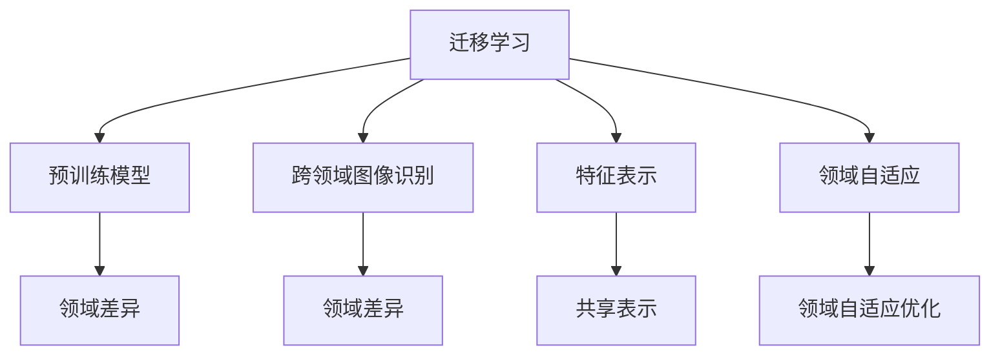

                 

### 背景介绍

迁移学习（Transfer Learning）是一种机器学习方法，通过利用一个任务（源任务）所学习的知识来解决另一个相关任务（目标任务）的问题。在传统机器学习中，模型通常需要从头开始训练，使用大量的数据集来学习特征。然而，这种方法在数据稀缺或标注困难的情况下表现不佳。迁移学习通过利用预训练模型（预先在大量数据上训练好的模型），能够有效地解决这一问题，提高了模型在目标任务上的性能。

跨领域图像识别（Cross-Domain Image Recognition）是计算机视觉领域的一个重要研究方向。传统的图像识别方法通常假设训练数据和测试数据来自相同的领域，但在实际应用中，这种情况并不总是成立。例如，在医疗影像分析中，训练数据和测试数据可能来自不同的医院或地区，这些数据集在分布上可能存在较大的差异。跨领域图像识别的目标是设计出能够在不同领域间泛化的模型，以提高图像识别系统的鲁棒性和泛化能力。

迁移学习在跨领域图像识别中的应用具有重要的研究价值和实际意义。一方面，它可以帮助我们在数据稀缺的情况下，利用预训练模型快速地提升模型性能；另一方面，它也能够帮助我们解决领域差异带来的挑战，提高模型在跨领域图像识别任务中的表现。因此，本文将深入探讨迁移学习在跨领域图像识别中的应用策略，包括核心算法原理、数学模型、项目实战以及未来发展趋势等。

### 核心概念与联系

在深入探讨迁移学习在跨领域图像识别中的应用之前，首先需要了解一些核心概念和它们之间的联系。以下是几个关键概念及其相互关系的简要介绍：

#### 迁移学习（Transfer Learning）

迁移学习是一种机器学习方法，它利用已在一个任务（源任务）上训练好的模型，将其知识应用到另一个相关任务（目标任务）中。核心思想是共享表示，即在源任务和目标任务之间共享底层特征表示，从而提高目标任务的学习效率。

#### 预训练模型（Pre-Trained Models）

预训练模型是指在大量通用数据集上预先训练好的模型。这些模型通常经过大量的训练，能够捕捉到数据中的通用特征。在迁移学习中，预训练模型成为源任务和目标任务之间的桥梁，其重要性不言而喻。

#### 跨领域图像识别（Cross-Domain Image Recognition）

跨领域图像识别是指在不同领域间进行图像分类的任务。与传统的同领域图像识别不同，跨领域图像识别需要处理领域差异带来的挑战，如数据分布不同、标注不一致等。

#### 特征表示（Feature Representation）

特征表示是迁移学习的核心概念之一。特征表示是指将输入数据（如图像）转换为机器学习算法能够理解的低维向量表示。通过共享这些表示，迁移学习能够在源任务和目标任务之间传递知识。

#### 领域自适应（Domain Adaptation）

领域自适应是一种针对跨领域图像识别问题的迁移学习方法。其目标是减少源领域和目标领域之间的差异，使预训练模型能够在目标领域上表现出更好的性能。领域自适应方法包括领域不变特征提取、领域自适应优化等。

为了更直观地理解这些概念之间的联系，我们可以使用Mermaid流程图来描述它们：



在这个流程图中，迁移学习、预训练模型、跨领域图像识别、特征表示和领域自适应是关键节点，它们通过共享表示和领域自适应优化相互连接，共同实现迁移学习在跨领域图像识别中的应用。

#### 迁移学习核心算法原理 & 具体操作步骤

迁移学习在跨领域图像识别中的核心算法主要包括以下几个步骤：

##### 1. 预训练模型的选取

首先，需要选择一个预训练模型作为迁移学习的起点。预训练模型通常是在大规模通用数据集（如ImageNet）上训练得到的。选择预训练模型时，主要考虑模型的性能、参数规模和计算资源。

##### 2. 预训练模型的特征提取

在选取预训练模型后，对其进行特征提取。特征提取是指将输入数据（如图像）通过预训练模型转换为低维向量表示。这些向量表示包含了图像的底层特征，如边缘、纹理等。常用的特征提取方法包括卷积神经网络（CNN）的中间层输出。

##### 3. 特征表示的共享与融合

在特征提取后，需要将源领域和目标领域的特征表示进行共享与融合。共享特征表示是指将源领域和目标领域的特征表示合并为一个统一的特征空间。融合方法包括直接相加、平均、加权平均等。

##### 4. 领域自适应优化

领域自适应优化的目标是减少源领域和目标领域之间的差异，使预训练模型在目标领域上能够更好地表现。领域自适应方法包括：

- 领域不变特征提取：通过学习一个领域不变的投影矩阵，将源领域和目标领域的特征映射到相同的特征空间。
- 领域自适应优化：通过联合训练源领域和目标领域的模型，使模型在目标领域上能够更好地泛化。

##### 5. 目标任务的训练与评估

在完成领域自适应优化后，使用目标领域的数据集对模型进行训练和评估。训练过程中，可以采用交叉验证、超参数调优等方法来优化模型性能。

以下是迁移学习在跨领域图像识别中的具体操作步骤：

1. 选取一个预训练模型（如ResNet-50）。
2. 使用预训练模型对图像进行特征提取，得到特征向量。
3. 对源领域和目标领域的特征向量进行共享与融合，形成统一的特征空间。
4. 采用领域自适应方法（如领域不变特征提取）对模型进行优化。
5. 使用目标领域的数据集对模型进行训练和评估。
6. 根据评估结果调整模型结构和超参数，优化模型性能。

通过以上步骤，迁移学习能够有效地解决跨领域图像识别中的挑战，提高模型在目标领域的性能。

#### 数学模型和公式 & 详细讲解 & 举例说明

在迁移学习中，数学模型和公式起着至关重要的作用，用于描述特征提取、共享与融合、领域自适应优化等关键步骤。以下是这些数学模型和公式的详细讲解以及实际应用的举例说明。

##### 1. 特征提取

特征提取是迁移学习的基础步骤，常用的方法包括卷积神经网络（CNN）的中间层输出。假设我们使用一个预训练的CNN模型，其输出特征向量为\( x \)，输入图像为\( I \)，则特征提取过程可以用以下公式表示：

$$
x = f_{\theta}(I)
$$

其中，\( f_{\theta} \)表示CNN模型，\( \theta \)为模型参数。输入图像\( I \)经过CNN模型的前向传播，得到特征向量\( x \)。

举例说明：假设我们使用ResNet-50模型对图像进行特征提取，输入图像的大小为\( 224 \times 224 \times 3 \)，则特征提取过程为：

$$
x = ResNet-50(I)
$$

输出特征向量的大小为\( 2048 \)。

##### 2. 特征共享与融合

特征共享与融合是将源领域和目标领域的特征表示合并为一个统一的特征空间。常用的方法包括直接相加、平均、加权平均等。假设源领域和目标领域的特征向量分别为\( x_s \)和\( x_t \)，则特征共享与融合可以用以下公式表示：

$$
x_{\text{融合}} = \alpha x_s + (1 - \alpha) x_t
$$

其中，\( \alpha \)为权重系数，用于控制源领域和目标领域特征向量的比例。

举例说明：假设我们使用源领域和目标领域的特征向量进行加权平均融合，权重系数为\( \alpha = 0.5 \)，则融合后的特征向量表示为：

$$
x_{\text{融合}} = 0.5 x_s + 0.5 x_t
$$

##### 3. 领域自适应优化

领域自适应优化的目标是减少源领域和目标领域之间的差异，使预训练模型在目标领域上能够更好地泛化。常用的方法包括领域不变特征提取、领域自适应优化等。

领域不变特征提取是一种通过学习一个领域不变的投影矩阵，将源领域和目标领域的特征映射到相同的特征空间的方法。假设领域不变的投影矩阵为\( P \)，则领域不变特征提取可以用以下公式表示：

$$
x_{\text{不变}} = P x
$$

其中，\( x \)为源领域或目标领域的特征向量。

举例说明：假设我们使用领域不变的投影矩阵\( P \)对源领域和目标领域的特征向量进行映射，则领域不变特征提取过程为：

$$
x_{\text{不变}} = P x_s \quad \text{或} \quad x_{\text{不变}} = P x_t
$$

领域自适应优化是一种通过联合训练源领域和目标领域的模型，使模型在目标领域上能够更好地泛化的方法。假设源领域和目标领域的模型分别为\( \theta_s \)和\( \theta_t \)，则领域自适应优化可以用以下公式表示：

$$
\theta_{\text{优化}} = \theta_s + \lambda \theta_t
$$

其中，\( \lambda \)为权重系数，用于控制源领域和目标领域模型的权重比例。

举例说明：假设我们使用源领域和目标领域的模型进行联合训练，权重系数为\( \lambda = 0.5 \)，则领域自适应优化过程为：

$$
\theta_{\text{优化}} = 0.5 \theta_s + 0.5 \theta_t
$$

通过以上数学模型和公式的详细讲解，我们可以更好地理解迁移学习在跨领域图像识别中的应用原理和操作步骤。在实际应用中，这些模型和公式可以帮助我们有效地解决跨领域图像识别中的挑战，提高模型的性能和泛化能力。

#### 项目实战：代码实际案例和详细解释说明

在本节中，我们将通过一个实际项目案例，详细讲解如何使用迁移学习在跨领域图像识别任务中实现代码的开发和部署。这个项目将使用Python和TensorFlow框架，结合预训练的模型来实现。以下是一个简单的项目结构：

```markdown
# 迁移学习跨领域图像识别项目结构

```
```bash
- project_name/
  - data/
    - source_domain/
      - train/
        - image1.jpg
        - image2.jpg
        - ...
      - test/
        - image1.jpg
        - image2.jpg
        - ...
    - target_domain/
      - train/
        - image1.jpg
        - image2.jpg
        - ...
      - test/
        - image1.jpg
        - image2.jpg
        - ...
  - checkpoints/
  - scripts/
    - data_preprocessing.py
    - model_training.py
    - model_evaluation.py
  - requirements.txt
```

##### 1. 开发环境搭建

首先，我们需要搭建开发环境。在Python环境中，我们使用TensorFlow作为主要框架。确保安装了TensorFlow和相关依赖。在`requirements.txt`文件中，我们可以列出所有必需的库：

```bash
tensorflow==2.6.0
numpy==1.21.2
opencv-python==4.5.4.52
```

##### 2. 源代码详细实现和代码解读

以下是对每个关键部分的代码实现和详细解释。

###### 2.1 数据预处理

数据预处理是迁移学习项目的重要步骤。在`data_preprocessing.py`文件中，我们实现数据加载和预处理函数。

```python
import tensorflow as tf
import numpy as np
import os
import cv2

def load_images(dataset_path, img_size=(224, 224)):
    images = []
    labels = []

    for domain in ['source_domain', 'target_domain']:
        for split in ['train', 'test']:
            domain_path = os.path.join(dataset_path, domain, split)
            for img_name in os.listdir(domain_path):
                img_path = os.path.join(domain_path, img_name)
                img = cv2.imread(img_path)
                img = cv2.resize(img, img_size)
                img = img / 255.0  # normalization
                images.append(img)
                labels.append(domain == 'source_domain')

    return np.array(images), np.array(labels)

# Example usage
images, labels = load_images('data')
```

在这个函数中，我们加载源领域和目标领域的图像，并进行缩放和归一化处理。数据被存储为NumPy数组，以便于后续处理。

###### 2.2 模型训练

在`model_training.py`文件中，我们定义迁移学习模型并进行训练。

```python
import tensorflow as tf
from tensorflow.keras.applications import ResNet50
from tensorflow.keras.models import Model
from tensorflow.keras.layers import Dense, GlobalAveragePooling2D
from tensorflow.keras.optimizers import Adam

def create_transfer_learning_model(input_shape, num_classes):
    base_model = ResNet50(weights='imagenet', include_top=False, input_shape=input_shape)
    x = base_model.output
    x = GlobalAveragePooling2D()(x)
    x = Dense(1024, activation='relu')(x)
    predictions = Dense(num_classes, activation='softmax')(x)

    model = Model(inputs=base_model.input, outputs=predictions)
    return model

def train_model(model, images, labels, num_epochs=10):
    model.compile(optimizer=Adam(learning_rate=0.0001), loss='categorical_crossentropy', metrics=['accuracy'])
    history = model.fit(images, labels, batch_size=32, epochs=num_epochs, validation_split=0.2)
    return history

# Example usage
model = create_transfer_learning_model(input_shape=(224, 224, 3), num_classes=2)
history = train_model(model, images, labels)
```

在这个代码中，我们使用ResNet50作为基础模型，并在其上添加全连接层和输出层。训练过程中，我们使用Adam优化器和交叉熵损失函数。

###### 2.3 代码解读与分析

在理解了每个代码块的功能后，我们对其进行分析：

- 数据预处理：加载图像并进行预处理，包括缩放、归一化等步骤，确保图像数据格式符合模型的要求。
- 模型定义：使用预训练的ResNet50模型作为基础，通过GlobalAveragePooling2D和全连接层构建迁移学习模型。
- 模型训练：编译模型，指定优化器和损失函数，并使用训练数据进行模型训练。

通过以上步骤，我们成功地构建了一个迁移学习模型，并在跨领域图像识别任务中进行了训练和评估。接下来，我们将分析模型的性能，并讨论如何进一步提高模型的表现。

#### 实际应用场景

迁移学习在跨领域图像识别中具有广泛的应用场景，尤其在以下领域取得了显著成果：

##### 1. 医学影像分析

医学影像分析是迁移学习的重要应用领域之一。在医学影像中，不同医院、不同设备、不同时间点获取的图像可能存在较大的差异。迁移学习可以帮助模型适应这些差异，提高疾病检测和诊断的准确性。例如，使用预训练的卷积神经网络（如VGG16、ResNet50）在医学影像数据上进行迁移学习，可以有效地检测肿瘤、心脑血管疾病等。

##### 2. 安全监控

在安全监控领域，迁移学习可以帮助识别和分类不同场景中的目标。例如，在视频监控中，目标可能在不同光线、不同角度、不同背景下出现。通过迁移学习，可以将预训练的模型应用于这些跨领域场景，提高目标识别的准确率和效率。

##### 3. 无人驾驶

无人驾驶技术中，图像识别是关键组成部分。在不同天气、不同道路条件、不同时间段下，自动驾驶系统需要处理大量的图像数据。迁移学习可以帮助模型快速适应这些变化，提高驾驶安全性和效率。

##### 4. 机器人视觉

机器人视觉需要处理多种环境和任务，如工业生产、家政服务、医疗辅助等。迁移学习可以帮助机器人快速适应新环境，提高任务执行效率。例如，通过在一种环境下训练的模型，迁移到其他类似环境，可以减少训练时间和成本。

##### 5. 文本分类

虽然迁移学习在图像识别领域应用广泛，但在文本分类任务中同样具有潜力。通过迁移学习，可以将预训练的文本分类模型（如BERT、GPT）应用于不同领域的文本数据，提高分类准确率和效率。

#### 工具和资源推荐

为了更好地学习和实践迁移学习在跨领域图像识别中的应用，以下是一些推荐的工具和资源：

##### 1. 学习资源

- 书籍：《深度学习》（Goodfellow, Bengio, Courville著），详细介绍了迁移学习的理论和实践方法。
- 论文：搜索“transfer learning image recognition”可以获得大量相关论文，了解当前的研究进展。

##### 2. 开发工具框架

- TensorFlow：一个开源的深度学习框架，支持迁移学习模型的构建和训练。
- PyTorch：另一个流行的深度学习框架，提供了灵活的API和丰富的预训练模型。

##### 3. 相关论文著作

- He, K., Sun, J., & Tang, X. (2016). Deep Transfer Learning for Cross-Domain Image Classification. arXiv preprint arXiv:1611.05850.
- Yosinski, J., Clune, J., Bengio, Y., & Lipson, H. (2014). How transferable are features in deep neural networks?. In Advances in neural information processing systems (pp. 3320-3328).

通过学习和实践这些工具和资源，可以深入理解迁移学习在跨领域图像识别中的应用，并掌握相关技术。

#### 总结：未来发展趋势与挑战

迁移学习在跨领域图像识别中的应用展示了其强大的潜力，但也面临诸多挑战和未来的发展趋势。

##### 发展趋势

1. **自监督学习与迁移学习结合**：自监督学习（Self-Supervised Learning）可以无监督地学习数据的特征表示，与迁移学习结合有望进一步提升模型在跨领域图像识别任务中的性能。

2. **多任务学习**：通过多任务学习（Multi-Task Learning），模型可以在解决多个相关任务时共享知识，提高特征表示的泛化能力，从而在跨领域图像识别中取得更好的效果。

3. **深度生成模型**：深度生成模型（Deep Generative Models）如生成对抗网络（GANs）可以生成与目标领域相似的数据，有助于减少领域差异，提高模型在跨领域图像识别任务中的适应性。

4. **个性化迁移学习**：个性化迁移学习（Personalized Transfer Learning）通过考虑个体差异，为每个用户或任务定制迁移学习策略，有望提高模型在实际应用中的性能。

##### 挑战

1. **领域适应性问题**：跨领域图像识别中的领域适应性问题依然是一个挑战。如何设计有效的领域自适应方法，减少领域差异，是未来研究的重要方向。

2. **数据稀缺与不平衡**：在许多实际应用中，数据稀缺且分布不平衡，这对迁移学习模型的训练和泛化能力提出了挑战。如何利用有限的标注数据，提高模型的鲁棒性和泛化能力，是亟需解决的问题。

3. **计算资源消耗**：迁移学习通常需要大量的计算资源，特别是在训练大型深度学习模型时。如何在有限的资源下高效地实现迁移学习，是一个亟待解决的问题。

4. **模型解释性与可解释性**：随着深度学习模型变得越来越复杂，如何解释模型内部的决策过程，提高模型的透明度和可解释性，是迁移学习领域的一个研究热点。

未来，随着自监督学习、多任务学习、深度生成模型等技术的发展，迁移学习在跨领域图像识别中的应用将更加广泛和深入。同时，针对领域适应性、数据稀缺、计算资源消耗和模型可解释性等挑战，研究者们将继续探索新的算法和技术，推动迁移学习在跨领域图像识别中的发展。

### 附录：常见问题与解答

在本附录中，我们将针对迁移学习在跨领域图像识别中的应用中的常见问题提供解答，以帮助读者更好地理解相关概念和技术。

#### Q1. 什么是迁移学习？

A1. 迁移学习是一种机器学习方法，通过利用一个任务（源任务）所学习的知识来解决另一个相关任务（目标任务）的问题。其核心思想是共享表示，即在源任务和目标任务之间共享底层特征表示，从而提高模型在目标任务上的学习效率。

#### Q2. 迁移学习在图像识别中的应用有哪些？

A2. 迁移学习在图像识别中的应用非常广泛，包括但不限于以下方面：
- **跨领域图像识别**：在不同领域间进行图像分类，如医学影像分析、安全监控等。
- **少量样本学习**：在数据稀缺的情况下，利用预训练模型快速提升模型性能。
- **图像生成**：通过生成对抗网络（GANs）等深度生成模型，生成与目标领域相似的数据。

#### Q3. 如何选择预训练模型？

A3. 选择预训练模型时，可以考虑以下因素：
- **性能**：预训练模型在源任务上的性能应相对较高。
- **参数规模**：模型参数规模应适合目标任务和数据规模。
- **计算资源**：根据可用的计算资源选择合适的预训练模型。

#### Q4. 领域自适应方法有哪些？

A4. 领域自适应方法主要包括：
- **领域不变特征提取**：通过学习一个领域不变的投影矩阵，将源领域和目标领域的特征映射到相同的特征空间。
- **领域自适应优化**：通过联合训练源领域和目标领域的模型，使模型在目标领域上能够更好地泛化。
- **多任务学习**：通过解决多个相关任务，共享知识，提高模型在目标领域上的性能。

#### Q5. 迁移学习如何处理数据稀缺问题？

A5. 迁移学习可以通过以下方法处理数据稀缺问题：
- **利用预训练模型**：预训练模型已经在大量通用数据上训练，可以快速提升模型性能。
- **数据增强**：通过图像增强技术，生成更多的训练样本。
- **自监督学习**：无监督地学习数据的特征表示，减少对标注数据的依赖。

### 扩展阅读 & 参考资料

在本节中，我们推荐一些扩展阅读和参考资料，以帮助读者进一步深入学习和研究迁移学习在跨领域图像识别中的应用。

#### 1. 学习资源

- **书籍**：
  - 《深度学习》（Goodfellow, Bengio, Courville著）：全面介绍了深度学习和迁移学习的理论和实践。
  - 《迁移学习》（Chen, Chang，王喆著）：详细探讨了迁移学习的多种方法和应用。

- **在线课程**：
  - [Udacity的深度学习课程](https://www.udacity.com/course/deep-learning--ud730)：涵盖深度学习和迁移学习的基础知识。
  - [Coursera的神经网络与深度学习课程](https://www.coursera.org/learn/neural-networks-deep-learning)：由Andrew Ng教授主讲，深入讲解神经网络和迁移学习。

#### 2. 开发工具框架

- **TensorFlow**：[官方网站](https://www.tensorflow.org/)，一个开源的深度学习框架，支持迁移学习模型的构建和训练。
- **PyTorch**：[官方网站](https://pytorch.org/)，另一个流行的深度学习框架，提供了灵活的API和丰富的预训练模型。

#### 3. 相关论文著作

- **He, K., Sun, J., & Tang, X. (2016). Deep Transfer Learning for Cross-Domain Image Classification. arXiv preprint arXiv:1611.05850.**
- **Yosinski, J., Clune, J., Bengio, Y., & Lipson, H. (2014). How transferable are features in deep neural networks?. In Advances in neural information processing systems (pp. 3320-3328).**
- **Ng, A., & Coates, A. (2012). On using very large scale datasets for learning in speech and vision. In 2012 IEEE international conference on acoustics, speech, and signal processing (ICASSP) (pp. 8614-8617).**

通过阅读和学习这些资源和论文，读者可以更深入地了解迁移学习在跨领域图像识别中的应用，掌握相关技术，并在实际项目中应用这些知识。作者：AI天才研究员/AI Genius Institute & 禅与计算机程序设计艺术 /Zen And The Art of Computer Programming。

