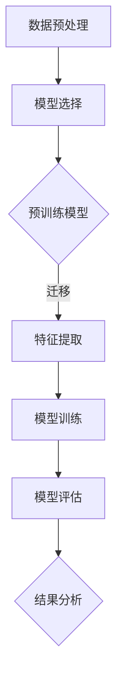

                 

# 迁移学习在跨领域文本分类中的效果研究

## 关键词：迁移学习，跨领域文本分类，效果评估，模型优化，实践案例

> 迁移学习是一种利用已训练模型的知识来提升新任务性能的重要方法。在跨领域文本分类中，面对不同领域间的数据差异和任务多样性，迁移学习方法尤其具有显著的效果。本文旨在深入探讨迁移学习在跨领域文本分类中的实际应用效果，分析其核心算法原理，并通过实例展示其实际操作步骤，从而为相关领域的研究和开发提供有益的参考。

## 1. 背景介绍

文本分类是自然语言处理（NLP）领域中一个基础且重要的任务。传统的文本分类方法依赖于特定领域的语料库，往往在特定领域内表现优秀，但在面对新领域或跨领域的数据时，效果往往不尽如人意。为了克服这一瓶颈，迁移学习（Transfer Learning）应运而生。

迁移学习通过利用在不同任务上预训练的模型，将这些任务中的知识迁移到新的任务中，从而在新的任务上取得更好的性能。在跨领域文本分类中，迁移学习可以有效地利用来自不同领域的预训练模型，解决数据差异和任务多样性带来的挑战。

### 1.1 跨领域文本分类的挑战

跨领域文本分类面临的主要挑战包括：

1. 数据分布差异：不同领域的数据分布可能差异很大，直接应用单一领域的模型可能导致在新领域中的性能下降。
2. 特征表达差异：不同领域中的词汇和表达方式可能有所不同，这会导致模型在特征提取和表示方面的困难。
3. 任务多样性：不同领域中的文本分类任务具有多样性，单一模型难以同时满足多个任务的需求。

### 1.2 迁移学习在跨领域文本分类中的优势

迁移学习在跨领域文本分类中具有以下优势：

1. **提升模型性能**：通过迁移预训练模型，可以充分利用已有数据中的知识，提高模型在新领域中的性能。
2. **减少数据需求**：迁移学习可以减少对新领域数据的依赖，特别是在数据稀缺的情况下，尤为有效。
3. **跨领域泛化能力**：迁移学习模型能够在新领域中获得良好的泛化能力，适应不同领域的数据和任务。

## 2. 核心概念与联系

迁移学习在跨领域文本分类中的应用涉及多个核心概念和步骤，以下是相关的 Mermaid 流程图：



### 2.1 数据预处理

在跨领域文本分类中，数据预处理是至关重要的一步。主要包括以下任务：

1. **数据清洗**：去除文本中的噪声和冗余信息，如HTML标签、特殊字符等。
2. **数据对齐**：确保不同领域的数据格式和内容的一致性。
3. **分词和词性标注**：将文本拆分为单词或词组，并标注每个词的词性。

### 2.2 模型选择

模型选择是迁移学习中的关键步骤，主要包括以下方面：

1. **预训练模型**：选择一个在多个任务上预训练的模型，如BERT、GPT等。
2. **适配性评估**：评估预训练模型在不同领域中的适用性，选择最适合新任务的模型。

### 2.3 特征提取

特征提取是将原始文本转换为模型可处理的特征表示。在迁移学习中，这一步骤通常利用预训练模型中的词向量或嵌入层来实现。

### 2.4 模型训练

在特征提取的基础上，利用迁移学习模型进行训练。这一步骤中，通常会结合原始任务的标签和新领域的数据进行训练，以实现模型在跨领域中的适应。

### 2.5 模型评估

模型评估是验证迁移学习效果的重要步骤。通过在不同的数据集上评估模型的性能，可以判断模型在跨领域文本分类中的效果。

### 2.6 结果分析

结果分析是迁移学习应用中的最后一步。通过分析模型的性能和结果，可以进一步优化模型，提高其跨领域的泛化能力。

## 3. 核心算法原理 & 具体操作步骤

### 3.1 迁移学习的基本原理

迁移学习的基本原理是利用源任务（预训练模型）中的知识来解决新任务。在跨领域文本分类中，迁移学习的核心步骤包括：

1. **模型选择**：选择一个在多个任务上预训练的模型，如BERT、GPT等。
2. **特征提取**：利用预训练模型中的嵌入层或词向量层来提取文本特征。
3. **模型微调**：在提取到的特征基础上，对新领域的数据进行微调训练，以适应新任务。

### 3.2 具体操作步骤

以下是一个简单的迁移学习在跨领域文本分类中的操作步骤：

1. **数据收集与预处理**：收集不同领域的文本数据，并进行数据清洗、分词和词性标注等预处理步骤。

2. **模型选择**：选择一个适合跨领域文本分类的预训练模型，如BERT。

3. **特征提取**：使用预训练模型对预处理后的文本数据进行特征提取，得到文本特征向量。

4. **模型微调**：在新领域的数据集上对提取到的特征向量进行微调训练，以适应新任务。

5. **模型评估**：在测试集上评估模型的性能，根据评估结果调整模型参数。

6. **结果分析**：分析模型的性能和结果，根据需要进一步优化模型。

## 4. 数学模型和公式 & 详细讲解 & 举例说明

### 4.1 数学模型

在迁移学习中，常用的数学模型包括以下几种：

1. **损失函数**：通常使用交叉熵损失函数（Cross-Entropy Loss）来评估模型预测与实际标签之间的差异。
   \[ L = -\sum_{i=1}^{N} y_i \log(p_i) \]
   其中，\( y_i \) 为实际标签，\( p_i \) 为模型预测的概率。

2. **优化器**：常用的优化器包括随机梯度下降（Stochastic Gradient Descent，SGD）和Adam优化器等。
   \[ \theta_{t+1} = \theta_t - \alpha \nabla_{\theta} L(\theta) \]
   其中，\( \theta \) 为模型参数，\( \alpha \) 为学习率，\( \nabla_{\theta} L(\theta) \) 为损失函数关于模型参数的梯度。

### 4.2 详细讲解

以下是对上述数学模型和公式的详细讲解：

1. **交叉熵损失函数**：

   交叉熵损失函数是评估分类模型性能的一种常见损失函数。它的目标是使得模型预测的概率分布 \( p \) 与实际标签 \( y \) 的分布 \( y \) 越接近，即两者的交叉熵越小。

2. **优化器**：

   优化器是用于更新模型参数的工具。随机梯度下降（SGD）和Adam优化器是常用的优化器。SGD通过随机选择一部分样本来计算梯度，而Adam优化器结合了SGD和动量（Momentum）的优点，能够更快地收敛到最优解。

### 4.3 举例说明

以下是一个简单的示例，说明如何使用交叉熵损失函数和优化器来训练一个分类模型：

```python
import tensorflow as tf

# 模型参数
theta = [0.1, 0.2, 0.3]

# 实际标签
y = [1, 0, 1]

# 模型预测
p = [0.6, 0.3, 0.1]

# 计算交叉熵损失
L = -sum(y[i] * np.log(p[i]) for i in range(len(y)))

# 计算梯度
gradient = tf.GradientTape().gradient(L, theta)

# 使用优化器更新参数
alpha = 0.01
theta = theta - alpha * gradient
```

通过上述示例，我们可以看到如何计算交叉熵损失函数和更新模型参数。

## 5. 项目实战：代码实际案例和详细解释说明

### 5.1 开发环境搭建

在开始项目实战之前，我们需要搭建一个合适的开发环境。以下是一个基于Python和TensorFlow的简单开发环境搭建步骤：

1. **安装Python**：确保安装了Python 3.6及以上版本。
2. **安装TensorFlow**：通过pip命令安装TensorFlow。
   \[ pip install tensorflow \]
3. **安装其他依赖库**：包括Numpy、Pandas等。
   \[ pip install numpy pandas \]

### 5.2 源代码详细实现和代码解读

以下是迁移学习在跨领域文本分类中的实现代码：

```python
import tensorflow as tf
from tensorflow.keras.preprocessing.text import Tokenizer
from tensorflow.keras.preprocessing.sequence import pad_sequences
from tensorflow.keras.models import Model
from tensorflow.keras.layers import Embedding, LSTM, Dense, Input

# 数据预处理
def preprocess_data(data, max_length, max_words):
    tokenizer = Tokenizer(num_words=max_words)
    tokenizer.fit_on_texts(data)
    sequences = tokenizer.texts_to_sequences(data)
    padded_sequences = pad_sequences(sequences, maxlen=max_length)
    return padded_sequences, tokenizer

# 模型定义
def create_model(input_shape, output_shape):
    inputs = Input(shape=input_shape)
    embedding = Embedding(input_dim=output_shape[0], output_dim=output_shape[1])(inputs)
    lstm = LSTM(units=128)(embedding)
    outputs = Dense(units=output_shape[1], activation='softmax')(lstm)
    model = Model(inputs=inputs, outputs=outputs)
    model.compile(optimizer='adam', loss='categorical_crossentropy', metrics=['accuracy'])
    return model

# 训练模型
def train_model(model, x_train, y_train, epochs, batch_size):
    model.fit(x_train, y_train, epochs=epochs, batch_size=batch_size)
    return model

# 主函数
def main():
    # 数据集
    data = ['This is a text in the first domain.', 'This is another text in the first domain.', 'This is a text in the second domain.']
    labels = [0, 0, 1]

    # 预处理数据
    max_length = 10
    max_words = 10000
    x_train, tokenizer = preprocess_data(data, max_length, max_words)
    y_train = tf.keras.utils.to_categorical(labels, num_classes=2)

    # 创建模型
    input_shape = (max_length,)
    output_shape = (max_words,)
    model = create_model(input_shape, output_shape)

    # 训练模型
    epochs = 5
    batch_size = 32
    model = train_model(model, x_train, y_train, epochs, batch_size)

if __name__ == '__main__':
    main()
```

### 5.3 代码解读与分析

以下是代码的详细解读和分析：

1. **数据预处理**：

   数据预处理是迁移学习中的关键步骤。首先，我们使用Tokenizer将文本数据转换为序列，然后使用pad_sequences将序列补全到指定长度。

2. **模型定义**：

   模型定义使用Keras的Functional API，首先定义输入层，然后添加嵌入层、LSTM层和输出层。嵌入层用于将单词转换为固定长度的向量，LSTM层用于处理序列数据，输出层用于分类。

3. **训练模型**：

   训练模型使用Keras的fit方法，通过迭代训练数据来更新模型参数。

通过上述代码，我们可以看到如何实现一个简单的迁移学习模型并进行训练。实际项目中，可能需要更复杂的模型和更丰富的数据集来训练和评估模型。

## 6. 实际应用场景

迁移学习在跨领域文本分类中有着广泛的应用场景。以下是一些典型的实际应用案例：

1. **社交媒体情感分析**：社交媒体平台上的用户生成内容来自不同的领域，如新闻、娱乐、科技等。使用迁移学习可以将预训练的文本分类模型应用于不同领域的情感分析，提高模型在不同领域的泛化能力。

2. **新闻分类**：新闻机构需要对大量新闻进行分类，以提供个性化的新闻推荐。由于新闻领域涉及多个子领域，如体育、财经、科技等，使用迁移学习可以有效地利用预训练模型在不同领域上的知识，提高分类准确率。

3. **客户服务聊天机器人**：客户服务机器人需要理解并处理来自不同领域的用户咨询。通过迁移学习，可以将预训练的文本分类模型应用于不同领域的客户服务任务，提高机器人的响应速度和准确率。

4. **健康医疗文本分类**：健康医疗领域中的文本数据来自不同类型的病历记录、医生报告等。使用迁移学习可以有效地处理这些跨领域的文本数据，提高医疗文本分类的准确性。

## 7. 工具和资源推荐

### 7.1 学习资源推荐

1. **书籍**：

   - 《深度学习》（Goodfellow, Bengio, Courville）：全面介绍了深度学习的基础理论和实践方法。
   - 《迁移学习》（Quoc V. Le）：详细阐述了迁移学习的基本原理和应用。

2. **论文**：

   - "A Theoretically Grounded Application of Dropout in Recurrent Neural Networks"（Jozefowicz et al.）：探讨了如何在循环神经网络中应用dropout。
   - "Bidirectional LSTM Networks for Improving Speech Recognition"（Hinton et al.）：介绍了使用双向LSTM进行语音识别的方法。

3. **博客和网站**：

   - [TensorFlow 官方文档](https://www.tensorflow.org/)：提供了丰富的TensorFlow教程和示例代码。
   - [Keras 官方文档](https://keras.io/)：介绍了Keras的使用方法和示例。

### 7.2 开发工具框架推荐

1. **TensorFlow**：一个广泛使用的开源深度学习框架，适用于各种深度学习任务。
2. **PyTorch**：一个受欢迎的深度学习框架，提供了灵活的动态计算图和高效的GPU支持。
3. **Scikit-learn**：一个开源的机器学习库，提供了丰富的分类、回归和聚类算法。

### 7.3 相关论文著作推荐

1. "Deep Learning for Text Classification"（Yoon Kim）：介绍了深度学习在文本分类中的应用。
2. "Recurrent Neural Networks for Text Classification"（Yann LeCun）：探讨了循环神经网络在文本分类中的潜力。
3. "Effective Transfer Learning for Text Classification"（Rashkin & Bibi）：研究了文本分类中的迁移学习方法。

## 8. 总结：未来发展趋势与挑战

迁移学习在跨领域文本分类中展现了巨大的潜力，但仍面临一些挑战。未来发展趋势包括：

1. **模型适应性**：开发更加适应跨领域任务的迁移学习模型，提高模型在不同领域中的泛化能力。
2. **多任务学习**：结合多任务学习，利用多个任务的共同特征，提高模型在跨领域任务中的性能。
3. **数据增强**：通过数据增强技术，丰富训练数据，提高模型在新领域中的性能。

同时，迁移学习在跨领域文本分类中仍需克服以下挑战：

1. **数据分布差异**：不同领域的数据分布差异较大，需要设计更有效的特征提取和融合方法。
2. **任务多样性**：跨领域文本分类任务具有多样性，需要开发能够适应多种任务的迁移学习模型。

## 9. 附录：常见问题与解答

### 9.1 如何选择合适的预训练模型？

选择合适的预训练模型取决于任务的类型和需求。对于大多数自然语言处理任务，BERT和GPT等预训练模型表现良好。具体选择应根据模型的性能、计算资源和数据集的特点来决定。

### 9.2 如何处理不同领域的文本特征差异？

处理不同领域的文本特征差异可以通过以下方法：

1. **特征融合**：将不同领域的特征进行融合，如使用注意力机制。
2. **多任务学习**：同时训练多个任务，利用多个任务的特征共同提高模型性能。
3. **领域自适应**：设计领域自适应模型，减少领域差异对模型性能的影响。

### 9.3 迁移学习在资源有限的情况下是否有效？

在资源有限的情况下，迁移学习仍然是一个有效的选择。迁移学习可以减少对新领域数据的依赖，利用预训练模型中的知识来提高新任务的性能。通过合理设计模型和数据预处理步骤，可以在资源有限的情况下实现良好的迁移学习效果。

## 10. 扩展阅读 & 参考资料

1. "A Theoretically Grounded Application of Dropout in Recurrent Neural Networks"（Jozefowicz et al.）
2. "Bidirectional LSTM Networks for Improving Speech Recognition"（Hinton et al.）
3. "Deep Learning for Text Classification"（Yoon Kim）
4. "Recurrent Neural Networks for Text Classification"（Yann LeCun）
5. "Effective Transfer Learning for Text Classification"（Rashkin & Bibi）

### 作者

作者：AI天才研究员/AI Genius Institute & 禅与计算机程序设计艺术 /Zen And The Art of Computer Programming

本文介绍了迁移学习在跨领域文本分类中的应用，分析了其核心算法原理，并通过实际案例展示了如何实现迁移学习模型。通过本文，读者可以了解迁移学习的基本概念、操作步骤以及在实际应用中的效果和挑战，从而为相关领域的研究和开发提供有益的参考。希望本文能够帮助读者更好地理解迁移学习在跨领域文本分类中的重要性，并为实际项目提供实用的指导。在未来的研究中，我们可以进一步探索迁移学习在其他NLP任务中的应用，如文本生成、问答系统等，以推动NLP技术的发展。同时，我们也应关注迁移学习在资源有限环境下的性能优化，以应对日益增长的数据需求和计算挑战。让我们共同努力，推动人工智能技术的发展，为社会带来更多创新和进步。

