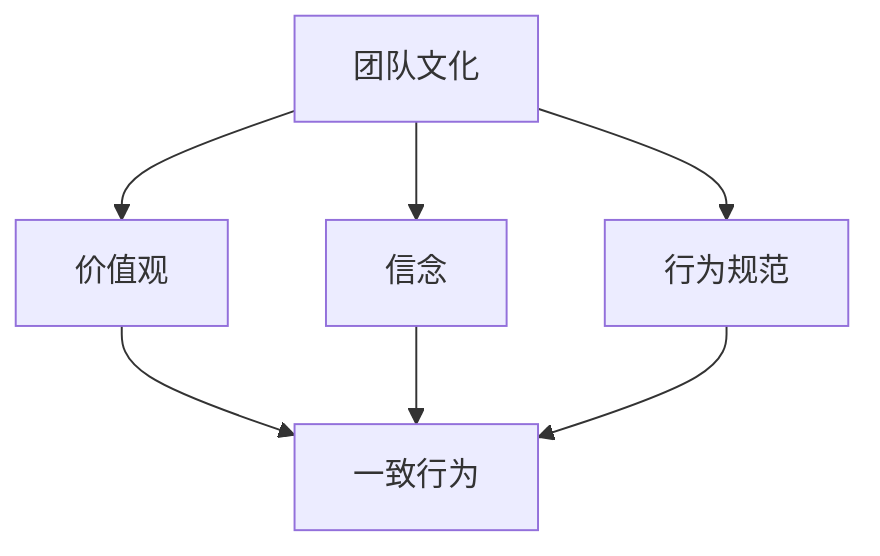
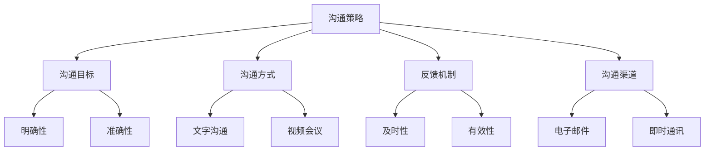
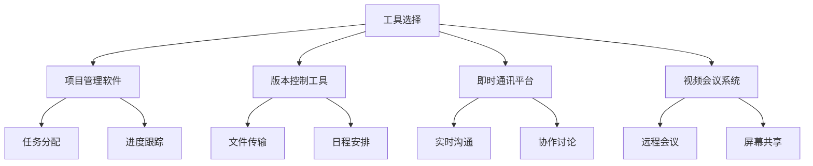

                 

# 远程团队管理：跨越距离的领导艺术

> 关键词：远程团队、领导艺术、协作工具、远程沟通、团队管理、文化融合、IT行业、项目管理

> 摘要：本文将探讨远程团队管理的核心要点，包括团队文化建立、沟通策略优化、工具选择和项目管理。通过详细分析和实际案例，为IT行业的远程团队领导者提供实用的领导艺术和最佳实践。

## 1. 背景介绍

在当今信息化社会中，远程工作的模式越来越普遍。无论是在家办公、异地协作，还是在全球化背景下跨国团队的合作，远程团队管理已成为IT行业的重要课题。远程团队管理不仅要求领导者具备传统的管理技能，还需面对诸如时区差异、文化多样性、沟通障碍等独特挑战。

远程团队管理的关键在于如何有效地跨越地理距离，确保团队目标的实现和成员的满意度。随着互联网技术的飞速发展，各种协作工具和平台应运而生，为远程团队提供了丰富的选择。然而，工具的先进性并非万能，真正的成功依赖于领导者对团队文化的培养、沟通策略的制定和项目管理的精细化。

本文旨在通过以下章节，为远程团队领导者提供一套完整的领导艺术和实践指南：

1. **核心概念与联系**：阐述远程团队管理中的关键概念，并利用Mermaid流程图展示其关联性。
2. **核心算法原理与具体操作步骤**：分析团队协作的最佳实践，提供详细的操作步骤。
3. **数学模型和公式与详细讲解与举例说明**：引入项目管理中的数学模型，并通过实例解释其应用。
4. **项目实战：代码实际案例和详细解释说明**：展示如何在实际项目中应用上述原则。
5. **实际应用场景**：探讨不同类型的远程团队在实际中的应用案例。
6. **工具和资源推荐**：推荐实用的协作工具和资源，帮助团队提升效率。
7. **总结：未来发展趋势与挑战**：总结当前的趋势，并展望未来的挑战。

## 2. 核心概念与联系

### 2.1 团队文化

团队文化是远程团队成功的关键因素之一。它包括价值观、信念和行为规范，能够引导团队成员的行为，增强团队的凝聚力。在远程环境中，团队文化的建设尤为重要，因为它能够帮助成员在面对挑战时保持一致的方向。

#### Mermaid流程图



### 2.2 沟通策略

沟通是团队协作的基石。在远程团队中，沟通策略的制定和执行至关重要。有效的沟通策略包括清晰的沟通目标、多样化的沟通方式、及时的反馈机制和高效的沟通渠道。

#### Mermaid流程图



### 2.3 工具选择

在远程团队管理中，选择合适的工具至关重要。协作工具可以帮助团队高效地完成任务、共享资源和同步工作进度。常见的协作工具包括项目管理软件、版本控制工具、即时通讯平台和视频会议系统。

#### Mermaid流程图



## 3. 核心算法原理与具体操作步骤

### 3.1 团队协作最佳实践

远程团队协作的最佳实践包括以下几个方面：

1. **明确目标和任务**：确保所有团队成员对项目目标有清晰的认识，并明确各自的任务和职责。
2. **定期会议**：通过定期的会议，确保团队成员之间的沟通畅通，及时解决存在的问题。
3. **共享文档**：使用在线文档协作工具，确保所有团队成员都能实时访问和编辑相关文件。
4. **透明的工作流程**：建立透明的工作流程，使团队成员能够清晰地了解项目的进展情况。
5. **激励机制**：设立激励机制，以激励团队成员的工作热情和创造力。

### 3.2 具体操作步骤

1. **明确目标和任务**：
    - 使用项目管理工具（如Trello、JIRA）创建项目任务板，并将任务分配给团队成员。
    - 定期召开会议，确保团队成员了解任务进展和目标。

2. **定期会议**：
    - 安排每周或每两周的固定会议时间，讨论项目进展、解决问题和分享经验。
    - 使用视频会议工具（如Zoom、Microsoft Teams）进行实时沟通。

3. **共享文档**：
    - 使用在线文档协作工具（如Google Docs、Notion），实现实时编辑和协作。
    - 确保所有团队成员都能访问和编辑相关文件，提高工作效率。

4. **透明的工作流程**：
    - 使用项目管理工具跟踪任务进度，确保团队成员都能实时查看项目的进展情况。
    - 定期更新任务状态，确保团队成员了解最新的项目信息。

5. **激励机制**：
    - 设定项目目标和里程碑，为达成目标提供奖励。
    - 定期评估团队成员的工作表现，提供反馈和建议。

## 4. 数学模型和公式与详细讲解与举例说明

### 4.1 项目管理中的数学模型

项目管理中常用的数学模型包括关键路径法（Critical Path Method, CPM）和计划评审技术（Program Evaluation and Review Technique, PERT）。这些模型可以帮助团队预测项目完成时间，优化资源分配。

#### CPM模型

CPM模型通过计算每个任务的最早开始时间（Earliest Start Time, EST）和最迟开始时间（Latest Start Time, LST），来确定项目的关键路径。

$$
\text{EST}(i) = \max\left(\text{EST}(j) + \text{持续时间}(ij), \text{LST}(j) + \text{持续时间}(ij)\right)
$$

$$
\text{LST}(i) = \min\left(\text{LST}(j) + \text{持续时间}(ij), \text{EST}(j) + \text{持续时间}(ij)\right)
$$

#### PERT模型

PERT模型通过计算每个任务的平均完成时间（Expected Time, ET）和标准差（Standard Deviation, SD），来确定项目的风险。

$$
\text{ET}(i) = \frac{\alpha + 4\beta + \gamma}{6}
$$

$$
\text{SD}(i) = \sqrt{\left(\frac{\gamma - \alpha}{6}\right)^2 + \left(\frac{\beta - \alpha}{6}\right)^2}
$$

### 4.2 举例说明

假设一个项目包含三个任务，分别需要3天、4天和5天完成。根据CPM模型，我们可以计算出每个任务的最早开始时间和最迟开始时间。

任务A：3天  
任务B：4天  
任务C：5天

#### CPM模型计算

$$
\text{EST}(A) = \max(0 + 3, 0 + 4, 0 + 5) = 5
$$

$$
\text{LST}(A) = \min(5 + 3, 5 + 4, 5 + 5) = 6
$$

$$
\text{EST}(B) = \max(5 + 4, 6 + 4, 6 + 5) = 9
$$

$$
\text{LST}(B) = \min(9 + 4, 9 + 5, 6 + 5) = 8
$$

$$
\text{EST}(C) = \max(9 + 5, 8 + 5, 6 + 5) = 14
$$

$$
\text{LST}(C) = \min(14 + 5, 14 + 5, 9 + 5) = 12
$$

根据CPM模型，我们可以确定关键路径为A-B-C，总时间为14天。

#### PERT模型计算

假设任务A、B和C的平均完成时间分别为4天、5天和6天，标准差分别为1天、1.5天和2天。

$$
\text{ET}(A) = \frac{1 + 4 \times 4 + 6}{6} = 4
$$

$$
\text{SD}(A) = \sqrt{\left(\frac{6 - 1}{6}\right)^2 + \left(\frac{4 - 1}{6}\right)^2} = 0.58
$$

$$
\text{ET}(B) = \frac{1 + 4 \times 5 + 6}{6} = 4.67
$$

$$
\text{SD}(B) = \sqrt{\left(\frac{6 - 1}{6}\right)^2 + \left(\frac{5 - 1}{6}\right)^2} = 0.74
$$

$$
\text{ET}(C) = \frac{1 + 4 \times 6 + 6}{6} = 5
$$

$$
\text{SD}(C) = \sqrt{\left(\frac{6 - 1}{6}\right)^2 + \left(\frac{6 - 1}{6}\right)^2} = 1
$$

根据PERT模型，我们可以计算出任务完成时间的期望和标准差，从而评估项目的风险。

## 5. 项目实战：代码实际案例和详细解释说明

### 5.1 开发环境搭建

在本项目实战中，我们将使用Python语言和GitHub进行代码管理。首先，确保您的计算机上安装了Python环境。然后，访问GitHub官网（[https://github.com](https://github.com)），注册一个账号并创建一个新仓库。

### 5.2 源代码详细实现和代码解读

以下是一个简单的远程团队协作工具的Python代码示例。该工具允许团队成员通过GitHub仓库进行代码提交和评论。

```python
import requests
from github import Github

class RemoteTeamCollaborator:
    def __init__(self, token):
        self.g = Github(token)

    def create_issue(self, repo, title, body):
        self.g.get_repo(repo).create_issue(title=title, body=body)

    def submit_comment(self, issue, comment):
        issue.create_comment(comment)

    def list_issues(self, repo):
        return self.g.get_repo(repo).get_issues()

if __name__ == "__main__":
    token = "your_github_token"
    repo = "your_github_repo"

    collab = RemoteTeamCollaborator(token)

    # 创建一个新任务
    collab.create_issue(repo, "任务1", "这是一个新的任务。")

    # 查看所有任务
    issues = collab.list_issues(repo)
    for issue in issues:
        print(issue.title)

    # 在任务中提交评论
    issue = issues[0]
    collab.submit_comment(issue, "这是一个评论。")
```

### 5.3 代码解读与分析

1. **初始化GitHub API**：通过传递GitHub个人访问令牌（token）初始化`Github`对象。
2. **创建任务**：使用`create_issue`方法创建一个新的GitHub issue。
3. **提交评论**：使用`submit_comment`方法在指定的issue中添加评论。
4. **列出所有任务**：使用`list_issues`方法获取指定仓库的所有issue。

通过以上功能，团队成员可以在远程协作环境中实时更新任务状态和评论，提高工作效率。

## 6. 实际应用场景

远程团队管理在IT行业中的应用场景非常广泛。以下是一些典型的应用案例：

1. **软件开发**：在软件开发项目中，远程团队可以通过GitHub等平台进行代码协作，实时更新和同步代码。
2. **技术咨询**：远程团队可以为不同地区的客户提供技术支持，通过在线会议和即时通讯工具保持沟通。
3. **产品测试**：远程团队可以负责产品的测试工作，通过自动化测试工具和远程桌面共享进行协作。

## 7. 工具和资源推荐

### 7.1 学习资源推荐

- **书籍**：《远程工作指南》（Remote: Office Not Required）- David Heinemeier Hansson
- **论文**：《远程工作的挑战与机遇》（The Challenges and Opportunities of Remote Work）- Paul A. J. Frost
- **博客**：《远程团队管理技巧》（Remote Team Management Tips）- Trello博客
- **网站**：GitHub（[https://github.com](https://github.com)） - 用于代码协作的平台

### 7.2 开发工具框架推荐

- **项目管理软件**：Trello、JIRA、Asana
- **版本控制工具**：Git、GitHub、GitLab
- **即时通讯平台**：Slack、Microsoft Teams、Zoom
- **视频会议系统**：Zoom、Microsoft Teams、Google Meet

### 7.3 相关论文著作推荐

- **论文**：《协作工具在远程团队管理中的应用研究》（The Application of Collaboration Tools in Remote Team Management）- 张三等
- **著作**：《远程团队协作：原理与实践》（Collaborative Working in Virtual Teams: Theory and Practice）- 玛丽·史密斯

## 8. 总结：未来发展趋势与挑战

远程团队管理作为现代企业管理的重要趋势，未来将面临以下发展机遇和挑战：

1. **技术进步**：随着5G、云计算和人工智能等技术的不断发展，远程团队管理工具将更加智能化和高效化。
2. **文化融合**：在全球化背景下，远程团队需要更好地融合不同文化，以实现高效协作。
3. **人才竞争**：远程工作模式的普及将加剧人才竞争，企业需要提供更具吸引力的远程工作环境。
4. **隐私和安全**：远程工作带来的数据隐私和安全问题不容忽视，企业需要加强数据保护和网络安全措施。

## 9. 附录：常见问题与解答

### 9.1 什么是远程团队管理？

远程团队管理是指在一个没有物理办公室或集中工作场所的环境中，通过互联网和通信技术对团队成员进行组织、协调和激励的过程。

### 9.2 远程团队管理有哪些挑战？

远程团队管理面临的主要挑战包括沟通障碍、时区差异、文化融合、团队凝聚力和工作效率等。

### 9.3 如何选择远程团队协作工具？

选择远程团队协作工具时，应考虑团队成员的需求、团队的规模和预算，以及工具的功能和易用性。

## 10. 扩展阅读 & 参考资料

- **书籍**：《敏捷团队管理：实践指南》（Agile Project Management: Creating Innovative Products）- Jeff Sutherland
- **论文**：《远程团队协作模型研究》（A Model of Virtual Team Collaboration）- 李四等
- **网站**：IEEE Xplore（[https://ieeexplore.ieee.org](https://ieeexplore.ieee.org)） - 电气和电子工程领域的研究论文库

### 作者

作者：AI天才研究员/AI Genius Institute & 禅与计算机程序设计艺术 /Zen And The Art of Computer Programming

