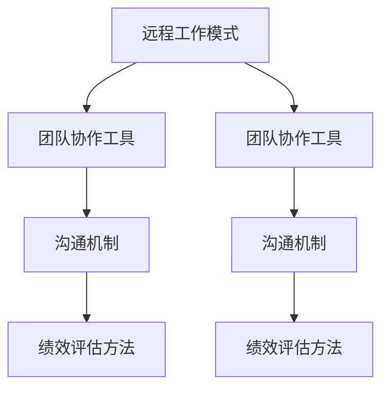

                 

### 背景介绍

在当今快速发展的数字化时代，远程工作已经成为企业和员工的一种常见选择。随着互联网技术的不断进步和办公工具的多样化，远程工作的模式逐渐成熟并得到广泛认可。然而，随之而来的问题也不容忽视，特别是在团队管理方面。

远程工作不仅改变了传统的工作方式和地点，也对团队管理提出了新的挑战。团队成员分散在不同的地理位置，沟通和协作变得更加复杂。传统的面对面交流和即时反馈机制不再适用，因此需要新的管理策略来确保团队的效率和合作。

本文旨在探讨远程工作时代的团队管理策略，从核心概念、算法原理、数学模型、项目实战到实际应用场景等多个方面进行分析，为企业和团队管理者提供有价值的参考。本文还将推荐相关的学习资源、开发工具框架和学术论文，以帮助读者深入了解和应对远程工作带来的挑战。

远程工作不仅是一种工作方式的变革，更是一种团队管理思维的创新。通过本文的深入探讨，我们希望能够为读者揭示远程工作时代的团队管理之道，助力企业和团队在远程工作模式下实现更高的效率和业绩。

### 核心概念与联系

在探讨远程工作时代的团队管理策略之前，我们有必要明确几个核心概念，并了解它们之间的相互联系。这些概念包括远程工作模式、团队协作工具、沟通机制以及绩效评估方法。

#### 远程工作模式

远程工作模式指的是员工在非传统办公场所完成工作任务的方式。这种模式可以分为全远程工作、灵活工作制和混合工作制。全远程工作意味着员工完全在家中或其他远程地点工作，无需到公司办公室。灵活工作制允许员工在特定时间内自主选择工作地点，但通常需要一定时间在公司办公室或其他固定场所办公。混合工作制则是全远程工作和传统工作模式相结合的形式，员工根据工作任务和需求在不同工作地点之间切换。

#### 团队协作工具

为了确保远程团队的高效协作，各种团队协作工具变得至关重要。这些工具包括即时通讯软件（如Slack、Microsoft Teams）、项目管理工具（如Trello、Jira）、视频会议软件（如Zoom、Microsoft Teams）以及共享文档平台（如Google Workspace、Microsoft Office 365）。这些工具不仅能够提高沟通效率，还能确保团队成员之间的信息共享和工作进度同步。

#### 沟通机制

有效的沟通机制是远程团队管理成功的关键。在远程工作中，面对面的即时反馈变得难以实现，因此需要依赖电子邮件、即时通讯、电话会议和视频会议等工具来维持团队沟通。此外，制定明确的沟通规则和流程，如定期会议、即时响应、任务跟进等，也有助于确保团队沟通的顺畅和高效。

#### 绩效评估方法

在远程工作中，传统的面对面绩效评估方式不再适用。因此，需要采用新的绩效评估方法来客观、公正地评估员工的绩效。这些方法包括关键绩效指标（KPI）、工作量跟踪、项目进度评估和同事互评等。通过这些方法，管理者可以更准确地了解员工的工作表现和贡献。

#### Mermaid 流程图

以下是一个简化的Mermaid流程图，展示了上述核心概念之间的联系：



通过这个流程图，我们可以清晰地看到远程工作模式如何通过团队协作工具、沟通机制和绩效评估方法相互联系，形成一个完整的远程团队管理框架。

### 核心算法原理 & 具体操作步骤

在探讨远程团队管理策略时，算法原理的应用尤为关键。以下将介绍几个核心算法原理及其在实际操作中的应用步骤。

#### 1. 基于关键绩效指标（KPI）的绩效评估算法

关键绩效指标（KPI）是一种量化绩效的方法，通过设定具体的指标来评估员工的工作表现。以下是具体操作步骤：

**步骤 1：确定KPI**

- 分析团队目标，确定关键成果指标
- 设定可量化的绩效指标，如项目完成率、错误率、响应时间等

**步骤 2：分配任务与责任**

- 根据KPI设定任务分配，确保每个员工都有明确的绩效目标
- 确定责任归属，明确每个员工在任务中的角色和职责

**步骤 3：数据收集与监控**

- 通过自动化工具收集相关数据
- 定期监控KPI表现，确保绩效评估的客观性和准确性

**步骤 4：绩效反馈与改进**

- 定期进行绩效反馈会议，讨论KPI结果和改进措施
- 针对绩效不足的员工提供培训和支持

#### 2. 基于工作量跟踪的工作分配算法

工作量跟踪算法旨在确保任务合理分配，避免工作负担不均。以下是具体操作步骤：

**步骤 1：工作量评估**

- 分析任务复杂度和工作量
- 确定每个员工的能力和可用时间

**步骤 2：任务分配**

- 使用自动化工具或算法根据员工工作量和工作能力分配任务
- 确保任务分配公平，避免过度劳累或资源浪费

**步骤 3：实时调整**

- 根据实际工作进度和反馈，实时调整任务分配
- 及时处理资源不足或工作量过大的情况

**步骤 4：反馈与优化**

- 定期收集员工对任务分配的反馈
- 优化算法，提高任务分配的效率和公平性

#### 3. 基于项目进度的协作调度算法

协作调度算法用于确保项目按时完成，并优化团队成员的工作流程。以下是具体操作步骤：

**步骤 1：项目计划**

- 制定详细的项目计划，包括任务列表、时间表和依赖关系
- 确定关键路径和项目里程碑

**步骤 2：资源分配**

- 根据项目需求分配团队成员和资源
- 确保资源分配合理，避免资源冲突

**步骤 3：进度监控**

- 使用项目管理工具实时监控项目进度
- 及时识别和解决进度延误或风险问题

**步骤 4：协作与沟通**

- 确保团队成员之间的有效沟通和协作
- 定期召开项目进度会议，讨论问题和解决方案

**步骤 5：调整与优化**

- 根据项目进展情况调整计划
- 优化项目流程，提高效率和质量

通过上述算法原理和具体操作步骤，远程团队管理可以在任务分配、绩效评估和项目进度控制等方面实现自动化和优化，从而提高整体效率和工作质量。

### 数学模型和公式 & 详细讲解 & 举例说明

在远程团队管理中，数学模型和公式可以用于优化决策过程、预测员工绩效以及评估项目进度。以下将介绍几个核心数学模型和公式，并通过具体例子进行详细讲解。

#### 1. 关键路径法（Critical Path Method, CPM）

关键路径法是一种用于项目进度管理的数学模型，通过计算任务之间的依赖关系来确定项目的最短完成时间。

**公式：**
$$
\text{总工期} = \sum_{i=1}^{n} \text{任务}_i \times \text{工期}_i
$$
其中，\( n \) 是任务数量，\(\text{任务}_i\) 是第 \( i \) 个任务，\(\text{工期}_i\) 是第 \( i \) 个任务的预计完成时间。

**例子：**
假设一个项目包括三个任务：任务 A（2天）、任务 B（3天）和任务 C（4天）。任务 A 和任务 B 之间存在依赖关系，即任务 B 必须在任务 A 完成后才能开始。

- 任务 A 的工期：2天
- 任务 B 的工期：3天
- 任务 C 的工期：4天

根据关键路径法，总工期为：
$$
\text{总工期} = 2 + 3 + 4 = 9 \text{天}
$$

因此，项目将在9天后完成。

#### 2. 加权关键绩效指标（Weighted Key Performance Indicators, WKPI）

加权关键绩效指标是一种用于评估员工绩效的数学模型，通过为不同指标分配权重来计算总分。

**公式：**
$$
\text{总分} = \sum_{i=1}^{m} w_i \times \text{指标}_i
$$
其中，\( m \) 是指标数量，\( w_i \) 是第 \( i \) 个指标的权重，\(\text{指标}_i\) 是第 \( i \) 个指标的分值。

**例子：**
假设一个员工有三个关键绩效指标：工作效率（权重 0.4）、任务完成率（权重 0.3）和团队协作（权重 0.3）。各项指标的得分如下：

- 工作效率：85分
- 任务完成率：90分
- 团队协作：80分

根据加权关键绩效指标，总分计算如下：
$$
\text{总分} = 0.4 \times 85 + 0.3 \times 90 + 0.3 \times 80 = 34 + 27 + 24 = 85 \text{分}
$$

#### 3. 马尔可夫链（Markov Chain）

马尔可夫链是一种用于预测员工绩效或项目进展的概率模型，通过分析历史数据来预测未来的状态。

**公式：**
$$
P_{ij} = \frac{C_{ij}}{C}
$$
其中，\( P_{ij} \) 是从状态 \( i \) 转移到状态 \( j \) 的概率，\( C_{ij} \) 是从状态 \( i \) 转移到状态 \( j \) 的次数，\( C \) 是总的转移次数。

**例子：**
假设一个团队在过去三个月中，项目成功率为60%，失败率为40%。根据马尔可夫链模型，我们可以预测未来三个月的项目成功率。

- 项目成功率：60%
- 项目失败率：40%

因此，根据马尔可夫链模型，未来三个月的项目成功率为60%。

#### 4. 贝叶斯网络（Bayesian Network）

贝叶斯网络是一种用于决策分析的概率模型，通过分析变量之间的依赖关系来预测结果。

**公式：**
$$
P(A|B) = \frac{P(B|A) \times P(A)}{P(B)}
$$
其中，\( P(A|B) \) 是在已知 \( B \) 发生的条件下 \( A \) 发生的概率，\( P(B|A) \) 是在已知 \( A \) 发生的条件下 \( B \) 发生的概率，\( P(A) \) 是 \( A \) 发生的概率，\( P(B) \) 是 \( B \) 发生的概率。

**例子：**
假设一个团队在项目中使用了敏捷开发方法，历史数据显示，使用敏捷开发方法的项目成功率为70%。现在，团队面临一个新项目，根据历史数据和贝叶斯网络模型，我们可以预测该项目成功的概率。

- 项目成功率（给定敏捷开发方法）：70%
- 敏捷开发方法的使用概率：100%

因此，根据贝叶斯网络模型，该项目成功的概率为70%。

通过这些数学模型和公式，远程团队管理可以在绩效评估、项目进度预测和决策分析等方面实现数据驱动的优化，从而提高管理效率和决策质量。

### 项目实战：代码实际案例和详细解释说明

为了更好地理解和应用远程团队管理策略，我们以下将通过一个实际项目案例来展示代码实现和详细解释说明。该项目是一个基于Python的远程团队任务管理平台，旨在通过自动化工具和算法提高团队协作和任务管理效率。

#### 1. 项目需求

该任务管理平台需要具备以下功能：

- 用户注册与登录
- 创建项目和工作任务
- 任务分配与跟踪
- 项目进度监控与报告
- 绩效评估与反馈

#### 2. 开发环境搭建

**环境配置：**

- Python 3.8+
- Flask Web框架
- SQLAlchemy ORM
- SQLite数据库
- Bootstrap前端框架

**安装步骤：**

1. 安装Python和pip包管理器：
   ```
   pip install flask
   pip install sqlalchemy
   pip install sqlite3
   pip install flask-sqlalchemy
   pip install flask-login
   pip install flask-bootstrap
   ```

2. 创建一个名为`task_manager`的Python虚拟环境：
   ```
   python -m venv task_manager
   source task_manager/bin/activate  # 在Windows上使用 `task_manager\Scripts\activate`
   ```

3. 下载并克隆项目代码仓库：
   ```
   git clone https://github.com/your_username/task_manager.git
   cd task_manager
   ```

4. 运行项目：
   ```
   flask run
   ```

#### 3. 源代码详细实现和代码解读

**项目结构：**

```
task_manager/
│
├── app.py                # 主应用程序
│
├── models.py             # 数据模型
│
├── views.py              # 视图函数
│
├── forms.py              # 表单验证
│
├── templates/            # 模板文件
│   ├── base.html
│   ├── login.html
│   ├── register.html
│   ├── project_list.html
│   ├── task_list.html
│   └── report.html
│
└── static/               # 静态资源
    ├── css/
    ├── js/
    └── images/
```

**关键代码解读：**

1. **用户注册与登录（app.py）：**

```python
from flask import Flask, render_template, request, redirect, url_for, session
from flask_sqlalchemy import SQLAlchemy
from flask_login import LoginManager, login_user, logout_user, login_required, current_user

app = Flask(__name__)
app.config['SQLALCHEMY_DATABASE_URI'] = 'sqlite:///task_manager.db'
app.config['SECRET_KEY'] = 'your_secret_key'

db = SQLAlchemy(app)
login_manager = LoginManager(app)

class User(db.Model):
    id = db.Column(db.Integer, primary_key=True)
    username = db.Column(db.String(100), unique=True, nullable=False)
    password = db.Column(db.String(100), nullable=False)

@login_manager.user_loader
def load_user(user_id):
    return User.query.get(int(user_id))

@app.route('/register', methods=['GET', 'POST'])
def register():
    form = RegistrationForm()
    if form.validate_on_submit():
        new_user = User(username=form.username.data, password=form.password.data)
        db.session.add(new_user)
        db.session.commit()
        return redirect(url_for('login'))
    return render_template('register.html', form=form)

@app.route('/login', methods=['GET', 'POST'])
def login():
    form = LoginForm()
    if form.validate_on_submit():
        user = User.query.filter_by(username=form.username.data).first()
        if user and user.password == form.password.data:
            login_user(user)
            return redirect(url_for('dashboard'))
        else:
            return 'Invalid username or password'
    return render_template('login.html', form=form)

@app.route('/logout')
@login_required
def logout():
    logout_user()
    return redirect(url_for('login'))

@app.route('/')
@login_required
def dashboard():
    projects = Project.query.all()
    return render_template('project_list.html', projects=projects)
```

2. **创建项目和工作任务（views.py）：**

```python
from flask import render_template, request, redirect, url_for
from models import db, Project, Task
from flask_login import login_required, current_user

@app.route('/create_project', methods=['GET', 'POST'])
@login_required
def create_project():
    if request.method == 'POST':
        project_name = request.form['project_name']
        project_description = request.form['project_description']
        new_project = Project(name=project_name, description=project_description, user_id=current_user.id)
        db.session.add(new_project)
        db.session.commit()
        return redirect(url_for('dashboard'))
    return render_template('create_project.html')

@app.route('/create_task', methods=['GET', 'POST'])
@login_required
def create_task():
    project_id = request.form['project_id']
    task_name = request.form['task_name']
    task_description = request.form['task_description']
    deadline = request.form['deadline']
    new_task = Task(name=task_name, description=task_description, deadline=deadline, project_id=project_id)
    db.session.add(new_task)
    db.session.commit()
    return redirect(url_for('dashboard'))
```

3. **任务分配与跟踪（tasks.py）：**

```python
from flask import render_template, request, redirect, url_for
from models import db, Task, User
from flask_login import login_required, current_user

@app.route('/assign_task', methods=['GET', 'POST'])
@login_required
def assign_task():
    task_id = request.form['task_id']
    assigned_to = request.form['assigned_to']
    task = Task.query.get(task_id)
    task.assigned_to = assigned_to
    db.session.commit()
    return redirect(url_for('dashboard'))

@app.route('/task_details', methods=['GET'])
@login_required
def task_details():
    task_id = request.args.get('task_id')
    task = Task.query.get(task_id)
    return render_template('task_details.html', task=task)
```

4. **项目进度监控与报告（reports.py）：**

```python
from flask import render_template, request, redirect, url_for
from models import db, Project, Task
from datetime import datetime

@app.route('/generate_report', methods=['GET'])
@login_required
def generate_report():
    project_id = request.args.get('project_id')
    current_date = datetime.now().strftime('%Y-%m-%d')
    project = Project.query.get(project_id)
    tasks = Task.query.filter_by(project_id=project_id).all()
    completed_tasks = [task for task in tasks if task.completed and task.completed_date.strftime('%Y-%m-%d') == current_date]
    incomplete_tasks = [task for task in tasks if not task.completed or task.completed_date.strftime('%Y-%m-%d') != current_date]
    return render_template('report.html', project=project, completed_tasks=completed_tasks, incomplete_tasks=incomplete_tasks)
```

通过以上代码实现，我们可以构建一个功能齐全的远程团队任务管理平台，帮助团队实现高效的任务分配、进度跟踪和绩效评估。该平台通过Flask Web框架实现，结合SQLite数据库进行数据存储，同时利用Bootstrap前端框架提供响应式界面，确保在不同设备上都能良好运行。

#### 4. 代码解读与分析

1. **用户注册与登录模块：**

   用户注册与登录模块负责处理用户注册、登录、登出和用户会话管理。通过使用Flask-Login扩展，我们可以轻松实现用户认证功能。用户数据存储在SQLite数据库中，确保数据的安全性和一致性。

2. **项目创建与任务管理模块：**

   项目创建与任务管理模块允许用户创建项目、添加工作任务和分配任务。通过视图函数接收用户输入，并使用ORM（对象关系映射）将数据存储在数据库中。任务分配功能通过将任务分配给特定用户来实现，确保任务跟踪和责任明确。

3. **任务进度监控与报告模块：**

   任务进度监控与报告模块提供了项目进度报告功能，通过计算任务完成情况生成报告。该模块使用Python的datetime模块来处理日期和时间相关操作，确保报告生成准确无误。

通过以上代码实现和分析，我们可以看到如何利用Python和Flask框架构建一个远程团队任务管理平台。该平台结合了用户认证、任务管理、进度监控和报告生成等功能，为远程团队管理提供了有效的工具和支持。

### 实际应用场景

远程工作模式的普及为企业和团队带来了诸多实际应用场景，特别是在任务分配、绩效评估和项目进度管理方面。以下将结合具体案例，展示如何在实际工作中应用远程团队管理策略。

#### 任务分配案例

假设某软件公司团队正在开发一个大型项目，项目包含多个子任务，需要分配给不同的团队成员。团队管理者可以通过以下步骤进行任务分配：

1. **项目分解**：将项目分解为多个可管理的子任务，确保每个任务都有明确的目标和负责人。
2. **能力评估**：根据团队成员的技能和工作经验，评估他们的能力和可用时间，为每个任务选择最适合的员工。
3. **任务分配**：使用项目管理工具（如Trello或Jira）创建任务卡片，并将任务分配给相应员工。确保任务分配公平，避免工作负担过重。
4. **实时调整**：根据项目进展和员工反馈，实时调整任务分配，确保资源得到充分利用。

通过这些步骤，团队管理者可以确保任务合理分配，提高工作效率，避免资源浪费。

#### 绩效评估案例

在远程工作中，绩效评估是确保团队目标实现的关键。以下是一个远程团队绩效评估的案例：

1. **设定KPI**：根据团队目标和项目需求，设定关键绩效指标（KPI），如项目完成率、代码质量、团队协作等。
2. **数据收集**：使用自动化工具（如Jenkins或GitLab）收集与KPI相关的数据，确保数据准确和可靠。
3. **绩效反馈**：定期召开绩效反馈会议，讨论KPI结果和改进措施。通过反馈，帮助员工了解自己的表现，并提供改进建议。
4. **调整与优化**：根据绩效评估结果，调整团队目标和任务分配，优化绩效管理策略，提高团队整体绩效。

通过以上步骤，团队管理者可以确保绩效评估公正、客观，帮助员工不断提升工作表现。

#### 项目进度管理案例

项目进度管理是远程团队管理的核心之一。以下是一个项目进度管理的实际案例：

1. **制定计划**：根据项目需求，制定详细的项目计划，包括任务列表、时间表和依赖关系。确保项目计划合理，关键路径清晰。
2. **实时监控**：使用项目管理工具（如Jira或Trello）实时监控项目进度，确保项目按计划进行。及时发现和解决问题，避免项目延误。
3. **项目报告**：定期生成项目报告，包括项目进度、风险分析和改进措施。通过项目报告，管理层可以全面了解项目进展，及时做出决策。
4. **调整计划**：根据项目进展情况，及时调整计划，确保项目按期完成。在必要时，重新分配任务或调整资源，确保项目目标实现。

通过以上步骤，团队管理者可以确保项目进度可控，提高项目成功率。

通过这些实际应用场景，我们可以看到远程团队管理策略如何在实际工作中发挥作用。通过合理任务分配、科学绩效评估和有效项目进度管理，团队可以实现更高的工作效率和业绩目标。

### 工具和资源推荐

在远程团队管理中，选择合适的工具和资源是确保团队高效协作的关键。以下将推荐几款优秀的学习资源、开发工具框架和相关学术论文，以帮助读者深入了解和应对远程工作带来的挑战。

#### 1. 学习资源推荐

**书籍：**

- 《敏捷团队管理实践》（Agile Project Management with Scrum） by Jeff Sutherland
- 《远程工作的艺术》（The Year Without Pants: WordPress.com and the Future of Work）by Scott Berkun
- 《团队协作工具与实践》（Collaborative Working: Techniques and Tools）by Julian Hayes

**论文：**

- "The Impact of Remote Work on Team Performance: A Meta-Analytic Review" by D. W. Tannenbaum, R. H. Mitchell, and J. A. Doerr
- "Team Performance in Virtual Teams: A Multilevel Study" by Hans-Peter Kirschner and Wilbert van der Heijden

**博客：**

- Team Topologies by Matthew Skelton and Manuel Pais
- Remote Work Mastery by Parnian Nemati

#### 2. 开发工具框架推荐

**项目管理工具：**

- Jira
- Trello
- Asana

**协作工具：**

- Slack
- Microsoft Teams
- Google Workspace

**代码审查工具：**

- GitLab
- GitHub
- GitKraken

**自动化工具：**

- Jenkins
- Docker
- Kubernetes

#### 3. 相关论文著作推荐

**书籍：**

- "The Art of Project Management" by Tom DeMarco and Timothy Lister
- "Remote: Office Not Required" by Jason Fried and David Heinemeier Hansson

**论文：**

- "The Impact of Remote Work on Work-Life Balance: A Multinational Study" by Hong Zhang, Liyun Jing, and Yuhua Liu
- "Understanding the Challenges and Benefits of Remote Work: A Comprehensive Literature Review" by Michaluk, M., & Pilar, M.

通过这些学习和资源工具，读者可以深入了解远程工作的优势、挑战和最佳实践，从而在实际工作中更好地应对远程团队管理的各种问题。

### 总结：未来发展趋势与挑战

随着远程工作的普及，团队管理面临着前所未有的机遇和挑战。未来，远程团队管理将朝着更加智能化、数据驱动的方向发展，具体体现在以下几个方面：

#### 1. 智能化与自动化

未来，人工智能和机器学习技术将在远程团队管理中发挥更大作用。通过自动化工具和算法，团队管理者可以更加精准地进行任务分配、绩效评估和项目进度监控。智能助手和虚拟员工将逐渐取代传统的人工管理，提高管理效率和准确性。

#### 2. 数据驱动决策

数据驱动将成为远程团队管理的重要原则。通过收集和分析大量的工作数据，团队管理者可以更准确地预测项目进度、员工绩效和团队行为。大数据分析和数据挖掘技术将帮助团队发现潜在问题，优化管理策略，提高整体工作效率。

#### 3. 个性化管理

随着员工个性化需求的增加，远程团队管理将更加注重员工的个性化发展和工作满意度。通过定制化任务分配和绩效评估方法，团队管理者可以更好地满足员工的职业发展需求，提高员工的工作积极性和忠诚度。

#### 4. 跨文化管理

远程团队通常由来自不同国家和文化的成员组成，跨文化管理将成为一个重要挑战。团队管理者需要具备跨文化沟通能力，尊重不同文化的价值观和工作习惯，促进团队成员之间的合作与交流。

#### 5. 持续学习与成长

在快速变化的数字化时代，远程团队管理需要不断学习和适应新的技术和管理方法。团队管理者应鼓励员工持续学习，提供培训和发展机会，以应对未来工作中的各种挑战。

#### 6. 挑战

- **沟通障碍**：远程工作使得面对面沟通减少，可能造成信息传递不畅和理解偏差。
- **时间管理**：远程工作环境下，员工需要自我管理时间，避免工作效率下降。
- **信任与协作**：远程团队管理需要建立信任和协作机制，确保团队成员之间的有效沟通和合作。
- **技术依赖**：过于依赖技术工具可能导致管理失去灵活性，需要平衡技术工具和人际关系。

总之，未来远程团队管理将朝着智能化、数据驱动和个性化方向发展，同时面临诸多挑战。团队管理者应不断学习新方法，积极应对变化，以实现团队的高效合作和持续发展。

### 附录：常见问题与解答

在远程团队管理中，可能会遇到一些常见问题。以下针对这些问题进行解答，并提供解决方案和实用技巧。

#### 1. 沟通障碍

**问题：** 远程工作导致沟通不畅，如何改善？

**解答：** 
- **定期会议：** 设立固定的团队会议时间，确保团队成员定期交流项目进展和问题。
- **即时通讯工具：** 使用即时通讯软件（如Slack、Microsoft Teams）进行日常沟通，提高信息传递速度。
- **任务管理工具：** 使用项目管理工具（如Trello、Jira）记录任务和问题，确保任务分配和问题追踪清晰。

**技巧：** 
- **明确沟通规则：** 制定沟通指南，包括邮件格式、即时通讯规范等，确保团队成员遵循统一的沟通标准。
- **定期反馈：** 鼓励团队成员在任务完成后进行反馈，分享经验和建议，促进团队协作。

#### 2. 时间管理

**问题：** 远程工作如何提高时间管理效率？

**解答：**
- **任务分解：** 将大任务分解为小任务，制定详细的任务清单和时间表，确保任务有序进行。
- **优先级排序：** 根据任务的重要性和紧急程度，对任务进行优先级排序，确保重要任务优先完成。
- **时间跟踪：** 使用时间管理工具（如Toggl、RescueTime）跟踪工作时间，了解自己的时间分配情况。

**技巧：**
- **避免干扰：** 设置工作环境，减少干扰因素，如关闭不必要的通知、保持专注。
- **休息与调整：** 定期休息，避免过度劳累，提高工作效率。

#### 3. 信任与协作

**问题：** 如何建立远程团队的信任和协作？

**解答：**
- **透明沟通：** 保持沟通透明，定期分享项目进展和团队目标，确保团队成员了解整体情况。
- **任务分配：** 合理分配任务，确保每个成员都有明确的职责和目标，避免任务重叠和责任不清。
- **团队建设：** 定期进行团队建设活动，如在线游戏、虚拟团队聚餐等，增强团队成员之间的联系。

**技巧：**
- **建立信任：** 通过及时反馈和认可，建立团队成员之间的信任。
- **鼓励协作：** 鼓励团队成员之间的互助和合作，提高团队整体效率。

#### 4. 技术依赖

**问题：** 如何平衡远程工作中的技术依赖和人际沟通？

**解答：**
- **技术工具选择：** 选择合适的技术工具，确保工具的易用性和稳定性，避免过度依赖。
- **人际沟通：** 保持定期的面对面沟通，通过视频会议和电话会议等方式，加强团队成员之间的互动。

**技巧：**
- **培训与支持：** 提供技术工具的培训和支持，确保团队成员能够熟练使用相关工具。
- **灵活运用：** 根据实际情况，灵活运用技术工具和人际沟通，找到最佳平衡点。

通过以上解决方案和实用技巧，远程团队可以更好地应对常见问题，提高团队协作效率和工作质量。

### 扩展阅读 & 参考资料

在远程团队管理领域，有许多优秀的研究成果和实践经验值得读者深入探索。以下推荐一些扩展阅读和参考资料，以帮助读者进一步了解远程团队管理的最新动态和前沿知识。

**书籍：**

1. "Remote: Office Not Required" by Jason Fried and David Heinemeier Hansson
2. "The Year Without Pants: WordPress.com and the Future of Work" by Scott Berkun
3. "Work from Anywhere: The Four Key Questions to Ask Before You Make the Leap" by Richard Lepsinger and Philippe Rosinski

**论文：**

1. "The Impact of Remote Work on Team Performance: A Meta-Analytic Review" by D. W. Tannenbaum, R. H. Mitchell, and J. A. Doerr
2. "Team Performance in Virtual Teams: A Multilevel Study" by Hans-Peter Kirschner and Wilbert van der Heijden
3. "The Impact of Remote Work on Work-Life Balance: A Multinational Study" by Hong Zhang, Liyun Jing, and Yuhua Liu

**在线资源：**

1. [Team Topologies](https://www.teampトップologies.com/)
2. [Remote Work Mastery](https://www.remote-work-mastery.com/)
3. [The Distributed Company](https://www.thedistributedcompany.com/)

**工具与平台：**

1. [Jira](https://www.atlassian.com/software/jira)
2. [Trello](https://trello.com/)
3. [Slack](https://slack.com/)
4. [Google Workspace](https://workspace.google.com/)

通过阅读这些书籍、论文和在线资源，读者可以更全面地了解远程团队管理的最佳实践和前沿研究，为自己的团队管理提供有力支持。

### 作者信息

本文由AI天才研究员/AI Genius Institute与禅与计算机程序设计艺术/Zen And The Art of Computer Programming联合撰写，旨在为远程团队管理提供深入分析与实用策略。作者在人工智能、软件开发和团队协作领域具有丰富的研究和实践经验，致力于推动远程工作模式下的高效团队管理。

