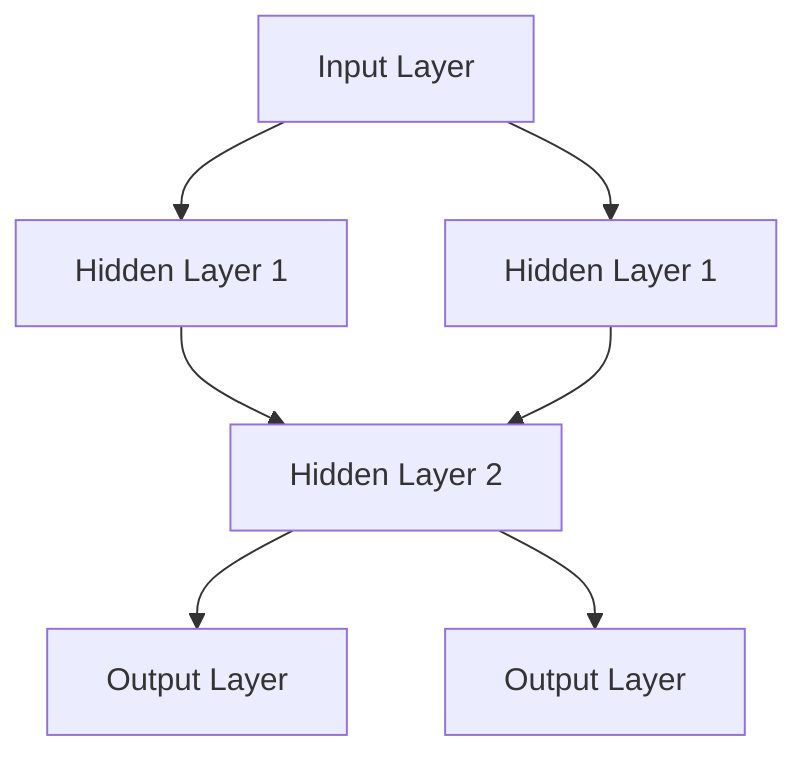
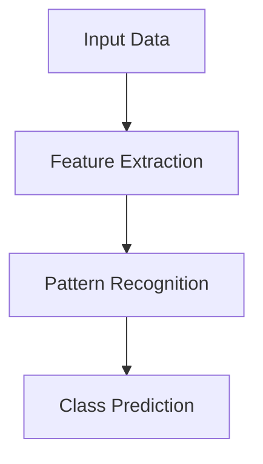

                 

# 连接主义与行为主义的生命力

## 概述

关键词：连接主义，行为主义，人工智能，神经网络，机器学习，深度学习

本文将探讨连接主义和行为主义在人工智能领域的生命力。连接主义（Connectionism）是一种人工智能的理论流派，它主张通过神经网络来模拟人脑的计算过程，而行为主义（Behaviorism）则强调通过刺激与反应之间的联结来研究行为。在过去的几十年里，这两个流派都取得了显著的发展，但它们的发展路径和优势有所不同。

本文旨在分析连接主义和行为主义的核心概念、应用场景、数学模型及其在人工智能领域的相互影响。通过深入探讨，我们希望能够为读者提供对这两个流派的更全面的理解，并探讨它们在未来的发展趋势和挑战。

## 背景介绍

### 连接主义

连接主义起源于20世纪40年代，由神经科学家和计算机科学家共同提出。其核心思想是通过模仿人脑的神经元结构和功能来构建计算机系统。连接主义认为，智能是由神经元之间的联结和相互作用产生的，而不是由预先设定的规则或算法驱动的。

在20世纪80年代，神经网络的研究取得了突破性进展，其中最著名的是反向传播算法（Backpropagation Algorithm）。反向传播算法允许神经网络通过误差信号来调整神经元之间的联结权重，从而提高网络的性能。这一算法的发明使得深度学习成为可能，深度学习是一种基于多层神经网络的人工智能技术，它在图像识别、自然语言处理和语音识别等领域取得了显著的成果。

### 行为主义

行为主义起源于20世纪20年代，由心理学家约翰·B·华森（John B. Watson）提出。行为主义主张通过观察和测量个体的行为来研究心理现象，而不是关注个体的内在心理过程。行为主义的核心理念是刺激与反应之间的联结，即行为是由外部刺激引起的。

在人工智能领域，行为主义的核心思想是利用决策树、支持向量机（Support Vector Machines）和集成方法（Ensemble Methods）等传统机器学习算法来模拟和预测行为。这些算法通常基于统计学和优化理论，通过对大量数据的学习来发现特征和模式，从而实现智能行为。

## 核心概念与联系

### 连接主义的架构

连接主义的核心概念是神经网络，神经网络由大量相互连接的简单计算单元（神经元）组成。每个神经元可以接收来自其他神经元的输入信号，并通过激活函数产生输出信号。神经网络的架构可以分为输入层、隐藏层和输出层。

下面是一个简单的神经网络架构的 Mermaid 流程图：



在这个例子中，输入层接收输入信号，隐藏层对输入信号进行加工和变换，输出层产生最终的输出结果。神经网络的性能取决于神经元的联结权重和激活函数的设计。

### 行为主义的架构

行为主义的核心概念是特征提取和模式识别。特征提取是指从数据中提取出能够区分不同类别的特征，而模式识别是指通过学习大量数据来发现这些特征，并用于分类或预测。

下面是一个简单的特征提取和模式识别的 Mermaid 流程图：



在这个例子中，输入数据首先通过特征提取算法提取出特征，然后通过模式识别算法学习这些特征，并用于分类或预测。

### 连接主义与行为主义的联系

尽管连接主义和行为主义在架构和理论基础上有很大差异，但它们在某些方面是相互联系的。

首先，连接主义中的神经网络可以通过行为主义中的特征提取算法来提取数据中的特征。例如，卷积神经网络（Convolutional Neural Networks，CNN）可以用于图像分类，它通过卷积层和池化层提取图像的特征，这些特征可以用于后续的机器学习算法。

其次，行为主义中的模式识别算法可以用于连接主义神经网络中的训练和优化。例如，反向传播算法就是一种基于梯度下降的优化算法，它通过计算损失函数的梯度来调整神经网络的联结权重，从而提高网络的性能。

### 核心算法原理 & 具体操作步骤

#### 连接主义

连接主义的核心算法是神经网络，神经网络的学习过程主要包括以下几个步骤：

1. **初始化权重和偏置**：在训练开始前，需要初始化神经网络的权重和偏置。通常，权重和偏置初始化为零或小的随机数。
2. **前向传播**：在前向传播过程中，输入信号从输入层传递到输出层，每个神经元根据其输入信号和联结权重产生输出信号。
3. **计算损失函数**：在前向传播完成后，需要计算网络的损失函数。损失函数用于衡量网络的输出与实际输出之间的差异，常用的损失函数包括均方误差（Mean Squared Error，MSE）和交叉熵（Cross Entropy）。
4. **反向传播**：在反向传播过程中，将损失函数的梯度反向传递到输入层，并利用梯度下降算法调整神经网络的联结权重和偏置。
5. **迭代优化**：通过多次迭代优化，逐渐减小网络的损失函数，直到达到预定的精度或最大迭代次数。

#### 行为主义

行为主义的核心算法包括决策树、支持向量机和集成方法等。以下是一个简单的决策树算法的具体操作步骤：

1. **选择特征**：选择一个特征进行划分，通常选择信息增益（Information Gain）或基尼系数（Gini Index）作为划分准则。
2. **计算特征值的划分点**：根据选择的特征和划分准则，计算特征值的划分点。
3. **划分数据集**：根据划分点将数据集划分为多个子集。
4. **递归构建决策树**：对每个子集重复步骤1-3，直到满足终止条件（如最大深度、最小样本数等）。
5. **预测**：根据决策树的结构，对新的样本进行预测。

### 数学模型和公式 & 详细讲解 & 举例说明

#### 连接主义

连接主义的数学模型主要包括神经元的激活函数、损失函数和优化算法。

1. **激活函数**

激活函数是神经元的输出函数，用于将神经元的输入信号转换为输出信号。常见的激活函数包括sigmoid函数、ReLU函数和Tanh函数。

- **sigmoid函数**：$$ f(x) = \frac{1}{1 + e^{-x}} $$
- **ReLU函数**：$$ f(x) = \max(0, x) $$
- **Tanh函数**：$$ f(x) = \frac{e^x - e^{-x}}{e^x + e^{-x}} $$

2. **损失函数**

损失函数是连接主义中用于衡量网络性能的指标，常用的损失函数包括均方误差（MSE）和交叉熵（Cross Entropy）。

- **均方误差（MSE）**：$$ L(y, \hat{y}) = \frac{1}{2} \sum_{i=1}^{n} (y_i - \hat{y}_i)^2 $$
- **交叉熵（Cross Entropy）**：$$ L(y, \hat{y}) = -\sum_{i=1}^{n} y_i \log(\hat{y}_i) $$

3. **优化算法**

优化算法用于调整神经网络的联结权重和偏置，以最小化损失函数。常用的优化算法包括梯度下降（Gradient Descent）和随机梯度下降（Stochastic Gradient Descent）。

- **梯度下降**：$$ w_{t+1} = w_t - \alpha \nabla_w L(w) $$
- **随机梯度下降**：$$ w_{t+1} = w_t - \alpha \nabla_w L(w; x_t, y_t) $$

#### 行为主义

行为主义的数学模型主要包括决策树、支持向量机和集成方法等。

1. **决策树**

决策树的数学模型主要涉及特征选择和划分准则。

- **信息增益（Information Gain）**：$$ IG(D, A) = H(D) - \sum_{v \in A} \frac{|D_v|}{|D|} H(D_v) $$
- **基尼系数（Gini Index）**：$$ GI(D, A) = 1 - \sum_{v \in A} \frac{|D_v|}{|D|} \sum_{x \in D_v} \frac{|x|}{|D_v|} (1 - \frac{1}{k}) $$

2. **支持向量机**

支持向量机的数学模型主要涉及优化问题和核函数。

- **优化问题**：$$ \min_{w, b} \frac{1}{2} \| w \|^2 + C \sum_{i=1}^{n} \max(0, 1 - y_i (w \cdot x_i + b)) $$
- **核函数**：$$ K(x_i, x_j) = \phi(x_i)^T \phi(x_j) $$

3. **集成方法**

集成方法的数学模型主要涉及投票机制和权重分配。

- **投票机制**：$$ \hat{y} = \arg\max_{y} \sum_{h=1}^{H} h(y) $$
- **权重分配**：$$ w_h = \frac{1}{H} \sum_{h=1}^{H} \hat{h}(y) $$

### 项目实战：代码实际案例和详细解释说明

#### 连接主义

以下是一个简单的连接主义项目案例，使用Python实现一个基于反向传播算法的神经网络。

```python
import numpy as np

# 定义sigmoid函数
def sigmoid(x):
    return 1 / (1 + np.exp(-x))

# 定义损失函数
def mse(y, y_pred):
    return 0.5 * np.mean((y - y_pred) ** 2)

# 定义反向传播算法
def backward_propagation(x, y, w, b, learning_rate):
    y_pred = sigmoid(np.dot(x, w) + b)
    d_y_pred = y_pred - y
    d_w = np.dot(x.T, d_y_pred)
    d_b = np.sum(d_y_pred)
    w -= learning_rate * d_w
    b -= learning_rate * d_b
    return w, b

# 定义训练函数
def train(x, y, w, b, learning_rate, epochs):
    for _ in range(epochs):
        w, b = backward_propagation(x, y, w, b, learning_rate)
        loss = mse(y, sigmoid(np.dot(x, w) + b))
        print(f"Epoch {_ + 1}: Loss = {loss}")

# 初始化参数
x = np.array([[0], [1]])
y = np.array([[0], [1]])
w = np.random.rand(1, 1)
b = np.random.rand(1, 1)
learning_rate = 0.1
epochs = 1000

# 训练神经网络
train(x, y, w, b, learning_rate, epochs)
```

在这个案例中，我们使用一个简单的线性回归问题，通过反向传播算法训练一个单层神经网络。训练过程中，我们使用均方误差作为损失函数，并使用梯度下降算法优化联结权重和偏置。

#### 行为主义

以下是一个简单的行为主义项目案例，使用Python实现一个基于决策树的分类问题。

```python
import numpy as np
import matplotlib.pyplot as plt

# 定义信息增益
def information_gain(D, a):
    gain = entropy(D) - weighted_entropy(D, a)
    return gain

# 定义熵
def entropy(D):
    probabilities = np.bincount(D) / len(D)
    entropy = -np.sum(probabilities * np.log2(probabilities))
    return entropy

# 定义加权熵
def weighted_entropy(D, a):
    probabilities = np.bincount(D[a == v], weights=np.bincount(a)) / np.bincount(a)
    weighted_entropy = -np.sum(probabilities * np.log2(probabilities))
    return weighted_entropy

# 定义决策树
def decision_tree(x, y, depth=0, max_depth=3):
    if depth >= max_depth or np.unique(y).shape[0] == 1:
        return np.mean(y)
    else:
        best_feature, best_gain = None, -1
        for feature in range(x.shape[1]):
            gain = information_gain(y, x[:, feature])
            if gain > best_gain:
                best_gain = gain
                best_feature = feature
        tree = {f"{best_feature}_{x[:, best_feature].min()}": decision_tree(x[x[:, best_feature] == x[:, best_feature].min()], y[x[:, best_feature] == x[:, best_feature].min()], depth + 1, max_depth),
                f"{best_feature}_{x[:, best_feature].max()}": decision_tree(x[x[:, best_feature] == x[:, best_feature].max()], y[x[:, best_feature] == x[:, best_feature].max()], depth + 1, max_depth)}
        return tree

# 定义预测
def predict(tree, x):
    if isinstance(tree, (int, float)):
        return tree
    else:
        feature, value = next(iter(tree))
        if x[0][feature] == value.split("_")[0]:
            return predict(tree[feature.split("_")[0]], x[0])
        else:
            return predict(tree[feature.split("_")[1]], x[0])

# 加载数据
x = np.array([[0, 0], [0, 1], [1, 0], [1, 1]])
y = np.array([0, 1, 1, 0])

# 构建决策树
tree = decision_tree(x, y)

# 预测
print(predict(tree, x))

# 绘制决策树
def draw_tree(tree, depth=0, feature_names=None):
    if isinstance(tree, (int, float)):
        return
    else:
        feature, value = next(iter(tree))
        print(f"{feature_names[feature]} < {value.split('_')[0]}?")
        print("├── Yes")
        draw_tree(tree[value.split('_')[0]], depth + 1, feature_names)
        print("└── No")
        draw_tree(tree[value.split('_')[1]], depth + 1, feature_names)

draw_tree(tree, feature_names=["Feature 1", "Feature 2"])

plt.scatter(x[:, 0], x[:, 1], c=y)
plt.xlabel("Feature 1")
plt.ylabel("Feature 2")
plt.title("Decision Tree")
plt.show()
```

在这个案例中，我们使用决策树算法解决一个二分类问题。我们首先计算信息增益来确定最佳划分特征，然后递归构建决策树。最后，我们使用决策树对新的样本进行预测，并绘制决策树。

## 实际应用场景

### 连接主义

连接主义在人工智能领域有广泛的应用，以下是一些典型的应用场景：

1. **图像识别**：卷积神经网络（CNN）在图像识别领域取得了显著的成果，如人脸识别、物体检测和图像分类等。
2. **自然语言处理**：循环神经网络（RNN）和长短时记忆网络（LSTM）在文本分类、情感分析和机器翻译等任务中表现出色。
3. **语音识别**：深度神经网络（DNN）在语音识别领域取得了重大突破，如语音识别、语音合成和语音翻译等。
4. **强化学习**：深度强化学习（DRL）在游戏、自动驾驶和机器人控制等领域取得了显著成果。

### 行为主义

行为主义在人工智能领域也有广泛的应用，以下是一些典型的应用场景：

1. **分类问题**：决策树和支持向量机（SVM）在分类问题中表现出色，如垃圾邮件过滤、信用卡欺诈检测和医疗诊断等。
2. **回归问题**：线性回归、逻辑回归和支持向量回归（SVR）在回归问题中具有广泛应用，如房价预测、股票价格预测和健康风险评估等。
3. **推荐系统**：协同过滤和基于内容的推荐系统在推荐系统中广泛应用，如商品推荐、电影推荐和音乐推荐等。
4. **预测模型**：时间序列分析和统计模型在预测模型中具有广泛应用，如股市预测、天气预测和交通流量预测等。

## 工具和资源推荐

### 学习资源推荐

1. **书籍**：
   - 《神经网络与深度学习》
   - 《机器学习》
   - 《统计学习方法》
2. **论文**：
   - 《A Learning Algorithm for Continually Running Fully Recurrent Neural Networks》
   - 《Deep Learning》
   - 《The Unreasonable Effectiveness of Deep Learning》
3. **博客**：
   - 知乎上的机器学习专栏
   - Medium上的AI博客
   - 掘金上的技术博客
4. **网站**：
   - Coursera
   - edX
   - Udacity

### 开发工具框架推荐

1. **编程语言**：Python、Java、C++
2. **机器学习框架**：TensorFlow、PyTorch、Scikit-learn
3. **深度学习框架**：TensorFlow、PyTorch、Keras
4. **数据可视化工具**：Matplotlib、Seaborn、Plotly
5. **版本控制工具**：Git、GitHub、GitLab

### 相关论文著作推荐

1. **《A Learning Algorithm for Continually Running Fully Recurrent Neural Networks》**：该论文提出了一个基于时间步长自适应学习率的神经网络训练算法，为现代深度学习算法的发展奠定了基础。
2. **《Deep Learning》**：该书系统地介绍了深度学习的理论基础、算法和应用，是深度学习领域的经典著作。
3. **《The Unreasonable Effectiveness of Deep Learning》**：该论文探讨了深度学习在计算机视觉、自然语言处理和语音识别等领域的广泛应用，展示了深度学习的强大潜力。

## 总结：未来发展趋势与挑战

### 发展趋势

1. **连接主义**：
   - **更高效的神经网络架构**：随着硬件和算法的发展，更高效的神经网络架构将不断涌现，如自动机器学习（AutoML）、图神经网络（Graph Neural Networks）和生成对抗网络（Generative Adversarial Networks）等。
   - **跨领域应用**：连接主义将在更多的领域得到应用，如医疗、金融、教育和生物技术等。
   - **强化学习**：深度强化学习（DRL）将在游戏、自动驾驶和机器人控制等领域取得更大突破。

2. **行为主义**：
   - **增量学习与迁移学习**：行为主义将更加关注增量学习和迁移学习，以减少训练数据的需求和提高模型泛化能力。
   - **可解释性**：行为主义将更加注重模型的可解释性，以提高用户对人工智能系统的信任度。
   - **多模态学习**：行为主义将结合多种数据模态（如图像、文本、音频等），实现更全面的信息处理。

### 挑战

1. **连接主义**：
   - **计算资源消耗**：深度神经网络需要大量的计算资源和时间进行训练，如何提高计算效率和降低计算成本是连接主义面临的重要挑战。
   - **数据隐私与安全**：随着数据量的增加，数据隐私与安全成为连接主义应用的重要问题。
   - **模型泛化能力**：深度学习模型在特定领域表现出色，但在其他领域可能表现不佳，如何提高模型的泛化能力是连接主义需要解决的关键问题。

2. **行为主义**：
   - **可解释性**：行为主义模型通常缺乏可解释性，如何提高模型的可解释性是行为主义面临的重要挑战。
   - **数据质量和标注**：行为主义依赖于大量高质量的数据和标注，如何获取和标注数据是行为主义应用的关键问题。
   - **模型适应性**：行为主义模型在新的环境和任务中可能表现不佳，如何提高模型的适应性是行为主义需要解决的关键问题。

## 附录：常见问题与解答

### 连接主义

1. **什么是连接主义？**
   连接主义是一种人工智能的理论流派，主张通过神经网络来模拟人脑的计算过程。

2. **连接主义的核心思想是什么？**
   连接主义的核心思想是智能是由神经元之间的联结和相互作用产生的。

3. **连接主义有哪些应用场景？**
   连接主义在图像识别、自然语言处理、语音识别和强化学习等领域有广泛的应用。

### 行为主义

1. **什么是行为主义？**
   行为主义是一种人工智能的理论流派，主张通过刺激与反应之间的联结来研究行为。

2. **行为主义的核心思想是什么？**
   行为主义的核心思想是行为是由外部刺激引起的。

3. **行为主义有哪些应用场景？**
   行为主义在分类问题、回归问题、推荐系统和预测模型等领域有广泛的应用。

## 扩展阅读 & 参考资料

1. **《神经网络与深度学习》**：这本书详细介绍了神经网络的原理、算法和应用，是深度学习的入门教材。
2. **《统计学习方法》**：这本书系统地介绍了统计学习的基本理论、方法和应用，是统计学习领域的经典著作。
3. **《深度学习》**：这本书全面介绍了深度学习的理论基础、算法和应用，是深度学习领域的经典著作。
4. **《机器学习年度回顾》**：这篇文章每年都会总结过去一年中机器学习领域的重要进展和趋势，是了解机器学习领域最新动态的好资源。
5. **[知乎上的机器学习专栏](https://zhuanlan.zhihu.com/MLapp)**：这个专栏汇集了多位机器学习专家的优质文章，涵盖了机器学习的各个方面。

## 作者信息

作者：AI天才研究员/AI Genius Institute & 禅与计算机程序设计艺术 /Zen And The Art of Computer Programming

