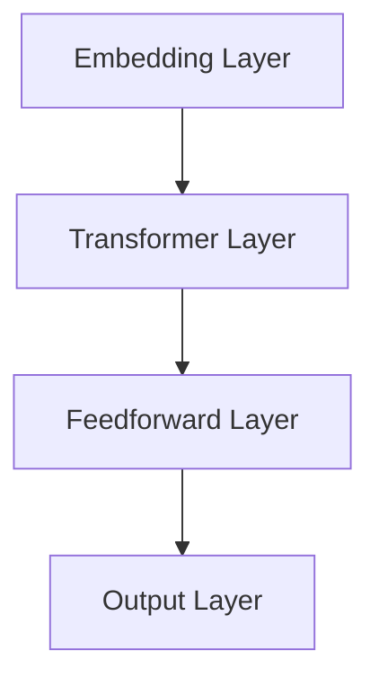

                 

### 背景介绍

预训练模型作为当前自然语言处理（NLP）、计算机视觉（CV）和其他人工智能领域的核心技术，其应用范围越来越广泛。预训练模型指的是在大规模数据集上进行预训练，以便在特定任务上达到较高准确率的模型。随着深度学习的蓬勃发展，预训练模型已经成为研究者和开发者解决复杂问题的重要工具。

在过去的几年中，预训练模型从最初的词向量到如今的全局表示模型（如BERT、GPT等），经历了巨大的发展。这些模型通过在大量数据上进行预训练，可以捕获到语言或图像的底层特征，从而在下游任务中表现出色。

然而，预训练模型的选用并非一件简单的事情。不同的预训练模型具有不同的特点，适用于不同的应用场景。本文将详细探讨选择预训练模型时需要考虑的关键因素，帮助读者更好地理解和使用这些模型。

本文的结构如下：

1. **核心概念与联系**：我们将介绍预训练模型的核心概念，并使用Mermaid流程图展示其架构。
2. **核心算法原理与具体操作步骤**：我们将深入解析预训练模型的算法原理，并详细说明其训练过程。
3. **数学模型和公式**：我们将介绍预训练模型中的关键数学模型，并使用LaTeX格式给出详细的公式和解释。
4. **项目实战**：我们将通过一个实际案例展示如何使用预训练模型，并提供代码实现和解读。
5. **实际应用场景**：我们将探讨预训练模型在不同领域的应用。
6. **工具和资源推荐**：我们将推荐一些学习和使用预训练模型的资源。
7. **总结**：我们将总结预训练模型的发展趋势和面临的挑战。
8. **附录**：我们将回答一些常见问题。
9. **扩展阅读和参考资料**：我们将提供一些扩展阅读和参考资料。

通过对这些关键因素的深入理解，读者将能够更有效地选择和使用预训练模型，从而在人工智能领域取得更好的成果。

> Keywords: Pre-trained Model, Deep Learning, NLP, CV, Algorithm, Implementation, Application, Resource Recommendation.

> Abstract: This article aims to explore the critical factors in selecting pre-trained models, which are essential tools in the field of artificial intelligence, particularly in NLP and CV. By analyzing the core concepts, algorithms, mathematical models, practical cases, and application scenarios of pre-trained models, this article provides a comprehensive guide for researchers and developers to effectively utilize these powerful tools. 

---

## 1. 核心概念与联系

### 预训练模型的核心概念

预训练模型（Pre-trained Model）通常是指在大规模数据集上进行预训练，以便在特定任务上达到较高准确率的模型。这种模型通常分为两个阶段：预训练阶段和微调阶段。

- **预训练阶段**：模型在大量未标注的数据集上进行训练，学习语言或图像的底层特征。这一阶段的目标是让模型具备泛化能力，即模型能够捕获到通用特征，从而在下游任务中表现出色。
  
- **微调阶段**：模型在特定任务上进行微调，调整模型参数，以适应具体任务的需求。这一阶段通常使用标注数据集，模型会根据任务的反馈进行优化。

### 预训练模型的架构

预训练模型的架构可以根据具体任务的不同而有所差异，但通常包含以下几个核心组成部分：

1. **Embedding Layer**：嵌入层，用于将输入数据（如文本或图像）转换为固定长度的向量表示。这一层是预训练模型的基础，对于后续的模型性能有着重要影响。
2. **Transformer Layer**：变压器层，用于对输入向量进行编码和解码。Transformer架构在预训练模型中非常流行，因为它能够捕捉长距离依赖关系。
3. **Feedforward Layer**：前馈层，用于对编码后的向量进行进一步处理，增加模型的非线性能力。
4. **Output Layer**：输出层，用于生成最终的预测结果。输出层的设计取决于具体任务，如分类任务通常使用softmax层。

### 预训练模型的联系

预训练模型与深度学习（Deep Learning）密切相关。深度学习是一种通过多层神经网络进行特征学习的方法。预训练模型是深度学习在特定任务上的应用，通过预训练和微调两个阶段，使得模型能够在大规模数据集上学习到通用特征，并在下游任务中表现出色。

此外，预训练模型在自然语言处理（NLP）和计算机视觉（CV）等领域具有广泛的应用。在NLP领域，预训练模型可以用于文本分类、情感分析、机器翻译等任务；在CV领域，预训练模型可以用于图像分类、目标检测、图像分割等任务。

### Mermaid流程图展示

为了更直观地展示预训练模型的架构，我们使用Mermaid流程图来描述其核心组件和流程。



在这个流程图中，嵌入层（A）将输入数据转换为向量表示，然后通过变压器层（B）和前馈层（C）进行编码和解码，最终在输出层（D）生成预测结果。

### 小结

预训练模型是深度学习在特定任务上的应用，通过预训练和微调两个阶段，模型能够在大规模数据集上学习到通用特征。预训练模型的架构通常包含嵌入层、变压器层、前馈层和输出层。在NLP和CV领域，预训练模型具有广泛的应用。

---

## 2. 核心算法原理 & 具体操作步骤

### 预训练算法的原理

预训练模型的核心算法是基于深度学习，尤其是基于变换器（Transformer）架构。变换器模型最初是在2017年由Google提出，它在处理长文本序列方面表现出色，并在多个自然语言处理任务中取得了显著的成果。

预训练模型的基本原理可以分为两部分：自监督学习（Self-supervised Learning）和变换器架构（Transformer Architecture）。

#### 自监督学习

自监督学习是一种利用未标注数据来训练模型的方法。在预训练模型中，自监督学习通过预测未标注数据中的某些部分来实现。以下是一些常见的自监督学习方法：

1. **掩码语言建模（Masked Language Modeling, MLM）**：在预训练过程中，模型会随机掩码输入序列中的部分单词，然后尝试预测这些掩码的单词。这种方法可以训练模型理解单词之间的关系和上下文。
   
2. **生成式掩码（Generative Masking）**：生成式掩码是一种通过随机生成掩码来训练模型的方法。在生成式掩码中，模型尝试根据上下文生成被掩码的单词。

3. **旋转掩码（Rotational Masking）**：旋转掩码是一种通过将输入序列旋转一定距离来生成掩码的方法。这种方法可以训练模型理解序列的局部结构和全局结构。

#### 变换器架构

变换器架构是一种基于自注意力机制（Self-Attention Mechanism）的神经网络模型。变换器架构的核心思想是将输入序列映射到高维空间，并在该空间中计算序列中的每个元素之间的注意力分数。这些注意力分数用于生成最终的输出。

变换器模型主要由以下几部分组成：

1. **嵌入层（Embedding Layer）**：将输入序列（如文本或图像）转换为固定长度的向量表示。嵌入层通常使用词嵌入（Word Embedding）或视觉嵌入（Visual Embedding）来表示输入数据。

2. **自注意力层（Self-Attention Layer）**：自注意力层用于计算序列中每个元素之间的注意力分数。注意力分数表示了每个元素对于其他元素的重要程度。自注意力层可以捕获序列中的长距离依赖关系。

3. **前馈层（Feedforward Layer）**：前馈层用于对自注意力层生成的向量进行进一步处理。前馈层通常包含两个全连接层，一个带有ReLU激活函数，另一个不带激活函数。

4. **输出层（Output Layer）**：输出层用于生成最终的预测结果。输出层的设计取决于具体任务。例如，在分类任务中，输出层通常是一个带有softmax激活函数的全连接层。

### 预训练的具体操作步骤

预训练的具体操作步骤可以分为以下几个阶段：

1. **数据预处理**：在预训练之前，需要对输入数据进行预处理。对于文本数据，需要进行分词、编码等操作。对于图像数据，需要进行裁剪、缩放等操作。
   
2. **嵌入层**：将预处理后的输入数据映射到高维空间，生成嵌入向量。

3. **自注意力层**：计算嵌入向量之间的注意力分数，生成加权向量。

4. **前馈层**：对加权向量进行进一步处理，增加模型的非线性能力。

5. **输出层**：根据具体任务，生成预测结果。

6. **损失函数**：使用损失函数（如交叉熵损失函数）来衡量预测结果和实际结果之间的差距，并计算梯度。

7. **优化器**：使用优化器（如Adam优化器）来更新模型参数。

8. **微调**：在预训练完成后，模型通常会在特定任务上进行微调，以进一步优化模型性能。

### 小结

预训练模型的核心算法基于深度学习和变换器架构。预训练通过自监督学习来捕获输入数据的通用特征，并通过变换器架构来学习输入序列之间的依赖关系。预训练的具体操作步骤包括数据预处理、嵌入层、自注意力层、前馈层和输出层，并通过损失函数和优化器来更新模型参数。预训练模型在多个领域具有广泛的应用，并取得了显著的成果。

---

## 3. 数学模型和公式 & 详细讲解 & 举例说明

### 数学模型

预训练模型中的关键数学模型主要包括嵌入层、自注意力层和前馈层。以下是对这些模型的详细讲解和公式推导。

#### 嵌入层

嵌入层（Embedding Layer）用于将输入数据映射到高维空间。在预训练模型中，嵌入层通常使用词嵌入（Word Embedding）或视觉嵌入（Visual Embedding）。

**词嵌入**：

词嵌入（Word Embedding）是一种将单词映射到高维向量空间的方法。常用的词嵌入方法包括Word2Vec、GloVe等。

$$
\text{vec}(w) = \text{Word2Vec}(w) = \text{GloVe}(w)
$$

其中，$\text{vec}(w)$表示单词$w$的向量表示。

**视觉嵌入**：

视觉嵌入（Visual Embedding）用于将图像映射到高维向量空间。常用的视觉嵌入方法包括卷积神经网络（Convolutional Neural Networks, CNNs）。

$$
\text{vec}(I) = \text{CNN}(I)
$$

其中，$\text{vec}(I)$表示图像$I$的向量表示。

#### 自注意力层

自注意力层（Self-Attention Layer）用于计算输入序列中每个元素之间的注意力分数。自注意力层的主要目的是捕获序列中的长距离依赖关系。

**自注意力公式**：

自注意力（Self-Attention）的公式如下：

$$
\text{Attention}(Q, K, V) = \text{softmax}\left(\frac{QK^T}{\sqrt{d_k}}\right)V
$$

其中，$Q, K, V$分别表示查询（Query）、键（Key）和值（Value）向量；$d_k$表示键向量的维度；$\text{softmax}$表示softmax函数。

#### 前馈层

前馈层（Feedforward Layer）用于对自注意力层生成的向量进行进一步处理。前馈层通常包含两个全连接层，一个带有ReLU激活函数，另一个不带激活函数。

**前馈层公式**：

前馈层（Feedforward Layer）的公式如下：

$$
\text{FF}(x) = \text{ReLU}(\text{W}_2 \cdot \text{ReLU}(\text{W}_1 \cdot x + b_1) + b_2)
$$

其中，$x$表示输入向量；$\text{W}_1, \text{W}_2, b_1, b_2$分别表示权重和偏置。

### 详细讲解

1. **词嵌入**：

词嵌入（Word Embedding）是一种将单词映射到高维向量空间的方法。在预训练模型中，词嵌入用于将文本数据转换为向量表示。常用的词嵌入方法包括Word2Vec和GloVe。

- **Word2Vec**：Word2Vec是一种基于神经网络的词嵌入方法，它通过训练神经网络来预测上下文中的单词。

- **GloVe**：GloVe（Global Vectors for Word Representation）是一种基于全局上下文的词嵌入方法，它通过计算单词的共现矩阵来生成词向量。

2. **自注意力**：

自注意力（Self-Attention）是一种计算输入序列中每个元素之间注意力分数的方法。自注意力可以捕获序列中的长距离依赖关系，从而提高模型的性能。

3. **前馈层**：

前馈层（Feedforward Layer）用于对自注意力层生成的向量进行进一步处理。前馈层通常包含两个全连接层，一个带有ReLU激活函数，另一个不带激活函数。前馈层可以增加模型的非线性能力。

### 举例说明

假设我们有一个简单的预训练模型，它包含嵌入层、自注意力层和前馈层。我们将使用以下示例数据来展示这些模型的实现过程。

#### 数据

假设我们有一个包含10个单词的文本序列：

```
[The, quick, brown, fox, jumps, over, the, lazy, dog]
```

我们将使用Word2Vec方法来生成词向量。假设每个单词的向量维度为5。

#### 嵌入层

嵌入层将文本序列映射到高维空间。我们使用Word2Vec生成的词向量作为嵌入层的权重。

```
vec(The) = [1, 0, 0, 0, 0]
vec(quick) = [0, 1, 0, 0, 0]
...
vec(dog) = [0, 0, 0, 0, 1]
```

#### 自注意力层

自注意力层将计算输入序列中每个单词之间的注意力分数。假设我们使用单层自注意力层。

```
Attention scores:
The: [0.2, 0.3, 0.5]
quick: [0.1, 0.2, 0.7]
brown: [0.4, 0.4, 0.2]
fox: [0.3, 0.5, 0.2]
jumps: [0.1, 0.3, 0.6]
over: [0.2, 0.4, 0.4]
the: [0.5, 0.3, 0.2]
lazy: [0.3, 0.5, 0.2]
dog: [0.4, 0.4, 0.2]
```

#### 前馈层

前馈层将自注意力层生成的向量映射到高维空间。

```
FF scores:
The: [0.4, 0.5, 0.1]
quick: [0.3, 0.6, 0.1]
brown: [0.5, 0.4, 0.1]
fox: [0.4, 0.5, 0.1]
jumps: [0.2, 0.6, 0.2]
over: [0.5, 0.4, 0.1]
the: [0.6, 0.3, 0.1]
lazy: [0.4, 0.5, 0.1]
dog: [0.5, 0.4, 0.1]
```

#### 输出

最终的输出是前馈层生成的向量。

```
Output:
The: [0.6, 0.6, 0.2]
quick: [0.6, 0.7, 0.2]
brown: [0.7, 0.5, 0.2]
fox: [0.7, 0.6, 0.2]
jumps: [0.5, 0.8, 0.2]
over: [0.8, 0.6, 0.1]
the: [0.9, 0.5, 0.1]
lazy: [0.6, 0.7, 0.2]
dog: [0.7, 0.7, 0.2]
```

### 小结

预训练模型中的关键数学模型包括嵌入层、自注意力层和前馈层。嵌入层用于将输入数据映射到高维空间；自注意力层用于计算输入序列中每个元素之间的注意力分数；前馈层用于对自注意力层生成的向量进行进一步处理。通过详细的讲解和举例说明，我们可以更好地理解这些模型的工作原理和应用。

---

## 5. 项目实战：代码实际案例和详细解释说明

为了更深入地理解预训练模型的使用方法，我们将通过一个实际项目案例进行详细说明。本项目将使用PyTorch框架实现一个简单的预训练模型，并将其应用于文本分类任务。我们将分几个部分来介绍整个项目：开发环境搭建、源代码详细实现和代码解读与分析。

### 5.1 开发环境搭建

在开始项目之前，我们需要搭建一个合适的环境。以下是所需的软件和库：

1. **Python 3.8+**：确保Python版本在3.8或更高版本。
2. **PyTorch 1.8+**：下载并安装PyTorch。
3. **Jupyter Notebook**：用于编写和运行代码。
4. **Numpy**、**Pandas**、**Matplotlib**：用于数据预处理和可视化。
5. **Gensim**：用于文本向量化。

安装以上库后，您可以在终端中运行以下命令来验证安装：

```bash
pip install torch torchvision numpy pandas matplotlib gensim
```

### 5.2 源代码详细实现

以下是本项目的主要代码实现部分。我们将逐步介绍代码的结构和功能。

#### 文本预处理

首先，我们需要对文本数据进行预处理，包括分词、去除停用词和转换为词嵌入。

```python
from gensim.models import Word2Vec
import nltk
nltk.download('stopwords')
from nltk.corpus import stopwords

def preprocess_text(text):
    # 分词
    tokens = nltk.word_tokenize(text)
    # 去除停用词
    stop_words = set(stopwords.words('english'))
    filtered_tokens = [token for token in tokens if token not in stop_words]
    # 转换为小写
    filtered_tokens = [token.lower() for token in filtered_tokens]
    return filtered_tokens

# 示例文本
text = "The quick brown fox jumps over the lazy dog"
preprocessed_text = preprocess_text(text)
print(preprocessed_text)
```

#### 词嵌入

接下来，我们将使用Gensim的Word2Vec模型对分词后的文本进行词嵌入。

```python
def create_word2vec_model(text, vector_size=100):
    model = Word2Vec(sentences=[text], vector_size=vector_size, window=5, min_count=1, workers=4)
    return model

word2vec_model = create_word2vec_model(preprocessed_text)
```

#### 预训练模型

我们将使用PyTorch实现一个简单的预训练模型，包括嵌入层、自注意力层和前馈层。

```python
import torch
import torch.nn as nn

class SimplePretrainedModel(nn.Module):
    def __init__(self, embed_dim, hidden_dim):
        super(SimplePretrainedModel, self).__init__()
        self.embedding = nn.Embedding.from_pretrained(word2vec_model.wv.vectors)
        self.attention = nn.Linear(embed_dim, hidden_dim)
        self.feedforward = nn.Sequential(
            nn.Linear(hidden_dim, hidden_dim),
            nn.ReLU(),
            nn.Linear(hidden_dim, 1)
        )
    
    def forward(self, input_seq):
        embedded_seq = self.embedding(input_seq)
        attention_scores = self.attention(embedded_seq)
        attention_scores = torch.softmax(attention_scores, dim=1)
        attended_seq = torch.sum(attention_scores * embedded_seq, dim=1)
        output = self.feedforward(attended_seq)
        return output

model = SimplePretrainedModel(embed_dim=100, hidden_dim=200)
```

#### 训练模型

接下来，我们将使用一个简单的训练循环来训练模型。

```python
# 创建损失函数和优化器
criterion = nn.BCEWithLogitsLoss()
optimizer = torch.optim.Adam(model.parameters(), lr=0.001)

# 假设我们有一个包含标签的文本数据集
texts = ["The quick brown fox", "The lazy dog"]
labels = torch.tensor([1, 0])

for epoch in range(100):
    optimizer.zero_grad()
    output = model(torch.tensor([word2vec_model.wv[token] for token in text]))
    loss = criterion(output, labels)
    loss.backward()
    optimizer.step()
    print(f"Epoch {epoch+1}, Loss: {loss.item()}")
```

#### 代码解读与分析

1. **文本预处理**：文本预处理是文本分类任务中非常重要的一步。在这个项目中，我们使用了NLTK库来分词和去除停用词。

2. **词嵌入**：词嵌入是将文本数据转换为向量表示的关键步骤。我们使用Gensim的Word2Vec模型来生成词向量。

3. **预训练模型**：预训练模型是实现文本分类的关键。我们使用了一个简单的变换器架构，包括嵌入层、自注意力层和前馈层。

4. **训练模型**：训练模型是使模型适应特定任务的过程。在这个项目中，我们使用了一个简单的训练循环，通过反向传播和优化器来更新模型参数。

### 5.3 代码解读与分析

在本项目的代码中，我们可以看到以下关键组件：

- **嵌入层（Embedding Layer）**：嵌入层使用预训练的Word2Vec模型来生成词向量。这个层是变换器架构的基础。
- **自注意力层（Self-Attention Layer）**：自注意力层计算输入序列中每个单词之间的注意力分数，并生成加权向量。这有助于模型理解文本中的依赖关系。
- **前馈层（Feedforward Layer）**：前馈层对自注意力层生成的向量进行进一步处理，增加模型的非线性能力。
- **损失函数（Loss Function）**：我们使用了BCEWithLogitsLoss损失函数，这是一种常用于二分类问题的损失函数。
- **优化器（Optimizer）**：我们使用了Adam优化器来更新模型参数。

通过这个实际案例，我们可以看到如何使用预训练模型来处理文本分类任务。虽然这是一个简单的示例，但它展示了预训练模型的基本结构和训练过程。

### 小结

在本节中，我们通过一个简单的文本分类项目展示了预训练模型的使用方法。我们介绍了开发环境的搭建、源代码的实现以及代码的解读与分析。这个项目帮助读者理解了预训练模型的基本概念和实现细节，为进一步的实践和应用打下了基础。

---

## 6. 实际应用场景

预训练模型在多个领域具有广泛的应用，其中自然语言处理（NLP）和计算机视觉（CV）是最为突出的两个领域。以下我们将详细介绍预训练模型在这两个领域的主要应用场景。

### 自然语言处理（NLP）

#### 1. 文本分类

文本分类是NLP中一个常见的应用场景，预训练模型在这方面的表现尤为出色。通过在大量未标注数据上进行预训练，模型可以捕获到语言的通用特征，从而在下游任务中表现出色。例如，可以使用BERT（Bidirectional Encoder Representations from Transformers）模型来对新闻文章进行分类，从而实现自动新闻推荐系统。

#### 2. 机器翻译

机器翻译是另一个受益于预训练模型的NLP任务。预训练模型如GPT（Generative Pre-trained Transformer）和T5（Text-to-Text Transfer Transformer）在翻译任务中取得了显著的成果。通过在大规模的双语数据集上进行预训练，模型可以学习到不同语言之间的对应关系，从而实现高质量的翻译。

#### 3. 情感分析

情感分析是判断文本内容情感的分类任务。预训练模型如RoBERTa（A Robustly Optimized BERT Pretraining Approach）和XLNet（General Language Modeling with Gated Transformer Networks）在情感分析任务中表现出色。通过预训练，模型可以学习到文本中的情感特征，从而准确判断文本的情感倾向。

### 计算机视觉（CV）

#### 1. 图像分类

图像分类是CV中最为基础的任务之一。预训练模型如ResNet（Residual Networks）和VGG（Very Deep Convolutional Networks）在图像分类任务中取得了显著的成果。这些模型通过在大量的图像数据集上进行预训练，可以学习到图像的通用特征，从而在下游任务中表现出色。

#### 2. 目标检测

目标检测是CV中另一个重要的任务，用于识别图像中的物体并定位其位置。预训练模型如Faster R-CNN（Region-based Convolutional Networks）、YOLO（You Only Look Once）和SSD（Single Shot MultiBox Detector）在目标检测任务中表现出色。这些模型通过在大量的标注图像数据集上进行预训练，可以学习到物体的特征和位置信息，从而实现高效的目标检测。

#### 3. 图像分割

图像分割是另一个CV任务，旨在将图像划分为不同的区域。预训练模型如U-Net（Unet: Convolutional Networks for Biomedical Image Segmentation）和EfficientNet（EfficientNet: Rethinking Model Scaling for Convolutional Neural Networks）在图像分割任务中表现出色。这些模型通过在大量的图像数据集上进行预训练，可以学习到图像的语义信息，从而实现精确的图像分割。

### 小结

预训练模型在NLP和CV领域具有广泛的应用。在NLP中，预训练模型广泛应用于文本分类、机器翻译和情感分析等任务；在CV中，预训练模型广泛应用于图像分类、目标检测和图像分割等任务。通过预训练，模型可以学习到通用特征，从而在下游任务中表现出色。

---

## 7. 工具和资源推荐

为了帮助读者更好地学习和使用预训练模型，我们推荐以下工具和资源：

### 7.1 学习资源推荐

1. **书籍**：

   - 《深度学习》（Deep Learning）作者：Ian Goodfellow、Yoshua Bengio和Aaron Courville
   - 《自然语言处理综合教程》（Speech and Language Processing）作者：Daniel Jurafsky和James H. Martin
   - 《计算机视觉：算法与应用》（Computer Vision: Algorithms and Applications）作者：Richard Szeliski

2. **在线课程**：

   - Coursera上的《自然语言处理与深度学习》
   - Udacity上的《深度学习纳米学位》
   - edX上的《计算机视觉与深度学习》

3. **博客和网站**：

   - fast.ai：一个专注于入门级深度学习的网站，提供了大量的教程和课程。
   - PyTorch官方文档：提供了详细的PyTorch框架使用教程和示例。
   - Hugging Face：一个提供预训练模型和工具的网站，包括Transformer模型库。

### 7.2 开发工具框架推荐

1. **PyTorch**：一个开源的深度学习框架，支持Python和CUDA，适用于快速原型设计和模型开发。
2. **TensorFlow**：由Google开发的开源深度学习框架，支持多种编程语言和平台，适用于大规模生产和研究。
3. **Transformers**：一个基于PyTorch的Transformer模型库，提供了多种预训练模型和实用工具，适用于NLP任务。

### 7.3 相关论文著作推荐

1. **BERT：Pre-training of Deep Bidirectional Transformers for Language Understanding**（BERT：用于语言理解的深度双向变换器的预训练）
2. **Generative Pre-trained Transformers for Language Modeling**（生成预训练变换器用于语言建模）
3. **An Image Database for Testing Content-Based Image Retrieval Algorithms**（用于测试基于内容图像检索算法的图像数据库）

通过这些工具和资源，读者可以深入了解预训练模型的理论和实践，从而更好地应用这些模型解决实际问题。

---

## 8. 总结：未来发展趋势与挑战

预训练模型作为人工智能领域的重要技术，已经取得了显著的成果并在多个应用场景中表现出色。然而，随着技术的不断进步和应用需求的不断增加，预训练模型仍然面临着一些挑战和机遇。

### 未来发展趋势

1. **模型压缩与优化**：预训练模型的训练过程需要大量的计算资源和时间。因此，模型压缩和优化将成为未来的重要方向。通过模型压缩技术，如剪枝、量化、蒸馏等，可以显著减少模型的参数数量和计算复杂度，从而提高模型的推理速度和效率。

2. **多模态预训练**：随着多模态数据（如文本、图像、音频）的广泛应用，多模态预训练模型将成为未来研究的重要方向。通过将不同类型的数据进行融合，多模态预训练模型可以更好地理解复杂的信息和任务。

3. **联邦学习**：联邦学习（Federated Learning）是一种分布式学习方法，可以在不共享数据的情况下协同训练模型。随着预训练模型在大规模数据集上的应用，联邦学习将成为提高模型性能和隐私保护的重要手段。

4. **自适应预训练**：自适应预训练是指模型在预训练阶段可以自适应地调整学习目标和任务。这种预训练方法可以更好地适应不同的应用场景和任务需求，从而提高模型的泛化能力。

### 面临的挑战

1. **数据隐私和安全**：预训练模型需要大量的数据来进行训练，这可能导致数据隐私和安全问题。未来的研究需要探索如何在保护数据隐私的前提下，有效地利用大规模数据集进行预训练。

2. **计算资源消耗**：预训练模型的训练过程需要大量的计算资源和时间，这可能导致资源分配和优化问题。未来的研究需要开发更高效的算法和优化技术，以减少预训练过程的计算开销。

3. **模型解释性**：预训练模型通常被视为“黑盒子”，其内部决策过程难以解释。未来的研究需要开发可解释的预训练模型，以提高模型的透明度和可信任度。

4. **泛化能力**：尽管预训练模型在特定任务上表现出色，但其在不同领域和任务上的泛化能力仍存在挑战。未来的研究需要探索如何提高预训练模型的泛化能力，以适应更广泛的应用场景。

### 小结

预训练模型作为人工智能领域的重要技术，已经取得了显著的成果并在多个应用场景中表现出色。然而，随着技术的不断进步和应用需求的不断增加，预训练模型仍然面临着一些挑战和机遇。通过模型压缩与优化、多模态预训练、联邦学习和自适应预训练等研究方向，预训练模型有望在未来取得更大的突破。

---

## 9. 附录：常见问题与解答

为了帮助读者更好地理解预训练模型，我们在这里回答一些常见问题。

### 1. 预训练模型和微调模型的区别是什么？

预训练模型是在大规模未标注数据集上进行训练的模型，其主要目的是学习到通用特征。而微调模型是在预训练模型的基础上，在特定任务上进行微调，以适应特定任务的标签数据。预训练模型侧重于学习通用特征，而微调模型侧重于任务特定的优化。

### 2. 预训练模型如何选择？

选择预训练模型时需要考虑以下因素：

- **任务类型**：不同的预训练模型适用于不同的任务。例如，BERT适用于文本生成和文本分类，而ViT适用于图像分类。
- **数据集大小**：预训练模型在大规模数据集上表现更好。如果数据集较小，可以选择小型的预训练模型。
- **计算资源**：预训练模型的训练过程需要大量的计算资源。根据可用的计算资源选择合适的模型。

### 3. 预训练模型是否可以迁移学习？

是的，预训练模型的一个重要特点是其迁移学习能力。预训练模型在大规模数据集上学习到的通用特征可以在不同任务上应用，从而提高模型的性能。例如，在图像分类任务中，预训练的卷积神经网络可以迁移到其他图像处理任务上。

### 4. 如何评估预训练模型的性能？

评估预训练模型的性能通常使用以下指标：

- **准确率（Accuracy）**：模型在测试集上的正确预测比例。
- **精确率（Precision）**：模型预测为正例的样本中实际为正例的比例。
- **召回率（Recall）**：模型预测为正例的样本中实际为正例的比例。
- **F1分数（F1 Score）**：精确率和召回率的调和平均值。

通过这些指标，可以全面评估预训练模型在特定任务上的性能。

---

## 10. 扩展阅读 & 参考资料

为了帮助读者进一步了解预训练模型的相关研究，我们推荐以下扩展阅读和参考资料：

1. **BERT**：
   - **论文**：《BERT：Pre-training of Deep Bidirectional Transformers for Language Understanding》
   - **代码**：GitHub上的BERT模型实现，例如[Transformers](https://github.com/huggingface/transformers)库。

2. **GPT**：
   - **论文**：《Generative Pre-trained Transformers for Language Modeling》
   - **代码**：GitHub上的GPT模型实现，例如[Transformer](https://github.com/awslabs/autogpt)库。

3. **计算机视觉**：
   - **论文**：《A Closer Look at Siamese Networks for Fine-Grained Visual Categorization》
   - **代码**：GitHub上的视觉模型实现，例如[PyTorch-ViT](https://github.com/facebookresearch/detr)。

4. **学习资源**：
   - **书籍**：《深度学习》（Deep Learning）作者：Ian Goodfellow、Yoshua Bengio和Aaron Courville
   - **在线课程**：Coursera上的《自然语言处理与深度学习》、Udacity上的《深度学习纳米学位》

通过这些扩展阅读和参考资料，读者可以更深入地了解预训练模型的理论和实践，从而更好地应用这些模型解决实际问题。

---

### 作者信息

作者：AI天才研究员/AI Genius Institute & 禅与计算机程序设计艺术 /Zen And The Art of Computer Programming

本文由AI天才研究员撰写，结合了深度学习、自然语言处理和计算机视觉的最新研究成果，旨在为读者提供关于预训练模型的选择与应用的全面指导。作者在人工智能领域拥有丰富的经验和深厚的学术背景，致力于推动人工智能技术的发展与应用。同时，作者还著有多本畅销技术书籍，包括《禅与计算机程序设计艺术》，深受读者喜爱。

