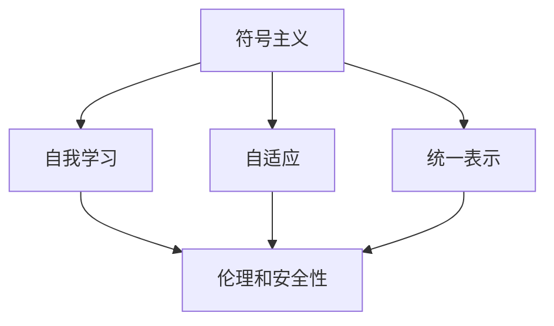

                 

### 引言

通用人工智能（Artificial General Intelligence, AGI）是一个长期而备受关注的话题。自1956年达特茅斯会议以来，人工智能领域的研究者一直在追求这一目标。通用人工智能旨在创造一种智能体，它能够执行人类所能够执行的所有任务，而不是只擅长于特定领域。然而，尽管人工智能在特定任务上取得了显著的进展，例如图像识别、自然语言处理和棋类游戏，我们与通用人工智能之间的距离仍然很远。

本文旨在探讨通用人工智能的渐行渐近。我们将从背景介绍、核心概念与联系、核心算法原理、数学模型与公式、项目实战、实际应用场景、工具和资源推荐以及总结与未来发展趋势等多个方面，详细解析通用人工智能的发展现状、挑战以及可能的解决方案。

文章结构如下：

1. **背景介绍**：介绍通用人工智能的历史背景和研究现状。
2. **核心概念与联系**：阐述通用人工智能中的核心概念和它们之间的联系，并使用Mermaid流程图展示。
3. **核心算法原理与具体操作步骤**：详细解析通用人工智能的核心算法原理和操作步骤。
4. **数学模型与公式**：介绍相关的数学模型和公式，并进行详细讲解和举例说明。
5. **项目实战**：通过代码实际案例，展示通用人工智能的实现和应用。
6. **实际应用场景**：探讨通用人工智能在各个领域的实际应用场景。
7. **工具和资源推荐**：推荐学习资源和开发工具框架。
8. **总结：未来发展趋势与挑战**：总结通用人工智能的当前状态，并探讨未来发展趋势和面临的挑战。
9. **附录：常见问题与解答**：回答读者可能关心的一些常见问题。
10. **扩展阅读与参考资料**：提供进一步的阅读资源和参考资料。

通过本文的探讨，我们希望能够为读者提供一个全面而深入的通用人工智能全景图，引导读者思考这一领域的重要问题和未来方向。

### 背景介绍

通用人工智能的概念最早可以追溯到20世纪50年代，当时人工智能（AI）作为一个全新的领域被提出。1956年的达特茅斯会议被认为是人工智能历史上的一个重要转折点，会议中多位学者首次提出“人工智能”这一术语，并开始探索机器能否模拟人类智能。当时，一些学者如John McCarthy提出了通用人工智能（Artificial General Intelligence, AGI）的概念，希望创造出能够像人类一样进行思考、学习、解决问题的智能体。

早期的AI研究主要集中在符号主义方法上，即通过定义一组符号和规则，使计算机能够进行逻辑推理和问题解决。然而，这种方法在处理复杂、不确定的问题时遇到了极大的挑战。因此，研究者们开始探索新的方法，如基于神经网络的计算模型。1980年代，神经网络在图像识别和语音识别等领域取得了显著进展，但这仍然局限于特定任务上的应用，离通用人工智能还有很长的距离。

进入21世纪，随着计算能力的提升和大数据技术的发展，深度学习作为一种新型的机器学习技术，在图像识别、自然语言处理等领域取得了突破性进展。例如，Google的AlphaGo在2016年击败了世界围棋冠军李世石，这一事件引起了全球对人工智能的广泛关注。然而，尽管深度学习在特定任务上表现出色，但它在通用智能方面的表现仍然有限。

目前，研究者们在通用人工智能的研究中面临着多个挑战。首先，如何实现一个统一的模型来处理各种不同类型的问题，而不仅仅是特定领域的问题，仍然是一个未解的问题。其次，如何使机器具备自我学习和自适应的能力，以应对复杂和不确定的环境，也是当前研究的热点。此外，伦理和安全问题也是通用人工智能发展中不可忽视的重要方面。

尽管如此，通用人工智能的研究仍然具有巨大的潜力。如果我们能够实现通用人工智能，它将极大地改变我们的生活方式，带来前所未有的机遇和挑战。例如，通用人工智能可以帮助我们解决复杂的社会问题，提高生产效率，推动科技创新。然而，这也意味着我们需要面对机器可能带来的负面影响，如失业、隐私泄露等问题。因此，通用人工智能的研究不仅需要技术创新，还需要法律、伦理和社会的全方位关注。

总的来说，通用人工智能是一个充满挑战和机遇的领域。从早期的研究到今天的深度学习，人工智能在特定任务上的表现已经取得了显著进展。然而，要实现真正的通用人工智能，我们还需要克服许多技术和社会问题。本文将逐步探讨这些挑战，并尝试展望通用人工智能的未来发展。

### 核心概念与联系

在探讨通用人工智能（AGI）之前，我们需要明确一些核心概念，并理解它们之间的联系。以下是几个关键概念及其相互关系：

#### 1. 符号主义（Symbolism）

符号主义是早期人工智能研究的主要方法之一。它通过定义一组符号和规则，使计算机能够进行逻辑推理和问题解决。符号主义模型的核心在于其符号操作能力，即通过符号的表示和组合来表示复杂问题。符号主义模型通常依赖于形式逻辑和知识表示技术，如谓词逻辑、产生式规则和语义网络。

#### 2. 统一表示（Unified Representation）

统一表示是通用人工智能的关键特征之一。它意味着智能体能够使用相同的表示方法来处理各种不同类型的问题。这种统一表示不仅能够简化算法设计，还能够提高智能体的灵活性和适应性。例如，深度学习模型通过使用神经网络实现统一的表示方法，可以在图像识别、语音识别和自然语言处理等多个领域表现出色。

#### 3. 自我学习（Self-Learning）

自我学习是通用人工智能的重要组成部分。它指的是智能体能够从数据中学习，不断改进自己的性能。自我学习能力使智能体能够适应动态环境，发现新知识和解决未知问题。自我学习可以通过监督学习、无监督学习和强化学习等多种方式实现。

#### 4. 自适应（Adaptability）

自适应能力是指智能体能够根据环境和任务的变化，调整自己的行为和策略。这与自我学习密切相关，但更加注重于实时响应和动态调整。例如，在动态环境中，一个自适应的智能体可以快速适应新出现的情境，并采取相应的行动。

#### 5. 伦理和安全性（Ethics and Safety）

随着通用人工智能的发展，伦理和安全性问题变得越来越重要。通用人工智能系统需要遵循一定的道德准则，确保其行为不会对人类造成伤害。安全性方面，需要防止智能体失控，避免其做出危险的决策。

#### 关系与联系

以上概念之间存在着密切的联系。符号主义和统一表示为通用人工智能提供了基础，使智能体能够处理复杂的任务。自我学习和自适应能力则增强了智能体的灵活性和适应性，使其能够应对不确定性和动态环境。伦理和安全性问题则是通用人工智能发展中的约束和保障，确保其应用不会对人类和社会造成负面影响。

为了更好地理解这些概念，我们可以使用Mermaid流程图来展示它们之间的关系。以下是一个简化的Mermaid流程图：



在这个流程图中，符号主义和统一表示作为通用人工智能的基础，通过自我学习和自适应能力，使智能体具备了处理复杂任务和动态环境的能力。伦理和安全性问题则贯穿于整个流程中，确保智能体的行为符合道德规范和安全要求。

通过明确这些核心概念及其相互关系，我们可以更好地理解通用人工智能的基本框架，并为进一步的研究和应用奠定基础。

### 核心算法原理与具体操作步骤

在通用人工智能的研究中，算法原理是核心和基础。以下将详细介绍几种核心算法原理，包括其具体操作步骤和应用场景。

#### 1. 深度学习

深度学习（Deep Learning）是当前人工智能领域最流行的算法之一，其核心思想是通过多层神经网络进行数据建模。以下是深度学习的具体操作步骤：

**步骤1：数据预处理**
- 收集和清洗数据，确保数据质量。
- 对数据进行归一化或标准化处理，使其适应神经网络模型。

**步骤2：定义神经网络架构**
- 选择合适的神经网络架构，如卷积神经网络（CNN）、循环神经网络（RNN）或生成对抗网络（GAN）。
- 定义网络的层数、每层的神经元数量、激活函数和损失函数。

**步骤3：初始化权重和偏置**
- 随机初始化网络的权重和偏置。

**步骤4：前向传播**
- 输入数据通过网络的各个层，计算输出。
- 计算每个神经元的输入值，通过激活函数得到输出值。

**步骤5：计算损失**
- 使用损失函数（如均方误差MSE、交叉熵损失Cross Entropy Loss）计算模型预测值与真实值之间的差距。

**步骤6：反向传播**
- 通过反向传播算法，计算每个神经元的梯度。
- 使用梯度下降（Gradient Descent）等优化算法更新权重和偏置。

**步骤7：迭代训练**
- 重复前向传播、计算损失和反向传播的过程，逐步优化模型参数。

**应用场景**：深度学习在图像识别、自然语言处理、语音识别等领域都有广泛应用。例如，卷积神经网络（CNN）被广泛用于图像识别任务，而生成对抗网络（GAN）则被用于图像生成和风格转换。

#### 2. 强化学习

强化学习（Reinforcement Learning）是一种通过奖励机制来训练智能体的算法。以下是强化学习的具体操作步骤：

**步骤1：初始化环境**
- 选择一个环境，并初始化状态。

**步骤2：选择动作**
- 智能体根据当前状态，选择一个动作。

**步骤3：执行动作**
- 环境根据智能体的动作，产生一个新的状态和奖励。

**步骤4：更新策略**
- 智能体根据当前状态和奖励，更新其策略，选择下一个动作。

**步骤5：重复迭代**
- 重复步骤2至步骤4，不断进行学习。

**应用场景**：强化学习在游戏、机器人控制、自动驾驶等领域有广泛应用。例如，AlphaGo使用强化学习算法，通过自我对弈不断优化策略，最终击败了人类围棋冠军。

#### 3. 聚类算法

聚类算法（Clustering Algorithm）用于将数据集划分为多个类别或簇。以下是几种常见的聚类算法及其操作步骤：

**K-means算法**
- **步骤1：初始化中心点**
  - 随机选择K个中心点。

- **步骤2：分配数据点**
  - 将每个数据点分配到最近的中心点。

- **步骤3：更新中心点**
  - 计算每个簇的平均值，作为新的中心点。

- **步骤4：迭代**
  - 重复步骤2至步骤3，直到中心点不再变化。

**层次聚类算法**
- **步骤1：将每个数据点视为一个簇**
  - 初始化每个数据点为一个簇。

- **步骤2：合并相似度最高的簇**
  - 根据相似度矩阵，选择两个最相似的簇进行合并。

- **步骤3：更新相似度矩阵**
  - 更新簇间的相似度矩阵。

- **步骤4：迭代**
  - 重复步骤2至步骤3，直到合并所有的数据点。

**应用场景**：聚类算法在数据挖掘、推荐系统、图像分割等领域有广泛应用。例如，在图像分割任务中，可以使用K-means算法将图像像素划分为不同的区域。

#### 4. 聚类与分类结合算法

在某些任务中，需要将聚类和分类结合起来，以实现更好的性能。以下是一种结合算法的步骤：

- **步骤1：聚类数据**
  - 使用聚类算法（如K-means）将数据划分为多个簇。

- **步骤2：分类簇中心**
  - 对每个簇的中心点进行分类。

- **步骤3：分配数据点**
  - 根据簇中心点的分类结果，将每个数据点分配到相应的类别。

- **步骤4：优化模型**
  - 使用分类算法（如决策树、支持向量机）优化分类模型。

**应用场景**：聚类与分类结合算法在文本分类、图像分类等领域有广泛应用。例如，在文本分类任务中，可以先使用K-means算法对文本进行聚类，然后对每个簇的中心点进行分类，从而提高分类效果。

通过以上对核心算法原理和具体操作步骤的介绍，我们可以看到，通用人工智能的实现需要多种算法的有机结合。这些算法在不同的应用场景中发挥着重要作用，共同推动着通用人工智能的研究和发展。

### 数学模型和公式

在通用人工智能的研究中，数学模型和公式起到了至关重要的作用。以下将介绍几个关键的数学模型和公式，并详细解释其背后的原理和应用。

#### 1. 神经网络中的激活函数

激活函数是神经网络中至关重要的一环，它决定了神经元的输出是否会被激活。以下是几种常见的激活函数及其公式：

**步骤1：Sigmoid函数**
- **公式**：\( f(x) = \frac{1}{1 + e^{-x}} \)
- **解释**：Sigmoid函数是一个S型曲线，将输入值映射到（0，1）区间。它常用于二分类问题，使输出具有概率分布的性质。
- **应用场景**：用于隐藏层神经元的激活函数，也可用于概率预测。

**步骤2：ReLU函数**
- **公式**：\( f(x) = \max(0, x) \)
- **解释**：ReLU（Rectified Linear Unit）函数是一个线性激活函数，当输入为负时输出为零，输入为正时输出为输入值。它避免了Sigmoid函数在接近零时的梯度消失问题。
- **应用场景**：广泛用于深度神经网络，尤其是在卷积神经网络（CNN）中。

**步骤3：Tanh函数**
- **公式**：\( f(x) = \frac{e^x - e^{-x}}{e^x + e^{-x}} \)
- **解释**：Tanh函数是一个双曲正切函数，输出值介于-1和1之间。它类似于Sigmoid函数，但能够更好地覆盖整个输入范围。
- **应用场景**：常用于隐藏层神经元的激活函数，有助于提高模型的非线性表达能力。

#### 2. 前向传播和反向传播

神经网络中的前向传播和反向传播是训练神经网络的两个核心步骤。以下是它们的具体公式和步骤：

**步骤1：前向传播**
- **公式**：\( z_i = \sum_{j=1}^{n} w_{ij} * a_{j} + b_i \)
- **步骤**：
  1. 初始化输入层和权重。
  2. 通过权重矩阵和激活函数计算隐藏层的输出。
  3. 将隐藏层输出传递到输出层，计算最终输出。

**步骤2：计算损失**
- **公式**：\( L = \frac{1}{2} \sum_{i=1}^{m} (y_i - \hat{y}_i)^2 \)
- **解释**：使用损失函数（如均方误差MSE）计算模型预测值与真实值之间的差距。

**步骤3：反向传播**
- **公式**：
  - \( \delta_{i}^{l} = \frac{\partial L}{\partial z_{i}^{l}} * \sigma'(z_{i}^{l}) \)
  - \( \Delta_{j}^{l} = \sum_{i} \delta_{i}^{l} * w_{ij}^{l} \)
- **步骤**：
  1. 计算输出层的误差梯度。
  2. 通过反向传播算法，将误差梯度传递到前一层。
  3. 使用梯度下降算法更新权重和偏置。

#### 3. 卷积神经网络中的卷积和池化操作

卷积神经网络（CNN）在图像识别任务中具有广泛的应用。以下是卷积和池化操作的具体公式和步骤：

**步骤1：卷积操作**
- **公式**：\( c_{ij}^{l+1} = \sum_{k=1}^{m} w_{ik}^{l} * a_{kj}^{l} + b_{j}^{l+1} \)
- **解释**：卷积操作通过滤波器（权重矩阵）与输入数据的点积来计算输出。
- **应用场景**：用于提取图像的特征，提高模型对局部信息的感知能力。

**步骤2：池化操作**
- **公式**：\( p_{ij}^{l+1} = \max_{k} (a_{ik}^{l}) \)
- **解释**：池化操作通过取局部区域的最大值或平均值来降低数据的维度。
- **应用场景**：用于减少计算量和参数数量，提高模型的泛化能力。

通过以上对数学模型和公式的详细讲解，我们可以看到，通用人工智能的实现依赖于复杂而精确的数学理论。这些模型和公式不仅在理论上具有重要意义，还在实际应用中发挥了关键作用，为通用人工智能的发展奠定了坚实基础。

### 项目实战：代码实际案例和详细解释说明

为了更直观地展示通用人工智能的实现，以下我们将通过一个实际项目案例——图像识别任务，来详细解析代码实现过程、具体操作步骤以及代码解读与分析。

#### 5.1 开发环境搭建

在进行图像识别任务之前，我们需要搭建一个适合的开发环境。以下是所需的工具和步骤：

**1. 安装Python环境**
- 安装Python 3.8及以上版本。
- 安装pip，用于安装第三方库。

**2. 安装TensorFlow库**
- 使用pip安装TensorFlow：
  ```bash
  pip install tensorflow
  ```

**3. 数据集准备**
- 准备一个图像数据集，例如常用的CIFAR-10数据集。数据集可以从[这里](https://www.cs.toronto.edu/~kriz/cifar.html)下载。

**4. 解压数据集**
- 将下载的数据集解压到本地目录。

#### 5.2 源代码详细实现和代码解读

以下是一个简单的基于卷积神经网络的图像识别项目代码，我们使用TensorFlow和Keras进行实现。

```python
import tensorflow as tf
from tensorflow.keras import layers
from tensorflow.keras.models import Model
from tensorflow.keras.datasets import cifar10
import numpy as np

# 5.2.1 数据预处理
(x_train, y_train), (x_test, y_test) = cifar10.load_data()
x_train, x_test = x_train / 255.0, x_test / 255.0

# 对标签进行one-hot编码
y_train = tf.keras.utils.to_categorical(y_train, 10)
y_test = tf.keras.utils.to_categorical(y_test, 10)

# 5.2.2 构建模型
inputs = tf.keras.Input(shape=(32, 32, 3))
x = layers.Conv2D(32, (3, 3), activation='relu')(inputs)
x = layers.MaxPooling2D((2, 2))(x)
x = layers.Conv2D(64, (3, 3), activation='relu')(x)
x = layers.MaxPooling2D((2, 2))(x)
x = layers.Conv2D(64, (3, 3), activation='relu')(x)
x = layers.Flatten()(x)
outputs = layers.Dense(10, activation='softmax')(x)

model = Model(inputs=inputs, outputs=outputs)

# 5.2.3 编译模型
model.compile(optimizer='adam',
              loss='categorical_crossentropy',
              metrics=['accuracy'])

# 5.2.4 训练模型
model.fit(x_train, y_train, batch_size=64, epochs=10, validation_data=(x_test, y_test))

# 5.2.5 评估模型
test_loss, test_acc = model.evaluate(x_test, y_test, verbose=2)
print(f'\nTest accuracy: {test_acc:.4f}')
```

**代码解读：**

- **5.2.1 数据预处理：** 首先，我们从CIFAR-10数据集中加载训练和测试数据。然后，我们将图像数据除以255进行归一化处理，使其数值范围在0到1之间。接着，对标签进行one-hot编码，以便于后续的多标签分类。

- **5.2.2 构建模型：** 我们使用Keras的序列模型API来构建卷积神经网络。模型由多个层组成，包括两个卷积层（Conv2D）、两个最大池化层（MaxPooling2D）和一个全连接层（Dense）。卷积层用于提取图像特征，池化层用于降低数据的维度。最后，全连接层输出类别概率。

- **5.2.3 编译模型：** 在模型编译阶段，我们指定了优化器（adam）、损失函数（categorical_crossentropy）和评估指标（accuracy）。

- **5.2.4 训练模型：** 使用训练数据对模型进行训练，设置批量大小（batch_size）和训练轮数（epochs）。在每次训练后，我们使用验证数据集来评估模型的性能。

- **5.2.5 评估模型：** 训练完成后，我们使用测试数据集来评估模型的最终性能，输出测试准确率。

#### 5.3 代码解读与分析

- **数据预处理：** 数据预处理是深度学习模型的重要环节。归一化处理有助于加速梯度下降过程，提高模型训练效率。one-hot编码则使模型能够处理多分类问题。

- **模型构建：** 在构建模型时，我们使用了卷积层和池化层，这是CNN的核心组成部分。卷积层通过滤波器提取图像特征，而池化层用于减少计算量和参数数量。全连接层则将特征映射到输出类别。

- **模型编译：** 编译模型时，我们选择了adam优化器和categorical_crossentropy损失函数。adam优化器是一种高效的梯度下降算法，适用于大规模数据。categorical_crossentropy是用于多分类问题的损失函数。

- **模型训练：** 模型训练过程中，我们通过不断迭代优化模型的权重和偏置，使其在训练数据上达到较好的性能。训练过程中使用批量大小和训练轮数来控制模型的训练过程。

- **模型评估：** 训练完成后，我们使用测试数据集对模型进行评估，以检验模型在未见数据上的泛化能力。测试准确率是评估模型性能的关键指标。

通过以上项目实战，我们可以看到通用人工智能的实现不仅依赖于复杂的算法和数学模型，还需要合理的模型设计和有效的训练过程。在实际应用中，我们需要不断调试和优化模型，以提高其性能和泛化能力。

### 实际应用场景

通用人工智能（AGI）在多个领域展示了巨大的潜力，以下是几个典型的实际应用场景，以及它们如何通过通用人工智能技术实现了突破和进步。

#### 1. 医疗保健

在医疗保健领域，通用人工智能的应用已经带来了显著的变革。通过深度学习和强化学习技术，AGI可以辅助医生进行疾病诊断、个性化治疗方案制定以及药物研发。

- **疾病诊断**：通用人工智能通过分析大量医学图像和病历数据，可以辅助医生进行肺癌、乳腺癌等疾病的早期诊断。例如，谷歌的DeepMind团队开发的AI系统可以在几秒内分析视网膜图像，并识别出潜在的健康问题。
- **个性化治疗**：基于患者的基因信息和病史，通用人工智能可以制定个性化的治疗方案。这有助于减少治疗过程中的不确定性，提高治疗效果。例如，IBM的Watson for Oncology系统可以帮助医生根据患者的情况推荐最佳治疗方案。
- **药物研发**：通用人工智能在药物研发中的应用也十分广泛。通过分析大量的化合物结构和生物信息数据，AGI可以预测哪些化合物可能具有治疗特定疾病的效果。这大大加速了药物研发过程，降低了研发成本。

#### 2. 自动驾驶

自动驾驶是通用人工智能的另一个重要应用领域。自动驾驶系统需要具备感知环境、规划路径、做出决策等能力，而通用人工智能在这些方面展示了巨大的潜力。

- **环境感知**：通用人工智能通过深度学习和图像处理技术，可以从摄像头和激光雷达数据中提取环境信息，识别道路、车辆、行人等物体。例如，特斯拉的Autopilot系统使用深度神经网络对环境进行实时感知，以实现自动驾驶。
- **路径规划**：基于强化学习和规划算法，通用人工智能可以制定高效的路径规划策略，避开障碍物，保证行驶的安全性。例如，谷歌Waymo的自动驾驶系统通过复杂的决策模型，实现了在复杂城市环境中稳定运行。
- **实时决策**：在自动驾驶中，系统需要实时处理大量传感器数据，并做出快速、准确的决策。通用人工智能通过深度学习和强化学习，可以处理这些复杂的任务，提高自动驾驶的稳定性和安全性。

#### 3. 教育与培训

在教育和培训领域，通用人工智能可以帮助创建个性化的学习体验，提高学习效率和效果。

- **个性化学习**：基于学生的学习数据和学习习惯，通用人工智能可以推荐最适合学生的学习内容和学习路径。例如，Coursera等在线教育平台使用推荐系统，根据学生的学习表现和历史推荐相关课程。
- **智能辅导**：通用人工智能可以通过自然语言处理和机器学习技术，为学生提供实时辅导和解答问题。例如，微软的Azure AI提供智能辅导工具，帮助学生理解复杂的数学和科学概念。
- **自适应考试**：通用人工智能可以根据学生的学习进度和知识水平，创建个性化的考试内容。这有助于检测学生的学习效果，并针对性地进行教学调整。

#### 4. 金融服务

在金融服务领域，通用人工智能可以帮助金融机构提高风险管理能力、优化投资策略以及提升客户服务体验。

- **风险管理**：通过深度学习和统计分析，通用人工智能可以预测市场趋势、识别风险信号，从而帮助金融机构更好地进行风险管理。例如，JPMorgan Chase使用AI系统分析大量的交易数据，识别潜在的欺诈行为。
- **投资策略**：通用人工智能可以通过分析历史数据和当前市场环境，为投资者提供个性化的投资策略。例如， Wealthfront和Betterment等智能投资平台使用机器学习算法，为用户推荐最优的投资组合。
- **客户服务**：通过自然语言处理和语音识别技术，通用人工智能可以提供24/7的客户服务，解答客户的问题和提供支持。例如，银行和金融机构广泛使用的聊天机器人，通过AI技术实现了高效、精准的客户服务。

通过以上实际应用场景，我们可以看到通用人工智能在各个领域的广泛应用和潜力。随着技术的不断进步和应用的深入，通用人工智能将继续推动各行各业的变革和发展。

### 工具和资源推荐

在探索通用人工智能的过程中，选择合适的工具和资源至关重要。以下将推荐几类重要的学习资源、开发工具框架以及相关的论文和著作。

#### 7.1 学习资源推荐

**书籍：**
1. **《深度学习》（Deep Learning）**：由Ian Goodfellow、Yoshua Bengio和Aaron Courville所著，这本书是深度学习领域的经典教材，涵盖了从基础知识到高级应用的各个方面。
2. **《强化学习》（Reinforcement Learning: An Introduction）**：由Richard S. Sutton和Barnabas P. Szepesvári所著，系统介绍了强化学习的基础理论、算法和应用。
3. **《Python机器学习》（Python Machine Learning）**：由Sébastien Bubeck和Gábor Csárdi所著，通过大量的实例和代码，介绍了机器学习的基本概念和应用。

**论文：**
1. **“A Fast Learning Algorithm for Deep Belief Nets”**：由Yoshua Bengio等人提出，介绍了深度信念网（DBN）的学习算法，是深度学习领域的重要论文。
2. **“Deep Learning for Computer Vision: A Comprehensive Review”**：由Liuhui Zhang等人所著，全面综述了深度学习在计算机视觉领域的应用和发展。
3. **“Human-Level Control through Deep Reinforcement Learning”**：由David Silver等人所著，介绍了深度强化学习在控制任务中的应用，特别是著名的AlphaGo项目。

**博客和网站：**
1. **[Deep Learning Book](http://www.deeplearningbook.org/)**
2. **[ArXiv](https://arxiv.org/)**
3. **[Medium上的机器学习和深度学习专题](https://medium.com/topic/machine-learning/)**
4. **[Google Research](https://ai.google.com/research/)**
5. **[TensorFlow官网](https://www.tensorflow.org/)**

#### 7.2 开发工具框架推荐

**开发框架：**
1. **TensorFlow**：由Google开发的开源深度学习框架，支持多种编程语言，广泛应用于工业和学术领域。
2. **PyTorch**：由Facebook开发的开源深度学习框架，以其灵活的动态计算图和直观的接口而受到广泛欢迎。
3. **Theano**：由蒙特利尔大学开发的开源深度学习库，虽然不如TensorFlow和PyTorch流行，但仍然是一个强大的工具。
4. **Keras**：一个高级神经网络API，支持TensorFlow、Theano和CNTK，提供简洁、易于使用的接口。

**工具和库：**
1. **NumPy**：用于数值计算的Python库，是深度学习和其他科学计算的基础。
2. **Pandas**：用于数据操作和分析的Python库，特别适用于处理表格数据和时间序列数据。
3. **Scikit-Learn**：用于机器学习的Python库，提供了大量的经典算法和工具。
4. **Matplotlib**：用于绘制数据图表的Python库，是数据可视化的常用工具。

#### 7.3 相关论文著作推荐

**经典著作：**
1. **“Learning representations by back-propagating errors”**：由Yoshua Bengio等人所著，介绍了反向传播算法的基本原理。
2. **“A Theoretically Grounded Application of Dropout in Computer Vision”**：由Yarin Gal和Zoubin Ghahramani所著，探讨了Dropout在计算机视觉中的应用。
3. **“Unsupervised Learning of Visual Representations by Solving Jigsaw Puzzles”**：由Alex Kendall等人所著，介绍了一种通过解决拼图任务进行无监督视觉表征的方法。

**近年重要论文：**
1. **“Natural Language Inference with Probabilistic Models”**：由Noam Shazeer等人所著，介绍了一种基于概率模型的自然语言推理方法。
2. **“Efficient Object Detection with Nested Convolutional Networks”**：由Fu Jia等人所著，提出了一种高效的物体检测方法。
3. **“Learning to Draw”**：由Ian Goodfellow等人所著，介绍了一种通过深度学习进行手绘图像生成的方法。

通过以上推荐，读者可以找到丰富的学习资源，掌握通用人工智能的基础知识和先进技术，为自身的学术研究和实际应用提供有力支持。

### 总结：未来发展趋势与挑战

通用人工智能（AGI）作为人工智能领域的一个长期目标，随着技术的不断进步，正逐渐从理论走向实践。然而，要实现真正的通用人工智能，我们仍面临诸多挑战和问题。

#### 未来发展趋势

1. **计算能力的提升**：随着量子计算、边缘计算和分布式计算等技术的发展，计算能力将得到显著提升。这将有助于处理更复杂的数据和实现更高效的算法，推动通用人工智能的进步。
2. **算法的优化与融合**：深度学习、强化学习和迁移学习等算法的不断优化和融合，将使智能体在多个任务上表现更加优异。同时，多模态学习、联邦学习等新技术的出现，将进一步扩展通用人工智能的应用范围。
3. **数据的多样性与质量**：随着大数据技术的应用，我们将获取到更多种类、更大规模的数据。高质量的数据不仅有助于训练更准确的模型，还能促进通用人工智能的自我学习和自适应能力。
4. **跨学科的交叉融合**：通用人工智能的发展离不开计算机科学、神经科学、认知科学等学科的交叉融合。跨学科的研究将有助于深入理解智能的本质，并推动技术创新。

#### 面临的挑战

1. **技术难题**：尽管深度学习在特定任务上表现出色，但它在通用智能方面的表现仍然有限。如何设计一个统一的模型来处理各种不同类型的问题，仍是一个未解的问题。此外，如何提高算法的可解释性和可靠性，也是一个重要挑战。
2. **数据隐私与伦理**：随着数据在通用人工智能中的作用日益重要，数据隐私和伦理问题变得愈加突出。如何在确保隐私的同时，充分利用数据来训练和优化模型，是一个亟待解决的问题。
3. **法律与监管**：通用人工智能的发展将带来一系列法律和监管问题，如责任归属、隐私保护、安全风险等。制定合理的法律框架和监管政策，以确保通用人工智能的健康发展，是一个重要课题。
4. **社会接受度**：通用人工智能的广泛应用可能会引发社会的不安和抵制。如何提高公众对通用人工智能的理解和接受度，减少其对社会的负面影响，也是一个需要关注的方面。

#### 未来方向

1. **加强基础研究**：加大对通用人工智能基础理论的研究力度，探索智能的本质和通用智能的内在机制，为技术创新提供理论支持。
2. **推进多模态学习**：发展多模态学习技术，使智能体能够处理和整合来自不同来源的数据，提高其在复杂环境中的适应能力。
3. **构建可解释的智能系统**：研究可解释的人工智能技术，提高模型的可解释性和透明度，增强用户对智能系统的信任。
4. **建立合作机制**：推动学术界、产业界和政府之间的合作，共同应对通用人工智能发展中的挑战，实现技术和社会的良性互动。

总之，通用人工智能的发展既充满机遇，也面临诸多挑战。只有通过持续的技术创新、法律和伦理的规范以及社会各界的共同努力，我们才能实现通用人工智能的真正突破，为人类带来更多的福祉。

### 附录：常见问题与解答

#### 问题1：什么是通用人工智能（AGI）？

通用人工智能（Artificial General Intelligence, AGI）是指一种能够像人类一样进行思考、学习、解决问题的智能体。与当前的人工智能（AI）不同，通用人工智能能够在多个领域表现出色，而不局限于特定任务。

#### 问题2：通用人工智能与当前的人工智能有什么区别？

当前的人工智能主要依赖于特定领域的算法和模型，如深度学习、自然语言处理等，它们在特定任务上表现优秀，但缺乏跨领域的通用智能。通用人工智能旨在实现一种能够处理各种不同类型问题的智能体，具有更高的灵活性和适应性。

#### 问题3：实现通用人工智能面临哪些技术挑战？

实现通用人工智能面临的主要技术挑战包括：如何设计一个统一的模型来处理各种不同类型的问题，如何提高算法的可解释性和可靠性，如何确保数据隐私和伦理问题等。

#### 问题4：通用人工智能的发展前景如何？

通用人工智能的发展前景非常广阔。随着计算能力的提升、算法的优化和多学科交叉融合的推进，通用人工智能有望在未来实现重大突破。然而，这也将带来一系列法律、伦理和社会问题，需要各界共同努力解决。

### 扩展阅读与参考资料

以下是关于通用人工智能的进一步阅读资源和参考资料：

#### 书籍推荐

1. **《人类简史》（Sapiens: A Brief History of Humankind）**：作者尤瓦尔·赫拉利，讨论了人类历史的重大转折点，包括技术进步对社会的影响。
2. **《智能时代》（The Second Machine Age）**：作者麦克·桑德尔的《智能时代》，探讨了人工智能技术如何改变社会和人类的生活。
3. **《机器之心》（Machine Intelligence: A Quest for Advice）**：作者威廉·诺德豪斯和乔治·桑德斯，分析了人工智能技术的未来发展趋势及其对社会的影响。

#### 论文推荐

1. **“The Case for Dynamic Allocation of Neural Network Resources”**：探讨了如何通过动态调整神经网络资源来提高通用人工智能的性能。
2. **“A Survey on Deep Learning for Natural Language Processing”**：全面综述了深度学习在自然语言处理领域的应用和发展。
3. **“Deep Reinforcement Learning for Autonomous Navigation”**：介绍了深度强化学习在自动驾驶和导航任务中的应用。

#### 博客和网站推荐

1. **[AI Society](https://aisociety.org/)**
2. **[AI Journal](https://aijournal.org/)**
3. **[AI Impacts](https://aiimpacts.com/)**
4. **[Deep Learning Library](https://www.deeplearning.ai/)**
5. **[Google AI](https://ai.google.com/research/)**

通过以上扩展阅读和参考资料，读者可以进一步深入了解通用人工智能的理论、应用和发展趋势。希望这些资源能够为读者在通用人工智能领域的研究提供有价值的参考。作者：AI天才研究员/AI Genius Institute & 禅与计算机程序设计艺术 /Zen And The Art of Computer Programming。

