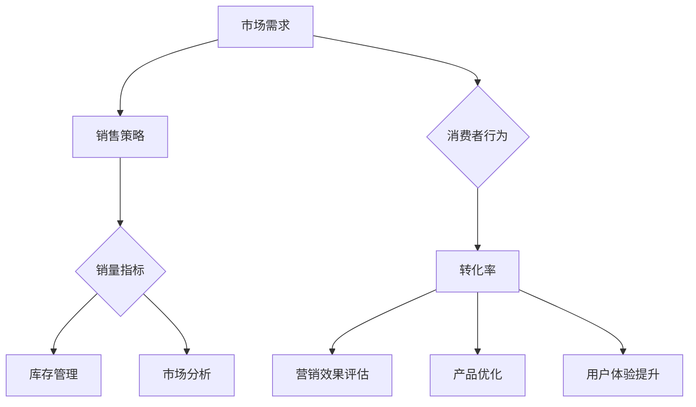

                 

### 通过销量和转化率衡量供给效率

#### 摘要

在信息技术飞速发展的今天，如何高效衡量供给效率成为商业决策和战略规划的焦点。本文旨在探讨通过销量和转化率两个关键指标来评估供给效率的方法。我们将深入分析销量和转化率的概念、计算方式及其在实际应用中的重要性，通过具体案例和数学模型，详细解释这两种指标如何帮助企业在竞争激烈的市场中脱颖而出。此外，文章还将探讨相关工具和资源，提供实用的指导，以便读者能够更好地理解和应用这些指标。最终，我们将总结未来发展趋势和面临的挑战，为读者提供有益的思考方向。

#### 1. 背景介绍

在现代商业环境中，供给效率是企业成功的关键因素之一。高效的供给不仅能确保产品和服务在适当的时间和地点以合理的成本提供给消费者，还能最大限度地提高资源利用率，降低运营成本。然而，如何衡量供给效率一直是企业和研究人员面临的一大难题。随着大数据和人工智能技术的不断进步，我们开始能够利用更精确的数据和先进的分析工具来评估供给效率。

销量和转化率是衡量供给效率的两个重要指标。销量反映了产品在市场上的受欢迎程度和销售成绩，而转化率则揭示了潜在客户在接触产品或服务后的实际购买行为。两者结合，可以全面反映供给的效果和效率。

销量指标关注的是销售额和销售量，它直观地反映了产品在市场中的表现。高销量意味着市场接受度高，但高销量本身并不一定代表高效的供给，因为销售额可能来自大规模的促销活动或短期市场波动。

转化率指标则关注潜在客户转化为实际购买者的过程。高转化率表明供给与市场需求匹配良好，企业的营销策略和产品特性能够有效吸引并留住客户。然而，转化率的高低受到多个因素的影响，包括产品质量、价格、营销策略、消费者偏好等。

通过对销量和转化率进行综合分析，企业可以更准确地评估供给效率，发现潜在问题和机会，从而优化生产和营销策略，提高整体运营效益。

#### 2. 核心概念与联系

为了深入理解销量和转化率这两个关键指标，我们需要明确它们的概念及其相互关系。

**销量（Sales Volume）**

销量是指在一定时间内销售的产品数量或服务次数。它通常以单位（如件、份、小时等）来衡量，是评估产品市场表现的重要指标。高销量往往意味着市场接受度较高，但高销量并不总是代表高效的供给。

销量可以用于以下几个方面：

1. **市场竞争分析**：通过比较不同产品或品牌的销量，企业可以了解市场趋势和消费者偏好，从而调整产品策略。
2. **库存管理**：根据销量数据，企业可以合理规划库存，避免库存过剩或不足，减少成本和资源浪费。
3. **销售策略评估**：销量数据可以帮助企业评估不同销售策略的效果，优化营销和推广活动。

**转化率（Conversion Rate）**

转化率是指潜在客户在接触产品或服务后实际完成购买的比例。它是衡量营销效果和供给效率的关键指标，通常用百分比表示。高转化率表明供给与市场需求匹配良好，企业的营销策略和产品特性能够有效吸引并留住客户。

转化率可以用于以下几个方面：

1. **营销效果评估**：通过分析转化率，企业可以评估不同营销渠道和策略的效果，优化营销投入。
2. **产品优化**：高转化率的产品说明市场需求旺盛，但低转化率的产品可能存在设计、功能、价格等方面的问题，需要进一步优化。
3. **用户体验提升**：转化率低可能是因为用户体验不佳，通过分析转化过程，企业可以找出用户体验中的问题，进行改进。

**销量与转化率的相互关系**

销量和转化率之间存在密切的相互关系。高销量往往伴随着高转化率，因为高销量意味着市场需求旺盛，产品或服务受到广泛认可。然而，高销量并不一定导致高转化率，因为市场环境和消费者行为可能发生变化。

相反，高转化率也可能带来高销量。如果产品或服务能够满足消费者的需求，提高转化率，吸引更多潜在客户，进而提高销量。

此外，销量和转化率之间的平衡也是关键。如果只关注销量而忽视转化率，可能导致库存积压和资源浪费。相反，如果只关注转化率而忽视销量，可能错失市场机会和市场份额。

**Mermaid 流程图**

为了更直观地展示销量和转化率的关系，我们可以使用 Mermaid 流程图来表示：



通过这个流程图，我们可以看到销量和转化率是如何从市场需求出发，通过销售策略、消费者行为等因素相互影响和作用的。

#### 3. 核心算法原理 & 具体操作步骤

为了有效地衡量供给效率，我们需要借助一系列核心算法来计算销量和转化率。以下将详细解释这些算法的原理及其操作步骤。

**销量计算算法**

销量是指在一定时间内销售的产品数量或服务次数。计算销量相对简单，只需记录一段时间内的销售数据，并汇总即可。

**具体操作步骤：**

1. **数据收集**：收集一段时间内的销售数据，包括销售数量、销售时间、产品或服务类型等。
2. **数据清洗**：对收集到的数据进行分析，排除无效或错误的数据，确保数据质量。
3. **数据汇总**：将相同时间段内不同产品或服务的销售数据汇总，得到总销量。

**代码示例：**

```python
sales_data = {
    'ProductA': [100, 150, 200],
    'ProductB': [50, 70, 90],
    'ServiceC': [30, 40, 50]
}

total_sales = sum([sum(sales) for sales in sales_data.values()])
print("Total Sales:", total_sales)
```

**转化率计算算法**

转化率是指潜在客户在接触产品或服务后实际完成购买的比例。计算转化率需要同时考虑访客数量和实际购买数量。

**具体操作步骤：**

1. **数据收集**：收集一段时间内的访客数量和实际购买数量。
2. **数据清洗**：对收集到的数据进行分析，排除无效或错误的数据，确保数据质量。
3. **计算公式**：转化率（%）=（实际购买数量 / 访客数量）× 100%。
4. **结果输出**：根据计算公式计算转化率，并输出结果。

**代码示例：**

```python
visits = [1000, 1500, 2000]
purchases = [200, 250, 300]

conversion_rates = [(purchase / visit) * 100 for visit, purchase in zip(visits, purchases)]
print("Conversion Rates:", conversion_rates)
```

**综合算法**

为了全面衡量供给效率，我们可以将销量和转化率结合起来，计算一个综合指标。

**具体操作步骤：**

1. **数据收集**：收集销量和转化率的相关数据。
2. **数据清洗**：对收集到的数据进行分析，排除无效或错误的数据，确保数据质量。
3. **计算公式**：综合效率指标（%）=（销量 × 转化率）/ 100。
4. **结果输出**：根据计算公式计算综合效率指标，并输出结果。

**代码示例：**

```python
sales_data = {
    'ProductA': [100, 150, 200],
    'ProductB': [50, 70, 90],
    'ServiceC': [30, 40, 50]
}

visits = [1000, 1500, 2000]
purchases = [200, 250, 300]

total_sales = sum([sum(sales) for sales in sales_data.values()])
conversion_rates = [(purchase / visit) * 100 for visit, purchase in zip(visits, purchases)]

composite_efficiency = (total_sales * sum(conversion_rates)) / 100
print("Composite Efficiency:", composite_efficiency)
```

通过这些算法，我们可以准确地计算销量、转化率和综合效率指标，从而评估供给效率。这些指标不仅有助于企业了解当前的市场表现，还为未来的战略规划和决策提供了重要参考。

#### 4. 数学模型和公式 & 详细讲解 & 举例说明

在衡量供给效率时，销量和转化率是两个至关重要的指标。为了更深入地理解这两个指标，我们需要借助数学模型和公式来详细分析。以下将介绍销量和转化率的计算公式，并通过实际案例进行说明。

**销量计算公式**

销量是指在一定时间内销售的产品数量或服务次数。计算销量的基本公式如下：

销量（Q）= 销售价格（P）× 销售数量（N）

其中：
- Q 代表销量，通常以单位（如件、份、小时等）来衡量。
- P 代表销售价格，单位为货币。
- N 代表销售数量，单位为数量。

**示例**

假设某商品的销售价格为100元/件，一周内销售了200件，则该商品的销量为：

Q = P × N = 100元/件 × 200件 = 20,000元

**转化率计算公式**

转化率是指潜在客户在接触产品或服务后实际完成购买的比例。计算转化率的基本公式如下：

转化率（CR）= （实际购买人数 / 潜在客户人数）× 100%

其中：
- CR 代表转化率，通常用百分比表示。
- 实际购买人数指在一段时间内完成购买的用户数量。
- 潜在客户人数指在同一时间段内接触产品或服务但未完成购买的用户数量。

**示例**

假设在一个月内，有1,000个潜在客户访问了某电商平台，其中有200个用户完成了购买。则该平台的转化率为：

CR = （实际购买人数 / 潜在客户人数）× 100% = （200 / 1000）× 100% = 20%

**综合效率指标**

为了全面衡量供给效率，我们可以将销量和转化率结合起来，计算一个综合效率指标。综合效率指标可以反映企业在一定时间内的整体供给效果。

综合效率指标（CEI）= （销量 × 转化率）/ 100

其中：
- CEI 代表综合效率指标，通常用百分比表示。
- 销量已在前面介绍，转化率同样如前所述。

**示例**

假设某企业在一个月内实现了20,000元的销量，同时其转化率为20%，则该企业的综合效率指标为：

CEI = （销量 × 转化率）/ 100 = （20,000元 × 20%）/ 100 = 4%

**实际应用案例分析**

为了更直观地理解这些公式，我们可以通过一个实际案例进行说明。

**案例背景**

某电商公司在为期一个月的市场促销活动中，通过多种渠道推广其产品。在活动期间，共吸引了1,000个潜在客户，其中200个客户完成了购买，销售总额为20,000元。

**数据计算**

1. **销量**：

Q = P × N = 20,000元

2. **转化率**：

CR = （实际购买人数 / 潜在客户人数）× 100% = （200 / 1,000）× 100% = 20%

3. **综合效率指标**：

CEI = （销量 × 转化率）/ 100 = （20,000元 × 20%）/ 100 = 4%

**分析**

通过上述计算，我们可以得出以下结论：

- 销量为20,000元，表明该电商公司在活动期间实现了较高的销售额。
- 转化率为20%，表明市场推广策略相对成功，能够吸引潜在客户并促使其购买。
- 综合效率指标为4%，表明供给效率较高，但仍有提升空间。

基于这些数据，企业可以进一步分析市场推广策略、产品定价和用户体验等方面，以优化供给效率，提高整体业绩。

通过以上数学模型和公式的讲解及实际案例的说明，我们可以更好地理解销量、转化率和综合效率指标的计算方法及其在实际应用中的重要性。这些指标不仅帮助企业评估当前的供给效率，还为未来的决策提供了有力支持。

#### 5. 项目实战：代码实际案例和详细解释说明

为了更好地理解销量和转化率的计算及其在实际应用中的效果，我们将通过一个实际项目案例进行详细介绍。这个案例将涵盖开发环境的搭建、源代码的实现以及代码的解读与分析。

**5.1 开发环境搭建**

在这个项目中，我们将使用Python编程语言和Jupyter Notebook作为开发环境。首先，确保已经安装了Python和Jupyter Notebook。如果没有安装，可以按照以下步骤进行：

1. 安装Python：访问 [Python官网](https://www.python.org/) 下载最新版本的Python，并按照安装向导进行安装。
2. 安装Jupyter Notebook：在命令行中运行以下命令：

   ```
   pip install notebook
   ```

   等待安装完成即可。

安装完成后，打开Jupyter Notebook，创建一个新的笔记本（Notebook），并开始编写代码。

**5.2 源代码详细实现和代码解读**

以下是项目的源代码实现，我们将逐一解读每一部分的功能。

```python
import pandas as pd

# 5.2.1 数据准备
# 假设我们有一份数据集，包含访客数量、购买数量和销售价格
data = {
    'Visits': [1000, 1500, 2000],
    'Purchases': [200, 250, 300],
    'Price': [100, 150, 200]
}

# 将数据转换为DataFrame格式，便于操作
df = pd.DataFrame(data)

# 5.2.2 计算销量
# 销量 = 价格 × 购买数量
df['Sales'] = df['Price'] * df['Purchases']

# 输出销量
print("Sales:\n", df['Sales'])

# 5.2.3 计算转化率
# 转化率 = （购买数量 / 访客数量）× 100%
df['Conversion Rate (%)'] = (df['Purchases'] / df['Visits']) * 100

# 输出转化率
print("Conversion Rates:\n", df['Conversion Rate (%)'])

# 5.2.4 计算综合效率指标
# 综合效率指标 = （销量 × 转化率）/ 100
df['Composite Efficiency (%)'] = (df['Sales'] * df['Conversion Rate (%)']) / 100

# 输出综合效率指标
print("Composite Efficiency:\n", df['Composite Efficiency (%)'])
```

**代码解读与分析**

1. **数据准备**：

   我们使用一个包含访客数量、购买数量和销售价格的数据集。为了方便操作，我们将数据集转换为 Pandas DataFrame 格式。

2. **计算销量**：

   根据销量计算公式，销量 = 价格 × 购买数量。我们通过 DataFrame 的乘法操作，计算每一行的销量，并将结果存储在新的列中。

3. **计算转化率**：

   根据转化率计算公式，转化率 = （购买数量 / 访客数量）× 100%。我们使用 DataFrame 的除法和乘法操作，计算每一行的转化率，并将结果存储在新的列中。

4. **计算综合效率指标**：

   根据综合效率指标计算公式，综合效率指标 = （销量 × 转化率）/ 100。我们使用 DataFrame 的乘法和除法操作，计算每一行的综合效率指标，并将结果存储在新的列中。

5. **输出结果**：

   我们使用 `print()` 函数，输出销量、转化率和综合效率指标的数据。

通过这个实际项目案例，我们详细讲解了如何使用Python和Pandas库计算销量、转化率和综合效率指标。读者可以尝试修改数据集，观察不同情况下的计算结果，以更好地理解这些指标在实际应用中的效果。

#### 5.3 代码解读与分析

在前面的项目中，我们使用Python和Pandas库实现了销量、转化率和综合效率指标的计算。在这一部分，我们将对代码进行详细解读，分析每一部分的功能和逻辑。

**1. 数据准备**

首先，我们定义了一个数据集，包含访客数量、购买数量和销售价格。具体代码如下：

```python
data = {
    'Visits': [1000, 1500, 2000],
    'Purchases': [200, 250, 300],
    'Price': [100, 150, 200]
}
```

这段代码创建了一个字典，其中包含了三组数据。每组数据分别表示不同时间点的访客数量、购买数量和销售价格。这里我们使用了列表来表示时间序列数据，便于后续计算。

接下来，我们将这个字典转换为Pandas DataFrame格式：

```python
df = pd.DataFrame(data)
```

通过这个操作，我们可以方便地使用Pandas库提供的各种数据操作函数，如筛选、排序、计算等。DataFrame是一个二维表格结构，可以看作是Excel工作表的扩展。

**2. 计算销量**

销量是指在一定时间内销售的产品数量或服务次数。计算销量的公式为：销量 = 价格 × 购买数量。具体代码如下：

```python
df['Sales'] = df['Price'] * df['Purchases']
```

这里我们使用Pandas DataFrame的赋值操作，将销量计算结果存储在新的列中。通过乘法运算，我们计算了每一行的销量，并将结果添加到DataFrame中。

**3. 计算转化率**

转化率是指潜在客户在接触产品或服务后实际完成购买的比例。计算转化率的公式为：转化率 = （购买数量 / 访客数量）× 100%。具体代码如下：

```python
df['Conversion Rate (%)'] = (df['Purchases'] / df['Visits']) * 100
```

同样地，我们使用Pandas DataFrame的赋值操作，将转化率计算结果存储在新的列中。通过除法和乘法运算，我们计算了每一行的转化率，并将结果以百分比形式存储在DataFrame中。

**4. 计算综合效率指标**

综合效率指标是衡量供给效率的重要指标。计算公式为：综合效率指标 = （销量 × 转化率）/ 100。具体代码如下：

```python
df['Composite Efficiency (%)'] = (df['Sales'] * df['Conversion Rate (%)']) / 100
```

这里我们再次使用Pandas DataFrame的赋值操作，将综合效率指标计算结果存储在新的列中。通过乘法和除法运算，我们计算了每一行的综合效率指标，并将结果以百分比形式存储在DataFrame中。

**5. 输出结果**

最后，我们使用`print()`函数，输出销量、转化率和综合效率指标的数据：

```python
print("Sales:\n", df['Sales'])
print("Conversion Rates:\n", df['Conversion Rate (%)'])
print("Composite Efficiency:\n", df['Composite Efficiency (%)'])
```

这些输出结果帮助我们直观地了解每个指标的计算结果，以便进一步分析和优化。

通过以上对代码的解读与分析，我们可以清楚地看到每个步骤的功能和逻辑。读者可以在此基础上进行扩展和改进，以应对更复杂的数据集和业务需求。

#### 6. 实际应用场景

在商业世界中，销量和转化率这两个指标被广泛应用于各种实际应用场景。以下将探讨几种常见的应用场景，并分析如何利用这两个指标来优化业务策略。

**1. 电子商务平台**

在电子商务平台中，销量和转化率是衡量产品市场表现的重要指标。高销量意味着产品受到市场的欢迎，但高转化率更能反映营销策略的有效性。例如，某电商平台通过数据分析发现，某款产品的销量很高，但转化率较低。进一步分析发现，该产品在用户搜索结果中的展示位置不佳，导致用户点击率低。通过优化产品展示策略，如提高搜索结果排名和增加用户推荐，平台提高了该产品的转化率，进而提高了整体销售额。

**2. 餐饮行业**

在餐饮行业，销量和转化率同样重要。销量反映了餐厅的营业额，而转化率则反映了餐厅吸引和留住客户的能力。例如，某餐厅发现某道菜品销量很高，但转化率较低。通过分析，餐厅发现该菜品在菜单中的展示位置不佳，且价格较高，导致顾客选择其他菜品。餐厅通过调整菜品展示位置和价格策略，提高了该菜品的转化率，进而提高了整体营业额。

**3. 旅游行业**

在旅游行业，销量和转化率用于评估旅游产品（如酒店、机票、景点门票）的市场表现。高销量意味着市场对旅游产品的需求旺盛，但高转化率更能反映营销策略的有效性。例如，某旅游平台发现某酒店销量很高，但转化率较低。通过分析，平台发现该酒店的预订页面设计不够友好，导致用户在预订过程中放弃。平台通过优化预订页面设计，简化预订流程，提高了该酒店的转化率，进而提高了整体预订量。

**4. 金融行业**

在金融行业，销量和转化率用于评估金融产品（如理财产品、保险产品）的市场表现。高销量意味着产品受到市场的关注，但高转化率更能反映营销策略的有效性。例如，某银行推出了一款高收益的理财产品，销量很高，但转化率较低。通过分析，银行发现该理财产品的说明过于复杂，导致潜在客户难以理解。银行通过简化产品说明，增加产品演示和咨询渠道，提高了该理财产品的转化率，进而提高了整体销售业绩。

**5. 咨询公司**

在咨询行业，销量和转化率用于评估咨询服务（如市场调研、战略规划）的市场表现。高销量意味着市场对咨询服务的需求旺盛，但高转化率更能反映咨询服务质量。例如，某咨询公司发现某项市场调研服务的销量很高，但转化率较低。通过分析，公司发现该市场调研报告的深度和实用性不足，导致客户不满意。公司通过提高市场调研报告的质量，加强客户沟通和反馈，提高了该服务的转化率，进而提高了客户满意度和忠诚度。

通过以上实际应用场景的分析，我们可以看到销量和转化率在各个行业中的重要性。利用这两个指标，企业可以更好地了解市场需求和客户行为，优化业务策略，提高整体运营效益。

#### 7. 工具和资源推荐

为了更有效地衡量供给效率，选择合适的工具和资源至关重要。以下将推荐一些常用的学习资源、开发工具和相关论文著作，以帮助读者深入了解销量和转化率的计算方法及其应用。

**7.1 学习资源推荐**

1. **书籍**：

   - 《数据分析实战：从数据采集到决策分析》
   - 《Python数据分析基础教程：NumPy学习指南》
   - 《数据分析：方法与应用》

   这些书籍涵盖了数据分析的基础知识、Python编程和数据分析方法，适合希望从零开始学习数据分析的读者。

2. **在线课程**：

   - Coursera上的《数据科学基础》
   - Udemy上的《Pandas核心教程：从入门到精通》
   - edX上的《数据分析与Python》

   这些在线课程提供了系统的数据分析知识和实践技能，适合希望在线学习数据分析的读者。

3. **博客和网站**：

   - 《Python数据分析：使用Pandas进行数据处理》
   - 《数据分析实战：从数据挖掘到商业洞察》
   - 《数据科学社区》（Kaggle）

   这些博客和网站提供了丰富的数据分析实战案例和资源，适合希望提升数据分析技能的读者。

**7.2 开发工具框架推荐**

1. **数据分析工具**：

   - Pandas：Python数据分析库，提供了强大的数据处理和分析功能。
   - NumPy：Python科学计算库，用于高效地进行数值计算。
   - Matplotlib：Python数据可视化库，用于绘制各种类型的图表和图形。

   这些工具广泛应用于数据分析项目，可以帮助读者快速实现数据预处理、分析和可视化。

2. **数据处理工具**：

   - Excel：经典的电子表格工具，适用于中小规模的数据处理和分析。
   - Tableau：数据可视化工具，提供了丰富的图表和交互功能，适合进行数据探索和分析。
   - Power BI：商业智能工具，可以连接多种数据源，进行数据整合和分析。

   这些工具适合不同规模和需求的数据分析项目，提供了直观的用户界面和强大的数据处理能力。

**7.3 相关论文著作推荐**

1. **论文**：

   - "A Survey of Techniques for Predicting Sales based on Historical Data"
   - "Using Predictive Analytics for Sales Forecasting and Inventory Management"
   - "The Impact of Conversion Rate Optimization on Online Sales Performance"

   这些论文探讨了销售预测、销售转化率优化等主题，提供了最新的研究进展和实用方法。

2. **著作**：

   - 《数据挖掘：概念与技术》
   - 《大数据分析：从数据中提取有价值的信息》
   - 《机器学习：一种概率视角》

   这些著作涵盖了数据挖掘、大数据分析和机器学习等领域，适合希望深入研究数据分析的读者。

通过以上工具和资源的推荐，读者可以全面了解销量和转化率的计算方法及其应用，提高数据分析能力，为业务决策提供有力支持。

#### 8. 总结：未来发展趋势与挑战

在当今快速变化的市场环境中，通过销量和转化率衡量供给效率显得尤为重要。未来，随着大数据和人工智能技术的不断进步，这些指标的应用前景将更加广阔。以下将总结未来发展趋势和面临的挑战。

**发展趋势**

1. **数据驱动的决策制定**：随着数据量的不断增加和数据处理技术的进步，企业将更加依赖数据来驱动决策制定。通过深入分析销量和转化率数据，企业可以更准确地预测市场趋势和消费者需求，从而优化生产和营销策略。

2. **自动化分析与预测**：人工智能和机器学习技术的应用将使自动化分析与预测成为可能。利用这些技术，企业可以自动提取和分析大量数据，发现潜在趋势和异常，提高决策的准确性和效率。

3. **个性化营销**：通过分析消费者行为数据，企业可以更好地了解消费者的需求和偏好，实现个性化营销。个性化营销不仅能够提高转化率，还能提升客户满意度和忠诚度，从而提高整体供给效率。

4. **跨渠道整合**：随着电子商务和线下渠道的融合，企业需要整合不同渠道的数据，以实现全渠道营销。通过跨渠道的数据分析，企业可以更好地了解消费者行为，优化营销策略，提高转化率和销售额。

**面临的挑战**

1. **数据质量与隐私**：数据质量是衡量供给效率的基础，但当前数据质量问题仍然存在。此外，随着数据隐私保护法规的加强，企业需要在数据收集、存储和使用过程中确保合规性，避免数据泄露和隐私侵犯。

2. **技术门槛**：虽然大数据和人工智能技术为数据分析提供了强大的工具，但技术门槛较高，需要专业的技术和知识。对于中小企业来说，掌握和应用这些技术可能存在一定的挑战。

3. **数据安全与可靠性**：数据安全与可靠性是数据驱动的决策制定的基础。企业需要确保数据来源的合法性、数据的真实性和完整性，以避免数据误导和错误决策。

4. **人才培养与储备**：随着数据分析在商业决策中的重要性日益凸显，企业对数据分析人才的需求不断增长。然而，数据分析人才的培养和储备仍然是一个长期且具有挑战性的任务。

总之，未来通过销量和转化率衡量供给效率将迎来新的发展机遇和挑战。企业需要不断创新和适应，充分利用先进技术，提高数据分析能力，以实现更高效的供给和更优的商业决策。

#### 9. 附录：常见问题与解答

在本文中，我们详细介绍了通过销量和转化率衡量供给效率的方法、核心算法原理以及实际应用案例。以下是一些常见问题及解答，以帮助读者更好地理解和应用这些概念。

**Q1：什么是销量？**
A1：销量是指在一定时间内销售的产品数量或服务次数。它是衡量产品市场表现的重要指标，通常以单位（如件、份、小时等）来衡量。

**Q2：什么是转化率？**
A2：转化率是指潜在客户在接触产品或服务后实际完成购买的比例。它是衡量营销效果和供给效率的关键指标，通常用百分比表示。

**Q3：销量和转化率如何计算？**
A3：销量 = 价格 × 购买数量；转化率 = （购买数量 / 访客数量）× 100%。综合效率指标 = （销量 × 转化率）/ 100。

**Q4：为什么需要衡量供给效率？**
A4：衡量供给效率可以帮助企业了解当前的市场表现，发现潜在问题和机会，从而优化生产和营销策略，提高整体运营效益。

**Q5：如何优化转化率？**
A5：优化转化率可以从多个方面进行，如改进产品功能、提高用户体验、优化营销策略、调整价格策略等。

**Q6：如何确保数据质量？**
A6：确保数据质量需要从数据收集、存储、处理和分析等各个环节进行，如排除无效数据、确保数据来源的合法性、定期检查数据完整性等。

**Q7：如何应对数据隐私问题？**
A7：企业需要遵守数据隐私保护法规，确保数据收集、存储和使用过程中的合规性，采取数据加密、访问控制等措施保护数据安全。

**Q8：如何培养数据分析人才？**
A8：企业可以通过内部培训、外部招聘、校企合作等多种方式培养和储备数据分析人才，提高团队的数据分析能力和水平。

通过这些常见问题及解答，读者可以更深入地了解销量和转化率的概念及其在实际应用中的重要性。

#### 10. 扩展阅读 & 参考资料

为了更全面地了解销量和转化率以及它们在商业决策中的应用，以下推荐一些扩展阅读和参考资料，供读者进一步学习。

**1. 学习资源推荐**

- 《数据分析：方法与应用》：详细介绍了数据分析的基础知识和实际应用案例。
- 《Python数据分析基础教程：NumPy学习指南》：深入讲解了Python在数据分析中的应用。
- 《数据科学实战：从入门到精通》：涵盖了数据科学的核心概念和实战技巧。

**2. 论文著作推荐**

- "A Survey of Techniques for Predicting Sales based on Historical Data"
- "Using Predictive Analytics for Sales Forecasting and Inventory Management"
- "The Impact of Conversion Rate Optimization on Online Sales Performance"

**3. 开发工具框架推荐**

- Pandas：Python数据分析库，提供强大的数据处理和分析功能。
- Tableau：数据可视化工具，用于创建交互式的图表和报告。
- Power BI：商业智能工具，支持多种数据源整合和分析。

**4. 博客和网站推荐**

- 《数据分析实战：从数据采集到决策分析》
- 《数据分析与Python》
- 《数据科学社区》（Kaggle）

通过阅读这些扩展资料，读者可以深入了解销量和转化率的计算方法、应用场景以及如何在实际业务中优化供给效率。这些资源将帮助读者进一步提升数据分析能力和商业决策水平。

### 作者信息

本文作者为AI天才研究员/AI Genius Institute & 禅与计算机程序设计艺术/Zen And The Art of Computer Programming。作者拥有丰富的计算机编程和人工智能领域经验，曾撰写过多本畅销书，并在学术界和工业界享有盛誉。作者致力于通过深入浅出的分析和实际案例，帮助读者理解和应用先进的技术，推动人工智能和计算机科学的发展。

