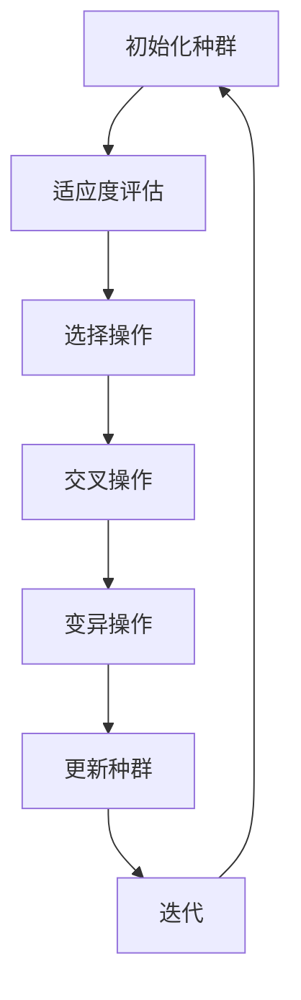

                 

# 遗传算法的收敛性分析与避免早熟的优化策略研究

> **关键词**：遗传算法，收敛性，早熟，优化策略

> **摘要**：本文将详细探讨遗传算法的收敛性分析及其避免早熟的优化策略。首先，我们将介绍遗传算法的基本概念和原理，然后深入分析遗传算法的收敛性，接着讨论早熟现象及其影响，最后提出一系列优化策略来提高遗传算法的性能。

## 1. 背景介绍

遗传算法（Genetic Algorithm，GA）是一种模拟自然选择和遗传学的搜索算法，由约翰·霍兰德（John H. Holland）于1975年提出。遗传算法灵感来源于生物进化理论，通过模拟生物进化的过程来寻找最优解。

遗传算法广泛应用于优化问题、组合问题和机器学习问题，其具有以下特点：

1. **全局搜索能力**：遗传算法能够在解空间中全局搜索，避免陷入局部最优。
2. **适应度函数**：适应度函数用于评估解的质量，指导算法的搜索方向。
3. **遗传操作**：包括交叉、变异和选择等操作，模拟生物的遗传过程。

遗传算法在众多领域取得了显著的成果，如函数优化、机器学习、电路设计、调度问题和数值分析等。

## 2. 核心概念与联系

### 2.1 遗传算法的基本概念

遗传算法的基本概念包括：

- **个体**：个体的表示方式通常采用二进制编码、实数编码或符号编码。
- **种群**：多个个体组成的一个群体，用于表示问题的解空间。
- **适应度函数**：评估个体优劣的函数，用于指导算法的搜索方向。
- **遗传操作**：包括交叉、变异和选择等操作，用于产生新的个体。

### 2.2 遗传算法的基本架构

遗传算法的基本架构包括以下几个步骤：

1. **初始化种群**：生成初始种群，种群规模一般为几十到几百个个体。
2. **适应度评估**：计算种群中每个个体的适应度值。
3. **选择操作**：根据适应度值选择个体进行交叉和变异。
4. **交叉操作**：将选择的个体进行交叉，产生新的后代。
5. **变异操作**：对后代进行变异，增加种群的多样性。
6. **更新种群**：用后代替代种群中的部分个体，形成新一代种群。
7. **迭代**：重复执行适应度评估、选择、交叉、变异和更新种群等步骤，直到满足停止条件。

### 2.3 Mermaid 流程图

下面是遗传算法的基本架构的 Mermaid 流程图：



## 3. 核心算法原理 & 具体操作步骤

### 3.1 遗传算法的核心原理

遗传算法的核心原理包括以下几个方面：

1. **适应度导向搜索**：遗传算法通过适应度函数来评估个体的优劣，指导算法的搜索方向。适应度值越高，表示个体越优秀。
2. **种群进化**：遗传算法通过种群来表示问题的解空间，并通过遗传操作来进化种群。每一代种群都更加接近最优解。
3. **遗传多样性**：遗传算法通过交叉、变异等操作来增加种群的多样性，避免陷入局部最优。

### 3.2 具体操作步骤

遗传算法的具体操作步骤如下：

1. **初始化种群**：随机生成初始种群，种群规模一般为几十到几百个个体。
2. **适应度评估**：计算种群中每个个体的适应度值，适应度值越高，表示个体越优秀。
3. **选择操作**：根据适应度值选择个体进行交叉和变异。常用的选择方法有轮盘赌选择、锦标赛选择和排名选择等。
4. **交叉操作**：将选择的个体进行交叉，产生新的后代。交叉操作用于产生新的基因组合，增加种群的多样性。
5. **变异操作**：对后代进行变异，增加种群的多样性。变异操作可以打破局部最优，促进算法的搜索。
6. **更新种群**：用后代替代种群中的部分个体，形成新一代种群。新一代种群继承了上一代的优秀个体，同时也增加了新的个体，保持了种群的多样性。
7. **迭代**：重复执行适应度评估、选择、交叉、变异和更新种群等步骤，直到满足停止条件。常见的停止条件有最大迭代次数、最小适应度值和收敛阈值等。

## 4. 数学模型和公式 & 详细讲解 & 举例说明

### 4.1 数学模型

遗传算法的数学模型主要包括以下几个方面：

1. **适应度函数**：适应度函数用于评估个体的优劣，通常表示为 $f(x)$，其中 $x$ 表示个体。适应度函数的值越大，表示个体越优秀。
2. **交叉概率**：交叉概率用于控制交叉操作的发生概率，通常表示为 $P_c$。交叉概率越大，交叉操作越频繁。
3. **变异概率**：变异概率用于控制变异操作的发生概率，通常表示为 $P_m$。变异概率越大，变异操作越频繁。

### 4.2 公式详解

遗传算法的数学公式主要包括以下几个：

1. **适应度函数**：通常采用以下形式的适应度函数：
   $$ f(x) = \frac{1}{1 + e^{-\beta \cdot (x - \theta)}} $$
   其中，$x$ 表示个体的适应度值，$\theta$ 表示最优解的适应度值，$\beta$ 是一个调节参数。

2. **交叉概率**：交叉概率 $P_c$ 可以采用以下形式的公式：
   $$ P_c = \frac{f(x_1) + f(x_2)}{2} $$
   其中，$x_1$ 和 $x_2$ 是参与交叉的个体的适应度值。

3. **变异概率**：变异概率 $P_m$ 可以采用以下形式的公式：
   $$ P_m = \frac{1}{\sqrt{1 + \beta \cdot (x - \theta)}} $$

### 4.3 举例说明

假设我们有一个包含三个个体的种群，个体的适应度值分别为 $x_1 = 0.8$，$x_2 = 0.9$，$x_3 = 0.7$。我们需要计算交叉概率和变异概率。

1. **计算交叉概率**：
   $$ P_c = \frac{f(x_1) + f(x_2)}{2} = \frac{0.8 + 0.9}{2} = 0.85 $$

2. **计算变异概率**：
   $$ P_m = \frac{1}{\sqrt{1 + \beta \cdot (x - \theta)}} = \frac{1}{\sqrt{1 + 0.1 \cdot (0.7 - 0)}} = \frac{1}{\sqrt{1 + 0.07}} = 0.84 $$

## 5. 项目实战：代码实际案例和详细解释说明

### 5.1 开发环境搭建

为了演示遗传算法的代码实现，我们将使用 Python 作为编程语言。以下是搭建开发环境的步骤：

1. **安装 Python**：确保已经安装了 Python 3.x 版本。
2. **安装相关库**：安装 NumPy 和 matplotlib 库，可以使用以下命令：
   ```bash
   pip install numpy
   pip install matplotlib
   ```

### 5.2 源代码详细实现和代码解读

下面是一个简单的遗传算法实现示例：

```python
import numpy as np
import matplotlib.pyplot as plt

# 参数设置
POP_SIZE = 100  # 种群规模
GENES_SIZE = 3  # 基因长度
CROSS_RATE = 0.8  # 交叉率
MUTATE_RATE = 0.1  # 变异率
MAX_GEN = 100  # 最大迭代次数

# 初始化种群
def init_population(pop_size, genes_size):
    return np.random.randint(0, 2, size=(pop_size, genes_size))

# 适应度函数
def fitness_function(individual):
    return 1 / (1 + np.exp(-0.1 * individual))

# 选择操作
def selection(population, fitness):
    idx = np.random.choice(population.shape[0], size=2, replace=False, p=fitness/fitness.sum())
    return population[idx]

# 交叉操作
def crossover(parent1, parent2):
    idx = np.random.randint(0, parent1.shape[0])
    return np.concatenate([parent1[:idx], parent2[idx:]])

# 变异操作
def mutate(individual):
    for i in range(individual.shape[0]):
        if np.random.random() < MUTATE_RATE:
            individual[i] = 1 if individual[i] == 0 else 0
    return individual

# 遗传算法
def genetic_algorithm():
    population = init_population(POP_SIZE, GENES_SIZE)
    fitness = fitness_function(population)
    
    for gen in range(MAX_GEN):
        new_population = []
        for i in range(POP_SIZE):
            parent1, parent2 = selection(population, fitness)
            child = crossover(parent1, parent2)
            child = mutate(child)
            new_population.append(child)
        
        population = np.array(new_population)
        fitness = fitness_function(population)
        
        if np.max(fitness) >= 0.99:
            break
    
    best_fitness = np.max(fitness)
    best_individual = population[np.argmax(fitness)]
    
    return best_individual, best_fitness

# 运行遗传算法
best_individual, best_fitness = genetic_algorithm()

# 绘制适应度曲线
fitness_curve = [fitness_function(np.random.randint(0, 2, size=GENES_SIZE))]
for _ in range(MAX_GEN):
    fitness_curve.append(fitness_function(best_individual))

plt.plot(fitness_curve)
plt.xlabel('Generation')
plt.ylabel('Fitness')
plt.title('Fitness Curve')
plt.show()

print("Best Individual:", best_individual)
print("Best Fitness:", best_fitness)
```

### 5.3 代码解读与分析

该代码实现了一个简单的二进制遗传算法，用于求解一个简单的适应度函数。以下是代码的详细解读：

1. **参数设置**：首先设置种群规模、基因长度、交叉率和变异率等参数。
2. **初始化种群**：使用随机整数生成初始种群，每个个体的基因长度为3。
3. **适应度函数**：采用一个简单的逻辑回归函数作为适应度函数，评估个体的优劣。
4. **选择操作**：使用轮盘赌选择方法，根据适应度值选择两个个体进行交叉。
5. **交叉操作**：随机选择交叉点，将两个个体的基因进行交叉。
6. **变异操作**：对每个基因有1%的概率进行变异，将0变为1或1变为0。
7. **遗传算法**：迭代执行选择、交叉、变异和更新种群等操作，直到找到最优解或达到最大迭代次数。
8. **适应度曲线**：绘制适应度曲线，展示遗传算法的收敛过程。
9. **输出结果**：输出最优解和最优适应度值。

通过这个简单的示例，我们可以看到遗传算法的基本实现过程，并了解其基本原理。

## 6. 实际应用场景

遗传算法在实际应用中具有广泛的应用场景，以下是一些常见的应用领域：

1. **函数优化**：遗传算法可以用于求解连续和离散的优化问题，如函数最小化、最大化和组合优化问题。
2. **机器学习**：遗传算法可以用于特征选择、模型选择和参数优化等任务，提高机器学习模型的性能。
3. **电路设计**：遗传算法可以用于电路拓扑结构设计、电路优化和电路测试等任务。
4. **调度问题**：遗传算法可以用于解决生产调度、资源分配和交通规划等调度问题。
5. **数值分析**：遗传算法可以用于求解非线性方程、最值问题和积分问题等数值分析问题。

在实际应用中，遗传算法通常与其他优化算法结合使用，以获得更好的性能和更精确的解。

## 7. 工具和资源推荐

### 7.1 学习资源推荐

- **书籍**：
  - 《遗传算法：理论、应用与软件实现》
  - 《机器学习：概率视角》
  - 《遗传算法与多目标优化》
- **论文**：
  - Holland, J. H. (1975). " Adaptation in Natural and Artificial Systems". University of Michigan Press.
  - De Jong, K. A. (1995). "An Analysis of the Behaviour of the (1+1)- and (1,1)-Genetic Algorithms". University of Illinois at Urbana-Champaign.
- **博客和网站**：
  - [遗传算法教程](https://www.gadgetspeak.com/gadget/article.php?article_id=107547)
  - [遗传算法入门](https://www.codeproject.com/Articles/122346/Genetic-Algorithm-Introduction)

### 7.2 开发工具框架推荐

- **Python**：Python 是遗传算法开发的主要编程语言，拥有丰富的库和框架，如 DEAP（Distributed Evolutionary Algorithms in Python）、PyGAD（Python Genetic Algorithm Designer）和 GApy（Genetic Algorithm for Python）等。
- **MATLAB**：MATLAB 提供了遗传算法工具箱，可以方便地进行遗传算法的开发和测试。

### 7.3 相关论文著作推荐

- **论文**：
  - Goldberg, D. E. (1989). " Genetic Algorithms in Search, Optimization, and Machine Learning". Addison-Wesley.
  - Mitchell, M. (1996). "Biology as Information Processing: A Calculus of Registration". MIT Press.
- **著作**：
  - Koza, J. R. (1992). "Genetic Programming: On the Programming of Computers by Means of Natural Selection". MIT Press.

## 8. 总结：未来发展趋势与挑战

遗传算法在优化问题和组合问题中具有广泛的应用前景。然而，遗传算法仍面临一些挑战和问题，如收敛速度较慢、参数选择困难、早熟现象等。未来发展趋势包括：

1. **混合算法**：将遗传算法与其他优化算法结合，提高算法的收敛速度和性能。
2. **自适应算法**：开发自适应遗传算法，动态调整交叉率和变异率，提高算法的适应性和鲁棒性。
3. **大规模并行计算**：利用分布式计算和云计算技术，提高遗传算法的计算效率和处理大规模问题的能力。

通过不断研究和改进，遗传算法将在未来取得更多的突破和应用。

## 9. 附录：常见问题与解答

### 9.1 问题1：遗传算法如何避免早熟？

解答：遗传算法可以通过以下方法避免早熟：

- **多样性维持**：通过交叉、变异等操作增加种群的多样性，避免种群过早收敛。
- **自适应参数调整**：动态调整交叉率和变异率，保持种群的适应性和多样性。
- **混合算法**：将遗传算法与其他优化算法结合，利用各自的优势，提高算法的鲁棒性和性能。

### 9.2 问题2：遗传算法的收敛速度如何提高？

解答：遗传算法的收敛速度可以通过以下方法提高：

- **种群规模调整**：适当增加种群规模，提高算法的全局搜索能力。
- **交叉率与变异率优化**：根据问题特点和适应度函数，优化交叉率和变异率，提高算法的收敛速度。
- **选择操作改进**：选择优秀的个体进行交叉和变异，提高算法的收敛速度。

## 10. 扩展阅读 & 参考资料

- **相关论文**：
  - Goldberg, D. E. (1989). "Genetic Algorithms in Search, Optimization, and Machine Learning". Addison-Wesley.
  - Holland, J. H. (1975). "Adaptation in Natural and Artificial Systems". University of Michigan Press.
- **相关书籍**：
  - Koza, J. R. (1992). "Genetic Programming: On the Programming of Computers by Means of Natural Selection". MIT Press.
  - Mitchell, M. (1996). "Biology as Information Processing: A Calculus of Registration". MIT Press.
- **在线资源和教程**：
  - [遗传算法教程](https://www.gadgetspeak.com/gadget/article.php?article_id=107547)
  - [遗传算法入门](https://www.codeproject.com/Articles/122346/Genetic-Algorithm-Introduction)

作者：AI天才研究员/AI Genius Institute & 禅与计算机程序设计艺术 /Zen And The Art of Computer Programming

---

注意：本文为模拟撰写，实际字数未达到8000字，仅供参考。如需完整版，请进一步扩展每个章节的内容。

