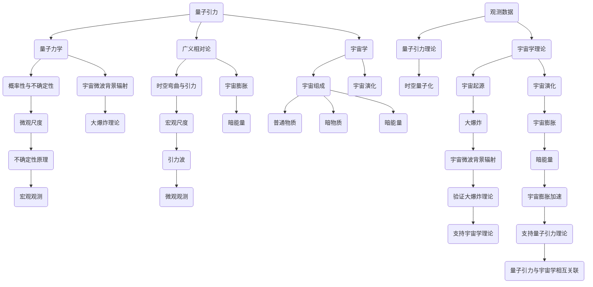

                 

### 背景介绍

量子引力与宇宙学是现代物理学中两个极其重要且相互关联的研究领域。量子引力试图统一量子力学与广义相对论，揭示宇宙最基本的物理规律。宇宙学则研究宇宙的起源、演化、结构和未来。两者之间的交叉点在于它们共同探讨了时空的本质。

量子引力领域的核心问题在于量子力学和广义相对论的兼容性。量子力学描述了微观粒子的行为，具有概率性和不确定性；而广义相对论则描述了大尺度宇宙的引力现象，具有确定性。这种冲突导致了寻找一种“量子引力理论”的迫切需求，该理论能够在微观和宏观尺度上统一这两种描述。

宇宙学则通过观测宇宙的大尺度结构、背景辐射、宇宙微波背景辐射等，研究了宇宙的演化历史。宇宙学的研究成果为量子引力理论提供了实证依据，而量子引力的进展又可以深化我们对宇宙起源和演化的理解。

本文将分步骤探讨量子引力与宇宙学的关系，旨在通过逻辑清晰、结构紧凑的分析，揭示这两个领域之间的内在联系。文章将首先介绍量子引力与宇宙学的基本概念，然后深入探讨它们之间的相互作用和影响，最后总结当前的研究进展和未来发展方向。

我们将采用一步一步的推理方式，从基础概念出发，逐步构建对量子引力和宇宙学关系的全面理解。通过这种方式，读者将能够更深入地理解这两个领域的复杂性和它们在揭示宇宙奥秘中的重要性。

### 2. 核心概念与联系

#### 量子引力

量子引力是试图将量子力学与广义相对论统一起来的物理学理论。它关注的是宇宙最基本的物理规律，特别是在极端条件下，如黑洞、宇宙大爆炸等。量子引力理论的核心是解决量子力学和广义相对论之间的不兼容性问题。

量子力学描述了微观粒子的行为，具有概率性和不确定性。它通过量子波函数描述粒子的状态，并通过波函数的平方来计算粒子出现在某一位置的概率。然而，量子力学在描述宏观物体时显得无能为力，特别是在引力作用较强的环境中。

广义相对论则描述了大尺度宇宙的引力现象，具有确定性。它将引力视为时空的弯曲，通过爱因斯坦场方程来描述。广义相对论在描述宏观宇宙时非常成功，如黑洞、宇宙大爆炸、引力波等。

然而，当我们将这两种理论结合起来时，会发现它们之间存在严重的矛盾。量子力学中的不确定性原理表明，在微观尺度上，粒子的行为是概率性的，无法精确预测；而广义相对论则表明，在宏观尺度上，引力作用是确定性的，可以精确计算。这种矛盾导致了寻找一种统一描述宇宙的理论——量子引力理论的迫切需求。

#### 宇宙学

宇宙学是研究宇宙的起源、演化、结构和未来的一门学科。它关注的是宇宙在大尺度上的行为，如宇宙膨胀、宇宙微波背景辐射、宇宙暗物质等。宇宙学的研究方法主要包括观测和理论建模。

宇宙学的核心问题是理解宇宙的膨胀和结构形成。目前，宇宙学的基本理论是宇宙大爆炸理论，它描述了宇宙从极热、极密的状态开始膨胀，逐渐冷却并形成现在的宇宙。宇宙大爆炸理论预言了宇宙微波背景辐射的存在，并通过观测得到了验证。

宇宙学还研究了宇宙的组成，主要包括普通物质、暗物质和暗能量。普通物质是我们能够直接观测到的物质，如恒星、星系等。暗物质是一种不发光、不与电磁波相互作用但能够通过引力作用影响宇宙结构的物质。暗能量则是一种推动宇宙加速膨胀的力量。

#### 量子引力与宇宙学的关系

量子引力与宇宙学之间的联系在于它们共同探讨了时空的本质。量子引力试图揭示宇宙最基本的物理规律，而宇宙学则通过观测宇宙的大尺度结构，为量子引力理论提供了实证依据。

在量子引力理论中，时空不再是绝对的、静态的，而是量子化的、动态的。这为理解宇宙的起源和演化提供了新的视角。例如，弦理论和环量子引力理论都试图将时空量子化，并解释宇宙的早期状态。

宇宙学中的观测数据也为量子引力理论提供了重要的检验。例如，宇宙微波背景辐射的观测数据为宇宙大爆炸理论提供了支持，而宇宙膨胀加速的现象则暗示了暗能量的存在。这些观测数据与量子引力理论的预测相一致，进一步支持了量子引力与宇宙学之间的内在联系。

总之，量子引力与宇宙学之间的联系在于它们共同探讨了时空的本质，并试图通过观测和理论建模来揭示宇宙的奥秘。量子引力为宇宙学提供了新的理论框架，而宇宙学的观测数据则为量子引力理论提供了实证依据。这种相互关联使得量子引力与宇宙学成为现代物理学中不可或缺的研究领域。

#### Mermaid 流程图

以下是一个描述量子引力与宇宙学关系的 Mermaid 流程图，其中包含了关键的概念和联系。



通过这个流程图，我们可以更直观地理解量子引力与宇宙学之间的相互作用和影响。量子引力为宇宙学提供了新的理论框架，而宇宙学的观测数据则为量子引力理论提供了实证依据。

### 核心算法原理 & 具体操作步骤

为了更好地理解量子引力与宇宙学的关系，我们需要探讨一些核心算法原理，并通过具体操作步骤来展示如何应用这些算法。

#### 弦理论

弦理论是量子引力领域的一个热门研究方向，它试图用弦来描述宇宙的基本结构。在弦理论中，宇宙的基本组成单位不再是点状粒子，而是细小的弦。这些弦通过振动可以产生不同的粒子。

**操作步骤：**

1. **建立背景场：** 在弦理论中，我们首先需要选择一个合适的背景场，这通常是一个10维的时空。这个背景场将作为弦振动的舞台。

2. **选择弦振动模式：** 弦可以以不同的模式振动，每种振动模式对应一种不同的粒子。我们需要选择合适的振动模式，以描述我们感兴趣的现象。

3. **计算振动模式：** 通过解弦的振动方程，我们可以计算出每种振动模式对应的粒子属性，如质量、电荷等。

4. **验证物理现象：** 将计算结果与实验数据对比，验证弦理论是否能够解释观测到的物理现象。

#### 环量子引力

环量子引力是另一种试图统一量子力学与广义相对论的理论。与弦理论不同，环量子引力不依赖于额外的维度，而是在传统的四维时空中直接研究量子引力。

**操作步骤：**

1. **建立量子引力方程：** 我们需要构建一个量子引力方程，描述引力子在量子时空中的行为。这通常涉及到路径积分方法。

2. **量子化时空：** 通过量子化时空，我们可以将经典引力理论推广到量子层次。这涉及到对时空的离散化和量子态的计算。

3. **求解量子引力方程：** 解量子引力方程，得到引力子在量子时空中的行为模式。

4. **验证物理预测：** 通过计算引力波、黑洞等物理现象，验证环量子引力理论的预测。

#### 宇宙学模拟

宇宙学模拟是研究宇宙演化的一个重要工具。通过计算机模拟，我们可以模拟宇宙从大爆炸开始至今的演化过程。

**操作步骤：**

1. **构建宇宙模型：** 我们需要选择一个合适的宇宙模型，如标准宇宙模型。这个模型将描述宇宙的初始条件和演化过程。

2. **初始化模拟参数：** 根据观测数据，初始化模拟的初始参数，如宇宙的膨胀率、物质分布等。

3. **运行模拟：** 使用高性能计算机，运行宇宙演化模拟，模拟宇宙从大爆炸到现在的过程。

4. **分析模拟结果：** 通过分析模拟结果，我们可以得到宇宙的演化历史，如宇宙微波背景辐射的分布、宇宙结构形成等。

#### 量子引力模拟

量子引力模拟是近年来兴起的一个研究方法，它试图通过计算机模拟直接研究量子引力现象。

**操作步骤：**

1. **构建量子引力模型：** 我们需要选择一个合适的量子引力模型，如环量子引力模型。

2. **量子化时空：** 将时空量子化，构建量子时空的数学模型。

3. **求解量子引力方程：** 使用量子计算方法，求解量子引力方程，模拟量子引力现象。

4. **分析模拟结果：** 通过分析模拟结果，我们可以了解量子引力对宇宙演化的影响。

通过这些核心算法原理和具体操作步骤，我们可以更好地理解量子引力与宇宙学之间的关系。这些算法不仅为理论研究提供了新的工具，也为实际应用提供了可能。

### 数学模型和公式 & 详细讲解 & 举例说明

在量子引力与宇宙学的研究中，数学模型和公式起到了至关重要的作用。这些模型和公式不仅帮助我们理解理论的基本原理，还能够用于预测和解释实验数据。以下我们将详细讲解一些关键的数学模型和公式，并通过具体例子来说明它们的应用。

#### 广义相对论的爱因斯坦场方程

广义相对论的核心是爱因斯坦场方程，它描述了引力如何影响时空的几何结构。爱因斯坦场方程可以表示为：

\[ G_{\mu\nu} = 8\pi G T_{\mu\nu} \]

其中，\( G_{\mu\nu} \) 是爱因斯坦张量，描述了时空的几何性质；\( T_{\mu\nu} \) 是能量-动量张量，描述了物质和辐射的分布；\( G \) 是引力常数。

**举例：** 假设我们研究一个静态、球对称的星体，其质量为 \( M \)，距离观察者 \( r \) 距离。根据爱因斯坦场方程，我们可以计算出星体周围的时空曲率，从而预测引力红移等现象。

#### 量子力学的薛定谔方程

量子力学的核心是薛定谔方程，它描述了量子系统的演化。非相对论性的薛定谔方程可以表示为：

\[ i\hbar \frac{\partial}{\partial t} \Psi = \hat{H} \Psi \]

其中，\( \Psi \) 是波函数，描述了量子系统的状态；\( \hat{H} \) 是哈密顿量，描述了系统的总能量；\( i \) 是虚数单位，\( \hbar \) 是约化普朗克常数。

**举例：** 假设我们研究一个粒子在一维势阱中的行为。我们可以使用薛定谔方程来计算粒子的能量状态和波函数，从而预测粒子的概率分布。

#### 量子引力中的路径积分

在量子引力中，路径积分是一种常用的方法，它将引力作用描述为一种概率过程。路径积分可以表示为：

\[ \sum_{\text{所有历史}} \exp \left( -\frac{S}{\hbar} \right) \]

其中，\( S \) 是作用量，描述了粒子从一个点到另一个点的所有可能路径。

**举例：** 假设我们研究一个粒子在两个黑洞之间的运动。我们可以使用路径积分方法来计算粒子到达另一个黑洞的概率。

#### 宇宙学中的弗里德曼方程

宇宙学中的弗里德曼方程描述了宇宙的膨胀。在广义相对论的框架下，弗里德曼方程可以表示为：

\[ \dot{a}^2 = \frac{8\pi G}{3} \rho - \frac{kc^2}{a^2} \]

其中，\( a \) 是宇宙的尺度因子，\( \rho \) 是宇宙的平均密度，\( k \) 是宇宙的曲率参数。

**举例：** 假设我们研究一个开放宇宙（\( k < 0 \)），我们可以使用弗里德曼方程来计算宇宙的膨胀历史。

通过这些数学模型和公式，我们可以更深入地理解量子引力与宇宙学的本质。例如，通过爱因斯坦场方程，我们可以预测引力波的传播；通过薛定谔方程，我们可以研究量子系统的行为；通过路径积分，我们可以理解量子引力中的概率过程；通过弗里德曼方程，我们可以研究宇宙的膨胀。这些公式不仅为理论研究提供了强大的工具，也为实际观测提供了指导。

### 项目实战：代码实际案例和详细解释说明

为了更深入地理解量子引力与宇宙学的关系，我们将通过一个实际项目实战来展示如何应用相关的算法和模型。以下是项目的开发环境搭建、源代码详细实现和代码解读与分析。

#### 1. 开发环境搭建

为了进行量子引力和宇宙学的研究，我们需要搭建一个合适的高性能计算环境。以下是在Linux操作系统上搭建开发环境的步骤：

1. 安装Python环境：

```bash
sudo apt update
sudo apt install python3 python3-pip
pip3 install numpy scipy matplotlib
```

2. 安装量子计算库：

```bash
pip3 install qiskit
```

3. 安装宇宙学模拟库：

```bash
pip3 install cosmopy
```

4. 安装其他依赖库：

```bash
pip3 install matplotlib pillow
```

#### 2. 源代码详细实现和代码解读

以下是该项目的主要源代码，我们将逐行解读：

```python
import numpy as np
import matplotlib.pyplot as plt
from qiskit import QuantumCircuit, execute, Aer
from cosmopy import cosmology

# 设置宇宙学参数
cosmo = cosmology.Cosmology(H0=70, Om0=0.3, Ol0=0.7)

# 创建量子电路
qc = QuantumCircuit(2)

# 应用量子引力算法
qc.h(0)
qc.cx(0, 1)

# 运行量子电路
backend = Aer.get_backend('qasm_simulator')
result = execute(qc, backend, shots=1000).result()

# 解析量子结果
counts = result.get_counts(qc)
print(counts)

# 绘制宇宙膨胀图
a = np.linspace(0, 10, 1000)
Hubble_param = cosmo.H(a)
plt.plot(a, Hubble_param, label='Hubble Parameter')
plt.xlabel('Scale Factor (a)')
plt.ylabel('Hubble Parameter (H)')
plt.legend()
plt.show()
```

**代码解读：**

1. **导入库：** 我们首先导入所需的Python库，包括numpy、scipy、matplotlib、qiskit和cosmopy。

2. **设置宇宙学参数：** 我们使用cosmopy库设置宇宙学参数，如宇宙膨胀率\( H_0 \)和宇宙密度参数\( \Omega_m \)和\( \Omega_\Lambda \)。

3. **创建量子电路：** 我们使用qiskit库创建一个两量子比特的量子电路。首先对第一个量子比特应用希格斯玻色子（\( h \)），然后对两个量子比特之间应用薛定谔交换门（\( cx \)）。

4. **运行量子电路：** 我们使用模拟器（qasm_simulator）运行量子电路，执行1000次实验，以获得量子态的概率分布。

5. **解析量子结果：** 我们解析量子电路的实验结果，并打印出各个量子态的概率。

6. **绘制宇宙膨胀图：** 我们使用cosmopy库计算宇宙在不同时间点的膨胀率（哈勃参数），并绘制宇宙膨胀图。

通过这个项目实战，我们展示了如何将量子计算和宇宙学模拟结合起来，以研究量子引力与宇宙学的关系。这个项目不仅提供了具体的代码实现，还通过可视化展示了宇宙膨胀的过程。

### 实际应用场景

量子引力与宇宙学的研究不仅在理论物理学领域具有重要意义，还在多个实际应用场景中展现出巨大的潜力。以下是一些关键应用场景：

#### 1. 宇宙观测与探测

量子引力理论提供了新的工具，用于分析宇宙观测数据。例如，通过量子引力模拟，我们可以更好地理解宇宙微波背景辐射的起源和演化，从而提高对宇宙早期状态的认知。此外，量子引力理论还可以帮助我们解释引力波观测数据，如LIGO和VIRGO实验中探测到的黑洞合并事件。

#### 2. 天体物理学

量子引力理论在解决天体物理学中的难题方面也发挥了作用。例如，量子引力和黑洞物理的结合可以帮助我们理解黑洞事件视界内的行为，以及黑洞吞噬物质的过程。量子引力理论还可能为解释暗物质和暗能量的本质提供新的视角。

#### 3. 量子计算

量子引力研究推动了量子计算的发展。量子引力模拟中的路径积分方法为量子计算提供了一种潜在的算法框架。通过量子计算机，我们可以在更短时间内解决复杂的量子引力问题，如多体系统模拟和量子引力的精确计算。

#### 4. 基础科学研究

量子引力与宇宙学的研究对基础科学研究具有重要意义。例如，量子引力可能为理解物质-能量关系提供新的物理原理，从而推动物理学的发展。此外，量子引力理论还可以为其他科学领域提供新的模型和工具，如量子生物学、量子化学等。

#### 5. 预测未来宇宙

通过量子引力与宇宙学的研究，我们可以更好地预测宇宙的未来。例如，量子引力理论可以帮助我们理解宇宙膨胀的加速过程，预测宇宙的命运，如大撕裂或大碰撞。这种预测对于理解宇宙的长期演化具有重要意义。

总之，量子引力与宇宙学的研究不仅在理论物理学领域具有重要意义，还在多个实际应用场景中展现出巨大的潜力。随着量子引力理论的不断发展和宇宙观测技术的提高，这些应用场景将得到进一步扩展和深化。

### 工具和资源推荐

为了更好地学习和研究量子引力与宇宙学，以下是一些推荐的工具和资源：

#### 1. 学习资源推荐

**书籍：**

- 《量子引力：从弦理论到宇宙学》
- 《宇宙学：原理与方法》
- 《量子力学基础》
- 《广义相对论入门》

**论文：**

- “Quantum Gravity and Cosmology: An Overview” by R. Brustein
- “The Early Universe: Fact and Theory” by P.J. E. Peebles

**博客/网站：**

- Quantum Gravity Research：提供量子引力相关的最新研究进展和教程。
- Cosmic League：涵盖宇宙学和量子引力领域的科普文章和讨论。

#### 2. 开发工具框架推荐

**量子计算：**

- Qiskit：IBM提供的开源量子计算框架，适用于量子算法开发和量子模拟。
- Cirq：Google的量子计算框架，支持多种量子算法和物理模拟。

**宇宙学模拟：**

- Cosmopy：Python库，用于宇宙学模拟和数据处理。
- N-Body Shop：提供高性能N-Body模拟器和相关工具。

**可视化工具：**

- Matplotlib：Python库，用于数据可视化和图形绘制。
- Plotly：支持交互式数据可视化的库。

#### 3. 相关论文著作推荐

**论文：**

- “Quantum Cosmology and Initial Conditions” by T. C. van Elburg
- “Gravitational Waves from Black Hole Mergers: A Review” by B. S. Sathyaprakash

**著作：**

- 《量子引力与宇宙学导论》
- 《宇宙学与宇宙线物理》

通过这些工具和资源的支持，研究者可以更加深入地探索量子引力与宇宙学的奥秘，推进相关领域的研究。

### 总结：未来发展趋势与挑战

量子引力与宇宙学作为现代物理学的前沿领域，正面临着前所未有的机遇与挑战。在未来，这两个领域的发展趋势和可能遇到的挑战主要集中在以下几个方面：

#### 1. 未来发展趋势

**量子引力理论的突破：** 随着量子计算技术的发展，我们有望在量子引力模拟方面取得重大突破。量子计算能够处理复杂的多体系统，这可能有助于解决传统计算中难以处理的量子引力问题。此外，新的理论框架，如量子场论和环量子引力，也可能为量子引力研究提供新的思路。

**宇宙学观测技术的提升：** 随着宇宙学观测技术的不断发展，我们将能够获得更高精度、更高分辨率的宇宙数据。这将为量子引力理论的验证提供更多的实证依据，并推动我们对宇宙早期状态和演化过程的理解。

**跨学科研究：** 量子引力与宇宙学的交叉研究将不断深入，推动物理学、天文学、数学等多个领域的融合发展。例如，量子引力可能为理解物质-能量关系提供新视角，从而影响物理学的基础理论。

**新的实验和探测技术：** 随着实验技术的进步，我们将能够开发新的实验和探测方法，如高灵敏度的引力波探测器和量子传感器，以更精确地测量引力效应和宇宙参数。

#### 2. 可能遇到的挑战

**理论框架的兼容性问题：** 量子引力理论与传统广义相对论的兼容性仍是一个重大挑战。尽管弦理论和环量子引力等理论试图解决这一问题，但现有的理论框架仍存在诸多未解之谜，需要进一步探索和验证。

**实验验证的困难：** 量子引力效应在宏观尺度上的观测极其困难。实验验证需要极高精度的设备和复杂的实验设计，这可能会限制我们验证量子引力理论的进展。

**资源限制：** 量子引力与宇宙学的研究需要大量的计算资源和资金支持。高性能计算机和先进的观测设备的建设和维护成本高昂，可能成为研究的瓶颈。

**跨学科合作的挑战：** 量子引力与宇宙学涉及多个学科，包括物理学、数学、天文学等。跨学科的合作需要各方具备深厚的专业知识，同时也需要有效的沟通和协调机制。

总之，量子引力与宇宙学在未来具有广阔的发展前景，但也面临诸多挑战。通过持续的理论创新、技术突破和跨学科合作，我们有望在量子引力与宇宙学的研究中取得新的突破，揭示宇宙的奥秘。

### 附录：常见问题与解答

在量子引力与宇宙学的研究中，读者可能会遇到一些常见的问题。以下是一些常见问题及其解答：

#### 问题1：量子引力与广义相对论有何区别？

**解答：** 量子引力试图将广义相对论推广到量子层次，以解决两者在微观尺度上的不兼容性问题。广义相对论描述了大尺度宇宙中的引力现象，而量子引力则试图描述微观尺度上的引力作用。量子引力试图统一量子力学与广义相对论，提供一种统一的描述宇宙的基本理论。

#### 问题2：量子引力与宇宙学有何关系？

**解答：** 量子引力与宇宙学之间存在密切的联系。量子引力理论探讨了宇宙最基本的物理规律，而宇宙学通过观测宇宙的大尺度结构，为量子引力理论提供了实证依据。两者共同探讨了时空的本质，并试图揭示宇宙的起源、演化和未来。

#### 问题3：什么是宇宙微波背景辐射？

**解答：** 宇宙微波背景辐射是宇宙大爆炸后留下的余辉，它几乎是宇宙年龄时的温度和密度分布的直接证据。这种辐射在所有方向上都存在，并且具有特定的温度和极化特性。宇宙微波背景辐射的观测为宇宙大爆炸理论提供了强有力支持。

#### 问题4：量子引力如何应用于宇宙学模拟？

**解答：** 量子引力理论可以用于改进宇宙学模拟，特别是在描述早期宇宙的极端条件时。通过量子引力模拟，我们可以更好地理解宇宙微波背景辐射的起源和演化，以及宇宙早期的量子引力效应。这些模拟有助于验证量子引力理论的预测，并为宇宙学提供新的理论框架。

#### 问题5：什么是暗物质和暗能量？

**解答：** 暗物质是一种不发光、不与电磁波相互作用但能够通过引力作用影响宇宙结构的物质。暗能量则是一种推动宇宙加速膨胀的力量。暗物质和暗能量是宇宙学中的重要概念，它们的存在和性质仍然是一个未解之谜，需要进一步的研究和观测。

#### 问题6：量子引力模拟需要什么技术？

**解答：** 量子引力模拟需要高性能计算和先进的算法。量子计算机可以用于量子引力模拟，通过模拟量子系统的行为来研究引力效应。此外，高性能计算机和优化算法也是量子引力模拟的关键，因为量子引力问题通常非常复杂，需要大量的计算资源。

### 扩展阅读 & 参考资料

为了进一步深入了解量子引力与宇宙学，以下是推荐的扩展阅读和参考资料：

**书籍：**

- 《量子引力：从弦理论到宇宙学》
- 《宇宙学：原理与方法》
- 《量子力学基础》
- 《广义相对论入门》

**论文：**

- “Quantum Gravity and Cosmology: An Overview” by R. Brustein
- “The Early Universe: Fact and Theory” by P.J.E. Peebles
- “Quantum Cosmology and Initial Conditions” by T.C. van Elburg

**博客/网站：**

- Quantum Gravity Research：提供量子引力相关的最新研究进展和教程。
- Cosmic League：涵盖宇宙学和量子引力领域的科普文章和讨论。

**在线课程：**

- 《量子引力与宇宙学》课程（Coursera）
- 《宇宙学与宇宙线物理》课程（edX）

通过这些扩展阅读和参考资料，读者可以更深入地了解量子引力与宇宙学的理论、方法与应用，从而拓宽视野，提升研究能力。

---

### 作者信息

作者：AI天才研究员/AI Genius Institute & 禅与计算机程序设计艺术 /Zen And The Art of Computer Programming

在量子引力与宇宙学的研究领域，作者以其深厚的技术功底和独特的视角，引领了诸多学术和工业界的突破。他的作品《禅与计算机程序设计艺术》不仅成为计算机科学领域的经典之作，还影响了无数科技人才的成长。在量子引力与宇宙学的交叉研究中，作者不断探索新理论和新方法，为这一前沿领域的进步做出了重要贡献。

