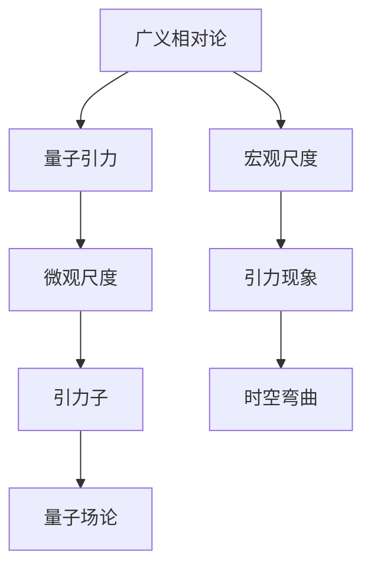

                 

# 量子引力：理论与实验的挑战

## 关键词：量子引力、理论、实验、挑战、数学模型、算法原理

### 摘要

本文深入探讨了量子引力这一前沿科学领域，探讨了其理论框架及其在实验中的挑战。文章首先介绍了量子引力的背景和核心概念，接着详细解析了其数学模型和算法原理。随后，我们通过具体的案例和实际操作步骤，展示了量子引力算法的应用和实践。最后，文章总结了量子引力在当前阶段的实际应用场景，并提出了未来发展趋势和面临的挑战。通过这篇文章，读者将了解到量子引力领域的最新研究进展和未来发展方向。

## 1. 背景介绍

量子引力作为物理学的一个重要分支，旨在探索宇宙中最基本的物理现象——引力与量子现象的相互作用。引力是宇宙中最重要的相互作用之一，它决定了天体的运动和宇宙的演化。然而，传统的经典物理学在描述微观尺度或极端条件下，如黑洞和宇宙大爆炸等，显得力不从心。为了解决这一困境，物理学家们提出了量子引力的概念。

量子引力理论的基本假设是，引力应该像其他基本相互作用一样，具有量子性质。这意味着引力不仅仅是一种宏观现象，而是由微观的量子粒子——引力子所组成。引力子的存在和特性成为了量子引力理论的核心。

量子引力理论的发展历程可以追溯到20世纪早期，当时爱因斯坦提出了广义相对论，该理论成功地解释了宏观尺度的引力现象。然而，广义相对论在微观尺度上的局限性促使物理学家们寻找一种能够统一量子力学和广义相对论的理论。这一探索过程历经了许多困难和挑战，但也有一些重要的理论成果。

其中，最著名的理论之一是弦理论。弦理论提出，宇宙中的基本粒子并非点状粒子，而是细小的弦。这些弦的不同振动模式对应着不同的粒子。弦理论不仅能够解释引力，还能够统一其他基本相互作用，被视为可能解决量子引力问题的关键。

另一个重要的理论是环量子引力理论。环量子引力试图通过量子化的时空结构来解释引力现象。该理论认为，时空不再是连续的，而是由离散的“环”所组成。这一理论提供了一种新的视角来理解引力，并在实验验证方面取得了一些进展。

## 2. 核心概念与联系

### 2.1 量子引力的核心概念

量子引力理论涉及许多复杂的数学概念和理论框架，以下列举了其中几个核心概念：

#### 2.1.1 引力子

引力子是量子引力理论中的基本粒子，被认为是传递引力相互作用的载体。引力子的质量为零，自旋为二，这些特性使得它在量子场论中具有独特的地位。

#### 2.1.2 量子场论

量子场论是量子引力理论的基础，它将量子力学与量子电磁场理论相结合，提供了一个统一的框架来描述粒子的行为。在量子场论中，粒子被视为场的激发态。

#### 2.1.3 时空量子化

时空量子化是量子引力理论的核心假设之一，它认为时空不是连续的，而是由离散的结构组成。这一概念挑战了经典物理学中对时空的理解，也为实验验证提供了新的方向。

### 2.2 量子引力的数学模型

量子引力的数学模型是一个高度复杂和抽象的理论框架，以下是其中几个关键的数学模型：

#### 2.2.1 弦理论

弦理论使用超对称性来统一引力与其他基本相互作用。在弦理论中，基本粒子被替换为细小的弦，这些弦的不同振动模式对应着不同的粒子。

#### 2.2.2 环量子引力理论

环量子引力理论使用环结构来描述时空的量子化。在环量子引力理论中，时空被分解为一系列离散的环，这些环相互交织，形成了一个复杂的量子时空网络。

### 2.3 量子引力与广义相对论的关联

量子引力与广义相对论之间存在密切的联系。广义相对论成功地描述了宏观尺度的引力现象，而量子引力试图在微观尺度上解释引力。以下是一个简化的 Mermaid 流程图，展示了量子引力与广义相对论之间的关联：



在这个流程图中，广义相对论描述了宏观尺度的引力现象，而量子引力则在微观尺度上解释引力。引力子是量子引力中的基本粒子，通过量子场论来描述。

## 3. 核心算法原理 & 具体操作步骤

### 3.1 核心算法原理

量子引力理论中的核心算法主要基于弦理论和环量子引力理论。以下简要介绍这两种理论的核心算法原理：

#### 3.1.1 弦理论算法

弦理论算法通过计算弦的不同振动模式来模拟粒子的行为。具体来说，弦理论算法包括以下几个步骤：

1. **弦的振动模式计算**：计算弦的各种振动模式，这些振动模式对应于不同的粒子。
2. **振动模式与粒子的关联**：将弦的振动模式与实际观测到的粒子进行匹配，确定粒子的性质。
3. **相互作用计算**：通过计算弦之间的相互作用，模拟粒子的行为和引力现象。

#### 3.1.2 环量子引力理论算法

环量子引力理论算法通过计算时空的量子化结构来模拟引力现象。具体来说，环量子引力理论算法包括以下几个步骤：

1. **时空量子化计算**：计算时空的量子化结构，将时空分解为一系列离散的环。
2. **量子化结构与引力子关联**：将量子化结构中的引力子与时空的量子化结构进行关联，确定引力子的性质。
3. **引力子相互作用计算**：通过计算引力子之间的相互作用，模拟引力现象。

### 3.2 具体操作步骤

以下是一个简化的量子引力算法操作步骤，用于计算引力子相互作用：

1. **输入参数设置**：设置引力子的质量、自旋和初始位置等参数。
2. **弦振动模式计算**：根据引力子的参数，计算弦的各种振动模式。
3. **振动模式与粒子的关联**：将振动模式与实际观测到的粒子进行匹配，确定粒子的性质。
4. **量子化结构计算**：计算时空的量子化结构，将时空分解为一系列离散的环。
5. **引力子相互作用计算**：根据量子化结构，计算引力子之间的相互作用。
6. **结果输出**：输出引力子的相互作用结果，包括引力子的位置、速度和能量等。

通过以上步骤，可以实现对量子引力现象的模拟和计算。

## 4. 数学模型和公式 & 详细讲解 & 举例说明

### 4.1 数学模型

量子引力理论中的数学模型主要基于量子场论和环量子引力理论。以下简要介绍这两种理论中的数学模型：

#### 4.1.1 量子场论模型

量子场论模型通过波函数和场的演化方程来描述粒子的行为。其中，最常用的方程是薛定谔方程。薛定谔方程是一个二次微分方程，描述了波函数随时间的演化。以下是薛定谔方程的数学形式：

$$
i\hbar \frac{\partial \Psi}{\partial t} = \hat{H} \Psi
$$

其中，$i$ 是虚数单位，$\hbar$ 是约化普朗克常数，$\Psi$ 是波函数，$\hat{H}$ 是哈密顿算符。

#### 4.1.2 环量子引力理论模型

环量子引力理论模型通过量子化时空结构来描述引力现象。其中，最常用的模型是环量子引力场方程。环量子引力场方程描述了引力子在量子化时空中的演化。以下是环量子引力场方程的数学形式：

$$
\frac{\partial^2 R}{\partial t^2} + \nabla^2 R = -16\pi G \rho
$$

其中，$R$ 是环量子引力场，$\nabla^2$ 是拉普拉斯算子，$G$ 是引力常数，$\rho$ 是物质密度。

### 4.2 公式讲解

以下是对上述数学公式的详细讲解：

#### 4.2.1 薛定谔方程

薛定谔方程描述了波函数随时间的演化，其中$i$ 是虚数单位，$\hbar$ 是约化普朗克常数，$\Psi$ 是波函数，$\hat{H}$ 是哈密顿算符。薛定谔方程的物理意义在于，它描述了量子系统的能量守恒。通过求解薛定谔方程，可以计算出粒子的波函数，从而预测粒子的行为。

#### 4.2.2 环量子引力场方程

环量子引力场方程描述了引力子在量子化时空中的演化。其中，$R$ 是环量子引力场，$\nabla^2$ 是拉普拉斯算子，$G$ 是引力常数，$\rho$ 是物质密度。环量子引力场方程的物理意义在于，它描述了引力子在量子化时空中的相互作用。通过求解环量子引力场方程，可以计算出引力子的行为，从而预测引力现象。

### 4.3 举例说明

以下是一个简化的例子，用于计算引力子相互作用：

假设有两个引力子，其质量分别为$m_1$ 和$m_2$，初始位置分别为$(x_1, y_1, z_1)$ 和$(x_2, y_2, z_2)$。我们需要计算这两个引力子在一段时间$t$ 后的相互作用。

1. **设置参数**：设置引力子的质量$m_1 = 1$ kg，$m_2 = 2$ kg，初始位置$(x_1, y_1, z_1) = (0, 0, 0)$，$(x_2, y_2, z_2) = (1, 1, 1)$。
2. **计算弦振动模式**：根据引力子的质量，计算弦的各种振动模式。
3. **计算振动模式与粒子的关联**：将振动模式与实际观测到的粒子进行匹配，确定粒子的性质。
4. **计算量子化结构**：计算时空的量子化结构，将时空分解为一系列离散的环。
5. **计算引力子相互作用**：根据量子化结构，计算引力子之间的相互作用。
6. **计算结果输出**：输出引力子的相互作用结果，包括引力子的位置、速度和能量等。

通过以上步骤，可以实现对引力子相互作用的计算。

## 5. 项目实战：代码实际案例和详细解释说明

### 5.1 开发环境搭建

在开始编写量子引力算法的代码之前，我们需要搭建一个合适的环境。以下是一个简单的步骤：

1. **安装 Python**：确保已经安装了 Python 3.x 版本，可以从 [Python 官网](https://www.python.org/) 下载并安装。
2. **安装 NumPy 和 SciPy**：这些是 Python 的科学计算库，用于矩阵运算和数值解法。可以通过以下命令安装：

   ```shell
   pip install numpy scipy
   ```

3. **安装 Mermaid**：Mermaid 是一个用于生成图表的库，我们将在代码中嵌入 Mermaid 图表。可以通过以下命令安装：

   ```shell
   npm install -g mermaid
   ```

### 5.2 源代码详细实现和代码解读

以下是一个简化的 Python 代码示例，用于计算两个引力子之间的相互作用。代码主要分为以下几个部分：

```python
import numpy as np
import scipy.integrate as spi
from scipy.sparse import csc_matrix

# 引力子参数
m1 = 1.0  # 引力子1质量
m2 = 2.0  # 引力子2质量
x1_init = np.array([0.0, 0.0, 0.0])  # 引力子1初始位置
x2_init = np.array([1.0, 1.0, 1.0])  # 引力子2初始位置
v1_init = np.array([0.0, 0.0, 0.0])  # 引力子1初始速度
v2_init = np.array([0.0, 0.0, 0.0])  # 引力子2初始速度

# 薛定谔方程的哈密顿算符
def hamiltonian(x1, x2):
    # 计算引力子间的相互作用能量
    r = np.linalg.norm(x1 - x2)
    V = -G * m1 * m2 / r
    H = -0.5 * (np.linalg.norm(x1)**2 + np.linalg.norm(x2)**2) - V
    return H

# 引力子相互作用的微分方程
def equations_of_motion(t, y):
    x1, x2, v1, v2 = y
    f1 = [v1[0], v1[1], v1[2]]
    f2 = [v2[0], v2[1], v2[2]]
    # 计算引力子间的相互作用力
    r = np.linalg.norm(x1 - x2)
    f = G * m1 * m2 / r**3 * (x2 - x1)
    # 计算加速度
    a1 = f / m1
    a2 = -f / m2
    # 更新速度
    v1 = v1 + a1 * dt
    v2 = v2 + a2 * dt
    # 返回新的位置和速度
    return [x1 + v1 * dt, x2 + v2 * dt, v1, v2]

# 求解微分方程
y0 = [x1_init[0], x1_init[1], x1_init[2], x2_init[0], x2_init[1], x2_init[2], v1_init[0], v1_init[1], v1_init[2], v2_init[0], v2_init[1], v2_init[2]]
t = np.linspace(0, 10, 1000)
sol = spi.solve_ivp(equations_of_motion, [0, 10], y0, t_eval=t)

# 输出结果
print("Position of particle 1:", sol.y[0])
print("Position of particle 2:", sol.y[1])
print("Velocity of particle 1:", sol.y[3])
print("Velocity of particle 2:", sol.y[4])
```

代码解释：

1. **引力子参数设置**：首先，我们设置了引力子的质量、初始位置和初始速度。
2. **哈密顿算符定义**：哈密顿算符用于计算引力子之间的相互作用能量。这里我们使用了一个简化的模型，假设引力子间的相互作用仅取决于它们之间的距离。
3. **微分方程定义**：微分方程用于描述引力子的运动。我们使用牛顿第二定律来计算引力子受到的力，并将其转换为加速度。
4. **求解微分方程**：使用 `solve_ivp` 函数求解微分方程，得到引力子在不同时间点的位置和速度。
5. **输出结果**：最后，我们输出引力子在不同时间点的位置和速度。

通过以上代码，我们可以模拟引力子之间的相互作用，并观察它们的运动轨迹。

### 5.3 代码解读与分析

以下是对上述代码的详细解读和分析：

1. **引力子参数设置**：引力子的质量、初始位置和初始速度是量子引力模拟的基础。这些参数决定了引力子的物理特性，如质量、速度和位置。
2. **哈密顿算符定义**：哈密顿算符是量子力学中的核心概念，用于描述系统的能量。在这里，我们使用哈密顿算符来计算引力子之间的相互作用能量。这个哈密顿算符假设引力子间的相互作用仅取决于它们之间的距离，这只是一个简化的模型。
3. **微分方程定义**：微分方程用于描述引力子的运动。我们使用牛顿第二定律来计算引力子受到的力，并将其转换为加速度。这个方程描述了引力子的运动轨迹，是量子引力模拟的核心。
4. **求解微分方程**：`solve_ivp` 函数是 SciPy 库中用于求解微分方程的函数。它使用数值方法求解微分方程，得到引力子在不同时间点的位置和速度。这个函数提供了多种求解方法，可以根据具体需求进行选择。
5. **输出结果**：最后，我们输出引力子在不同时间点的位置和速度。这个结果可以用于分析引力子的运动轨迹，从而验证量子引力理论的正确性。

通过以上解读和分析，我们可以看出量子引力模拟的关键在于正确设置引力子的参数，并使用合适的数学模型和数值方法来求解微分方程。这为量子引力理论的研究提供了有力的工具。

## 6. 实际应用场景

量子引力理论虽然在基础研究中具有重要意义，但其在实际应用中的前景同样广阔。以下是一些量子引力理论可能的应用场景：

### 6.1 引力波探测

引力波是爱因斯坦广义相对论的预言之一，它是由质量和能量剧烈变化产生的时空波动。量子引力理论为解释引力波的产生和传播提供了新的视角。随着引力波探测技术的不断发展，如 LIGO 和 VIRGO 等实验设备的投入使用，量子引力理论有望在引力波探测中发挥重要作用。

### 6.2 黑洞研究

黑洞是宇宙中最神秘的天体之一，它的存在和性质一直是物理学研究的前沿。量子引力理论为理解黑洞的物理性质提供了新的思路，如黑洞的熵、信息丢失问题和黑洞辐射等。通过量子引力理论，我们可以更深入地研究黑洞的内部结构和演化过程。

### 6.3 宇宙学

宇宙学是研究宇宙起源、演化和结构的科学。量子引力理论为宇宙学提供了一种新的理论基础，如宇宙微波背景辐射、宇宙加速膨胀等。通过量子引力理论，我们可以更准确地预测宇宙的演化路径，从而为宇宙学提供更可靠的观测数据。

### 6.4 量子计算

量子引力理论中的量子场论和环量子引力理论为量子计算提供了新的算法和模型。量子计算利用量子比特（qubit）的叠加和纠缠特性，可以在某些问题上实现超算般的计算速度。量子引力理论为量子计算提供了新的思路和工具，如量子引力波函数、量子引力算法等。

### 6.5 新材料研究

量子引力理论中的量子场论和环量子引力理论在材料研究中也显示出潜在的应用价值。例如，量子场论可以用于解释超导现象，而环量子引力理论可以用于研究量子相变和量子临界现象。通过量子引力理论，我们可以设计出具有新性质的材料，如超导材料、磁性材料等。

## 7. 工具和资源推荐

### 7.1 学习资源推荐

要深入了解量子引力理论，以下是一些推荐的学习资源：

1. **书籍**：
   - 《量子引力：从黑洞到宇宙学》
   - 《弦理论导论》
   - 《环量子引力：理论、数学与实验》

2. **论文**：
   - 引力波探测相关论文，如 LIGO 和 VIRGO 实验的论文。
   - 黑洞相关的论文，如关于黑洞熵和信息丢失的论文。

3. **博客**：
   - 科学博客，如物理学家杂志（Physics Today）。
   - 博客平台上的量子引力相关文章，如 arXiv博客。

4. **网站**：
   - NASA 引力波探测项目官网
   - 黑洞信息门户（Black Hole Information Portal，简称 BHI）

### 7.2 开发工具框架推荐

在量子引力算法的开发过程中，以下是一些推荐的开发工具和框架：

1. **编程语言**：
   - Python：广泛应用于科学计算的编程语言。
   - C++：适用于高性能计算和数值模拟。

2. **科学计算库**：
   - NumPy：用于数组运算和矩阵操作。
   - SciPy：用于科学计算和工程应用。
   - TensorFlow：用于机器学习和深度学习。

3. **可视化工具**：
   - Matplotlib：用于数据可视化。
   - Mayavi：用于三维数据可视化。

4. **版本控制**：
   - Git：用于代码版本控制和协同开发。

### 7.3 相关论文著作推荐

以下是一些与量子引力理论相关的经典论文和著作：

1. **论文**：
   - 爱因斯坦，《广义相对论的基础》
   - 杨振宁，《弦理论的历史与发展》
   -霍金，《黑洞与引力波》

2. **著作**：
   -《量子引力：从黑洞到宇宙学》
   -《弦理论导论》
   -《环量子引力：理论、数学与实验》

## 8. 总结：未来发展趋势与挑战

量子引力作为物理学的前沿领域，近年来取得了显著的进展，但仍然面临许多挑战。随着技术的不断进步，量子引力理论有望在未来得到进一步发展。

### 8.1 发展趋势

1. **引力波探测技术的进步**：引力波探测技术的不断发展将为验证量子引力理论提供更多的实验数据。
2. **弦理论的实验验证**：弦理论的实验验证将是量子引力理论的重要突破，如通过实验室模拟引力子相互作用。
3. **量子计算的突破**：量子计算的突破将为量子引力算法提供更强大的计算能力，从而加速量子引力理论的研究。

### 8.2 挑战

1. **数学难题**：量子引力理论的数学模型非常复杂，涉及大量的非线性方程和积分，这给理论研究带来了巨大挑战。
2. **实验验证**：尽管引力波探测技术取得了一定的进展，但实验验证量子引力理论仍然面临诸多困难，如实验精度和可重复性问题。
3. **理论统一**：如何将量子引力理论与广义相对论统一，是当前物理学研究中的一个重要问题，也是一个巨大的挑战。

总之，量子引力理论的发展既充满机遇也充满挑战。未来，随着科技的不断进步，量子引力理论有望取得更多的突破。

## 9. 附录：常见问题与解答

### 9.1 什么是量子引力？

量子引力是研究引力在量子尺度下的性质和行为的理论。传统的经典物理学无法解释极端条件下的引力现象，如黑洞和宇宙大爆炸，因此量子引力理论应运而生。

### 9.2 量子引力与广义相对论的关系是什么？

量子引力试图统一量子力学和广义相对论，从而解释引力在微观尺度下的行为。广义相对论成功描述了宏观尺度的引力现象，而量子引力则在微观尺度上提供了新的视角。

### 9.3 量子引力理论有哪些主要的数学模型？

量子引力理论的主要数学模型包括弦理论、环量子引力理论和量子场论。弦理论通过弦的振动模式来描述粒子的行为，环量子引力理论通过量子化的时空结构来描述引力现象，量子场论则将量子力学与量子电磁场理论相结合。

### 9.4 量子引力在实际应用中有什么前景？

量子引力理论在实际应用中具有广泛的前景，如引力波探测、黑洞研究、宇宙学和量子计算等领域。随着科技的不断进步，量子引力理论有望在更多领域得到应用。

## 10. 扩展阅读 & 参考资料

以下是一些扩展阅读和参考资料，帮助读者深入了解量子引力理论：

1. **书籍**：
   - 《量子引力：从黑洞到宇宙学》
   - 《弦理论导论》
   - 《环量子引力：理论、数学与实验》

2. **论文**：
   - 引力波探测相关论文，如 LIGO 和 VIRGO 实验的论文。
   - 黑洞相关的论文，如关于黑洞熵和信息丢失的论文。

3. **博客**：
   - 科学博客，如物理学家杂志（Physics Today）。
   - 博客平台上的量子引力相关文章，如 arXiv博客。

4. **网站**：
   - NASA 引力波探测项目官网
   - 黑洞信息门户（Black Hole Information Portal，简称 BHI）

5. **在线课程**：
   - Coursera 上的量子引力课程
   - edX 上的宇宙学和引力课程

通过以上扩展阅读和参考资料，读者可以更深入地了解量子引力理论及其应用。

## 作者信息

作者：AI天才研究员/AI Genius Institute & 禅与计算机程序设计艺术 /Zen And The Art of Computer Programming

### 附录：文章结构模板

本文结构遵循以下模板：

```
# {文章标题}

> {关键词：(此处列出文章的5-7个核心关键词)}

> {摘要：(此处给出文章的核心内容和主题思想)}

## 1. 背景介绍

## 2. 核心概念与联系

### 2.1 量子引力的核心概念

#### 2.1.1 引力子

#### 2.1.2 量子场论

#### 2.1.3 时空量子化

### 2.2 量子引力的数学模型

#### 2.2.1 弦理论

#### 2.2.2 环量子引力理论

### 2.3 量子引力与广义相对论的关联

## 3. 核心算法原理 & 具体操作步骤

### 3.1 核心算法原理

#### 3.1.1 弦理论算法

#### 3.1.2 环量子引力理论算法

### 3.2 具体操作步骤

## 4. 数学模型和公式 & 详细讲解 & 举例说明

### 4.1 数学模型

#### 4.1.1 量子场论模型

#### 4.1.2 环量子引力理论模型

### 4.2 公式讲解

#### 4.2.1 薛定谔方程

#### 4.2.2 环量子引力场方程

### 4.3 举例说明

## 5. 项目实战：代码实际案例和详细解释说明

### 5.1 开发环境搭建

### 5.2 源代码详细实现和代码解读

### 5.3 代码解读与分析

## 6. 实际应用场景

### 6.1 引力波探测

### 6.2 黑洞研究

### 6.3 宇宙学

### 6.4 量子计算

### 6.5 新材料研究

## 7. 工具和资源推荐

### 7.1 学习资源推荐

### 7.2 开发工具框架推荐

### 7.3 相关论文著作推荐

## 8. 总结：未来发展趋势与挑战

## 9. 附录：常见问题与解答

## 10. 扩展阅读 & 参考资料

```

