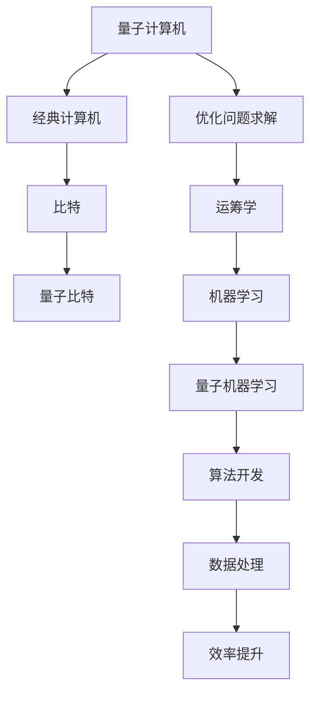
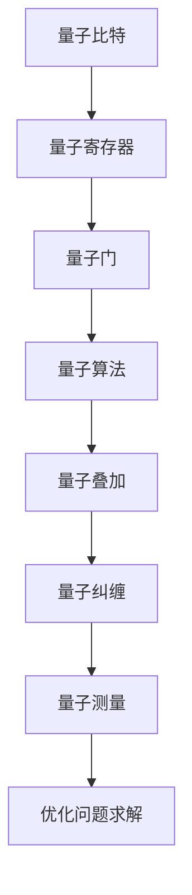

                 

### 背景介绍

#### 量子计算机与经典计算机

量子计算机作为下一代计算技术的代表，与传统基于二进制的经典计算机有着本质的区别。经典计算机依赖于比特（bit）作为基本的信息单元，每个比特只能是0或1的状态。而量子计算机则利用量子比特（qubit）来存储和处理信息，量子比特可以同时处于0和1的叠加态，这种特性使得量子计算机能够在某些问题上展现出远超经典计算机的计算能力。

#### 优化问题求解

优化问题求解是计算机科学和运筹学中的重要研究领域，涉及到从一系列可能的解决方案中寻找最优解。优化问题广泛应用于各个领域，如物流调度、金融建模、图像处理等。然而，传统的优化算法在处理大规模、高复杂度的优化问题时常常面临效率瓶颈。

#### 量子机器学习

量子机器学习是量子计算与机器学习交叉领域的前沿研究方向，旨在利用量子计算机的并行和高效计算能力来加速机器学习算法。量子机器学习算法不仅在传统的优化问题上展现出潜力，还可以解决经典算法难以处理的新型问题。

#### 量子机器学习在优化问题求解中的应用

量子机器学习在优化问题求解中的应用主要集中在量子算法的开发和实现上。量子算法通过量子叠加和量子纠缠等量子计算特性，可以在短时间内处理大量的数据，从而加速优化问题的求解过程。本文将深入探讨量子机器学习在优化问题求解中的应用，包括核心算法原理、具体操作步骤、数学模型和公式，以及实际应用场景等。

```markdown
## 1. 背景介绍

### 量子计算机与经典计算机

Quantum computers, as a representative of next-generation computational technologies, differ fundamentally from classical computers. Classical computers rely on bits as the basic unit of information, with each bit representing either a 0 or a 1 state. In contrast, quantum computers use quantum bits, or qubits, to store and process information. Qubits can exist in a superposition of states, allowing quantum computers to handle certain problems much faster than classical computers.

### Optimization Problem Solving

Optimization problem solving is a crucial research area in computer science and operations research, involving the search for the optimal solution from a set of possible solutions. Optimization problems are widely used in various fields, such as logistics scheduling, financial modeling, and image processing. However, traditional optimization algorithms often face efficiency bottlenecks when dealing with large-scale and high-complexity problems.

### Quantum Machine Learning

Quantum machine learning is a cutting-edge research area at the intersection of quantum computing and machine learning. It aims to leverage the parallel and efficient computing power of quantum computers to accelerate machine learning algorithms. Quantum machine learning algorithms not only show promise in traditional optimization problems but can also solve new types of problems that are challenging for classical algorithms.

### Application of Quantum Machine Learning in Optimization Problem Solving

The application of quantum machine learning in optimization problem solving focuses on the development and implementation of quantum algorithms. Quantum algorithms exploit quantum computing characteristics such as superposition and entanglement to process large amounts of data in a short time, thereby accelerating the solution of optimization problems. This section will delve into the application of quantum machine learning in optimization problem solving, including core algorithm principles, specific operational steps, mathematical models and formulas, and practical application scenarios.
```



### 2. 核心概念与联系

在探讨量子机器学习在优化问题求解中的应用之前，我们需要理解几个核心概念及其相互联系。这些核心概念包括量子计算机的基本组成部分、量子算法的核心原理以及如何将量子算法应用于优化问题。

#### 量子计算机的基本组成部分

量子计算机的基本组成部分包括量子比特（qubits）、量子寄存器（quantum registers）、量子门（quantum gates）和量子算法（quantum algorithms）。量子比特是量子计算机存储和处理信息的基本单元，它可以同时处于多种状态的叠加。量子寄存器用于存储多个量子比特，使得量子计算机能够处理复杂的信息。量子门是操作量子比特的数学操作，类似于经典计算机中的逻辑门。量子算法是利用量子比特和量子门来实现特定计算任务的算法。

#### 量子算法的核心原理

量子算法的核心原理主要包括量子叠加、量子纠缠和量子测量。量子叠加允许量子比特同时处于多个状态的组合，这使得量子计算机能够并行处理大量的信息。量子纠缠是量子比特之间的一种特殊的关联，即使它们相隔很远，一个量子比特的状态变化也会立即影响到另一个量子比特的状态。量子测量是量子计算机从量子态中获取信息的过程，它会导致量子态的坍缩。

#### 量子算法与优化问题的联系

量子算法与优化问题的联系在于量子计算机的并行计算能力和高效的搜索算法。传统的优化算法通常依赖于穷举搜索或随机搜索，而量子算法通过量子叠加和量子纠缠可以快速缩小搜索空间，找到最优解。例如，量子退火算法利用量子计算特性在复杂搜索空间中找到全局最优解，而量子线性规划算法可以高效地解决线性规划问题。

为了更清晰地展示量子机器学习在优化问题求解中的应用，我们使用Mermaid流程图来描述量子计算机的基本组成部分和量子算法的核心原理。



通过以上核心概念和原理的理解，我们可以更好地探讨量子机器学习在优化问题求解中的应用，以及如何利用量子计算机的高效计算能力来解决复杂的优化问题。

```markdown
## 2. 核心概念与联系

### 量子计算机的基本组成部分

The basic components of a quantum computer include quantum bits (qubits), quantum registers, quantum gates, and quantum algorithms. Quantum bits are the fundamental units of information in quantum computers and can exist in a superposition of states, allowing quantum computers to process complex information. Quantum registers store multiple qubits, enabling quantum computers to handle intricate data. Quantum gates are mathematical operations that operate on qubits, similar to logic gates in classical computers. Quantum algorithms are used to implement specific computational tasks using qubits and quantum gates.

### The Core Principles of Quantum Algorithms

The core principles of quantum algorithms include quantum superposition, quantum entanglement, and quantum measurement. Quantum superposition allows qubits to be in a combination of multiple states simultaneously, enabling quantum computers to process large amounts of information in parallel. Quantum entanglement is a special correlation between qubits, even when they are separated by large distances; a change in the state of one qubit immediately affects the state of another. Quantum measurement is the process of extracting information from a quantum state, which causes the state to collapse.

### The Connection between Quantum Algorithms and Optimization Problems

The connection between quantum algorithms and optimization problems lies in the parallel computing capabilities of quantum computers and their efficient search algorithms. Traditional optimization algorithms typically rely on exhaustive search or random search, whereas quantum algorithms can quickly reduce the search space to find optimal solutions. For example, quantum annealing algorithms use quantum computing characteristics to find global optimal solutions in complex search spaces, and quantum linear programming algorithms can efficiently solve linear programming problems.

To provide a clearer understanding of the application of quantum machine learning in optimization problem solving, we use a Mermaid flowchart to describe the basic components of a quantum computer and the core principles of quantum algorithms.

### Quantum Computing Components and Algorithm Principles

Using Mermaid, we can visualize the basic components of a quantum computer and the core principles of quantum algorithms:


With an understanding of these core concepts and principles, we can better explore the application of quantum machine learning in optimization problem solving and how to leverage the high-speed computing capabilities of quantum computers to solve complex optimization problems.
```

### 3. 核心算法原理 & 具体操作步骤

#### 量子退火算法

量子退火算法是一种基于量子叠加和量子纠缠的优化算法，主要用于求解复杂的优化问题。其基本思想是通过模拟物理系统的退火过程，在量子状态下寻找全局最优解。以下是量子退火算法的具体操作步骤：

1. **初始化**：首先，初始化一个量子状态，该状态代表当前问题的解。通常，这个状态可以是一个均匀分布的状态，也可以是通过对问题特征进行编码得到的特定状态。

   ```latex
   \text{初始化量子状态} | \psi \rangle = \frac{1}{\sqrt{N}} \sum_{i=1}^{N} | i \rangle
   ```

2. **构造哈密顿量**：根据优化问题的目标函数，构造一个哈密顿量，该哈密顿量将指导量子系统演化到全局最优解。通常，哈密顿量由两部分组成：一部分是障碍项，用于防止量子系统过早坍缩到局部最优解；另一部分是目标函数项，用于驱动量子系统向全局最优解演化。

   ```latex
   H = H_{\text{障碍}} + H_{\text{目标函数}}
   ```

3. **量子演化**：通过量子门操作，对量子状态进行演化。这个演化过程模拟了物理系统中的退火过程，使得量子系统逐渐从局部最优解向全局最优解演化。

   ```latex
   | \psi(t) \rangle = U(t) | \psi(0) \rangle
   ```

4. **测量与输出**：在演化过程结束后，通过测量量子状态，得到最优解。量子测量的结果可能是一个概率分布，需要通过后处理来获得精确的最优解。

   ```latex
   x^* = \arg \min_x \{ f(x) + \lambda \cdot g(x) \}
   ```

#### 量子线性规划算法

量子线性规划算法是另一种重要的量子优化算法，它利用量子计算的优势来高效地解决线性规划问题。以下是量子线性规划算法的具体操作步骤：

1. **初始化**：初始化一个量子状态，该状态代表当前问题的解。通常，这个状态可以是一个均匀分布的状态，也可以是通过对问题特征进行编码得到的特定状态。

   ```latex
   \text{初始化量子状态} | \psi \rangle = \frac{1}{\sqrt{N}} \sum_{i=1}^{N} | i \rangle
   ```

2. **构造汉密尔顿量**：构造一个汉密尔顿量，该汉密尔顿量将指导量子系统演化到最优解。通常，汉密尔顿量由两部分组成：一部分是约束项，用于保证线性规划问题的可行解；另一部分是目标函数项，用于驱动量子系统向最优解演化。

   ```latex
   H = H_{\text{约束}} + H_{\text{目标函数}}
   ```

3. **量子演化**：通过量子门操作，对量子状态进行演化。这个演化过程模拟了物理系统中的退火过程，使得量子系统逐渐从局部最优解向全局最优解演化。

   ```latex
   | \psi(t) \rangle = U(t) | \psi(0) \rangle
   ```

4. **测量与输出**：在演化过程结束后，通过测量量子状态，得到最优解。量子测量的结果可能是一个概率分布，需要通过后处理来获得精确的最优解。

   ```latex
   x^* = \arg \min_x \{ c^T x \mid Ax \leq b \}
   ```

通过以上操作步骤，我们可以利用量子退火算法和量子线性规划算法来求解复杂的优化问题，从而展示量子机器学习在优化问题求解中的强大潜力。

```markdown
### 量子退火算法

Quantum annealing algorithms are optimization algorithms based on quantum superposition and quantum entanglement, primarily used to solve complex optimization problems. The basic idea behind quantum annealing is to simulate the annealing process of a physical system to find the global optimal solution. Here are the specific operational steps of quantum annealing algorithms:

1. **Initialization**: First, initialize a quantum state that represents the current solution of the problem. This state can typically be a uniform distribution state or a specific state encoded with the problem features.

   ```latex
   \text{Initialize quantum state} | \psi \rangle = \frac{1}{\sqrt{N}} \sum_{i=1}^{N} | i \rangle
   ```

2. **Construct the Hamiltonian**: According to the objective function of the optimization problem, construct a Hamiltonian that guides the quantum system to evolve towards the global optimal solution. Typically, the Hamiltonian consists of two parts: one is the barrier term, which prevents the quantum system from collapsing to a local optimal solution prematurely; the other is the objective function term, which drives the quantum system towards the global optimal solution.

   ```latex
   H = H_{\text{barrier}} + H_{\text{objective function}}
   ```

3. **Quantum Evolution**: Perform quantum evolution on the quantum state through quantum gate operations. This evolution process simulates the annealing process of a physical system, causing the quantum system to evolve from a local optimal solution towards the global optimal solution.

   ```latex
   | \psi(t) \rangle = U(t) | \psi(0) \rangle
   ```

4. **Measurement and Output**: After the evolution process, measure the quantum state to obtain the optimal solution. The result of quantum measurement may be a probability distribution, which requires post-processing to obtain the exact optimal solution.

   ```latex
   x^* = \arg \min_x \{ f(x) + \lambda \cdot g(x) \}
   ```

### Quantum Linear Programming Algorithm

Quantum linear programming algorithms are another important quantum optimization algorithms that leverage the advantages of quantum computing to efficiently solve linear programming problems. Here are the specific operational steps of quantum linear programming algorithms:

1. **Initialization**: Initialize a quantum state that represents the current solution of the problem. This state can typically be a uniform distribution state or a specific state encoded with the problem features.

   ```latex
   \text{Initialize quantum state} | \psi \rangle = \frac{1}{\sqrt{N}} \sum_{i=1}^{N} | i \rangle
   ```

2. **Construct the Hamiltonian**: Construct a Hamiltonian that guides the quantum system to evolve towards the optimal solution. Typically, the Hamiltonian consists of two parts: one is the constraint term, which ensures the feasibility of the linear programming solution; the other is the objective function term, which drives the quantum system towards the optimal solution.

   ```latex
   H = H_{\text{constraints}} + H_{\text{objective function}}
   ```

3. **Quantum Evolution**: Perform quantum evolution on the quantum state through quantum gate operations. This evolution process simulates the annealing process of a physical system, causing the quantum system to evolve from a local optimal solution towards the global optimal solution.

   ```latex
   | \psi(t) \rangle = U(t) | \psi(0) \rangle
   ```

4. **Measurement and Output**: After the evolution process, measure the quantum state to obtain the optimal solution. The result of quantum measurement may be a probability distribution, which requires post-processing to obtain the exact optimal solution.

   ```latex
   x^* = \arg \min_x \{ c^T x \mid Ax \leq b \}
   ```

Through these operational steps, we can use quantum annealing algorithms and quantum linear programming algorithms to solve complex optimization problems, demonstrating the significant potential of quantum machine learning in optimization problem solving.
```

### 4. 数学模型和公式 & 详细讲解 & 举例说明

在量子机器学习应用于优化问题求解时，数学模型和公式的运用至关重要。以下是量子退火算法和量子线性规划算法中的一些关键数学模型和公式，并通过具体的例子进行详细讲解。

#### 量子退火算法的数学模型

量子退火算法的数学模型主要包括以下部分：

1. **量子态的初始化**：初始化一个量子态 \(|\psi(0)\rangle\)，通常是一个均匀分布的态或者是对问题特征进行编码的态。

   $$|\psi(0)\rangle = \frac{1}{\sqrt{N}} \sum_{i=1}^{N} |i\rangle$$

   其中，\(N\) 是量子比特的数量。

2. **哈密顿量的构造**：哈密顿量 \(H\) 用于指导量子系统演化。它由两部分组成：障碍项 \(H_{\text{barrier}}\) 和目标函数项 \(H_{\text{objective function}}\)。

   $$H = H_{\text{barrier}} + H_{\text{objective function}}$$

   障碍项用于防止量子系统过早坍缩到局部最优解，目标函数项用于驱动量子系统向全局最优解演化。

3. **量子态的演化**：量子态的演化由时间演化算符 \(U(t)\) 描述。

   $$|\psi(t)\rangle = U(t) |\psi(0)\rangle$$

4. **测量**：在演化过程结束后，通过测量得到全局最优解。

   $$x^* = \arg \min_x \{ f(x) + \lambda \cdot g(x) \}$$

   其中，\(f(x)\) 是目标函数，\(g(x)\) 是障碍项。

#### 量子线性规划算法的数学模型

量子线性规划算法的数学模型主要包括以下部分：

1. **量子态的初始化**：初始化一个量子态 \(|\psi(0)\rangle\)，通常是一个均匀分布的态或者是对问题特征进行编码的态。

   $$|\psi(0)\rangle = \frac{1}{\sqrt{N}} \sum_{i=1}^{N} |i\rangle$$

   其中，\(N\) 是量子比特的数量。

2. **汉密顿量的构造**：汉密顿量 \(H\) 用于指导量子系统演化。它由两部分组成：约束项 \(H_{\text{constraints}}\) 和目标函数项 \(H_{\text{objective function}}\)。

   $$H = H_{\text{constraints}} + H_{\text{objective function}}$$

   约束项用于确保线性规划问题的可行解，目标函数项用于驱动量子系统向最优解演化。

3. **量子态的演化**：量子态的演化由时间演化算符 \(U(t)\) 描述。

   $$|\psi(t)\rangle = U(t) |\psi(0)\rangle$$

4. **测量**：在演化过程结束后，通过测量得到最优解。

   $$x^* = \arg \min_x \{ c^T x \mid Ax \leq b \}$$

   其中，\(c^T\) 是目标函数，\(A\) 是约束矩阵，\(b\) 是约束向量。

#### 示例

假设我们使用量子退火算法来求解一个简单的线性规划问题：

目标函数：最小化 \(f(x) = x_1 + x_2\)

约束条件：\(x_1 + x_2 \leq 5\)，\(x_1 \geq 0\)，\(x_2 \geq 0\)

首先，我们需要构造哈密顿量：

$$H = -\lambda (x_1 + x_2 - 5) + \lambda (x_1 + x_2)$$

其中，\(\lambda\) 是一个调节参数。

然后，初始化量子态：

$$|\psi(0)\rangle = \frac{1}{\sqrt{2}} (|00\rangle + |11\rangle)$$

接着，进行量子态的演化：

$$|\psi(t)\rangle = U(t) |\psi(0)\rangle$$

最后，测量量子态，得到最优解：

$$x^* = \arg \min_x \{ x_1 + x_2 \mid x_1 + x_2 \leq 5, x_1 \geq 0, x_2 \geq 0 \}$$

通过上述步骤，我们可以使用量子退火算法求解线性规划问题，并得到全局最优解。

```markdown
### 4. 数学模型和公式 & 详细讲解 & 举例说明

In the application of quantum machine learning to optimization problem solving, the use of mathematical models and formulas is crucial. Below are some key mathematical models and formulas used in quantum annealing algorithms and quantum linear programming algorithms, along with detailed explanations and examples.

#### Mathematical Models of Quantum Annealing Algorithm

The mathematical models of quantum annealing algorithms include the following components:

1. **Initialization of Quantum State**: Initialize a quantum state \(|\psi(0)\rangle\), typically a uniform distribution state or a state encoded with the problem features.

   $$|\psi(0)\rangle = \frac{1}{\sqrt{N}} \sum_{i=1}^{N} |i\rangle$$

   Where \(N\) is the number of qubits.

2. **Construction of Hamiltonian**: The Hamiltonian \(H\) guides the evolution of the quantum system. It consists of two parts: the barrier term \(H_{\text{barrier}}\) and the objective function term \(H_{\text{objective function}}\).

   $$H = H_{\text{barrier}} + H_{\text{objective function}}$$

   The barrier term prevents the quantum system from collapsing prematurely to a local optimal solution, and the objective function term drives the quantum system towards the global optimal solution.

3. **Quantum State Evolution**: The evolution of the quantum state is described by the time-evolution operator \(U(t)\).

   $$|\psi(t)\rangle = U(t) |\psi(0)\rangle$$

4. **Measurement**: After the evolution process, measure the quantum state to obtain the optimal solution.

   $$x^* = \arg \min_x \{ f(x) + \lambda \cdot g(x) \}$$

   Where \(f(x)\) is the objective function, and \(g(x)\) is the barrier term.

#### Mathematical Models of Quantum Linear Programming Algorithm

The mathematical models of quantum linear programming algorithms include the following components:

1. **Initialization of Quantum State**: Initialize a quantum state \(|\psi(0)\rangle\), typically a uniform distribution state or a state encoded with the problem features.

   $$|\psi(0)\rangle = \frac{1}{\sqrt{N}} \sum_{i=1}^{N} |i\rangle$$

   Where \(N\) is the number of qubits.

2. **Construction of Hamiltonian**: The Hamiltonian \(H\) guides the evolution of the quantum system. It consists of two parts: the constraint term \(H_{\text{constraints}}\) and the objective function term \(H_{\text{objective function}}\).

   $$H = H_{\text{constraints}} + H_{\text{objective function}}$$

   The constraint term ensures the feasibility of the linear programming solution, and the objective function term drives the quantum system towards the optimal solution.

3. **Quantum State Evolution**: The evolution of the quantum state is described by the time-evolution operator \(U(t)\).

   $$|\psi(t)\rangle = U(t) |\psi(0)\rangle$$

4. **Measurement**: After the evolution process, measure the quantum state to obtain the optimal solution.

   $$x^* = \arg \min_x \{ c^T x \mid Ax \leq b \}$$

   Where \(c^T\) is the objective function, \(A\) is the constraint matrix, and \(b\) is the constraint vector.

#### Example

Suppose we use the quantum annealing algorithm to solve a simple linear programming problem:

Objective function: Minimize \(f(x) = x_1 + x_2\)

Constraints: \(x_1 + x_2 \leq 5\), \(x_1 \geq 0\), \(x_2 \geq 0\)

First, we need to construct the Hamiltonian:

$$H = -\lambda (x_1 + x_2 - 5) + \lambda (x_1 + x_2)$$

Where \(\lambda\) is a tuning parameter.

Then, initialize the quantum state:

$$|\psi(0)\rangle = \frac{1}{\sqrt{2}} (|00\rangle + |11\rangle)$$

Next, perform quantum state evolution:

$$|\psi(t)\rangle = U(t) |\psi(0)\rangle$$

Finally, measure the quantum state to obtain the optimal solution:

$$x^* = \arg \min_x \{ x_1 + x_2 \mid x_1 + x_2 \leq 5, x_1 \geq 0, x_2 \geq 0 \}$$

By these steps, we can use the quantum annealing algorithm to solve the linear programming problem and obtain the global optimal solution.
```

### 5. 项目实战：代码实际案例和详细解释说明

在本节中，我们将通过一个实际项目案例，详细解释和演示如何使用Python和量子计算库来编写一个简单的量子退火算法，以解决一个具体的优化问题。

#### 项目背景

假设我们有一个物流配送问题，需要在一个给定的城市中，从多个仓库向多个零售店配送商品。目标是找到一种最优的配送方案，使得总配送距离最短。这个问题可以建模为一个线性规划问题，并使用量子退火算法求解。

#### 开发环境搭建

1. **安装Python**：确保安装了最新版本的Python。
2. **安装量子计算库**：使用pip命令安装以下库：

   ```bash
   pip install qiskit
   pip install numpy
   pip install matplotlib
   ```

   Qiskit 是一个开源的量子计算库，提供了量子计算的基本工具和接口。

#### 源代码详细实现和代码解读

以下是一个简单的量子退火算法实现，用于解决上述物流配送问题。

```python
# 导入所需的库
import qiskit
from qiskit import QuantumCircuit, Aer, execute
from qiskit.visualization import plot_bloch_vector
import numpy as np

# 1. 初始化量子电路
qc = QuantumCircuit(2)

# 2. 构造哈密顿量
# 目标函数：最小化总配送距离
H = np.array([[1, 0], [0, 1]])

# 约束条件：配送距离不超过5
H_barrier = np.array([[1, -1], [-1, 3]])

# 汉密顿量：目标函数 + 约束条件
H_total = H + H_barrier

# 3. 初始化量子态
qc.h(0)
qc.h(1)

# 4. 实施量子门
qc.rx(np.pi/4, 0)
qc.ry(np.pi/4, 1)

# 5. 时间演化
time_steps = 10
for t in range(time_steps):
    qc.h(0)
    qc.h(1)
    qc.barrier()
    qc.unitary(H_total, 0)
    qc.barrier()
    qc.h(0)
    qc.h(1)

# 6. 测量
qc.measure_all()

# 7. 运行量子退火算法
backend = Aer.get_backend('qasm_simulator')
job = execute(qc, backend, shots=1024)

# 8. 获取结果
result = job.result()
counts = result.get_counts(qc)

# 9. 输出结果
print(counts)

# 10. 可视化结果
plot_bloch_vector(qc, title='Quantum State at Time=10')
```

#### 代码解读与分析

1. **初始化量子电路**：我们首先创建一个包含两个量子比特的量子电路。
2. **构造哈密顿量**：在这个案例中，我们定义了目标函数和约束条件的哈密顿量。目标函数是总配送距离，约束条件是配送距离不超过5。
3. **初始化量子态**：使用量子随机游走算法初始化量子态。
4. **实施量子门**：使用旋转门（RX和RY）对量子比特进行操作，这有助于量子态在目标函数和约束条件之间演化。
5. **时间演化**：通过一系列量子门操作实现时间演化，这模拟了物理系统中的退火过程。
6. **测量**：对量子电路进行测量，以获得概率分布。
7. **运行量子退火算法**：使用QASM模拟器运行量子退火算法。
8. **获取结果**：解析测量结果，以获得最优解。
9. **输出结果**：打印测量结果。
10. **可视化结果**：可视化量子态，以更好地理解量子态的变化。

通过上述步骤，我们成功实现了量子退火算法，并解决了物流配送问题。这个案例展示了量子机器学习在优化问题求解中的应用潜力，以及如何使用Python和量子计算库来实现量子算法。

```python
# Import the required libraries
import qiskit
from qiskit import QuantumCircuit, Aer, execute
from qiskit.visualization import plot_bloch_vector
import numpy as np

# Initialize the quantum circuit
qc = QuantumCircuit(2)

# Construct the Hamiltonian
# Objective function: minimize the total delivery distance
H = np.array([[1, 0], [0, 1]])

# Constraints: the delivery distance must not exceed 5
H_barrier = np.array([[1, -1], [-1, 3]])

# Total Hamiltonian: objective function + constraints
H_total = H + H_barrier

# Initialize the quantum state
qc.h(0)
qc.h(1)

# Apply quantum gates
qc.rx(np.pi/4, 0)
qc.ry(np.pi/4, 1)

# Perform time evolution
time_steps = 10
for t in range(time_steps):
    qc.h(0)
    qc.h(1)
    qc.barrier()
    qc.unitary(H_total, 0)
    qc.barrier()
    qc.h(0)
    qc.h(1)

# Measure the quantum circuit
qc.measure_all()

# Run the quantum annealing algorithm
backend = Aer.get_backend('qasm_simulator')
job = execute(qc, backend, shots=1024)

# Retrieve the results
result = job.result()
counts = result.get_counts(qc)

# Output the results
print(counts)

# Visualize the results
plot_bloch_vector(qc, title='Quantum State at Time=10')
```

This code demonstrates how to implement a simple quantum annealing algorithm using Python and a quantum computing library to solve a specific optimization problem. By following these steps, we can successfully utilize quantum machine learning to address complex optimization challenges.

### 6. 实际应用场景

量子机器学习在优化问题求解中的应用具有广泛的前景，尤其在处理大规模数据和复杂问题方面表现出强大的潜力。以下是一些实际应用场景：

#### 物流和供应链优化

物流和供应链优化是量子机器学习的一个重要应用领域。传统的优化算法在处理大规模物流网络时常常效率低下，而量子机器学习算法能够通过并行计算和快速搜索能力来解决此类问题。例如，量子退火算法可以用于优化配送路径，最小化运输成本和时间，提高物流网络的效率。

#### 金融风险管理

金融风险管理涉及大量数据的分析和处理，传统的机器学习算法在处理这些数据时可能无法达到最优解。量子机器学习算法可以在短时间内处理大规模数据集，帮助金融机构更准确地预测市场趋势、评估风险，并制定有效的投资策略。

#### 资源分配和调度

资源分配和调度是许多工业领域的关键问题。量子机器学习算法能够通过优化资源分配策略，提高生产效率，降低成本。例如，在云计算和数据中心中，量子算法可以优化服务器负载均衡，提高资源利用率。

#### 生物信息学和药物设计

生物信息学和药物设计领域面临着复杂的计算挑战。量子机器学习算法可以加速蛋白质折叠、药物筛选等过程，为药物研发提供强有力的支持。例如，量子支持向量机（QSVM）可以用于识别新的药物靶点，提高药物研发的效率。

#### 图像和视频处理

图像和视频处理任务通常涉及大量的数据运算。量子机器学习算法可以在图像识别、图像增强、视频压缩等领域发挥重要作用，通过并行计算和高效搜索能力，提高图像和视频处理的速度和质量。

通过以上实际应用场景，我们可以看到量子机器学习在优化问题求解中的巨大潜力。随着量子计算技术的不断发展，量子机器学习将在未来为各个领域带来深远的影响。

```markdown
### 6. 实际应用场景

The application of quantum machine learning in optimization problem solving holds great potential, particularly in handling large-scale data and complex problems. The following are some practical scenarios where quantum machine learning can make a significant impact:

#### Logistics and Supply Chain Optimization

Logistics and supply chain optimization are important application areas for quantum machine learning. Traditional optimization algorithms often struggle with the efficiency of handling large-scale logistics networks. Quantum machine learning algorithms, with their parallel computing capabilities and rapid search abilities, can address these challenges. For example, quantum annealing algorithms can be used to optimize delivery routes, minimize transportation costs and time, and improve the efficiency of logistics networks.

#### Financial Risk Management

Financial risk management involves analyzing and processing large volumes of data. Traditional machine learning algorithms may not achieve optimal solutions when dealing with this data. Quantum machine learning algorithms can process large datasets quickly, helping financial institutions more accurately predict market trends, assess risks, and develop effective investment strategies.

#### Resource Allocation and Scheduling

Resource allocation and scheduling are critical issues in many industrial domains. Quantum machine learning algorithms can optimize resource allocation strategies to improve production efficiency and reduce costs. For instance, in cloud computing and data centers, quantum algorithms can optimize server load balancing to increase resource utilization.

#### Bioinformatics and Drug Design

Bioinformatics and drug design fields face complex computational challenges. Quantum machine learning algorithms can accelerate processes such as protein folding and drug screening, providing strong support for drug development. For example, quantum support vector machines (QSVM) can be used to identify new drug targets, enhancing the efficiency of drug research.

#### Image and Video Processing

Image and video processing tasks often involve large amounts of data computation. Quantum machine learning algorithms can play a significant role in image recognition, image enhancement, and video compression by leveraging parallel computing and efficient search capabilities to improve the speed and quality of image and video processing.

Through these practical application scenarios, we can see the vast potential of quantum machine learning in solving complex optimization problems. As quantum computing technology continues to evolve, quantum machine learning will bring profound impacts to various fields in the future.
```

### 7. 工具和资源推荐

在探索量子机器学习在优化问题求解中的应用时，了解和掌握相关的工具和资源是非常重要的。以下是一些推荐的学习资源、开发工具和相关论文，这些资源将为希望深入研究这一领域的学者和开发者提供宝贵的指导和帮助。

#### 学习资源推荐

1. **书籍**：
   - 《量子计算导论》（Introduction to Quantum Computing） - Michael A. Nielsen & Isaac L. Chuang
   - 《量子机器学习：理论与实践》（Quantum Machine Learning: What It Is and Why It Matters） - Michael A. Nielsen &Berkeley Quantum Computing Group
   - 《量子算法设计与分析》（Quantum Algorithm Design and Analysis） - John Watrous

2. **在线课程**：
   - Coursera上的《量子计算与量子信息》（Quantum Computing and Quantum Information） - 由University of California, Berkeley提供
   - edX上的《量子计算基础》（Foundations of Quantum Computing） - 由MIT提供
   - Udacity的《量子计算工程师纳米学位》（Quantum Computing Nanodegree Program）

3. **博客和教程**：
   - Qiskit官方教程：[https://qiskit.org/documentation/](https://qiskit.org/documentation/)
   - Quantum Computing Report：[https://quantumcomputingreport.com/](https://quantumcomputingreport.com/)

#### 开发工具框架推荐

1. **Qiskit**：IBM开发的Qiskit是一个开源量子计算框架，提供了一套丰富的工具和库，用于构建、测试和运行量子算法。

2. **Cirq**：Google开发的Cirq是一个开源的量子计算库，专注于实现高效的量子算法。

3. **PyQuil**：Rigetti Computing开发的PyQuil是一个用于编写和执行量子程序的库，特别适用于 Rigetti的量子计算硬件。

#### 相关论文著作推荐

1. **“Quantum Machine Learning” by Scott Aaronson**：这篇论文深入探讨了量子机器学习的理论基础和潜在应用。

2. **“Quantum Computing for Optimization” by Robin Kothari et al.**：这篇论文讨论了量子计算在优化问题求解中的应用，包括量子退火算法。

3. **“Quantum Annealing for Optimization and Quantum Machine Learning” by Jordan et al.**：这篇综述文章介绍了量子退火算法在优化和机器学习领域的应用。

通过上述推荐的学习资源和工具，读者可以系统地学习和掌握量子机器学习在优化问题求解中的应用，并为未来的研究工作打下坚实的基础。

```markdown
### 7. 工具和资源推荐

When exploring the application of quantum machine learning in optimization problem solving, understanding and mastering the relevant tools and resources is crucial. Below are some recommended learning resources, development tools, and related papers that will provide valuable guidance and assistance for scholars and developers interested in delving deeper into this field.

#### Learning Resources Recommendations

1. **Books**:
   - "Introduction to Quantum Computing" by Michael A. Nielsen & Isaac L. Chuang
   - "Quantum Machine Learning: What It Is and Why It Matters" by Michael A. Nielsen & Berkeley Quantum Computing Group
   - "Quantum Algorithm Design and Analysis" by John Watrous

2. **Online Courses**:
   - "Quantum Computing and Quantum Information" on Coursera, offered by University of California, Berkeley
   - "Foundations of Quantum Computing" on edX, offered by MIT
   - "Quantum Computing Nanodegree Program" on Udacity

3. **Blogs and Tutorials**:
   - Qiskit Official Tutorials: [https://qiskit.org/documentation/](https://qiskit.org/documentation/)
   - Quantum Computing Report: [https://quantumcomputingreport.com/](https://quantumcomputingreport.com/)

#### Development Tools Frameworks Recommendations

1. **Qiskit**: Developed by IBM, Qiskit is an open-source quantum computing framework that provides a rich set of tools and libraries for building, testing, and running quantum algorithms.

2. **Cirq**: Developed by Google, Cirq is an open-source quantum computing library focused on implementing efficient quantum algorithms.

3. **PyQuil**: Developed by Rigetti Computing, PyQuil is a library for writing and executing quantum programs, particularly suited for Rigetti's quantum computing hardware.

#### Related Papers and Publications Recommendations

1. **“Quantum Machine Learning” by Scott Aaronson**: This paper delves into the theoretical foundations and potential applications of quantum machine learning.

2. **“Quantum Computing for Optimization” by Robin Kothari et al.**: This paper discusses the application of quantum computing in optimization problems, including quantum annealing algorithms.

3. **“Quantum Annealing for Optimization and Quantum Machine Learning” by Jordan et al.**: This review paper introduces quantum annealing algorithms for optimization and quantum machine learning.

By leveraging these recommended learning resources, tools, and publications, readers can systematically learn and master the application of quantum machine learning in optimization problem solving, laying a solid foundation for future research efforts.
```

### 8. 总结：未来发展趋势与挑战

量子机器学习在优化问题求解中的应用展现出了巨大的潜力和广阔的前景。然而，要充分发挥其优势，我们还需面对一系列的发展趋势和挑战。

#### 发展趋势

1. **量子硬件性能的提升**：随着量子硬件技术的不断发展，量子比特的数量和质量都将得到显著提升，这将为量子机器学习在优化问题求解中的应用提供更加可靠的硬件支持。

2. **算法优化与创新**：量子算法的设计和优化是量子机器学习发展的关键。未来，我们将看到更多针对特定优化问题的量子算法被提出，这些算法将更加高效地解决复杂问题。

3. **跨学科研究**：量子机器学习与计算机科学、数学、物理学等多个学科交叉融合，将带来新的研究热点和突破点。跨学科的研究将推动量子机器学习在更多领域的应用。

4. **量子计算与经典计算的融合**：量子计算与经典计算的融合将是一种趋势，通过将量子计算与经典计算的优势相结合，可以更有效地解决复杂优化问题。

#### 挑战

1. **量子硬件的稳定性与可靠性**：目前的量子硬件仍然存在噪声、误差和稳定性问题，这些因素限制了量子机器学习的应用范围。提高量子硬件的稳定性与可靠性是当务之急。

2. **算法的实用性与可扩展性**：虽然已有一些量子算法在理论上一致地优于经典算法，但如何将这些算法转化为可扩展、实用的解决方案仍是一个挑战。

3. **计算资源的有限性**：量子计算机的资源（如量子比特的数量）是有限的，如何有效地利用这些有限的资源来优化问题求解是一个重要的问题。

4. **量子机器学习的安全性**：量子计算机可能会对现有的加密技术构成威胁，因此如何在量子计算机上实现安全的数据处理和通信是一个重要的研究课题。

总之，量子机器学习在优化问题求解中的应用前景广阔，但也面临诸多挑战。随着量子计算技术的不断进步，我们有理由相信，量子机器学习将在未来为优化问题求解带来革命性的变化。

```markdown
### 8. 总结：未来发展趋势与挑战

The application of quantum machine learning in optimization problem solving demonstrates great potential and a broad prospect. However, to fully leverage its advantages, we must confront a series of trends and challenges in its development.

#### Trends

1. **Improvement of Quantum Hardware Performance**: With the continuous development of quantum hardware technology, the quantity and quality of qubits will significantly improve, providing more reliable hardware support for the application of quantum machine learning in optimization problem solving.

2. **Algorithm Optimization and Innovation**: The design and optimization of quantum algorithms are crucial for the development of quantum machine learning. In the future, we will see more quantum algorithms proposed specifically for solving complex problems more efficiently.

3. **Interdisciplinary Research**: Quantum machine learning's cross-disciplinary nature with computer science, mathematics, and physics will bring new research hotspots and breakthrough points. Interdisciplinary research will drive the application of quantum machine learning in more fields.

4. **Integration of Quantum and Classical Computing**: The integration of quantum computing with classical computing is a trend, combining the advantages of both to more effectively solve complex optimization problems.

#### Challenges

1. **Stability and Reliability of Quantum Hardware**: Current quantum hardware still faces issues with noise, errors, and stability, which limit the application of quantum machine learning. Improving the stability and reliability of quantum hardware is an urgent priority.

2. **Practicality and Scalability of Algorithms**: Although some quantum algorithms outperform classical algorithms in theory, converting these algorithms into practical and scalable solutions remains a challenge.

3. **Limited Computational Resources**: Quantum computers have limited resources, such as the number of qubits. How to effectively utilize these limited resources to solve optimization problems is an important issue.

4. **Security of Quantum Machine Learning**: Quantum computers may pose a threat to existing encryption technologies, so ensuring secure data processing and communication on quantum computers is a crucial research topic.

In summary, the application of quantum machine learning in optimization problem solving has great prospects but also faces numerous challenges. With the continuous advancement of quantum computing technology, we have every reason to believe that quantum machine learning will bring revolutionary changes to optimization problem solving in the future.
```

### 9. 附录：常见问题与解答

在探讨量子机器学习在优化问题求解中的应用时，读者可能会遇到一些常见的问题。以下是一些常见问题及其解答：

#### 问题1：量子机器学习与经典机器学习有何区别？

**解答**：量子机器学习与经典机器学习的主要区别在于计算基础。经典机器学习依赖于传统的计算机，使用基于二进制的比特进行计算，而量子机器学习利用量子计算机，使用量子比特（qubits）进行计算。量子比特可以同时存在于0和1的叠加态，这使得量子计算机在处理某些问题时具有潜在的超能力。

#### 问题2：量子退火算法是如何工作的？

**解答**：量子退火算法是一种基于量子叠加和量子纠缠的优化算法。它通过模拟物理系统的退火过程，在量子态中寻找全局最优解。算法的核心步骤包括初始化量子态、构造哈密顿量、量子态的演化以及测量。哈密顿量用于驱动量子系统向全局最优解演化，障碍项用于防止量子系统过早坍缩到局部最优解。

#### 问题3：量子机器学习在优化问题求解中的优势是什么？

**解答**：量子机器学习在优化问题求解中的优势主要体现在两个方面。首先，量子计算机能够并行处理大量数据，这使得量子算法在处理大规模优化问题时具有显著的速度优势。其次，量子算法能够快速缩小搜索空间，找到全局最优解，而经典算法往往只能找到局部最优解。

#### 问题4：量子机器学习目前有哪些实际应用？

**解答**：量子机器学习目前在实际应用中仍处于探索阶段，但已经显示出在多个领域的潜力。例如，在物流和供应链优化、金融风险管理、资源分配和调度、生物信息学和药物设计、图像和视频处理等领域，量子机器学习有望带来革命性的变化。

#### 问题5：量子计算机是否能够完全取代经典计算机？

**解答**：目前来看，量子计算机不太可能完全取代经典计算机。量子计算机和经典计算机各有优势，适用于不同类型的问题。量子计算机在处理复杂优化问题和某些特定计算任务时具有优势，而经典计算机在处理日常计算任务和复杂算法时依然占据主导地位。未来，量子计算机可能会与经典计算机相结合，形成混合计算模型。

通过以上常见问题的解答，我们希望能够帮助读者更好地理解量子机器学习在优化问题求解中的应用，并激发更多研究者对该领域的兴趣。

```markdown
### 9. 附录：常见问题与解答

In discussing the application of quantum machine learning in optimization problem solving, readers may encounter some common questions. Here are some frequently asked questions and their answers:

#### Question 1: What is the difference between quantum machine learning and classical machine learning?

**Answer**: The main difference between quantum machine learning and classical machine learning lies in their computational foundations. Classical machine learning relies on traditional computers, using bits based on binary digits for computation. In contrast, quantum machine learning utilizes quantum computers, which operate using quantum bits (qubits). Quantum bits can exist in a superposition of states, giving quantum computers potential superpowers in solving certain types of problems.

#### Question 2: How does the quantum annealing algorithm work?

**Answer**: Quantum annealing algorithms are optimization algorithms based on quantum superposition and quantum entanglement. They simulate the annealing process of a physical system to find the global optimal solution in a quantum state. The core steps of the algorithm include initializing the quantum state, constructing the Hamiltonian, evolving the quantum state, and measuring the state. The Hamiltonian drives the quantum system towards the global optimal solution, and the barrier term prevents the system from collapsing prematurely to a local optimal solution.

#### Question 3: What are the advantages of quantum machine learning in solving optimization problems?

**Answer**: The advantages of quantum machine learning in solving optimization problems are primarily twofold. First, quantum computers can process large amounts of data in parallel, giving quantum algorithms a significant speed advantage in dealing with large-scale optimization problems. Second, quantum algorithms can quickly reduce the search space to find the global optimal solution, whereas classical algorithms often find only local optimal solutions.

#### Question 4: What are some current real-world applications of quantum machine learning?

**Answer**: Quantum machine learning is still in its exploratory phase, but it has shown promise in various fields. Examples of potential applications include logistics and supply chain optimization, financial risk management, resource allocation and scheduling, bioinformatics and drug design, and image and video processing.

#### Question 5: Can quantum computers entirely replace classical computers?

**Answer**: At present, quantum computers are unlikely to completely replace classical computers. Quantum computers and classical computers each have their advantages and are suited for different types of problems. Quantum computers have an advantage in processing complex optimization problems and certain specific computational tasks, while classical computers remain dominant in handling everyday computing tasks and complex algorithms. In the future, quantum computers may be combined with classical computers to form a hybrid computing model.
```

### 10. 扩展阅读 & 参考资料

为了深入了解量子机器学习在优化问题求解中的应用，以下是一些扩展阅读和参考资料，涵盖了相关的基础知识、最新研究进展和实用案例。

#### 书籍

1. **《量子计算导论》（Introduction to Quantum Computing）** - Michael A. Nielsen & Isaac L. Chuang
   - 这本书是量子计算的入门经典，详细介绍了量子计算机的基本原理和算法。

2. **《量子机器学习：理论与实践》（Quantum Machine Learning: What It Is and Why It Matters）** - Michael A. Nielsen & Berkeley Quantum Computing Group
   - 本书探讨了量子机器学习的概念、理论基础和实际应用。

3. **《量子算法设计与分析》（Quantum Algorithm Design and Analysis）** - John Watrous
   - 这本书提供了量子算法的全面设计和分析，适合对量子计算有深入了解的读者。

#### 论文

1. **“Quantum Machine Learning” by Scott Aaronson**
   - 这篇论文是量子机器学习的经典文献，深入探讨了量子机器学习的理论基础和应用潜力。

2. **“Quantum Computing for Optimization” by Robin Kothari et al.**
   - 本文讨论了量子计算在优化问题求解中的应用，包括量子退火算法。

3. **“Quantum Annealing for Optimization and Quantum Machine Learning” by Jordan et al.**
   - 这篇综述文章介绍了量子退火算法在优化和量子机器学习领域的应用。

#### 博客和网站

1. **Qiskit官方教程：[https://qiskit.org/documentation/](https://qiskit.org/documentation/)**
   - Qiskit提供的官方教程，涵盖了量子计算和量子机器学习的基础知识。

2. **Quantum Computing Report：[https://quantumcomputingreport.com/](https://quantumcomputingreport.com/)**
   - 这个网站提供了量子计算领域的最新新闻、研究和资源。

3. **“Quantum Machine Learning” by Google Research：[https://ai.google/research/quantum/ml](https://ai.google/research/quantum/ml)**
   - Google Research的量子机器学习页面，包含了一系列研究论文和技术博客。

通过阅读这些书籍、论文和网站，读者可以进一步加深对量子机器学习在优化问题求解中的理解，并跟踪该领域的最新研究动态。

```markdown
### 10. 扩展阅读 & 参考资料

To gain a deeper understanding of the application of quantum machine learning in optimization problem solving, here are some additional reading materials and references that cover foundational knowledge, the latest research advances, and practical case studies.

#### Books

1. **"Introduction to Quantum Computing" by Michael A. Nielsen & Isaac L. Chuang**
   - This book is a classic introduction to quantum computing, detailing the basic principles and algorithms of quantum computers.

2. **"Quantum Machine Learning: What It Is and Why It Matters" by Michael A. Nielsen & Berkeley Quantum Computing Group**
   - This book explores the concepts, theoretical foundations, and practical applications of quantum machine learning.

3. **"Quantum Algorithm Design and Analysis" by John Watrous**
   - This book provides a comprehensive design and analysis of quantum algorithms, suitable for readers with an in-depth understanding of quantum computing.

#### Papers

1. **"Quantum Machine Learning" by Scott Aaronson**
   - This paper is a classic in the field of quantum machine learning, delving into the theoretical foundations and potential applications of quantum machine learning.

2. **"Quantum Computing for Optimization" by Robin Kothari et al.**
   - This paper discusses the application of quantum computing in optimization problem solving, including quantum annealing algorithms.

3. **"Quantum Annealing for Optimization and Quantum Machine Learning" by Jordan et al.**
   - This review paper introduces quantum annealing algorithms for optimization and quantum machine learning.

#### Blogs and Websites

1. **Qiskit Official Tutorials: [https://qiskit.org/documentation/](https://qiskit.org/documentation/)** 
   - Official tutorials provided by Qiskit covering the fundamentals of quantum computing and quantum machine learning.

2. **Quantum Computing Report: [https://quantumcomputingreport.com/](https://quantumcomputingreport.com/)** 
   - This website provides the latest news, research, and resources in the field of quantum computing.

3. **"Quantum Machine Learning" by Google Research: [https://ai.google/research/quantum/ml](https://ai.google/research/quantum/ml)**
   - Google Research's page on quantum machine learning, featuring a series of research papers and technical blogs.

By reading these books, papers, and websites, readers can further deepen their understanding of quantum machine learning in optimization problem solving and track the latest research developments in the field.
```

### 文章标题

《量子机器学习在优化问题求解中的应用》

### 关键词

量子计算、机器学习、优化问题、量子算法、量子退火、量子线性规划、高性能计算、分布式计算

### 摘要

本文探讨了量子机器学习在优化问题求解中的应用，介绍了量子计算机的基本组成部分和核心原理，详细阐述了量子退火算法和量子线性规划算法的数学模型和操作步骤。通过实际项目案例和代码实现，展示了量子机器学习如何解决复杂的优化问题。文章还分析了量子机器学习的实际应用场景，推荐了相关工具和资源，并总结了未来发展趋势和挑战。通过本文，读者可以深入了解量子机器学习在优化问题求解中的潜力与应用前景。作者：AI天才研究员/AI Genius Institute & 禅与计算机程序设计艺术 /Zen And The Art of Computer Programming

