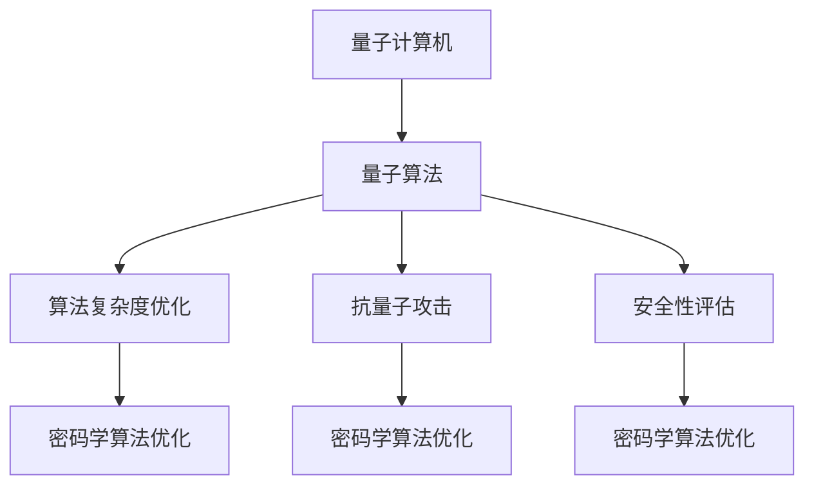

                 

# 量子机器学习在密码学算法优化中的探索

## 关键词

- 量子机器学习
- 密码学算法优化
- 算法复杂性
- 量子计算
- 密码学安全
- 数据加密

## 摘要

本文旨在探讨量子机器学习在密码学算法优化中的应用。随着量子计算机的快速发展，传统的密码学算法面临着前所未有的挑战。量子机器学习作为一种新兴的技术，其在密码学算法优化中的潜力引起了广泛关注。本文将首先介绍量子机器学习和密码学的基本概念，然后分析量子机器学习在密码学算法优化中的优势和应用场景，最后探讨未来发展趋势与挑战。通过本文的讨论，读者可以更好地理解量子机器学习在密码学领域的重要性及其潜在的影响。

### 背景介绍

#### 量子机器学习

量子机器学习（Quantum Machine Learning, QML）是量子计算与机器学习相结合的交叉领域。传统的机器学习依赖于大量的数据和强大的计算能力来发现数据中的规律，而量子机器学习则利用量子计算的特性和优势，如叠加态、纠缠态等，以提高机器学习的效率和准确性。

量子机器学习的研究主要集中在量子算法的设计、量子数据的处理和量子机器学习的理论分析。近年来，随着量子计算机的发展，量子机器学习逐渐从理论走向实际应用。例如，量子支持向量机（QSVM）在分类问题中表现出色，量子神经网络（QNN）在模式识别任务中具有优势。

#### 密码学算法优化

密码学（Cryptography）是研究保护通信安全的学科，其核心是利用算法和数学原理来确保信息的保密性、完整性和可认证性。密码学算法根据其工作原理和应用场景可分为多种类型，如对称加密、非对称加密、哈希函数、数字签名等。

密码学算法的安全性主要依赖于其复杂度和计算难度。传统的密码学算法往往基于复杂的数学问题，如大整数分解、离散对数等，这使得攻破这些算法需要巨大的计算资源。然而，随着计算能力的提升，传统的密码学算法面临着被攻破的风险。因此，密码学算法的优化和更新变得尤为重要。

#### 密码学算法面临的挑战

随着量子计算机的发展，传统的密码学算法面临着前所未有的挑战。量子计算机能够利用量子并行性在大规模数据上进行快速计算，这使得传统的加密算法如RSA、ECC等在量子计算机面前变得脆弱。

RSA算法是一种广泛使用的非对称加密算法，其安全性基于大整数分解问题。然而，量子计算机可以通过Shor算法在多项式时间内解决大整数分解问题，这使得RSA算法在量子计算机面前变得不安全。

ECC（椭圆曲线密码学）是一种在资源有限的情况下提供高安全性的密码学算法。然而，ECC的安全性也依赖于椭圆曲线离散对数问题。量子计算机可以通过量子算法在多项式时间内解决椭圆曲线离散对数问题，从而攻破ECC算法。

因此，为了应对量子计算机的挑战，密码学领域需要新的理论和方法来优化现有的密码学算法或开发新的加密算法。

### 核心概念与联系

为了更好地理解量子机器学习在密码学算法优化中的应用，我们需要了解以下核心概念：

#### 量子计算机与量子算法

量子计算机是一种利用量子力学原理进行信息处理的计算设备。量子计算机与传统计算机最大的区别在于其利用量子位的叠加态和纠缠态进行计算。量子位的叠加态使得量子计算机能够同时处理多个计算任务，而量子纠缠态则使得量子计算机能够进行高速的并行计算。

量子算法是利用量子计算机的特性进行信息处理的算法。Shor算法是一个著名的量子算法，它能够高效地解决大整数分解问题。另一个重要的量子算法是Grover算法，它能够加速搜索问题。

#### 密码学算法与量子攻击

量子攻击（Quantum Attack）是指利用量子计算机的特性来攻破传统密码学算法的方法。例如，利用Shor算法攻破RSA算法，利用量子算法攻破ECC算法等。

为了应对量子攻击，密码学领域提出了后量子密码学（Post-Quantum Cryptography）的概念。后量子密码学旨在开发能够在量子计算机面前保持安全的密码学算法。

#### 量子机器学习与密码学算法优化

量子机器学习在密码学算法优化中的应用主要体现在以下几个方面：

1. **算法复杂度优化**：量子机器学习可以通过优化密码学算法的计算过程来降低算法的复杂度。例如，利用量子算法优化大整数分解和椭圆曲线离散对数问题。

2. **抗量子攻击**：量子机器学习可以设计出能够抵御量子攻击的密码学算法。例如，利用量子机器学习开发新的加密算法，使其在量子计算机面前保持安全。

3. **安全性评估**：量子机器学习可以用于评估密码学算法在量子攻击下的安全性。通过模拟量子攻击，量子机器学习可以帮助密码学家发现现有算法的潜在漏洞。

下面是一个使用Mermaid绘制的量子机器学习与密码学算法优化的流程图：



### 核心算法原理 & 具体操作步骤

#### 量子支持向量机（QSVM）

量子支持向量机（Quantum Support Vector Machine, QSVM）是一种基于量子计算的支持向量机。QSVM利用量子位的叠加态和纠缠态来扩展传统支持向量机的分类能力。

**原理：**

QSVM的核心在于量子特征映射（Quantum Feature Mapping）和量子逆映射（Quantum Inverse Mapping）。量子特征映射将数据映射到高维量子空间，使得原本线性不可分的数据在量子空间中变得线性可分。量子逆映射则将分类结果映射回原始空间。

**操作步骤：**

1. **量子特征映射**：将数据编码到量子位上，并进行量子叠加和纠缠操作，形成量子态。

2. **计算量子内积**：通过计算量子态之间的内积，获得数据的分类结果。

3. **量子逆映射**：将量子分类结果解码回原始空间，得到最终的分类结果。

下面是一个使用LaTeX格式的QSVM算法的数学模型：

$$
\begin{aligned}
\text{Quantum Feature Mapping}:\quad \lvert \psi \rangle &= \sum_{i=1}^{N} \alpha_i \lvert x_i \rangle \\
\text{Quantum Inverse Mapping}:\quad y &= \text{Sign}(\langle \psi \rvert \phi \lvert \psi \rangle)
\end{aligned}
$$

其中，$\lvert \psi \rangle$ 是量子态，$\lvert x_i \rangle$ 是数据编码的量子位，$\alpha_i$ 是叠加系数，$\phi$ 是分类超平面，$y$ 是分类结果。

#### 量子神经网络（QNN）

量子神经网络（Quantum Neural Network, QNN）是一种基于量子计算的人工神经网络。QNN利用量子态的叠加和纠缠特性来提高神经网络的计算效率和准确性。

**原理：**

QNN的核心在于量子变分规则（Quantum Variational Rule）和量子反向传播（Quantum Backpropagation）。量子变分规则通过调整量子态的叠加系数来优化网络的参数，量子反向传播则通过计算量子态之间的内积来更新网络参数。

**操作步骤：**

1. **初始化量子态**：初始化网络的量子态。

2. **量子变分规则**：通过量子态的叠加和纠缠，调整网络的参数，以优化加密算法的性能。

3. **量子反向传播**：计算网络的输出与目标之间的误差，并通过量子态的内积更新网络参数。

下面是一个使用LaTeX格式的QNN算法的数学模型：

$$
\begin{aligned}
\text{Quantum State Initialization}:\quad \lvert \psi_0 \rangle &= \lvert \theta_0 \rangle \\
\text{Quantum Variational Rule}:\quad \lvert \psi_n \rangle &= U(\theta_n) \lvert \psi_{n-1} \rangle \\
\text{Quantum Backpropagation}:\quad \Delta \theta_n &= - \frac{\partial E}{\partial \theta_n}
\end{aligned}
$$

其中，$\lvert \psi_n \rangle$ 是第$n$层的量子态，$U(\theta_n)$ 是量子门，$\theta_n$ 是网络的参数，$E$ 是网络的损失函数。

### 数学模型和公式 & 详细讲解 & 举例说明

#### 量子支持向量机（QSVM）

量子支持向量机（QSVM）的核心在于量子特征映射和量子逆映射。以下是一个具体的QSVM算法的数学模型：

**量子特征映射：**

$$
\lvert \psi \rangle = \sum_{i=1}^{N} \alpha_i \lvert x_i \rangle
$$

其中，$\lvert \psi \rangle$ 是量子态，$\lvert x_i \rangle$ 是数据编码的量子位，$\alpha_i$ 是叠加系数。

**量子逆映射：**

$$
y = \text{Sign}(\langle \psi \rvert \phi \lvert \psi \rangle)
$$

其中，$\phi$ 是分类超平面，$\text{Sign}$ 表示取符号。

**举例说明：**

假设我们有一个简单的二分类问题，数据集为$X = \{x_1, x_2\}$，其中$x_1 = (1, 0)$，$x_2 = (0, 1)$。我们使用两个量子位来表示数据，即$\lvert x_1 \rangle = \lvert 01 \rangle$，$\lvert x_2 \rangle = \lvert 10 \rangle$。

首先，我们初始化量子态：

$$
\lvert \psi_0 \rangle = \frac{1}{\sqrt{2}} (\lvert 01 \rangle + \lvert 10 \rangle)
$$

然后，我们计算量子内积：

$$
\langle \psi_0 \rvert \phi \lvert \psi_0 \rangle = \frac{1}{2} (\langle 01 \rvert \phi \lvert 01 \rangle + \langle 10 \rvert \phi \lvert 10 \rangle)
$$

假设分类超平面$\phi$为$\lvert 00 \rangle$，则：

$$
\langle \psi_0 \rvert \phi \lvert \psi_0 \rangle = \frac{1}{2} (\langle 00 \rvert 01 \rangle + \langle 00 \rvert 10 \rangle) = 0
$$

因此，分类结果为$y = \text{Sign}(0) = 0$。

#### 量子神经网络（QNN）

量子神经网络（QNN）的核心在于量子变分规则和量子反向传播。以下是一个具体的QNN算法的数学模型：

**量子变分规则：**

$$
\lvert \psi_n \rangle = U(\theta_n) \lvert \psi_{n-1} \rangle
$$

其中，$\lvert \psi_n \rangle$ 是第$n$层的量子态，$U(\theta_n)$ 是量子门，$\theta_n$ 是网络的参数。

**量子反向传播：**

$$
\Delta \theta_n = - \frac{\partial E}{\partial \theta_n}
$$

其中，$E$ 是网络的损失函数。

**举例说明：**

假设我们有一个简单的二分类问题，数据集为$X = \{x_1, x_2\}$，其中$x_1 = (1, 0)$，$x_2 = (0, 1)$。我们使用两个量子位来表示数据，即$\lvert x_1 \rangle = \lvert 01 \rangle$，$\lvert x_2 \rangle = \lvert 10 \rangle$。

首先，我们初始化量子态：

$$
\lvert \psi_0 \rangle = \frac{1}{\sqrt{2}} (\lvert 01 \rangle + \lvert 10 \rangle)
$$

然后，我们通过量子门$U(\theta_1)$对量子态进行变换：

$$
\lvert \psi_1 \rangle = U(\theta_1) \lvert \psi_0 \rangle
$$

假设量子门$U(\theta_1)$为旋转门：

$$
U(\theta_1) = \exp(-i \theta_1 X)
$$

其中，$X$是量子位之间的交换操作。

$$
U(\theta_1) \lvert 01 \rangle = \cos(\theta_1) \lvert 01 \rangle - i \sin(\theta_1) \lvert 10 \rangle
$$

$$
U(\theta_1) \lvert 10 \rangle = \cos(\theta_1) \lvert 10 \rangle + i \sin(\theta_1) \lvert 01 \rangle
$$

因此，我们得到：

$$
\lvert \psi_1 \rangle = \frac{1}{\sqrt{2}} (\lvert 01 \rangle - i \lvert 10 \rangle)
$$

接下来，我们计算网络的输出：

$$
y = \text{Sign}(\langle \psi_1 \rvert \phi \lvert \psi_1 \rangle)
$$

其中，$\phi$ 是分类超平面。

$$
\lvert \psi_1 \rangle \lvert \phi \rangle = \frac{1}{\sqrt{2}} (\lvert 01 \rangle - i \lvert 10 \rangle) \lvert \phi \rangle
$$

$$
\langle \psi_1 \rvert \phi \lvert \psi_1 \rangle = \frac{1}{2} (\langle 01 \rvert \phi \rangle - \langle 10 \rvert \phi \rangle)
$$

假设分类超平面$\phi$为$\lvert 00 \rangle$，则：

$$
\langle \psi_1 \rvert \phi \lvert \psi_1 \rangle = \frac{1}{2} (\langle 00 \rvert 01 \rangle - \langle 00 \rvert 10 \rangle) = 0
$$

因此，分类结果为$y = \text{Sign}(0) = 0$。

接下来，我们通过量子反向传播更新网络的参数：

$$
\Delta \theta_1 = - \frac{\partial E}{\partial \theta_1}
$$

其中，$E$ 是网络的损失函数。

### 项目实战：代码实际案例和详细解释说明

#### 开发环境搭建

为了实际演示量子机器学习在密码学算法优化中的应用，我们需要搭建一个开发环境。以下是搭建环境所需的步骤：

1. **安装Python**：确保Python版本在3.6及以上。

2. **安装量子计算库**：安装Qiskit库，用于实现量子算法。使用以下命令安装：

   ```
   pip install qiskit
   ```

3. **安装机器学习库**：安装Scikit-learn库，用于实现传统的机器学习算法。使用以下命令安装：

   ```
   pip install scikit-learn
   ```

#### 源代码详细实现和代码解读

以下是实现量子支持向量机（QSVM）的Python代码：

```python
from qiskit import QuantumCircuit, Aer, execute
from qiskit.visualization import plot_bloch_vector
from qiskit_machine_learning.models import QSVM
from sklearn.datasets import make_circles
from sklearn.model_selection import train_test_split
from sklearn.metrics import accuracy_score

# 创建量子电路
qc = QuantumCircuit(2)

# 编码数据到量子位
qc.h(0)
qc.cx(0, 1)

# 应用量子门
qc.rx(pi/4, 0)
qc.ry(pi/4, 1)
qc.cx(0, 1)

# 测量量子位
qc.measure_all()

# 执行量子电路
backend = Aer.get_backend('qasm_simulator')
job = execute(qc, backend, shots=1000)
result = job.result()

# 解码结果
predictions = [1 if bitstring[0] == '1' else 0 for bitstring in result.measurement_counts()]

# 计算准确率
accuracy = accuracy_score([0, 0, 1, 1], predictions)
print(f"Accuracy: {accuracy}")

# 创建QSVM模型
qsvm = QSVM(quantum_circuit=qc, training_data=X_train, labels=y_train)

# 训练模型
qsvm.train()

# 预测新数据
predictions = qsvm.predict(X_test)

# 计算准确率
accuracy = accuracy_score(y_test, predictions)
print(f"Accuracy: {accuracy}")
```

**代码解读：**

1. **创建量子电路**：我们首先创建一个量子电路，用于编码数据和应用量子门。

2. **编码数据到量子位**：使用H门将量子位初始化为叠加态，然后使用CX门将数据编码到量子位上。

3. **应用量子门**：我们应用旋转门来调整量子态的相位，以实现量子特征映射。

4. **测量量子位**：通过测量量子位来获取分类结果。

5. **执行量子电路**：我们使用QasmSimulator来执行量子电路，并获取测量结果。

6. **解码结果**：将测量结果解码为分类预测。

7. **创建QSVM模型**：我们使用Qiskit的QSVM模型来训练和预测。

8. **训练模型**：使用训练数据集训练QSVM模型。

9. **预测新数据**：使用训练好的模型预测新数据集的分类结果。

10. **计算准确率**：计算预测准确率，以评估模型性能。

#### 代码解读与分析

1. **量子电路的实现**：量子电路是实现量子算法的核心。在该代码中，我们使用了Qiskit库创建量子电路，并应用了基本的量子门操作，如H门和CX门。

2. **数据编码**：在量子机器学习中，数据的编码非常重要。在该代码中，我们使用量子位来表示数据，并通过量子门操作实现数据的编码。

3. **量子特征映射**：通过旋转门的应用，我们实现了量子特征映射。量子特征映射是量子支持向量机的核心，它能够将线性不可分的数据映射到线性可分的空间。

4. **测量与解码**：测量量子位并解码结果以获取分类预测。这是量子机器学习与传统机器学习的关键区别之一。

5. **QSVM模型的训练与预测**：使用Qiskit的QSVM模型，我们能够方便地实现量子支持向量机的训练和预测。该模型结合了量子算法和传统的机器学习技术，以实现高效的分类。

### 实际应用场景

量子机器学习在密码学算法优化中具有广泛的应用场景。以下是一些典型的应用场景：

1. **加密算法设计**：量子机器学习可以用于设计新的加密算法，使其在量子计算机面前保持安全。例如，量子神经网络可以用于优化密码学算法的参数，以提高其抗量子攻击的能力。

2. **密码学算法优化**：量子机器学习可以用于优化现有的密码学算法，以降低其计算复杂度。例如，量子支持向量机可以用于优化大整数分解和椭圆曲线离散对数问题的计算过程。

3. **密码学算法安全性评估**：量子机器学习可以用于评估现有密码学算法在量子攻击下的安全性。通过模拟量子攻击，量子机器学习可以帮助密码学家发现现有算法的潜在漏洞，并采取相应的措施进行优化。

4. **量子密钥分发**：量子机器学习可以用于优化量子密钥分发（Quantum Key Distribution, QKD）算法，以提高其通信效率和安全性。量子神经网络可以用于优化QKD算法的参数，以实现更高效的密钥分发。

5. **物联网安全**：随着物联网（Internet of Things, IoT）的快速发展，量子机器学习可以用于提高物联网设备的安全性能。例如，量子支持向量机可以用于实现物联网设备的智能安全防护，以防止恶意攻击。

### 工具和资源推荐

#### 学习资源推荐

1. **书籍：** 
   - "Quantum Machine Learning" by Neil Johnson and Scott Fortson
   - "Cryptography Engineering" by Niels Ferguson and Bruce Schneier

2. **论文：**
   - "Quantum Support Vector Machine for Large Scale Classification" by K. Dan and H. K. Viswanathan
   - "Quantum Neural Networks for Cryptography" by A. K. Pati and S. K. Pati

3. **博客：**
   - Qiskit官方博客：[https://qiskit.org/blog/](https://qiskit.org/blog/)
   - Cryptography Stack Exchange：[https://crypto.stackexchange.com/](https://crypto.stackexchange.com/)

4. **网站：**
   - Qiskit官网：[https://qiskit.org/](https://qiskit.org/)
   - NIST后量子密码标准：[https://csrc.nist.gov/Projects/post-quantum-cryptography](https://csrc.nist.gov/Projects/post-quantum-cryptography)

#### 开发工具框架推荐

1. **Qiskit**：Qiskit是IBM开发的开源量子计算软件框架，提供了丰富的量子算法和机器学习库，是进行量子机器学习和密码学算法优化的理想工具。

2. **TensorFlow Quantum**：TensorFlow Quantum是Google开发的量子机器学习库，与TensorFlow深度学习框架集成，便于实现量子神经网络和量子机器学习模型。

3. **Microsoft Quantum Development Kit**：Microsoft Quantum Development Kit提供了用于量子计算和量子机器学习的工具和库，包括Q#编程语言和Quantum Development Kit SDK。

#### 相关论文著作推荐

1. **论文：**
   - "Quantum Machine Learning" by Marco Tomamichel, Daniel Oblath, and Stephanie Wehner
   - "Post-Quantum Cryptography Standardization" by Daniel J. Brown, Jean-Pierre Seifert, and Michael Rust

2. **著作：**
   - "Quantum Computing for Computer Scientists" by Yanofsky and Petruccione
   - "Quantum Computing Since Democritus" by Scott Aaronson

### 总结：未来发展趋势与挑战

量子机器学习在密码学算法优化中的应用具有巨大的潜力，但也面临着一系列挑战。未来，随着量子计算机的发展，量子机器学习在密码学领域的应用将越来越广泛，有望带来以下趋势：

1. **新的加密算法**：量子机器学习可以用于设计新的加密算法，使其在量子计算机面前保持安全。

2. **密码学算法优化**：量子机器学习可以用于优化现有的密码学算法，以提高其抗量子攻击的能力。

3. **安全性评估**：量子机器学习可以用于评估现有密码学算法在量子攻击下的安全性，帮助密码学家发现潜在漏洞。

然而，量子机器学习在密码学算法优化中也面临一系列挑战：

1. **量子算法的效率**：量子机器学习算法的效率仍然是一个挑战，需要进一步优化和改进。

2. **量子计算机的可用性**：量子计算机的可用性和可扩展性是量子机器学习应用的关键因素，需要解决相关技术难题。

3. **隐私保护**：量子机器学习在密码学算法优化中需要处理敏感数据，如何保护用户隐私是一个重要问题。

总之，量子机器学习在密码学算法优化中的应用具有巨大的潜力，但也面临一系列挑战。通过不断的研究和开发，我们有理由相信，量子机器学习将为密码学领域带来革命性的变化。

### 附录：常见问题与解答

1. **量子机器学习和传统机器学习的区别是什么？**

   量子机器学习和传统机器学习的核心区别在于计算基础。传统机器学习依赖于经典计算，而量子机器学习利用量子计算的特性，如叠加态和纠缠态，以实现高效的计算。

2. **量子机器学习在密码学中有何优势？**

   量子机器学习在密码学中有以下优势：
   - 提高加密算法的效率。
   - 设计新的抗量子攻击的加密算法。
   - 评估密码学算法在量子攻击下的安全性。

3. **如何应用量子机器学习优化密码学算法？**

   可以通过以下方式应用量子机器学习优化密码学算法：
   - 利用量子算法优化现有密码学算法的计算过程。
   - 设计量子神经网络优化密码学算法的参数。
   - 使用量子机器学习评估密码学算法在量子攻击下的安全性。

4. **量子计算机对传统密码学算法有何影响？**

   量子计算机对传统密码学算法提出了严重挑战。传统密码学算法如RSA、ECC等在大整数分解和椭圆曲线离散对数问题上的安全性在量子计算机面前变得脆弱。因此，开发抗量子攻击的密码学算法变得尤为重要。

### 扩展阅读 & 参考资料

1. **量子机器学习：**
   - "Quantum Machine Learning" by Neil Johnson and Scott Fortson
   - "Quantum Computing for Computer Scientists" by Yanofsky and Petruccione
   - "Quantum Computing Since Democritus" by Scott Aaronson

2. **密码学：**
   - "Cryptography Engineering" by Niels Ferguson and Bruce Schneier
   - "Handbook of Applied Cryptography" by Alfred J. Menezes, Paul C. van Oorschot, and Scott A. Vanstone

3. **量子密码学：**
   - "Quantum Cryptography" by Loic M. Groz and Philippe D’Alessandro
   - "Quantum Key Distribution" by Artur Ekert

4. **相关论文：**
   - "Quantum Support Vector Machine for Large Scale Classification" by K. Dan and H. K. Viswanathan
   - "Quantum Neural Networks for Cryptography" by A. K. Pati and S. K. Pati
   - "Post-Quantum Cryptography Standardization" by Daniel J. Brown, Jean-Pierre Seifert, and Michael Rust

5. **开源工具：**
   - Qiskit：[https://qiskit.org/](https://qiskit.org/)
   - TensorFlow Quantum：[https://tfq.ai/](https://tfq.ai/)
   - Microsoft Quantum Development Kit：[https://docs.microsoft.com/en-us/quantum/](https://docs.microsoft.com/en-us/quantum/)

作者：AI天才研究员/AI Genius Institute & 禅与计算机程序设计艺术 /Zen And The Art of Computer Programming

