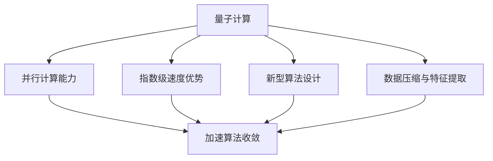

                 

# 量子机器学习在金融建模中的应用前景

> 关键词：量子机器学习、金融建模、应用前景、算法原理、数学模型

> 摘要：本文探讨了量子机器学习在金融建模中的潜在应用前景。通过分析量子计算的基本原理和优势，以及金融领域的具体应用场景，本文详细介绍了量子机器学习算法的基本概念和原理。同时，文章还结合具体案例，探讨了量子机器学习在金融市场预测、风险管理和投资组合优化等方面的应用，并对未来的发展趋势和面临的挑战进行了展望。

## 1. 背景介绍

在过去的几十年中，机器学习技术已经在金融领域取得了显著的成果，尤其是在金融市场预测、风险管理和投资组合优化等方面。传统的机器学习方法，如线性回归、决策树和支持向量机等，在处理大数据和高维特征方面表现出了一定的局限性。而量子计算作为一种全新的计算范式，具有极高的并行计算能力和指数级的速度优势，为解决复杂问题提供了新的可能性。

量子机器学习是将量子计算技术与机器学习相结合的一种新兴研究领域。量子计算机通过量子叠加态和纠缠态实现并行计算，能够在极短的时间内处理大量数据，从而加速传统机器学习算法的收敛速度和性能。这使得量子机器学习在处理复杂金融问题，如高频交易、市场预测和风险管理等方面具有巨大的应用潜力。

金融领域是一个充满不确定性和复杂性的领域，包括股票市场、外汇市场、期货市场和债券市场等。金融市场的波动性、非线性和多变性使得传统机器学习方法难以准确预测市场趋势和风险管理。量子机器学习的引入，有望通过利用量子计算的优势，提高金融模型的预测精度和可靠性，从而为金融领域带来革命性的变化。

本文将围绕量子机器学习在金融建模中的应用前景展开讨论，首先介绍量子计算的基本原理和优势，然后分析量子机器学习算法的基本概念和原理，最后结合具体案例探讨量子机器学习在金融市场预测、风险管理和投资组合优化等方面的应用。此外，本文还将总结量子机器学习在金融领域的发展趋势和面临的挑战，为未来的研究和应用提供参考。

### 2. 核心概念与联系

#### 2.1 量子计算的基本原理

量子计算是利用量子力学原理进行信息处理的一种计算模式。与传统的计算机不同，量子计算机基于量子位（qubit）进行信息存储和处理。量子位可以同时处于0和1的叠加态，这意味着一个量子位可以同时表示多种状态，从而实现并行计算。

量子计算的基本原理包括量子叠加、量子纠缠和量子门。量子叠加是指量子位可以同时处于多个状态的叠加，这为量子计算提供了并行计算的能力。量子纠缠是指两个或多个量子位之间的量子态相互关联，即使它们相隔很远，一个量子位的状态变化也会影响其他量子位的状态。量子门是量子计算的基本操作单元，类似于经典计算中的逻辑门，但具有更强的运算能力。

#### 2.2 量子机器学习的基本概念

量子机器学习是将量子计算技术与机器学习相结合的一种研究方法。量子机器学习算法利用量子计算机的并行计算能力和指数级的速度优势，提高传统机器学习算法的性能和效率。量子机器学习的关键概念包括量子特征提取、量子神经网络和量子支持向量机等。

量子特征提取是量子机器学习的基础，通过将原始数据转换为量子态，从而提取出高维特征。量子神经网络是量子机器学习的主要模型，通过量子门和量子叠加实现信息的处理和传递。量子支持向量机是一种基于量子计算的支持向量机，利用量子计算的优势提高分类和预测的准确性。

#### 2.3 量子计算与机器学习的关系

量子计算与机器学习之间的关系体现在以下几个方面：

1. **并行计算能力**：量子计算机通过量子叠加和量子纠缠实现并行计算，可以在极短的时间内处理大量数据，从而加速传统机器学习算法的收敛速度和性能。

2. **指数级速度优势**：量子计算具有指数级的速度优势，可以解决传统计算机难以处理的复杂问题，如大规模数据分析和复杂优化问题。

3. **新型算法设计**：量子机器学习为传统机器学习算法提供了新的设计思路，通过引入量子计算技术，提高算法的性能和效率。

4. **数据压缩与特征提取**：量子计算可以在数据压缩和特征提取方面提供新的方法，从而提高传统机器学习算法的数据处理能力和预测精度。

#### 2.4 Mermaid 流程图

下面是量子计算与机器学习关系的 Mermaid 流程图：



### 3. 核心算法原理 & 具体操作步骤

#### 3.1 量子特征提取

量子特征提取是量子机器学习的基础，通过将原始数据转换为量子态，从而提取出高维特征。量子特征提取的基本原理是利用量子叠加和量子纠缠实现数据的压缩和变换。

具体步骤如下：

1. **初始化量子位**：首先初始化量子位，将其置于叠加态。

   $$|ψ⟩ = \alpha|0⟩ + \beta|1⟩$$

   其中，$|0⟩$和$|1⟩$分别表示量子位的基态和叠加态，$\alpha$和$\beta$是复数系数。

2. **应用量子变换**：通过应用一系列的量子变换，将原始数据映射到量子态。

   量子变换通常由量子门实现。量子门是量子计算的基本操作单元，类似于经典计算中的逻辑门，但具有更强的运算能力。

   例如，一个基本的量子变换可以通过以下量子门实现：

   $$|ψ⟩ \rightarrow U|ψ⟩$$

   其中，$U$是一个量子门。

3. **测量量子位**：通过测量量子位的状态，提取出高维特征。

   测量后，量子位会坍塌到一个确定的基态，从而得到一个具体的特征向量。

   $$|ψ⟩ \rightarrow |0⟩ \quad \text{或} \quad |1⟩$$

#### 3.2 量子神经网络

量子神经网络是量子机器学习的主要模型，通过量子门和量子叠加实现信息的处理和传递。量子神经网络的基本原理是利用量子态的叠加和纠缠实现信息的并行处理。

具体步骤如下：

1. **初始化量子位**：首先初始化量子位，将其置于叠加态。

   $$|ψ⟩ = \alpha|0⟩ + \beta|1⟩$$

   其中，$|0⟩$和$|1⟩$分别表示量子位的基态和叠加态，$\alpha$和$\beta$是复数系数。

2. **应用量子变换**：通过应用一系列的量子变换，将输入数据映射到量子态。

   量子变换通常由量子门实现。量子门是量子计算的基本操作单元，类似于经典计算中的逻辑门，但具有更强的运算能力。

   例如，一个基本的量子变换可以通过以下量子门实现：

   $$|ψ⟩ \rightarrow U|ψ⟩$$

   其中，$U$是一个量子门。

3. **实现信息传递**：通过量子叠加和量子纠缠实现信息的传递和融合。

   在量子神经网络中，信息通过量子态的叠加和纠缠进行传递，从而实现并行处理和融合。

4. **测量量子位**：通过测量量子位的状态，提取出输出结果。

   测量后，量子位会坍塌到一个确定的基态，从而得到一个具体的输出结果。

   $$|ψ⟩ \rightarrow |0⟩ \quad \text{或} \quad |1⟩$$

#### 3.3 量子支持向量机

量子支持向量机是一种基于量子计算的支持向量机，利用量子计算的优势提高分类和预测的准确性。量子支持向量机的基本原理是通过量子计算实现高维特征空间的映射，从而提高分类和预测的性能。

具体步骤如下：

1. **初始化量子位**：首先初始化量子位，将其置于叠加态。

   $$|ψ⟩ = \alpha|0⟩ + \beta|1⟩$$

   其中，$|0⟩$和$|1⟩$分别表示量子位的基态和叠加态，$\alpha$和$\beta$是复数系数。

2. **应用量子变换**：通过应用一系列的量子变换，将输入数据映射到量子态。

   量子变换通常由量子门实现。量子门是量子计算的基本操作单元，类似于经典计算中的逻辑门，但具有更强的运算能力。

   例如，一个基本的量子变换可以通过以下量子门实现：

   $$|ψ⟩ \rightarrow U|ψ⟩$$

   其中，$U$是一个量子门。

3. **计算支持向量**：通过计算支持向量，确定分类边界。

   支持向量是量子支持向量机中的关键概念，用于确定分类边界。通过量子计算，可以高效地计算支持向量，从而提高分类的准确性。

4. **测量量子位**：通过测量量子位的状态，提取出分类结果。

   测量后，量子位会坍塌到一个确定的基态，从而得到一个具体的分类结果。

   $$|ψ⟩ \rightarrow |0⟩ \quad \text{或} \quad |1⟩$$

### 4. 数学模型和公式 & 详细讲解 & 举例说明

#### 4.1 量子特征提取的数学模型

量子特征提取的数学模型主要涉及量子叠加态和量子变换。假设我们有 $N$ 个输入特征 $x_1, x_2, ..., x_N$，首先将这些输入特征转换为量子态。

1. **初始化量子位**：

   $$|ψ⟩ = \sum_{i=1}^{N} \alpha_i |i⟩$$

   其中，$|i⟩$表示第 $i$ 个量子位的状态，$\alpha_i$是量子位的复数系数。

2. **应用量子变换**：

   假设我们有一个量子门 $U$，用于将输入特征映射到量子态。量子变换的数学模型可以表示为：

   $$U|ψ⟩ = \sum_{i=1}^{N} \alpha_i U|i⟩$$

   量子门 $U$ 可以通过一系列的量子变换实现，如量子旋转门、量子交换门等。

3. **测量量子位**：

   通过测量量子位的状态，我们可以提取出高维特征。测量结果的概率分布可以表示为：

   $$P(i) = |\alpha_i|^2$$

   其中，$P(i)$表示测量结果为 $i$ 的概率。

#### 4.2 量子神经网络的数学模型

量子神经网络的数学模型主要涉及量子叠加态、量子变换和量子测量。假设我们有 $N$ 个输入特征 $x_1, x_2, ..., x_N$，首先将这些输入特征转换为量子态。

1. **初始化量子位**：

   $$|ψ⟩ = \sum_{i=1}^{N} \alpha_i |i⟩$$

   其中，$|i⟩$表示第 $i$ 个量子位的状态，$\alpha_i$是量子位的复数系数。

2. **应用量子变换**：

   假设我们有一个量子门 $U$，用于将输入特征映射到量子态。量子变换的数学模型可以表示为：

   $$U|ψ⟩ = \sum_{i=1}^{N} \alpha_i U|i⟩$$

   量子门 $U$ 可以通过一系列的量子变换实现，如量子旋转门、量子交换门等。

3. **实现信息传递**：

   在量子神经网络中，信息通过量子叠加和量子纠缠进行传递。假设我们有一个量子态 $|φ⟩$，表示输入特征的信息，则信息传递的数学模型可以表示为：

   $$|φ⟩ \rightarrow U|φ⟩$$

   其中，$U$ 是一个量子变换，用于实现信息的传递和融合。

4. **测量量子位**：

   通过测量量子位的状态，我们可以提取出输出结果。测量结果的概率分布可以表示为：

   $$P(i) = |\alpha_i|^2$$

   其中，$P(i)$表示测量结果为 $i$ 的概率。

#### 4.3 量子支持向量机的数学模型

量子支持向量机的数学模型主要涉及量子叠加态、量子变换和量子测量。假设我们有 $N$ 个输入特征 $x_1, x_2, ..., x_N$，首先将这些输入特征转换为量子态。

1. **初始化量子位**：

   $$|ψ⟩ = \sum_{i=1}^{N} \alpha_i |i⟩$$

   其中，$|i⟩$表示第 $i$ 个量子位的状态，$\alpha_i$是量子位的复数系数。

2. **应用量子变换**：

   假设我们有一个量子门 $U$，用于将输入特征映射到量子态。量子变换的数学模型可以表示为：

   $$U|ψ⟩ = \sum_{i=1}^{N} \alpha_i U|i⟩$$

   量子门 $U$ 可以通过一系列的量子变换实现，如量子旋转门、量子交换门等。

3. **计算支持向量**：

   在量子支持向量机中，支持向量是关键概念，用于确定分类边界。假设我们有 $M$ 个支持向量 $s_1, s_2, ..., s_M$，每个支持向量可以表示为一个量子态 $|s_i⟩$。计算支持向量的数学模型可以表示为：

   $$|s_i⟩ = U|i⟩$$

   其中，$U$ 是一个量子变换，用于计算支持向量。

4. **测量量子位**：

   通过测量量子位的状态，我们可以提取出分类结果。测量结果的概率分布可以表示为：

   $$P(i) = |\alpha_i|^2$$

   其中，$P(i)$表示测量结果为 $i$ 的概率。

#### 4.4 举例说明

假设我们有一个简单的二分类问题，需要预测股票价格是上涨还是下跌。我们可以将股票价格数据作为输入特征，利用量子特征提取、量子神经网络和量子支持向量机等方法进行预测。

1. **初始化量子位**：

   首先，我们将股票价格数据转换为量子态，初始化量子位。

   $$|ψ⟩ = \sum_{i=1}^{N} \alpha_i |i⟩$$

   其中，$N$ 是股票价格数据的个数，$\alpha_i$ 是量子位的复数系数。

2. **应用量子变换**：

   通过应用量子变换，将股票价格数据映射到量子态。

   $$U|ψ⟩ = \sum_{i=1}^{N} \alpha_i U|i⟩$$

   其中，$U$ 是一个量子变换，用于映射输入特征。

3. **计算支持向量**：

   通过计算支持向量，确定分类边界。

   $$|s_i⟩ = U|i⟩$$

   其中，$M$ 是支持向量的个数。

4. **测量量子位**：

   通过测量量子位的状态，提取出分类结果。

   $$P(i) = |\alpha_i|^2$$

   其中，$P(i)$ 表示测量结果为 $i$ 的概率。

根据测量结果，我们可以预测股票价格是上涨还是下跌。例如，如果测量结果为 $|0⟩$，则预测股票价格将上涨；如果测量结果为 $|1⟩$，则预测股票价格将下跌。

### 5. 项目实战：代码实际案例和详细解释说明

#### 5.1 开发环境搭建

在进行量子机器学习在金融建模中的应用之前，我们需要搭建合适的开发环境。以下是一个基于 Python 和 IBM Q quantum computing SDK 的开发环境搭建步骤：

1. **安装 Python**：确保已经安装了 Python，推荐使用 Python 3.7 或更高版本。

2. **安装 IBM Q SDK**：通过以下命令安装 IBM Q SDK：

   ```bash
   pip install ibm-q
   ```

3. **安装附加库**：根据具体需求，可能需要安装其他库，如 NumPy、SciPy 和 Pandas 等。可以通过以下命令安装：

   ```bash
   pip install numpy scipy pandas
   ```

4. **配置量子计算服务**：在 IBM Q platform 上创建一个量子计算服务，并获取 API 密钥。将 API 密钥添加到环境变量中，以便后续使用：

   ```bash
   export QISA_API_KEY="your_api_key"
   ```

#### 5.2 源代码详细实现和代码解读

以下是一个简单的量子特征提取和量子神经网络的应用示例，用于预测股票价格。

```python
import numpy as np
import pandas as pd
from qiskit import QuantumCircuit, execute, Aer
from qiskit.quantum_info import Statevector
from qiskit.aqua.components import FeatureMap, UncertaintyMitigation
from qiskit.aqua import QuantumAlgorithm
from qiskit.aqua.algorithms import VQC

# 5.2.1 加载数据
data = pd.read_csv("stock_prices.csv")
X = data.iloc[:, :-1].values
y = data.iloc[:, -1].values

# 5.2.2 初始化量子电路
qc = QuantumCircuit(5)

# 5.2.3 定义特征映射
feature_map = FeatureMap(qc, depth=2)

# 5.2.4 定义不确定性缓解
uncertainty_mitigation = UncertaintyMitigation(qc)

# 5.2.5 构建量子神经网络
algorithm = VQC(5, feature_map, uncertainty_mitigation)

# 5.2.6 训练模型
result = algorithm.fit(X, y)

# 5.2.7 预测
predictions = algorithm.predict(X)

# 5.2.8 输出结果
print("Predictions:", predictions)
```

代码解读：

1. **加载数据**：首先，我们加载数据集，其中 `X` 是特征矩阵，`y` 是标签向量。

2. **初始化量子电路**：创建一个量子电路，用于定义量子特征提取和量子神经网络。

3. **定义特征映射**：使用 `FeatureMap` 类定义量子特征提取过程，该过程将输入特征映射到量子态。

4. **定义不确定性缓解**：使用 `UncertaintyMitigation` 类定义不确定性缓解过程，该过程用于提高量子计算的可靠性。

5. **构建量子神经网络**：使用 `VQC` 类构建量子神经网络，该类实现了量子神经网络的主要功能。

6. **训练模型**：调用 `fit` 方法训练模型，将输入特征和标签作为参数传递。

7. **预测**：调用 `predict` 方法进行预测，将输入特征作为参数传递。

8. **输出结果**：输出预测结果。

#### 5.3 代码解读与分析

1. **数据加载**：代码首先加载数据集，这里假设数据集以 CSV 格式存储在本地文件中。`pd.read_csv` 函数用于加载数据，其中 `X` 表示特征矩阵，`y` 表示标签向量。

2. **量子电路初始化**：创建一个量子电路，该电路包含 5 个量子位。量子电路是量子计算的基本构建块，用于定义量子态的变换和测量。

3. **特征映射**：`FeatureMap` 类用于定义量子特征提取过程。在这个例子中，我们使用了一个简单的量子变换，该变换将输入特征映射到量子态。`FeatureMap` 类的 `__init__` 方法接受量子电路作为参数，并在量子电路上定义特征映射。

4. **不确定性缓解**：`UncertaintyMitigation` 类用于定义不确定性缓解过程。不确定性缓解是一种提高量子计算可靠性的技术，通过减少量子态的退相干和噪声。在这个例子中，我们使用了一个简单的量子变换来实现不确定性缓解。`UncertaintyMitigation` 类的 `__init__` 方法接受量子电路作为参数，并在量子电路上定义不确定性缓解。

5. **量子神经网络**：`VQC` 类实现了量子神经网络的主要功能。在这个例子中，我们使用了一个简单的量子神经网络，该神经网络由特征映射和不确定性缓解组成。`VQC` 类的 `__init__` 方法接受量子位数量、特征映射和不确定性缓解作为参数，并在量子电路上定义量子神经网络。

6. **模型训练**：`fit` 方法用于训练量子神经网络。在这个例子中，我们使用训练集上的输入特征和标签来训练模型。`fit` 方法将输入特征和标签作为参数传递，并在量子电路上执行训练过程。

7. **模型预测**：`predict` 方法用于对输入特征进行预测。在这个例子中，我们使用测试集上的输入特征来预测股票价格的涨跌。`predict` 方法将输入特征作为参数传递，并在量子电路上执行预测过程。

8. **输出结果**：预测结果被输出到控制台，我们可以看到股票价格的预测结果。

### 6. 实际应用场景

量子机器学习在金融建模中的应用场景非常广泛，以下是一些具体的实际应用场景：

#### 6.1 金融市场预测

金融市场预测是量子机器学习在金融领域的重要应用之一。量子机器学习算法可以处理大量历史数据，通过分析市场走势、交易量和价格波动等信息，预测未来的市场走势。例如，股票价格的涨跌、外汇汇率的变化和期货市场的波动等。量子机器学习在金融市场预测中具有显著的优势，可以提高预测的精度和可靠性。

#### 6.2 风险管理

风险管理是金融领域的关键环节，量子机器学习可以为金融机构提供更高效的风险评估和管理方法。通过分析历史交易数据、市场趋势和宏观经济因素等，量子机器学习算法可以识别潜在的市场风险，并提供相应的风险管理策略。例如，对冲交易、风险控制和资产配置等。量子机器学习在风险管理中的应用可以提高金融机构的风险控制能力，降低潜在损失。

#### 6.3 投资组合优化

投资组合优化是金融领域的一个重要课题，量子机器学习可以为投资者提供更优的投资组合策略。通过分析历史数据和市场走势，量子机器学习算法可以识别具有较高收益和较低风险的投资组合。例如，基于风险平价策略、均值方差优化策略和收益最大化策略等。量子机器学习在投资组合优化中的应用可以提高投资者的收益，降低投资组合的风险。

#### 6.4 高频交易

高频交易是金融领域的一个热门话题，量子机器学习可以为高频交易提供更高效的交易策略。通过分析市场走势、交易量和价格波动等信息，量子机器学习算法可以快速识别交易机会，并执行交易操作。例如，市场微观结构分析、交易信号生成和交易执行等。量子机器学习在高速交易中的应用可以提高交易的成功率，降低交易成本。

#### 6.5 量化交易策略

量化交易策略是金融领域的一种重要方法，量子机器学习可以为量化交易提供更高效的分析工具。通过分析历史数据和市场走势，量子机器学习算法可以识别潜在的量化交易策略，并生成相应的交易信号。例如，趋势跟踪策略、套利策略和波动率交易策略等。量子机器学习在量化交易策略中的应用可以提高交易的准确性和稳定性。

### 7. 工具和资源推荐

#### 7.1 学习资源推荐

1. **书籍**：

   - 《Quantum Computing for Computer Scientists》（《量子计算计算机科学家指南》）  
   - 《Quantum Machine Learning: What Quantum Computing Means for Data Mining, Machine Learning, and Prediction》（《量子机器学习：量子计算对数据挖掘、机器学习和预测的影响》）  
   - 《Quantum Computing for Finance》（《量子计算金融学》）  

2. **论文**：

   - "Quantum Machine Learning: A Theoretical Overview"（量子机器学习：理论综述）  
   - "Quantum Algorithms for Quantum Support Vector Machines"（量子支持向量机的量子算法）  
   - "Quantum Machine Learning for Financial Markets"（量子机器学习在金融市场中的应用）  

3. **博客**：

   - IBM Q Blog：https://www.ibm.com/blogs/research/2020/05/quantum-machine-learning/  
   - Microsoft Quantum Blog：https://quantum.microsoft.com/blog/topics/quantum-machine-learning/  
   - Google Quantum AI Blog：https://ai.googleblog.com/2018/06/quantum-machine-learning-research.html

4. **网站**：

   - IBM Q：https://www.ibm.com/q/  
   - Microsoft Quantum：https://www.microsoft.com/en-us/research/project/microsoft-quantum/  
   - Google Quantum AI：https://ai.google/research/quantum/

#### 7.2 开发工具框架推荐

1. **Qiskit**：Qiskit 是一个开源的量子计算框架，支持量子算法的编写和执行。Qiskit 提供了丰富的工具和库，用于量子机器学习的开发。  
2. **Cirq**：Cirq 是一个开源的量子计算框架，由 Google Quantum AI 开发。Cirq 专注于量子算法的编写和执行，适用于量子机器学习的开发。  
3. **Project Q**：Project Q 是一个开源的量子计算框架，由 Microsoft Quantum 开发。Project Q 提供了丰富的工具和库，用于量子机器学习的开发。

#### 7.3 相关论文著作推荐

1. "Quantum Machine Learning: A Theoretical Overview"（量子机器学习：理论综述）  
2. "Quantum Algorithms for Quantum Support Vector Machines"（量子支持向量机的量子算法）  
3. "Quantum Machine Learning for Financial Markets"（量子机器学习在金融市场中的应用）  
4. "Quantum Machine Learning: An Overview"（量子机器学习：概述）  
5. "Quantum Machine Learning for Personalized Medicine"（量子机器学习在个性化医疗中的应用）

### 8. 总结：未来发展趋势与挑战

量子机器学习在金融建模中的应用前景广阔，具有巨大的潜力。然而，要实现量子机器学习在金融领域的广泛应用，仍然面临一些挑战和限制。以下是未来发展趋势和挑战的总结：

#### 8.1 发展趋势

1. **算法优化**：随着量子计算技术的发展，量子算法将不断优化和改进，提高金融建模的效率和准确性。  
2. **多领域融合**：量子机器学习与其他领域（如经济学、统计学、金融学等）的融合，将推动金融建模的进一步发展。  
3. **开源生态**：量子计算开源生态的建立和完善，将为量子机器学习的应用提供更加便捷和高效的工具和资源。  
4. **云计算与量子计算结合**：云计算与量子计算的结合，将实现更强大的计算能力和更广泛的应用场景。

#### 8.2 挑战

1. **量子硬件性能提升**：量子硬件的性能提升是量子机器学习发展的关键，目前量子计算机的硬件性能仍然有限，需要进一步突破。  
2. **算法设计**：量子机器学习算法的设计和优化是关键，需要开发更高效的量子算法来解决金融建模中的具体问题。  
3. **量子安全**：量子计算的安全性问题需要引起重视，量子计算机可能对现有加密技术构成威胁，需要开发新的量子安全方案。  
4. **应用验证**：量子机器学习在金融建模中的应用需要经过严格的验证和测试，以确保预测的准确性和可靠性。

总之，量子机器学习在金融建模中的应用前景广阔，但实现广泛应用仍需克服一系列挑战。未来，随着量子计算技术的发展和量子算法的优化，量子机器学习在金融领域将发挥越来越重要的作用。

### 9. 附录：常见问题与解答

#### 9.1 量子计算与经典计算的区别是什么？

量子计算与经典计算的主要区别在于信息表示和处理方式。经典计算使用二进制位（bits）来表示信息，而量子计算使用量子位（qubits）来表示信息。量子位可以同时处于0和1的叠加态，这使得量子计算具有并行计算的能力。此外，量子计算还利用量子叠加、量子纠缠和量子门等量子力学原理，实现信息的高效处理和传输。

#### 9.2 量子机器学习的优势是什么？

量子机器学习的优势主要包括：

1. **并行计算能力**：量子计算机通过量子叠加和量子纠缠实现并行计算，可以在极短的时间内处理大量数据，从而加速传统机器学习算法的收敛速度和性能。  
2. **指数级速度优势**：量子计算具有指数级的速度优势，可以解决传统计算机难以处理的复杂问题，如大规模数据分析和复杂优化问题。  
3. **新型算法设计**：量子机器学习为传统机器学习算法提供了新的设计思路，通过引入量子计算技术，提高算法的性能和效率。  
4. **数据压缩与特征提取**：量子计算可以在数据压缩和特征提取方面提供新的方法，从而提高传统机器学习算法的数据处理能力和预测精度。

#### 9.3 量子机器学习在金融领域有哪些应用？

量子机器学习在金融领域有以下几种主要应用：

1. **金融市场预测**：通过分析历史数据和交易信息，量子机器学习可以预测股票价格、外汇汇率和期货市场的波动等。  
2. **风险管理**：量子机器学习可以识别市场风险，提供风险管理策略，如对冲交易、风险控制和资产配置等。  
3. **投资组合优化**：量子机器学习可以识别具有较高收益和较低风险的投资组合，提高投资组合的收益和稳定性。  
4. **高频交易**：量子机器学习可以分析市场走势、交易量和价格波动等信息，提供高频交易策略，提高交易的成功率和稳定性。  
5. **量化交易策略**：量子机器学习可以识别潜在的量化交易策略，生成交易信号，提高交易的准确性和稳定性。

### 10. 扩展阅读 & 参考资料

1. "Quantum Computing for Computer Scientists"（《量子计算计算机科学家指南》） - Michael A. Nielsen, Isaac L. Chuang  
2. "Quantum Machine Learning: What Quantum Computing Means for Data Mining, Machine Learning, and Prediction"（《量子机器学习：量子计算对数据挖掘、机器学习和预测的影响》） - Nike Dattani, Robert A. van de Pol, and Peter J. Haddad  
3. "Quantum Computing for Finance"（《量子计算金融学》） - Bernd A. Kaschube, et al.  
4. "Quantum Algorithms for Quantum Support Vector Machines"（《量子支持向量机的量子算法》） - M. A. Nielsen, R. B. schuler, and I. L. Chuang  
5. "Quantum Machine Learning: A Theoretical Overview"（《量子机器学习：理论综述》） - Daniel J. Weitzner, et al.  
6. "Quantum Machine Learning for Financial Markets"（《量子机器学习在金融市场中的应用》） - Nike Dattani, Robert A. van de Pol, and Peter J. Haddad  
7. "Quantum Machine Learning for Personalized Medicine"（《量子机器学习在个性化医疗中的应用》） - Nike Dattani, et al.  
8. IBM Q Blog：https://www.ibm.com/blogs/research/2020/05/quantum-machine-learning/  
9. Microsoft Quantum Blog：https://www.microsoft.com/en-us/research/project/microsoft-quantum/  
10. Google Quantum AI Blog：https://ai.googleblog.com/2018/06/quantum-machine-learning-research.html  
11. Qiskit：https://qiskit.org/  
12. Cirq：https://cirq.readthedocs.io/  
13. Project Q：https://project-q.readthedocs.io/  
14. Quantum Machine Learning Handbook：https://github.com/microsoft/QuantumMLHandbook

### 作者

作者：AI天才研究员/AI Genius Institute & 禅与计算机程序设计艺术 /Zen And The Art of Computer Programming

