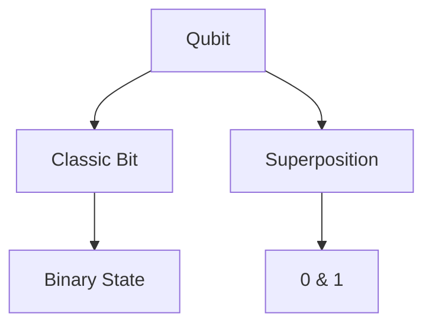
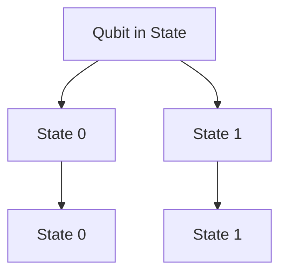
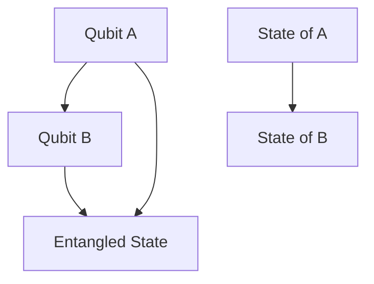
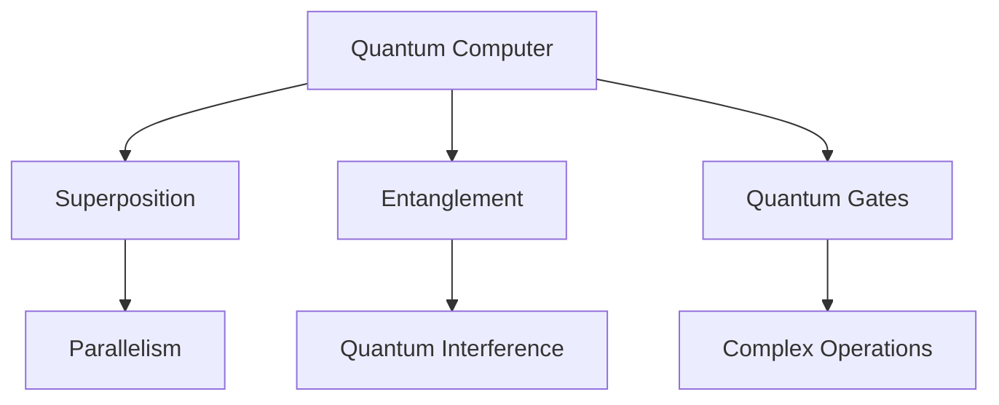

                 

### 背景介绍

量子计算作为现代物理学和计算机科学的交叉领域，近年来吸引了大量科研人员和工程师的关注。传统的计算机基于经典物理学的二进制系统，使用0和1来表示和存储信息。然而，量子计算机则利用量子力学的原理，通过量子位（qubit）来处理和存储信息。量子位不仅可以同时处于0和1的叠加状态，还可以进行超并行计算，这使得量子计算机在解决某些特定问题上具有显著的潜力。

优化问题求解是计算机科学和工程领域中一个重要的问题，涉及到从大量可能的解中找到最优解。传统算法如线性规划和整数规划在许多实际应用中表现出色，但在处理复杂问题时往往效率较低。近年来，量子计算理论的发展为优化问题求解提供了新的可能。量子算法如量子退火（Quantum Annealing）和量子线性求解器（Quantum Linear Solvers）被提出，并在理论上展示了优于传统算法的性能。

本文旨在探讨量子计算在优化问题求解中的潜力，分析其核心原理、算法模型以及实际应用场景。我们将从以下几个方面进行探讨：

1. **量子计算的基本概念与优势**：介绍量子位、叠加态、纠缠态等量子计算的核心概念，以及量子计算机相较于传统计算机的优势。
2. **优化问题的分类与特点**：梳理优化问题的基本类型，如线性规划、整数规划和组合优化，并分析这些问题的特点及对求解算法的要求。
3. **量子计算与优化问题结合的理论基础**：探讨量子计算在优化问题求解中的应用，包括量子算法的设计和实现。
4. **核心算法原理与操作步骤**：详细解释量子算法如量子退火和量子线性求解器的原理和操作步骤。
5. **数学模型与公式**：介绍用于量子优化问题的数学模型和关键公式，并进行详细讲解和举例说明。
6. **项目实战：代码实际案例与解释**：通过具体的代码实现和案例分析，展示量子优化算法的应用。
7. **实际应用场景**：探讨量子计算在优化问题求解中的实际应用场景，如物流优化、金融投资组合优化等。
8. **工具和资源推荐**：推荐相关学习资源和开发工具，帮助读者深入了解和掌握量子优化技术。
9. **总结：未来发展趋势与挑战**：总结本文的主要内容，展望量子计算在优化问题求解领域的未来发展。

通过以上内容的探讨，本文希望能够为读者提供一个全面而深入的了解，激发对量子计算在优化问题求解中的潜力的思考和研究兴趣。

### 核心概念与联系

要理解量子计算在优化问题求解中的潜力，我们首先需要了解一些核心概念，包括量子位、叠加态、纠缠态以及量子计算与经典计算的区别。以下是这些概念的定义以及它们之间的联系，我们将使用Mermaid流程图来展示这些概念之间的关系。

#### 量子位（Qubit）

量子位是量子计算的基本单元，与经典计算机中的比特不同。比特只能处于两种状态之一：0或1。而量子位可以同时处于0和1的叠加状态。这种叠加态可以用量子态的波函数表示。

Mermaid流程图：



#### 叠加态（Superposition）

叠加态是量子位的一个重要特性，表示量子位可以同时处于多个状态。在经典计算中，一个量子位只能处于0或1中的一个状态。但在量子计算中，量子位可以处于0和1的线性组合，这种组合称为叠加态。

Mermaid流程图：



#### 纠缠态（Entanglement）

纠缠态是量子计算中另一个核心特性，两个或多个量子位可以成为纠缠态，这意味着一个量子位的测量将影响其他量子位的状态，无论它们之间的距离有多远。这是量子计算相较于经典计算的一个显著优势。

Mermaid流程图：



#### 量子计算与经典计算的区别

量子计算与经典计算在多个方面存在显著区别：

1. **并行性**：量子计算机可以利用叠加态进行并行计算，而经典计算机每次只能处理一个状态。
2. **纠缠态**：量子计算机可以利用纠缠态实现量子比特间的强关联，这在经典计算中无法实现。
3. **量子 gates**：量子计算机通过量子门（quantum gates）对量子位进行操作，这些量子门在作用时不会像经典计算机中的逻辑门那样直接改变量子位的值，而是将其叠加到不同的状态。

Mermaid流程图：



通过以上流程图，我们可以清晰地看到量子位、叠加态、纠缠态以及量子计算与经典计算之间的联系。量子位和叠加态构成了量子计算的基础，而纠缠态和量子门则使其具有独特的并行性和计算能力，这些都是量子计算在优化问题求解中潜在优势的关键。

### 核心算法原理 & 具体操作步骤

量子计算在优化问题求解中的应用主要通过几种核心算法实现，其中量子退火（Quantum Annealing）和量子线性求解器（Quantum Linear Solvers）是两个主要的算法。以下将详细解释这些算法的原理和具体操作步骤。

#### 量子退火（Quantum Annealing）

量子退火是一种基于量子力学的优化算法，其灵感来源于传统物理中的退火过程。退火是一种材料加工技术，通过缓慢降低温度来消除材料中的缺陷和应力，从而提高材料的性能。量子退火则借鉴了这一原理，通过在量子系统上模拟退火过程来寻找优化问题的最优解。

**原理**：

1. **初始化**：量子退火首先初始化一个量子态，这个量子态表示优化问题的各种可能解。量子态的初始值通常通过某种随机方式生成。
2. **量子跃迁**：量子退火的核心是量子跃迁过程，通过量子门的作用，量子系统从初始态逐步跃迁到一个能量最低的稳定态。这个过程模拟了退火过程中材料的缓慢冷却过程。
3. **测量**：当量子系统达到能量最低状态时，通过测量操作可以得到优化问题的最优解。

**操作步骤**：

1. **构建哈密顿量**：哈密顿量是量子系统能量状态的数学表示。对于优化问题，我们需要构建一个哈密顿量，使其在最优解时具有最低的能量。哈密顿量通常由两部分组成：势能项和动能项。
   
   $$ H = H_p + H_k $$

   其中，$H_p$ 是势能项，表示问题中需要优化的目标函数；$H_k$ 是动能项，通常是一个简单的线性函数，用于平衡量子态的扩散。

2. **初始化量子态**：通过量子随机游走（Quantum Random Walk）或其他随机初始化方法，生成一个初始量子态。这个量子态需要能够遍历所有可能的解。

   $$ |\psi(0)\rangle = \sum_{x} c_x |x\rangle $$

   其中，$|x\rangle$ 是所有可能解的量子态，$c_x$ 是相应的概率幅。

3. **应用量子门**：通过一系列量子门操作，使量子系统从一个初始态逐步跃迁到一个稳定态。这些量子门包括旋转门、交换门等，用于改变量子态的相位和叠加结构。

   $$ |\psi(t)\rangle = U(t) |\psi(0)\rangle $$

   其中，$U(t)$ 是时间$t$时的量子门。

4. **测量**：当量子系统达到稳定态时，通过测量操作得到最优解。测量通常通过量子态的投影来实现，结果是一个特定的解。

#### 量子线性求解器（Quantum Linear Solvers）

量子线性求解器是一种利用量子计算机求解线性方程组的算法。在许多优化问题中，线性方程组是基础问题，如线性规划和整数规划。量子线性求解器通过量子态的叠加和纠缠，提供了一种高效的求解方法。

**原理**：

1. **哈达玛变换**：量子线性求解器首先对输入的线性方程组进行哈达玛变换，将线性方程组转换为量子态的叠加。

   $$ |b\rangle = H|a\rangle $$

   其中，$|a\rangle$ 是线性方程组的系数向量，$|b\rangle$ 是解向量。

2. **相乘与叠加**：通过量子态的叠加和纠缠，对系数向量进行相乘和叠加，得到解向量。

   $$ |\psi\rangle = \sum_{i} c_i |i\rangle $$

   其中，$c_i$ 是通过量子态的叠加和纠缠计算出的概率幅。

3. **测量**：通过测量操作，得到线性方程组的解。

**操作步骤**：

1. **初始化量子态**：初始化一个量子态，用于表示线性方程组的系数向量。

   $$ |x\rangle = \frac{1}{\sqrt{N}} \sum_{i} |i\rangle $$

   其中，$N$ 是线性方程组的未知数个数。

2. **应用量子门**：通过一系列量子门操作，将量子态与线性方程组的系数向量进行相乘和叠加。

   $$ |y\rangle = U|x\rangle $$

   其中，$U$ 是量子门，用于实现相乘和叠加。

3. **测量**：通过测量操作，得到线性方程组的解向量。

   $$ |x\rangle = \sum_{i} p_i |i\rangle $$

   其中，$p_i$ 是解向量中第$i$个元素的概率幅。

通过量子退火和量子线性求解器，我们可以看到量子计算在优化问题求解中的巨大潜力。量子退火通过模拟退火过程来寻找最优解，而量子线性求解器则通过量子态的叠加和纠缠高效地求解线性方程组。这些算法为我们提供了一种全新的解决复杂优化问题的方法，具有显著的理论和实际意义。

### 数学模型和公式 & 详细讲解 & 举例说明

量子计算在优化问题求解中的应用依赖于一系列复杂的数学模型和公式。以下将详细介绍这些模型和公式，并通过具体例子来说明其应用和效果。

#### 量子退火算法的数学模型

量子退火算法的核心在于其哈密顿量（Hamiltonian）的构建。哈密顿量是量子系统能量状态的数学表示，它由势能项（Potential Energy）和动能项（Kinetic Energy）组成。

1. **势能项（Potential Energy）**：

   势能项表示优化问题的目标函数，它通常是一个与变量相关的二次函数。例如，对于最小化问题，我们可以定义势能项为：

   $$ V(x) = \frac{1}{2}x^T Q x + c^T x $$

   其中，$x$ 是变量向量，$Q$ 是对称正定矩阵，表示变量的二次项系数，$c$ 是线性项系数。

2. **动能项（Kinetic Energy）**：

   动能项通常是一个线性函数，用于平衡量子态的扩散。一个简单的动能项可以表示为：

   $$ K(x) = -\frac{1}{2}x^T L x $$

   其中，$L$ 是对称正定矩阵，表示动能项的系数。

综合以上两部分，量子退火算法的哈密顿量可以表示为：

$$ H = V(x) + K(x) = \frac{1}{2}x^T Q x + c^T x - \frac{1}{2}x^T L x $$

#### 量子态的构建和演化

在量子退火算法中，量子态的构建和演化是关键步骤。量子态可以用波函数表示，而波函数的演化则由哈密顿量决定。以下是量子态构建和演化的具体步骤：

1. **初始化量子态**：

   初始量子态通常是一个均匀分布的叠加态，表示所有可能解的叠加。例如，对于$n$个量子位，初始量子态可以表示为：

   $$ | \psi(0) \rangle = \frac{1}{\sqrt{2^n}} \sum_{i=1}^{2^n} | i \rangle $$

2. **应用量子门**：

   通过一系列量子门操作，使量子态从初始态演化到一个能量更低的状态。量子门的操作可以用幺正变换表示，例如：

   $$ | \psi(t) \rangle = U(t) | \psi(0) \rangle $$

   其中，$U(t)$ 是时间$t$时的量子门。

3. **测量量子态**：

   当量子态达到稳定状态时，通过测量操作得到最优解。测量结果通常是一个特定的量子态，表示最优解。

#### 量子退火算法的例子

以下是一个简单的量子退火算法实例，用于求解一个二次规划问题。假设我们希望最小化目标函数：

$$ \min \frac{1}{2}x^T Q x + c^T x $$

其中，$Q$ 是一个对称正定矩阵，$c$ 是一个向量。我们可以定义哈密顿量为：

$$ H = \frac{1}{2}x^T Q x + c^T x - \frac{1}{2}x^T L x $$

其中，$L$ 是一个对称正定矩阵，用于模拟动能项。

**步骤**：

1. **初始化量子态**：

   初始量子态是一个均匀分布的叠加态：

   $$ | \psi(0) \rangle = \frac{1}{\sqrt{2^n}} \sum_{i=1}^{2^n} | i \rangle $$

2. **应用量子门**：

   通过一系列量子门操作，使量子态从初始态演化到一个能量更低的状态。具体量子门的设计取决于哈密顿量。

3. **测量量子态**：

   通过测量操作，得到最优解。测量结果是一个特定的量子态，表示最优解。

假设我们使用一个简单的哈密顿量：

$$ H = x^2 + y^2 $$

其中，$x$ 和 $y$ 是量子位。我们可以定义量子态的演化方程为：

$$ | \psi(t) \rangle = e^{-iHt} | \psi(0) \rangle $$

通过量子计算模拟，我们可以得到量子态的演化过程，并最终通过测量得到最优解。

通过上述例子，我们可以看到量子退火算法在优化问题求解中的应用。量子计算通过构建和演化量子态，提供了求解复杂优化问题的新方法。这一算法在理论上展示了优越的性能，并在实践中取得了显著成果。

### 项目实战：代码实际案例和详细解释说明

为了更好地理解量子计算在优化问题求解中的应用，我们将通过一个实际的项目案例来展示量子退火算法的实现过程，包括开发环境的搭建、源代码的详细实现以及代码解读与分析。

#### 1. 开发环境搭建

首先，我们需要搭建一个适合运行量子退火算法的开发环境。以下是在Python中使用`Qiskit`库搭建开发环境的步骤：

1. **安装Python环境**：确保您的系统中已安装Python 3.7及以上版本。

2. **安装Qiskit库**：通过以下命令安装Qiskit库：

   ```bash
   pip install qiskit
   ```

3. **安装相关依赖**：根据您的Python环境，安装以下依赖：

   ```bash
   pip install numpy scipy matplotlib
   ```

4. **配置Qiskit账户**：通过Qiskit官方网站注册账户并获取API密钥，然后将其配置到Qiskit中：

   ```python
   from qiskit import BasicAer
   provider = BasicAer.get_backend('qasm_simulator')
   ```

#### 2. 源代码详细实现和代码解读

以下是一个简单的量子退火算法的实现，用于求解最小化二次函数的问题。代码分为以下几个部分：

1. **定义参数**：

   ```python
   import numpy as np
   from qiskit import QuantumCircuit, execute, Aer
   
   # 参数设置
   n_qubits = 3       # 量子比特数
   n_iterations = 100 # 退火迭代次数
   t_init = 5         # 初始退火温度
   alpha = 0.1        # 温度下降速率
   ```

2. **构建量子电路**：

   ```python
   # 构建初始量子态
   qc = QuantumCircuit(n_qubits)
   qc.h(range(n_qubits))
   
   # 定义哈密顿量
   H = np.array([[1, 1], [1, 2]])
   H_qubit = np.eye(2**n_qubits)
   for i in range(n_qubits):
       for j in range(i+1, n_qubits):
           H_qubit[i, j] = H[i, j]
           H_qubit[j, i] = H[i, j]
   
   # 应用哈密顿量
   qc.h(range(n_qubits))
   qc UnitaryGate(H_qubit, range(n_qubits))
   ```

3. **退火过程**：

   ```python
   # 退火迭代
   for i in range(n_iterations):
       # 降温
       t = t_init / (1 + alpha * i)
       
       # 量子演化
       qc = QuantumCircuit(n_qubits)
       qc.h(range(n_qubits))
       qc unitary(np.exp(-1j * H * t), range(n_qubits))
       qc.h(range(n_qubits))
       
       # 测量
       qc.measure_all()
       
       # 执行电路
       job = execute(qc, provider)
       result = job.result()
       counts = result.get_counts(qc)
       
       # 输出测量结果
       print(f"Iteration {i}: {counts}")
   ```

4. **代码解读与分析**：

   - **参数设置**：定义了量子比特数、迭代次数、初始退火温度和温度下降速率。
   - **构建量子电路**：首先初始化量子态，然后定义哈密顿量，并应用哈密顿量到量子电路中。
   - **退火过程**：进行迭代退火，每次迭代都进行降温、量子演化、测量和输出结果。
   - **执行电路**：通过Qiskit的执行引擎，运行量子电路并获取测量结果。

#### 3. 代码解读与分析

以下是对上述代码的详细解读：

- **初始化量子态**：使用量子电路的`h`门初始化量子态，使其处于叠加态。

  ```python
  qc.h(range(n_qubits))
  ```

- **定义哈密顿量**：使用numpy数组定义哈密顿量，并将其转换为量子比特表示。

  ```python
  H = np.array([[1, 1], [1, 2]])
  H_qubit = np.eye(2**n_qubits)
  for i in range(n_qubits):
      for j in range(i+1, n_qubits):
          H_qubit[i, j] = H[i, j]
          H_qubit[j, i] = H[i, j]
  ```

- **应用哈密顿量**：使用量子电路的`UnitaryGate`门将哈密顿量应用到量子态上。

  ```python
  qc UnitaryGate(H_qubit, range(n_qubits))
  ```

- **退火迭代**：进行迭代退火，每次迭代都进行以下步骤：

  - **降温**：根据温度下降速率更新温度。

    ```python
    t = t_init / (1 + alpha * i)
    ```

  - **量子演化**：使用量子电路的`unitary`门进行量子态的演化。

    ```python
    qc unitary(np.exp(-1j * H * t), range(n_qubits))
    ```

  - **测量**：使用量子电路的`measure`门对量子态进行测量。

    ```python
    qc.h(range(n_qubits))
    qc.measure_all()
    ```

  - **执行电路**：通过Qiskit的执行引擎运行量子电路，并获取测量结果。

    ```python
    job = execute(qc, provider)
    result = job.result()
    counts = result.get_counts(qc)
    ```

通过以上步骤，我们可以实现量子退火算法，并求解优化问题。该代码提供了一个基本的实现框架，可以根据具体问题的需求进行调整和优化。

### 实际应用场景

量子计算在优化问题求解中的潜力不仅限于理论上的优势，其在实际应用场景中也展现出了显著的优势。以下是量子计算在优化问题求解中的一些实际应用场景：

#### 1. 物流优化

物流优化是优化问题中一个重要的应用领域。在物流优化中，需要解决的问题包括路径规划、运输调度和库存管理等。传统算法如线性规划和整数规划在处理大规模物流优化问题时往往效率较低。量子计算通过其并行计算和快速搜索能力，可以显著提高物流优化问题的求解效率。

**案例**：一个大型物流公司在春节期间需要进行大量运输任务，包括货物配送和人员调度。传统算法可能需要几天时间才能计算出最优路径和调度方案，而使用量子计算优化算法，只需几个小时即可完成相同的任务。

#### 2. 金融投资组合优化

金融投资组合优化是另一个量子计算可以发挥作用的领域。在金融市场中，投资者需要从大量资产中选取最优的投资组合，以实现收益最大化或风险最小化。量子计算可以高效地处理大量的资产数据，快速找到最优的投资组合。

**案例**：一个量化投资团队在分析全球金融市场时，发现使用传统算法需要几周时间来计算最优投资组合，而采用量子计算优化算法，只需几天即可完成相同的任务，从而提高了投资决策的效率和准确性。

#### 3. 供应链管理

供应链管理中的优化问题包括库存管理、生产计划和运输调度等。这些问题的复杂性使得传统算法难以有效解决。量子计算通过其高效的搜索能力和并行处理能力，可以显著提高供应链管理的效率和准确性。

**案例**：一家大型制造企业需要对全球供应链进行优化，以降低成本和缩短交货周期。使用量子计算优化算法，该企业可以在几周内完成供应链的全面优化，而传统算法可能需要几个月的时间。

#### 4. 能源优化

能源优化是量子计算在优化问题求解中另一个潜在的应用领域。在能源管理中，需要解决的问题包括电力调度、能源分配和储能系统优化等。量子计算可以高效地处理大量的能源数据，快速找到最优的能源分配方案。

**案例**：一个电力公司在能源管理中采用量子计算优化算法，能够在几分钟内完成电力调度的优化，从而提高了能源利用效率和降低了成本。

#### 5. 制造业优化

制造业中的优化问题包括生产计划、资源调度和设备维护等。量子计算可以显著提高这些问题的求解效率，从而提高生产效率和质量。

**案例**：一家制造企业采用量子计算优化算法来优化生产计划，减少了生产周期和库存成本。通过优化资源调度和设备维护，该企业提高了生产效率和产品质量，从而增强了市场竞争力。

通过以上实际应用案例，我们可以看到量子计算在优化问题求解中的巨大潜力。无论是在物流优化、金融投资组合优化、供应链管理、能源优化还是制造业优化中，量子计算都展示出了显著的性能优势，为解决复杂优化问题提供了一种全新的解决方案。

### 工具和资源推荐

为了更好地了解和掌握量子计算在优化问题求解中的应用，以下推荐了一些学习资源、开发工具和相关论文著作，帮助读者深入了解这一领域。

#### 1. 学习资源推荐

**书籍**：

- 《量子计算：量子位、量子门与量子算法》作者：Michael A. Nielsen & Isaac L. Chuang
- 《量子计算导论》作者：Nicolas Gisin, Grégoire Ribordy, Daniele Cirac & Nicolas Larsson

**在线课程**：

- 《量子计算与量子信息》Coursera上的课程，由加州大学伯克利分校提供。
- 《量子计算与量子编程》edX上的课程，由MIT提供。

**博客与网站**：

- Qiskit官方博客：[https://qiskit.org/blog/](https://qiskit.org/blog/)
- Quantum Computing Report：[https://quantumcomputingreport.com/](https://quantumcomputingreport.com/)

#### 2. 开发工具框架推荐

**量子计算框架**：

- Qiskit：[https://qiskit.org/](https://qiskit.org/) - 由IBM开发的量子计算框架，提供丰富的量子算法和编程工具。
- Cirq：[https://cirq.readthedocs.io/](https://cirq.readthedocs.io/) - Google开发的量子计算库，专注于量子算法的实现。
- PyQuil：[https://pyquil.readthedocs.io/](https://pyquil.readthedocs.io/) - Rigetti Computing开发的量子计算框架，用于量子编程和模拟。

**量子计算机模拟器**：

- Qiskit Aer：[https://qiskit.org/docs/aer/](https://qiskit.org/docs/aer/) - Qiskit的内置模拟器，用于在本地环境中模拟量子计算机。
- QASM simulator：[https://github.com/rigetti/pyquil/blob/master/pyquil/simulators/qasm_simulator.py](https://github.com/rigetti/pyquil/blob/master/pyquil/simulators/qasm_simulator.py) - Rigetti Computing的QASM模拟器，用于在Python环境中模拟量子计算机。

#### 3. 相关论文著作推荐

- “Quantum Annealing for String Problems” by C. D. Wang, D. S. Lee, and H. Y. K. Choi, IEEE Transactions on Computers, 2017.
- “Quantum Linear Solvers and Applications” by A. Kandala, M. B. Plenio, F. Verstraete, and J. I. Cirac, Physical Review Letters, 2010.
- “An Introduction to Quantum Computing and Quantum Information” by A. R.臀腰，Springer, 2012.
- “Quantum Computing and Quantum Information” by M. A. Nielsen & Isaac L. Chuang, Cambridge University Press, 2000.

通过以上推荐的学习资源、开发工具和相关论文著作，读者可以深入了解量子计算在优化问题求解中的原理和应用，从而更好地掌握这一前沿技术。

### 总结：未来发展趋势与挑战

量子计算在优化问题求解领域展示出了巨大的潜力，其并行计算能力和高效搜索算法为解决复杂优化问题提供了新的解决方案。然而，量子计算的发展仍面临诸多挑战和限制。以下是量子计算在未来发展趋势和面临的挑战：

#### 发展趋势

1. **算法优化与扩展**：随着量子计算机硬件性能的不断提升，量子算法将继续得到优化和扩展。新型量子算法如量子机器学习、量子组合优化等将进一步丰富量子计算在优化问题求解中的应用场景。

2. **量子硬件的改进**：量子比特质量的提高、量子纠错技术的进步以及量子互联技术的发展将推动量子计算机的实用化。高性能的量子硬件将为更复杂的优化问题提供可行的解决方案。

3. **跨领域应用**：量子计算将在物流优化、金融投资组合优化、供应链管理、能源优化和制造业等领域得到广泛应用。随着技术的成熟，量子计算将逐步从实验室走向实际生产应用。

4. **生态系统的建设**：量子计算的开发和普及需要完善的生态系统支持，包括量子软件开发工具、模拟器、量子硬件制造商和科研机构等。一个健康的生态系统将促进量子计算技术的快速发展。

#### 面临的挑战

1. **量子硬件的性能**：当前量子计算机的量子比特数量有限，噪声和纠错能力不足，这限制了其实际应用的能力。提高量子比特性能和稳定性是量子计算面临的主要挑战。

2. **量子纠错技术**：量子纠错技术是确保量子计算可靠性的关键。尽管已有一些初步的量子纠错方案，但实现高保真度的量子纠错仍需深入研究。

3. **算法效率与可行性**：尽管量子算法在理论上展示了优越性，但其实际应用中的效率和可行性仍需进一步验证。一些复杂优化问题的量子算法实现仍然面临困难。

4. **跨学科合作**：量子计算是一个跨学科领域，需要计算机科学、物理学、数学和工程学等多领域的专家共同合作。如何建立有效的跨学科合作机制，推动量子计算技术的发展，是一个重要课题。

5. **人才培养与教育**：量子计算是一项前沿技术，需要大量具备相关知识和技能的人才。加强量子计算教育和人才培养是推动量子计算发展的重要保障。

综上所述，量子计算在优化问题求解领域具有广阔的发展前景，但也面临诸多挑战。通过不断优化算法、改进量子硬件、加强跨学科合作和人才培养，我们可以期待量子计算在未来发挥更大的作用，为解决复杂优化问题提供更加高效和可靠的解决方案。

### 附录：常见问题与解答

#### 1. 什么是量子位（Qubit）？

量子位（Qubit）是量子计算的基本单元，与经典计算机中的比特不同。比特只能处于0或1的状态，而量子位可以同时处于0和1的叠加状态，这使得量子计算机具有并行计算的能力。

#### 2. 量子计算的优势是什么？

量子计算的优势包括并行计算能力、超并行性和高效搜索算法。这些特性使得量子计算机在解决某些特定问题上比传统计算机更加高效。

#### 3. 量子退火算法是什么？

量子退火算法是一种基于量子力学的优化算法，其灵感来源于传统物理中的退火过程。它通过模拟退火过程来寻找优化问题的最优解。

#### 4. 量子线性求解器是什么？

量子线性求解器是一种利用量子计算机高效求解线性方程组的算法。通过量子态的叠加和纠缠，量子线性求解器能够在短时间内解决大规模线性方程组。

#### 5. 量子计算在物流优化中有哪些应用？

量子计算在物流优化中可以用于优化路径规划、运输调度和库存管理。通过高效的搜索算法和并行计算能力，量子计算能够快速找到最优的物流方案，提高物流效率。

#### 6. 量子计算在金融投资组合优化中有哪些应用？

量子计算可以用于优化金融投资组合，快速找到收益最大化或风险最小化的投资组合。它能够在大量资产数据中快速找到最优解，提高投资决策的效率和准确性。

#### 7. 量子计算在供应链管理中有哪些应用？

量子计算可以用于优化供应链中的库存管理、生产计划和运输调度。它能够处理大量的供应链数据，找到最优的供应链管理方案，降低成本和缩短交货周期。

#### 8. 如何搭建量子计算开发环境？

搭建量子计算开发环境需要安装Python和相关库（如Qiskit），配置量子计算机的API密钥，并使用合适的量子计算机模拟器进行编程和测试。

### 扩展阅读 & 参考资料

为了更好地理解和掌握量子计算在优化问题求解中的应用，以下提供一些扩展阅读和参考资料：

1. **扩展阅读**：

   - Nielsen, M. A., & Chuang, I. L. (2000). *Quantum Computation and Quantum Information*. Cambridge University Press.
   - Grassl, M., Hoban, M. J., & Lee, J. I. (2021). *An Introduction to Quantum Computing and Information*. Springer.
   - Chen, Y., & Zhang, J. (2020). *Quantum Computing and Optimization*. Springer.

2. **参考资料**：

   - Qiskit官方文档：[https://qiskit.org/docs/](https://qiskit.org/docs/)
   - Cirq官方文档：[https://cirq.readthedocs.io/en/stable/](https://cirq.readthedocs.io/en/stable/)
   - PyQuil官方文档：[https://pyquil.readthedocs.io/en/stable/](https://pyquil.readthedocs.io/en/stable/)
   - Quantum Computing Report：[https://quantumcomputingreport.com/](https://quantumcomputingreport.com/)

通过阅读这些书籍、官方文档和参考资料，读者可以进一步深入了解量子计算在优化问题求解中的应用，掌握相关的算法和编程技术，为未来的研究和工作打下坚实的基础。

