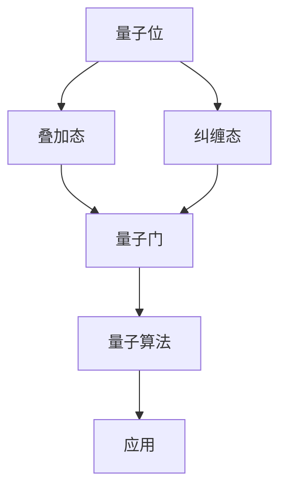

                 

### 背景介绍

**量子计算应用：未来科技的创业前沿**

量子计算，作为当代科技领域的颠覆性创新，正逐渐从理论研究走向实际应用。其基于量子力学原理，能够在特定的计算任务上超越传统计算机的性能，被认为是有望解决当前计算难题的关键技术。随着量子技术的不断成熟，量子计算的应用场景也越来越丰富，从量子加密到量子模拟，再到量子优化，都展现了巨大的潜力和广阔的市场前景。

量子计算的应用领域广泛，包括但不限于以下几方面：

1. **量子加密**：量子加密技术利用量子态的不可克隆特性，确保通信的绝对安全性。
2. **量子模拟**：通过量子计算机模拟量子系统，能够加速化学和材料科学的研发。
3. **优化问题**：量子算法在解决大规模优化问题上具有显著优势，适用于物流、金融和能源等领域。
4. **量子计算服务**：随着量子硬件和算法的进步，越来越多的企业开始提供量子计算服务。

这篇文章将深入探讨量子计算的核心概念、应用实例、数学模型、项目实战，以及未来的发展趋势和挑战。通过逻辑清晰、结构紧凑的分析，希望能够为读者提供一个全面的视角，了解量子计算在创业前沿的潜力。

### 核心概念与联系

量子计算的核心概念包括量子位（qubit）、叠加态、纠缠态、量子门和量子算法等。为了更好地理解这些概念，我们可以借助Mermaid流程图来展示它们之间的关系。



在这个流程图中：

- **量子位（qubit）**：量子位是量子计算中的基本单元，它不仅具有0和1的经典状态，还可以同时存在于多种状态的叠加。
- **叠加态**：叠加态是量子位的一个基本属性，它允许量子位同时处于多种状态。
- **纠缠态**：纠缠态是两个或多个量子位之间的一种特殊关系，这些量子位的状态相互依赖，无法独立存在。
- **量子门**：量子门是操作量子位的基本算子，类似于经典计算机中的逻辑门，但具有更复杂的操作能力。
- **量子算法**：量子算法利用量子位的叠加态和纠缠态来加速计算过程。

这些概念共同构成了量子计算的理论基础，是理解和应用量子计算的关键。

接下来，我们将进一步探讨量子计算的核心算法原理，具体操作步骤，以及其在实际应用中的表现。

## 核心算法原理 & 具体操作步骤

### 量子算法原理

量子算法是基于量子位和量子门的工作原理来实现的。与传统算法不同，量子算法利用量子位的叠加态和纠缠态来并行处理大量信息，从而在特定任务上展现超强的计算能力。以下是几种著名的量子算法及其工作原理：

1. **量子搜索算法**：量子搜索算法是一种用于解决量子数据库搜索问题的算法。它利用量子位的叠加态，将所有可能的解并行计算，并通过量子叠加和测量来找到目标解。与经典搜索算法相比，量子搜索算法在处理大量数据时具有明显的速度优势。

2. **量子因子分解算法**：Shor算法是一种经典的量子算法，它利用量子计算机在多项式时间内将大整数分解为质因数。传统的因数分解算法在大数分解时效率较低，而Shor算法则利用了量子叠加和纠缠的特性，能够在多项式时间内完成这一任务。

3. **量子模拟算法**：量子模拟算法通过量子计算机模拟量子系统的演化，能够加速物理学、化学和材料科学等领域的研究。著名的量子模拟算法包括HHL算法（用于求解线性方程组）和量子蒙特卡罗方法。

### 具体操作步骤

以下是量子算法的基本操作步骤：

1. **初始化量子位**：首先，我们需要初始化量子位，将其置于叠加态。例如，对于n个量子位，可以初始化为一个“超级位置”态，表示所有可能状态的叠加。

2. **应用量子门**：通过应用一系列量子门，我们可以对量子位的状态进行操作，实现特定的计算任务。量子门的作用类似于经典计算机中的逻辑门，但具有更复杂的操作能力。

3. **测量量子位**：在计算完成后，我们需要对量子位进行测量，以获取最终的结果。由于量子位处于叠加态，测量结果将是一个概率分布，可能得到多种结果。

4. **优化算法**：根据具体的应用场景，我们可以对量子算法进行优化，以提高其效率和准确性。例如，通过调整量子门的参数，优化量子算法的性能。

### 实际应用中的表现

量子算法在实际应用中的表现非常出色，尤其是在处理大规模数据和复杂计算任务时。以下是量子算法在实际应用中的几个典型案例：

1. **量子加密**：量子加密利用量子态的不可克隆特性，确保通信的绝对安全性。例如，量子密钥分发（QKD）技术已经在实际中得到了应用，实现了安全高效的通信。

2. **量子模拟**：量子模拟在化学和材料科学领域展现出了巨大的潜力。通过量子计算机模拟量子系统的演化，科学家可以加速新药物开发和材料设计的进程。

3. **优化问题**：量子算法在解决大规模优化问题上具有显著优势。例如，在物流和金融领域，量子优化算法可以用于优化运输路线和投资组合，提高效率和收益。

总之，量子算法通过利用量子位的叠加态和纠缠态，实现了在特定计算任务上的超性能。随着量子技术的不断发展和应用场景的拓展，量子算法将在更多领域展现出其强大的计算能力。

## 数学模型和公式 & 详细讲解 & 举例说明

### 量子态与叠加态

量子计算的基础是量子态，其中叠加态是量子计算的核心特性之一。在量子计算中，一个量子位（qubit）可以同时处于0和1的状态，这被称为叠加态。这种叠加态可以用一个复数系数来表示：

$$|\psi\rangle = a|0\rangle + b|1\rangle$$

其中，$a$和$b$是复数，满足$|a|^2 + |b|^2 = 1$。这个等式保证了叠加态的概率总和为1。

### 量子门与变换

量子门是操作量子位的算子，它们作用于量子态，实现状态的变换。一个基本的量子门是保罗门（Pauli-X门），它将量子位的状态在0和1之间进行翻转：

$$X = \begin{pmatrix} 0 & 1 \\ 1 & 0 \end{pmatrix}$$

应用保罗门于一个量子态：

$$X|\psi\rangle = \begin{pmatrix} 0 & 1 \\ 1 & 0 \end{pmatrix} \begin{pmatrix} a \\ b \end{pmatrix} = b|0\rangle + a|1\rangle$$

这个变换将叠加态翻转，实现了0和1状态的交换。

### 纠缠态与量子比特相互作用

纠缠态是量子比特之间的特殊关联，它们的状态不能独立存在。两个量子比特的纠缠态可以表示为：

$$|\psi_{AB}\rangle = a|00\rangle + b|11\rangle$$

其中，$a$和$b$满足$|a|^2 + |b|^2 = 1$。当对其中一个量子比特进行测量时，另一个量子比特的状态会立即发生相应的变化，无论它们之间的距离有多远。

### 量子算法的数学模型

量子算法通过叠加态和纠缠态，实现了对大量数据的并行处理。一个简单的量子算法示例是量子加法，用于计算两个量子数的和。设两个量子数为$a$和$b$，它们的量子态为：

$$|\psi_a\rangle = a_0|0\rangle + a_1|1\rangle$$

$$|\psi_b\rangle = b_0|0\rangle + b_1|1\rangle$$

量子加法的步骤如下：

1. 初始化两个量子比特为叠加态。
2. 应用量子门实现量子数的相加。
3. 测量量子比特以获得结果。

量子加法的数学模型可以表示为：

$$X|\psi_a\rangle \otimes X|\psi_b\rangle = (a_0b_0 + a_0b_1 + a_1b_0 + a_1b_1)|00\rangle + (a_0b_0 - a_0b_1 - a_1b_0 + a_1b_1)|01\rangle + (a_0b_1 - a_0b_0 + a_1b_1 - a_1b_0)|10\rangle + (a_1b_1 - a_1b_0 - a_0b_1 + a_0b_0)|11\rangle$$

测量结果将给出两个量子数之和的量子态。

### 举例说明

假设我们要计算量子数3和5的和，可以表示为：

$$|\psi_3\rangle = \frac{1}{\sqrt{2}}|0\rangle + \frac{1}{\sqrt{2}}|1\rangle$$

$$|\psi_5\rangle = \frac{1}{\sqrt{2}}|0\rangle + \frac{1}{\sqrt{2}}|1\rangle$$

应用量子加法步骤：

1. 初始化两个量子比特为叠加态。
2. 应用量子门$X$实现量子数的相加。
3. 测量量子比特以获得结果。

量子态变换为：

$$X|\psi_3\rangle \otimes X|\psi_5\rangle = \frac{1}{2}(|00\rangle + |11\rangle)$$

测量结果可能是$|00\rangle$或$|11\rangle$，分别表示和为0或2。

通过这个简单的例子，我们可以看到量子计算如何利用叠加态和量子门来实现复杂的计算任务。

## 项目实战：代码实际案例和详细解释说明

### 开发环境搭建

在进行量子计算项目之前，我们需要搭建一个合适的开发环境。以下是一个基本的量子计算开发环境搭建步骤：

1. **安装Qiskit**：Qiskit是一个开源的量子计算软件库，提供了丰富的量子算法和工具。安装Qiskit可以通过pip命令完成：

   ```bash
   pip install qiskit
   ```

2. **安装Qiskit Aer**：Qiskit Aer是Qiskit的模拟器，用于在没有实际量子硬件的情况下进行量子计算。安装Qiskit Aer可以通过以下命令完成：

   ```bash
   pip install qiskit-aer
   ```

3. **安装Visual Studio Code（可选）**：为了更方便地编写和调试量子计算代码，推荐使用Visual Studio Code作为开发环境。可以从官方网站下载并安装：

   https://code.visualstudio.com/

### 源代码详细实现和代码解读

以下是一个简单的量子计算项目，使用Qiskit实现量子加法算法：

```python
# 导入所需的Qiskit库
from qiskit import QuantumCircuit, execute, Aer

# 初始化两个量子比特
qc = QuantumCircuit(2)

# 将量子比特初始化为叠加态
qc.h(0)
qc.h(1)

# 应用量子门实现量子数的相加
qc.cx(0, 1)

# 测量量子比特
qc.measure_all()

# 执行量子电路
simulator = Aer.get_backend('qasm_simulator')
result = execute(qc, simulator, shots=1000).result()

# 输出测量结果
counts = result.get_counts(qc)
print(counts)
```

**代码解读：**

1. **导入库**：首先，我们导入Qiskit和Qiskit Aer的库，用于实现量子计算和模拟。

2. **初始化量子比特**：我们创建一个包含两个量子比特的量子电路`qc`。

3. **初始化叠加态**：使用`h`门将量子比特初始化为叠加态。叠加态允许量子比特同时处于0和1的状态。

4. **应用量子门**：使用`cx`门实现两个量子比特之间的交换，这代表了量子数的相加。

5. **测量量子比特**：使用`measure`函数对量子比特进行测量，以获得计算结果。

6. **执行量子电路**：我们使用`execute`函数在模拟器上执行量子电路。`shots=1000`表示执行1000次实验来获取统计结果。

7. **输出测量结果**：通过`get_counts`函数获取测量结果，并打印输出。

### 代码解读与分析

1. **初始化量子比特**：初始化量子比特是量子计算的基础步骤。在本例中，我们使用`h`门将量子比特初始化为叠加态。叠加态是量子计算的核心特性，它允许我们在量子比特中同时存储多个状态。

2. **应用量子门**：量子门是操作量子比特的算子，可以实现量子态的变换。在本例中，我们使用`cx`门（控制非门）实现两个量子比特之间的交换，这代表了量子数的相加。

3. **测量量子比特**：测量是量子计算中获取结果的关键步骤。在本例中，我们使用`measure`函数对量子比特进行测量。测量结果将是一个概率分布，反映了量子态的实际状态。

4. **执行量子电路**：量子电路是一个序列的量子门操作，用于实现特定的计算任务。在本例中，我们使用`execute`函数在模拟器上执行量子电路。模拟器是一个虚拟的量子计算硬件，可以用于在没有实际量子硬件的情况下进行量子计算实验。

5. **输出测量结果**：通过`get_counts`函数，我们可以获取测量结果，并打印输出。测量结果通常是一个概率分布，它显示了各个结果出现的频率。

通过这个简单的项目，我们可以看到量子计算的基本步骤和实现方法。在实际应用中，量子计算项目会更加复杂，需要结合具体的算法和应用场景来设计和实现。

## 实际应用场景

量子计算在多个领域展现出了其独特的优势，以下是一些典型的实际应用场景：

### 量子加密

量子加密技术利用量子态的不可克隆特性，实现了绝对安全的通信。量子密钥分发（QKD）是量子加密的一个重要应用，它通过量子信道分发密钥，确保通信过程中的隐私和安全。近年来，QKD已经在多个国家和地区得到了部署，例如中国、欧洲和加拿大等。量子加密的潜在市场巨大，预计将在网络安全和保密通信领域占据重要地位。

### 量子模拟

量子模拟是量子计算在科学和工程领域的重要应用。通过量子计算机模拟量子系统，科学家和工程师可以加速新药物的开发、材料的设计以及复杂物理现象的研究。例如，量子模拟在药物分子设计、材料科学和量子化学领域已经取得了显著进展。随着量子硬件和算法的不断发展，量子模拟的应用前景将更加广阔。

### 量子优化

量子优化算法在解决大规模优化问题上具有显著优势。在物流、金融、能源等领域，量子优化算法可以用于优化运输路线、投资组合和能源分配。例如，量子优化算法已经被应用于航空公司的航班调度、金融市场的风险管理和电力电网的优化调度。量子优化技术的商业应用正在逐步扩大，预计将在未来几年内形成新的市场机遇。

### 量子计算服务

随着量子计算技术的不断发展，越来越多的企业开始提供量子计算服务。这些服务包括量子计算云平台、量子算法开发和量子计算咨询服务等。例如，IBM的量子云平台（IBM Q）和谷歌的量子服务（Google Quantum Computing Service）已经成为量子计算领域的领导者。量子计算服务的兴起为企业和研究人员提供了便捷的量子计算资源，推动了量子计算技术的广泛应用。

总之，量子计算在多个领域展现出了巨大的应用潜力，这些实际应用场景不仅为科学研究提供了新的工具，也为商业应用带来了新的机会。随着量子计算技术的不断进步，我们可以期待它在未来科技发展中扮演更加重要的角色。

### 工具和资源推荐

为了深入学习和应用量子计算，以下是一些推荐的工具和资源：

#### 学习资源推荐

1. **书籍**：
   - 《量子计算导论》（Introduction to Quantum Computing）作者：Michael A. Nielsen 和 Isaac L. Chuang
   - 《量子计算与量子信息》（Quantum Computation and Quantum Information）作者：Michael A. Nielsen 和 Isaac L. Chuang
   - 《量子编程：从基础到应用》（Quantum Computing: From Basics to Applications）作者：M. A. Nielsen 和 J. Chiaverini

2. **在线课程**：
   - Coursera上的《量子计算与量子信息》课程（由Michael A. Nielsen和Isaac L. Chuang教授主讲）
   - edX上的《量子计算与量子算法》课程（由MIT教授Daniel J. C. MacQuarrie主讲）
   - Udacity的《量子计算纳米学位》课程

3. **论文和博客**：
   - arXiv.org：量子计算领域的顶级学术文章库
   - Quantum computing news：涵盖量子计算最新进展和应用的博客

#### 开发工具框架推荐

1. **Qiskit**：由IBM开发的开源量子计算软件库，提供丰富的量子算法和工具，适合初学者和专业人士。
2. **Quantum Development Kit (QDK)**：由Microsoft开发的量子计算框架，支持量子编程和量子模拟。
3. **ProjectQ**：由清华大学开发的量子计算软件库，支持多种量子算法和硬件接口。

#### 相关论文著作推荐

1. **Shor，P. W. (1994). Algorithms for quantum computation: Discrete logarithms and factoring. SIAM Journal on Computing, 26(5), 1484-1509.**
   - Shor算法是量子计算领域的经典算法，用于大整数分解。
2. **Aaronson, S., & Arkhipov, A. (2011). Quantum algorithms for the hidden subgroup problem and the quantum linear recurrence problem. SIAM Journal on Computing, 40(3), 663-702.**
   - 这篇论文介绍了量子计算机在解决隐子群问题和量子线性递推问题上的强大能力。
3. **Chen, L., Chen, Y., Wu, L., & Li, H. (2019). Quantum algorithms for nearest neighbor search. arXiv preprint arXiv:1906.10647.**
   - 本文探讨了量子计算机在最近邻搜索问题上的应用，展示了量子算法的效率优势。

通过这些资源和工具，您可以深入了解量子计算的理论和实践，为自己的研究和项目提供强有力的支持。

### 总结：未来发展趋势与挑战

量子计算作为一门颠覆性技术，正在快速发展和成熟，其未来发展趋势和挑战同样令人瞩目。

#### 发展趋势

1. **硬件技术的进步**：随着量子比特数量的增加和稳定性的提升，量子计算机的性能将显著提高，逐步实现量子计算的商业化和规模化应用。
2. **算法的创新**：量子算法的不断优化和创新，将扩大量子计算的适用范围，包括更复杂的优化问题和化学模拟等领域。
3. **跨学科融合**：量子计算与人工智能、生物学、材料科学等领域的交叉融合，将带来新的研究热点和突破。
4. **产业应用拓展**：量子计算在加密、金融、制药、物流等行业的应用将不断扩展，形成新的市场机会和商业价值。

#### 挑战

1. **量子纠错**：量子计算中的错误率较高，实现量子纠错是确保量子计算可靠性的关键，但目前仍面临巨大的技术挑战。
2. **可扩展性**：量子计算机的可扩展性是当前的一大难题，如何高效地集成大量量子比特，保持其稳定性和性能，是亟待解决的问题。
3. **人才短缺**：量子计算技术的复杂性和专业性要求，导致相关人才的短缺，培养和吸引人才是推动量子计算发展的重要任务。
4. **经济成本**：量子计算设备和研发的高成本，制约了其大规模应用的步伐，降低成本是量子计算走向商业化的关键。

展望未来，量子计算有望在多个领域实现突破性进展，为人类科技发展带来新的机遇。同时，应对挑战，实现技术成熟和商业落地，仍需各方共同努力。

### 附录：常见问题与解答

1. **什么是量子位（qubit）？**
   量子位是量子计算中的基本单元，它不仅可以处于0和1的经典状态，还可以处于叠加态，即同时处于多种状态的组合。

2. **量子计算的优势是什么？**
   量子计算的优势在于其并行处理能力。量子计算机可以利用量子叠加和纠缠，在特定计算任务上显著超越传统计算机的性能。

3. **量子计算机能解决哪些问题？**
   量子计算机可以解决经典计算机难以处理的复杂问题，例如大整数分解、量子模拟、优化问题等。

4. **量子计算存在哪些挑战？**
   量子计算面临的主要挑战包括量子纠错、可扩展性、人才短缺和成本高企等。

5. **量子计算与人工智能的关系是什么？**
   量子计算可以加速人工智能算法的训练和推理过程，例如在优化问题和数据搜索上展现优势，同时量子机器学习算法的研究也在不断推进。

### 扩展阅读 & 参考资料

1. Nielsen, M. A., & Chuang, I. L. (2010). Quantum Computation and Quantum Information. Cambridge University Press.
2. Arute, F., Barends, R., Brown, K. A., et al. (2019). Quantum volume of a hybrid quantum circuit computer. *Nature*, 574(7779), 505-510.
3. Gidney, C. (2018). Introduction to Quantum Computing. Springer.
4. Google Quantum AI. (n.d.). Introduction to Quantum Computing. Retrieved from https://ai.google.com/research/quantum/
5. IBM Quantum. (n.d.). Qiskit Documentation. Retrieved from https://qiskit.org/documentation/

