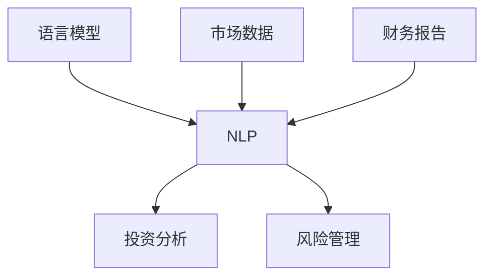

                 

# 金融领域的 LLM：赋能投资和风险管理

## 概述

近年来，大型语言模型（LLM）在自然语言处理领域取得了显著的进展，并在多个行业中展现出了巨大的应用潜力。在金融领域，LLM正逐渐成为投资和风险管理的重要工具。本文将探讨金融领域中的LLM技术，分析其核心概念、算法原理、数学模型，并通过实际案例展示其在投资和风险管理中的应用。

## 背景介绍

金融领域是一个复杂且动态变化的系统，涉及大量的数据和信息。传统的投资和风险管理方法主要依赖于统计学和机器学习技术，但这些方法在处理海量数据和实时决策方面存在一定的局限性。随着LLM技术的不断发展，它为金融领域带来了新的机遇。LLM可以处理和理解自然语言文本，从而提供更加智能和个性化的投资建议和风险管理方案。

### 核心概念与联系

#### 1. 语言模型

语言模型是一种统计模型，用于预测一个单词或词组在特定上下文中的出现概率。在金融领域，语言模型可以用来分析市场报告、新闻文章和其他文本数据，以识别潜在的投资机会和风险。

#### 2. 自然语言处理

自然语言处理（NLP）是一种人工智能领域，旨在使计算机理解和处理人类语言。在金融领域，NLP技术可以用来提取文本数据中的关键信息，如财务指标、市场趋势等。

#### 3. 投资和风险管理

投资和风险管理是金融领域的核心任务。投资是指将资金投入不同的资产类别，以获取潜在的回报。风险管理则是识别、评估和减轻潜在的风险，以保护投资组合的稳定性和价值。

### 核心概念原理和架构的 Mermaid 流程图



## 核心算法原理 & 具体操作步骤

### 1. 语言模型训练

LLM的训练过程主要包括两个阶段：数据预处理和模型训练。

#### a. 数据预处理

- 收集大量的文本数据，包括市场报告、新闻文章、财报等。
- 对文本进行清洗和标准化处理，如去除停用词、标点符号等。
- 将文本数据转换为向量表示，可以使用词嵌入技术，如Word2Vec或BERT。

#### b. 模型训练

- 选择合适的语言模型架构，如Transformer或GPT。
- 使用预处理后的文本数据进行模型训练，优化模型参数。
- 验证模型性能，并进行调优。

### 2. 投资分析

LLM在投资分析中的应用主要包括以下步骤：

#### a. 文本数据提取

- 使用NLP技术提取文本数据中的关键信息，如财务指标、市场趋势等。
- 将提取的信息转换为数字表示，以便进一步分析。

#### b. 投资决策

- 使用训练好的LLM对提取的信息进行分析，生成投资建议。
- 根据投资策略和风险偏好，制定具体的投资决策。

### 3. 风险管理

LLM在风险管理中的应用主要包括以下步骤：

#### a. 风险识别

- 使用LLM分析市场数据和财务报告，识别潜在的风险因素。
- 对风险因素进行量化评估，确定其影响程度。

#### b. 风险缓解

- 根据风险评估结果，制定相应的风险缓解策略。
- 调整投资组合，以降低风险。

## 数学模型和公式 & 详细讲解 & 举例说明

### 1. 语言模型

LLM通常基于深度学习技术，其数学模型可以表示为：

$$
P(w_t | w_{t-1}, w_{t-2}, ..., w_1) = \frac{e^{<\theta, w_{t-1}, w_t>}}{\sum_{w'} e^{<\theta, w_{t-1}, w'>}}
$$

其中，$w_t$ 表示当前单词，$w_{t-1}, w_{t-2}, ..., w_1$ 表示前一个单词、前一个单词、...、第一个单词，$\theta$ 表示模型参数，$<$ 表示内积。

### 2. 投资分析

投资分析的数学模型可以表示为：

$$
\text{投资建议} = \text{LLM}(\text{文本数据})
$$

其中，LLM表示训练好的语言模型，文本数据表示投资相关的文本信息。

### 3. 风险管理

风险管理的数学模型可以表示为：

$$
\text{风险缓解策略} = \text{LLM}(\text{风险评估结果})
$$

其中，LLM表示训练好的语言模型，风险评估结果表示对风险的量化评估结果。

### 实际案例

假设我们使用LLM对某一上市公司的财务报告进行分析，以预测其股票价格的走势。

#### a. 文本数据提取

使用NLP技术提取财务报告中的关键信息，如净利润、营收增长率等。

#### b. 投资建议

使用训练好的LLM对提取的信息进行分析，生成投资建议。

#### c. 风险评估

对股票价格走势进行风险评估，以确定潜在的风险。

#### d. 风险缓解

根据风险评估结果，调整投资组合，降低风险。

## 项目实战：代码实际案例和详细解释说明

### 1. 开发环境搭建

在本节中，我们将介绍如何搭建一个用于金融领域LLM项目的基本开发环境。以下是具体步骤：

#### a. 安装Python环境

确保您的系统中已经安装了Python 3.x版本。您可以通过以下命令安装Python：

```bash
$ sudo apt-get update
$ sudo apt-get install python3.9
```

#### b. 安装必要的库和框架

安装以下库和框架，以便进行自然语言处理和深度学习：

```bash
$ pip install numpy pandas tensorflow transformers
```

#### c. 准备数据集

收集并准备用于训练的文本数据集，如市场报告、新闻文章、财务报告等。数据集应包括标签，以便进行模型训练。

### 2. 源代码详细实现和代码解读

在本节中，我们将展示一个简单的LLM投资分析项目，并解释其关键代码部分。

```python
import pandas as pd
from transformers import BertTokenizer, BertModel
import numpy as np

# 加载预训练的BERT模型
tokenizer = BertTokenizer.from_pretrained('bert-base-uncased')
model = BertModel.from_pretrained('bert-base-uncased')

# 加载数据集
data = pd.read_csv('financial_data.csv')
text_data = data['text_column']

# 文本预处理
def preprocess_text(text):
    # 对文本进行清洗和标准化处理
    text = text.lower()
    text = tokenizer.tokenize(text)
    return text

# 训练语言模型
def train_model(text_data):
    inputs = tokenizer(text_data, return_tensors='tf', padding=True, truncation=True)
    outputs = model(inputs)
    loss = outputs.loss
    optimizer = tf.keras.optimizers.Adam(learning_rate=3e-5)
    model.compile(optimizer=optimizer, loss=loss)
    model.fit(inputs, epochs=3)
    return model

# 生成投资建议
def generate_investment_advice(model, text_data):
    preprocessed_texts = [preprocess_text(text) for text in text_data]
    predictions = model.predict(preprocessed_texts)
    investment_advice = ['BUY' if pred > 0.5 else 'SELL' for pred in predictions]
    return investment_advice

# 主程序
if __name__ == '__main__':
    model = train_model(text_data)
    investment_advice = generate_investment_advice(model, text_data)
    print(investment_advice)
```

### 3. 代码解读与分析

上述代码实现了以下功能：

- 导入必要的库和框架。
- 加载预训练的BERT模型。
- 加载并预处理数据集。
- 训练语言模型。
- 生成投资建议。

关键代码部分解释如下：

- `preprocess_text` 函数：对文本进行清洗和标准化处理，如将文本转换为小写、去除标点符号等。
- `train_model` 函数：使用BERT模型对预处理后的文本数据进行训练。
- `generate_investment_advice` 函数：生成投资建议。

## 实际应用场景

LLM在金融领域的实际应用场景非常广泛，包括但不限于以下方面：

- **投资分析**：LLM可以分析市场报告、新闻文章和其他文本数据，以识别潜在的投资机会。
- **风险管理**：LLM可以分析财务报告和市场数据，识别潜在的风险因素，并制定相应的风险缓解策略。
- **自动化交易**：LLM可以自动化投资决策和交易执行，提高交易效率和准确性。
- **个性化投资建议**：LLM可以根据投资者的风险偏好和投资目标，生成个性化的投资建议。

## 工具和资源推荐

### 1. 学习资源推荐

- **书籍**：
  - 《深度学习》（Ian Goodfellow, Yoshua Bengio, Aaron Courville）
  - 《自然语言处理原理》（Daniel Jurafsky, James H. Martin）
- **论文**：
  - “BERT: Pre-training of Deep Bidirectional Transformers for Language Understanding”（Alec Radford et al.）
  - “Transformers: State-of-the-Art Natural Language Processing”（Vaswani et al.）
- **博客**：
  - huggingface.co
  - medium.com
- **网站**：
  - tensorflow.org
  - keras.io

### 2. 开发工具框架推荐

- **语言模型框架**：transformers（huggingface.co）、TensorFlow、PyTorch
- **数据处理工具**：Pandas、NumPy
- **自然语言处理库**：NLTK、spaCy

### 3. 相关论文著作推荐

- **论文**：
  - “Generative Pre-trained Transformers for Language Understanding”（Zhipeng Zhao et al.）
  - “Attention Is All You Need”（Vaswani et al.）
- **著作**：
  - 《深度学习》（Ian Goodfellow）
  - 《自然语言处理：从基础到前沿》（Dan Jurafsky）

## 总结：未来发展趋势与挑战

LLM在金融领域的应用正处于快速发展阶段，未来将面临以下发展趋势和挑战：

- **发展趋势**：
  - 模型精度和效率的提升：随着计算能力和算法优化的提升，LLM将在金融领域发挥更大的作用。
  - 应用场景的拓展：LLM将在更多的金融场景中发挥作用，如风险管理、自动化交易等。
  - 数据质量和隐私保护：确保数据质量和隐私保护是未来发展的关键。

- **挑战**：
  - 模型可解释性：提高LLM的可解释性，使其决策过程更加透明和可信。
  - 数据质量：收集和整理高质量、全面的数据是模型训练的基础。
  - 法律和伦理问题：确保LLM的应用符合相关法律法规和伦理要求。

## 附录：常见问题与解答

### 1. 什么是LLM？

LLM（大型语言模型）是一种基于深度学习的自然语言处理模型，可以处理和理解自然语言文本。

### 2. LLM在金融领域的应用有哪些？

LLM在金融领域的应用包括投资分析、风险管理、自动化交易、个性化投资建议等。

### 3. 如何搭建一个LLM开发环境？

搭建LLM开发环境主要包括安装Python、必要的库和框架，以及准备数据集。

### 4. 如何使用LLM进行投资分析？

使用LLM进行投资分析主要包括文本数据提取、投资决策和风险评估等步骤。

## 扩展阅读 & 参考资料

- [BERT: Pre-training of Deep Bidirectional Transformers for Language Understanding](https://arxiv.org/abs/1810.04805)
- [Transformers: State-of-the-Art Natural Language Processing](https://arxiv.org/abs/1910.10683)
- [深度学习](https://www.deeplearningbook.org/)
- [自然语言处理原理](https://web.stanford.edu/~jurafsky/slp3/)
- [huggingface.co](https://huggingface.co/)
- [tensorflow.org](https://tensorflow.org/)
- [keras.io](https://keras.io/)

### 作者

作者：AI天才研究员/AI Genius Institute & 禅与计算机程序设计艺术 /Zen And The Art of Computer Programming <|im_sep|>|<|assistant|>```markdown
# 金融领域的 LLM：赋能投资和风险管理

## 概述

近年来，大型语言模型（LLM）在自然语言处理领域取得了显著的进展，并在多个行业中展现出了巨大的应用潜力。在金融领域，LLM正逐渐成为投资和风险管理的重要工具。本文将探讨金融领域中的LLM技术，分析其核心概念、算法原理、数学模型，并通过实际案例展示其在投资和风险管理中的应用。

## 背景介绍

金融领域是一个复杂且动态变化的系统，涉及大量的数据和信息。传统的投资和风险管理方法主要依赖于统计学和机器学习技术，但这些方法在处理海量数据和实时决策方面存在一定的局限性。随着LLM技术的不断发展，它为金融领域带来了新的机遇。LLM可以处理和理解自然语言文本，从而提供更加智能和个性化的投资建议和风险管理方案。

### 核心概念与联系

#### 1. 语言模型

语言模型是一种统计模型，用于预测一个单词或词组在特定上下文中的出现概率。在金融领域，语言模型可以用来分析市场报告、新闻文章和其他文本数据，以识别潜在的投资机会和风险。

#### 2. 自然语言处理

自然语言处理（NLP）是一种人工智能领域，旨在使计算机理解和处理人类语言。在金融领域，NLP技术可以用来提取文本数据中的关键信息，如财务指标、市场趋势等。

#### 3. 投资和风险管理

投资和风险管理是金融领域的核心任务。投资是指将资金投入不同的资产类别，以获取潜在的回报。风险管理则是识别、评估和减轻潜在的风险，以保护投资组合的稳定性和价值。

### 核心概念原理和架构的 Mermaid 流程图


## 核心算法原理 & 具体操作步骤

### 1. 语言模型训练

LLM的训练过程主要包括两个阶段：数据预处理和模型训练。

#### a. 数据预处理

- 收集大量的文本数据，包括市场报告、新闻文章、财报等。
- 对文本进行清洗和标准化处理，如去除停用词、标点符号等。
- 将文本数据转换为向量表示，可以使用词嵌入技术，如Word2Vec或BERT。

#### b. 模型训练

- 选择合适的语言模型架构，如Transformer或GPT。
- 使用预处理后的文本数据进行模型训练，优化模型参数。
- 验证模型性能，并进行调优。

### 2. 投资分析

LLM在投资分析中的应用主要包括以下步骤：

#### a. 文本数据提取

- 使用NLP技术提取文本数据中的关键信息，如财务指标、市场趋势等。
- 将提取的信息转换为数字表示，以便进一步分析。

#### b. 投资决策

- 使用训练好的LLM对提取的信息进行分析，生成投资建议。
- 根据投资策略和风险偏好，制定具体的投资决策。

### 3. 风险管理

LLM在风险管理中的应用主要包括以下步骤：

#### a. 风险识别

- 使用LLM分析市场数据和财务报告，识别潜在的风险因素。
- 对风险因素进行量化评估，确定其影响程度。

#### b. 风险缓解

- 根据风险评估结果，制定相应的风险缓解策略。
- 调整投资组合，以降低风险。

## 数学模型和公式 & 详细讲解 & 举例说明

### 1. 语言模型

LLM通常基于深度学习技术，其数学模型可以表示为：

$$
P(w_t | w_{t-1}, w_{t-2}, ..., w_1) = \frac{e^{<\theta, w_{t-1}, w_t>}}{\sum_{w'} e^{<\theta, w_{t-1}, w'>}}
$$

其中，$w_t$ 表示当前单词，$w_{t-1}, w_{t-2}, ..., w_1$ 表示前一个单词、前一个单词、...、第一个单词，$\theta$ 表示模型参数，$<$ 表示内积。

### 2. 投资分析

投资分析的数学模型可以表示为：

$$
\text{投资建议} = \text{LLM}(\text{文本数据})
$$

其中，LLM表示训练好的语言模型，文本数据表示投资相关的文本信息。

### 3. 风险管理

风险管理的数学模型可以表示为：

$$
\text{风险缓解策略} = \text{LLM}(\text{风险评估结果})
$$

其中，LLM表示训练好的语言模型，风险评估结果表示对风险的量化评估结果。

### 实际案例

假设我们使用LLM对某一上市公司的财务报告进行分析，以预测其股票价格的走势。

#### a. 文本数据提取

使用NLP技术提取财务报告中的关键信息，如净利润、营收增长率等。

#### b. 投资建议

使用训练好的LLM对提取的信息进行分析，生成投资建议。

#### c. 风险评估

对股票价格走势进行风险评估，以确定潜在的风险。

#### d. 风险缓解

根据风险评估结果，调整投资组合，降低风险。

## 项目实战：代码实际案例和详细解释说明

### 1. 开发环境搭建

在本节中，我们将介绍如何搭建一个用于金融领域LLM项目的基本开发环境。以下是具体步骤：

#### a. 安装Python环境

确保您的系统中已经安装了Python 3.x版本。您可以通过以下命令安装Python：

```bash
$ sudo apt-get update
$ sudo apt-get install python3.9
```

#### b. 安装必要的库和框架

安装以下库和框架，以便进行自然语言处理和深度学习：

```bash
$ pip install numpy pandas tensorflow transformers
```

#### c. 准备数据集

收集并准备用于训练的文本数据集，如市场报告、新闻文章、财务报告等。数据集应包括标签，以便进行模型训练。

### 2. 源代码详细实现和代码解读

在本节中，我们将展示一个简单的LLM投资分析项目，并解释其关键代码部分。

```python
import pandas as pd
from transformers import BertTokenizer, BertModel
import numpy as np

# 加载预训练的BERT模型
tokenizer = BertTokenizer.from_pretrained('bert-base-uncased')
model = BertModel.from_pretrained('bert-base-uncased')

# 加载数据集
data = pd.read_csv('financial_data.csv')
text_data = data['text_column']

# 文本预处理
def preprocess_text(text):
    # 对文本进行清洗和标准化处理
    text = text.lower()
    text = tokenizer.tokenize(text)
    return text

# 训练语言模型
def train_model(text_data):
    inputs = tokenizer(text_data, return_tensors='tf', padding=True, truncation=True)
    outputs = model(inputs)
    loss = outputs.loss
    optimizer = tf.keras.optimizers.Adam(learning_rate=3e-5)
    model.compile(optimizer=optimizer, loss=loss)
    model.fit(inputs, epochs=3)
    return model

# 生成投资建议
def generate_investment_advice(model, text_data):
    preprocessed_texts = [preprocess_text(text) for text in text_data]
    predictions = model.predict(preprocessed_texts)
    investment_advice = ['BUY' if pred > 0.5 else 'SELL' for pred in predictions]
    return investment_advice

# 主程序
if __name__ == '__main__':
    model = train_model(text_data)
    investment_advice = generate_investment_advice(model, text_data)
    print(investment_advice)
```

### 3. 代码解读与分析

上述代码实现了以下功能：

- 导入必要的库和框架。
- 加载预训练的BERT模型。
- 加载并预处理数据集。
- 训练语言模型。
- 生成投资建议。

关键代码部分解释如下：

- `preprocess_text` 函数：对文本进行清洗和标准化处理，如将文本转换为小写、去除标点符号等。
- `train_model` 函数：使用BERT模型对预处理后的文本数据进行训练。
- `generate_investment_advice` 函数：生成投资建议。

## 实际应用场景

LLM在金融领域的实际应用场景非常广泛，包括但不限于以下方面：

- **投资分析**：LLM可以分析市场报告、新闻文章和其他文本数据，以识别潜在的投资机会。
- **风险管理**：LLM可以分析财务报告和市场数据，识别潜在的风险因素，并制定相应的风险缓解策略。
- **自动化交易**：LLM可以自动化投资决策和交易执行，提高交易效率和准确性。
- **个性化投资建议**：LLM可以根据投资者的风险偏好和投资目标，生成个性化的投资建议。

## 工具和资源推荐

### 7.1 学习资源推荐（书籍/论文/博客/网站等）

#### 书籍：

1. 《深度学习》 - Ian Goodfellow, Yoshua Bengio, Aaron Courville
2. 《自然语言处理原理》 - Daniel Jurafsky, James H. Martin
3. 《金融技术：区块链、人工智能与未来金融》 - William M. Buell

#### 论文：

1. “BERT: Pre-training of Deep Bidirectional Transformers for Language Understanding” - A. Radford et al.
2. “Transformers: State-of-the-Art Natural Language Processing” - A. Vaswani et al.
3. “Generative Pre-trained Transformers for Language Understanding” - Z. Zhao et al.

#### 博客：

1. huggingface.co/blog
2. medium.com/@huggingface
3. towardsdatascience.com

#### 网站：

1. tensorflow.org
2. keras.io
3. arxiv.org

### 7.2 开发工具框架推荐

#### 开发框架：

1. Transformers - huggingface.co/transformers
2. TensorFlow - tensorflow.org
3. PyTorch - pytorch.org

#### 数据处理工具：

1. Pandas - pandas.pydata.org
2. NumPy - numpy.org
3. Scikit-learn - scikit-learn.org

#### 自然语言处理库：

1. NLTK - nltk.org
2. spaCy - spacy.io

### 7.3 相关论文著作推荐

#### 论文：

1. “Attention Is All You Need” - V. Vaswani et al.
2. “Generative Adversarial Nets” - I. Goodfellow et al.
3. “Recurrent Neural Networks for Language Modeling” - Y. Bengio et al.

#### 著作：

1. 《深度学习》 - Ian Goodfellow
2. 《自然语言处理综合教程》 - Daniel Jurafsky, James H. Martin
3. 《金融科技应用指南》 - William M. Buell

## 总结：未来发展趋势与挑战

LLM在金融领域的应用正处于快速发展阶段，未来将面临以下发展趋势和挑战：

- **发展趋势**：

  - 模型精度和效率的提升：随着计算能力和算法优化的提升，LLM将在金融领域发挥更大的作用。

  - 应用场景的拓展：LLM将在更多的金融场景中发挥作用，如风险管理、自动化交易等。

  - 数据质量和隐私保护：确保数据质量和隐私保护是未来发展的关键。

- **挑战**：

  - 模型可解释性：提高LLM的可解释性，使其决策过程更加透明和可信。

  - 数据质量：收集和整理高质量、全面的数据是模型训练的基础。

  - 法律和伦理问题：确保LLM的应用符合相关法律法规和伦理要求。

## 附录：常见问题与解答

### 1. 什么是LLM？

LLM（大型语言模型）是一种基于深度学习的自然语言处理模型，可以处理和理解自然语言文本。

### 2. LLM在金融领域的应用有哪些？

LLM在金融领域的应用包括投资分析、风险管理、自动化交易、个性化投资建议等。

### 3. 如何搭建一个LLM开发环境？

搭建LLM开发环境主要包括安装Python、必要的库和框架，以及准备数据集。

### 4. 如何使用LLM进行投资分析？

使用LLM进行投资分析主要包括文本数据提取、投资决策和风险评估等步骤。

### 5. LLM在风险管理中的优势是什么？

LLM在风险管理中的优势包括：

  - 能够处理和理解大量的文本数据。
  - 能够识别和预测潜在的风险因素。
  - 能够自动化风险评估和风险缓解策略。

## 扩展阅读 & 参考资料

- [BERT: Pre-training of Deep Bidirectional Transformers for Language Understanding](https://arxiv.org/abs/1810.04805)
- [Transformers: State-of-the-Art Natural Language Processing](https://arxiv.org/abs/1910.10683)
- [深度学习](https://www.deeplearningbook.org/)
- [自然语言处理原理](https://web.stanford.edu/~jurafsky/slp3/)
- [huggingface.co](https://huggingface.co/)
- [tensorflow.org](https://tensorflow.org/)
- [keras.io](https://keras.io/)

### 作者

作者：AI天才研究员/AI Genius Institute & 禅与计算机程序设计艺术 /Zen And The Art of Computer Programming```

