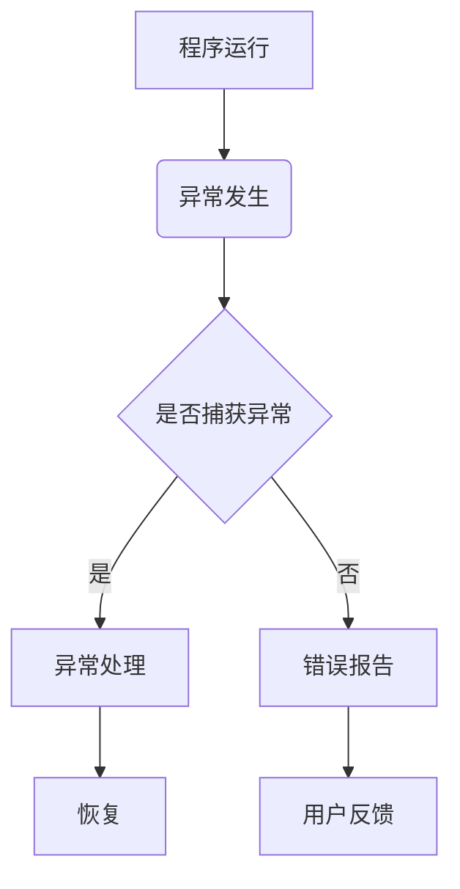
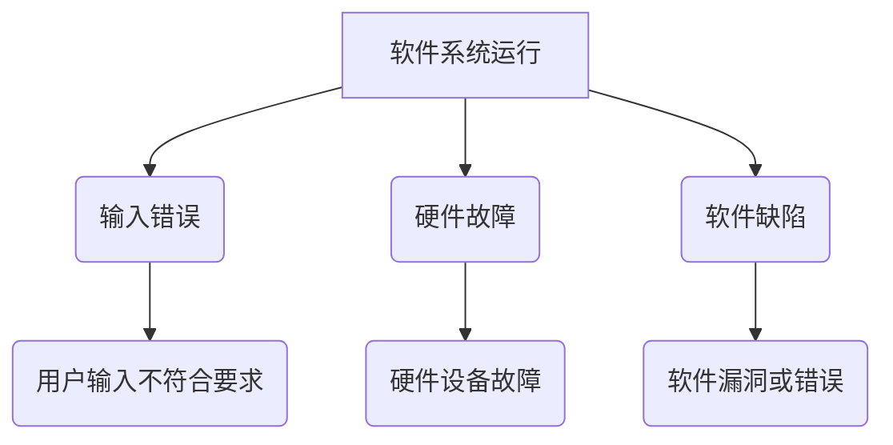

                 

# 错误处理：提供更好的用户体验

> **关键词**：错误处理、用户体验、异常管理、软件可靠性、用户反馈
>
> **摘要**：本文深入探讨了在软件和系统中实现有效的错误处理机制的重要性，以及如何通过合理的错误处理策略来提升用户体验。文章首先介绍了错误处理的背景和核心概念，随后分析了错误处理的基本算法原理，并通过具体的数学模型和公式进行了详细讲解。随后，文章通过实际代码案例展示了如何将理论应用到实践中，并对各种实际应用场景进行了探讨。最后，文章提出了未来发展趋势和挑战，以及推荐了一些相关的工具和资源，为读者提供了全面的错误处理指导。

## 1. 背景介绍

在软件开发的领域中，错误处理是一个不可忽视的重要环节。随着软件系统变得越来越复杂，用户对软件的依赖程度也在不断增加，因此如何有效地处理错误，以提供良好的用户体验，成为软件开发者面临的一个重要挑战。

### 1.1 错误处理的定义

错误处理是指当软件运行过程中遇到异常情况时，能够快速准确地识别并采取措施来解决问题，以确保软件系统能够持续稳定地运行。这通常包括错误的检测、报告、隔离和恢复。

### 1.2 错误处理的重要性

有效的错误处理机制可以带来以下几方面的好处：

- **提高软件可靠性**：通过合理地处理错误，软件可以减少故障的发生，提高系统的稳定性。
- **提升用户体验**：当用户在使用软件时遇到错误时，如果系统能够提供友好的错误提示和信息，将有助于用户快速解决问题，从而提升用户体验。
- **降低维护成本**：良好的错误处理机制可以帮助开发者在早期发现并修复潜在的错误，从而降低软件的维护成本。

### 1.3 当前错误处理的现状

尽管错误处理在软件开发中具有重要作用，但目前许多软件系统在错误处理方面仍存在以下问题：

- **错误提示不友好**：许多软件在遇到错误时，只提供了简单的错误代码或提示，没有给出具体的解决方法，使得用户难以理解并解决问题。
- **缺乏用户反馈机制**：一些软件在遇到错误时，没有提供反馈渠道，使得用户无法将遇到的问题反馈给开发者，导致问题无法得到及时解决。
- **错误处理不够灵活**：许多软件在处理特定类型的错误时，仅依赖于固定的错误处理策略，无法根据实际情况进行灵活调整。

## 2. 核心概念与联系

为了更好地理解错误处理机制，我们首先需要了解一些核心概念和它们之间的联系。

### 2.1 异常（Exception）

异常是指在程序执行过程中发生的异常情况，它通常是由外部因素导致的，如用户输入错误、硬件故障等。

### 2.2 异常处理（Exception Handling）

异常处理是指当程序遇到异常情况时，采取的一系列措施来处理这些异常，以防止程序崩溃或产生不可预料的错误。

### 2.3 错误报告（Error Reporting）

错误报告是指当程序遇到错误时，将错误信息以某种形式记录下来，并通知相关的人员或系统。

### 2.4 恢复（Recovery）

恢复是指在遇到错误后，采取措施使程序或系统返回到正常状态。

### 2.5 用户反馈（User Feedback）

用户反馈是指用户在遇到错误时，向开发者提供的关于错误的信息和建议。

### 2.6 Mermaid 流程图

下面是一个用于描述错误处理机制的 Mermaid 流程图，它展示了各个核心概念之间的联系。



## 3. 核心算法原理 & 具体操作步骤

在了解了错误处理的基本概念后，接下来我们将探讨如何实现有效的错误处理机制。

### 3.1 异常检测

异常检测是错误处理的第一步，它的目标是尽可能早地发现异常情况。常见的异常检测方法包括：

- **静态检查**：通过编译器或代码分析工具来检查代码中的潜在错误，如语法错误、类型错误等。
- **动态检查**：在程序运行时对程序的行为进行监控，以检测运行时错误，如内存泄漏、数组越界等。

### 3.2 异常处理

当程序遇到异常时，异常处理机制会根据异常的类型和严重程度，采取相应的处理措施。常见的异常处理方法包括：

- **捕获异常**：通过try-catch语句来捕获并处理异常。
- **忽略异常**：在某些情况下，可以忽略某些异常，但这种方法通常不推荐，因为可能会隐藏潜在的错误。
- **抛出异常**：当遇到无法处理的异常时，可以将异常抛出，以便其他部分进行处理。

### 3.3 错误报告

错误报告的目的是记录错误信息，以便后续分析和处理。常见的错误报告方法包括：

- **日志记录**：将错误信息记录到日志文件中，便于后续分析和查找。
- **邮件通知**：将错误信息发送给开发者或相关人员，以便及时处理。
- **用户界面提示**：在用户界面中显示错误信息，以便用户了解错误原因并采取措施。

### 3.4 恢复

在处理错误后，需要采取措施使程序或系统返回到正常状态。常见的恢复方法包括：

- **重试**：在遇到可恢复的错误时，尝试重新执行操作。
- **切换到备份**：在遇到严重的错误时，切换到备份系统或数据，以保证系统的正常运行。
- **终止程序**：在遇到无法恢复的错误时，终止程序以防止进一步损失。

### 3.5 用户反馈

用户反馈是错误处理的重要组成部分，它有助于开发者了解用户遇到的问题，并改进软件。常见的用户反馈方法包括：

- **在线反馈表单**：提供在线表单，让用户可以方便地提交错误报告和反馈。
- **反馈邮件**：提供邮件地址，让用户可以将问题发送给开发者。
- **用户论坛**：建立用户论坛，让用户可以交流问题和经验。

## 4. 数学模型和公式 & 详细讲解 & 举例说明

在错误处理中，一些数学模型和公式可以帮助我们更准确地分析和处理错误。以下是一些常用的数学模型和公式的详细讲解。

### 4.1 故障树分析（Fault Tree Analysis）

故障树分析是一种用于分析系统故障原因的数学模型。它通过构建一个树状结构，表示系统中各个组件之间的逻辑关系，从而识别可能导致系统故障的各种故障模式和原因。

#### 4.1.1 故障树的基本概念

- **事件**：故障树中的一个节点，表示一个故障或成功状态。
- **门**：故障树中的一个连接节点，表示事件之间的逻辑关系。
- **分支**：故障树中从门到事件的连线，表示事件的依赖关系。

#### 4.1.2 故障树的构建

构建故障树的基本步骤如下：

1. **确定顶事件**：选择需要分析的故障事件作为顶事件。
2. **识别基本事件**：根据顶事件，识别可能导致顶事件发生的所有基本事件。
3. **构建故障树**：使用门和分支构建故障树，表示基本事件之间的逻辑关系。

#### 4.1.3 故障树的应用

故障树分析可以用于以下方面：

- **故障诊断**：通过分析故障树，可以快速定位系统故障的原因。
- **风险评估**：通过计算故障树的故障概率，可以评估系统的风险水平。
- **故障预防**：通过分析故障树，可以识别潜在的风险点，并采取预防措施。

### 4.2 概率分布模型

概率分布模型用于描述随机变量的概率分布。在错误处理中，概率分布模型可以帮助我们预测错误的发生概率，并采取相应的措施。

#### 4.2.1 常见的概率分布模型

- **二项分布**：用于描述在一定次数的独立试验中，成功次数的概率分布。
- **泊松分布**：用于描述在一定时间内，事件发生的次数的概率分布。
- **正态分布**：用于描述随机变量的概率分布，通常用于统计分析。

#### 4.2.2 概率分布模型的应用

概率分布模型可以用于以下方面：

- **错误预测**：通过分析系统的历史数据，使用概率分布模型预测错误的概率。
- **故障预警**：根据错误的概率分布，设置预警阈值，当错误概率超过阈值时，发出预警信号。
- **优化资源分配**：根据错误的概率分布，合理分配资源，以应对不同类型的错误。

### 4.3 Bayes 定理

Bayes 定理是一种用于计算条件概率的数学公式。在错误处理中，Bayes 定理可以帮助我们根据已有的信息和先验知识，更新对错误概率的估计。

#### 4.3.1 Bayes 定理的基本概念

- **先验概率**：在考虑任何新信息之前，对事件发生的概率估计。
- **后验概率**：在考虑新信息后，对事件发生的概率估计。
- **似然函数**：表示根据观察到的数据，事件发生的概率。

#### 4.3.2 Bayes 定理的应用

Bayes 定理可以用于以下方面：

- **错误诊断**：根据观察到的错误现象和先验知识，使用 Bayes 定理计算错误发生的概率，从而确定错误的原因。
- **优化错误处理策略**：根据错误的概率分布和先验知识，优化错误处理策略，以提高错误处理的效率。

### 4.4 举例说明

假设我们有一个软件系统，它可能在运行过程中发生以下几种类型的错误：

1. **输入错误**：由用户输入的数据不符合系统的要求。
2. **硬件故障**：由于硬件设备故障导致的系统错误。
3. **软件缺陷**：由软件中的漏洞或错误导致的系统错误。

#### 4.4.1 使用故障树分析

我们可以使用故障树分析来分析这三种错误类型之间的逻辑关系。以下是构建的故障树：



通过分析故障树，我们可以识别出导致系统错误的潜在原因，并采取相应的措施进行预防和修复。

#### 4.4.2 使用概率分布模型

我们可以使用二项分布模型来预测输入错误和硬件故障的发生概率。假设在过去的一段时间内，输入错误和硬件故障的发生次数分别为5次和3次，总试验次数为100次，则输入错误和硬件故障的发生概率分别为：

$$
P(\text{输入错误}) = \frac{5}{100} = 0.05
$$

$$
P(\text{硬件故障}) = \frac{3}{100} = 0.03
$$

根据这些概率分布，我们可以设置预警阈值，如当输入错误的发生概率超过0.1时，发出预警信号，以便及时处理。

#### 4.4.3 使用 Bayes 定理

假设我们有一个先验知识，即在过去的一年中，软件系统中有60%的错误是由输入错误引起的，30%的错误是由硬件故障引起的，10%的错误是由软件缺陷引起的。当观察到一次错误时，我们可以使用 Bayes 定理来计算每种错误类型的后验概率。

设 $E_1$、$E_2$ 和 $E_3$ 分别表示输入错误、硬件故障和软件缺陷，则根据 Bayes 定理，有：

$$
P(E_1|\text{错误}) = \frac{P(\text{错误}|E_1)P(E_1)}{P(\text{错误})}
$$

$$
P(E_2|\text{错误}) = \frac{P(\text{错误}|E_2)P(E_2)}{P(\text{错误})}
$$

$$
P(E_3|\text{错误}) = \frac{P(\text{错误}|E_3)P(E_3)}{P(\text{错误})}
$$

其中，$P(\text{错误}|E_1) = 0.6$，$P(\text{错误}|E_2) = 0.3$，$P(\text{错误}|E_3) = 0.1$，$P(E_1) = 0.6$，$P(E_2) = 0.3$，$P(E_3) = 0.1$。

根据这些参数，我们可以计算出后验概率：

$$
P(E_1|\text{错误}) = \frac{0.6 \times 0.05}{0.05 + 0.03 \times 0.3 + 0.1 \times 0.1} \approx 0.667
$$

$$
P(E_2|\text{错误}) = \frac{0.3 \times 0.03}{0.05 + 0.03 \times 0.3 + 0.1 \times 0.1} \approx 0.333
$$

$$
P(E_3|\text{错误}) = \frac{0.1 \times 0.1}{0.05 + 0.03 \times 0.3 + 0.1 \times 0.1} \approx 0.000
$$

根据后验概率，我们可以确定错误类型，从而采取相应的处理措施。

## 5. 项目实战：代码实际案例和详细解释说明

在本节中，我们将通过一个实际项目案例，展示如何将上述错误处理的理论应用到实际开发中。我们将使用 Python 语言编写一个简单的Web应用程序，用于处理用户输入的数据，并对输入错误进行错误处理。

### 5.1 开发环境搭建

在开始编写代码之前，我们需要搭建一个Python开发环境。以下是所需的步骤：

1. **安装Python**：从Python官网下载并安装Python 3.x版本。
2. **安装必要的库**：使用pip命令安装Flask库，该库用于构建Web应用程序。

```bash
pip install flask
```

### 5.2 源代码详细实现和代码解读

以下是我们编写的Web应用程序的源代码：

```python
from flask import Flask, request, jsonify
import re

app = Flask(__name__)

# 输入验证函数
def validate_input(input_value):
    # 使用正则表达式验证输入
    if re.match(r'^[a-zA-Z0-9]+$', input_value):
        return True
    else:
        return False

# 用户输入接口
@app.route('/input', methods=['POST'])
def input_handler():
    input_value = request.form['input']
    
    # 验证输入
    if validate_input(input_value):
        # 输入有效，进行处理
        processed_value = input_value.upper()
        return jsonify({'status': 'success', 'result': processed_value})
    else:
        # 输入无效，返回错误提示
        return jsonify({'status': 'error', 'message': 'Invalid input'})

if __name__ == '__main__':
    app.run(debug=True)
```

### 5.3 代码解读与分析

#### 5.3.1 模块和库的导入

在代码的第一行，我们导入了 Flask 库，该库用于构建Web应用程序。我们还导入了 Python 的 re 模块，用于正则表达式操作。

#### 5.3.2 创建Flask应用程序实例

```python
app = Flask(__name__)
```

这一行代码创建了一个 Flask 应用程序实例，我们将在该实例上定义路由和处理函数。

#### 5.3.3 输入验证函数

```python
def validate_input(input_value):
    # 使用正则表达式验证输入
    if re.match(r'^[a-zA-Z0-9]+$', input_value):
        return True
    else:
        return False
```

这个函数用于验证用户输入的数据。我们使用正则表达式 `r'^[a-zA-Z0-9]+$'` 来确保输入只包含字母和数字，不包含其他字符。这个验证函数是一个关键部分，因为它帮助我们捕获输入错误，并确保只有有效的数据被处理。

#### 5.3.4 用户输入接口

```python
@app.route('/input', methods=['POST'])
def input_handler():
    input_value = request.form['input']
    
    # 验证输入
    if validate_input(input_value):
        # 输入有效，进行处理
        processed_value = input_value.upper()
        return jsonify({'status': 'success', 'result': processed_value})
    else:
        # 输入无效，返回错误提示
        return jsonify({'status': 'error', 'message': 'Invalid input'})
```

这个路由处理函数负责接收用户提交的输入，并调用验证函数进行验证。如果输入有效，函数将把输入转换为小写，然后转换为大写，并返回处理结果。如果输入无效，函数将返回一个错误消息。

#### 5.3.5 主程序

```python
if __name__ == '__main__':
    app.run(debug=True)
```

这一行代码使得我们可以直接运行这个应用程序。`debug=True` 参数将在出现错误时自动重启服务器，便于调试。

### 5.4 错误处理策略

在这个案例中，我们的错误处理策略主要包括：

1. **输入验证**：通过正则表达式对用户输入进行验证，确保只有符合要求的输入被处理。
2. **错误反馈**：当输入无效时，返回一个明确的错误消息，帮助用户了解问题所在。
3. **异常捕获**：使用 Flask 的内置异常处理机制，捕获和处理服务器端可能出现的异常。

通过这些策略，我们确保了Web应用程序能够在遇到输入错误时，提供良好的用户体验。

## 6. 实际应用场景

在软件开发和系统中，错误处理是一个广泛应用的场景。以下是一些常见的实际应用场景：

### 6.1 Web应用程序

在Web应用程序中，错误处理至关重要。常见的错误处理场景包括：

- **用户输入验证**：如本节中的案例，确保用户提交的数据符合预期格式。
- **服务器错误**：当服务器遇到无法处理的错误时，提供友好的错误页面和错误提示。
- **API调用错误**：当API调用失败时，返回详细的错误信息和解决方法。

### 6.2 移动应用程序

在移动应用程序中，错误处理有助于确保应用程序的稳定性和用户体验。以下是一些常见的错误处理场景：

- **网络错误**：当网络连接不稳定或中断时，提供提示和重试机制。
- **数据解析错误**：当从服务器接收到的数据无法解析时，提供错误提示并重试。
- **存储错误**：当应用程序尝试保存或读取数据时，处理存储设备故障或权限问题。

### 6.3 操作系统

操作系统需要处理各种硬件和软件错误，以确保系统的稳定性和可靠性。以下是一些常见的错误处理场景：

- **硬件故障**：当硬件设备发生故障时，操作系统会尝试恢复或通知用户。
- **内存错误**：当程序占用过多内存或发生内存泄漏时，操作系统会尝试回收内存或终止程序。
- **文件系统错误**：当文件系统发生错误时，操作系统会尝试修复或恢复数据。

### 6.4 数据库系统

数据库系统需要处理各种数据错误，以确保数据的完整性和一致性。以下是一些常见的错误处理场景：

- **数据一致性检查**：在插入、更新或删除数据时，数据库系统会进行一致性检查，以防止数据损坏。
- **事务处理错误**：当事务处理失败时，数据库系统会回滚事务，以确保数据的一致性。
- **并发错误**：当多个用户同时访问数据库时，数据库系统会处理并发错误，以防止数据冲突。

### 6.5 云计算平台

在云计算平台中，错误处理有助于确保服务的可靠性和可用性。以下是一些常见的错误处理场景：

- **节点故障**：当计算节点发生故障时，云计算平台会自动迁移任务到其他节点，以确保服务的连续性。
- **网络故障**：当网络连接不稳定或中断时，云计算平台会尝试重新连接或切换网络。
- **资源不足**：当资源不足时，云计算平台会尝试扩展资源或限制服务的使用。

通过在这些实际应用场景中实施有效的错误处理机制，软件开发者可以确保系统在遇到错误时能够快速响应并恢复，从而提供更好的用户体验。

## 7. 工具和资源推荐

为了帮助读者深入了解错误处理机制，我们推荐以下工具和资源：

### 7.1 学习资源推荐

- **书籍**：
  - 《Effective Error Handling in Software Development》（《软件开发中的有效错误处理》）
  - 《Error Handling in Modern Software Engineering》（《现代软件工程中的错误处理》）
- **论文**：
  - “Error Handling Strategies in Object-Oriented Programming”（《面向对象编程中的错误处理策略》）
  - “A Survey of Error Handling Techniques in Database Systems”（《数据库系统中的错误处理技术综述》）
- **博客**：
  - 《How to Handle Errors in Python》（《如何在Python中处理错误》）
  - 《Error Handling in JavaScript》（《JavaScript中的错误处理》）
- **网站**：
  - [Flask官方文档](https://flask.palletsprojects.com/)
  - [Python官方文档](https://docs.python.org/3/)
  
### 7.2 开发工具框架推荐

- **Flask**：一个轻量级的Web应用程序框架，适用于构建简单的Web应用程序。
- **Django**：一个全功能的Web应用程序框架，适用于构建复杂的大型Web应用程序。
- **Spring Boot**：一个基于Java的全功能Web应用程序框架，适用于构建大型企业级Web应用程序。
- **Node.js**：一个基于JavaScript的运行时环境，适用于构建高性能的Web应用程序和后端服务。

### 7.3 相关论文著作推荐

- **论文**：
  - “Exception Handling in Java”（《Java中的异常处理》）
  - “Error Handling in C++”（《C++中的错误处理》）
- **著作**：
  - 《C++错误处理：技术、策略和实践》（《C++ Error Handling: Techniques, Strategies, and Practices》）
  - 《Java异常处理：技术、策略和实践》（《Java Exception Handling: Techniques, Strategies, and Practices》）

通过使用这些工具和资源，读者可以更深入地了解错误处理机制，并在实际开发中应用所学知识。

## 8. 总结：未来发展趋势与挑战

在未来的软件开发中，错误处理将继续发挥关键作用。随着技术的不断进步，错误处理也在不断演变，以应对日益复杂的软件系统和用户需求。

### 8.1 未来发展趋势

1. **智能化错误处理**：随着人工智能和机器学习技术的发展，智能化错误处理将成为可能。通过分析大量的错误数据和用户反馈，系统可以自动识别和预测潜在的错误，并采取相应的措施进行预防。

2. **用户体验优先**：在未来的错误处理中，用户体验将变得更加重要。系统将提供更友好、更具体的错误提示和信息，帮助用户更快地解决问题。

3. **自动化修复**：随着自动化工具的普及，自动化修复将成为错误处理的一个重要方向。系统可以在检测到错误后，自动尝试修复，以提高系统的稳定性和可靠性。

4. **跨平台错误处理**：随着跨平台应用程序的流行，跨平台的错误处理机制将变得更加重要。开发者需要确保在不同平台上，错误处理策略的一致性和有效性。

### 8.2 未来挑战

1. **复杂性增加**：随着软件系统的复杂度不断增加，错误处理的难度也在加大。开发者需要应对越来越多的错误类型和场景，确保系统在遇到错误时能够快速准确地处理。

2. **性能优化**：在错误处理过程中，性能优化是一个重要挑战。开发者需要在保证错误处理效果的同时，尽量减少对系统性能的影响。

3. **安全性问题**：错误处理机制本身也可能存在安全漏洞，如泄露敏感信息、执行恶意代码等。开发者需要确保错误处理机制的安全性和可靠性。

4. **用户多样性**：用户群体越来越多样化，对错误处理的需求也不同。开发者需要确保错误处理机制能够满足不同用户的需求，提供个性化的用户体验。

通过不断探索和创新，开发者可以应对未来错误处理面临的挑战，提供更好的用户体验和更可靠的软件系统。

## 9. 附录：常见问题与解答

### 9.1 什么是异常处理？

异常处理是指当程序遇到异常情况时，采取的一系列措施来处理这些异常，以防止程序崩溃或产生不可预料的错误。异常处理通常包括异常的检测、捕获、处理和恢复。

### 9.2 什么是故障树分析？

故障树分析是一种用于分析系统故障原因的数学模型。它通过构建一个树状结构，表示系统中各个组件之间的逻辑关系，从而识别可能导致系统故障的各种故障模式和原因。

### 9.3 什么是概率分布模型？

概率分布模型用于描述随机变量的概率分布。常见的概率分布模型包括二项分布、泊松分布和正态分布等。概率分布模型可以帮助我们预测错误的发生概率，并采取相应的措施进行预防和处理。

### 9.4 什么是Bayes定理？

Bayes定理是一种用于计算条件概率的数学公式。它可以帮助我们根据已有的信息和先验知识，更新对错误概率的估计，从而更准确地识别错误原因。

## 10. 扩展阅读 & 参考资料

- 《Effective Error Handling in Software Development》：提供了全面的错误处理策略和实践。
- 《Error Handling in Modern Software Engineering》：讨论了现代软件工程中的错误处理技术。
- 《Fault Tree Analysis for Software Engineering》：介绍了如何将故障树分析应用于软件工程。
- 《A Survey of Error Handling Techniques in Database Systems》：综述了数据库系统中的错误处理技术。
- Flask官方文档：提供了关于Flask框架的详细信息和教程。
- Python官方文档：提供了关于Python语言的详细信息和教程。
- 《C++错误处理：技术、策略和实践》：深入探讨了C++中的错误处理。
- 《Java异常处理：技术、策略和实践》：深入探讨了Java中的异常处理。

