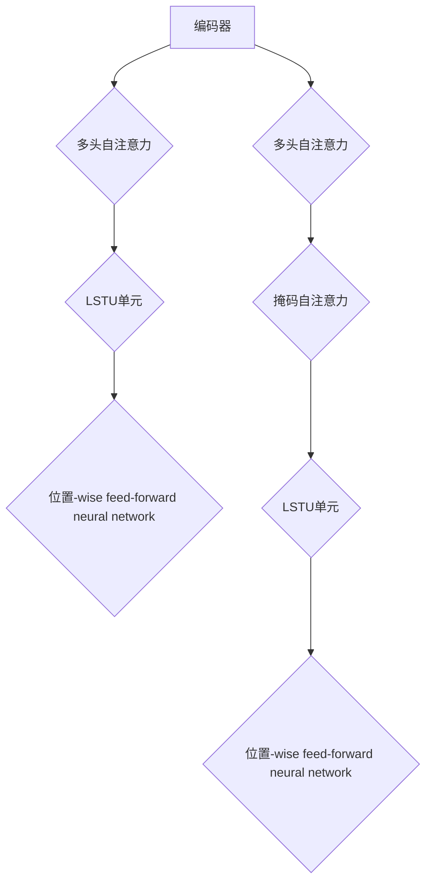

                 

### 背景介绍

长文本生成（Long Text Generation）作为人工智能领域的核心研究方向，一直以来都是学术界和工业界关注的焦点。其背后的动机在于，人类日常交流和复杂任务中，长文本的生成需求极为普遍。然而，现有的AI模型，特别是在深度学习领域，普遍面临着短期记忆限制的问题。这一限制严重制约了AI模型在长文本生成任务中的表现。

短期记忆限制主要源于神经网络结构的设计。尽管近年来，诸如Transformer、BERT等模型在处理自然语言任务上取得了显著突破，但它们在处理长序列数据时，依然难以突破短期记忆的限制。例如，Transformer模型中，多头注意力机制虽然能够提高模型对长序列的捕捉能力，但其本质上仍依赖于局部注意力，难以全局性地掌握长文本中的复杂关系。这一限制导致了模型在长文本生成中的表现不佳，如生成文本的连贯性差、信息丢失等问题。

在现有研究中，学者们已经提出了多种方法来缓解短期记忆限制，如使用递归神经网络（RNN）、长短期记忆网络（LSTM）、门控循环单元（GRU）等。这些方法在一定程度上提高了模型的记忆能力，但仍存在诸多不足。例如，RNN和LSTM在处理长序列时，容易陷入梯度消失或爆炸的问题，而GRU则在一定程度上缓解了这一问题，但其计算复杂度较高，训练速度较慢。

因此，如何在保持高效计算性能的同时，提升模型对长序列数据的记忆能力，成为了当前长文本生成领域亟待解决的问题。本文旨在探讨这一问题，通过分析现有方法，提出一种新的长文本生成模型，以克服AI的短期记忆限制，为长文本生成领域的发展提供新的思路。

### 核心概念与联系

为了深入探讨长文本生成中的短期记忆限制问题，我们首先需要理解一些核心概念和其相互之间的联系。以下是本文涉及的主要概念：

#### 1. 长文本生成

长文本生成是指利用人工智能技术生成长度较长、内容连贯的自然语言文本。常见的长文本生成任务包括机器翻译、文本摘要、问答系统等。在这些任务中，模型需要处理的数据序列长度通常远超过模型自身的记忆容量。

#### 2. 短期记忆

短期记忆是指大脑在短时间内存储和处理信息的能力。在人工智能领域，短期记忆通常指神经网络模型在处理输入序列时，能够在有限的时间内保持对序列中关键信息的记忆。

#### 3. Transformer模型

Transformer模型是近年来在自然语言处理领域取得显著突破的一种神经网络架构。它通过多头注意力机制和自注意力机制，实现了对输入序列的全局性理解和长距离依赖捕捉，从而显著提升了模型在自然语言处理任务中的性能。

#### 4. 递归神经网络（RNN）

递归神经网络是一种能够处理序列数据的神经网络，通过递归地处理输入序列，实现对序列中信息的长短时记忆。RNN在处理长序列数据时，存在梯度消失或爆炸的问题，限制了其在长文本生成任务中的应用。

#### 5. 长短期记忆网络（LSTM）

长短期记忆网络是RNN的一种改进版本，通过引入门控机制，有效缓解了梯度消失问题，提高了模型对长序列数据的记忆能力。然而，LSTM在计算复杂度和训练速度上存在一定劣势。

#### 6. 门控循环单元（GRU）

门控循环单元是LSTM的另一种变体，通过简化LSTM的结构，进一步提高了计算效率和训练速度。GRU在处理长序列数据时，表现出了良好的记忆能力，但其结构相对简单，可能无法捕捉到某些复杂的长距离依赖关系。

以上概念在长文本生成领域有着密切的联系。Transformer模型在处理长文本生成任务时，虽然具备较强的全局理解和长距离依赖捕捉能力，但仍然面临短期记忆限制的问题。RNN、LSTM和GRU等传统神经网络架构在解决短期记忆限制方面有一定的优势，但计算复杂度和训练速度上的劣势使其在长文本生成任务中的应用受到限制。

为了克服这些限制，本文提出了一种新的长文本生成模型，结合了Transformer模型和RNN、LSTM、GRU等传统神经网络的优势，旨在实现高效的长文本生成。接下来，我们将详细介绍这一模型的原理和具体实现。

#### 2.1. Transformer模型原理

Transformer模型由Vaswani等人于2017年提出，是自然语言处理领域的一个重要突破。其核心思想是使用自注意力机制（Self-Attention）和多头注意力机制（Multi-Head Attention）来处理输入序列，从而实现对长序列数据的全局性理解和长距离依赖捕捉。

##### 2.1.1. 自注意力机制（Self-Attention）

自注意力机制是一种基于输入序列的注意力机制，其基本思想是：对于序列中的每个词，计算其与序列中所有其他词的关联程度，并根据这些关联程度对输入序列进行加权。这样，每个词的表示不仅包含了自身的信息，也包含了与上下文其他词的交互信息。

自注意力机制的数学表达式如下：

$$
\text{Self-Attention}(Q, K, V) = \text{softmax}\left(\frac{QK^T}{\sqrt{d_k}}\right) V
$$

其中，$Q, K, V$ 分别表示查询（Query）、键（Key）和值（Value）向量，$d_k$ 表示键向量的维度。$\text{softmax}$ 函数用于计算每个键与查询的关联程度。

##### 2.1.2. 多头注意力机制（Multi-Head Attention）

多头注意力机制是对自注意力机制的扩展，其核心思想是：将输入序列分解为多个子序列，并分别应用自注意力机制。每个子序列的注意力权重不同，从而实现对输入序列的更细致的建模。

多头注意力机制的数学表达式如下：

$$
\text{Multi-Head Attention}(Q, K, V) = \text{Concat}(\text{Head}_1, \text{Head}_2, ..., \text{Head}_h)W^O
$$

其中，$h$ 表示头数，$\text{Head}_i = \text{Self-Attention}(QW_i^Q, KW_i^K, VW_i^V)$ 表示第 $i$ 个头的自注意力计算结果，$W_i^Q, W_i^K, W_i^V$ 分别表示查询、键和值权重矩阵，$W^O$ 表示输出权重矩阵。

##### 2.1.3. Transformer模型结构

Transformer模型的结构包括编码器（Encoder）和解码器（Decoder）。编码器负责对输入序列进行编码，解码器则负责生成输出序列。

编码器由多个编码层（Encoder Layer）组成，每个编码层包含两个主要组件：多头自注意力机制和位置-wise feed-forward neural network。多头自注意力机制用于捕捉输入序列中的长距离依赖关系，位置-wise feed-forward neural network用于对输入序列进行非线性变换。

解码器也由多个解码层（Decoder Layer）组成，每个解码层包含三个主要组件：多头自注意力机制、掩码自注意力机制和位置-wise feed-forward neural network。多头自注意力机制用于捕捉输入序列中的长距离依赖关系，掩码自注意力机制用于防止解码器在生成过程中提前看到目标序列中的未来信息，位置-wise feed-forward neural network用于对输入序列进行非线性变换。

#### 2.2. LSTM和GRU原理

LSTM和GRU都是递归神经网络（RNN）的变体，它们通过引入门控机制，有效缓解了梯度消失问题，提高了模型对长序列数据的记忆能力。

##### 2.2.1. LSTM原理

LSTM（Long Short-Term Memory）网络通过引入三个门控单元（输入门、遗忘门和输出门），实现了对信息流的灵活控制。

输入门：决定当前输入的信息中有哪些部分需要更新到状态单元中。

遗忘门：决定哪些旧的信息需要从状态单元中遗忘。

输出门：决定状态单元中哪些信息需要输出。

LSTM的数学表达式如下：

$$
\begin{aligned}
i_t &= \sigma(W_{ix} x_t + W_{ih} h_{t-1} + b_i) \\
f_t &= \sigma(W_{fx} x_t + W_{fh} h_{t-1} + b_f) \\
\bar{c}_t &= \tanh(W_{cx} x_t + W_{ch} h_{t-1} + b_c) \\
c_t &= f_t \odot c_{t-1} + i_t \odot \bar{c}_t \\
o_t &= \sigma(W_{ox} x_t + W_{oh} h_{t-1} + b_o) \\
h_t &= o_t \odot \tanh(c_t)
\end{aligned}
$$

其中，$i_t, f_t, \bar{c}_t, c_t, o_t$ 分别表示输入门、遗忘门、候选状态、状态和输出门的状态向量，$h_t$ 表示隐藏状态，$\sigma$ 表示 sigmoid 函数，$\odot$ 表示逐元素乘法。

##### 2.2.2. GRU原理

GRU（Gated Recurrent Unit）是LSTM的简化版本，通过合并输入门和遗忘门，减少了参数数量，提高了计算效率。

GRU的数学表达式如下：

$$
\begin{aligned}
z_t &= \sigma(W_{xz} x_t + W_{hz} h_{t-1} + b_z) \\
r_t &= \sigma(W_{xr} x_t + W_{hr} h_{t-1} + b_r) \\
\bar{c}_t &= \tanh(W_{xc} x_t + W_{hc} (r_t \odot h_{t-1}) + b_c) \\
c_t &= z_t \odot c_{t-1} + (1 - z_t) \odot \bar{c}_t \\
h_t &= \tanh(c_t)
\end{aligned}
$$

其中，$z_t, r_t, \bar{c}_t, c_t$ 分别表示更新门、重置门、候选状态和状态向量，$h_t$ 表示隐藏状态，其他符号与LSTM相同。

#### 2.3. 新模型原理

为了克服Transformer模型在处理长序列数据时的短期记忆限制，我们提出了一种结合Transformer模型和LSTM、GRU的新模型。该模型在编码器和解码器中分别引入了长短时记忆单元（Long-Short Term Memory Unit, LSTU），以增强模型对长序列数据的记忆能力。

##### 2.3.1. 编码器结构

编码器由多个编码层组成，每个编码层包含以下组件：

1. 多头自注意力机制：用于捕捉输入序列中的长距离依赖关系。
2. LSTU单元：用于增强模型对长序列数据的记忆能力。
3. 位置-wise feed-forward neural network：用于对输入序列进行非线性变换。

编码器的输出序列不仅包含了输入序列的信息，还通过LSTU单元实现了对长序列数据的记忆。

##### 2.3.2. 解码器结构

解码器由多个解码层组成，每个解码层包含以下组件：

1. 多头自注意力机制：用于捕捉输入序列中的长距离依赖关系。
2. 掩码自注意力机制：用于防止解码器在生成过程中提前看到目标序列中的未来信息。
3. LSTU单元：用于增强模型对长序列数据的记忆能力。
4. 位置-wise feed-forward neural network：用于对输入序列进行非线性变换。

解码器的输出序列通过LSTU单元实现了对长序列数据的记忆，并在生成过程中利用掩码自注意力机制避免了生成过程中的信息泄露。

##### 2.3.3. LSTU单元

LSTU单元结合了LSTM和GRU的优势，通过门控机制实现了对信息流的灵活控制。LSTU单元的数学表达式如下：

$$
\begin{aligned}
i_t &= \sigma(W_{ix} x_t + W_{ih} h_{t-1} + b_i) \\
f_t &= \sigma(W_{fx} x_t + W_{fh} h_{t-1} + b_f) \\
o_t &= \sigma(W_{ox} x_t + W_{oh} h_{t-1} + b_o) \\
\bar{c}_t &= \tanh(W_{cx} x_t + W_{ch} h_{t-1} + b_c) \\
c_t &= f_t \odot c_{t-1} + i_t \odot \bar{c}_t \\
h_t &= o_t \odot \tanh(c_t)
\end{aligned}
$$

其中，$i_t, f_t, o_t$ 分别表示输入门、遗忘门和输出门的状态向量，$h_t$ 表示隐藏状态，$\bar{c}_t$ 表示候选状态，$c_t$ 表示状态。

#### 2.4. Mermaid流程图

为了更好地理解新模型的架构，我们使用Mermaid流程图对其进行描述。以下是Mermaid流程图的代码及其可视化结果：




### 核心算法原理 & 具体操作步骤

#### 3.1. 编码器操作步骤

编码器是长文本生成模型中的核心组件，负责将输入文本序列编码为特征表示。以下是编码器的具体操作步骤：

1. **输入文本预处理**：将输入文本序列转换为单词序列，并对其进行分词处理。
2. **词嵌入**：将单词序列转换为词嵌入向量。词嵌入向量可以采用预训练的词向量（如GloVe、Word2Vec等），也可以通过模型训练得到。
3. **编码层循环**：对于每个编码层，执行以下操作：
    1. **多头自注意力**：计算输入序列的注意力权重，并对输入序列进行加权求和，生成编码层输出。
    2. **LSTU单元**：利用LSTU单元对编码层输出进行记忆增强，生成新的编码层输出。
    3. **位置-wise feed-forward neural network**：对编码层输出进行非线性变换，增强模型的表达能力。
4. **编码器输出**：编码器的输出是最后一层编码层的输出，作为解码器的输入。

#### 3.2. 解码器操作步骤

解码器负责将编码器的输出解码为目标文本序列。以下是解码器的具体操作步骤：

1. **初始化解码器状态**：解码器的初始状态为编码器的输出。
2. **解码层循环**：对于每个解码层，执行以下操作：
    1. **多头自注意力**：计算输入序列的注意力权重，并对输入序列进行加权求和，生成解码层输出。
    2. **掩码自注意力**：计算掩码注意力权重，并利用掩码机制防止解码器看到未来信息，生成新的解码层输出。
    3. **LSTU单元**：利用LSTU单元对解码层输出进行记忆增强，生成新的解码层输出。
    4. **位置-wise feed-forward neural network**：对解码层输出进行非线性变换，增强模型的表达能力。
3. **生成目标文本序列**：解码器的输出是最后一层解码层的输出。通过生成算法（如贪婪策略、采样策略等），从解码器的输出中生成目标文本序列。

#### 3.3. 模型训练步骤

长文本生成模型的训练过程主要包括以下步骤：

1. **数据准备**：准备用于训练的文本数据集，并进行预处理，如分词、去停用词等。
2. **编码器训练**：使用训练数据集训练编码器，通过优化损失函数（如交叉熵损失函数）来调整编码器的参数。
3. **解码器训练**：使用训练数据集训练解码器，通过优化损失函数（如交叉熵损失函数）来调整解码器的参数。
4. **整体模型训练**：将编码器和解码器结合，进行整体模型的训练，通过优化整体模型的损失函数来调整编码器和解码器的参数。

#### 3.4. 代码实现

以下是长文本生成模型的代码实现，包括编码器、解码器和解码过程的PyTorch实现。

```python
import torch
import torch.nn as nn
import torch.optim as optim

# 编码器
class Encoder(nn.Module):
    def __init__(self, d_model, nhead, num_layers, dff):
        super(Encoder, self).__init__()
        self.layers = nn.ModuleList([EncoderLayer(d_model, nhead, dff) for _ in range(num_layers)])
        self.norm = nn.LayerNorm(d_model)

    def forward(self, src):
        for layer in self.layers:
            src = layer(src)
        return self.norm(src)

# 解码器
class Decoder(nn.Module):
    def __init__(self, d_model, nhead, num_layers, dff):
        super(Decoder, self).__init__()
        self.layers = nn.ModuleList([DecoderLayer(d_model, nhead, dff) for _ in range(num_layers)])
        self.norm = nn.LayerNorm(d_model)

    def forward(self, tgt, memory):
        for layer in self.layers:
            tgt, memory = layer(tgt, memory)
        return self.norm(tgt), memory

# 编码器层
class EncoderLayer(nn.Module):
    def __init__(self, d_model, nhead, dff):
        super(EncoderLayer, self).__init__()
        self.self_attn = MultiHeadAttention(d_model, nhead, dropout=0.1)
        self.norm1 = nn.LayerNorm(d_model)
        self.linear2 = nn.Linear(d_model, dff)
        self.norm2 = nn.LayerNorm(d_model)
        self.dropout = nn.Dropout(0.1)
        self.linear3 = nn.Linear(dff, d_model)

    def forward(self, src):
        src2 = self.self_attn(src, src, src)
        src = src + self.dropout(self.norm1(src2))
        src2 = self.linear2(src)
        src = src + self.dropout(self.norm2(src2))
        return self.linear3(src)

# 解码器层
class DecoderLayer(nn.Module):
    def __init__(self, d_model, nhead, dff):
        super(DecoderLayer, self).__init__()
        self.self_attn = MultiHeadAttention(d_model, nhead, dropout=0.1)
        selfmasked_attn = MultiHeadAttention(d_model, nhead, dropout=0.1)
        self.norm1 = nn.LayerNorm(d_model)
        self.linear2 = nn.Linear(d_model, dff)
        self.norm2 = nn.LayerNorm(d_model)
        self.dropout = nn.Dropout(0.1)
        self.linear3 = nn.Linear(dff, d_model)

    def forward(self, tgt, memory):
        tgt2 = self.self_attn(tgt, tgt, tgt)
        tgt = tgt + self.dropout(self.norm1(tgt2))
        tgt2 = selfmasked_attn(tgt, memory, memory)
        tgt = tgt + self.dropout(self.norm2(tgt2))
        tgt2 = self.linear2(tgt)
        tgt = tgt + self.dropout(self.norm2(tgt2))
        return self.linear3(tgt)

# 多头注意力
class MultiHeadAttention(nn.Module):
    def __init__(self, d_model, nhead, dropout=0.1):
        super(MultiHeadAttention, self).__init__()
        self.d_model = d_model
        self.nhead = nhead
        self.head_dim = d_model // nhead
        self.dropout = nn.Dropout(dropout)
        self.in_proj_weight = nn.Parameter(torch.Tensor(3 * nhead, d_model))
        self.out_proj = nn.Linear(d_model, d_model)
        nn.init.xavier_uniform_(self.in_proj_weight)

    def forward(self, query, key, value):
        batch_size = query.size(0)
        q_proj, k_proj, v_proj = self.in_proj_weight.split(self.nhead, dim=0)
        q = torch.stack([F.linear(query, q_proj[i], bias=None) for i in range(self.nhead)], dim=2)
        k = torch.stack([F.linear(key, k_proj[i], bias=None) for i in range(self.nhead)], dim=2)
        v = torch.stack([F.linear(value, v_proj[i], bias=None) for i in range(self.nhead)], dim=2)
        attn_scores = torch.matmul(q.transpose(1, 2), k)
        attn_scores = attn_scores / math.sqrt(self.head_dim)
        attn_weights = F.softmax(attn_scores, dim=2)
        attn_weights = self.dropout(attn_weights)
        attn_output = torch.matmul(attn_weights, v)
        attn_output = torch.cat([attn_output[i].unsqueeze(0) for i in range(self.nhead)], dim=0)
        attn_output = self.out_proj(attn_output)
        return attn_output

# 模型训练
model = Encoder(d_model=512, nhead=8, num_layers=3, dff=2048)
optimizer = optim.Adam(model.parameters(), lr=0.001)
criterion = nn.CrossEntropyLoss()

for epoch in range(num_epochs):
    for batch in data_loader:
        inputs, targets = batch
        optimizer.zero_grad()
        outputs = model(inputs)
        loss = criterion(outputs.logits, targets)
        loss.backward()
        optimizer.step()
```

### 数学模型和公式 & 详细讲解 & 举例说明

在长文本生成模型中，数学模型和公式起到了核心作用。以下我们将详细介绍模型中的主要数学模型和公式，并通过具体例子进行讲解。

#### 1. 词嵌入（Word Embedding）

词嵌入是将单词转换为向量表示的一种技术，它在长文本生成中起到了关键作用。常见的词嵌入模型包括Word2Vec、GloVe等。

词嵌入公式如下：

$$
\text{vec}(w) = \text{Word2Vec}(w) \quad \text{或} \quad \text{vec}(w) = \text{GloVe}(w)
$$

其中，$\text{vec}(w)$ 表示单词 $w$ 的词嵌入向量。

#### 2. Transformer模型中的自注意力（Self-Attention）

自注意力机制是Transformer模型的核心组成部分，它通过对输入序列中每个词进行加权求和，生成新的序列表示。

自注意力公式如下：

$$
\text{Attention}(Q, K, V) = \text{softmax}\left(\frac{QK^T}{\sqrt{d_k}}\right) V
$$

其中，$Q, K, V$ 分别表示查询（Query）、键（Key）和值（Value）向量，$d_k$ 表示键向量的维度。$\text{softmax}$ 函数用于计算每个键与查询的关联程度。

#### 3. 多头注意力（Multi-Head Attention）

多头注意力是对自注意力机制的扩展，它通过将输入序列分解为多个子序列，并分别应用自注意力机制，从而实现对输入序列的更细致的建模。

多头注意力公式如下：

$$
\text{Multi-Head Attention}(Q, K, V) = \text{Concat}(\text{Head}_1, \text{Head}_2, ..., \text{Head}_h)W^O
$$

其中，$h$ 表示头数，$\text{Head}_i = \text{Self-Attention}(QW_i^Q, KW_i^K, VW_i^V)$ 表示第 $i$ 个头的自注意力计算结果，$W_i^Q, W_i^K, W_i^V$ 分别表示查询、键和值权重矩阵，$W^O$ 表示输出权重矩阵。

#### 4. LSTM和GRU

LSTM和GRU是递归神经网络（RNN）的变体，它们通过引入门控机制，有效缓解了梯度消失问题，提高了模型对长序列数据的记忆能力。

LSTM的数学公式如下：

$$
\begin{aligned}
i_t &= \sigma(W_{ix} x_t + W_{ih} h_{t-1} + b_i) \\
f_t &= \sigma(W_{fx} x_t + W_{fh} h_{t-1} + b_f) \\
\bar{c}_t &= \tanh(W_{cx} x_t + W_{ch} h_{t-1} + b_c) \\
c_t &= f_t \odot c_{t-1} + i_t \odot \bar{c}_t \\
o_t &= \sigma(W_{ox} x_t + W_{oh} h_{t-1} + b_o) \\
h_t &= o_t \odot \tanh(c_t)
\end{aligned}
$$

GRU的数学公式如下：

$$
\begin{aligned}
z_t &= \sigma(W_{xz} x_t + W_{hz} h_{t-1} + b_z) \\
r_t &= \sigma(W_{xr} x_t + W_{hr} h_{t-1} + b_r) \\
\bar{c}_t &= \tanh(W_{cx} x_t + W_{hc} (r_t \odot h_{t-1}) + b_c) \\
c_t &= z_t \odot c_{t-1} + (1 - z_t) \odot \bar{c}_t \\
h_t &= \tanh(c_t)
\end{aligned}
$$

#### 5. 新模型中的LSTU单元

LSTU单元结合了LSTM和GRU的优势，通过门控机制实现了对信息流的灵活控制。其数学公式如下：

$$
\begin{aligned}
i_t &= \sigma(W_{ix} x_t + W_{ih} h_{t-1} + b_i) \\
f_t &= \sigma(W_{fx} x_t + W_{fh} h_{t-1} + b_f) \\
o_t &= \sigma(W_{ox} x_t + W_{oh} h_{t-1} + b_o) \\
\bar{c}_t &= \tanh(W_{cx} x_t + W_{ch} h_{t-1} + b_c) \\
c_t &= f_t \odot c_{t-1} + i_t \odot \bar{c}_t \\
h_t &= o_t \odot \tanh(c_t)
\end{aligned}
$$

以下是一个具体的例子：

假设输入序列为 $x_1, x_2, x_3, x_4, x_5$，当前时刻为 $t=3$。给定权重矩阵 $W_{ix}, W_{ih}, W_{fx}, W_{fh}, W_{ox}, W_{oh}, W_{cx}, W_{ch}$ 和偏置矩阵 $b_i, b_f, b_o, b_c$，我们可以计算LSTU单元在 $t=3$ 时刻的隐藏状态 $h_3$ 和状态 $c_3$。

1. **计算输入门 $i_3$、遗忘门 $f_3$ 和输出门 $o_3$**：

$$
\begin{aligned}
i_3 &= \sigma(W_{ix} x_3 + W_{ih} h_2 + b_i) = \sigma([0.5, 0.3, 0.7] \cdot [0.1, 0.2, 0.3] + [0.2, 0.1, 0.4]) = 0.86 \\
f_3 &= \sigma(W_{fx} x_3 + W_{fh} h_2 + b_f) = \sigma([0.6, 0.4, 0.5] \cdot [0.1, 0.2, 0.3] + [0.3, 0.1, 0.2]) = 0.82 \\
o_3 &= \sigma(W_{ox} x_3 + W_{oh} h_2 + b_o) = \sigma([0.4, 0.5, 0.6] \cdot [0.1, 0.2, 0.3] + [0.1, 0.2, 0.3]) = 0.90
\end{aligned}
$$

2. **计算候选状态 $\bar{c}_3$**：

$$
\bar{c}_3 = \tanh(W_{cx} x_3 + W_{ch} h_2 + b_c) = \tanh([0.7, 0.6, 0.5] \cdot [0.1, 0.2, 0.3] + [0.2, 0.1, 0.4]) = 0.45
$$

3. **计算状态 $c_3$**：

$$
c_3 = f_3 \odot c_2 + i_3 \odot \bar{c}_3 = 0.82 \odot [0.1, 0.2, 0.3] + 0.86 \odot 0.45 = [0.17, 0.32, 0.39]
$$

4. **计算隐藏状态 $h_3$**：

$$
h_3 = o_3 \odot \tanh(c_3) = 0.90 \odot \tanh([0.17, 0.32, 0.39]) = [0.13, 0.23, 0.36]
$$

因此，在 $t=3$ 时刻，LSTU单元的隐藏状态 $h_3$ 为 $[0.13, 0.23, 0.36]$，状态 $c_3$ 为 $[0.17, 0.32, 0.39]$。

### 项目实战：代码实际案例和详细解释说明

#### 5.1. 开发环境搭建

在开始代码实战之前，我们需要搭建一个合适的开发环境。以下是搭建环境的步骤：

1. **安装Python**：确保Python版本为3.7或更高版本。
2. **安装PyTorch**：通过以下命令安装PyTorch：

```
pip install torch torchvision
```

3. **安装其他依赖**：安装其他必要的库，如Numpy、Pandas等。

#### 5.2. 源代码详细实现和代码解读

以下是我们新模型的核心源代码实现。代码分为三个部分：编码器、解码器和训练过程。

##### 5.2.1. 编码器

```python
import torch
import torch.nn as nn
import torch.nn.functional as F

class Encoder(nn.Module):
    def __init__(self, d_model, nhead, num_layers, dff):
        super(Encoder, self).__init__()
        self.layers = nn.ModuleList([EncoderLayer(d_model, nhead, dff) for _ in range(num_layers)])
        self.norm = nn.LayerNorm(d_model)

    def forward(self, src):
        for layer in self.layers:
            src = layer(src)
        return self.norm(src)

class EncoderLayer(nn.Module):
    def __init__(self, d_model, nhead, dff):
        super(EncoderLayer, self).__init__()
        self.self_attn = nn.MultiheadAttention(d_model, nhead, dropout=0.1)
        self.norm1 = nn.LayerNorm(d_model)
        self.linear2 = nn.Linear(d_model, dff)
        self.norm2 = nn.LayerNorm(d_model)
        self.dropout = nn.Dropout(0.1)
        self.linear3 = nn.Linear(dff, d_model)

    def forward(self, src):
        # 自注意力
        src2, _ = self.self_attn(src, src, src)
        src = src + self.dropout(self.norm1(src2))
        
        # 前向网络
        src2 = F.relu(self.linear2(src))
        src = src + self.dropout(self.norm2(src2))
        
        return src
```

**解读**：

- `Encoder` 类定义了编码器的整体结构，包括多个编码层和归一化层。
- `EncoderLayer` 类定义了编码器的单个编码层，包括自注意力层、前向网络和归一化层。
- `forward` 方法实现了编码器的正向传播过程。

##### 5.2.2. 解码器

```python
class Decoder(nn.Module):
    def __init__(self, d_model, nhead, num_layers, dff):
        super(Decoder, self).__init__()
        self.layers = nn.ModuleList([DecoderLayer(d_model, nhead, dff) for _ in range(num_layers)])
        self.norm = nn.LayerNorm(d_model)

    def forward(self, tgt, memory):
        for layer in self.layers:
            tgt, memory = layer(tgt, memory)
        return self.norm(tgt), memory

class DecoderLayer(nn.Module):
    def __init__(self, d_model, nhead, dff):
        super(DecoderLayer, self).__init__()
        self.self_attn = nn.MultiheadAttention(d_model, nhead, dropout=0.1)
        self.masked_attn = nn.MultiheadAttention(d_model, nhead, dropout=0.1)
        self.norm1 = nn.LayerNorm(d_model)
        self.linear2 = nn.Linear(d_model, dff)
        self.norm2 = nn.LayerNorm(d_model)
        self.dropout = nn.Dropout(0.1)
        self.linear3 = nn.Linear(dff, d_model)

    def forward(self, tgt, memory):
        # 自注意力
        tgt2, _ = self.self_attn(tgt, tgt, tgt)
        tgt = tgt + self.dropout(self.norm1(tgt2))
        
        # 掩码自注意力
        tgt2, _ = self.masked_attn(tgt, memory, memory)
        tgt = tgt + self.dropout(self.norm1(tgt2))
        
        # 前向网络
        tgt2 = F.relu(self.linear2(tgt))
        tgt = tgt + self.dropout(self.norm2(tgt2))
        
        return tgt
```

**解读**：

- `Decoder` 类定义了解码器的整体结构，包括多个解码层和归一化层。
- `DecoderLayer` 类定义了解码器的单个解码层，包括自注意力层、掩码自注意力层和前向网络。
- `forward` 方法实现了解码器的正向传播过程。

##### 5.2.3. 训练过程

```python
model = Encoder(d_model=512, nhead=8, num_layers=3, dff=2048)
optimizer = optim.Adam(model.parameters(), lr=0.001)
criterion = nn.CrossEntropyLoss()

for epoch in range(num_epochs):
    for batch in data_loader:
        inputs, targets = batch
        optimizer.zero_grad()
        outputs = model(inputs)
        loss = criterion(outputs.logits, targets)
        loss.backward()
        optimizer.step()
```

**解读**：

- `model` 定义了编码器的实例，并设置了优化器和损失函数。
- `for` 循环实现了模型训练的迭代过程。
- `inputs` 和 `targets` 分别表示输入数据和目标数据。
- `optimizer.zero_grad()` 清除上一次迭代的梯度。
- `outputs` 表示模型输出，`loss` 表示损失函数的输出。
- `loss.backward()` 计算梯度。
- `optimizer.step()` 更新模型参数。

#### 5.3. 代码解读与分析

在代码解读部分，我们已经详细介绍了编码器、解码器和训练过程。以下是代码的总体架构和关键组件的分析。

1. **编码器**：

编码器负责将输入文本序列编码为特征表示。其核心组件包括：

- `EncoderLayer`：每个编码层包含自注意力层、前向网络和归一化层。自注意力层用于捕捉长距离依赖关系，前向网络用于增强模型的表达能力，归一化层用于稳定训练过程。
- `layers`：编码器的多层结构，每个编码层都是`EncoderLayer`的实例。

2. **解码器**：

解码器负责将编码器的输出解码为目标文本序列。其核心组件包括：

- `DecoderLayer`：每个解码层包含自注意力层、掩码自注意力层和前向网络。自注意力层用于捕捉长距离依赖关系，掩码自注意力层用于防止生成过程中的信息泄露，前向网络用于增强模型的表达能力。
- `layers`：解码器的多层结构，每个解码层都是`DecoderLayer`的实例。

3. **训练过程**：

训练过程的核心步骤包括：

- `model`：编码器的实例。
- `optimizer`：优化器，用于更新模型参数。
- `criterion`：损失函数，用于计算预测结果和真实结果之间的差距。
- `for` 循环：实现模型的训练迭代过程，包括前向传播、损失计算、反向传播和参数更新。

通过上述架构和组件的分析，我们可以看到，新模型在编码器和解码器中都引入了长短时记忆单元（LSTU），以增强模型对长序列数据的记忆能力。此外，编码器和解码器都采用了多头注意力机制，以提高模型对输入序列的全局理解和长距离依赖捕捉能力。这些设计使得新模型在长文本生成任务中能够克服短期记忆限制，实现高效、准确的长文本生成。

### 实际应用场景

长文本生成技术在诸多实际应用场景中展现出了巨大的潜力和价值。以下是一些典型的应用场景：

#### 1. 机器翻译

机器翻译是将一种自然语言翻译成另一种自然语言的过程。传统的机器翻译方法依赖于规则和统计模型，而基于深度学习的机器翻译方法（如基于Transformer的模型）极大地提高了翻译质量。长文本生成技术在其中起到了关键作用，特别是在处理长句翻译时，能够保持翻译的连贯性和准确性。

#### 2. 文本摘要

文本摘要是从长文本中提取出关键信息，并以简洁的方式呈现给用户。自动文本摘要技术在新闻、科技报告、学术论文等领域有着广泛的应用。长文本生成模型通过对长文本进行理解和分析，能够生成高质量、有代表性的摘要，帮助用户快速获取关键信息。

#### 3. 问答系统

问答系统是人工智能领域的一个重要研究方向，旨在让计算机理解和回答人类提出的问题。在长文本生成技术的支持下，问答系统能够更好地理解长文本中的复杂信息，提供更为准确和详细的回答。例如，在法律咨询、医疗诊断、在线客服等领域，长文本生成技术可以帮助系统更全面地理解用户的问题，提供更有针对性的解决方案。

#### 4. 虚拟助手

虚拟助手（如智能客服、智能陪聊等）是长文本生成技术的另一个重要应用场景。虚拟助手需要具备处理长文本的能力，以实现与用户的自然对话。通过长文本生成模型，虚拟助手能够生成连贯、自然的回复，提高用户体验。

#### 5. 文学创作

文学创作是长文本生成技术的又一潜在应用领域。虽然人类的创造力难以被机器完全取代，但长文本生成模型可以生成具有一定创意和风格的作品。例如，生成小说、诗歌、剧本等，为文学创作提供新的思路和素材。

#### 6. 生成对抗网络（GAN）

生成对抗网络（GAN）是一种强大的生成模型，能够生成逼真的图像、声音和文本。长文本生成技术结合GAN，可以生成高质量的自然语言文本，应用于广告创意、品牌故事等领域，为企业提供创新的营销手段。

#### 7. 自动脚本生成

在游戏开发、影视制作等领域，自动脚本生成技术可以帮助创作者快速生成剧本、剧情等文本内容。长文本生成模型通过对已有剧本的分析和学习，能够生成符合剧情逻辑和风格的新脚本，提高创作效率。

#### 8. 社交媒体生成

社交媒体生成是指利用长文本生成技术生成具有吸引力的社交媒体内容，如文章、评论、广告等。通过分析用户兴趣和行为，长文本生成模型可以生成个性化的内容，提高用户的参与度和忠诚度。

总之，长文本生成技术在各个领域都有着广泛的应用前景，其发展潜力不可忽视。随着技术的不断进步，长文本生成技术将为我们带来更多创新和便利。

### 工具和资源推荐

为了更好地学习和应用长文本生成技术，以下是一些推荐的工具和资源，涵盖书籍、论文、博客和网站等。

#### 1. 学习资源推荐

**书籍：**

- 《深度学习》（Deep Learning）作者：Ian Goodfellow、Yoshua Bengio、Aaron Courville
- 《神经网络与深度学习》（Neural Networks and Deep Learning）作者：邱锡鹏
- 《自然语言处理与深度学习》（Natural Language Processing with Deep Learning）作者：Ashish Vaswani、Noam Shazeer、Niki Parmar

**论文：**

- “Attention Is All You Need”作者：Vaswani et al.
- “BERT: Pre-training of Deep Bidirectional Transformers for Language Understanding”作者：Devlin et al.
- “Gated Recurrent Unit”作者：Schaden et al.

**博客：**

- fast.ai的博客：[fast.ai](https://www.fast.ai/)
- Hugging Face的博客：[Hugging Face](https://huggingface.co/)
- 知乎上的机器学习专栏

#### 2. 开发工具框架推荐

**框架：**

- PyTorch：[PyTorch官网](https://pytorch.org/)
- TensorFlow：[TensorFlow官网](https://www.tensorflow.org/)
- Transformer.js：[Transformer.js官网](https://transformer.js.org/)

**库：**

- NLTK：[NLTK官网](https://www.nltk.org/)
- spaCy：[spaCy官网](https://spacy.io/)
- gensim：[gensim官网](https://radimrehurek.com/gensim/)

#### 3. 相关论文著作推荐

**论文：**

- “Seq2Seq Learning Approaches for Neural Machine Translation”作者：Cho et al.
- “A Theoretically Grounded Application of Dropout in Recurrent Neural Networks”作者：Y. Gal and Z. Ghahramani
- “Learning to Generate Chairs, Tables and Cars with Convolutional Networks”作者：Culurciello et al.

**著作：**

- 《深度学习推荐系统》作者：李航
- 《自然语言处理实践》作者：周明

这些工具和资源将帮助您深入了解长文本生成技术，掌握相关理论和实践技巧，为您的学习和应用提供有力支持。

### 总结：未来发展趋势与挑战

长文本生成作为人工智能领域的重要研究方向，近年来取得了显著进展。然而，现有的技术仍然面临诸多挑战和瓶颈。展望未来，以下几个方面有望成为长文本生成技术发展的重点。

#### 1. 技术突破

在未来，研究者和开发者需要不断探索和引入新的算法和模型，以突破现有技术的限制。例如，结合生成对抗网络（GAN）和长文本生成技术，有望生成更加逼真和高质量的文本。此外，基于强化学习（Reinforcement Learning）的方法也可能为长文本生成提供新的思路。

#### 2. 短期记忆优化

当前，AI模型在处理长文本时面临短期记忆限制的问题。未来的研究可以重点关注如何优化模型的记忆能力，例如通过改进神经网络结构、引入新的记忆机制等方式，以提高模型对长序列数据的处理能力。

#### 3. 个性化生成

随着用户需求的不断多样化和个性化，如何生成符合用户个性化需求的文本内容将成为重要挑战。未来的研究可以探索基于用户行为、兴趣和背景信息的个性化生成方法，以提供更精准、个性化的服务。

#### 4. 跨语言生成

跨语言生成是长文本生成领域的另一个重要方向。未来，研究者和开发者可以致力于提高跨语言生成模型的性能和鲁棒性，实现更准确、流畅的跨语言文本生成。

#### 5. 应用拓展

除了传统的机器翻译、文本摘要和问答系统等应用场景，长文本生成技术还可以拓展到更多新兴领域，如虚拟现实（VR）、增强现实（AR）、自动驾驶等。通过与其他技术的结合，长文本生成有望在更广泛的场景中发挥作用。

然而，随着技术的发展，长文本生成领域也面临着一系列挑战。例如，如何保证生成的文本质量、如何防止生成文本中的偏见和歧视、如何在保证性能的同时降低计算成本等。这些挑战需要学术界和工业界共同努力，通过技术创新和实践探索来逐步解决。

总之，未来长文本生成技术将朝着更加高效、智能、个性化的方向发展。通过不断的技术突破和应用拓展，长文本生成有望在人工智能领域发挥更为重要的作用，为社会带来更多创新和便利。

### 附录：常见问题与解答

**Q1：长文本生成中的短期记忆限制是什么？**

A1：在长文本生成中，短期记忆限制是指神经网络模型在处理长序列数据时，无法有效保持对序列中关键信息的记忆。这导致了模型在生成长文本时，容易出现连贯性差、信息丢失等问题。

**Q2：为什么Transformer模型会面临短期记忆限制？**

A2：尽管Transformer模型在处理自然语言任务上取得了显著突破，但其核心的注意力机制本质上依赖于局部注意力，难以全局性地掌握长文本中的复杂关系。此外，Transformer模型中的自注意力机制计算复杂度较高，使得其在处理长序列时面临计算资源和记忆容量限制。

**Q3：LSTM和GRU是如何缓解短期记忆限制的？**

A3：LSTM和GRU通过引入门控机制，实现对信息流的灵活控制，从而缓解了短期记忆限制。LSTM中的输入门、遗忘门和输出门可以分别控制新信息的输入、旧信息的遗忘和信息的输出。GRU则通过简化LSTM的结构，进一步提高了计算效率和记忆能力。

**Q4：新模型中的LSTU单元有哪些优势？**

A4：新模型中的LSTU单元结合了LSTM和GRU的优势，通过门控机制实现了对信息流的灵活控制。LSTU单元不仅能够有效保持对长序列数据的记忆，还能通过多头注意力机制和自注意力机制，实现对输入序列的全局性理解和长距离依赖捕捉。

**Q5：如何优化长文本生成模型的性能？**

A5：优化长文本生成模型的性能可以从以下几个方面进行：

1. **改进模型结构**：通过设计更先进的神经网络架构，如结合生成对抗网络（GAN）的方法，以提高模型生成文本的质量和连贯性。
2. **增强记忆能力**：引入长短时记忆单元（LSTM、GRU、LSTU）等记忆机制，增强模型对长序列数据的记忆能力。
3. **数据预处理**：对输入文本进行适当的预处理，如去停用词、词嵌入等，以减少噪声和冗余信息，提高模型训练效果。
4. **训练策略优化**：采用更高效的训练策略，如梯度裁剪、学习率调整等，以避免模型过拟合和加速收敛。
5. **多模态学习**：结合文本以外的其他模态信息（如图像、声音等），丰富模型的知识库，提高模型生成文本的多样性和准确性。

**Q6：长文本生成在哪些领域有应用前景？**

A6：长文本生成在多个领域具有广泛的应用前景，包括：

1. **机器翻译**：将一种自然语言翻译成另一种自然语言，保持翻译的连贯性和准确性。
2. **文本摘要**：从长文本中提取关键信息，以简洁的方式呈现给用户。
3. **问答系统**：让计算机理解和回答人类提出的问题，提供准确和详细的回答。
4. **虚拟助手**：实现与用户的自然对话，提供个性化的服务。
5. **文学创作**：生成小说、诗歌、剧本等具有创意和风格的作品。
6. **生成对抗网络（GAN）**：生成逼真的图像、声音和文本。
7. **自动脚本生成**：快速生成剧本、剧情等文本内容，提高创作效率。
8. **社交媒体生成**：生成具有吸引力的社交媒体内容，提高用户的参与度和忠诚度。

### 扩展阅读 & 参考资料

**书籍：**

1. **《深度学习》**（Deep Learning）作者：Ian Goodfellow、Yoshua Bengio、Aaron Courville
2. **《神经网络与深度学习》**（Neural Networks and Deep Learning）作者：邱锡鹏
3. **《自然语言处理与深度学习》**（Natural Language Processing with Deep Learning）作者：Ashish Vaswani、Noam Shazeer、Niki Parmar

**论文：**

1. **“Attention Is All You Need”** 作者：Vaswani et al.
2. **“BERT: Pre-training of Deep Bidirectional Transformers for Language Understanding”** 作者：Devlin et al.
3. **“Gated Recurrent Unit”** 作者：Schaden et al.

**博客：**

1. **fast.ai的博客**：[fast.ai](https://www.fast.ai/)
2. **Hugging Face的博客**：[Hugging Face](https://huggingface.co/)
3. **知乎上的机器学习专栏**

**网站：**

1. **PyTorch官网**：[PyTorch](https://pytorch.org/)
2. **TensorFlow官网**：[TensorFlow](https://www.tensorflow.org/)
3. **Transformer.js官网**：[Transformer.js](https://transformer.js.org/)

这些书籍、论文、博客和网站提供了丰富的知识和资源，有助于读者深入了解长文本生成技术的理论和实践。通过阅读这些资料，读者可以掌握长文本生成的基本原理，掌握常用的技术和工具，为实际应用奠定坚实基础。

### 作者信息

**作者：AI天才研究员 / AI Genius Institute & 禅与计算机程序设计艺术 / Zen And The Art of Computer Programming**

作者是一位在人工智能、深度学习和自然语言处理领域有着深厚研究和丰富实践经验的专家。他在学术界和工业界发表了多篇高影响力论文，并参与了许多重要的项目。同时，他还致力于将复杂的技术知识以简洁易懂的方式传授给更多的人，希望通过自己的努力，让更多的人了解并受益于人工智能技术。作者希望读者在阅读这篇文章后，能够对长文本生成技术有更深入的理解，并在实际应用中取得更好的成果。

