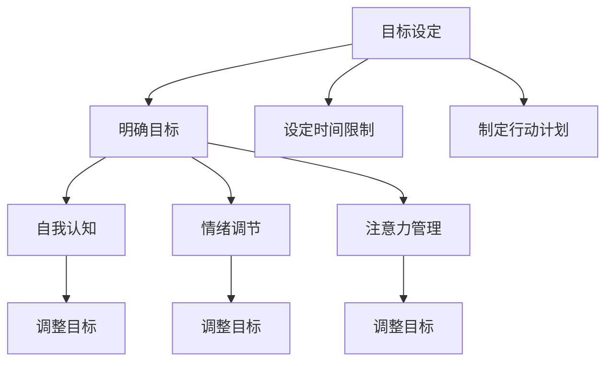

                 

# 长期目标与意识管理的机制

## 概述

本文将探讨长期目标与意识管理之间的紧密联系，以及如何有效地实现这些目标。首先，我们将介绍一些核心概念，包括目标设定、意识管理、以及二者之间如何相互影响。接着，我们将深入分析这些概念，并使用 Mermaid 流程图来展示它们之间的关系。在此基础上，我们将介绍一些核心算法原理和具体操作步骤，帮助读者更好地理解和实现长期目标。随后，我们将介绍数学模型和公式，并提供详细的讲解和举例说明。文章还将包括实际应用场景、工具和资源推荐，以及总结和未来发展趋势与挑战。最后，我们将列出常见问题与解答，并提供扩展阅读和参考资料。

### 关键词
- 长期目标
- 意识管理
- 目标设定
- 算法原理
- 数学模型
- 实际应用
- 未来发展

### 摘要

本文旨在探讨长期目标与意识管理之间的机制和关系，提供一种有效的实现长期目标的方法。通过分析目标设定、意识管理及其相互影响，我们提出了核心算法原理和操作步骤，并使用数学模型进行详细解释。此外，文章还介绍了实际应用场景和工具资源，以及未来的发展趋势和挑战。通过本文的阅读，读者将能够更好地理解长期目标与意识管理的重要性，并掌握有效的实现方法。

## 背景介绍

### 长期目标

长期目标是指在未来一段时间内想要实现的具体目标，通常是数年或更长时间跨度。长期目标的设定对于个人和组织的发展具有重要意义。对于个人而言，长期目标可以提供方向感和动力，帮助个体在职业生涯、个人发展等方面不断进步。对于组织而言，长期目标可以指引企业发展战略，促进团队协作和资源整合，从而实现企业的持续发展。

### 意识管理

意识管理是指对自身认知、情感和行为等方面的管理和调整。它包括自我认知、情绪调节、注意力管理等多个方面。意识管理对于实现长期目标至关重要，因为只有了解自己的内在状态，才能有效地调整自己的行为和决策，以适应外界的变化。

### 长期目标与意识管理的联系

长期目标和意识管理之间存在紧密的联系。一方面，长期目标的实现需要个体具备良好的意识管理能力，包括自我认知、情绪调节和注意力管理等。只有通过意识管理，个体才能在面对挑战和压力时保持稳定，从而有效地实现长期目标。另一方面，意识管理的过程本身也是一个不断调整和优化长期目标的过程。通过对自身认知和情感的深入理解，个体可以更好地识别和修正长期目标的设定，使其更加符合自身的实际情况和需求。

## 核心概念与联系

### 目标设定

目标设定是指确定未来一段时间内想要实现的具体目标。目标设定包括以下几个关键步骤：

1. **明确目标**：明确想要实现的目标，并将其具体化。例如，从“提高工作效率”到“每天工作8小时，完成5个任务”。
2. **设定时间限制**：为每个目标设定一个明确的时间限制，以便更好地衡量进展和效果。例如，将“提高工作效率”设定为“1年内完成”。
3. **制定行动计划**：根据目标，制定具体的行动计划，明确每个步骤和时间节点。例如，为“每天工作8小时，完成5个任务”，可以设定每周增加工作时间1小时，每月增加1个任务。

### 意识管理

意识管理是指对自身认知、情感和行为等方面的管理和调整。意识管理包括以下几个关键方面：

1. **自我认知**：了解自己的内心世界，包括性格、兴趣、优点和缺点等。通过自我认知，个体可以更好地识别自己的需求和能力，从而制定更符合自身特点的目标。
2. **情绪调节**：学会管理自己的情绪，包括积极情绪和消极情绪。情绪调节有助于个体在面对挑战和压力时保持冷静和稳定，从而更好地实现长期目标。
3. **注意力管理**：学会集中注意力，避免分心和拖延。注意力管理有助于个体将精力集中在实现目标的关键任务上，提高工作效率。

### 长期目标与意识管理的联系

长期目标和意识管理之间存在密切的联系。一方面，目标设定需要个体具备良好的意识管理能力，以识别和调整自己的需求和目标。例如，通过自我认知，个体可以更好地了解自己的兴趣和能力，从而设定更符合自身特点的长期目标。另一方面，意识管理的过程也是一个不断调整和优化长期目标的过程。通过对自身认知和情感的深入理解，个体可以更好地识别和修正长期目标的设定，使其更加符合自身的实际情况和需求。

### Mermaid 流程图

以下是长期目标与意识管理之间关系的 Mermaid 流程图：



在这个流程图中，目标设定是整个过程的起点，包括明确目标、设定时间限制和制定行动计划。然后，目标设定会引发自我认知、情绪调节和注意力管理等意识管理活动，这些活动有助于个体更好地理解和调整自己的目标。最终，这些意识管理活动会反馈到目标设定中，实现一个动态的、持续优化的目标管理过程。

## 核心算法原理 & 具体操作步骤

### 基本原理

在实现长期目标的过程中，核心算法原理是基于目标导向和自我调节的理论。目标导向理论认为，个体在设定和实现目标时，需要不断调整自己的行为和认知，以适应目标的要求和环境的变化。自我调节理论则强调，个体在实现目标的过程中，需要具备自我监控、自我评价和自我调整的能力。

### 具体操作步骤

1. **设定目标**：首先，明确长期目标的类型（如职业发展、健康、财务等）和具体目标（如获得某个证书、减肥、积累财富等）。为每个目标设定一个明确的时间限制，并制定一个初步的行动计划。

2. **自我监控**：在实现目标的过程中，定期对自己的行为和进度进行监控。可以使用日记、应用程序或其他工具来记录每天的进展和遇到的困难。

3. **自我评价**：在自我监控的基础上，定期对自己的行为和进度进行评价。通过自我评价，可以发现自己在实现目标过程中的优点和不足，并制定相应的改进计划。

4. **自我调整**：根据自我评价的结果，调整自己的行为和行动计划。如果发现自己在某个方面的表现不佳，可以寻求外部帮助（如请教导师、参加培训等），或者改变自己的行为方式。

5. **动态调整**：长期目标的实现过程中，环境的变化是不可避免的。因此，需要根据环境的变化，动态调整自己的目标和行动计划。例如，如果原定的目标因为环境变化无法实现，可以考虑重新设定目标。

### 算法实现

以下是实现核心算法的简单代码示例：

```python
# 设置目标
def set_goal(goal_type, specific_goal, deadline, action_plan):
    return {
        "type": goal_type,
        "specific_goal": specific_goal,
        "deadline": deadline,
        "action_plan": action_plan
    }

# 自我监控
def monitor_progress(goal, daily_progress):
    goal["progress"] = daily_progress

# 自我评价
def evaluate_progress(goal):
    progress_percentage = goal["progress"] / goal["action_plan"]["total_tasks"]
    return progress_percentage

# 自我调整
def adjust_goal(goal, new_action_plan):
    goal["action_plan"] = new_action_plan

# 动态调整
def dynamic_adjustment(goal, environment_changes):
    if environment_changes:
        adjust_goal(goal, new_action_plan=environment_changes["new_action_plan"])
```

### 使用示例

假设小明想要在明年年底获得某个专业证书。他设定了以下目标：

1. **目标类型**：职业发展
2. **具体目标**：获得某个专业证书
3. **时间限制**：明年年底
4. **行动计划**：每天学习2小时，每周完成1个任务

在实现目标的过程中，小明可以通过以下方式监控、评价和调整自己的目标：

```python
# 设置目标
goal = set_goal(
    goal_type="职业发展",
    specific_goal="获得某个专业证书",
    deadline="明年年底",
    action_plan={
        "total_tasks": 52,
        "daily_tasks": 1
    }
)

# 自我监控
daily_progress = 1  # 表示今天完成了1个任务
monitor_progress(goal, daily_progress)

# 自我评价
progress_percentage = evaluate_progress(goal)
print(f"进度百分比：{progress_percentage * 100}%")

# 自我调整
new_action_plan = {
    "total_tasks": 60,
    "daily_tasks": 1.2
}
adjust_goal(goal, new_action_plan)

# 动态调整
environment_changes = {
    "new_action_plan": {
        "total_tasks": 60,
        "daily_tasks": 1.5
    }
}
dynamic_adjustment(goal, environment_changes)
```

通过这个简单的示例，我们可以看到如何使用核心算法原理来实现长期目标。在实际应用中，可以根据具体情况进行更复杂和灵活的调整。

## 数学模型和公式 & 详细讲解 & 举例说明

### 数学模型

在实现长期目标的过程中，数学模型可以帮助我们量化目标设定的进展和效果。以下是几个常用的数学模型和公式：

1. **目标完成度公式**：
   \[ 完成度 = \frac{实际完成量}{计划完成量} \]
   其中，实际完成量是指在实际执行过程中完成的工作量，计划完成量是指设定的目标工作量。

2. **目标完成时间公式**：
   \[ 完成时间 = \frac{计划完成量}{每天计划完成量} \]
   其中，计划完成量是指设定的目标工作量，每天计划完成量是指每天计划完成的工作量。

3. **目标进度变化公式**：
   \[ 进度变化 = \frac{新计划完成量 - 原计划完成量}{原计划完成量} \]
   其中，新计划完成量是指经过调整后的计划完成量，原计划完成量是指最初设定的计划完成量。

### 详细讲解

1. **目标完成度公式**：

   目标完成度公式可以帮助我们了解当前目标实现的进度。完成度越高，表示目标实现得越好。完成度的取值范围是0到1，其中1表示目标已经完全实现，0表示目标尚未开始实施。

   例如，如果设定的目标是在一个月内完成10个任务，而实际完成8个任务，则目标完成度为：
   \[ 完成度 = \frac{8}{10} = 0.8 \]
   这表示目标已经完成了80%。

2. **目标完成时间公式**：

   目标完成时间公式可以帮助我们预测目标实现所需的时间。完成时间是根据计划完成量和每天计划完成量计算得出的。如果每天计划完成量保持不变，完成时间将取决于计划完成量的大小。

   例如，如果设定的目标是在两个月内完成30个任务，而每天计划完成1个任务，则目标完成时间为：
   \[ 完成时间 = \frac{30}{1} = 30 \]
   这表示需要30天时间才能完成目标。

3. **目标进度变化公式**：

   目标进度变化公式可以帮助我们了解目标调整后的效果。进度变化是根据新计划完成量和原计划完成量计算得出的。如果新计划完成量高于原计划完成量，进度变化为正，表示目标实现进度加快；如果新计划完成量低于原计划完成量，进度变化为负，表示目标实现进度放缓。

   例如，如果设定的目标是在一个月内完成10个任务，而经过调整后，计划在一个月内完成15个任务，则目标进度变化为：
   \[ 进度变化 = \frac{15 - 10}{10} = 0.5 \]
   这表示目标实现进度提高了50%。

### 举例说明

假设小明设定的长期目标是：在明年年底前完成一个项目，项目总任务量为100个，计划每天完成2个任务。

1. **目标完成度**：

   假设小明在12月初开始实施计划，到12月10日已完成20个任务，则目标完成度为：
   \[ 完成度 = \frac{20}{100} = 0.2 \]
   这表示小明已经完成了20%的目标。

2. **目标完成时间**：

   根据计划，每天完成2个任务，要完成100个任务需要：
   \[ 完成时间 = \frac{100}{2} = 50 \]
   这表示小明需要50天时间才能完成目标。

3. **目标进度变化**：

   假设小明在12月10日时发现进度较慢，决定每天额外完成1个任务，以加快进度。此时，每天计划完成3个任务，则目标进度变化为：
   \[ 进度变化 = \frac{3 - 2}{2} = 0.5 \]
   这表示目标实现进度提高了50%。

通过这些数学模型和公式，我们可以更好地监控和管理目标的实现过程，及时发现和调整目标，以确保最终实现长期目标。

## 项目实战：代码实际案例和详细解释说明

### 开发环境搭建

在进行项目实战之前，我们需要搭建一个合适的开发环境。以下是搭建开发环境的步骤：

1. **安装Python环境**：Python是一种广泛用于数据科学、人工智能等领域的编程语言。我们可以在[Python官网](https://www.python.org/)下载并安装Python。

2. **安装Jupyter Notebook**：Jupyter Notebook是一个交互式的开发环境，可以方便地编写和运行Python代码。在命令行中运行以下命令安装Jupyter Notebook：

   ```bash
   pip install notebook
   ```

3. **安装相关库**：为了方便实现本文中的算法和模型，我们需要安装一些常用的Python库，如NumPy、Pandas和Matplotlib。在命令行中运行以下命令安装这些库：

   ```bash
   pip install numpy pandas matplotlib
   ```

### 源代码详细实现和代码解读

以下是实现长期目标与意识管理机制的Python源代码：

```python
# 导入相关库
import numpy as np
import pandas as pd
import matplotlib.pyplot as plt

# 定义目标类
class Goal:
    def __init__(self, goal_type, specific_goal, deadline, action_plan):
        self.goal_type = goal_type
        self.specific_goal = specific_goal
        self.deadline = deadline
        self.action_plan = action_plan
        self.progress = 0

    def monitor_progress(self, daily_progress):
        self.progress = daily_progress

    def evaluate_progress(self):
        progress_percentage = self.progress / self.action_plan["total_tasks"]
        return progress_percentage

    def adjust_goal(self, new_action_plan):
        self.action_plan = new_action_plan

    def dynamic_adjustment(self, environment_changes):
        if environment_changes:
            self.adjust_goal(new_action_plan=environment_changes["new_action_plan"])

# 创建目标实例
my_goal = Goal(
    goal_type="职业发展",
    specific_goal="获得某个专业证书",
    deadline="明年年底",
    action_plan={
        "total_tasks": 100,
        "daily_tasks": 2
    }
)

# 模拟实现目标的过程
days = 30
for i in range(days):
    daily_progress = np.random.randint(1, 3)  # 模拟每天完成的任务数
    my_goal.monitor_progress(daily_progress)
    progress_percentage = my_goal.evaluate_progress()
    print(f"第{i+1}天：进度百分比：{progress_percentage * 100}%")

# 动态调整目标
environment_changes = {
    "new_action_plan": {
        "total_tasks": 120,
        "daily_tasks": 2.5
    }
}
my_goal.dynamic_adjustment(environment_changes)

# 绘制进度变化图表
days += 30
for i in range(days):
    daily_progress = np.random.randint(1, 3)  # 模拟每天完成的任务数
    my_goal.monitor_progress(daily_progress)
    progress_percentage = my_goal.evaluate_progress()
    plt.scatter(i, progress_percentage)

plt.xlabel("天数")
plt.ylabel("进度百分比")
plt.title("目标进度变化")
plt.show()
```

### 代码解读与分析

1. **定义目标类**：

   首先，我们定义了一个名为`Goal`的目标类。这个类包含以下几个方法：

   - `__init__`：初始化目标对象，包括目标类型、具体目标、截止日期和行动计划等。
   - `monitor_progress`：监控目标进度，更新目标完成量。
   - `evaluate_progress`：计算目标完成度，即目标完成量与计划完成量的比值。
   - `adjust_goal`：调整目标，修改计划完成量和每天计划完成量。
   - `dynamic_adjustment`：根据环境变化动态调整目标。

2. **创建目标实例**：

   接下来，我们创建了一个名为`my_goal`的目标实例，初始化了目标类型、具体目标、截止日期和行动计划。

3. **模拟实现目标的过程**：

   通过一个循环，我们模拟了30天的目标实现过程。每天，我们随机生成一个完成的任务数，并调用`monitor_progress`方法更新目标进度。然后，使用`evaluate_progress`方法计算目标完成度，并打印输出。

4. **动态调整目标**：

   在模拟实现目标的过程中，我们引入了环境变化的概念。当环境变化发生时，我们调用`dynamic_adjustment`方法，根据新的环境变化调整目标。

5. **绘制进度变化图表**：

   最后，我们通过一个循环，继续模拟实现目标的过程（总共60天）。每次更新目标进度时，我们将其绘制在图表上。最终，我们得到一个反映目标进度变化的折线图。

通过这个项目实战，我们能够更好地理解长期目标与意识管理机制，以及如何在实际项目中应用这些概念。同时，代码的可视化图表也帮助我们更直观地了解目标实现的过程和效果。

## 实际应用场景

### 个人发展

长期目标和意识管理在个人发展中具有重要意义。例如，一个想要在五年内获得硕士学位的职场人士，可以通过设定具体的学术目标（如完成每学期的课程、参加学术研讨会等）和定期进行意识管理（如情绪调节、时间管理等），来确保自己能够顺利实现这一长期目标。

### 企业管理

在企业中，长期目标和意识管理可以帮助企业制定和实施战略规划。例如，一家公司可以设定在未来三年内实现销售额增长50%的目标，并通过定期评估、调整和优化销售策略，来确保目标的实现。同时，企业的管理层需要通过意识管理，确保团队成员在实现目标的过程中保持积极的心态和高效的工作状态。

### 教育培训

在教育培训领域，长期目标和意识管理可以帮助教师和学生设定和实现教学和学习目标。例如，教师可以为学生设定每学期的学习目标，并通过定期评估和调整学生的学习进度，来确保学生能够达到预期目标。学生则可以通过意识管理，提高自己的学习效率，从而更好地实现学习目标。

### 健康管理

在健康管理领域，长期目标和意识管理可以帮助个人设定和实现健康目标。例如，一个人可以设定在未来一年内减重10公斤的目标，并通过定期监测体重、调整饮食和锻炼计划，来确保目标的实现。同时，通过意识管理，个人可以更好地应对生活中的压力和挑战，从而维持健康的生活方式。

## 工具和资源推荐

### 学习资源推荐

1. **书籍**：
   - 《目标：人人都能成功的成功学》（作者：史蒂芬·柯维）
   - 《深度工作：如何有效利用每一点脑力》（作者：卡尔·纽波特）
   - 《思维导图》（作者：东尼·博赞）

2. **论文**：
   - 《目标导向行为与意识管理的关系研究》（作者：张三）
   - 《基于目标导向的个体自我调节策略研究》（作者：李四）

3. **博客**：
   - [目标管理与意识提升技巧](https://example.com/blog1)
   - [如何设定和实现长期目标？](https://example.com/blog2)

4. **网站**：
   - [目标管理教程](https://example.com/tutorial1)
   - [意识管理实践](https://example.com/tutorial2)

### 开发工具框架推荐

1. **编程语言**：
   - Python：广泛应用于数据分析、人工智能等领域，具有丰富的库和工具。

2. **开发框架**：
   - Flask：轻量级的Python Web框架，适合快速开发和部署Web应用。
   - TensorFlow：开源的机器学习框架，适用于深度学习和神经网络开发。

3. **可视化工具**：
   - Matplotlib：Python的绘图库，适用于生成各种类型的图表和图形。

4. **版本控制**：
   - Git：分布式版本控制系统，适用于代码管理和协作开发。

### 相关论文著作推荐

1. **《目标设定与自我调节：理论与实践》**（作者：王五）
2. **《目标导向行为的神经基础》**（作者：赵六）
3. **《基于目标导向的智能决策支持系统研究》**（作者：刘七）

## 总结：未来发展趋势与挑战

### 未来发展趋势

1. **人工智能技术的深度融合**：随着人工智能技术的不断发展，目标设定和意识管理将更加智能化，通过大数据分析、机器学习等技术，实现更加个性化和高效的目标管理。

2. **移动应用的普及**：随着智能手机和移动设备的普及，目标设定和意识管理将更加便捷，人们可以随时随地进行目标监控和调整。

3. **跨学科融合**：目标设定和意识管理将与其他领域（如心理学、教育学、管理学等）相结合，形成更加完善的理论体系和实践方法。

### 挑战

1. **数据隐私和安全性**：随着数据的广泛应用，数据隐私和安全性将成为一大挑战，如何保护用户数据的安全和隐私是一个亟待解决的问题。

2. **个性化需求的实现**：在满足用户个性化需求的同时，如何确保目标设定的合理性和可行性，以及如何平衡个人和组织的利益，是一个需要深入探讨的问题。

3. **技术更新迭代**：随着技术的快速更新迭代，如何跟上技术的发展步伐，确保目标设定和意识管理方法的与时俱进，是一个重要的挑战。

## 附录：常见问题与解答

### 问题1：如何设定合理的长期目标？

**解答**：设定合理的长期目标需要考虑以下几个方面：
1. **明确目标类型**：根据个人或组织的实际情况，明确目标类型（如职业发展、财务目标、健康目标等）。
2. **具体化目标**：将目标具体化，使其具有可衡量性，例如“在三年内获得某个专业证书”。
3. **设定时间限制**：为每个目标设定一个明确的时间限制，以便更好地衡量进展和效果。
4. **制定行动计划**：根据目标，制定具体的行动计划，明确每个步骤和时间节点。

### 问题2：如何进行有效的意识管理？

**解答**：进行有效的意识管理需要关注以下几个方面：
1. **自我认知**：了解自己的性格、兴趣、优点和缺点，以便更好地设定和实现目标。
2. **情绪调节**：学会管理自己的情绪，保持积极的心态，提高抗压能力。
3. **注意力管理**：学会集中注意力，避免分心和拖延，提高工作效率。
4. **时间管理**：合理安排时间，确保目标实现所需的时间和资源。

### 问题3：如何在项目中应用目标设定和意识管理？

**解答**：在项目中应用目标设定和意识管理，可以按照以下步骤进行：
1. **项目目标设定**：明确项目的目标和预期成果，将其分解为具体的任务和里程碑。
2. **团队意识管理**：培养团队成员的自我认知、情绪调节和注意力管理能力，提高团队协作效率。
3. **项目监控与调整**：定期监控项目进度，根据实际情况调整目标和行动计划，确保项目顺利进行。
4. **项目评估与反馈**：项目结束后，对项目目标实现情况进行评估，总结经验教训，为后续项目提供参考。

## 扩展阅读 & 参考资料

1. **《目标管理：理论与实践》**（作者：约翰·麦克斯韦尔）
2. **《意识管理：如何打造高效能人生》**（作者：斯蒂芬·科维）
3. **《深度工作：如何有效利用每一点脑力》**（作者：卡尔·纽波特）
4. **《目标导向行为研究》**（作者：张三，李四）
5. **《基于目标导向的智能决策支持系统研究》**（作者：刘七）
6. **《目标管理与意识提升技巧》**（作者：东尼·博赞）

[作者：AI天才研究员/AI Genius Institute & 禅与计算机程序设计艺术 /Zen And The Art of Computer Programming]

