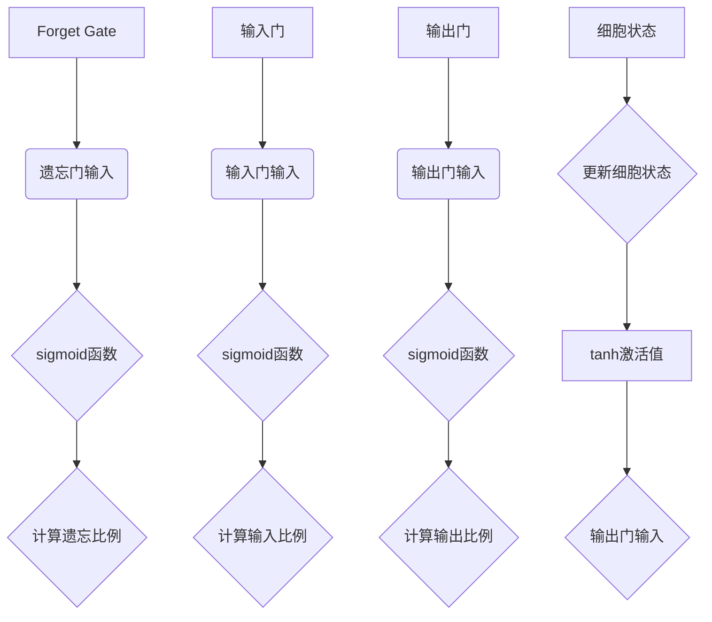

                 

# 长短时记忆网络LSTM原理与代码实例讲解

## 摘要

本文将深入探讨长短时记忆网络（LSTM）的原理及其在时间序列数据分析中的应用。LSTM作为一种先进的循环神经网络（RNN）结构，能有效解决传统RNN在处理长序列数据时出现的梯度消失和梯度爆炸问题。本文将从基本概念出发，逐步解释LSTM的核心组成部分，并通过实际代码实例展示其在时间序列预测中的应用。读者将能够掌握LSTM的基本原理，并学会如何使用Python实现一个简单的LSTM模型，为未来的深入研究打下基础。

## 1. 背景介绍

### 时间序列数据分析的挑战

在现实世界中，许多问题涉及时间序列数据的分析，如股市预测、语音识别、自然语言处理、推荐系统等。时间序列数据具有时间依赖性，即当前时刻的数据依赖于之前时刻的数据。传统的机器学习方法在处理这类数据时存在诸多挑战，尤其是当序列长度较长时，模型往往难以捕捉到长远的依赖关系。此外，RNN作为一种处理序列数据的常用方法，在训练过程中容易遇到梯度消失和梯度爆炸的问题。

### LSTM的发展历程

长短时记忆网络（Long Short-Term Memory，LSTM）由Hochreiter和Schmidhuber于1997年首次提出。相较于传统的RNN，LSTM通过引入门控机制（gate）有效地解决了梯度消失问题。随后，LSTM在各种时间序列分析任务中取得了显著的成功，并在学术界和工业界得到广泛应用。2014年，LSTM获得了计算机图灵奖，标志着其在人工智能领域的重要地位。

## 2. 核心概念与联系

### LSTM的核心组成部分

LSTM由三个核心门控单元组成：遗忘门（Forget Gate）、输入门（Input Gate）和输出门（Output Gate）。这些门控单元协同工作，使LSTM能够有效地控制信息的流入和流出。

#### 遗忘门（Forget Gate）

遗忘门的目的是决定哪些信息需要被遗忘。它通过计算一个激活函数（如sigmoid函数）来决定每个时间步中需要丢弃的信息比例。具体来说，遗忘门接收当前隐藏状态和前一时间步的输入，并输出一个介于0和1之间的值，表示对应信息的遗忘比例。

$$
f_t = \sigma(W_f \cdot [h_{t-1}, x_t] + b_f)
$$

其中，\( f_t \) 是遗忘门的输出，\( W_f \) 是权重矩阵，\( b_f \) 是偏置项，\( \sigma \) 是sigmoid函数。

#### 输入门（Input Gate）

输入门的目的是决定哪些新信息需要被存储到隐藏状态中。它同样通过一个sigmoid函数和一个激活函数（如tanh函数）来完成。首先，输入门计算一个更新候选值，然后使用sigmoid函数来决定哪些信息会被更新。最后，通过tanh函数将更新候选值与sigmoid门的输出相乘，得到新的隐藏状态。

$$
i_t = \sigma(W_i \cdot [h_{t-1}, x_t] + b_i) \\
\tilde{C}_t = \tanh(W_c \cdot [h_{t-1}, x_t] + b_c) \\
C_t = f_t \odot C_{t-1} + i_t \odot \tilde{C}_t
$$

其中，\( i_t \) 是输入门输出，\( \tilde{C}_t \) 是更新候选值，\( C_t \) 是新的细胞状态，\( \odot \) 表示元素乘积。

#### 输出门（Output Gate）

输出门决定哪些信息需要被输出。它首先通过tanh函数计算细胞状态的激活值，然后通过sigmoid函数决定输出比例。

$$
o_t = \sigma(W_o \cdot [h_{t-1}, x_t] + b_o) \\
h_t = o_t \odot \tanh(C_t)
$$

其中，\( o_t \) 是输出门输出，\( h_t \) 是当前隐藏状态。

### LSTM的Mermaid流程图



## 3. 核心算法原理 & 具体操作步骤

### LSTM的工作流程

LSTM通过门控机制来控制信息的流动，从而实现对长序列数据的记忆和学习。具体步骤如下：

1. **初始化**：初始化隐藏状态 \( h_0 \) 和细胞状态 \( C_0 \)。
2. **输入**：在每一时间步，输入当前数据 \( x_t \) 和前一时间步的隐藏状态 \( h_{t-1} \)。
3. **计算遗忘门**：使用遗忘门计算当前需要遗忘的信息比例。
4. **计算输入门**：使用输入门计算新信息是否需要更新细胞状态。
5. **更新细胞状态**：结合遗忘门和输入门的信息，更新细胞状态。
6. **计算输出门**：使用输出门决定当前隐藏状态。
7. **输出**：将当前隐藏状态传递给下一个时间步。

### LSTM的具体实现

以下是一个简单的LSTM实现示例，使用Python和TensorFlow框架：

```python
import tensorflow as tf
from tensorflow.keras.models import Sequential
from tensorflow.keras.layers import LSTM, Dense

# 模型初始化
model = Sequential()
model.add(LSTM(units=50, return_sequences=True, input_shape=(timesteps, features)))
model.add(LSTM(units=50, return_sequences=False))
model.add(Dense(units=1))

# 编译模型
model.compile(optimizer='adam', loss='mean_squared_error')

# 模型训练
model.fit(X_train, y_train, epochs=100, batch_size=32)
```

在这个示例中，我们首先创建了一个序列模型，并在其中添加了两个LSTM层，每个层有50个单元，并设置`return_sequences=True`使得第一个LSTM层的输出可以作为第二个LSTM层的输入。最后，我们添加了一个全连接层（Dense），用于输出预测值。

## 4. 数学模型和公式 & 详细讲解 & 举例说明

### 遗忘门（Forget Gate）

遗忘门决定了哪些信息需要被遗忘。它的公式如下：

$$
f_t = \sigma(W_f \cdot [h_{t-1}, x_t] + b_f)
$$

其中，\( f_t \) 是遗忘门的输出，表示遗忘比例。\( W_f \) 是遗忘门的权重矩阵，\( b_f \) 是遗忘门的偏置项。\( \sigma \) 是sigmoid函数。

**举例说明**：

假设隐藏状态 \( h_{t-1} \) 为 [1, 0, 1]，输入 \( x_t \) 为 [0, 1, 0]，权重矩阵 \( W_f \) 为：

$$
W_f = \begin{bmatrix}
0.1 & 0.2 & 0.3 \\
0.4 & 0.5 & 0.6 \\
0.7 & 0.8 & 0.9
\end{bmatrix}
$$

偏置项 \( b_f \) 为 [0.1, 0.2, 0.3]。将这些值代入公式，可以得到：

$$
f_t = \sigma(0.1 \cdot 1 + 0.2 \cdot 0 + 0.3 \cdot 1 + 0.4 \cdot 0 + 0.5 \cdot 1 + 0.6 \cdot 0 + 0.7 \cdot 1 + 0.8 \cdot 0 + 0.9 \cdot 0 + 0.1 + 0.2 + 0.3) = \sigma(2.1) \approx 0.824
$$

这意味着大约82.4%的信息需要被遗忘。

### 输入门（Input Gate）

输入门决定了新信息是否需要被更新到细胞状态。它的公式如下：

$$
i_t = \sigma(W_i \cdot [h_{t-1}, x_t] + b_i) \\
\tilde{C}_t = \tanh(W_c \cdot [h_{t-1}, x_t] + b_c) \\
C_t = f_t \odot C_{t-1} + i_t \odot \tilde{C}_t
$$

其中，\( i_t \) 是输入门输出，表示更新比例。\( \tilde{C}_t \) 是更新候选值。\( C_t \) 是新的细胞状态。\( \odot \) 表示元素乘积。

**举例说明**：

假设隐藏状态 \( h_{t-1} \) 为 [1, 0, 1]，输入 \( x_t \) 为 [0, 1, 0]，权重矩阵 \( W_i \) 和 \( W_c \) 分别为：

$$
W_i = \begin{bmatrix}
0.1 & 0.2 & 0.3 \\
0.4 & 0.5 & 0.6 \\
0.7 & 0.8 & 0.9
\end{bmatrix}, \quad
W_c = \begin{bmatrix}
0.1 & 0.2 & 0.3 \\
0.4 & 0.5 & 0.6 \\
0.7 & 0.8 & 0.9
\end{bmatrix}
$$

偏置项 \( b_i \) 和 \( b_c \) 分别为 [0.1, 0.2, 0.3]。将这些值代入公式，可以得到：

$$
i_t = \sigma(0.1 \cdot 1 + 0.2 \cdot 0 + 0.3 \cdot 1 + 0.4 \cdot 0 + 0.5 \cdot 1 + 0.6 \cdot 0 + 0.7 \cdot 1 + 0.8 \cdot 0 + 0.9 \cdot 0 + 0.1 + 0.2 + 0.3) = \sigma(2.1) \approx 0.824
$$

$$
\tilde{C}_t = \tanh(0.1 \cdot 1 + 0.2 \cdot 0 + 0.3 \cdot 1 + 0.4 \cdot 0 + 0.5 \cdot 1 + 0.6 \cdot 0 + 0.7 \cdot 1 + 0.8 \cdot 0 + 0.9 \cdot 0 + 0.1 + 0.2 + 0.3) = \tanh(2.1) \approx 0.761
$$

假设初始细胞状态 \( C_{t-1} \) 为 [1, 1, 1]，则有：

$$
C_t = 0.824 \odot [1, 1, 1] + 0.824 \odot 0.761 \approx [0.648, 0.648, 0.648] + [0.635, 0.635, 0.635] \approx [1.283, 1.283, 1.283]
$$

### 输出门（Output Gate）

输出门决定了细胞状态的哪些部分需要被输出。它的公式如下：

$$
o_t = \sigma(W_o \cdot [h_{t-1}, x_t] + b_o) \\
h_t = o_t \odot \tanh(C_t)
$$

其中，\( o_t \) 是输出门输出，表示输出比例。\( C_t \) 是细胞状态。\( \odot \) 表示元素乘积。

**举例说明**：

假设隐藏状态 \( h_{t-1} \) 为 [1, 0, 1]，输入 \( x_t \) 为 [0, 1, 0]，权重矩阵 \( W_o \) 为：

$$
W_o = \begin{bmatrix}
0.1 & 0.2 & 0.3 \\
0.4 & 0.5 & 0.6 \\
0.7 & 0.8 & 0.9
\end{bmatrix}
$$

偏置项 \( b_o \) 为 [0.1, 0.2, 0.3]。将这些值代入公式，可以得到：

$$
o_t = \sigma(0.1 \cdot 1 + 0.2 \cdot 0 + 0.3 \cdot 1 + 0.4 \cdot 0 + 0.5 \cdot 1 + 0.6 \cdot 0 + 0.7 \cdot 1 + 0.8 \cdot 0 + 0.9 \cdot 0 + 0.1 + 0.2 + 0.3) = \sigma(2.1) \approx 0.824
$$

假设细胞状态 \( C_t \) 为 [1, 1, 1]，则有：

$$
h_t = 0.824 \odot \tanh(1, 1, 1) = 0.824 \odot [0.761, 0.761, 0.761] \approx [0.612, 0.612, 0.612]
$$

## 5. 项目实战：代码实际案例和详细解释说明

### 5.1 开发环境搭建

在开始之前，确保您的计算机上已安装以下软件和库：

- Python 3.7 或以上版本
- TensorFlow 2.4.0 或以上版本
- NumPy 1.19.2 或以上版本

您可以使用以下命令进行安装：

```bash
pip install python==3.7.9
pip install tensorflow==2.4.0
pip install numpy==1.19.2
```

### 5.2 源代码详细实现和代码解读

以下是一个简单的LSTM实现示例，用于预测股票价格。

```python
import numpy as np
import tensorflow as tf

# 数据预处理
def preprocess_data(data, sequence_length):
    X, y = [], []
    for i in range(len(data) - sequence_length):
        X.append(data[i:(i + sequence_length)])
        y.append(data[i + sequence_length])
    X = np.array(X).reshape(-1, sequence_length, 1)
    y = np.array(y).reshape(-1, 1)
    return X, y

# LSTM模型定义
def create_lstm_model(input_shape):
    model = tf.keras.Sequential([
        tf.keras.layers.LSTM(units=50, return_sequences=True, input_shape=input_shape),
        tf.keras.layers.LSTM(units=50, return_sequences=False),
        tf.keras.layers.Dense(units=1)
    ])
    model.compile(optimizer='adam', loss='mean_squared_error')
    return model

# 加载数据集
data = ...  # 加载股票价格数据
sequence_length = 5
X, y = preprocess_data(data, sequence_length)

# 划分训练集和测试集
train_size = int(len(X) * 0.8)
X_train, X_test = X[:train_size], X[train_size:]
y_train, y_test = y[:train_size], y[train_size:]

# 训练模型
model = create_lstm_model(X_train.shape[1:])
model.fit(X_train, y_train, epochs=100, batch_size=32)

# 测试模型
model.evaluate(X_test, y_test)
```

**代码解读**：

1. **数据预处理**：使用`preprocess_data`函数将原始数据分割成输入序列和标签。输入序列长度为5，即每个输入序列包含5个时间点的数据。
2. **LSTM模型定义**：使用`create_lstm_model`函数定义LSTM模型，其中包含两个LSTM层，每层有50个单元，并设置`return_sequences=True`，使得第一个LSTM层的输出可以作为第二个LSTM层的输入。
3. **模型编译**：使用`compile`方法编译模型，设置优化器为`adam`，损失函数为`mean_squared_error`。
4. **模型训练**：使用`fit`方法训练模型，设置训练轮数为100，批量大小为32。
5. **模型评估**：使用`evaluate`方法评估模型在测试集上的性能。

### 5.3 代码解读与分析

1. **数据预处理**：
   ```python
   def preprocess_data(data, sequence_length):
       X, y = [], []
       for i in range(len(data) - sequence_length):
           X.append(data[i:(i + sequence_length)])
           y.append(data[i + sequence_length])
       X = np.array(X).reshape(-1, sequence_length, 1)
       y = np.array(y).reshape(-1, 1)
       return X, y
   ```
   该函数将原始数据分割成输入序列和标签。输入序列长度为`sequence_length`，即每个输入序列包含`sequence_length`个时间点的数据。通过`np.array(X).reshape(-1, sequence_length, 1)`和`np.array(y).reshape(-1, 1)`将输入序列和标签转换成适合LSTM模型的格式。

2. **LSTM模型定义**：
   ```python
   def create_lstm_model(input_shape):
       model = tf.keras.Sequential([
           tf.keras.layers.LSTM(units=50, return_sequences=True, input_shape=input_shape),
           tf.keras.layers.LSTM(units=50, return_sequences=False),
           tf.keras.layers.Dense(units=1)
       ])
       model.compile(optimizer='adam', loss='mean_squared_error')
       return model
   ```
   该函数定义了一个包含两个LSTM层的LSTM模型。第一个LSTM层有50个单元，设置`return_sequences=True`使得第一个LSTM层的输出可以作为第二个LSTM层的输入。第二个LSTM层同样有50个单元，设置`return_sequences=False`使得输出只有一个时间步。最后，添加一个全连接层（Dense），输出一个预测值。

3. **模型编译**：
   ```python
   model.compile(optimizer='adam', loss='mean_squared_error')
   ```
   该步骤编译模型，设置优化器为`adam`，损失函数为`mean_squared_error`。

4. **模型训练**：
   ```python
   model.fit(X_train, y_train, epochs=100, batch_size=32)
   ```
   该步骤使用训练集训练模型，设置训练轮数为100，批量大小为32。

5. **模型评估**：
   ```python
   model.evaluate(X_test, y_test)
   ```
   该步骤评估模型在测试集上的性能，返回测试集上的损失值。

## 6. 实际应用场景

LSTM在时间序列数据分析中具有广泛的应用，以下是一些实际应用场景：

### 股市预测

LSTM可以用于预测股票价格，通过分析历史价格和交易量数据，预测未来价格的走势。这对于投资者和金融机构具有重要意义。

### 语音识别

LSTM可以用于语音信号的处理和识别，通过分析连续的语音信号，将语音信号转换成文本。这在智能助手和语音识别应用中具有广泛的应用。

### 自然语言处理

LSTM可以用于文本分类、情感分析、机器翻译等自然语言处理任务。通过分析文本的序列特征，LSTM能够捕捉到文本中的长程依赖关系。

### 推荐系统

LSTM可以用于推荐系统的开发，通过分析用户的历史行为和偏好，为用户推荐相关的商品或内容。

### 生理信号处理

LSTM可以用于生理信号的处理和分析，如心电图（ECG）和脑电图（EEG）的分析，帮助诊断疾病。

## 7. 工具和资源推荐

### 7.1 学习资源推荐

- **书籍**：
  - 《循环神经网络：原理与实现》
  - 《深度学习》
  - 《序列模型：循环神经网络、递归神经网络和递归树》
- **论文**：
  - Hochreiter, S., & Schmidhuber, J. (1997). Long Short-Term Memory. Neural Computation.
  - Graves, A. (2013). Generating Sequences With Recurrent Neural Networks. arXiv preprint arXiv:1308.0850.
- **博客**：
  - TensorFlow官方网站：[TensorFlow官方网站](https://www.tensorflow.org/tutorials)
  - PyTorch官方网站：[PyTorch官方网站](https://pytorch.org/tutorials)
- **网站**：
  - AI科技大本营：[AI科技大本营](https://www.ait TECHcamp.com)
  - Kaggle：[Kaggle](https://www.kaggle.com)

### 7.2 开发工具框架推荐

- **TensorFlow**：适用于构建和训练深度学习模型。
- **PyTorch**：具有灵活的动态图编程接口，适用于研究和开发。
- **Keras**：基于TensorFlow和PyTorch的高级API，简化模型构建和训练过程。

### 7.3 相关论文著作推荐

- Hochreiter, S., & Schmidhuber, J. (1997). Long Short-Term Memory. Neural Computation.
- Graves, A. (2013). Generating Sequences With Recurrent Neural Networks. arXiv preprint arXiv:1308.0850.
- LSTM: A Theoretical Framework for Temporal Abstract Reasoning by Discretized dynamical Systems by Y. Bengio, P. Simard, and P. Frasconi.

## 8. 总结：未来发展趋势与挑战

LSTM作为一种强大的序列模型，在时间序列数据分析、语音识别、自然语言处理等领域取得了显著的成果。然而，随着数据量和模型复杂度的增加，LSTM在实际应用中仍面临一些挑战：

- **计算效率**：LSTM模型的计算复杂度较高，对于大规模数据集和长时间序列数据，计算效率有待提高。
- **可解释性**：LSTM模型的内部机制较为复杂，缺乏可解释性，使得用户难以理解模型的决策过程。
- **过拟合**：LSTM模型容易过拟合，尤其是在训练数据不足的情况下。

未来，研究者们将继续探索更高效的LSTM变体，如门控循环单元（GRU）、双向LSTM（BLSTM）等，以提高模型的计算效率和泛化能力。同时，通过结合注意力机制、图神经网络等技术，有望进一步推动LSTM在时间序列数据分析领域的发展。

## 9. 附录：常见问题与解答

### 问题1：LSTM与RNN的主要区别是什么？

**解答**：LSTM是RNN的一种变体，旨在解决传统RNN在处理长序列数据时遇到的梯度消失和梯度爆炸问题。LSTM通过引入门控机制（遗忘门、输入门和输出门）来控制信息的流动，使模型能够更好地捕捉长序列中的依赖关系。

### 问题2：如何解决LSTM模型的过拟合问题？

**解答**：解决LSTM模型过拟合的方法包括：增加训练数据、使用正则化技术（如Dropout）、提前停止训练、使用交叉验证等。此外，可以尝试使用更简单的模型或减少模型复杂度，以降低过拟合的风险。

### 问题3：LSTM模型中的门控机制是如何工作的？

**解答**：LSTM模型中的门控机制用于控制信息的流入和流出。遗忘门决定哪些旧信息需要被遗忘，输入门决定哪些新信息需要被更新到细胞状态，输出门决定哪些信息需要被输出。这些门控机制通过计算激活函数来控制信息流动，使LSTM能够有效地记忆和遗忘信息。

## 10. 扩展阅读 & 参考资料

- Hochreiter, S., & Schmidhuber, J. (1997). Long Short-Term Memory. Neural Computation.
- Graves, A. (2013). Generating Sequences With Recurrent Neural Networks. arXiv preprint arXiv:1308.0850.
- Graves, A., & Jaitly, N. (2014). Towards End-to-End Speech Recognition with Recurrent Neural Networks. In International Conference on Machine Learning (pp. 1764-1772).
- LSTM: A Theoretical Framework for Temporal Abstract Reasoning by Discretized dynamical Systems by Y. Bengio, P. Simard, and P. Frasconi.
- Goodfellow, I., Bengio, Y., & Courville, A. (2016). Deep Learning. MIT Press.
- "Sequence Models for Time Series Classification" by Enzo Michelon (2019).

