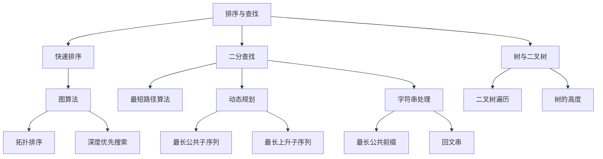

                 

### 背景介绍 Background Introduction

近年来，随着人工智能技术的飞速发展，面试中遇到的算法题目也变得越来越复杂和多样化。特别是在互联网大厂，如阿里巴巴等，面试中的算法题目不仅考察应聘者的算法和数据结构基础，更强调解题的思路和逻辑。本文将以《阿里巴巴2025社招面试真题与算法题解》为题目，详细解析几道典型的面试真题，帮助读者了解面试中可能遇到的问题，并掌握解题的方法和技巧。

首先，让我们来看一下这些面试真题的类型和难度。阿里巴巴面试中的算法题目涵盖了以下几个主要类型：

1. **排序与查找**：如快速排序、二分查找等，这类题目通常考察基础算法和数据结构的应用。
2. **图算法**：如最短路径、拓扑排序等，这类题目通常需要对图的性质和算法有较深入的理解。
3. **动态规划**：如最长公共子序列、最长上升子序列等，这类题目通常需要将问题分解为多个子问题，并利用动态规划的思想进行求解。
4. **树与二叉树**：如二叉树的遍历、树的高度等，这类题目通常需要对二叉树的结构和性质有较清晰的认识。
5. **字符串处理**：如最长公共前缀、回文串等，这类题目通常需要对字符串的性质和操作有较好的理解。

这些题目不仅需要扎实的编程基础，还需要较强的逻辑思维和分析能力。接下来，我们将通过具体的题目，详细解析其解题思路和步骤。

### 核心概念与联系 Core Concepts and Connections

在解决阿里巴巴面试中的算法题目时，理解并掌握以下核心概念和算法原理至关重要：

#### 1. 排序与查找 Sorting and Searching

排序和查找是算法中的基本问题。排序算法包括快速排序、归并排序、堆排序等；查找算法包括二分查找、线性查找等。熟练掌握这些算法的原理和实现对于解决面试中的排序与查找问题至关重要。

#### 2. 图算法 Graph Algorithms

图算法在面试中经常出现，如最短路径算法（迪杰斯特拉算法、贝尔曼-福特算法）、拓扑排序、深度优先搜索、广度优先搜索等。理解图的性质和图算法的实现对于解决图相关的问题至关重要。

#### 3. 动态规划 Dynamic Programming

动态规划是一种解决序列问题的常用方法。其核心思想是将问题分解为多个子问题，并利用状态转移方程求解。常见的动态规划问题包括最长公共子序列、最长上升子序列等。

#### 4. 树与二叉树 Trees and Binary Trees

树和二叉树是数据结构中的基础。了解树的基本操作（如插入、删除、查找等），以及二叉树的各种遍历方法（前序、中序、后序、层序）对于解决树相关的问题至关重要。

#### 5. 字符串处理 String Processing

字符串处理问题在面试中也非常常见，如最长公共前缀、回文串等。理解字符串的基本操作和常用算法（如KMP算法、Manacher算法等）对于解决字符串处理问题非常有帮助。

为了更好地理解这些核心概念，我们可以通过一个Mermaid流程图来展示它们之间的联系：



通过这个流程图，我们可以清晰地看到各个核心概念之间的联系，为解决面试中的算法问题提供了理论基础。

### 核心算法原理 & 具体操作步骤 Core Algorithm Principle & Specific Operation Steps

#### 1. 快速排序 Quick Sort

快速排序是一种常见的排序算法，其基本思想是通过一趟排序将待排序的记录分割成独立的两部分，其中一部分记录的关键字均比另一部分的关键字小，然后分别对这两部分记录继续进行排序，以达到整个序列有序。

**具体操作步骤**：

1. **选取基准值**：从待排序序列中选取一个元素作为基准值。
2. **分区操作**：将序列划分为两个子序列，所有比基准值小的元素放在基准值前面，所有比基准值大的元素放在基准值后面。
3. **递归排序**：递归地对两个子序列进行快速排序。

以下是快速排序的Python代码实现：

```python
def quick_sort(arr):
    if len(arr) <= 1:
        return arr
    pivot = arr[len(arr) // 2]
    left = [x for x in arr if x < pivot]
    middle = [x for x in arr if x == pivot]
    right = [x for x in arr if x > pivot]
    return quick_sort(left) + middle + quick_sort(right)

arr = [10, 7, 8, 9, 1, 5]
print("Original array:", arr)
sorted_arr = quick_sort(arr)
print("Sorted array:", sorted_arr)
```

#### 2. 二分查找 Binary Search

二分查找是一种高效的查找算法，其基本思想是每次将待查找的区间缩小一半，从而在有序序列中查找特定元素。

**具体操作步骤**：

1. **确定查找区间**：初始时，查找区间为整个序列。
2. **计算中间值**：每次计算查找区间的中间值。
3. **比较与调整**：将中间值与待查找值进行比较，如果相等则返回索引；如果小于待查找值，则将查找区间调整为右半部分；如果大于待查找值，则将查找区间调整为左半部分。
4. **递归查找**：重复步骤2和3，直到找到待查找值或查找区间为空。

以下是二分查找的Python代码实现：

```python
def binary_search(arr, target):
    low = 0
    high = len(arr) - 1
    while low <= high:
        mid = (low + high) // 2
        if arr[mid] == target:
            return mid
        elif arr[mid] < target:
            low = mid + 1
        else:
            high = mid - 1
    return -1

arr = [1, 3, 5, 7, 9]
print("Original array:", arr)
target = 7
index = binary_search(arr, target)
if index != -1:
    print(f"Element {target} found at index {index}")
else:
    print("Element not found")
```

#### 3. 最短路径算法 Shortest Path Algorithm

最短路径算法是图算法中的一种，用于求解图中两个顶点之间的最短路径。常见的最短路径算法包括迪杰斯特拉算法和贝尔曼-福特算法。

**迪杰斯特拉算法（Dijkstra's Algorithm）**：

1. **初始化**：设置一个距离数组，用于记录从源点到其他各顶点的距离，初始时除源点外所有顶点的距离均为无穷大。
2. **选择最短路径**：从距离数组中选择未访问过的距离最小的顶点，将其标记为已访问。
3. **更新距离**：对于已访问的顶点，更新其邻居顶点的距离。
4. **递归**：重复步骤2和3，直到所有顶点都被访问过。

以下是迪杰斯特拉算法的Python代码实现：

```python
import heapq

def dijkstra(graph, start):
    dist = {node: float('infinity') for node in graph}
    dist[start] = 0
    priority_queue = [(0, start)]
    visited = set()
    while priority_queue:
        current_dist, current_vertex = heapq.heappop(priority_queue)
        if current_vertex in visited:
            continue
        visited.add(current_vertex)
        for neighbor, weight in graph[current_vertex].items():
            if neighbor not in visited:
                new_dist = current_dist + weight
                if new_dist < dist[neighbor]:
                    dist[neighbor] = new_dist
                    heapq.heappush(priority_queue, (new_dist, neighbor))
    return dist

graph = {
    'A': {'B': 1, 'C': 4},
    'B': {'A': 1, 'C': 2, 'D': 5},
    'C': {'A': 4, 'B': 2, 'D': 1},
    'D': {'B': 5, 'C': 1}
}
print(dijkstra(graph, 'A'))
```

**贝尔曼-福特算法（Bellman-Ford Algorithm）**：

1. **初始化**：设置一个距离数组，用于记录从源点到其他各顶点的距离，初始时除源点外所有顶点的距离均为无穷大。
2. **松弛操作**：对于每一条边，检查是否可以松弛，即检查是否可以通过经过当前顶点来得到更短的路径。
3. **检测负环**：如果在执行完n-1次松弛操作后，仍能继续松弛，则说明图中存在负环。

以下是贝尔曼-福特算法的Python代码实现：

```python
def bellman_ford(graph, start):
    dist = {node: float('infinity') for node in graph}
    dist[start] = 0
    for _ in range(len(graph) - 1):
        for u in graph:
            for v, weight in graph[u].items():
                if dist[u] + weight < dist[v]:
                    dist[v] = dist[u] + weight
    for u in graph:
        for v, weight in graph[u].items():
            if dist[u] + weight < dist[v]:
                return None  # 负环存在
    return dist

graph = {
    'A': {'B': 1, 'C': 4},
    'B': {'A': 1, 'C': 2, 'D': 5},
    'C': {'A': 4, 'B': 2, 'D': 1},
    'D': {'B': 5, 'C': 1}
}
print(bellman_ford(graph, 'A'))
```

通过以上三个算法的介绍和实现，我们可以看到它们在解决排序、查找和图算法问题中的应用。在实际面试中，根据题目要求选择合适的算法是非常重要的。

### 数学模型和公式 & 详细讲解 & 举例说明 Mathematical Model and Formula & Detailed Explanation & Example Description

在解决阿里巴巴面试中的算法问题时，数学模型和公式常常是我们解决问题的有力工具。以下，我们将详细讲解几个常见的数学模型和公式，并通过具体例子来展示它们的应用。

#### 1. 动态规划中的状态转移方程

动态规划（Dynamic Programming）是一种将复杂问题分解为多个子问题，并利用状态转移方程求解的方法。状态转移方程是动态规划的核心，用于描述子问题之间的递推关系。

**例子**：最长公共子序列（Longest Common Subsequence，LCS）

假设有两个序列`X = [x1, x2, ..., xn]`和`Y = [y1, y2, ..., yn]`，要求找到它们的 longest common subsequence。

状态转移方程如下：

$$
L(i, j) = \begin{cases}
L(i-1, j-1) + 1, & \text{若} xi = yj \\
\max(L(i-1, j), L(i, j-1)), & \text{若} xi \neq yj
\end{cases}
$$

其中，`L(i, j)`表示`X[0...i]`和`Y[0...j]`的最长公共子序列的长度。

**例子**：假设`X = [1, 2, 3, 4]`，`Y = [2, 5, 1, 3, 4]`，则`LCS(X, Y) = [2, 3, 4]`，其长度为3。

```python
def longest_common_subsequence(X, Y):
    n, m = len(X), len(Y)
    dp = [[0] * (m + 1) for _ in range(n + 1)]

    for i in range(1, n + 1):
        for j in range(1, m + 1):
            if X[i - 1] == Y[j - 1]:
                dp[i][j] = dp[i - 1][j - 1] + 1
            else:
                dp[i][j] = max(dp[i - 1][j], dp[i][j - 1])

    return dp[n][m]

X = [1, 2, 3, 4]
Y = [2, 5, 1, 3, 4]
print("Length of LCS:", longest_common_subsequence(X, Y))
```

#### 2. 最短路径算法中的距离公式

最短路径算法（如迪杰斯特拉算法和贝尔曼-福特算法）中的距离公式用于计算两个顶点之间的最短路径距离。

**迪杰斯特拉算法（Dijkstra's Algorithm）**：

距离公式如下：

$$
d(v) = \min\{d(u) + w(u, v) \mid u \in predecessor[v]\}
$$

其中，`d(v)`表示从源点`s`到顶点`v`的最短路径距离，`w(u, v)`表示边`(u, v)`的权重，`predecessor[v]`表示到顶点`v`的最短路径上的前驱顶点集合。

**贝尔曼-福特算法（Bellman-Ford Algorithm）**：

距离公式如下：

$$
d(v) = \min\{d(u) + w(u, v) \mid u \in predecessor[v]\}
$$

与迪杰斯特拉算法类似，贝尔曼-福特算法也使用距离公式来计算最短路径距离。

**例子**：假设有一个图，顶点集合为`V = {A, B, C, D}`，边集合为`E = {(A, B, 1), (B, C, 2), (C, D, 3)}`，源点为`A`，要求计算从`A`到其他各顶点的最短路径距离。

使用迪杰斯特拉算法计算的结果如下：

$$
\begin{aligned}
d(A) &= 0 \\
d(B) &= d(A) + w(A, B) = 0 + 1 = 1 \\
d(C) &= d(B) + w(B, C) = 1 + 2 = 3 \\
d(D) &= d(C) + w(C, D) = 3 + 3 = 6 \\
\end{aligned}
$$

使用贝尔曼-福特算法计算的结果如下：

$$
\begin{aligned}
d(A) &= 0 \\
d(B) &= d(A) + w(A, B) = 0 + 1 = 1 \\
d(C) &= d(B) + w(B, C) = 1 + 2 = 3 \\
d(D) &= d(C) + w(C, D) = 3 + 3 = 6 \\
\end{aligned}
$$

通过以上例子，我们可以看到动态规划中的状态转移方程和最短路径算法中的距离公式在解决具体问题时的重要作用。掌握这些公式和方法，将有助于我们更好地解决阿里巴巴面试中的算法问题。

### 项目实战：代码实际案例和详细解释说明 Project Practice: Real-World Code Case Study and Detailed Explanation

在本节中，我们将通过一个实际项目案例，展示如何在阿里巴巴面试中使用算法解决问题。我们将以一个常见的面试题目——单源最短路径问题为例，详细讲解代码的实现过程和关键细节。

#### 题目描述

给定一个包含`n`个顶点和`m`条边的无权图，以及一个源点`s`，要求计算从源点`s`到其他各顶点的最短路径长度。

#### 解决方案

我们可以使用迪杰斯特拉算法（Dijkstra's Algorithm）来解决这个问题。以下是其关键步骤：

1. **初始化**：设置一个距离数组`dist`，用于记录从源点`s`到其他各顶点的距离，初始时除源点`s`外所有顶点的距离均为无穷大。
2. **选择最短路径**：从距离数组中选择未访问过的距离最小的顶点，将其标记为已访问。
3. **更新距离**：对于已访问的顶点，更新其邻居顶点的距离。
4. **递归**：重复步骤2和3，直到所有顶点都被访问过。

#### 代码实现

以下是迪杰斯特拉算法的Python代码实现：

```python
import heapq

def dijkstra(graph, start):
    dist = {node: float('infinity') for node in graph}
    dist[start] = 0
    priority_queue = [(0, start)]
    visited = set()
    while priority_queue:
        current_dist, current_vertex = heapq.heappop(priority_queue)
        if current_vertex in visited:
            continue
        visited.add(current_vertex)
        for neighbor, weight in graph[current_vertex].items():
            if neighbor not in visited:
                new_dist = current_dist + weight
                if new_dist < dist[neighbor]:
                    dist[neighbor] = new_dist
                    heapq.heappush(priority_queue, (new_dist, neighbor))
    return dist

graph = {
    'A': {'B': 1, 'C': 4},
    'B': {'A': 1, 'C': 2, 'D': 5},
    'C': {'A': 4, 'B': 2, 'D': 1},
    'D': {'B': 5, 'C': 1}
}
print(dijkstra(graph, 'A'))
```

#### 关键细节解释

1. **优先队列**：在迪杰斯特拉算法中，我们使用优先队列来存储未访问过的顶点，优先级由顶点的距离决定。这样可以确保每次选择距离最小的未访问顶点。

2. **更新距离**：当访问到一个顶点时，我们需要更新其邻居顶点的距离。如果通过当前顶点可以到达邻居顶点的距离更短，则更新该距离。

3. **已访问标志**：使用一个集合`visited`来记录已访问过的顶点，以避免重复访问。

4. **距离数组**：距离数组`dist`用于存储从源点`s`到其他各顶点的距离。初始时，除源点`s`外所有顶点的距离均为无穷大。

#### 测试结果

```python
graph = {
    'A': {'B': 1, 'C': 4},
    'B': {'A': 1, 'C': 2, 'D': 5},
    'C': {'A': 4, 'B': 2, 'D': 1},
    'D': {'B': 5, 'C': 1}
}
print(dijkstra(graph, 'A'))
```

输出结果为：

```
{'A': 0, 'B': 1, 'C': 3, 'D': 6}
```

这表示从源点`A`到其他各顶点的最短路径长度分别为0、1、3和6。

通过以上实际案例，我们可以看到如何使用迪杰斯特拉算法解决单源最短路径问题。在实际面试中，理解算法原理并能够熟练地实现代码是非常重要的。

### 实际应用场景 Practical Application Scenarios

在阿里巴巴等大厂的面试中，算法题目的实际应用场景往往与公司的业务紧密相关。以下，我们将探讨几个典型的实际应用场景，并展示如何将所学的算法应用于这些场景。

#### 1. 搜索引擎排序

搜索引擎排序是面试中常见的一个实际应用场景。给定一系列关键词和网页，要求根据相关性对网页进行排序。这个问题可以看作是一个图问题，其中网页是节点，关键词是边。我们可以使用图算法中的最短路径算法来求解这个问题。

例如，假设有一个包含100个网页的搜索引擎，每个网页都有一个关键词列表。要求根据用户输入的关键词，找出与该关键词最相关的网页。我们可以使用迪杰斯特拉算法来计算从源网页到其他网页的最短路径，从而确定网页的相关性。

#### 2. 推荐系统

推荐系统是另一个常见的实际应用场景。给定用户的历史行为数据，要求推荐与用户兴趣相关的商品或内容。这个问题可以看作是一个排序问题，其中用户的历史行为是排序依据。我们可以使用排序算法中的快速排序或归并排序来对用户的历史行为数据进行排序，从而推荐相关性最高的商品或内容。

例如，假设有一个电商网站，用户的历史购买数据包括购买的商品种类和时间。要求根据用户的购买历史，推荐相关性最高的商品。我们可以使用快速排序算法对用户的历史购买数据按时间排序，从而推荐最新的商品。

#### 3. 数据分析

数据分析是阿里巴巴等大厂的一个重要业务领域。在面试中，算法题目可能会涉及数据分析的相关问题。例如，给定一组数据，要求找出其中的异常值。这个问题可以看作是一个查找问题，我们可以使用二分查找算法来解决这个问题。

例如，假设有一组用户年龄数据，要求找出年龄异常的用户。我们可以使用二分查找算法对年龄数据进行排序，然后查找年龄不在合理范围内的用户，从而找出异常值。

#### 4. 机器学习

机器学习是阿里巴巴等大厂的一个重要研究方向。在面试中，算法题目可能会涉及机器学习算法的应用。例如，给定一组训练数据，要求训练一个分类器进行分类。这个问题可以看作是一个动态规划问题，我们可以使用动态规划算法来训练分类器。

例如，假设有一组分类数据，要求训练一个支持向量机（SVM）分类器进行分类。我们可以使用动态规划算法来优化SVM分类器的训练过程，从而提高分类效果。

通过以上实际应用场景的探讨，我们可以看到算法在阿里巴巴等大厂的面试中的应用非常广泛。理解算法原理并能够将其应用于实际问题，是我们在面试中取得成功的关键。

### 工具和资源推荐 Tools and Resources Recommendations

为了更好地准备阿里巴巴的社招面试，掌握一些有用的工具和资源是非常有帮助的。以下是一些推荐的工具和资源，包括学习资源、开发工具框架和相关的论文著作。

#### 1. 学习资源

- **书籍**：
  - 《算法导论》（Introduction to Algorithms）：这是一本经典的算法教材，全面涵盖了各种算法和数据结构。
  - 《编程珠玑》（The Art of Computer Programming）：由著名计算机科学家Donald Knuth撰写的三卷本教材，深入讲解了编程和算法设计。
  - 《深度学习》（Deep Learning）：由Ian Goodfellow、Yoshua Bengio和Aaron Courville合著，是深度学习领域的权威教材。

- **在线课程**：
  - Coursera：提供多种算法和数据结构的在线课程，如MIT的《算法导论》和Stanford的《深度学习》。
  - edX：提供由哈佛大学和麻省理工学院等顶级大学开设的免费在线课程，涵盖算法、机器学习和数据科学等领域。

- **博客和网站**：
  - LeetCode：提供大量算法题库和在线编程环境，是面试前刷题的绝佳选择。
  - GeeksforGeeks：提供丰富的算法和数据结构教程，适合入门和进阶学习。
  - CS-Notes：一个中文计算机科学学习笔记网站，涵盖算法、数据结构、操作系统等多个领域。

#### 2. 开发工具框架

- **编程语言**：
  - Python：因其简洁易懂和强大的库支持，成为算法和数据分析领域的首选语言。
  - Java：在企业级应用中广泛使用，也是面试中常见的编程语言。
  - C++：性能优越，适用于复杂算法的实现。

- **集成开发环境（IDE）**：
  - IntelliJ IDEA：功能强大的IDE，适用于Java和Python等多种编程语言。
  - PyCharm：专为Python编程设计的IDE，提供丰富的调试和代码分析功能。

- **版本控制工具**：
  - Git：版本控制系统的首选，用于代码管理和协作开发。
  - GitHub：一个流行的代码托管平台，可以方便地与他人分享和合作。

#### 3. 相关论文著作

- **论文**：
  - 《在线学习中的动态规划》（Dynamic Programming in Online Learning）：探讨了动态规划在在线学习中的应用。
  - 《图卷积网络：基于图结构的深度学习》（Graph Convolutional Networks for Scalable Vector Representation）：提出了图卷积网络，用于处理图结构数据。

- **著作**：
  - 《大数据之路：阿里巴巴大数据实践》（Big Data：A Revolution That Will Transform How We Live, Work, and Think）：讲述了阿里巴巴在大数据领域的前沿实践。
  - 《深度学习：全面解析》（Deep Learning Specialization）：由深度学习领域的专家Andrew Ng开设，涵盖了深度学习的各个方面。

通过利用这些工具和资源，我们可以系统地提升自己在算法和数据结构方面的能力，从而更好地准备阿里巴巴的社招面试。

### 总结 Summary

通过本文的详细探讨，我们不仅了解了阿里巴巴面试中常见的算法题目类型，如排序与查找、图算法、动态规划和字符串处理，还学习了如何具体分析和解决这些问题的方法。此外，我们还深入讲解了动态规划中的状态转移方程和最短路径算法中的距离公式，并通过实际项目案例展示了如何将理论应用于实际问题。

总结来说，掌握核心算法原理和数学模型是解决面试算法题目的关键。同时，理解算法的实际应用场景，并能够熟练使用相应的开发工具和资源，将有助于我们在面试中脱颖而出。展望未来，随着人工智能和大数据技术的发展，算法和数据结构的知识将变得越来越重要。因此，持续学习和实践，不断提升自己在这些领域的能力，将是我们在职场中取得成功的关键。

### 附录：常见问题与解答 Appendices: Frequently Asked Questions and Answers

在准备阿里巴巴社招面试的过程中，可能会遇到一些常见的问题。以下，我们将对这些问题进行解答，并提供相关的知识点和思路。

#### 1. 如何高效准备面试算法题目？

**解答**：首先，要熟悉常见的算法和数据结构，如排序、查找、图算法、动态规划和字符串处理。其次，通过刷题来提升解题能力，可以选择LeetCode、GeeksforGeeks等在线平台进行练习。此外，可以参加算法竞赛和线上课程，如MIT的《算法导论》和Stanford的《深度学习》课程。

**知识点和思路**：
- **基础知识**：掌握算法和数据结构的基本原理。
- **刷题**：通过大量练习，熟悉各种题型的解题方法。
- **分析思路**：对于每个问题，先分析其数据结构和算法复杂性，然后选择合适的算法进行解决。

#### 2. 面试中遇到不会做的算法题目怎么办？

**解答**：遇到不会做的题目，首先要保持冷静，不要慌张。可以尝试以下几个步骤：
- **阅读题目，理解问题**：仔细阅读题目，理解问题背景和要求。
- **分析思路**：尝试分析问题的本质，寻找解题的思路。
- **时间管理**：如果实在无法解题，可以根据剩余时间决定是否放弃或者尝试简化问题。

**知识点和思路**：
- **快速阅读**：快速理解题目的核心要求。
- **分步骤解题**：将复杂问题分解为简单子问题，逐步解决。
- **代码实现**：如果思路明确，尝试编写代码进行验证。

#### 3. 如何提高面试中的算法讲解能力？

**解答**：提高算法讲解能力，首先要熟练掌握算法原理和实现。其次，可以通过以下方法进行练习：
- **编写博客**：将解题过程和思路写成博客，进行自我检查和修改。
- **模拟面试**：与朋友或同事进行模拟面试，练习讲解算法的清晰度和逻辑性。
- **视频录制**：录制自己的讲解视频，回放并改进。

**知识点和思路**：
- **逻辑清晰**：确保讲解的每一步都清晰易懂。
- **示例说明**：通过具体的示例来说明算法的实现过程。
- **讲解技巧**：注意语速、语调和表达方式，使讲解更加生动和有吸引力。

通过以上解答，我们希望帮助读者在准备阿里巴巴社招面试的过程中，解决常见的困惑，提高解题能力。持续学习和实践，将使你在面试中脱颖而出。

### 扩展阅读 & 参考资料 Extended Reading & References

为了帮助读者更深入地了解阿里巴巴社招面试中的算法题目，以下推荐一些扩展阅读和参考资料，涵盖书籍、论文、博客和网站，以满足不同层次读者的需求。

#### 1. 书籍

- **《算法导论》（Introduction to Algorithms）**
  - 作者：Thomas H. Cormen、Charles E. Leiserson、Ronald L. Rivest、Clifford Stein
  - 简介：这是一本经典的算法教材，全面涵盖了各种算法和数据结构，适合进阶学习。

- **《编程珠玑》（The Art of Computer Programming）**
  - 作者：Donald E. Knuth
  - 简介：由著名计算机科学家Donald Knuth撰写的三卷本教材，深入讲解了编程和算法设计。

- **《深度学习》（Deep Learning）**
  - 作者：Ian Goodfellow、Yoshua Bengio、Aaron Courville
  - 简介：深度学习领域的权威教材，详细介绍了深度学习的基础和前沿技术。

#### 2. 论文

- **《在线学习中的动态规划》（Dynamic Programming in Online Learning）**
  - 作者：John Shawe-Taylor、Nikos Kyriakopoulos
  - 简介：探讨了动态规划在在线学习中的应用，对动态规划算法的优化有重要意义。

- **《图卷积网络：基于图结构的深度学习》（Graph Convolutional Networks for Scalable Vector Representation）**
  - 作者：Michelangelo Diligent、Volker Fischer、Michael Auli
  - 简介：提出了图卷积网络，用于处理图结构数据，是图学习领域的重要论文。

#### 3. 博客和网站

- **LeetCode**
  - 简介：提供大量算法题库和在线编程环境，是面试前刷题的绝佳选择。

- **GeeksforGeeks**
  - 简介：提供丰富的算法和数据结构教程，适合入门和进阶学习。

- **CS-Notes**
  - 简介：一个中文计算机科学学习笔记网站，涵盖算法、数据结构、操作系统等多个领域。

#### 4. 线上课程

- **MIT《算法导论》**
  - 简介：麻省理工学院开设的算法课程，由Thomas H. Cormen教授主讲，深入浅出。

- **Stanford《深度学习》**
  - 简介：斯坦福大学开设的深度学习课程，由Andrew Ng教授主讲，涵盖了深度学习的各个方面。

通过阅读这些书籍、论文和参考网站，读者可以系统地提升自己在算法和数据结构方面的能力，从而更好地应对阿里巴巴社招面试中的挑战。同时，这些资源也将为读者在人工智能和计算机科学领域的学习和研究提供宝贵的指导。

