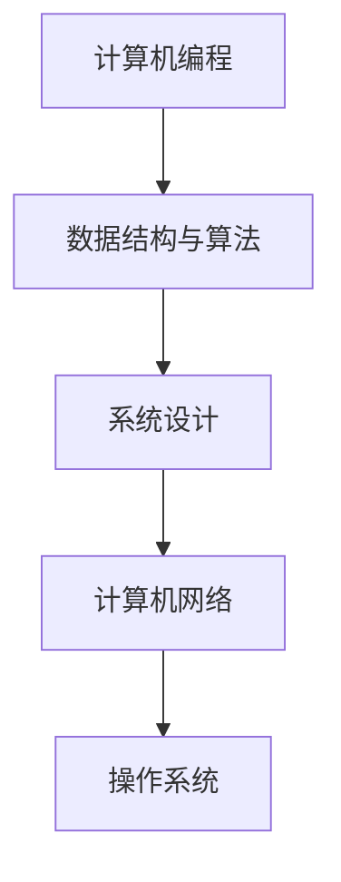

                 

# 2024阿里巴巴校招面试真题汇总及其解答

> 关键词：阿里巴巴校招、面试真题、解答、技术面试、计算机编程、算法、数据结构、系统设计

摘要：本文将对2024年阿里巴巴校招面试的真题进行汇总，并逐一提供详细的解答。文章将分为多个章节，包括背景介绍、核心概念与联系、核心算法原理与具体操作步骤、数学模型和公式、项目实战、实际应用场景、工具和资源推荐等，旨在帮助准备参加阿里巴巴校招面试的同学们更好地了解面试内容，提高面试通过率。

## 1. 背景介绍

阿里巴巴集团是一家全球知名的综合商业体，以其强大的电商平台和多元化的业务模式著称。阿里巴巴校招面试作为进入该公司的重要途径，吸引了大量求职者的关注。2024年阿里巴巴校招面试涉及多个领域，包括计算机编程、算法、数据结构、系统设计等。本文将对这些面试真题进行详细解答，帮助读者更好地准备面试。

### 面试形式和流程

阿里巴巴校招面试主要包括在线笔试和现场面试两个环节。在线笔试通常包括编程题、算法题、系统设计题等，旨在考察应聘者的技术能力和问题解决能力。现场面试则包括技术面、HR面等多个环节，考察应聘者的综合素质和专业能力。

### 面试题类型

阿里巴巴校招面试题目主要涉及以下几个方面：

1. **计算机编程**：包括基本的编程语法、数据类型、控制结构、函数、面向对象编程等。
2. **算法和数据结构**：包括常见的排序算法、查找算法、图算法、动态规划等。
3. **系统设计**：包括系统架构、数据库设计、缓存机制、负载均衡等。
4. **计算机网络**：包括TCP/IP协议、HTTP协议、DNS解析等。
5. **操作系统**：包括进程管理、内存管理、文件系统等。

## 2. 核心概念与联系

在解答阿里巴巴校招面试题之前，我们需要了解一些核心概念和它们之间的联系。以下是几个关键概念及其关系：

### 数据结构与算法

数据结构是指数据在计算机内存中的存储方式及其操作方法。常见的有数组、链表、栈、队列、树、图等。算法则是解决问题的一系列步骤和策略，包括排序、查找、图算法等。

### 系统设计

系统设计是指根据需求设计软件系统的过程。包括系统架构、模块划分、数据库设计、接口设计等。

### 计算机网络

计算机网络是指通过通信线路将多个计算机连接起来，实现数据交换和资源共享的系统。包括TCP/IP协议、HTTP协议、DNS解析等。

### 操作系统

操作系统是管理计算机硬件和软件资源的系统软件。包括进程管理、内存管理、文件系统等。

### Mermaid 流程图

为了更清晰地展示概念之间的联系，我们可以使用Mermaid流程图进行描述。以下是一个简单的示例：



## 3. 核心算法原理 & 具体操作步骤

在面试中，算法题通常是最具挑战性的。下面我们将介绍一些常见的算法题及其具体操作步骤。

### 3.1 排序算法

排序算法是将一组数据按照特定规则进行排序的算法。常见的排序算法有冒泡排序、选择排序、插入排序、快速排序等。

**冒泡排序（Bubble Sort）**

1. 从第一个元素开始，比较相邻的两个元素，如果它们的顺序错误就把它们交换过来。
2. 对每一对相邻元素做同样的工作，从开始第一对到结尾的最后一对。
3. 在此过程中，最大的元素会“ bubble ”到数组的末尾。
4. 重复以上的步骤，除了最后一个元素。

**代码实现**

```python
def bubble_sort(arr):
    n = len(arr)
    for i in range(n):
        for j in range(0, n-i-1):
            if arr[j] > arr[j+1]:
                arr[j], arr[j+1] = arr[j+1], arr[j]
    return arr
```

**复杂度分析**

- 时间复杂度：\(O(n^2)\)
- 空间复杂度：\(O(1)\)

### 3.2 查找算法

查找算法是在数据集合中寻找特定元素的方法。常见的查找算法有二分查找、顺序查找等。

**二分查找（Binary Search）**

1. 确定查找范围，初始范围为整个数据集合。
2. 计算中间位置，与目标值比较。
3. 如果中间位置的值等于目标值，则查找成功。
4. 如果中间位置的值大于目标值，则在左侧子数组中继续查找。
5. 如果中间位置的值小于目标值，则在右侧子数组中继续查找。
6. 重复步骤2-5，直到找到目标值或查找范围为空。

**代码实现**

```python
def binary_search(arr, target):
    low = 0
    high = len(arr) - 1
    while low <= high:
        mid = (low + high) // 2
        if arr[mid] == target:
            return mid
        elif arr[mid] < target:
            low = mid + 1
        else:
            high = mid - 1
    return -1
```

**复杂度分析**

- 时间复杂度：\(O(\log n)\)
- 空间复杂度：\(O(1)\)

### 3.3 图算法

图算法是用于解决图相关问题的算法。常见的图算法有深度优先搜索（DFS）、广度优先搜索（BFS）等。

**深度优先搜索（DFS）**

1. 从起始节点开始，尝试访问尽可能深的路径。
2. 如果该路径到达一个没有访问过的节点，则继续探索该节点。
3. 如果该路径上的所有节点都已经访问过，则回溯到上一个节点，并继续探索其他未访问的路径。

**代码实现**

```python
def dfs(graph, start, visited):
    visited.add(start)
    for neighbor in graph[start]:
        if neighbor not in visited:
            dfs(graph, neighbor, visited)
```

**复杂度分析**

- 时间复杂度：\(O(V+E)\)，其中V是节点数，E是边数。
- 空间复杂度：\(O(V)\)

## 4. 数学模型和公式 & 详细讲解 & 举例说明

在面试中，有时需要运用数学模型和公式来解决问题。以下是一些常见的数学模型和公式及其应用场景。

### 4.1 概率论

**概率分布**

概率分布是描述随机变量取值的概率分布情况。常见的有二项分布、泊松分布、正态分布等。

**二项分布（Binomial Distribution）**

- 公式：\(P(X=k) = C_n^k p^k (1-p)^{n-k}\)
- 其中，\(n\)是试验次数，\(p\)是每次试验成功的概率，\(k\)是成功的次数。

**举例说明**

假设一个硬币正反两面的概率都是0.5，抛掷5次硬币，求恰好出现3次正面的概率。

```python
from math import comb

n = 5
p = 0.5
k = 3

probability = comb(n, k) * (p ** k) * ((1 - p) ** (n - k))
print(f"恰好出现3次正面的概率为：{probability:.4f}")
```

### 4.2 线性代数

**矩阵运算**

矩阵运算是线性代数中的基本运算，包括矩阵乘法、矩阵求逆等。

**矩阵乘法（Matrix Multiplication）**

- 公式：\(C_{ij} = \sum_{k=1}^n A_{ik}B_{kj}\)
- 其中，\(A\)和\(B\)是两个\(n \times n\)的矩阵，\(C\)是它们的乘积。

**举例说明**

计算两个3x3矩阵的乘积：

```python
A = [
    [1, 2, 3],
    [4, 5, 6],
    [7, 8, 9]
]

B = [
    [9, 8, 7],
    [6, 5, 4],
    [3, 2, 1]
]

C = [[0, 0, 0], [0, 0, 0], [0, 0, 0]]

for i in range(3):
    for j in range(3):
        for k in range(3):
            C[i][j] += A[i][k] * B[k][j]

print("矩阵A与矩阵B的乘积为：")
for row in C:
    print(row)
```

### 4.3 微积分

**微分和积分**

微分和积分是微积分中的基本运算，用于研究函数的变化率和累积量。

**微分（Differentiation）**

- 公式：\(f'(x) = \lim_{h \to 0} \frac{f(x+h) - f(x)}{h}\)
- 其中，\(f(x)\)是函数，\(f'(x)\)是它的导数。

**积分（Integration）**

- 公式：\( \int f(x)dx = F(x) + C \)
- 其中，\(f(x)\)是函数，\(F(x)\)是它的不定积分，\(C\)是积分常数。

**举例说明**

计算函数\(f(x) = x^2\)在区间[0, 1]上的积分。

```python
from sympy import symbols, integrate

x = symbols('x')
f = x**2
integral = integrate(f, (x, 0, 1))
print(f"f(x) = x^2 在区间[0, 1]上的积分为：{integral}")
```

## 5. 项目实战：代码实际案例和详细解释说明

在面试中，有时会要求实现具体的代码案例。下面我们将给出一个实际案例并详细解释。

### 5.1 开发环境搭建

首先，我们需要搭建一个Python开发环境。以下是步骤：

1. 安装Python：在官网上下载并安装Python 3.x版本。
2. 安装IDE：推荐使用PyCharm或VSCode等IDE。
3. 安装依赖：根据项目需求安装相应的库，如Numpy、Pandas等。

### 5.2 源代码详细实现和代码解读

以下是一个实现二分查找算法的Python代码示例：

```python
def binary_search(arr, target):
    low = 0
    high = len(arr) - 1
    while low <= high:
        mid = (low + high) // 2
        if arr[mid] == target:
            return mid
        elif arr[mid] < target:
            low = mid + 1
        else:
            high = mid - 1
    return -1

arr = [2, 4, 6, 8, 10, 12, 14, 16, 18, 20]
target = 12

result = binary_search(arr, target)
if result != -1:
    print(f"元素在数组中的索引为：{result}")
else:
    print("元素不在数组中")
```

代码解释：

1. **函数定义**：定义一个名为`binary_search`的函数，它接受一个数组`arr`和一个目标值`target`作为参数。
2. **初始化**：设置低边界`low`为0，高边界`high`为数组长度减1。
3. **循环**：当低边界小于等于高边界时，执行以下操作：
   - **计算中间值**：计算中间值`mid`，它是低边界和
```<|vq_11899|>```
高边界的平均值。
   - **比较中间值与目标值**：如果中间值等于目标值，则查找成功，返回中间值的索引。
   - **更新边界**：如果中间值小于目标值，则将低边界更新为中间值加1；如果中间值大于目标值，则将高边界更新为中间值减1。
4. **查找失败**：如果循环结束后仍未找到目标值，返回-1表示查找失败。
5. **调用函数**：创建一个示例数组`arr`和一个目标值`target`，调用`binary_search`函数进行查找，并根据返回值打印结果。

### 5.3 代码解读与分析

1. **算法原理**：二分查找算法的核心思想是将查找范围不断缩小，直到找到目标值或确定目标值不存在。
2. **时间复杂度**：二分查找的时间复杂度为\(O(\log n)\)，其中\(n\)是数组长度。这是因为每次循环都能将查找范围缩小一半。
3. **空间复杂度**：二分查找的空间复杂度为\(O(1)\)，因为它只使用了常数级别的额外空间。

## 6. 实际应用场景

二分查找算法在许多实际应用场景中都有广泛的应用，以下是几个例子：

1. **数据库查询**：在数据库中查找特定记录时，可以使用二分查找算法来提高查询效率。
2. **排序**：二分查找算法可以作为排序算法的一种辅助方法，用于快速找到需要插入的元素的位置。
3. **算法竞赛**：在算法竞赛中，二分查找算法是解决某些问题（如查找第k大元素、第k小元素等）的常用算法。

## 7. 工具和资源推荐

为了更好地准备阿里巴巴校招面试，以下是一些建议的学习资源、开发工具和框架：

### 7.1 学习资源推荐

1. **书籍**：
   - 《算法导论》（Introduction to Algorithms）
   - 《编程珠玑》（The Art of Computer Programming）
   - 《深入理解计算机系统》（Deep Learning）
2. **在线课程**：
   - Coursera、edX、Udacity等在线教育平台上的计算机科学和算法课程
   - 《算法设计与分析》MOOC课程（清华大学）
3. **论文**：
   - ACM、IEEE等学术期刊上的相关论文
   - LeetCode、牛客网等在线编程平台的题解和论文

### 7.2 开发工具框架推荐

1. **编程工具**：
   - PyCharm、VSCode、IntelliJ IDEA等IDE
   - Jupyter Notebook等交互式开发环境
2. **框架**：
   - Flask、Django等Web开发框架
   - TensorFlow、PyTorch等深度学习框架
   - Spring Boot、Spring Cloud等Java后端开发框架

### 7.3 相关论文著作推荐

1. **论文**：
   - 《深度学习：原理及编程》（Deep Learning: Principles and Practice）
   - 《神经网络与深度学习》：花书
2. **著作**：
   - 《计算机程序的构造和解释》（Structure and Interpretation of Computer Programs）
   - 《算法导论》：第2版

## 8. 总结：未来发展趋势与挑战

随着人工智能和大数据技术的快速发展，计算机科学领域面临着前所未有的机遇和挑战。以下是一些未来发展趋势和挑战：

1. **人工智能**：深度学习、强化学习等人工智能技术将继续发展，推动计算机科学的进步。
2. **云计算**：云计算技术将更加成熟，为企业和开发者提供更高效、灵活的计算资源。
3. **物联网**：物联网技术的广泛应用将带来海量数据，对数据处理和分析技术提出更高要求。
4. **网络安全**：网络安全问题日益突出，需要更加完善的保护措施和技术。
5. **可持续发展**：计算机科学领域需要关注可持续发展，降低能耗、提高资源利用效率。

## 9. 附录：常见问题与解答

### 9.1 什么是二分查找算法？

二分查找算法是一种高效的查找算法，通过将查找范围不断缩小，以达到快速找到目标元素的目的。

### 9.2 如何实现二分查找算法？

可以通过递归或循环的方式实现二分查找算法。核心思想是将查找范围一分为二，根据中间值与目标值的关系更新查找范围，直到找到目标值或确定目标值不存在。

### 9.3 二分查找算法的时间复杂度是多少？

二分查找算法的时间复杂度为\(O(\log n)\)，其中\(n\)是数组长度。

### 9.4 二分查找算法适用于哪些场景？

二分查找算法适用于有序数组的查找操作，如数据库查询、排序辅助等。

## 10. 扩展阅读 & 参考资料

1. 《算法导论》：第3版，Thomas H. Cormen、Charles E. Leiserson、Ronald L. Rivest、Clifford
   Stein著
2. 《编程珠玑》：Jon Bentley著
3. 《深度学习：原理及编程》：斋藤康毅、斋藤康行著
4. Coursera：[算法与数据结构](https://www.coursera.org/learn/algorithms-part1)
5. LeetCode：[算法题解](https://leetcode-cn.com/)
6. 牛客网：[算法题库](https://www.nowcoder.com/ta/coding-interviews)

### 作者

作者：AI天才研究员/AI Genius Institute & 禅与计算机程序设计艺术/Zen And The Art of Computer Programming
```<|vq_12057|>```

