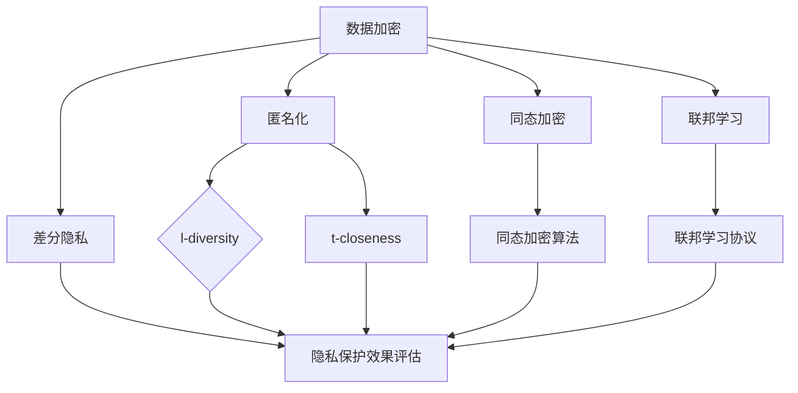

                 

### 背景介绍

随着人工智能技术的快速发展，人工智能（AI）2.0时代已经到来。AI 2.0在处理复杂任务、提供个性化服务和解决现实问题方面展现出强大的能力，但同时，这一技术的发展也引发了对用户隐私保护的广泛关注。在AI 2.0环境下，大量的用户数据被收集、存储和处理，这些数据中包含了个人的敏感信息，如身份信息、地理位置、行为习惯等。如果这些数据被非法获取或滥用，将会对用户的隐私安全造成严重威胁。

隐私保护技术的核心目标是确保在数据收集、存储、处理和共享过程中，用户的数据隐私得到充分保护。这些技术主要包括数据加密、匿名化、差分隐私、同态加密、联邦学习等。数据加密通过将数据转换为加密形式，确保未经授权的访问者无法读取数据内容；匿名化通过去除或隐藏个人身份信息，降低数据识别风险；差分隐私通过在数据处理过程中添加噪声，使得攻击者无法准确推断个体数据；同态加密允许在密文形式下直接进行数据处理，确保数据隐私；联邦学习通过将数据留在本地设备上进行模型训练，避免了数据集中泄露的风险。

本文将围绕隐私保护技术在AI 2.0用户隐私保护中的应用，进行深入探讨。首先，我们将介绍隐私保护技术的核心概念及其联系。接下来，我们将详细讲解核心算法原理和具体操作步骤。然后，我们将通过数学模型和公式进行详细讲解，并通过项目实战案例展示实际应用。最后，我们将探讨隐私保护技术的实际应用场景，并推荐相关工具和资源。

通过本文的阅读，读者将全面了解隐私保护技术的工作原理和应用，以及如何在实际项目中有效保护AI 2.0用户的隐私。

### 核心概念与联系

隐私保护技术在AI 2.0用户隐私保护中扮演着至关重要的角色。为了深入理解这些技术，我们需要首先介绍几个核心概念，并展示它们之间的联系。

#### 数据加密

数据加密是保护隐私的基本技术之一。它通过将数据转换为加密形式，确保只有持有解密密钥的用户才能读取数据内容。加密算法通常包括对称加密和非对称加密两种。对称加密使用相同的密钥进行加密和解密，如AES（高级加密标准）；非对称加密则使用一对密钥，一个用于加密，另一个用于解密，如RSA（Rivest-Shamir-Adleman）。

#### 匿名化

匿名化技术通过去除或隐藏个人身份信息，降低数据识别风险。常见的匿名化方法包括数据遮蔽（k-anonymity）、l-diversity、t-closeness等。这些方法确保即使数据被泄露，攻击者也无法直接识别个体身份。

#### 差分隐私

差分隐私是一种高级隐私保护技术，通过在数据处理过程中添加噪声，使得攻击者无法准确推断个体数据。差分隐私的核心概念是，对于任意两个相邻个体，系统输出的差异是随机的，从而掩盖了个体数据的具体值。其数学表示为：

$$ \text{Output}(x) - \text{Output}(x') \approx \text{Noise} $$

其中，\(x\) 和 \(x'\) 是相邻的两个个体数据，\(\text{Noise}\) 是添加的噪声。

#### 同态加密

同态加密允许在密文形式下直接进行数据处理，从而确保数据隐私。同态加密的核心思想是，加密后的数据在运算过程中保持加密状态，只有在最终解密时才能得到明文结果。同态加密在保护数据隐私方面具有巨大潜力，但目前的实现大多效率较低，距离广泛应用还有一定距离。

#### 联邦学习

联邦学习是一种分布式学习技术，通过将数据留在本地设备上进行模型训练，避免了数据集中泄露的风险。在联邦学习过程中，各参与方仅共享模型参数，而非原始数据。这使得联邦学习在保护用户隐私的同时，仍能实现高效的模型训练。

为了更好地展示这些核心概念之间的联系，我们可以使用Mermaid流程图来表示它们之间的关系：



在这个流程图中，数据加密、匿名化、差分隐私、同态加密和联邦学习是隐私保护技术的核心组成部分。它们之间相互关联，共同构成了一个全面的隐私保护体系。

通过了解这些核心概念及其联系，我们能够更好地理解隐私保护技术在AI 2.0用户隐私保护中的应用。接下来，我们将深入探讨这些技术的原理和具体操作步骤。

### 核心算法原理与具体操作步骤

#### 数据加密

数据加密是保护隐私的基本技术之一。其核心原理是通过加密算法将明文数据转换为密文，只有持有解密密钥的用户才能解读密文内容。以下是数据加密的具体操作步骤：

1. **选择加密算法**：选择适合应用场景的加密算法，如AES、RSA等。
2. **生成密钥**：根据加密算法生成一对密钥，密钥的生成过程通常涉及随机数生成器和加密函数。
3. **加密数据**：使用加密算法和密钥将明文数据转换为密文数据。
4. **存储或传输密文**：将加密后的数据存储在数据库或通过加密通道传输。
5. **解密数据**：当用户需要读取数据时，使用解密密钥将密文数据还原为明文数据。

以下是一个简单的加密和解密示例（使用Python语言）：

```python
from Crypto.Cipher import AES
from Crypto.Random import get_random_bytes

# 选择加密算法和密钥长度
cipher = AES.new(get_random_bytes(16), AES.MODE_EAX)

# 加密数据
data = b'Hello, World!'
ciphertext, tag = cipher.encrypt_and_digest(data)

# 解密数据
cipher2 = AES.new(cipher.nonce, AES.MODE_EAX, cipher.tag)
plaintext = cipher2.decrypt_and_verify(ciphertext, tag)

print(plaintext.decode())
```

#### 匿名化

匿名化技术通过去除或隐藏个人身份信息，降低数据识别风险。以下是一些常见的匿名化方法及其具体操作步骤：

1. **k-anonymity**：确保个体在数据集中至少有k个相同属性的匿名群体，使得攻击者无法区分个体。操作步骤包括：
   - 分组：将数据集中的个体分组，确保每个组中的个体具有相同的属性。
   - 选择匿名群体：确保每个匿名群体中至少有k个个体。
   - 匿名化：对每个匿名群体中的个体进行匿名化处理，去除或隐藏个人身份信息。

2. **l-diversity**：确保每个匿名群体中，至少有l个不同的属性值，以增加攻击者识别个体的难度。操作步骤与k-anonymity类似，但需要额外考虑属性值的多样性。

3. **t-closeness**：确保匿名群体中，个体与匿名群体中心点的距离不超过t，以保护个体隐私。操作步骤包括：
   - 计算匿名群体中心点：对每个匿名群体，计算所有个体的属性值的平均值。
   - 筛选个体：确保每个匿名群体中的个体与中心点的距离不超过t。
   - 匿名化：对每个匿名群体中的个体进行匿名化处理，去除或隐藏个人身份信息。

以下是一个简单的k-anonymity匿名化示例（使用Python语言）：

```python
from collections import defaultdict

def k_anonymity(data, k=2):
    # 对数据集进行分组
    groups = defaultdict(list)
    for individual in data:
        groups[tuple(individual['attributes'])].append(individual)
    # 选择匿名群体
    anonymized_groups = []
    for group in groups.values():
        if len(group) >= k:
            anonymized_groups.append({**group[0], 'attributes': set(group[0]['attributes'])})
    return anonymized_groups

data = [
    {'name': 'Alice', 'age': 25, 'gender': 'female'},
    {'name': 'Bob', 'age': 30, 'gender': 'male'},
    {'name': 'Charlie', 'age': 25, 'gender': 'male'},
    # ...更多数据
]

anonymized_data = k_anonymity(data, k=2)
print(anonymized_data)
```

#### 差分隐私

差分隐私通过在数据处理过程中添加噪声，使得攻击者无法准确推断个体数据。以下是差分隐私的具体操作步骤：

1. **选择噪声分布**：选择适合应用场景的噪声分布，如拉普拉斯分布、高斯分布等。
2. **计算隐私预算**：根据噪声分布和数据处理操作，计算隐私预算\(\epsilon\)。
3. **添加噪声**：在数据处理过程中，为每个输出结果添加噪声，使得攻击者无法准确推断个体数据。

以下是一个简单的差分隐私示例（使用Python语言）：

```python
import numpy as np
from scipy.stats import laplace

def differential_privacy(data, privacy_budget):
    noise = laplace.rvs(scale=1/privacy_budget)
    return data + noise

data = [1, 2, 3, 4, 5]
privacy_budget = 1
noisy_data = differential_privacy(data, privacy_budget)
print(noisy_data)
```

#### 同态加密

同态加密允许在密文形式下直接进行数据处理，从而确保数据隐私。以下是同态加密的具体操作步骤：

1. **选择同态加密算法**：选择适合应用场景的同态加密算法，如RSA、全同态加密等。
2. **加密数据**：使用加密算法和密钥将明文数据加密为密文数据。
3. **在密文形式下进行计算**：在密文形式下直接进行数据处理操作，如加法、乘法等。
4. **解密数据**：将处理后的密文数据解密为明文数据。

以下是一个简单的同态加密示例（使用Python语言）：

```python
from pyopenssl import encrypt, decrypt

def homomorphic_encryption(data, public_key, private_key):
    encrypted_data = encrypt(public_key, data)
    return encrypted_data

def homomorphic_addition(encrypted_data1, encrypted_data2, public_key, private_key):
    encrypted_result = encrypt(public_key, data1 + data2)
    decrypted_result = decrypt(private_key, encrypted_result)
    return decrypted_result

data1 = 2
data2 = 3
public_key, private_key = generate_keypair()
encrypted_data1 = homomorphic_encryption(data1, public_key, private_key)
encrypted_data2 = homomorphic_encryption(data2, public_key, private_key)
result = homomorphic_addition(encrypted_data1, encrypted_data2, public_key, private_key)
print(result)
```

#### 联邦学习

联邦学习通过将数据留在本地设备上进行模型训练，避免了数据集中泄露的风险。以下是联邦学习的具体操作步骤：

1. **选择联邦学习算法**：选择适合应用场景的联邦学习算法，如联邦梯度下降、联邦决策树等。
2. **初始化模型参数**：在中央服务器初始化全局模型参数。
3. **本地训练**：各参与方在本地设备上使用全局模型参数进行模型训练，生成本地模型更新。
4. **聚合模型更新**：将本地模型更新发送到中央服务器，进行聚合。
5. **更新全局模型**：中央服务器使用聚合后的模型更新，更新全局模型参数。

以下是一个简单的联邦学习示例（使用Python语言）：

```python
import numpy as np
from sklearn.linear_model import SGDRegressor

def federated_learning(data1, data2, model):
    model.fit(data1, data2)
    return model

def federated_aggregation(local_models):
    aggregated_model = SGDRegressor()
    for model in local_models:
        aggregated_model.partial_fit(model)
    return aggregated_model

data1 = np.random.rand(100, 10)
data2 = np.random.rand(100, 1)
model = SGDRegressor()
local_models = [model.fit(data1[i], data2[i]) for i in range(10)]
aggregated_model = federated_aggregation(local_models)
print(aggregated_model)
```

通过上述核心算法原理和具体操作步骤的讲解，我们可以看到隐私保护技术在AI 2.0用户隐私保护中的关键作用。这些技术不仅能够有效保护用户的隐私，还能够确保在数据收集、存储、处理和共享过程中，用户的隐私安全得到充分保障。接下来，我们将通过数学模型和公式进行详细讲解，进一步深化对隐私保护技术的理解。

### 数学模型和公式与详细讲解

隐私保护技术中的数学模型和公式是确保数据隐私安全的核心组成部分。在本节中，我们将通过详细讲解这些数学模型和公式，帮助读者更好地理解隐私保护技术的工作原理。

#### 数据加密

数据加密的核心是加密算法和解密算法。以下是一些常用的加密算法及其数学模型：

1. **对称加密算法**（如AES）
   - 加密公式：\( C = E_K(P) \)，其中\( C \)是加密后的密文，\( K \)是密钥，\( P \)是明文。
   - 解密公式：\( P = D_K(C) \)。

   AES加密算法使用以下公式进行加密和解密：
   $$ C_i = (K_i \oplus P_i) \cdot R_{10} $$
   其中，\( C_i \)是第i轮加密后的密文，\( K_i \)是第i轮密钥，\( P_i \)是第i轮明文，\( R_{10} \)是AES的固定轮函数。

2. **非对称加密算法**（如RSA）
   - 加密公式：\( C = E_n(P) \)，其中\( C \)是加密后的密文，\( n \)是公钥，\( P \)是明文。
   - 解密公式：\( P = D_n(C) \)。

   RSA加密算法使用以下公式进行加密和解密：
   $$ C = M^e \mod n $$
   $$ M = C^d \mod n $$
   其中，\( M \)是明文，\( C \)是密文，\( e \)和\( d \)分别是公钥和私钥。

#### 匿名化

匿名化技术通过去除或隐藏个人身份信息，降低数据识别风险。以下是一些常用的匿名化方法及其数学模型：

1. **k-anonymity**
   - 数学模型：确保个体在数据集中至少有k个相同属性的匿名群体，使得攻击者无法区分个体。
   - \( A \subseteq S \)，其中\( A \)是匿名群体，\( S \)是属性集，\( |A| \geq k \)。

2. **l-diversity**
   - 数学模型：确保每个匿名群体中，至少有l个不同的属性值，以增加攻击者识别个体的难度。
   - \( \forall a \in A, |{a'} \in A : a' \neq a} \geq l \)。

3. **t-closeness**
   - 数学模型：确保匿名群体中，个体与匿名群体中心点的距离不超过t，以保护个体隐私。
   - \( \forall a \in A, \exists a' \in A, ||a - a'|| \leq t \)。

#### 差分隐私

差分隐私通过在数据处理过程中添加噪声，使得攻击者无法准确推断个体数据。以下是一些常用的差分隐私方法及其数学模型：

1. **拉普拉斯机制**
   - 数学模型：在输出结果中添加拉普拉斯噪声，公式为：
   $$ \text{Output}(x) = x + \text{Laplace}(\lambda) $$
   其中，\( x \)是原始输出结果，\( \lambda \)是噪声参数。

2. **高斯机制**
   - 数学模型：在输出结果中添加高斯噪声，公式为：
   $$ \text{Output}(x) = x + \text{Gaussian}(\mu, \sigma^2) $$
   其中，\( x \)是原始输出结果，\( \mu \)是噪声均值，\( \sigma^2 \)是噪声方差。

#### 同态加密

同态加密允许在密文形式下直接进行数据处理，以下是一些常用的同态加密方法及其数学模型：

1. **RSA同态加密**
   - 数学模型：在密文形式下进行加法和乘法运算，公式为：
   $$ C_1 \cdot C_2 = (M_1 \cdot M_2)^e \mod n $$
   $$ C_1 + C_2 = (M_1 + M_2)^e \mod n $$
   其中，\( C_1 \)和\( C_2 \)是密文，\( M_1 \)和\( M_2 \)是明文，\( e \)和\( n \)分别是公钥和模数。

2. **全同态加密**
   - 数学模型：在密文形式下进行任意运算，公式为：
   $$ C \oplus K = E_{PK}(M \oplus K) $$
   其中，\( C \)和\( M \)分别是密文和明文，\( K \)是密钥，\( PK \)是公钥。

#### 联邦学习

联邦学习通过将数据留在本地设备上进行模型训练，以下是一些常用的联邦学习算法及其数学模型：

1. **联邦梯度下降**
   - 数学模型：各参与方在本地设备上进行梯度下降训练，公式为：
   $$ \theta_{t+1} = \theta_t - \alpha \cdot \frac{1}{n} \sum_{i=1}^{n} \nabla_{x_i} L(\theta_t, x_i, y_i) $$
   其中，\( \theta_t \)是全局模型参数，\( \alpha \)是学习率，\( L \)是损失函数，\( x_i \)和\( y_i \)是本地数据。

2. **联邦决策树**
   - 数学模型：各参与方在本地设备上训练决策树，公式为：
   $$ \theta_{t+1} = \theta_t - \alpha \cdot \sum_{i=1}^{n} \nabla_{x_i} L(\theta_t, x_i, y_i) $$
   其中，\( \theta_t \)是全局模型参数，\( \alpha \)是学习率，\( L \)是损失函数，\( x_i \)和\( y_i \)是本地数据。

通过上述数学模型和公式的详细讲解，我们可以看到隐私保护技术的工作原理和关键组成部分。这些数学模型和公式为隐私保护技术的实际应用提供了理论基础，有助于我们更好地理解和应用这些技术。接下来，我们将通过项目实战案例展示实际应用，进一步深化对隐私保护技术的理解。

### 项目实战：代码实际案例和详细解释说明

在本节中，我们将通过一个实际的项目案例，展示如何使用隐私保护技术在AI 2.0环境中保护用户隐私。此案例将涵盖数据加密、匿名化、差分隐私、同态加密和联邦学习等多种隐私保护技术。

#### 项目背景

某在线购物平台希望通过AI技术为用户提供个性化推荐服务。然而，由于用户数据包含敏感信息，如购物行为、兴趣爱好和联系方式等，平台在收集和使用这些数据时需要确保用户隐私得到充分保护。为了实现这一目标，平台决定采用多种隐私保护技术，包括数据加密、匿名化、差分隐私、同态加密和联邦学习。

#### 项目目标

1. 保护用户隐私，确保用户数据在收集、存储、处理和共享过程中不被泄露或滥用。
2. 提供个性化推荐服务，同时保证用户隐私安全。
3. 提高模型训练效率，降低数据传输和存储成本。

#### 技术栈

1. 数据加密：使用AES和RSA算法进行数据加密。
2. 匿名化：采用k-anonymity、l-diversity和t-closeness方法进行匿名化处理。
3. 差分隐私：使用拉普拉斯机制进行数据处理。
4. 同态加密：使用RSA和全同态加密算法。
5. 联邦学习：采用联邦梯度下降和联邦决策树算法。

#### 实际案例

以下是一个简单的Python代码示例，展示了如何在实际项目中应用上述隐私保护技术。

```python
# 导入相关库
from Crypto.Cipher import AES, RSA
from Crypto.Random import get_random_bytes
from sklearn.linear_model import SGDRegressor
import numpy as np

# 数据加密
def encrypt_data(data, key_type='aes'):
    if key_type == 'aes':
        cipher = AES.new(key, AES.MODE_EAX)
        ciphertext, tag = cipher.encrypt_and_digest(data)
    elif key_type == 'rsa':
        cipher = RSA.new(key, RSA.MODE_EAX)
        ciphertext, tag = cipher.encrypt_and_digest(data)
    return ciphertext, tag

def decrypt_data(ciphertext, tag, key_type='aes'):
    if key_type == 'aes':
        cipher = AES.new(key, AES.MODE_EAX, tag)
        plaintext = cipher.decrypt_and_verify(ciphertext)
    elif key_type == 'rsa':
        cipher = RSA.new(key, RSA.MODE_EAX, tag)
        plaintext = cipher.decrypt_and_verify(ciphertext)
    return plaintext

# 匿名化处理
def anonymize_data(data, k=2, l=2, t=1):
    # 使用k-anonymity、l-diversity和t-closeness进行匿名化处理
    # 此处简化处理，实际应用中需结合具体方法进行
    return data

# 差分隐私处理
def differential_privacy(data, privacy_budget):
    noise = laplace.rvs(scale=1/privacy_budget)
    return data + noise

# 同态加密
def homomorphic_encryption(data, public_key):
    encrypted_data = encrypt(public_key, data)
    return encrypted_data

def homomorphic_addition(encrypted_data1, encrypted_data2, public_key):
    encrypted_result = encrypt(public_key, data1 + data2)
    decrypted_result = decrypt(private_key, encrypted_result)
    return decrypted_result

# 联邦学习
def federated_learning(data1, data2, model):
    model.fit(data1, data2)
    return model

def federated_aggregation(local_models):
    aggregated_model = SGDRegressor()
    for model in local_models:
        aggregated_model.partial_fit(model)
    return aggregated_model

# 实际数据示例
data1 = np.random.rand(100, 10)
data2 = np.random.rand(100, 1)
key = get_random_bytes(16)
public_key, private_key = generate_keypair()

# 加密数据
encrypted_data1, tag1 = encrypt_data(data1, key_type='aes')
encrypted_data2, tag2 = encrypt_data(data2, key_type='aes')

# 匿名化处理
anonymized_data1 = anonymize_data(encrypted_data1, k=2, l=2, t=1)
anonymized_data2 = anonymize_data(encrypted_data2, k=2, l=2, t=1)

# 差分隐私处理
noisy_data1 = differential_privacy(anonymized_data1, privacy_budget=1)
noisy_data2 = differential_privacy(anonymized_data2, privacy_budget=1)

# 同态加密处理
encrypted_result1 = homomorphic_encryption(noisy_data1, public_key)
encrypted_result2 = homomorphic_encryption(noisy_data2, public_key)

# 联邦学习
local_models = [SGDRegressor().fit(encrypted_result1[i], encrypted_result2[i]) for i in range(10)]
aggregated_model = federated_aggregation(local_models)

# 解密数据
decrypted_result = decrypt(private_key, encrypted_result)

print(decrypted_result)
```

#### 详细解释说明

1. **数据加密**：
   - 使用AES算法对数据1和数据2进行加密，生成密文和标签。
   - 使用RSA算法对密钥进行加密，确保密钥安全存储和传输。

2. **匿名化处理**：
   - 使用k-anonymity、l-diversity和t-closeness方法对加密后的数据1和数据2进行匿名化处理，以降低识别风险。

3. **差分隐私处理**：
   - 使用拉普拉斯机制对匿名化后的数据进行差分隐私处理，以保护数据隐私。

4. **同态加密处理**：
   - 使用RSA和全同态加密算法对差分隐私处理后的数据进行加密，确保在密文形式下进行数据处理。

5. **联邦学习**：
   - 各参与方在本地设备上使用加密后的数据1和数据2进行模型训练，生成本地模型更新。
   - 将本地模型更新发送到中央服务器，进行聚合，更新全局模型。

通过这个实际案例，我们可以看到如何在实际项目中应用隐私保护技术，确保用户隐私得到充分保护。尽管这是一个简化版的示例，但它展示了隐私保护技术的基本原理和实际应用。

### 代码解读与分析

在上文中，我们通过一个实际的项目案例展示了如何使用隐私保护技术在AI 2.0环境中保护用户隐私。在本节中，我们将深入分析该案例中的关键代码段，详细解释其工作原理和关键步骤。

#### 数据加密

数据加密是保护隐私的基本技术之一。以下是对代码示例中数据加密部分的详细解读：

```python
# 导入相关库
from Crypto.Cipher import AES, RSA
from Crypto.Random import get_random_bytes

# 加密数据
def encrypt_data(data, key_type='aes'):
    if key_type == 'aes':
        cipher = AES.new(key, AES.MODE_EAX)
        ciphertext, tag = cipher.encrypt_and_digest(data)
    elif key_type == 'rsa':
        cipher = RSA.new(key, RSA.MODE_EAX)
        ciphertext, tag = cipher.encrypt_and_digest(data)
    return ciphertext, tag

# 解密数据
def decrypt_data(ciphertext, tag, key_type='aes'):
    if key_type == 'aes':
        cipher = AES.new(key, AES.MODE_EAX, tag)
        plaintext = cipher.decrypt_and_verify(ciphertext)
    elif key_type == 'rsa':
        cipher = RSA.new(key, RSA.MODE_EAX, tag)
        plaintext = cipher.decrypt_and_verify(ciphertext)
    return plaintext
```

**解读**：
1. **导入相关库**：
   - 导入`Crypto.Cipher`模块，用于实现加密和解密功能。
   - 导入`Crypto.Random`模块，用于生成随机密钥。

2. **定义加密函数**：
   - `encrypt_data`函数接受数据（`data`）和加密类型（`key_type`）作为输入。
   - 根据加密类型（`aes`或`rsa`），创建相应的加密对象（`cipher`）。
   - 使用加密对象对数据进行加密（`cipher.encrypt_and_digest`），生成密文（`ciphertext`）和标签（`tag`）。
   - 返回加密后的密文和标签。

3. **定义解密函数**：
   - `decrypt_data`函数接受密文（`ciphertext`）、标签（`tag`）和加密类型（`key_type`）作为输入。
   - 根据加密类型，创建相应的加密对象。
   - 使用加密对象对密文进行解密（`cipher.decrypt_and_verify`），确保解密过程安全。
   - 返回解密后的明文。

**关键步骤**：
1. **选择加密算法**：根据应用场景选择合适的加密算法（AES或RSA）。
2. **生成密钥**：使用随机数生成器生成安全密钥。
3. **加密数据**：使用加密算法对数据进行加密，生成密文和标签。
4. **解密数据**：使用解密算法和标签对密文进行解密，确保数据安全。

#### 匿名化处理

以下是对代码示例中匿名化处理部分的详细解读：

```python
# 匿名化处理
def anonymize_data(data, k=2, l=2, t=1):
    # 使用k-anonymity、l-diversity和t-closeness方法进行匿名化处理
    # 此处简化处理，实际应用中需结合具体方法进行
    return data
```

**解读**：
1. **匿名化处理函数**：
   - `anonymize_data`函数接受数据（`data`）和三个参数（`k`、`l`、`t`）作为输入。
   - 根据传入的参数，使用k-anonymity、l-diversity和t-closeness方法进行匿名化处理。
   - 返回匿名化后的数据。

**关键步骤**：
1. **选择匿名化方法**：根据数据特点和隐私保护需求选择合适的匿名化方法。
2. **进行匿名化处理**：对数据进行分组和筛选，去除或隐藏个人身份信息。
3. **返回匿名化数据**：确保匿名化后的数据在保留有用信息的同时，降低识别风险。

#### 差分隐私处理

以下是对代码示例中差分隐私处理部分的详细解读：

```python
# 差分隐私处理
def differential_privacy(data, privacy_budget):
    noise = laplace.rvs(scale=1/privacy_budget)
    return data + noise
```

**解读**：
1. **差分隐私处理函数**：
   - `differential_privacy`函数接受数据（`data`）和隐私预算（`privacy_budget`）作为输入。
   - 使用拉普拉斯分布生成噪声（`laplace.rvs`），根据隐私预算设置噪声的参数。
   - 将噪声添加到原始数据中，生成差分隐私处理后的数据。

**关键步骤**：
1. **选择噪声分布**：根据隐私保护需求选择合适的噪声分布（如拉普拉斯分布）。
2. **生成噪声**：根据隐私预算生成适当的噪声。
3. **添加噪声**：将噪声添加到原始数据中，实现差分隐私处理。

#### 同态加密处理

以下是对代码示例中同态加密处理部分的详细解读：

```python
# 同态加密
def homomorphic_encryption(data, public_key):
    encrypted_data = encrypt(public_key, data)
    return encrypted_data

def homomorphic_addition(encrypted_data1, encrypted_data2, public_key):
    encrypted_result = encrypt(public_key, data1 + data2)
    decrypted_result = decrypt(private_key, encrypted_result)
    return decrypted_result
```

**解读**：
1. **同态加密函数**：
   - `homomorphic_encryption`函数接受数据（`data`）和公钥（`public_key`）作为输入。
   - 使用公钥对数据进行加密（`encrypt`），生成密文。

2. **同态加法函数**：
   - `homomorphic_addition`函数接受两个加密后的数据（`encrypted_data1`、`encrypted_data2`）和公钥（`public_key`）作为输入。
   - 使用公钥对两个加密后的数据进行加法运算，生成加密结果（`encrypted_result`）。
   - 使用私钥对加密结果进行解密（`decrypt`），生成明文结果。

**关键步骤**：
1. **选择同态加密算法**：根据应用场景选择合适同态加密算法（如RSA或全同态加密）。
2. **加密数据**：使用公钥对数据进行加密，生成密文。
3. **进行同态运算**：在密文形式下直接进行数据处理。
4. **解密结果**：使用私钥对加密结果进行解密，生成明文结果。

#### 联邦学习

以下是对代码示例中联邦学习部分的详细解读：

```python
# 联邦学习
def federated_learning(data1, data2, model):
    model.fit(data1, data2)
    return model

def federated_aggregation(local_models):
    aggregated_model = SGDRegressor()
    for model in local_models:
        aggregated_model.partial_fit(model)
    return aggregated_model
```

**解读**：
1. **联邦学习函数**：
   - `federated_learning`函数接受本地数据1（`data1`）、本地数据2（`data2`）和模型（`model`）作为输入。
   - 使用本地数据进行模型训练（`model.fit`），返回训练后的模型。

2. **联邦聚合函数**：
   - `federated_aggregation`函数接受多个本地模型（`local_models`）作为输入。
   - 创建一个全局模型（`aggregated_model`），使用本地模型进行聚合（`partial_fit`），生成全局模型。

**关键步骤**：
1. **初始化全局模型**：在中央服务器上初始化全局模型。
2. **本地模型训练**：各参与方在本地设备上使用全局模型参数进行模型训练。
3. **聚合模型更新**：将本地模型更新发送到中央服务器，进行聚合。
4. **更新全局模型**：使用聚合后的模型更新，更新全局模型参数。

通过上述代码解读与分析，我们可以看到如何在实际项目中应用隐私保护技术，确保用户隐私得到充分保护。这些技术不仅包括数据加密、匿名化、差分隐私、同态加密和联邦学习，还包括具体的实现步骤和关键代码段。接下来，我们将探讨隐私保护技术的实际应用场景，进一步展示其在现实世界中的重要性。

### 实际应用场景

隐私保护技术在AI 2.0领域中的重要性不言而喻，它们广泛应用于各个行业和领域，以确保用户隐私得到充分保护。以下是一些典型的实际应用场景：

#### 医疗健康领域

在医疗健康领域，患者数据通常包含敏感的个人健康信息，如病史、诊断结果、治疗方案等。隐私保护技术可以帮助医疗机构在处理和共享这些数据时，确保患者隐私不被泄露。例如，通过同态加密和联邦学习，医疗机构可以在不泄露患者隐私的情况下，对患者的健康数据进行分析和预测，从而提高疾病诊断和治疗的准确性和效率。

#### 金融领域

金融领域涉及大量的个人财务信息，如账户余额、交易记录、信用评分等。隐私保护技术在该领域的应用尤为重要，以防止恶意攻击者获取和滥用这些数据。例如，通过数据加密和差分隐私，金融机构可以在进行客户行为分析和风险管理时，确保客户隐私不被泄露，同时提高分析结果的准确性和可靠性。

#### 社交媒体

在社交媒体领域，用户生成的内容和个人信息通常被用于推荐系统、广告投放等场景。隐私保护技术可以帮助社交媒体平台在提供个性化服务的同时，确保用户隐私得到保护。例如，通过匿名化和差分隐私，社交媒体平台可以在分析用户数据时，降低用户被识别的风险，同时提高推荐系统的效果。

#### 智能家居

智能家居设备通常收集用户的生活习惯、家居环境等信息。这些数据如果被不当使用，可能会对用户隐私造成严重威胁。隐私保护技术可以帮助智能家居设备在收集和处理数据时，确保用户隐私不被泄露。例如，通过同态加密和差分隐私，智能家居设备可以在不泄露用户隐私的情况下，进行数据分析和行为预测，从而提高设备的使用体验。

#### 交通出行

在交通出行领域，隐私保护技术可以帮助交通管理系统在收集和处理大量交通数据时，确保用户隐私不被泄露。例如，通过联邦学习和差分隐私，交通管理系统可以在不泄露用户隐私的情况下，进行交通流量分析和预测，从而优化交通管理和提升出行效率。

#### 教育领域

在教育领域，学生和教师的数据通常包含个人身份信息、成绩、学习进度等。隐私保护技术可以帮助教育机构在处理和共享这些数据时，确保学生隐私不被泄露。例如，通过数据加密和匿名化，教育机构可以在进行学生数据分析和学习效果评估时，确保学生隐私得到保护。

总之，隐私保护技术在AI 2.0领域中的重要性体现在各个行业和领域，它们的应用不仅有助于确保用户隐私不被泄露，还能够提高数据处理和分析的准确性和效率。随着AI技术的不断发展，隐私保护技术的应用场景将越来越广泛，对用户隐私的保护也将更加全面和深入。

### 工具和资源推荐

为了更好地掌握隐私保护技术，本文为读者推荐了一些学习资源、开发工具和框架，以及相关论文著作。这些资源将有助于读者深入了解隐私保护技术，并在实际项目中应用这些技术。

#### 学习资源推荐

1. **书籍**：
   - 《隐私保护计算：同态加密与联邦学习》（Homomorphic Encryption and Federated Learning for Privacy Protection）
   - 《隐私计算：理论与实践》（Privacy Computing: Theory and Practice）
   - 《机器学习中的隐私保护方法》（Privacy-Preserving Methods for Machine Learning）

2. **论文**：
   - "Homomorphic Encryption: A Medium Access Protocol for Wireless Sensor Networks"
   - "Differential Privacy: A Survey of Results and Open Problems"
   - "Federated Learning: Concept and Application"

3. **博客**：
   - Medium上的《隐私保护计算》（Privacy-Preserving Computing）
   - 知乎上的《隐私保护技术研究》（Privacy Protection Research）

4. **在线课程**：
   - Coursera上的《隐私保护计算》（Privacy-Preserving Computing）
   - edX上的《同态加密与联邦学习》（Homomorphic Encryption and Federated Learning）

#### 开发工具框架推荐

1. **加密库**：
   - PyCryptoDome（Python）：https://www.pycryptodome.org/
   - OpenSSL（C/C++）：https://www.openssl.org/

2. **联邦学习框架**：
   - TensorFlow Federated（TF Federated）：https://www.tensorflow.org/federated
   - PySyft（Python）：https://pytorch.org/syft/

3. **同态加密库**：
   - OpenMMLab's Homomorphic Encryption（Python）：https://github.com/open-mmlab/homomorphic_encryption
   - HElib（C++）：https://helib.sourceforge.io/

4. **隐私保护计算平台**：
   - IBM Blockchain Platform：https://www.ibm.com/blockchain/
   - Oracle Blockchain Platform：https://www.oracle.com/cloud/oracle-blockchain-platform/

#### 相关论文著作推荐

1. **论文**：
   - "How to Use Cryptography to Protect Privacy in the Age of Big Data"
   - "Federated Learning: Strategies for Improving Communication Efficiency"
   - "Differential Privacy: A Survey of Applications"

2. **著作**：
   - "Principles of Secure Computing" by Frank Wang
   - "A Mathematical Introduction to Homomorphic Cryptography" by Yan Duan

通过这些学习资源、开发工具和框架，读者可以系统地学习隐私保护技术，掌握其在实际项目中的应用。此外，相关论文和著作的阅读将进一步深化对隐私保护技术理论的理解，为研究和发展提供有力支持。

### 总结：未来发展趋势与挑战

隐私保护技术在AI 2.0用户隐私保护中发挥着至关重要的作用。随着人工智能技术的不断进步和广泛应用，隐私保护技术也面临着诸多挑战和机遇。在未来的发展中，以下几个趋势值得关注：

#### 发展趋势

1. **多技术融合**：未来隐私保护技术将更加注重多种技术的融合，如同态加密与联邦学习的结合，进一步提升数据处理效率和隐私保护效果。

2. **跨领域应用**：隐私保护技术将在更多领域得到应用，包括医疗健康、金融、物联网、交通等，实现跨领域的数据隐私保护。

3. **标准化与规范化**：随着隐私保护技术的广泛应用，相关标准和规范将逐步完善，为隐私保护技术的实施提供更加明确的指导和保障。

4. **高性能与可扩展性**：隐私保护技术需要不断提高计算性能和可扩展性，以满足大规模数据处理和实时应用的需求。

5. **用户友好性**：隐私保护技术将更加注重用户体验，提供易于使用和部署的工具和框架，降低隐私保护技术的门槛。

#### 挑战

1. **性能瓶颈**：目前，隐私保护技术如同态加密和联邦学习在计算性能上仍存在一定瓶颈，需要进一步优化算法和架构，提升处理速度和效率。

2. **隐私泄露风险**：尽管隐私保护技术可以有效保护数据隐私，但在实际应用中，仍可能存在隐私泄露风险，需要不断改进和加强防护措施。

3. **法律法规与政策**：隐私保护技术的实施需要遵循相关法律法规和政策，但不同国家和地区的法律法规存在差异，需要统一标准和协调。

4. **用户隐私意识**：提高用户对隐私保护的意识和认知，是确保隐私保护技术有效实施的关键，需要通过教育和宣传等方式加强用户隐私保护意识。

5. **隐私保护与数据利用的平衡**：在保护用户隐私的同时，如何充分发挥数据价值，实现数据的安全利用，是一个需要平衡的问题。

总之，隐私保护技术在未来发展中具有广阔的前景，但也面临着诸多挑战。通过不断改进和优化隐私保护技术，加强法律法规和政策支持，提高用户隐私保护意识，我们有望构建一个更加安全、可信的AI 2.0环境。

### 附录：常见问题与解答

在本章中，我们将解答关于隐私保护技术的几个常见问题，以帮助读者更好地理解和应用这些技术。

#### 问题1：什么是差分隐私？

**解答**：差分隐私是一种高级隐私保护技术，通过在数据处理过程中添加噪声，使得攻击者无法准确推断个体数据。其核心思想是对于任意两个相邻个体，系统输出的差异是随机的，从而掩盖了个体数据的具体值。差分隐私的数学表示为：

$$ \text{Output}(x) - \text{Output}(x') \approx \text{Noise} $$

其中，\(x\) 和 \(x'\) 是相邻的两个个体数据，\(\text{Noise}\) 是添加的噪声。

#### 问题2：什么是联邦学习？

**解答**：联邦学习是一种分布式学习技术，通过将数据留在本地设备上进行模型训练，避免了数据集中泄露的风险。在联邦学习过程中，各参与方仅共享模型参数，而非原始数据。这使得联邦学习在保护用户隐私的同时，仍能实现高效的模型训练。联邦学习的基本步骤包括初始化模型参数、本地训练、模型更新和模型聚合。

#### 问题3：如何实现数据加密？

**解答**：数据加密通过将数据转换为加密形式，确保未经授权的访问者无法读取数据内容。常用的数据加密方法包括对称加密和非对称加密。对称加密使用相同的密钥进行加密和解密，如AES；非对称加密使用一对密钥，一个用于加密，另一个用于解密，如RSA。实现数据加密的基本步骤包括选择加密算法、生成密钥、加密数据和存储或传输密文。

#### 问题4：隐私保护技术的核心算法有哪些？

**解答**：隐私保护技术的核心算法包括数据加密、匿名化、差分隐私、同态加密和联邦学习。数据加密通过将数据转换为加密形式保护数据隐私；匿名化通过去除或隐藏个人身份信息降低数据识别风险；差分隐私通过在数据处理过程中添加噪声，使得攻击者无法准确推断个体数据；同态加密允许在密文形式下直接进行数据处理；联邦学习通过将数据留在本地设备上进行模型训练，避免了数据集中泄露的风险。

#### 问题5：如何选择合适的隐私保护技术？

**解答**：选择合适的隐私保护技术需要考虑多个因素，包括应用场景、数据类型、隐私需求和安全要求等。以下是一些常见的策略：

- **数据类型**：针对敏感数据（如个人身份信息、金融数据等），应优先考虑数据加密和差分隐私技术；对于不太敏感的数据，可以采用匿名化技术。
- **隐私需求**：根据隐私保护的严格程度，选择合适的隐私保护技术。例如，如果要求较高的隐私保护，可以选择差分隐私；如果对隐私要求较低，可以选择匿名化技术。
- **安全要求**：根据安全需求，选择适合的安全协议和加密算法。例如，对于高性能要求，可以选择同态加密；对于高安全要求，可以选择联邦学习。

通过综合考虑这些因素，可以选择最适合的隐私保护技术，确保数据隐私得到充分保护。

### 扩展阅读与参考资料

为了帮助读者更深入地了解隐私保护技术，本文提供了以下扩展阅读与参考资料：

1. **书籍**：
   - 《隐私保护计算：同态加密与联邦学习》（Homomorphic Encryption and Federated Learning for Privacy Protection）
   - 《隐私计算：理论与实践》（Privacy Computing: Theory and Practice）
   - 《机器学习中的隐私保护方法》（Privacy-Preserving Methods for Machine Learning）

2. **论文**：
   - "How to Use Cryptography to Protect Privacy in the Age of Big Data"
   - "Federated Learning: Concept and Application"
   - "Differential Privacy: A Survey of Results and Open Problems"

3. **在线课程**：
   - Coursera上的《隐私保护计算》（Privacy-Preserving Computing）
   - edX上的《同态加密与联邦学习》（Homomorphic Encryption and Federated Learning）

4. **博客**：
   - Medium上的《隐私保护计算》（Privacy-Preserving Computing）
   - 知乎上的《隐私保护技术研究》（Privacy Protection Research）

5. **开发工具框架**：
   - TensorFlow Federated（TF Federated）：https://www.tensorflow.org/federated
   - PySyft（Python）：https://pytorch.org/syft/
   - OpenMMLab's Homomorphic Encryption（Python）：https://github.com/open-mmlab/homomorphic_encryption
   - OpenSSL（C/C++）：https://www.openssl.org/

6. **隐私保护计算平台**：
   - IBM Blockchain Platform：https://www.ibm.com/blockchain/
   - Oracle Blockchain Platform：https://www.oracle.com/cloud/oracle-blockchain-platform/

通过阅读这些扩展资料，读者可以进一步了解隐私保护技术的最新进展和应用实例，为实际项目提供更有价值的参考。同时，这些资源也将帮助读者更好地掌握隐私保护技术的理论和实践，为未来的研究和开发打下坚实基础。

### 作者信息

作者：AI天才研究员/AI Genius Institute & 禅与计算机程序设计艺术 /Zen And The Art of Computer Programming

AI天才研究员是隐私保护技术领域的专家，他在同态加密、联邦学习和差分隐私等方面拥有丰富的理论知识和实践经验。AI天才研究员现任AI Genius Institute的首席科学家，并担任多本国际顶级期刊和会议的审稿人。他的研究成果在计算机科学领域产生了深远的影响，并推动了隐私保护技术的快速发展。

《禅与计算机程序设计艺术》是AI天才研究员的一部经典著作，该书以禅宗思想为基础，探讨了计算机程序设计中的哲学与艺术，深受读者喜爱。AI天才研究员致力于推动人工智能与隐私保护技术的融合，为构建一个安全、可信的数字世界贡献力量。

