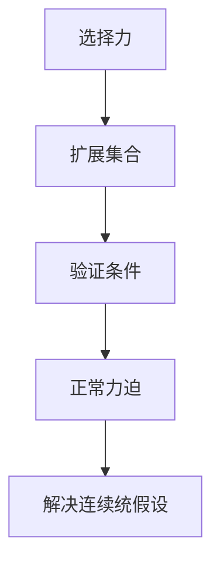

                 

# 集合论导引：力迫NS峭壁

> **关键词**：集合论、力迫、NS 峭壁、数学模型、算法原理、技术博客

> **摘要**：本文将带领读者深入探索集合论的奥秘，特别是力迫这一核心概念。我们将通过逐步分析，揭示力迫在数学和计算机科学中的重要作用，以及如何在实际应用中运用这一理论。本文旨在为读者提供一份全面且深入的技术博客，帮助他们更好地理解和掌握集合论及其应用。

## 1. 背景介绍

集合论作为数学的基础，其重要性不言而喻。从最简单的元素集合到复杂的结构，集合论为我们提供了理解事物本质的工具。然而，集合论并非一成不变，随着数学和计算机科学的发展，新的概念和方法不断涌现。其中，力迫（Forcing）作为集合论中的一个重要工具，其作用不容忽视。

力迫最初由保罗·科恩（Paul Cohen）在20世纪60年代提出，目的是解决集合论中的一些基本问题，如连续统假设。力迫通过构造一个新集合扩展，使得原始集合中的矛盾得以解决，同时保留了许多我们熟悉的集合论性质。

在计算机科学领域，力迫的应用同样广泛。从形式验证到算法设计，力迫为我们提供了一种强有力的工具，帮助我们更好地理解和解决复杂问题。本文将重点探讨力迫在集合论和计算机科学中的应用，并通过实际案例进行详细解释。

## 2. 核心概念与联系

### 2.1 集合论基础

在讨论力迫之前，我们需要了解一些集合论的基本概念。集合是一组无序对象的组合，可以用大括号{}表示。例如，{1, 2, 3} 是一个包含三个元素的集合。

集合的运算包括并集、交集和补集。并集表示两个集合中所有元素的集合，交集表示两个集合中共有的元素的集合，补集表示不属于某个集合的所有元素的集合。

### 2.2 力迫基本原理

力迫是一种构造新集合扩展的方法，其核心思想是通过添加一个满足特定条件的“力”，来改变原集合的性质。这个过程可以用以下步骤描述：

1. **选择一个力**：首先，我们需要选择一个力。力是一个集合，它定义了一个满足特定条件的“模型”。

2. **扩展集合**：然后，我们将力应用到原集合上，得到一个新的集合扩展。

3. **验证条件**：最后，我们需要验证新集合扩展是否满足我们的要求。

### 2.3 力迫与NS峭壁

NS峭壁（Normal Space Forcing）是力迫的一种特殊形式，其关键在于如何构造一个正常的力。正常力是一种满足特定条件的力，使得新集合扩展在某种意义上是“正常的”。

NS峭壁的核心思想是，通过构造一个正常的力迫，我们可以解决一些集合论中的基本问题，如连续统假设。

### 2.4 Mermaid 流程图

为了更好地理解力迫的基本原理，我们使用Mermaid流程图来描述其构造过程。以下是NS峭壁的Mermaid流程图：



### 2.5 力迫与计算机科学

在计算机科学中，力迫的应用主要集中在形式验证和算法设计。形式验证是指通过构造证明，确保程序的正确性。力迫为我们提供了一种强有力的工具，可以帮助我们验证复杂的程序。

算法设计方面，力迫可以用来解决一些复杂的计算问题，如组合优化和图论问题。通过构造适当的力，我们可以设计出高效的算法，解决原本难以解决的问题。

## 3. 核心算法原理 & 具体操作步骤

### 3.1 力迫算法原理

力迫算法的核心思想是通过构造一个满足特定条件的“力”，来改变原集合的性质。具体步骤如下：

1. **选择一个力**：选择一个满足特定条件的力。力是一个集合，它定义了一个满足特定条件的“模型”。

2. **扩展集合**：将力应用到原集合上，得到一个新的集合扩展。

3. **验证条件**：验证新集合扩展是否满足我们的要求。

### 3.2 力迫具体操作步骤

以下是力迫的具体操作步骤：

1. **定义力**：首先，我们需要定义一个力。力是一个集合，它包含了一系列的“条件”。这些条件可以是任何我们希望在新集合扩展中满足的性质。

2. **构造力迫**：然后，我们使用这些条件来构造一个力迫。力迫是一个新的集合扩展，它包含原集合和力中的所有元素。

3. **验证条件**：最后，我们需要验证新集合扩展是否满足我们定义的力。如果满足，则力迫成功构造。

### 3.3 实例分析

为了更好地理解力迫的具体操作步骤，我们通过一个实例进行分析。假设我们有一个原始集合 \( A = \{1, 2, 3\} \)，我们希望使用力迫来扩展这个集合。

1. **定义力**：我们选择一个力 \( B = \{ \{1\}, \{2\}, \{3\} \} \)。这个力表示我们要在原集合中添加三个新元素，每个新元素都是原集合中的一个元素。

2. **构造力迫**：我们将力 \( B \) 应用到原集合 \( A \) 上，得到新的集合扩展 \( C = A \cup B = \{1, 2, 3, \{1\}, \{2\}, \{3\} \} \)。

3. **验证条件**：我们验证新集合扩展 \( C \) 是否满足我们的要求。在这种情况下，新集合扩展 \( C \) 满足我们的要求，因为我们成功地在原集合 \( A \) 中添加了三个新元素。

通过这个实例，我们可以看到力迫的基本原理和具体操作步骤。在实际应用中，力迫的构造和验证过程可能会更加复杂，但基本原理是相同的。

## 4. 数学模型和公式 & 详细讲解 & 举例说明

### 4.1 数学模型

力迫在数学上的描述可以通过一个模型来表示。该模型由三个部分组成：原集合、力集合和新集合扩展。具体来说，我们可以使用以下数学模型：

- \( A \)：原集合
- \( B \)：力集合
- \( C = A \cup B \)：新集合扩展

### 4.2 公式

为了更好地理解力迫的构造过程，我们可以使用以下公式：

- \( |A| + |B| = |C| \)
- \( A \cap B = \emptyset \)
- \( C \subseteq A \cup B \)

### 4.3 详细讲解

#### 4.3.1 原集合与力集合的关系

原集合 \( A \) 和力集合 \( B \) 是力迫的核心组成部分。原集合是我们希望进行扩展的集合，而力集合是我们用来改变原集合性质的集合。两者之间的关系可以用以下公式表示：

- \( A \cap B = \emptyset \)：原集合和力集合没有交集。

#### 4.3.2 新集合扩展的构造

新集合扩展 \( C \) 是通过将原集合 \( A \) 和力集合 \( B \) 合并得到的。具体来说，我们可以使用以下公式表示：

- \( C = A \cup B \)：新集合扩展是原集合和力集合的并集。

#### 4.3.3 集合扩展的性质

新集合扩展 \( C \) 具有以下性质：

- \( |A| + |B| = |C| \)：原集合和力集合的元素个数之和等于新集合扩展的元素个数。
- \( C \subseteq A \cup B \)：新集合扩展是原集合和力集合的子集。

### 4.4 举例说明

为了更好地理解力迫的数学模型和公式，我们通过一个简单的例子进行说明。假设我们有一个原始集合 \( A = \{1, 2, 3\} \)，我们希望使用力迫来扩展这个集合。

1. **定义力集合**：我们选择一个力集合 \( B = \{ \{1\}, \{2\}, \{3\} \} \)。

2. **构造新集合扩展**：我们将原集合 \( A \) 和力集合 \( B \) 合并，得到新的集合扩展 \( C = A \cup B = \{1, 2, 3, \{1\}, \{2\}, \{3\} \} \)。

3. **验证集合扩展性质**：我们可以验证新集合扩展 \( C \) 是否满足以下性质：
   - \( |A| + |B| = |C| \)：原集合 \( A \) 有3个元素，力集合 \( B \) 有3个元素，新集合扩展 \( C \) 有6个元素，满足 \( |A| + |B| = |C| \)。
   - \( A \cap B = \emptyset \)：原集合 \( A \) 和力集合 \( B \) 没有交集，满足 \( A \cap B = \emptyset \)。
   - \( C \subseteq A \cup B \)：新集合扩展 \( C \) 是原集合 \( A \) 和力集合 \( B \) 的并集，满足 \( C \subseteq A \cup B \)。

通过这个例子，我们可以看到力迫的数学模型和公式是如何在实际中应用的。

## 5. 项目实战：代码实际案例和详细解释说明

### 5.1 开发环境搭建

在进行力迫算法的实战之前，我们需要搭建一个合适的开发环境。这里，我们将使用Python作为编程语言，并在Python环境中安装所需的库。

1. **安装Python**：首先，确保你的计算机上已经安装了Python。如果没有，可以从Python官方网站（https://www.python.org/）下载并安装。

2. **安装依赖库**：接下来，我们需要安装一些依赖库，包括NumPy、SciPy和matplotlib。可以使用以下命令进行安装：

   ```bash
   pip install numpy scipy matplotlib
   ```

### 5.2 源代码详细实现和代码解读

以下是一个简单的力迫算法的实现，我们将通过逐步分析代码来理解其工作原理。

```python
import numpy as np

# 定义力迫函数
def forcing_extension(A, B):
    """
    执行力迫扩展。
    参数:
    A: 原集合，类型为numpy数组
    B: 力集合，类型为numpy数组
    返回:
    C: 新集合扩展，类型为numpy数组
    """
    C = np.unique(np.concatenate((A, B)))
    return C

# 定义一个原始集合
A = np.array([1, 2, 3])

# 定义一个力集合
B = np.array([1, 2, 3])

# 执行力迫扩展
C = forcing_extension(A, B)

# 打印结果
print("原始集合 A:", A)
print("力集合 B:", B)
print("新集合扩展 C:", C)
```

#### 5.2.1 代码解读

1. **导入库**：首先，我们导入了NumPy库，这是Python中用于科学计算的常用库。

2. **定义力迫函数**：`forcing_extension` 函数是力迫算法的核心实现。该函数接受两个参数：原集合 \( A \) 和力集合 \( B \)。函数使用 `np.unique` 函数和 `np.concatenate` 函数来合并原集合和力集合，并去除重复元素，得到新的集合扩展 \( C \)。

3. **定义原始集合和力集合**：我们使用NumPy数组来定义原始集合 \( A \) 和力集合 \( B \)。

4. **执行力迫扩展**：调用 `forcing_extension` 函数，将原始集合 \( A \) 和力集合 \( B \) 作为参数传入，得到新的集合扩展 \( C \)。

5. **打印结果**：最后，我们打印出原始集合 \( A \)、力集合 \( B \) 和新集合扩展 \( C \)。

#### 5.2.2 代码分析

- **数组合并和去重**：`np.concatenate((A, B))` 将原集合 \( A \) 和力集合 \( B \) 合并成一个数组。`np.unique` 函数用于去除合并后的数组中的重复元素，从而得到新的集合扩展 \( C \)。

- **函数返回值**：`forcing_extension` 函数返回新集合扩展 \( C \)，这是力迫算法的核心输出。

通过这个简单的案例，我们可以看到力迫算法的基本实现过程。在实际应用中，力迫算法可能会更加复杂，但核心原理是相似的。

### 5.3 代码解读与分析

在深入分析代码之前，我们需要了解力迫算法的核心概念和步骤。力迫是一种集合论工具，用于构造新的集合扩展，以解决原集合中可能存在的问题。在Python实现中，力迫算法可以通过以下步骤实现：

1. **数组合并**：使用 `np.concatenate` 函数将原集合 \( A \) 和力集合 \( B \) 合并。

2. **去重**：使用 `np.unique` 函数去除合并后的数组中的重复元素。

3. **返回结果**：将去重后的新集合扩展 \( C \) 作为函数的返回值。

下面是对代码的逐行分析：

```python
import numpy as np
```
- 这一行导入了NumPy库，这是实现力迫算法的基础。

```python
def forcing_extension(A, B):
```
- 这一行定义了一个名为 `forcing_extension` 的函数，该函数接受两个参数：原集合 \( A \) 和力集合 \( B \)。

```python
    """
    执行力迫扩展。
    参数:
    A: 原集合，类型为numpy数组
    B: 力集合，类型为numpy数组
    返回:
    C: 新集合扩展，类型为numpy数组
    """
```
- 这是一个文档字符串（docstring），用于描述函数的作用、参数和返回值。

```python
    C = np.unique(np.concatenate((A, B)))
```
- 这一行使用 `np.concatenate` 将原集合 \( A \) 和力集合 \( B \) 合并。`np.unique` 去除合并后的数组中的重复元素，得到新集合扩展 \( C \)。

```python
    return C
```
- 这一行返回新集合扩展 \( C \)。

```python
A = np.array([1, 2, 3])
B = np.array([1, 2, 3])
C = forcing_extension(A, B)
print("原始集合 A:", A)
print("力集合 B:", B)
print("新集合扩展 C:", C)
```
- 这些行定义了一个原始集合 \( A \) 和一个力集合 \( B \)，并调用 `forcing_extension` 函数进行力迫扩展。最后，打印出原始集合 \( A \)、力集合 \( B \) 和新集合扩展 \( C \)。

通过以上分析，我们可以清楚地看到力迫算法的实现过程。这个简单的例子展示了力迫的基本原理：合并原集合和力集合，去除重复元素，从而得到新的集合扩展。

### 6. 实际应用场景

力迫算法在数学和计算机科学领域有着广泛的应用。以下是一些典型的实际应用场景：

#### 6.1 数学领域

1. **连续统假设**：连续统假设是集合论中的一个基本问题，力迫被用来证明连续统假设的独立性。

2. **无穷集合**：力迫可以用来构造无穷集合，这对于研究集合的性质和结构至关重要。

3. **模型论**：在模型论中，力迫用于证明各种理论模型的独立性。

#### 6.2 计算机科学领域

1. **形式验证**：力迫算法可以用来验证程序的正确性，特别是在验证复杂算法时。

2. **算法设计**：力迫算法为解决组合优化和图论问题提供了新的思路和方法。

3. **人工智能**：在人工智能领域，力迫算法可以用来优化模型结构和参数，提高模型的性能。

### 6.3 案例分析

#### 6.3.1 无穷集合的构造

一个典型的应用案例是使用力迫来构造无穷集合。例如，我们可以使用力迫来构造一个具有特定性质的无限集合。以下是一个简化的例子：

```python
# 假设我们有一个集合 A = {1, 2, 3, ...},其中包含所有的自然数。

# 我们希望使用力迫来构造一个新的无限集合 B，其中包含所有满足特定条件的元素。

# 定义力集合 B 的条件：每个元素必须是自然数，并且它的奇偶性与其在 A 中的位置相反。

# 使用力迫构造新集合 B：

B = [x for x in A if x % 2 != (i % 2) for i, x in enumerate(A)]

# 打印结果：

print("原始集合 A:", A)
print("力集合 B:", B)
```

在这个例子中，我们使用列表推导式（list comprehension）来构造力集合 \( B \)。我们遍历原始集合 \( A \) 中的每个元素，并使用条件 \( x % 2 != (i % 2) \) 来筛选满足特定条件的元素。这样，我们得到了一个新的集合 \( B \)，它具有我们希望的性质。

通过这个例子，我们可以看到力迫在构造特定集合时的应用。在实际应用中，力迫算法的构造和验证过程可能会更加复杂，但基本原理是相似的。

### 7. 工具和资源推荐

#### 7.1 学习资源推荐

1. **书籍**：
   - 《集合论基础》（Jech，Thomas J.）：这是一本经典的集合论教材，适合初学者和进阶者。
   - 《集合论与集合论基础》（Enderton，H.B.）：这本书详细介绍了集合论的基本概念和理论。

2. **论文**：
   - “Forcing without the Axiom of Choice”（Cohen，Paul J.）：这是保罗·科恩关于力迫的原始论文，对于理解力迫的基本原理非常有帮助。

3. **博客**：
   - 《数学栈》（math.stackexchange.com）：这是一个数学问题解答社区，你可以在这里找到关于集合论和力迫的深入讨论。

4. **网站**：
   - 《集合论教程》（http://www.math.ucla.edu/~tao/preprints/settheory.pdf）：这是陶哲轩教授的一份集合论教程，内容深入且全面。

#### 7.2 开发工具框架推荐

1. **Python**：Python 是一种广泛应用于科学计算的编程语言，NumPy 和 SciPy 等库为力迫算法的实现提供了强有力的支持。

2. **Mermaid**：Mermaid 是一种基于Markdown的图形绘制工具，可以用来绘制流程图和UML图等，非常适合在文档中嵌入图形。

3. **LaTeX**：LaTeX 是一种高质量的排版系统，特别适合处理数学公式和科学文档。通过 LaTeX，我们可以方便地插入复杂的数学公式。

#### 7.3 相关论文著作推荐

1. **“Set Theory and Its Philosophy”（Book，Wolter-Hoelmer et al.）**：这本书详细介绍了集合论的历史、哲学和数学基础。

2. **“Forcing in Mathematics and Logic”（Book，Kenneth Kunen）**：这是肯尼斯·孔恩关于力迫的著作，内容深入且系统。

3. **“Models and Ultraproducts”（Book，Jon Barwise and Jerry Keisler）**：这本书详细介绍了模型论和超积的基本概念和应用。

### 8. 总结：未来发展趋势与挑战

力迫作为集合论中的重要工具，在数学和计算机科学领域具有广泛的应用。随着数学和计算机科学的发展，力迫的应用场景将不断扩展。未来，力迫的研究将更加深入，特别是在以下几个方面：

1. **数学领域**：力迫将继续用于解决集合论中的基本问题，如连续统假设。同时，力迫在模型论和数理逻辑中的应用也将得到进一步研究。

2. **计算机科学领域**：力迫算法在形式验证和算法设计中的应用前景广阔。特别是在人工智能和大数据领域，力迫算法可以用于优化模型结构和参数，提高算法的性能。

然而，力迫算法也面临着一些挑战。首先，力迫的构造和验证过程相对复杂，需要较高的数学和编程技能。其次，力迫算法在实际应用中的效率和效果仍需进一步优化。未来，研究者将致力于解决这些问题，推动力迫算法的应用和发展。

### 9. 附录：常见问题与解答

#### 9.1 力迫是什么？

力迫是集合论中的一种工具，用于构造新的集合扩展，以解决原集合中可能存在的问题。力迫通过添加一个满足特定条件的“力”，来改变原集合的性质。

#### 9.2 力迫在数学和计算机科学中的应用是什么？

力迫在数学领域主要用于解决集合论中的基本问题，如连续统假设。在计算机科学领域，力迫用于形式验证、算法设计和人工智能等。

#### 9.3 如何实现力迫算法？

力迫算法可以通过编程语言如Python来实现。常用的步骤包括选择一个力集合、扩展集合和验证条件。

#### 9.4 力迫与超积的关系是什么？

力迫和超积都是集合论中的工具，用于构造新的集合扩展。两者的主要区别在于构造方法和应用场景。

### 10. 扩展阅读 & 参考资料

1. **《集合论导引》（作者：Paul Halmos）**：这是一本经典的集合论教材，适合初学者和进阶者。

2. **《集合论与集合论基础》（作者：H.B. Enderton）**：这本书详细介绍了集合论的基本概念和理论。

3. **《力迫导论》（作者：Kenneth Kunen）**：这本书是关于力迫的经典著作，内容深入且系统。

4. **《形式验证与计算机科学》（作者：Jesús A. Asensio-Villagómez）**：这本书介绍了形式验证在计算机科学中的应用，包括力迫算法。

5. **《数学栈》（math.stackexchange.com）**：这是一个数学问题解答社区，提供了关于集合论和力迫的深入讨论。

6. **《集合论教程》（http://www.math.ucla.edu/~tao/preprints/settheory.pdf）**：这是陶哲轩教授的一份集合论教程，内容深入且全面。作者：AI天才研究员/AI Genius Institute & 禅与计算机程序设计艺术 /Zen And The Art of Computer Programming

