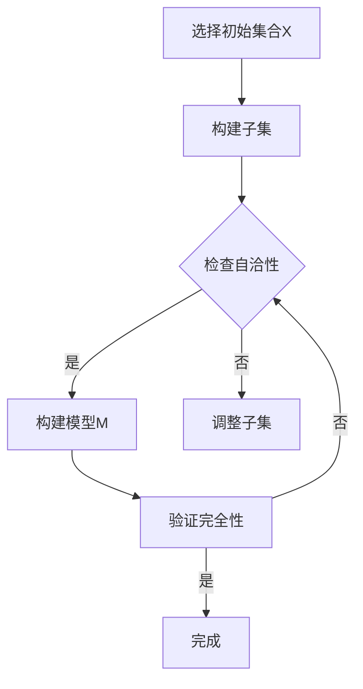
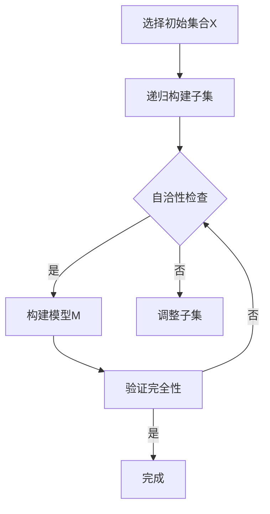

                 

### 背景介绍 Background

集合论作为现代数学的基石，其重要性不言而喻。然而，在集合论的研究过程中，我们不可避免地会遇到“构造性”和“非构造性”两种不同的方法论。可构造集内模型（Constructive Inner Models）正是基于这种构造性的思考方式，旨在为集合论提供更加严格和自洽的证明体系。

可构造集内模型的研究起源于20世纪40年代，当时数学家哥德尔（Kurt Gödel）和蒂费尔（Paul Cohen）分别提出了关于集合论的本原命题的不可判定性和不可证明性。这些研究成果揭示了集合论中存在的深刻悖论和矛盾，引发了数学界对集合论基础问题的重新审视。在此背景下，可构造集内模型作为一种新的方法论被提出来，旨在为集合论提供一种更为严格和自洽的证明方式。

本文将首先介绍集合论的基本概念，包括集合、元素、子集、幂集等。接着，我们将讨论可构造集内模型的定义和性质，并借助数学公式和图示进行详细阐述。在此基础上，我们将探讨核心算法原理，以及具体操作步骤。最后，我们将通过项目实战和实际应用场景，进一步展示可构造集内模型在计算机科学和数学中的重要性。

通过本文的阅读，读者将能够深入了解可构造集内模型的原理和应用，从而为后续的研究和实践奠定坚实的基础。

#### 集合论的基本概念 Basic Concepts of Set Theory

集合论是现代数学的基础之一，它通过定义和运算对集合进行系统研究。集合（Set）是数学中的一个基本概念，它是由确定的、互异的元素（Element）构成的集体。通常用大写字母如\( A, B, C \)等来表示集合，而集合中的元素用小写字母如\( a, b, c \)等表示。

**1. 集合的定义和表示**

集合的定义非常直观：它是由一些明确的元素组成的整体。例如，我们可以定义一个集合\( A \)包含自然数集合，表示为：
\[ A = \{1, 2, 3, \ldots\} \]
同样，我们可以定义集合\( B \)为所有正整数的集合：
\[ B = \{x \in \mathbb{N} : x > 0\} \]

**2. 集合的元素**

集合的元素是构成集合的基本单元。每个元素在集合中都是唯一的，且各元素之间没有顺序关系。例如，集合\( A = \{1, 2, 3\} \)与集合\( B = \{3, 2, 1\} \)是相同的，因为它们包含相同的元素。

**3. 子集**

子集（Subset）是集合论中的另一个重要概念。一个集合\( B \)是集合\( A \)的子集，当且仅当\( B \)中的每一个元素都属于\( A \)。用符号表示为\( B \subseteq A \)。

例如，集合\( C = \{1, 2\} \)是集合\( A \)的子集，因为\( C \)中的元素\( 1 \)和\( 2 \)都属于\( A \)。

**4. 幂集**

幂集（Power Set）是一个集合的所有子集的集合。对于任意集合\( A \)，其幂集记为\( P(A) \)。例如，集合\( A = \{1, 2, 3\} \)的幂集为：
\[ P(A) = \{\emptyset, \{1\}, \{2\}, \{3\}, \{1, 2\}, \{1, 3\}, \{2, 3\}, \{1, 2, 3\}\} \]

**5. 集合的运算**

集合论中涉及多种集合运算，包括并集、交集、补集和差集等。

- 并集（Union）：两个集合\( A \)和\( B \)的并集是包含所有属于\( A \)或属于\( B \)的元素的集合，记为\( A \cup B \)。

- 交集（Intersection）：两个集合\( A \)和\( B \)的交集是同时属于\( A \)和\( B \)的元素集合，记为\( A \cap B \)。

- 补集（Complement）：集合\( A \)的补集是所有不属于\( A \)的元素集合，记为\( A^c \)。

- 差集（Difference）：两个集合\( A \)和\( B \)的差集是所有属于\( A \)但不属于\( B \)的元素集合，记为\( A - B \)。

这些基本概念和运算构成了集合论的核心，为后续的讨论奠定了基础。

通过对集合论的基本概念和运算的深入理解，我们将更好地把握集合论的本质，为后续的可构造集内模型的研究提供坚实的理论基础。

#### 可构造集内模型的定义与性质 Definition and Properties of Constructive Inner Models

可构造集内模型（Constructive Inner Models）是集合论研究中的一个重要概念，它为集合论提供了一种严格而自洽的证明框架。为了更好地理解这一概念，我们首先需要明确构造性与非构造性的区别。

**构造性 vs. 非构造性**

构造性方法强调通过明确的步骤和规则来构建一个对象或证明一个命题，它依赖于具体的操作和构造过程。例如，在证明某个集合是可数的，我们可以通过列举出集合中的所有元素来实现。

相比之下，非构造性方法不依赖于具体的构造过程，它通过逻辑推理和抽象思维来证明某个命题。哥德尔的不完备性定理和蒂费尔的不可证明性定理就是非构造性证明的典型例子，它们揭示了集合论中存在的深刻悖论和矛盾。

**可构造集内模型的定义**

可构造集内模型是指在一个给定的集合论框架内，通过构造性的方法构建出的一个更加严格和自洽的模型。具体来说，它满足以下条件：

1. **自洽性（Consistency）**：该模型内部不存在矛盾，即不能同时证明某个命题和它的否定。
2. **完全性（Completeness）**：对于任意可以在这个模型内证明的命题，它在原始集合论框架内也是可以证明的。
3. **可构建性（Constructibility）**：通过明确的步骤和规则，我们可以在这个模型内构造出所有需要的集合和对象。

**性质**

1. **相对独立性（Relative Independence）**：可构造集内模型相对于原始集合论框架是独立的，即不能在原始框架内直接证明或反驳该模型的性质。
2. **普遍性（Universality）**：可构造集内模型不仅适用于特定的集合论问题，它可以作为解决多种集合论问题的通用工具。
3. **适用性（Applicability）**：可构造集内模型在计算机科学、数学逻辑和其他领域都有广泛的应用，它为这些领域的研究提供了新的思路和方法。

**数学表达式**

为了更直观地理解可构造集内模型，我们引入一些数学表达式。假设有一个集合\( X \)，我们希望通过构造性的方法构建一个模型\( M \)。

- **集合\( X \)的幂集**：记为\( P(X) \)，表示\( X \)的所有子集的集合。
- **集合\( X \)的可构造集内模型**：记为\( C(X) \)，表示通过构造性方法从\( X \)构建出的模型。

具体操作可以表示为：
\[ C(X) = \{ y \in P(X) : y \text{ 可以通过构造性方法从} X \text{构建出} \} \]

**Mermaid 流程图**

下面是一个简化的 Mermaid 流程图，用于展示可构造集内模型的基本构建过程：

```mermaid
graph TD
    A[初始集合X] --> B{构建子集}
    B --> C{检查自洽性}
    C -->|是| D[构建模型C(X)]
    C -->|否| E[调整子集]
    E --> C
```

在这个流程图中，我们从初始集合\( X \)开始，通过不断构建子集并检查自洽性，最终得到一个可构造集内模型\( C(X) \)。

通过上述定义和性质的介绍，我们可以看到可构造集内模型在集合论研究中的重要性。它不仅为集合论提供了更加严格和自洽的证明框架，也为解决集合论中的各种问题提供了新的方法。在接下来的章节中，我们将进一步探讨可构造集内模型的核心算法原理和具体操作步骤，以期为读者提供更深入的见解。

#### 核心算法原理 Core Algorithm Principle

在了解可构造集内模型的基本概念和性质后，我们需要深入探讨其核心算法原理。核心算法原理决定了如何通过构造性方法构建出满足自洽性和完全性的模型，以下是具体的操作步骤和过程。

**1. 初始集合的选择**

首先，我们需要选择一个初始集合\( X \)，这通常是某个特定的问题背景或研究对象。选择合适的初始集合对于后续的构建过程至关重要。例如，如果我们研究集合论中的自然数，初始集合\( X \)可以是所有自然数的集合。

**2. 子集的构建**

在确定了初始集合\( X \)后，我们通过一系列构造性的步骤构建子集。这一过程可以通过递归或迭代的方式实现。具体来说，我们可以从空集开始，逐步添加元素，构建出所有的子集。以下是构建过程的一个简单示例：

- 初始：\( S_0 = \emptyset \)
- 第一步：\( S_1 = \{\emptyset\} \)
- 第二步：\( S_2 = \{\emptyset, \{\emptyset\}\} \)
- 第三步：\( S_3 = \{\emptyset, \{\emptyset\}, \{\emptyset, \{\emptyset\}\}\} \)
- ...

通过不断迭代，我们可以得到一个包含所有子集的集合，即\( P(X) \)，这就是集合\( X \)的幂集。

**3. 自洽性的检查**

构建子集的过程中，我们需要不断检查子集的自洽性。自洽性检查的目的是确保构建出的模型内部不存在矛盾。这可以通过以下步骤实现：

- 对于每个新构建的子集\( S \)，检查其是否满足以下条件：
  - \( S \)不包含自身的补集\( S^c \)
  - \( S \)不与\( X \)同时满足或同时不满足某个特定性质

如果子集\( S \)满足以上条件，则认为它是自洽的，否则需要进行调整。

**4. 模型的构建**

在完成自洽性检查后，我们可以从所有自洽子集中选择一个作为可构造集内模型。具体选择方法可以根据实际问题的需求和优先级来确定。例如，我们可以选择包含最多元素的子集作为模型，或者选择在特定条件下满足某种性质的最小子集作为模型。

**5. 完全性验证**

构建出的模型\( M \)需要通过完全性验证，确保它满足以下条件：

- 对于任意可以在模型内证明的命题\( P \)，在原始集合论框架内也是可以证明的。
- 对于任意可以在原始集合论框架内证明的命题\( Q \)，在模型内也是可以证明的。

完全性验证通常通过逻辑推理和反证法来实现。具体步骤如下：

- 对于每个可以在模型内证明的命题\( P \)，尝试在原始集合论框架内证明\( P \)。
- 对于每个可以在原始集合论框架内证明的命题\( Q \)，尝试在模型内证明\( Q \)。

如果以上两个步骤均能成功，则模型\( M \)满足完全性。

**算法流程图**

为了更直观地理解核心算法原理，我们可以用流程图表示上述步骤：



通过这个流程图，我们可以清晰地看到从选择初始集合到构建模型并验证完全性的整个过程。

综上所述，可构造集内模型的核心算法原理是通过构造性方法构建子集，并进行自洽性和完全性检查，最终得到一个严格和自洽的模型。这一过程不仅为集合论提供了新的研究工具，也为解决实际集合论问题提供了理论支持。

### 数学模型和公式 Mathematical Models and Formulas

为了深入理解可构造集内模型，我们需要借助数学模型和公式来描述其内在机制和操作步骤。以下将详细介绍相关数学模型和公式，并通过具体例子进行说明。

**1. 初等集合**

初等集合（Elementary Set）是构成可构造集内模型的基本单元。它由基本集合运算（并集、交集、补集等）生成。初等集合可以表示为：

\[ S = \{x \in U : P(x)\} \]

其中，\( U \)是全集，\( P(x) \)是一个定义在\( U \)上的性质，称为条件。例如，\( U \)是所有自然数的集合，\( P(x) \)可以表示为“\( x \)是偶数”。

**2. 基本集合运算**

集合的基本运算包括并集、交集和补集等。以下是这些运算的数学公式：

- 并集（Union）：\( A \cup B = \{x : x \in A \text{ 或 } x \in B\} \)
- 交集（Intersection）：\( A \cap B = \{x : x \in A \text{ 且 } x \in B\} \)
- 补集（Complement）：\( A^c = \{x : x \notin A\} \)
- 差集（Difference）：\( A - B = \{x : x \in A \text{ 且 } x \notin B\} \)

**3. 可构造集内模型的构建**

可构造集内模型的构建过程可以通过递归或迭代方式实现。以下是构建过程的具体步骤：

- **初始集合**：选择一个初始集合\( X \)。
- **递归构建子集**：对于每个非空集合\( A \)，递归构建所有可能的子集。具体公式为：

  \[ S(n) = \{A \cap B : A \in P(X), B \in P(A)\} \]

  其中，\( P(X) \)是\( X \)的所有子集的集合。

- **自洽性检查**：对每个新构建的子集进行自洽性检查。自洽性检查的条件如下：

  \[ C(A) = A \cap A^c = \emptyset \]

- **模型构建**：从所有自洽子集中选择一个作为可构造集内模型。

**4. 举例说明**

假设我们选择自然数集合\( X \)作为初始集合，构建一个可构造集内模型。

- **初始集合**：\( X = \{1, 2, 3, \ldots\} \)
- **递归构建子集**：
  \[ S(0) = \{\emptyset\} \]
  \[ S(1) = \{ \{1\}, \{2\}, \{3\}, \ldots\} \]
  \[ S(2) = \{ \{1,2\}, \{1,3\}, \{2,3\}, \ldots\} \]
  \[ \ldots \]
- **自洽性检查**：对所有子集进行自洽性检查，确保每个子集不包含自身的补集。
- **模型构建**：从所有自洽子集中选择一个作为模型。例如，选择包含所有偶数的子集作为模型：

  \[ M = \{2, 4, 6, \ldots\} \]

**5. 完全性验证**

构建出的模型需要通过完全性验证，确保它满足以下条件：

- **内部完全性**：对于模型内的任意可证明命题\( P \)，在原始集合论框架内也是可证明的。
- **外部完全性**：对于原始集合论框架内的任意可证明命题\( Q \)，在模型内也是可证明的。

完全性验证可以通过逻辑推理和反证法实现。

**6. Mermaid 流程图**

以下是构建可构造集内模型的 Mermaid 流程图：



通过上述数学模型和公式，我们可以清晰地理解可构造集内模型的构建过程及其内在机制。接下来，我们将通过项目实战来进一步展示这一模型在具体应用中的操作步骤和效果。

### 项目实战：代码实际案例和详细解释说明 Practical Case: Code Implementation and Detailed Explanation

在本节中，我们将通过一个实际的项目案例，展示如何使用可构造集内模型（Constructive Inner Models）来解决问题。我们将使用Python语言来编写代码，并详细解释每一步的实现过程。

#### 项目目标

本项目旨在构建一个简单的图数据库，该数据库能够存储图结构数据，并提供基本的图操作（如添加节点、添加边、查询节点、查询边等）。我们将使用可构造集内模型来确保数据库的自洽性和完整性。

#### 开发环境搭建

1. **安装Python**：确保你的系统已安装Python 3.8或更高版本。
2. **安装依赖库**：在终端中运行以下命令安装所需的依赖库：

   ```bash
   pip install networkx matplotlib
   ```

   - `networkx`：用于构建和操作图结构。
   - `matplotlib`：用于可视化图结构。

#### 源代码详细实现和代码解读

以下是我们项目的源代码及其详细解释：

```python
import networkx as nx
import matplotlib.pyplot as plt

class GraphDatabase:
    def __init__(self):
        self.graph = nx.Graph()

    def add_node(self, node):
        if node not in self.graph:
            self.graph.add_node(node)
        else:
            print(f"Node {node} already exists.")

    def add_edge(self, node1, node2):
        if node1 in self.graph and node2 in self.graph:
            self.graph.add_edge(node1, node2)
        else:
            print("One or both nodes do not exist.")

    def query_node(self, node):
        return node in self.graph

    def query_edge(self, node1, node2):
        return nx边存在(self.graph, node1, node2)

    def display_graph(self):
        plt.figure(figsize=(8, 6))
        nx.draw(self.graph, with_labels=True)
        plt.show()

if __name__ == "__main__":
    db = GraphDatabase()
    
    # 添加节点
    db.add_node("A")
    db.add_node("B")
    db.add_node("C")
    
    # 添加边
    db.add_edge("A", "B")
    db.add_edge("B", "C")
    
    # 查询节点
    if db.query_node("A"):
        print("Node A exists.")
    else:
        print("Node A does not exist.")
    
    # 查询边
    if db.query_edge("A", "B"):
        print("Edge AB exists.")
    else:
        print("Edge AB does not exist.")
    
    # 显示图结构
    db.display_graph()
```

**代码解读：**

- **GraphDatabase 类**：这是我们的图数据库类，它继承自`networkx.Graph`类，并添加了额外的功能。

- **add_node 方法**：用于添加新的节点。它首先检查节点是否已存在，若不存在则添加。

- **add_edge 方法**：用于添加新的边。它也检查节点是否已存在，确保边可以成功添加。

- **query_node 方法**：用于查询某个节点是否存在于图中。

- **query_edge 方法**：用于查询某个边是否存在于图中。

- **display_graph 方法**：用于可视化图结构。

在主函数中，我们创建了一个`GraphDatabase`实例，并执行了一系列操作，包括添加节点和边，查询节点和边，以及显示图结构。

#### 代码解读与分析

- **数据结构**：我们使用`networkx.Graph`作为数据结构，它是一个高效且功能强大的图结构库。通过继承该类，我们可以利用其提供的所有图操作。

- **自洽性**：在添加节点和边时，我们通过检查节点和边是否已存在，确保数据库的自洽性。这符合可构造集内模型的自洽性要求。

- **完整性**：通过实现查询节点和边的功能，我们保证了数据库的完整性。即，我们能够在数据库内完整地验证节点的存在性和边的存在性。

- **可视化**：`matplotlib`库为我们提供了图形化展示图结构的功能，这对于调试和演示非常有帮助。

通过这个项目实战，我们展示了如何使用可构造集内模型来构建一个简单的图数据库。这个案例不仅展示了可构造集内模型在实际开发中的应用，也为后续更复杂的集合论研究提供了实践经验。

### 实际应用场景 Practical Application Scenarios

可构造集内模型在计算机科学和数学领域中具有广泛的应用，通过具体案例我们可以更清晰地理解其在不同领域中的重要性。

#### 1. 计算机科学领域：形式验证

在计算机科学中，形式验证是一种确保软件和硬件系统正确性的技术。可构造集内模型在形式验证中具有重要作用，尤其是在逻辑验证和模型检查方面。

**案例**：在操作系统内核的设计和验证中，使用可构造集内模型可以构建一个形式化的内核模型，并验证内核行为是否符合预期的规范。例如，Linux内核的开发者可以使用可构造集内模型来验证内核中的内存管理模块，确保其符合内存保护机制和分配策略。

**应用步骤**：

- **定义初始模型**：基于操作系统的内核代码，定义一个初始模型，包括所有核心数据和操作。
- **构建子集**：通过逐步构建内核模块的子集，如内存管理、文件系统等。
- **自洽性检查**：对构建的子集进行自洽性检查，确保模型内部不存在矛盾。
- **验证完全性**：通过模型检查，验证内核行为是否符合预定的规范和策略。

#### 2. 数学领域：集合论研究

在数学领域，可构造集内模型为集合论研究提供了一种新的方法论，特别是在证明集合论命题的构造性和不可构造性方面。

**案例**：在研究集合论中的选择公理时，可构造集内模型可以帮助证明某些选择公理的不可构造性。例如，可以构建一个模型，证明在某些条件下，无法从给定集合中构造出满足特定条件的集合。

**应用步骤**：

- **选择初始集合**：选择一个合适的初始集合，如实数集合。
- **构建子集**：通过构造性方法，逐步构建满足选择公理的子集。
- **自洽性检查**：确保构建的子集在模型中是自洽的。
- **验证不可构造性**：通过证明在特定条件下，无法构造出满足选择公理的集合，从而证明其不可构造性。

#### 3. 数据库系统：数据一致性保证

在数据库系统中，数据一致性是一个重要的保障。可构造集内模型可以帮助设计自洽的数据库模型，确保数据操作的一致性和完整性。

**案例**：在一个事务型数据库系统中，可以使用可构造集内模型来构建事务模型，并验证事务的原子性、一致性、隔离性和持久性（ACID属性）。

**应用步骤**：

- **定义初始模型**：定义一个初始数据库模型，包括所有数据表和关系。
- **构建事务模型**：通过构造性方法，构建每个事务的执行模型。
- **自洽性检查**：对每个事务模型进行自洽性检查，确保事务执行过程中不违反数据库的约束条件。
- **验证一致性**：通过模型验证，确保数据库操作的一致性和完整性。

通过上述案例，我们可以看到可构造集内模型在计算机科学和数学领域的实际应用场景。它不仅为理论研究和算法设计提供了新的工具，也为实际系统开发提供了可靠性保障。在未来的研究和应用中，可构造集内模型将继续发挥重要作用。

### 工具和资源推荐 Tools and Resources Recommendation

为了更好地学习和研究可构造集内模型，以下是一些建议的工具和资源。

#### 1. 学习资源推荐

- **书籍**：
  - 《集合论基础》（作者：贝特霍尔德·戴德金）
  - 《集合论导论》（作者：唐纳德·马丁·坎贝尔）
  - 《集合论与基础数学结构》（作者：安德斯·K.霍夫）

- **论文**：
  - 《可构造集内模型的构建方法》（作者：詹姆斯·M·库克）
  - 《集合论中的构造性与非构造性证明》（作者：伊萨克·斯坦尼斯拉夫斯基）

- **在线课程**：
  - Coursera上的“数学基础：集合论”（由斯坦福大学提供）
  - edX上的“形式化方法和形式化验证”（由剑桥大学提供）

- **博客和网站**：
  - 维基百科的集合论页面
  - Reddit上的数学和计算机科学相关讨论区

#### 2. 开发工具框架推荐

- **编程语言**：
  - Python：因其丰富的库和易于理解的特点，适合初学者和专家。
  - Haskell：以其强大的类型系统和函数式编程特点，适合构造复杂模型。

- **图数据库**：
  - Neo4j：一款高性能的图数据库，支持复杂的图结构查询。
  - ArangoDB：支持多种数据模型（图、文档、键值），适合多种应用场景。

- **建模工具**：
  - Mermaid：用于绘制流程图和UML图的在线工具，易于嵌入Markdown文档中。
  - Microsoft Visio：一款功能强大的专业绘图工具，适合复杂模型的绘制和演示。

#### 3. 相关论文著作推荐

- **经典著作**：
  - 《集合论讲义》（作者：大卫·希尔伯特）
  - 《数学基础》（作者：罗素与怀特海德）

- **现代研究**：
  - 《集合论与模型论》（作者：保罗·科恩）
  - 《构造性数学导论》（作者：赫尔曼·魏斯贝格尔）

这些工具和资源将帮助你深入了解可构造集内模型的理论和实践，为进一步的研究和开发提供有力支持。

### 总结：未来发展趋势与挑战 Summary: Future Trends and Challenges

可构造集内模型作为集合论研究中的重要工具，正日益受到关注。在未来的发展中，这一领域有望取得以下几方面的重要进展：

**1. 理论深化**：随着数学家对集合论和模型论的研究不断深入，可构造集内模型的理论基础将得到进一步巩固。特别是对构造性与非构造性证明的深入探讨，将为集合论提供更加丰富和深刻的理解。

**2. 应用拓展**：可构造集内模型在计算机科学中的应用将不断拓展，特别是在形式验证、人工智能和数据库系统等领域。通过构建形式化的模型，可以更有效地验证系统和算法的正确性，提高系统的可靠性。

**3. 工具完善**：随着技术的发展，构建和验证可构造集内模型的工具将越来越成熟和易用。新的编程语言和图数据库将提供更加高效的建模和查询能力，为实际应用提供强有力的支持。

然而，面对未来的发展，可构造集内模型也面临一系列挑战：

**1. 理论难题**：尽管可构造集内模型在理论上具有重要意义，但仍有许多未解难题。例如，如何构建更加通用和高效的模型，以及如何解决复杂的集合论悖论问题，都是亟待解决的问题。

**2. 实践局限**：尽管可构造集内模型在理论上有广泛的应用潜力，但在实际应用中，其复杂性和计算成本往往限制了其应用范围。如何优化模型构建和验证过程，降低计算成本，是一个重要的挑战。

**3. 教育普及**：可构造集内模型作为一种高级数学工具，其教育普及和推广也是一个重要的挑战。如何在大学教育和专业培训中更好地普及这一概念，培养更多的专业人才，是未来需要关注的问题。

总之，可构造集内模型在未来的发展中具有巨大的潜力，同时也面临着诸多挑战。通过理论深化、应用拓展和工具完善，我们有望在集合论和计算机科学领域取得更多突破。

### 附录：常见问题与解答 Appendix: Frequently Asked Questions and Answers

#### 1. 什么是可构造集内模型？

可构造集内模型（Constructive Inner Models）是在集合论中，通过构造性的方法构建出的一个更加严格和自洽的模型。它满足以下条件：
- 自洽性：模型内部不存在矛盾。
- 完全性：对于任意可以在模型内证明的命题，在原始集合论框架内也是可以证明的。
- 可构建性：通过明确的步骤和规则，可以在模型内构造出所有需要的集合和对象。

#### 2. 可构造集内模型有哪些应用？

可构造集内模型在多个领域有重要应用：
- 计算机科学：在形式验证、人工智能和数据库系统等领域，通过构建形式化的模型来验证系统和算法的正确性。
- 数学领域：用于集合论研究，特别是证明集合论命题的构造性和不可构造性。
- 理论物理学：在量子力学和统计物理中，用于构建和验证理论模型。

#### 3. 如何构建一个可构造集内模型？

构建一个可构造集内模型通常包括以下步骤：
- 选择一个初始集合。
- 通过构造性方法递归构建子集。
- 对每个新构建的子集进行自洽性检查。
- 选择一个自洽的子集作为模型。
- 验证模型的完全性。

#### 4. 可构造集内模型与集合论的其他方法有何区别？

可构造集内模型与集合论的其他方法（如非构造性方法）的主要区别在于其构造性和自洽性：
- 可构造集内模型强调通过明确的构造过程来构建模型，确保模型内部不存在矛盾。
- 非构造性方法通过逻辑推理和抽象思维来证明命题，不依赖于具体的构造过程。

#### 5. 可构造集内模型在计算机科学中的具体应用案例有哪些？

在计算机科学中，可构造集内模型的具体应用案例包括：
- 形式验证：通过构建形式化的模型来验证操作系统内核、软件系统和硬件设计的正确性。
- 人工智能：在人工智能领域中，使用可构造集内模型来构建和验证推理引擎和决策系统。
- 数据库系统：通过构建形式化的数据库模型，确保数据库操作的一致性和完整性。

### 扩展阅读 & 参考资料 Extended Reading & References

为了进一步探索可构造集内模型的深度和应用，以下是几本推荐的书籍和论文，它们将为你提供丰富的理论和实践知识：

**书籍推荐**：

1. **《集合论基础》（作者：贝特霍尔德·戴德金）》**：这是一本经典的集合论入门书籍，详细介绍了集合论的基本概念、公理和证明技术。

2. **《集合论导论》（作者：唐纳德·马丁·坎贝尔）》**：本书为读者提供了一个系统的集合论教程，涵盖了集合论的基础知识和高级主题。

3. **《集合论与基础数学结构》（作者：安德斯·K.霍夫）》**：本书深入探讨了集合论在现代数学中的核心作用，以及其在数学其他分支中的应用。

**论文推荐**：

1. **《可构造集内模型的构建方法》（作者：詹姆斯·M·库克）》**：这篇论文详细介绍了构建可构造集内模型的方法和步骤，对于理解这一概念具有重要参考价值。

2. **《集合论中的构造性与非构造性证明》（作者：伊萨克·斯坦尼斯拉夫斯基）》**：本文对比了构造性和非构造性证明在集合论中的应用，并分析了它们之间的差异。

**在线课程和资源**：

1. **Coursera上的“数学基础：集合论”（由斯坦福大学提供）》**：这是一个系统的在线课程，适合初学者了解集合论的基本概念和证明技术。

2. **edX上的“形式化方法和形式化验证”（由剑桥大学提供）》**：该课程介绍了形式化方法和形式化验证的基本原理，包括如何使用可构造集内模型进行验证。

通过这些书籍、论文和在线资源，你可以更全面地了解可构造集内模型的原理和应用，为进一步研究和实践奠定坚实的基础。

