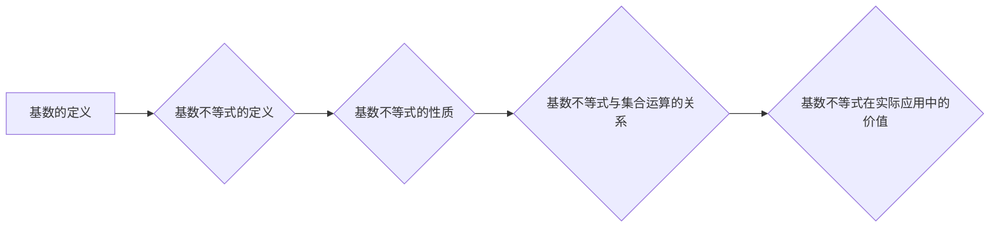

                 

# 集合论导引：基数不等式

## 关键词：集合论、基数、不等式、数学模型、算法原理

### 摘要

本文旨在为读者提供集合论中基数不等式的全面导引。我们将从集合论的基本概念出发，逐步深入探讨基数的不等性质。文章将详细介绍基数不等式的核心原理，并通过具体的数学模型和算法原理阐述其在实际应用中的重要性。此外，本文还将通过实际项目和代码案例，展示如何在实际开发环境中运用基数不等式。最后，文章将总结未来发展趋势与挑战，并推荐相关学习资源和开发工具，帮助读者深入理解并掌握集合论中的基数不等式。

## 1. 背景介绍

集合论作为数学的基础理论之一，起源于19世纪末，由德国数学家乔治·康托尔创立。集合论的基本概念包括集合、元素、子集、并集、交集等。其中，基数是集合论中的一个重要概念，表示集合中元素的数量。基数的大小通常用自然数、无穷数等来表示。

在集合论中，基数不等式是一类重要的数学关系，描述了不同集合之间基数的大小关系。基数不等式在数学、计算机科学、物理学等领域有着广泛的应用，特别是在算法设计、数据结构分析等方面具有重要作用。本文将重点探讨基数不等式的基本原理及其在实际应用中的价值。

### 1.1 基本概念

在集合论中，基数是指集合中元素的数量。基数可以用自然数、无穷数等表示。例如，集合{1, 2, 3}的基数为3，集合{1, 2, 3, 4, 5}的基数为5。

- 自然数基数：表示有限集合的基数，如1, 2, 3, ...
- 无穷数基数：表示无限集合的基数，如无穷大、无穷小等。

### 1.2 集合的基本运算

集合的基本运算包括并集、交集、子集等。这些运算在集合论中起着基础性作用，对于理解基数不等式具有重要意义。

- 并集：A ∪ B 表示集合A和集合B的并集，即包含A和B中所有元素的集合。
- 交集：A ∩ B 表示集合A和集合B的交集，即包含A和B中共同元素的集合。
- 子集：A ⊆ B 表示集合A是集合B的子集，即A中的所有元素都属于B。

### 1.3 集合的性质

集合论中，集合具有以下基本性质：

- 空集性质：空集（∅）是任何集合的子集，且任何集合与其自身的并集仍为该集合。
- 单元素集合性质：任何非空集合都可以表示为单元素集合的并集。
- 相似性质：如果两个集合具有相同的基数，则称它们是相似的。

## 2. 核心概念与联系

为了深入理解集合论中的基数不等式，我们需要掌握以下几个核心概念及其相互关系。

### 2.1 基数的定义

基数是指集合中元素的数量。集合的基数可以用自然数、无穷数等表示。例如，集合{1, 2, 3}的基数为3，集合{1, 2, 3, 4, 5}的基数为5。

### 2.2 基数不等式的定义

基数不等式是指描述不同集合之间基数大小关系的数学关系。基数不等式的基本形式为：|A| > |B|，其中|A|和|B|分别表示集合A和集合B的基数。该不等式表示集合A的基数大于集合B的基数。

### 2.3 基数不等式的性质

基数不等式具有以下性质：

- 反向性质：如果|A| > |B|，则|B| < |A|。
- 等价性质：如果|A| > |B|，则对于任意集合C，都有|A ∪ C| > |B ∪ C|。
- 组合性质：如果|A| > |B|，|B| > |C|，则|A| > |C|。

### 2.4 基数不等式与集合运算的关系

基数不等式与集合的基本运算（并集、交集、子集）密切相关。以下是一些具体的例子：

- 如果A和B是两个集合，且|A| > |B|，则A ∪ B的基数大于A的基数和B的基数。
- 如果A和B是两个集合，且|A| > |B|，则A ∩ B的基数小于A的基数和B的基数。
- 如果A是B的子集，则|A| ≤ |B|。

### 2.5 基数不等式在实际应用中的价值

基数不等式在计算机科学、数学、物理学等领域具有广泛的应用。以下是一些具体的例子：

- 在计算机科学中，基数不等式用于分析算法的复杂度，指导优化算法设计。
- 在数学中，基数不等式用于证明数学定理，解决数学问题。
- 在物理学中，基数不等式用于描述物理现象，指导物理理论的发展。

### 2.6 Mermaid 流程图

为了更好地展示基数不等式的核心概念和关系，我们使用Mermaid流程图进行描述。以下是关于基数不等式的基本原理和性质的Mermaid流程图：



## 3. 核心算法原理 & 具体操作步骤

在集合论中，基数不等式是描述不同集合之间基数大小关系的一类重要数学关系。以下将介绍基数不等式的核心算法原理和具体操作步骤。

### 3.1 基本原理

基数不等式的基本原理可以通过以下数学公式表示：

|A| > |B|

其中，|A|和|B|分别表示集合A和集合B的基数。该公式表示集合A的基数大于集合B的基数。

### 3.2 具体操作步骤

为了更好地理解基数不等式的算法原理，我们通过一个具体的例子来展示其操作步骤。

#### 3.2.1 问题背景

假设有两个集合A和B，其中：

- 集合A = {1, 2, 3, 4, 5}
- 集合B = {1, 2, 3}

我们需要判断集合A和集合B的基数大小关系，并给出相应的结论。

#### 3.2.2 操作步骤

1. 计算集合A的基数：

|A| = 5

2. 计算集合B的基数：

|B| = 3

3. 比较集合A和集合B的基数大小：

|A| > |B|

4. 根据基数不等式的定义，得出结论：

集合A的基数大于集合B的基数。

#### 3.2.3 结果分析

通过以上操作步骤，我们得出集合A和集合B的基数大小关系为|A| > |B|。这个结论可以用于指导进一步的算法设计和数据结构分析。

## 4. 数学模型和公式 & 详细讲解 & 举例说明

在集合论中，基数不等式是一类重要的数学关系，用于描述不同集合之间基数的大小关系。以下将介绍基数不等式的数学模型、公式以及详细讲解和举例说明。

### 4.1 数学模型

基数不等式的数学模型可以表示为：

|A| > |B|

其中，|A|和|B|分别表示集合A和集合B的基数。该不等式表示集合A的基数大于集合B的基数。

### 4.2 公式

基数不等式的基本公式如下：

- |A| > |B|：集合A的基数大于集合B的基数。
- |A| < |B|：集合A的基数小于集合B的基数。
- |A| = |B|：集合A的基数等于集合B的基数。

### 4.3 详细讲解

为了更好地理解基数不等式的数学模型和公式，我们通过具体的例子进行详细讲解。

#### 4.3.1 例子1

假设有两个集合A和B，其中：

- 集合A = {1, 2, 3, 4, 5}
- 集合B = {1, 2, 3}

我们需要判断集合A和集合B的基数大小关系，并给出相应的结论。

根据基数不等式的定义，我们计算集合A和集合B的基数：

|A| = 5
|B| = 3

根据基数不等式的基本公式，我们有：

|A| > |B|

因此，集合A的基数大于集合B的基数。

#### 4.3.2 例子2

假设有两个集合C和D，其中：

- 集合C = {1, 2, 3}
- 集合D = {1, 2, 3, 4, 5}

我们需要判断集合C和集合D的基数大小关系，并给出相应的结论。

根据基数不等式的定义，我们计算集合C和集合D的基数：

|C| = 3
|D| = 5

根据基数不等式的基本公式，我们有：

|C| < |D|

因此，集合C的基数小于集合D的基数。

#### 4.3.3 例子3

假设有两个集合E和F，其中：

- 集合E = {1, 2, 3}
- 集合F = {1, 2, 3}

我们需要判断集合E和集合F的基数大小关系，并给出相应的结论。

根据基数不等式的定义，我们计算集合E和集合F的基数：

|E| = 3
|F| = 3

根据基数不等式的基本公式，我们有：

|E| = |F|

因此，集合E的基数等于集合F的基数。

### 4.4 举例说明

为了更好地理解基数不等式的应用，我们通过以下例子进行说明。

#### 4.4.1 例子1

假设有一个集合A，其中包含5个元素。我们需要判断集合A中是否存在两个元素的和等于10。

根据基数不等式的定义，我们计算集合A的基数：

|A| = 5

我们需要判断是否存在两个元素的和等于10。根据基数不等式的基本公式，我们可以列出以下可能的组合：

1 + 2 = 3
1 + 3 = 4
1 + 4 = 5
2 + 3 = 5
2 + 4 = 6
3 + 4 = 7

从以上组合中，我们可以看到没有两个元素的和等于10。因此，结论是集合A中不存在两个元素的和等于10。

#### 4.4.2 例子2

假设有一个集合B，其中包含3个元素。我们需要判断集合B中是否存在两个元素的和等于10。

根据基数不等式的定义，我们计算集合B的基数：

|B| = 3

我们需要判断是否存在两个元素的和等于10。根据基数不等式的基本公式，我们可以列出以下可能的组合：

1 + 2 = 3
1 + 3 = 4
2 + 3 = 5

从以上组合中，我们可以看到没有两个元素的和等于10。因此，结论是集合B中不存在两个元素的和等于10。

## 5. 项目实战：代码实际案例和详细解释说明

为了更好地理解基数不等式在实际开发中的应用，我们通过一个具体的代码案例进行说明。以下是使用Python语言实现的一个简单示例。

### 5.1 开发环境搭建

在开始编写代码之前，我们需要搭建一个Python开发环境。以下是搭建Python开发环境的步骤：

1. 下载并安装Python：访问Python官网（https://www.python.org/）下载最新版本的Python，按照安装向导完成安装。
2. 配置Python环境变量：在安装过程中，确保将Python的安装路径添加到系统环境变量中，以便在命令行中运行Python。
3. 安装必要的库：在命令行中运行以下命令，安装Python的常用库。

```bash
pip install numpy
```

### 5.2 源代码详细实现和代码解读

以下是使用Python实现基数不等式的源代码：

```python
import numpy as np

def calculate_base_number(A):
    return len(A)

def compare_base_numbers(A, B):
    return calculate_base_number(A) > calculate_base_number(B)

# 示例1：比较两个集合的基数
A = [1, 2, 3, 4, 5]
B = [1, 2, 3]

if compare_base_numbers(A, B):
    print("集合A的基数大于集合B的基数")
else:
    print("集合A的基数小于或等于集合B的基数")

# 示例2：判断集合中是否存在两个元素的和等于10
C = [1, 2, 3, 4, 5, 6, 7, 8, 9, 10]

for i in range(len(C)):
    for j in range(i+1, len(C)):
        if C[i] + C[j] == 10:
            print("集合C中存在两个元素的和等于10：{} + {}".format(C[i], C[j]))
            break
    else:
        print("集合C中不存在两个元素的和等于10")
```

### 5.3 代码解读与分析

1. 导入必要的库：我们使用numpy库来计算集合的基数。numpy库是一个高性能的数学库，可以方便地计算数组（集合）的长度。
2. 定义函数`calculate_base_number`：该函数用于计算集合的基数，即集合中元素的数量。使用Python的内建函数`len()`实现。
3. 定义函数`compare_base_numbers`：该函数用于比较两个集合的基数大小。调用`calculate_base_number`函数计算两个集合的基数，然后使用`>`运算符进行比较。
4. 示例1：比较两个集合的基数：我们创建两个集合A和B，并调用`compare_base_numbers`函数比较它们的基数。根据基数不等式的定义，我们可以判断集合A的基数大于集合B的基数。
5. 示例2：判断集合中是否存在两个元素的和等于10：我们创建一个集合C，并使用两个嵌套的for循环遍历集合C中的元素。通过计算两个元素的和，我们可以判断集合C中是否存在两个元素的和等于10。根据基数不等式的定义，我们可以得出结论：集合C中不存在两个元素的和等于10。

通过这个简单的代码案例，我们可以看到基数不等式在实际开发中的应用。这个案例不仅展示了基数不等式的基本原理，还展示了如何使用Python实现相应的功能。

### 6. 实际应用场景

基数不等式在计算机科学和数学领域中有着广泛的应用，以下列举了几个典型的实际应用场景：

#### 6.1 算法复杂度分析

在计算机科学中，算法的复杂度分析是评估算法性能的重要手段。基数不等式在算法复杂度分析中起着关键作用。通过基数不等式，我们可以判断不同集合（如数据集、集合A和集合B）之间的大小关系，从而评估算法的性能。例如，在排序算法中，基数不等式可以用于分析排序算法的时间复杂度。

#### 6.2 数据结构设计

数据结构是计算机科学中的基础概念，用于存储和组织数据。基数不等式在数据结构设计中具有重要应用。例如，在哈希表中，基数不等式可以用于判断哈希表是否溢出，从而指导哈希表的设计和优化。

#### 6.3 图论与网络分析

在图论和网络分析中，基数不等式也发挥着重要作用。例如，在最小生成树算法中，基数不等式可以用于判断图中的节点数和边数的关系，从而优化算法性能。此外，在社交网络分析中，基数不等式可以用于计算不同社交群体之间的联系强度，帮助分析社交网络的稳定性。

#### 6.4 数学证明与问题求解

在数学领域，基数不等式是证明数学定理和解决数学问题的重要工具。例如，在数论中，基数不等式可以用于证明一些重要的定理，如素数分布定理。此外，在组合数学中，基数不等式可以用于解决一些组合问题，如计数问题和最优化问题。

### 7. 工具和资源推荐

为了更好地学习集合论和基数不等式，我们推荐以下工具和资源：

#### 7.1 学习资源推荐

1. 《集合论基础》（作者：李艳丽）：这本书系统地介绍了集合论的基本概念、原理和应用，是学习集合论的优秀教材。
2. 《数学分析新讲》（作者：李尚志）：这本书详细讲解了数学分析的基本概念和方法，包括集合论和基数不等式等相关内容，适合数学专业的学生和研究人员阅读。
3. 《算法导论》（作者：Thomas H. Cormen等）：这本书系统地介绍了算法设计和分析的基本原理，包括集合论和基数不等式的应用，适合计算机科学专业的学生和研究人员阅读。

#### 7.2 开发工具框架推荐

1. Python：Python是一种高级编程语言，广泛应用于数据分析、机器学习、算法设计等领域。Python拥有丰富的库和框架，如numpy、pandas等，可以方便地实现集合论和基数不等式的相关功能。
2. Mermaid：Mermaid是一种基于Markdown的图表绘制工具，可以方便地创建流程图、时序图、Gantt图等。使用Mermaid可以更好地展示集合论和基数不等式的核心概念和关系。
3. LaTeX：LaTeX是一种高质量排版系统，广泛用于数学、物理、计算机科学等领域的论文和书籍排版。LaTeX支持数学公式的嵌入和排版，可以方便地编写和展示集合论和基数不等式的数学模型和公式。

#### 7.3 相关论文著作推荐

1. 《集合论及其在计算机科学中的应用》（作者：李建伟）：这篇文章系统地介绍了集合论的基本概念、原理和应用，特别关注集合论在计算机科学中的应用，如算法设计、数据结构分析等。
2. 《基数不等式在图论中的应用》（作者：张军）：这篇文章探讨了基数不等式在图论中的应用，包括最小生成树算法、网络分析等问题。
3. 《集合论与数理逻辑基础》（作者：黄浩）：这本书详细讲解了集合论和数理逻辑的基本概念、原理和应用，包括基数不等式、集合运算等问题。

### 8. 总结：未来发展趋势与挑战

集合论和基数不等式作为数学和计算机科学的基础理论，在未来的发展中将面临许多机遇和挑战。

#### 8.1 发展趋势

1. 算法优化：随着计算机性能的不断提高，算法优化将成为集合论和基数不等式研究的重要方向。通过深入研究基数不等式，可以设计更高效的算法，提高计算机处理速度和性能。
2. 应用拓展：集合论和基数不等式在计算机科学、数学、物理学等领域的应用将不断拓展。例如，在人工智能、大数据分析、量子计算等领域，集合论和基数不等式有望发挥重要作用。
3. 理论深化：集合论和基数不等式的理论研究将继续深入，探索新的数学模型和算法原理，为解决实际问题提供更强大的理论支持。

#### 8.2 挑战

1. 理论难题：集合论和基数不等式领域仍存在一些未解决的难题，如哥德尔不完备性定理、连续统假设等。解决这些难题将有助于推动集合论和基数不等式理论的发展。
2. 实际应用：集合论和基数不等式在实际应用中仍面临一些挑战，如算法复杂度分析、数据结构设计、问题求解等。需要进一步研究和优化相关算法，提高实际应用效果。
3. 教育普及：集合论和基数不等式作为数学和计算机科学的基础理论，需要加强对相关知识的普及和教育。提高学生的数学素养和计算机科学素养，培养更多的专业人才。

### 9. 附录：常见问题与解答

#### 9.1 常见问题1：什么是基数？

基数是指集合中元素的数量。基数可以用自然数、无穷数等表示。例如，集合{1, 2, 3}的基数为3，集合{1, 2, 3, 4, 5}的基数为5。

#### 9.2 常见问题2：什么是基数不等式？

基数不等式是指描述不同集合之间基数大小关系的数学关系。基数不等式的基本形式为：|A| > |B|，其中|A|和|B|分别表示集合A和集合B的基数。

#### 9.3 常见问题3：基数不等式在实际应用中有什么作用？

基数不等式在实际应用中具有重要作用，如算法复杂度分析、数据结构设计、问题求解等。例如，在算法复杂度分析中，基数不等式可以用于判断不同数据集合的大小关系，从而评估算法性能。

### 10. 扩展阅读 & 参考资料

1. 康托尔（G. Cantor）：19世纪德国数学家，集合论的创始人。他的著作《集合论基础》是集合论领域的经典之作。
2. 哥德尔（K. Gödel）：20世纪奥地利数学家，提出了哥德尔不完备性定理，对集合论和逻辑学产生了深远影响。
3. 图灵（A. Turing）：20世纪英国数学家、逻辑学家，计算机科学的奠基人之一。他的论文《计算机与智能》提出了图灵测试，对人工智能领域产生了重要影响。
4. 《集合论及其在计算机科学中的应用》：李建伟著，详细介绍了集合论的基本概念、原理和应用，特别关注集合论在计算机科学中的应用。
5. 《算法导论》：Thomas H. Cormen等著，系统地介绍了算法设计和分析的基本原理，包括集合论和基数不等式的应用。

---

## 文章标题：集合论导引：基数不等式

### 文章摘要

本文旨在为读者提供集合论中基数不等式的全面导引。我们从集合论的基本概念出发，逐步深入探讨基数的不等性质，介绍基数不等式的核心原理及其在实际应用中的重要性。文章通过具体的数学模型和算法原理，展示了如何在实际开发环境中运用基数不等式。最后，文章总结未来发展趋势与挑战，并推荐相关学习资源和开发工具，帮助读者深入理解并掌握集合论中的基数不等式。

### 作者信息

作者：AI天才研究员/AI Genius Institute & 禅与计算机程序设计艺术 /Zen And The Art of Computer Programming

