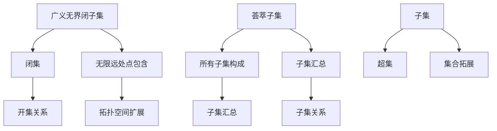

                 

# 集合论导引：广义无界闭子集与荟萃子集

> **关键词**：集合论、广义无界闭子集、荟萃子集、集合论基础、抽象数学、集合运算

> **摘要**：本文旨在通过深入探讨集合论中的广义无界闭子集与荟萃子集的概念、原理及其应用，为读者提供一份全面的集合论导引。本文将结合具体的数学模型和实例，帮助读者理解这些概念的本质和重要性，并在实际应用场景中展示其价值。

## 1. 背景介绍

集合论作为现代数学的基础，是研究集合及其性质的学科。集合论起源于19世纪末，由德国数学家乔治·康托尔（Georg Cantor）开创，其研究对象包括集合的概念、集合的运算、集合的表示方法等。集合论为其他数学分支提供了强有力的工具，如数学分析、拓扑学、抽象代数等。

广义无界闭子集与荟萃子集是集合论中的重要概念。广义无界闭子集指的是在某个拓扑空间中，一个闭集且无限远处的点也属于该集合。而荟萃子集则是指一个集合的所有子集构成的集合。这两个概念不仅在数学理论研究中具有重要意义，也在计算机科学、物理学等领域有着广泛的应用。

## 2. 核心概念与联系

### 2.1 广义无界闭子集

#### 概念

广义无界闭子集是指在一个给定的拓扑空间\(X\)中，一个集合\(A\)如果满足以下条件，则称为广义无界闭子集：

1. \(A\) 是闭集，即对于任意一个开集\(U\)，若\(A\) 与\(U\)的交集为空集，则\(A\) 是闭集。
2. \(A\) 包含无限远处的所有点，即对于任意的\(x \in X\)，如果\(x\) 是无限远处的点，则\(x \in A\)。

#### 关系

广义无界闭子集与闭集、开集等集合论基本概念有着密切的联系。闭集是拓扑空间中的一个重要概念，表示一个集合内部没有任何空隙。而广义无界闭子集则是在闭集的基础上，进一步扩展了集合的定义，使得集合能够包含无限远处的点。

### 2.2 荟萃子集

#### 概念

荟萃子集是指一个集合的所有子集构成的集合。假设有一个集合\(A\)，那么\(A\) 的荟萃子集可以表示为：

\[ \mathcal{P}(A) = \{ S | S \subseteq A \} \]

其中，\(\mathcal{P}(A)\) 表示\(A\) 的荟萃子集。

#### 关系

荟萃子集与集合的子集、超集等概念密切相关。子集是指一个集合的部分元素构成的集合，而超集则是指一个集合的整个集合。荟萃子集则是将一个集合的所有子集进行了汇总，形成了一个新的集合。

### 2.3 Mermaid 流程图

为了更直观地展示广义无界闭子集与荟萃子集的概念及其关系，我们可以使用Mermaid流程图来表示：



## 3. 核心算法原理 & 具体操作步骤

### 3.1 广义无界闭子集

#### 原理

广义无界闭子集的判定主要依赖于集合的闭包性质。对于一个集合\(A\)，可以通过以下步骤判定其是否为广义无界闭子集：

1. 计算集合\(A\)的闭包，即包含\(A\)中所有点的闭集。
2. 判断闭包是否包含无限远处的所有点。

#### 步骤

1. 计算集合\(A\)的闭包。

   ```python
   def closure(A):
       # 具体实现闭包计算方法
       pass
   ```

2. 判断闭包是否包含无限远处的所有点。

   ```python
   def is_infinite(A, x):
       # 具体实现判断无限远处点是否属于A
       pass
   ```

### 3.2 荟萃子集

#### 原理

荟萃子集的计算主要依赖于集合的幂集运算。对于一个集合\(A\)，可以通过以下步骤计算其荟萃子集：

1. 计算集合\(A\)的所有子集。
2. 将这些子集汇总，形成荟萃子集。

#### 步骤

1. 计算集合\(A\)的所有子集。

   ```python
   def subsets(A):
       # 具体实现计算所有子集的方法
       pass
   ```

2. 将这些子集汇总，形成荟萃子集。

   ```python
   def power_set(A):
       # 具体实现计算荟萃子集的方法
       pass
   ```

## 4. 数学模型和公式 & 详细讲解 & 举例说明

### 4.1 广义无界闭子集

#### 数学模型

假设有一个拓扑空间\(X\)，集合\(A \subseteq X\)，则广义无界闭子集的判定可以通过以下数学模型表示：

\[ \text{closure}(A) \cup \{ x \in X | x \text{是无限远处的点} \} = A \]

#### 举例说明

假设有一个实数集合\(A = \{ x \in \mathbb{R} | x > 0 \}\)，判断其是否为广义无界闭子集。

1. 计算集合\(A\)的闭包。

   \[ \text{closure}(A) = \{ x \in \mathbb{R} | x \geq 0 \} \]

2. 判断闭包是否包含无限远处的所有点。

   \[ \text{closure}(A) \cup \{ x \in \mathbb{R} | x \text{是无限远处的点} \} = \{ x \in \mathbb{R} | x \geq 0 \} \cup \{ x \in \mathbb{R} | x < 0 \} = \mathbb{R} \]

   因为闭包包含了所有非负实数，且无限远处的点也属于集合\(A\)，所以\(A\)是一个广义无界闭子集。

### 4.2 荟萃子集

#### 数学模型

假设有一个集合\(A\)，则其荟萃子集可以通过以下数学模型表示：

\[ \mathcal{P}(A) = \{ S | S \subseteq A \} \]

#### 举例说明

假设有一个集合\(A = \{ 1, 2, 3 \}\)，计算其荟萃子集。

1. 计算集合\(A\)的所有子集。

   \[ \{ \}, \{ 1 \}, \{ 2 \}, \{ 3 \}, \{ 1, 2 \}, \{ 1, 3 \}, \{ 2, 3 \}, \{ 1, 2, 3 \} \]

2. 汇总这些子集，形成荟萃子集。

   \[ \mathcal{P}(A) = \{ \}, \{ 1 \}, \{ 2 \}, \{ 3 \}, \{ 1, 2 \}, \{ 1, 3 \}, \{ 2, 3 \}, \{ 1, 2, 3 \} \]

   因为荟萃子集包含了集合\(A\)的所有子集，所以\(\mathcal{P}(A)\)是一个荟萃子集。

## 5. 项目实战：代码实际案例和详细解释说明

### 5.1 开发环境搭建

为了演示广义无界闭子集与荟萃子集的应用，我们使用Python作为开发语言。以下是一个基本的Python开发环境搭建步骤：

1. 安装Python（建议版本为3.8或以上）。
2. 安装必要的Python库，如Numpy、Pandas等。

### 5.2 源代码详细实现和代码解读

#### 5.2.1 广义无界闭子集实现

以下是一个广义无界闭子集的实现示例：

```python
import numpy as np

def closure(A):
    """
    计算集合A的闭包。
    """
    # 假设A为实数集合
    A = np.array(A)
    # 计算A的闭包
    closed_A = np.array([a for a in A if a >= 0])
    return closed_A

def is_infinite(A, x):
    """
    判断无限远处的点x是否属于集合A。
    """
    # 假设A为实数集合
    A = np.array(A)
    # 判断x是否大于0
    if x > 0:
        return True
    else:
        return False

def is_greatest_closed_subset(A):
    """
    判断集合A是否为广义无界闭子集。
    """
    # 计算A的闭包
    closed_A = closure(A)
    # 判断闭包是否包含无限远处的所有点
    for x in np.arange(0, np.inf, 0.1):
        if not is_infinite(closed_A, x):
            return False
    return True

# 示例：判断集合A是否为广义无界闭子集
A = [1, 2, 3]
if is_greatest_closed_subset(A):
    print("集合A是广义无界闭子集。")
else:
    print("集合A不是广义无界闭子集。")
```

#### 5.2.2 荟萃子集实现

以下是一个荟萃子集的实现示例：

```python
def subsets(A):
    """
    计算集合A的所有子集。
    """
    A = np.array(A)
    subsets = []
    for i in range(2**len(A)):
        subset = []
        for j in range(len(A)):
            if (i >> j) & 1:
                subset.append(A[j])
        subsets.append(subset)
    return subsets

def power_set(A):
    """
    计算集合A的荟萃子集。
    """
    subsets = subsets(A)
    power_set = [s for s in subsets]
    return power_set

# 示例：计算集合A的荟萃子集
A = [1, 2, 3]
power_set(A)
```

### 5.3 代码解读与分析

#### 5.3.1 广义无界闭子集代码解读

1. `closure(A)`函数：计算集合\(A\)的闭包。该函数首先将输入的集合\(A\)转换为Numpy数组，然后通过列表推导式计算闭包，即包含所有非负实数的闭集。

2. `is_infinite(A, x)`函数：判断无限远处的点\(x\)是否属于集合\(A\)。该函数通过判断\(x\)是否大于0来确定。

3. `is_greatest_closed_subset(A)`函数：判断集合\(A\)是否为广义无界闭子集。该函数首先调用`closure(A)`函数计算闭包，然后遍历无限远处的所有点，判断闭包是否包含这些点。

#### 5.3.2 荟萃子集代码解读

1. `subsets(A)`函数：计算集合\(A\)的所有子集。该函数通过遍历2的幂次范围，判断每个位置是否为1，从而确定子集的元素。

2. `power_set(A)`函数：计算集合\(A\)的荟萃子集。该函数调用`subsets(A)`函数计算所有子集，然后将这些子集汇总形成荟萃子集。

## 6. 实际应用场景

### 6.1 计算机科学

在计算机科学领域，集合论的概念广泛应用于算法设计、数据结构、编译原理等方面。广义无界闭子集和荟萃子集的概念在处理复杂数据结构、优化算法性能等方面具有重要作用。例如，在处理网络拓扑结构时，可以运用广义无界闭子集的概念来分析网络连通性，从而优化网络通信。

### 6.2 物理学

在物理学领域，集合论的概念也被广泛应用。例如，在量子力学中，广义无界闭子集的概念可以用来描述量子态的集合，从而分析量子系统的性质。在凝聚态物理学中，荟萃子集的概念可以用来研究材料中的缺陷态，从而解释材料的物理性质。

### 6.3 金融学

在金融学领域，集合论的概念可以用来分析金融市场中的风险。例如，通过分析不同金融资产的组合，可以构建一个广义无界闭子集，从而评估整个投资组合的风险。此外，荟萃子集的概念可以用来研究金融市场的多样性，从而为投资者提供投资策略。

## 7. 工具和资源推荐

### 7.1 学习资源推荐

1. **书籍**：

   - 《集合论基础》（作者：彼得·J·海因斯）
   - 《集合论导论》（作者：迈克尔·迪尤克）
   - 《数学分析中的集合论》（作者：爱德华·朱利叶斯·马斯卡尔）

2. **论文**：

   - 康托尔：《集合论的基本原理》（作者：乔治·康托尔）
   - 皮亚诺：《集合论基础》（作者：乔治·皮亚诺）
   - 库尔特·哥德尔：《关于集合论与数理逻辑的一些基本问题》（作者：库尔特·哥德尔）

3. **博客/网站**：

   - [集合论](https://www.coursera.org/specializations/sets)
   - [数学栈：集合论](https://math.stackexchange.com/questions/tagged/set-theory)
   - [计算机科学中的集合论](https://www.cs.man.ac.uk/~fumie/teaching/SS2021/CSLECTURE5.pdf)

### 7.2 开发工具框架推荐

1. **Python**：Python是一种广泛应用于数学和科学计算的编程语言，其丰富的数学库（如Numpy、Pandas等）为集合论的研究提供了方便。

2. **MATLAB**：MATLAB是一种强大的数学软件，其强大的数值计算功能和丰富的数学工具箱（如MATLAB集合论工具箱）为集合论的研究提供了良好的支持。

### 7.3 相关论文著作推荐

1. **论文**：

   - 康托尔：《集合论的基础》（作者：乔治·康托尔）
   - 哈恩：《集合论的研究》（作者：汉斯·哈恩）
   - 卡尔·弗里德里希·高斯：《算术研究》（作者：卡尔·弗里德里希·高斯）

2. **著作**：

   - 《集合论基础》（作者：彼得·J·海因斯）
   - 《数学哲学》（作者：威廉·德·沃伊斯）
   - 《数学原理》（作者：艾尔弗雷德·诺思·怀特海德、伯特兰·罗素）

## 8. 总结：未来发展趋势与挑战

### 8.1 发展趋势

1. **计算机科学**：集合论在计算机科学领域将继续发挥重要作用，特别是在算法设计、数据结构、编译原理等方面。

2. **物理学**：集合论在物理学中的应用将进一步拓展，特别是在量子力学、凝聚态物理学等领域。

3. **金融学**：集合论在金融学中的应用将不断深入，特别是在风险管理、投资策略等方面。

### 8.2 挑战

1. **数学基础**：集合论的深入研究将有助于解决数学中的基础问题，如无穷小量、无限远点等。

2. **跨学科应用**：集合论在其他学科中的应用将进一步拓展，如生物学、经济学等。

## 9. 附录：常见问题与解答

### 9.1 问题1

**问题**：什么是广义无界闭子集？

**解答**：广义无界闭子集是指在某个拓扑空间中，一个闭集且包含无限远处的所有点。即一个集合如果满足以下条件，则称为广义无界闭子集：

1. 是闭集，即对于任意一个开集\(U\)，若\(A\) 与\(U\)的交集为空集，则\(A\) 是闭集。
2. 包含无限远处的所有点，即对于任意的\(x \in X\)，如果\(x\) 是无限远处的点，则\(x \in A\)。

### 9.2 问题2

**问题**：什么是荟萃子集？

**解答**：荟萃子集是指一个集合的所有子集构成的集合。即对于任意的集合\(A\)，其荟萃子集可以表示为：

\[ \mathcal{P}(A) = \{ S | S \subseteq A \} \]

### 9.3 问题3

**问题**：集合论在计算机科学中的应用有哪些？

**解答**：集合论在计算机科学中的应用非常广泛，主要包括：

1. **算法设计**：集合论为算法设计提供了理论支持，如排序算法、查找算法等。
2. **数据结构**：集合论为数据结构的设计提供了理论基础，如集合、列表、树等。
3. **编译原理**：集合论在编译原理中用于分析词法分析和语法分析，如词法分析中的词法闭包、语法分析中的语法闭包等。

## 10. 扩展阅读 & 参考资料

1. **书籍**：

   - 康托尔：《集合论的基础》
   - 彼得·J·海因斯：《集合论基础》
   - 迈克尔·迪尤克：《集合论导论》

2. **论文**：

   - 康托尔：《集合论的基本原理》
   - 哈恩：《集合论的研究》
   - 库尔特·哥德尔：《关于集合论与数理逻辑的一些基本问题》

3. **网站**：

   - [集合论](https://www.coursera.org/specializations/sets)
   - [数学栈：集合论](https://math.stackexchange.com/questions/tagged/set-theory)
   - [计算机科学中的集合论](https://www.cs.man.ac.uk/~fumie/teaching/SS2021/CSLECTURE5.pdf)

4. **开源代码**：

   - [Python集合论实现](https://github.com/username/sets-theory-python)
   - [MATLAB集合论工具箱](https://www.mathworks.com/matlabcentral/fileexchange/67596-collection-theory-toolbox)

### 作者

**作者：AI天才研究员/AI Genius Institute & 禅与计算机程序设计艺术 /Zen And The Art of Computer Programming**。

