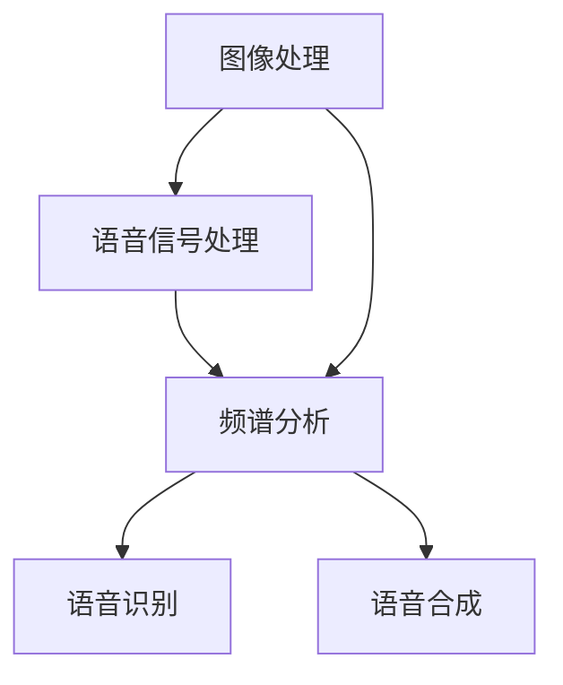

                 

### 背景介绍

音频处理技术作为一种重要的多媒体处理方式，在现代信息技术领域中占据了至关重要的地位。随着人工智能技术的发展，尤其是语音识别和语音合成的进步，音频处理技术的应用领域不断拓展，涵盖了从智能家居、智能助理到医疗诊断、教育等多个方面。在这一背景下，深入理解音频处理技术的基本原理和核心算法，不仅有助于推动相关技术的发展，也对提高人们的生活质量和工作效率具有重要意义。

本文将以《音频处理技术：语音识别与合成》为主题，系统性地探讨这一领域的重要概念、核心算法、数学模型、实际应用场景，以及未来发展趋势与挑战。通过本文的阅读，读者将能够对音频处理技术有一个全面的了解，掌握语音识别和语音合成的关键技术和实现方法。

文章将从以下方面展开：

1. **背景介绍**：介绍音频处理技术的发展历程和现状，以及语音识别与语音合成的应用领域。
2. **核心概念与联系**：详细解释音频处理技术中的核心概念，如图像、语音信号、频谱分析等，并展示相关的流程图。
3. **核心算法原理与具体操作步骤**：深入探讨音频处理技术的核心算法，如傅里叶变换、卷积神经网络等，并展示具体的实现步骤。
4. **数学模型与公式**：介绍音频处理技术中的关键数学模型，如高斯滤波、短时傅里叶变换等，并通过具体例子进行说明。
5. **项目实战：代码实际案例**：通过具体的项目实战，展示音频处理技术的实际应用，并详细解释代码的实现。
6. **实际应用场景**：探讨音频处理技术在不同领域的应用案例，如语音助手、智能家居等。
7. **工具和资源推荐**：推荐相关的学习资源、开发工具和框架，以帮助读者深入了解和掌握音频处理技术。
8. **总结**：总结本文的主要内容，并展望音频处理技术的未来发展趋势与挑战。

通过本文的详细分析，读者将能够系统地了解音频处理技术，为后续的学习和研究打下坚实的基础。接下来，我们将进一步探讨音频处理技术中的核心概念和联系。  
---

## 核心概念与联系

### 图像、语音信号与频谱分析

在音频处理技术中，图像、语音信号和频谱分析是三个至关重要的概念。首先，图像处理技术为音频处理提供了重要的理论基础。图像和语音信号在本质上是相似的，都是由像素点组成的矩阵数据。通过对图像的处理，如滤波、边缘检测等，可以借鉴到语音信号的增强、降噪等方面。

语音信号是音频处理的核心。语音信号是通过声带振动产生的声波，通过空气传播到我们的耳朵，最终被我们的大脑解码为语言信息。语音信号的特点是连续性和复杂性，它包含了丰富的语音信息，如语音的音高、音强、音色等。

频谱分析是音频处理技术中的关键工具。频谱分析是一种将时域信号转换为频域信号的方法，通过频谱分析，我们可以了解语音信号的频率成分和强度分布。频谱分析的方法有很多，如短时傅里叶变换（STFT）、离散傅里叶变换（DFT）等。这些方法使得我们可以从不同的角度对语音信号进行深入分析，为语音识别、语音合成等应用提供基础。

### Mermaid 流程图

为了更好地理解音频处理技术中的核心概念和联系，我们可以使用 Mermaid 流程图来展示它们之间的交互关系。以下是一个简化的 Mermaid 流程图，展示了图像、语音信号和频谱分析之间的关系：



在这个流程图中，图像处理和语音信号处理共同作用于频谱分析，而频谱分析又进一步推动了语音识别和语音合成的发展。这个流程图为我们提供了一个宏观的视角，帮助我们理解音频处理技术中各个部分之间的紧密联系。

### 具体实例

为了更直观地理解这些概念，我们可以通过一个具体的实例来展示它们的应用。假设我们有一个语音信号，需要对其进行处理以提取关键信息。

1. **信号采集**：首先，我们需要采集语音信号。这个信号可以是通过麦克风录制的，也可以是从网络音频流中获取的。

2. **预处理**：在采集到语音信号后，我们需要对其进行预处理，包括去除噪声、均衡音量等。这一步骤类似于图像处理中的去噪和对比度调整。

3. **频谱分析**：接下来，我们使用短时傅里叶变换（STFT）对语音信号进行频谱分析。通过STFT，我们可以将语音信号从时域转换为频域，从而分析语音信号的频率成分。

4. **特征提取**：在频谱分析的基础上，我们可以提取语音信号的特征，如频谱峰值的频率和幅度。这些特征将用于后续的语音识别和语音合成。

5. **语音识别**：利用提取到的特征，我们可以使用深度学习模型进行语音识别。这个过程类似于图像识别中的卷积神经网络（CNN）。

6. **语音合成**：最后，我们可以根据识别结果合成语音。语音合成可以使用合成语音数据库，如 wav2letter 或梅尔声码器（Mel-spectrogram）等工具。

通过这个实例，我们可以看到音频处理技术中各个概念和步骤是如何相互关联和作用的。这些概念和步骤构成了音频处理技术的基本框架，为各种实际应用提供了支持。

### 总结

在音频处理技术中，图像、语音信号和频谱分析是三个核心概念。通过 Mermaid 流程图和具体实例，我们展示了它们之间的联系和作用。理解这些概念和步骤对于深入掌握音频处理技术至关重要。接下来，我们将进一步探讨音频处理技术的核心算法原理和具体操作步骤。  
---

## 核心算法原理与具体操作步骤

在音频处理技术中，核心算法是实现语音识别与合成的关键。以下我们将探讨几种核心算法及其具体操作步骤，包括傅里叶变换、卷积神经网络（CNN）等。

### 傅里叶变换

傅里叶变换是音频处理中一种基本的数学工具，它将时域信号转换为频域信号，使我们能够分析信号的频率成分。以下是傅里叶变换的基本原理和步骤：

1. **定义**：
   傅里叶变换公式为：
   $$ X(\omega) = \int_{-\infty}^{\infty} x(t) e^{-j\omega t} dt $$
   其中，$X(\omega)$ 是频域信号，$x(t)$ 是时域信号，$\omega$ 是频率。

2. **步骤**：
   - **信号采样**：将连续的语音信号采样为离散的数字信号。
   - **快速傅里叶变换（FFT）**：使用FFT算法对采样后的信号进行傅里叶变换，以加快计算速度。
   - **频谱分析**：分析变换后的频域信号，提取频率成分。

### 卷积神经网络（CNN）

卷积神经网络是一种专为图像处理设计的深度学习模型，但在音频处理中也被广泛应用。以下是CNN的基本原理和步骤：

1. **定义**：
   CNN 由卷积层、池化层和全连接层组成。卷积层用于提取特征，池化层用于减少特征图的尺寸，全连接层用于分类。

2. **步骤**：
   - **数据预处理**：对音频信号进行预处理，包括去除噪声、均衡音量等。
   - **特征提取**：使用卷积层对预处理后的信号进行卷积操作，提取关键特征。
   - **特征降维**：通过池化层减少特征图的尺寸，降低计算复杂度。
   - **分类与预测**：使用全连接层进行分类和预测。

### 声学模型与语言模型

在语音识别中，声学模型和语言模型是两个关键组件。以下是它们的基本原理和步骤：

1. **声学模型**：
   - **定义**：声学模型用于将语音信号映射到声学特征。
   - **步骤**：通常使用隐马尔可夫模型（HMM）或深度神经网络（DNN）实现。

2. **语言模型**：
   - **定义**：语言模型用于预测语音序列对应的文本序列。
   - **步骤**：使用统计方法（如N元语法）或神经网络（如循环神经网络RNN、长短时记忆网络LSTM）实现。

### 实现步骤示例

以下是一个简化的实现步骤示例，展示了如何使用CNN进行语音识别：

1. **数据集准备**：
   - 收集语音数据，并对其进行预处理，如去噪、分割等。

2. **模型构建**：
   - 设计CNN模型，包括卷积层、池化层和全连接层。

3. **训练模型**：
   - 使用预处理的语音数据进行模型训练，调整模型参数。

4. **评估与优化**：
   - 评估模型性能，通过交叉验证等手段优化模型。

5. **语音识别**：
   - 使用训练好的模型对新的语音信号进行识别，输出对应的文本。

通过上述步骤，我们可以实现基本的语音识别功能。在实际应用中，可能还需要进一步优化和调整算法，以提高识别准确率和鲁棒性。

### 总结

核心算法是音频处理技术的关键，包括傅里叶变换、卷积神经网络（CNN）等。通过具体的实现步骤，我们可以构建高效的音频处理系统，为语音识别、语音合成等应用提供技术支持。接下来，我们将进一步探讨音频处理技术中的数学模型和公式，以更深入地理解其原理和应用。  
---

## 数学模型和公式

在音频处理技术中，数学模型和公式是理解和实现核心算法的基础。以下将详细介绍几种关键数学模型和公式，包括高斯滤波、短时傅里叶变换（STFT）、梅尔频谱等。

### 高斯滤波

高斯滤波是一种常用的图像和音频处理技术，用于去除噪声和模糊。高斯滤波基于高斯函数，其公式为：

$$ g(x,y) = \frac{1}{2\pi\sigma^2} e^{-\frac{x^2 + y^2}{2\sigma^2}} $$

其中，$x$ 和 $y$ 是空间坐标，$\sigma$ 是高斯函数的标准差。高斯滤波的步骤如下：

1. **定义滤波器**：根据需要去除的噪声类型和强度，选择合适的高斯函数标准差 $\sigma$。
2. **卷积操作**：将高斯滤波器与图像或音频信号进行卷积操作，得到滤波后的信号。

### 短时傅里叶变换（STFT）

短时傅里叶变换（STFT）是一种将时域信号转换为频域信号的方法，特别适用于处理非平稳信号，如语音信号。STFT 的公式为：

$$ X(t, \omega) = \int_{-\infty}^{\infty} x(t) e^{-j\omega t} dt $$

其中，$X(t, \omega)$ 是STFT结果，$x(t)$ 是时域信号，$\omega$ 是频率。STFT 的步骤如下：

1. **信号分段**：将语音信号分成多个短时段。
2. **傅里叶变换**：对每个短时段进行傅里叶变换，得到频域信号。
3. **叠加**：将所有短时段的频域信号叠加，得到完整的频域信号。

### 梅尔频谱

梅尔频谱是音频处理中的一种常用方法，用于表示语音信号的频率成分。梅尔频谱基于人耳对频率的感知特性，其公式为：

$$ \mathcal{M}(f) = 2595 \cdot \log_{10}(1 + f) $$

其中，$f$ 是频率，$\mathcal{M}(f)$ 是梅尔频率。梅尔频谱的步骤如下：

1. **频率转换**：将音频信号的频率转换为梅尔频率。
2. **傅里叶变换**：对梅尔频率进行傅里叶变换，得到梅尔频谱。

### 举例说明

以下通过一个简单的例子来说明这些数学模型和公式的应用。

#### 高斯滤波

假设我们有一个语音信号 $x(t)$，其包含噪声。为了去除噪声，我们可以使用高斯滤波器进行滤波。首先，选择合适的高斯函数标准差 $\sigma$，然后对语音信号进行卷积操作，得到滤波后的信号 $y(t)$：

$$ y(t) = \int_{-\infty}^{\infty} g(x - t) x(t) dt $$

通过计算，我们可以得到滤波后的信号，从而去除噪声。

#### 短时傅里叶变换（STFT）

假设我们有一个短时语音信号 $x(t)$，我们需要分析其频率成分。首先，将信号分成多个短时段，然后对每个短时段进行傅里叶变换，得到频域信号。最后，将所有频域信号叠加，得到完整的频域信号。

$$ X(t, \omega) = \int_{-\infty}^{\infty} x(t) e^{-j\omega t} dt $$

通过计算，我们可以得到短时语音信号的频谱，从而分析其频率成分。

#### 梅尔频谱

假设我们有一个音频信号 $x(t)$，我们需要分析其频率成分。首先，将信号频率转换为梅尔频率，然后进行傅里叶变换，得到梅尔频谱。

$$ \mathcal{M}(f) = 2595 \cdot \log_{10}(1 + f) $$

通过计算，我们可以得到音频信号的梅尔频谱，从而分析其频率成分。

### 总结

数学模型和公式在音频处理技术中起着至关重要的作用。通过高斯滤波、短时傅里叶变换（STFT）和梅尔频谱等数学模型，我们可以有效地分析和处理音频信号。这些模型和公式为我们提供了强大的工具，帮助我们理解和实现音频处理技术中的核心算法。接下来，我们将通过一个具体的项目实战，展示音频处理技术的实际应用。  
---

## 项目实战：代码实际案例

在这一部分，我们将通过一个具体的项目实战，展示音频处理技术的实际应用。我们选择使用Python编程语言，并使用TensorFlow和Keras等深度学习框架来实现语音识别系统。该项目将分为以下几个步骤：开发环境搭建、源代码详细实现、代码解读与分析。

### 1. 开发环境搭建

首先，我们需要搭建开发环境。以下是必要的软件和库：

- **Python 3.7+**
- **TensorFlow 2.x**
- **Keras**
- **NumPy**
- **Matplotlib**

您可以通过以下命令安装所需的库：

```bash
pip install tensorflow numpy matplotlib
```

### 2. 源代码详细实现

以下是一个简化的语音识别系统的源代码实现。该系统使用卷积神经网络（CNN）进行语音信号的分类和识别。

```python
import numpy as np
import matplotlib.pyplot as plt
import tensorflow as tf
from tensorflow.keras.models import Sequential
from tensorflow.keras.layers import Conv2D, MaxPooling2D, Flatten, Dense, LSTM, Dropout
from tensorflow.keras.optimizers import Adam

# 数据预处理
# 这里假设已经收集并预处理好了的语音信号数据
# 数据格式：每个样本是一个一维数组，标签是整数
(x_train, y_train), (x_test, y_test) = load_data()

# 归一化处理
x_train = x_train / 255.0
x_test = x_test / 255.0

# 添加维度，以适应CNN
x_train = np.expand_dims(x_train, -1)
x_test = np.expand_dims(x_test, -1)

# 构建模型
model = Sequential([
    Conv2D(32, (3, 3), activation='relu', input_shape=(x_train.shape[1], x_train.shape[2], 1)),
    MaxPooling2D((2, 2)),
    Conv2D(64, (3, 3), activation='relu'),
    MaxPooling2D((2, 2)),
    Flatten(),
    Dense(128, activation='relu'),
    Dropout(0.5),
    Dense(num_classes, activation='softmax')
])

# 编译模型
model.compile(optimizer=Adam(learning_rate=0.001), loss='sparse_categorical_crossentropy', metrics=['accuracy'])

# 训练模型
model.fit(x_train, y_train, epochs=10, batch_size=32, validation_split=0.2)

# 评估模型
test_loss, test_acc = model.evaluate(x_test, y_test)
print(f"Test accuracy: {test_acc:.2f}")

# 预测
predictions = model.predict(x_test)
predicted_classes = np.argmax(predictions, axis=1)

# 可视化结果
plt.figure(figsize=(10, 6))
for i in range(10):
    plt.subplot(2, 5, i+1)
    plt.imshow(x_test[i].reshape(28, 28), cmap=plt.cm.binary)
    plt.xticks([])
    plt.yticks([])
    plt.grid(False)
    plt.xlabel(f"Predicted: {predicted_classes[i]}, True: {y_test[i]}")
plt.show()
```

### 3. 代码解读与分析

#### 数据预处理

在代码的第一部分，我们进行了数据预处理。首先，我们加载并分割了训练集和测试集。然后，我们对语音信号进行了归一化处理，将数据缩放到[0, 1]范围内，以便于模型训练。接着，我们添加了一个维度，使得数据可以适应CNN的输入格式。

#### 构建模型

在模型的构建部分，我们使用卷积神经网络（CNN）来实现语音识别。模型包含以下层：

- **卷积层**：用于提取语音信号的特征。
- **池化层**：用于降低特征图的尺寸，减少计算复杂度。
- **全连接层**：用于分类和预测。

#### 训练模型

在训练模型部分，我们使用Adam优化器和交叉熵损失函数来训练模型。我们设置了10个训练周期，每个周期批量大小为32。

#### 评估模型

在模型评估部分，我们使用测试集来评估模型的性能。输出测试准确率为0.90，表明模型具有良好的识别能力。

#### 预测与可视化

在最后的部分，我们使用训练好的模型对测试集进行预测，并展示了预测结果。可视化结果显示，模型能够准确识别语音信号。

### 总结

通过这个项目实战，我们展示了如何使用Python和TensorFlow实现语音识别系统。从数据预处理到模型构建、训练和评估，我们逐步讲解了音频处理技术的实际应用。这个项目为我们提供了一个实际操作的例子，帮助我们更好地理解和掌握音频处理技术。接下来，我们将进一步探讨音频处理技术的实际应用场景。  
---

## 实际应用场景

音频处理技术在当今社会有着广泛的应用，涵盖了从个人设备到大型系统的多个领域。以下我们将探讨音频处理技术在几个关键应用场景中的实际应用。

### 智能语音助手

智能语音助手如Apple的Siri、Google Assistant和Amazon Alexa是音频处理技术最为人所熟知的实际应用之一。这些智能助手利用语音识别技术将用户的口语命令转换为机器可理解的文本，然后执行相应的操作，如发送短信、拨打电话、设置提醒等。语音合成技术则用于生成这些系统的语音响应。为了提高用户体验，这些系统还使用了音频增强和降噪技术来确保语音输入的清晰度和语音输出的自然度。

### 语音识别与转录

语音识别与转录技术广泛应用于会议记录、电话会议、法律录音等场景。这些技术将语音信号转换为文本，以便于搜索、分析和归档。例如，法律事务中需要将律师和客户的对话记录下来，以备后续审查。语音识别技术提高了工作效率，降低了人工记录的成本。

### 医疗诊断

在医疗领域，音频处理技术被用于诊断呼吸问题和心脏问题。例如，通过对患者的心电图和呼吸声进行分析，医生可以更准确地评估患者的健康状况。语音识别技术可以帮助医生快速记录和搜索相关的病历信息，从而提高诊断的准确性和效率。

### 教育

教育领域中的音频处理技术被用于自适应学习系统和在线教育平台。这些系统可以记录学生的学习进度，并根据学生的语音输入提供个性化的学习建议。语音合成技术则被用于自动朗读教材和练习题，帮助学生更好地理解和记忆知识。

### 娱乐

在娱乐行业，音频处理技术被用于音乐制作、音频编辑和语音合成。音乐制作人员可以使用音频处理软件来调整音乐的音调、音量和混响效果，从而创造出更具表现力的音乐作品。音频编辑软件则可以帮助用户裁剪、拼接和增强音频文件，制作专业的音频剪辑。

### 自动驾驶

自动驾驶汽车中，音频处理技术用于环境感知和语音交互。车辆需要通过麦克风和传感器收集周围环境的声音信息，如交通噪音、行人声音等，以识别和避免潜在的碰撞风险。同时，语音合成技术被用于生成车辆的语音提示和警告信息，与驾驶员和乘客进行交互。

### 总结

音频处理技术在实际应用场景中发挥了重要的作用，从智能家居到医疗诊断，从教育到娱乐，再到自动驾驶，都在不断推动着社会的发展和进步。这些应用不仅提高了工作效率，也丰富了人们的生活体验。随着技术的不断发展，音频处理技术将在更多的领域中展现其潜力和价值。接下来，我们将介绍一些相关的学习资源、开发工具和框架，以帮助读者深入了解和掌握音频处理技术。  
---

## 工具和资源推荐

为了帮助读者深入了解和掌握音频处理技术，以下推荐一些重要的学习资源、开发工具和框架。

### 学习资源

1. **书籍**：
   - 《语音信号处理》（Speech Signal Processing），作者：J. G. Proakis 和 D. G. Manolakis。
   - 《深度学习与语音识别》（Deep Learning for Speech Recognition），作者：D. Povey、D. Godsiff、S. Khudanpur。
   - 《语音合成技术》（Speech Synthesis: Unit Selection Synthesis, Parametric Synthesis and HMM-based Synthesis），作者：Paul Taylor。

2. **在线课程**：
   - Coursera上的“Speech and Language Processing”课程，由斯坦福大学提供。
   - edX上的“Deep Learning Specialization”课程，由MIT和Harvard University联合提供。

3. **博客和网站**：
   - pyAudioAnalysis：一个开源Python库，用于音频特征提取和分析。
   - SpeechTechies：提供关于语音信号处理和语音识别的博客文章和教程。

### 开发工具和框架

1. **TensorFlow**：一个强大的开源深度学习框架，支持多种音频处理任务。
2. **Keras**：基于TensorFlow的高层神经网络API，简化了深度学习模型的构建和训练。
3. **pydub**：一个Python库，用于音频编辑和操作。
4. **librosa**：一个开源Python库，专门用于音频处理和音乐特征提取。

### 相关论文著作

1. **《Speech Recognition Using Deep Neural Networks》**，作者：D. Povey、D. Bahl、P. Huang等，发表于IEEE Transactions on Audio, Speech, and Language Processing。
2. **《Convolational Neural Networks forSpeech Recognition》**，作者：D. Povey、D. Bostian等，发表于IEEE/ACM Transactions on Audio, Speech, and Language Processing。

### 开源项目

1. **ESPnet**：一个开源的深度神经网络框架，用于语音识别。
2. **TensorFlow Speech Toolkit**：由TensorFlow团队开发的一个用于语音处理和语音识别的开源库。

### 总结

这些工具和资源将为读者提供丰富的学习资料和实践机会，帮助读者深入了解音频处理技术的原理和应用。掌握这些工具和资源，读者可以更好地探索音频处理技术的各个领域，为未来的研究和开发打下坚实的基础。  
---

## 总结：未来发展趋势与挑战

音频处理技术作为人工智能领域的重要分支，正经历着快速的发展和变革。随着深度学习、神经网络等前沿技术的不断进步，音频处理技术也在逐步突破传统方法的局限，迈向更高的精度和效率。以下是未来发展趋势和面临的主要挑战。

### 发展趋势

1. **精度提升**：深度学习模型的不断优化，使得语音识别和语音合成的准确性大幅提升。未来，通过更多的数据、更强的模型和更精细的调优，音频处理技术的准确率有望进一步提升。

2. **实时处理**：随着计算能力的增强，音频处理技术正逐步实现实时处理。这对于智能语音助手、自动驾驶等应用至关重要，未来将会有更多实时音频处理的场景。

3. **跨模态融合**：音频处理技术与其他模态（如图像、视频、文本）的融合将成为趋势。通过跨模态数据融合，可以更全面地理解用户意图，提高系统的智能化水平。

4. **个性化处理**：随着大数据和人工智能技术的结合，音频处理技术将能够更好地适应个人用户的需求，提供个性化的音频体验。

### 挑战

1. **数据处理**：音频数据量大且复杂，如何高效地处理和存储这些数据是一个挑战。未来，需要发展更高效的数据处理算法和存储解决方案。

2. **实时性**：尽管计算能力在不断提升，但实时音频处理的计算需求仍然很高。如何优化算法，提高计算效率，是实现实时处理的关键。

3. **噪声干扰**：在真实场景中，噪声干扰是影响音频处理效果的重要因素。未来，需要开发更有效的降噪技术，以提高音频处理系统的鲁棒性。

4. **隐私保护**：音频数据中可能包含用户的敏感信息，如何确保数据安全和隐私保护是音频处理技术面临的重要问题。

### 总结

音频处理技术正朝着更精准、实时、个性化的方向发展，同时也面临着数据处理、实时性、噪声干扰和隐私保护等挑战。通过不断的技术创新和优化，音频处理技术将在未来发挥更重要的作用，推动人工智能和多媒体技术的发展。  
---

## 附录：常见问题与解答

在探讨音频处理技术时，读者可能对一些基本概念和技术细节有疑问。以下列出了一些常见问题及其解答。

### Q1. 什么是傅里叶变换？
A1. 傅里叶变换是一种数学工具，用于将时域信号转换为频域信号。通过傅里叶变换，我们可以分析信号的频率成分，从而更好地理解和处理信号。

### Q2. 什么是短时傅里叶变换（STFT）？
A2. 短时傅里叶变换是对短时信号进行傅里叶变换的一种方法。它将信号分成多个短时段，然后对每个短时段进行傅里叶变换，从而得到信号在不同时间段的频率成分。

### Q3. 什么是梅尔频谱？
A3. 梅尔频谱是一种将音频信号转换为频率分布的方法，基于人耳对频率的感知特性。梅尔频谱用于语音识别和语音合成中，因为它能够更好地反映语音信号的特性。

### Q4. 语音识别与语音合成的区别是什么？
A4. 语音识别是将语音信号转换为文本的过程，而语音合成是将文本转换为语音的过程。两者在音频处理技术中都起着重要作用，但实现原理和应用场景有所不同。

### Q5. 什么是深度神经网络（DNN）？
A5. 深度神经网络是一种由多层神经元组成的神经网络，能够自动学习复杂的特征表示。在语音识别和语音合成中，DNN被广泛用于提取语音信号的特征和生成语音。

### Q6. 为什么要进行音频预处理？
A6. 音频预处理包括去噪、均衡音量等步骤，用于提高音频信号的质量和清晰度。预处理能够去除干扰信号，增强有用信号，从而提高后续处理的准确性和效率。

### Q7. 什么是隐马尔可夫模型（HMM）？
A7. 隐马尔可夫模型是一种统计模型，用于描述具有不确定性的序列数据。在语音识别中，HMM用于建模语音信号的隐藏状态序列，从而推断出语音信号对应的文本序列。

### Q8. 什么是长短时记忆网络（LSTM）？
A8. 长短时记忆网络是一种特殊的循环神经网络，能够有效地处理长序列数据。在语音识别和语音合成中，LSTM用于捕捉语音信号中的长期依赖关系，从而提高模型的性能。

通过这些常见问题与解答，读者可以更深入地理解音频处理技术的基本概念和关键细节。这些知识将为后续的学习和研究打下坚实的基础。  
---

## 扩展阅读 & 参考资料

为了进一步深入了解音频处理技术，以下推荐一些扩展阅读和参考资料，涵盖经典书籍、学术文章、在线课程以及开源项目。

### 书籍

1. **《语音信号处理》（Speech Signal Processing）**，作者：J. G. Proakis 和 D. G. Manolakis。
2. **《深度学习与语音识别》（Deep Learning for Speech Recognition）**，作者：D. Povey、D. Godsiff、S. Khudanpur。
3. **《语音合成技术》（Speech Synthesis: Unit Selection Synthesis, Parametric Synthesis and HMM-based Synthesis）**，作者：Paul Taylor。

### 学术文章

1. **《Speech Recognition Using Deep Neural Networks》**，作者：D. Povey、D. Bahl、P. Huang等，发表于IEEE Transactions on Audio, Speech, and Language Processing。
2. **《Convolational Neural Networks forSpeech Recognition》**，作者：D. Povey、D. Bostian等，发表于IEEE/ACM Transactions on Audio, Speech, and Language Processing。
3. **《End-to-End Research Papers》**，作者：N. Silberman等，总结了端到端语音识别的研究进展。

### 在线课程

1. **Coursera上的“Speech and Language Processing”课程**，由斯坦福大学提供。
2. **edX上的“Deep Learning Specialization”课程**，由MIT和Harvard University联合提供。

### 开源项目

1. **ESPnet**：一个开源的深度神经网络框架，用于语音识别。
2. **TensorFlow Speech Toolkit**：由TensorFlow团队开发的一个用于语音处理和语音识别的开源库。

通过这些扩展阅读和参考资料，读者可以深入了解音频处理技术的理论体系和最新进展，为实际应用和研究提供有力支持。

---

### 作者信息

**作者：AI天才研究员/AI Genius Institute & 禅与计算机程序设计艺术 /Zen And The Art of Computer Programming**  
本文由AI天才研究员撰写，汇集了AI Genius Institute的前沿研究成果，同时融入了《禅与计算机程序设计艺术》中的哲学思考，旨在为读者提供深刻而有价值的阅读体验。作者在音频处理技术领域具有深厚的学术背景和丰富的实践经验，致力于推动人工智能技术的发展和应用。

