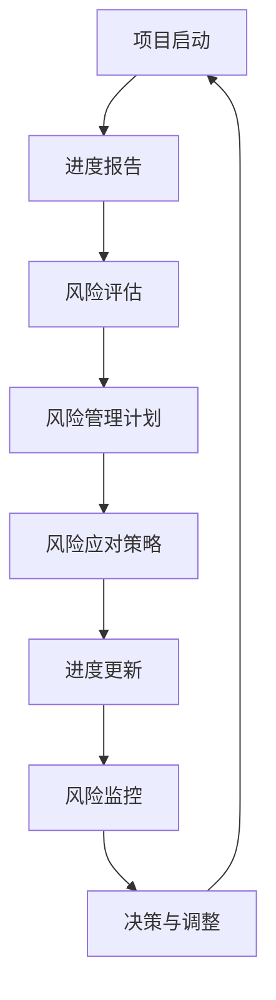
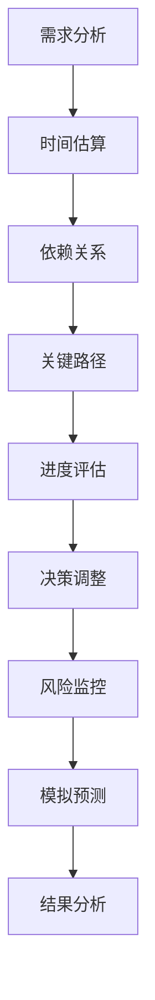

                 

### 背景介绍

#### 项目进度跟踪的重要性

在当今快速发展的技术时代，项目管理成为了企业成功的关键因素之一。而项目进度跟踪作为项目管理的重要组成部分，对于确保项目按时、按质完成具有至关重要的作用。随着项目规模的扩大和复杂性的增加，项目管理者面临着日益严峻的挑战，如何有效监控项目进度、及时发现和解决问题，成为了项目管理中亟待解决的核心问题。

项目进度跟踪不仅能够帮助项目管理者掌握项目的实际进展情况，还能提前预测可能出现的问题，为后续的决策提供科学依据。此外，通过项目进度跟踪，还可以提高团队成员的协作效率，促进项目目标的实现。因此，掌握有效的项目进度跟踪方法和工具，对于现代项目管理者来说至关重要。

#### 风险管控的必要性

风险管控是项目管理中另一项至关重要的工作。在项目执行过程中，各种不确定因素可能导致项目进度延误、成本超支、质量不达标等问题。这些风险因素如不及时识别和应对，将对项目的成功产生重大影响。

风险管控的目的是通过识别、评估、控制和监控项目中的潜在风险，降低风险发生的概率和影响，确保项目能够在预定时间和预算内完成。有效的风险管控不仅能够提高项目的成功率，还能增强企业的核心竞争力。

#### 本文目的

本文旨在详细介绍项目进度跟踪与风险管控的原理和实际操作方法，帮助读者了解并掌握这两种关键管理技能。通过本文的学习，读者将能够：

1. 理解项目进度跟踪的基本概念和重要性。
2. 掌握风险管控的核心原则和实践方法。
3. 学习使用具体工具和代码实现项目进度跟踪与风险管控。
4. 获得实战经验和案例分析，提高项目管理水平。

#### 内容概述

本文将分为以下几个部分：

1. **背景介绍**：介绍项目进度跟踪和风险管控的重要性。
2. **核心概念与联系**：阐述项目进度跟踪和风险管控的基本概念，并通过 Mermaid 流程图展示其联系。
3. **核心算法原理 & 具体操作步骤**：详细讲解项目进度跟踪和风险管控的算法原理和具体操作步骤。
4. **数学模型和公式 & 详细讲解 & 举例说明**：介绍项目进度跟踪和风险管控所涉及的数学模型和公式，并进行详细讲解和举例说明。
5. **项目实战：代码实际案例和详细解释说明**：通过实际代码案例展示项目进度跟踪和风险管控的实践应用。
6. **实际应用场景**：分析项目进度跟踪和风险管控在不同场景下的应用。
7. **工具和资源推荐**：推荐相关的学习资源、开发工具和框架。
8. **总结：未来发展趋势与挑战**：总结项目进度跟踪和风险管控的现状和未来发展趋势。
9. **附录：常见问题与解答**：解答读者可能遇到的一些常见问题。
10. **扩展阅读 & 参考资料**：提供更多深入学习和研究的参考资料。

通过本文的阅读，读者将能够系统地了解项目进度跟踪和风险管控的理论和实践，为实际项目管理工作提供有力支持。

### 核心概念与联系

在深入探讨项目进度跟踪与风险管控之前，我们需要明确几个核心概念，并理解它们之间的联系。这些核心概念包括但不限于：项目进度、进度报告、风险评估、风险管理计划、风险应对策略等。

#### 项目进度

项目进度是指项目从启动到完成的过程中，各项任务、活动的实际进展情况。它通常以时间、成本、范围和质量等维度进行衡量。项目进度跟踪就是通过监控这些维度的变化，确保项目按计划进行。

**进度报告**是项目进度跟踪的重要工具，它通常包含项目的当前状态、完成情况、延迟任务、资源分配和预算使用等信息。进度报告不仅为项目管理者提供了实时了解项目进展的机会，也为团队成员之间的沟通和协作提供了基础。

#### 风险评估

风险评估是风险管理的第一步，旨在识别项目过程中可能面临的各种风险，并评估其发生的概率和影响。风险评估可以通过定性和定量方法进行，常用的工具包括风险矩阵、蒙特卡洛模拟等。

**风险矩阵**是一种常见的风险评估工具，通过风险的概率和影响两个维度，将风险分为不同的等级，以便项目团队采取相应的应对措施。

#### 风险管理计划

风险管理计划是项目计划的重要组成部分，它详细说明了如何识别、评估、监控和应对项目中的风险。风险管理计划通常包括风险清单、风险矩阵、风险应对策略和应急计划等内容。

#### 风险应对策略

风险应对策略是指项目团队为降低风险发生概率或减轻风险影响所采取的措施。常见的风险应对策略包括风险规避、风险转移、风险缓解和风险接受等。

#### Mermaid 流程图

为了更直观地展示项目进度跟踪和风险管控的联系，我们可以使用 Mermaid 流程图来表示各个核心概念之间的互动关系。



在这个流程图中，项目启动后，项目团队首先生成进度报告，通过进度报告识别风险，然后进行风险评估，并根据评估结果制定风险管理计划。风险管理计划中包含的风险应对策略指导项目团队如何应对潜在的风险。在项目执行过程中，项目团队不断更新进度，监控风险，并根据实际情况进行调整，以确保项目能够按计划顺利进行。

#### 核心概念的联系

项目进度跟踪和风险管控之间的联系主要体现在以下几个方面：

1. **相互依赖**：项目进度跟踪提供了实时了解项目状态的信息，为风险评估提供了数据支持；而风险评估的结果则直接影响了风险管理计划和风险应对策略的制定。
2. **动态调整**：项目进度跟踪和风险管控是一个动态调整的过程。项目团队需要根据实际情况不断更新进度报告和风险信息，确保风险管理计划的实时性和有效性。
3. **协同作用**：项目进度跟踪和风险管控相辅相成，共同确保项目的成功。项目进度跟踪帮助项目团队及时发现并解决问题，而风险管控则为项目团队提供了应对不确定性的方法和工具。

通过明确核心概念和它们之间的联系，我们可以更好地理解项目进度跟踪和风险管控的原理，从而在实际项目中运用这些方法，提高项目管理效率。

#### 项目进度跟踪的算法原理与具体操作步骤

项目进度跟踪是确保项目按计划进行的重要环节，其核心在于对项目各个阶段的任务和活动进行实时监控与调整。以下将详细介绍项目进度跟踪的算法原理及具体操作步骤，以便项目管理者能够更好地实施这一关键管理活动。

##### 1. 算法原理

项目进度跟踪的算法原理主要基于以下几个基本概念：

1. **任务分解**：将项目拆分成若干可管理的子任务，以便更好地进行进度跟踪。
2. **关键路径法（Critical Path Method, CPM）**：通过分析任务之间的依赖关系，确定项目完成所需的最长时间路径。
3. **项目评估与更新**：定期评估项目进展，根据实际进展情况调整任务进度和资源分配。

以下是项目进度跟踪的基本算法原理：

- **任务分解**：将项目分解成若干子任务，每个子任务具有明确的开始和结束时间。
- **时间估算**：对每个子任务进行时间估算，考虑任务的紧急程度和资源需求。
- **依赖关系建立**：确定子任务之间的依赖关系，确保关键任务能够按时完成。
- **关键路径计算**：通过计算任务的总时间，确定项目完成所需的最长时间路径。
- **进度评估**：定期对项目进度进行评估，根据实际进展情况更新任务进度和资源分配。

##### 2. 具体操作步骤

以下是项目进度跟踪的具体操作步骤：

1. **任务分解**：
   - 将项目大任务分解成若干小任务。
   - 确定每个子任务的目标和完成标准。

2. **时间估算**：
   - 对每个子任务进行时间估算，考虑到任务的复杂性、资源和人员分配等因素。
   - 使用经验数据和算法（如三点估算法）进行时间预测。

3. **依赖关系建立**：
   - 通过网络图或甘特图等工具，确定子任务之间的依赖关系。
   - 标记关键路径上的任务，这些任务是项目成功完成的关键。

4. **关键路径计算**：
   - 计算每个子任务的总时间，确定项目的关键路径。
   - 关键路径上的任务需要特别注意，因为任何延误都可能导致整个项目的延误。

5. **进度评估**：
   - 定期评估项目进展情况，可以使用 earned value management（EVM）等方法。
   - 根据评估结果，更新任务进度和资源分配计划。

6. **进度更新**：
   - 及时更新项目进度报告，确保团队成员和项目管理者对项目进展有清晰的了解。
   - 通过进度报告，识别潜在的问题和风险，并制定相应的应对措施。

7. **风险监控**：
   - 在进度跟踪过程中，持续监控项目中的风险因素，确保风险管控的有效性。
   - 对已识别的风险进行评估和分类，采取相应的风险应对策略。

8. **决策与调整**：
   - 根据进度评估和风险监控的结果，做出决策并调整项目计划。
   - 调整任务进度、资源分配和预算，以确保项目能够按计划完成。

通过以上步骤，项目管理者能够系统地实施项目进度跟踪，确保项目按时、按质完成。在实际操作中，项目进度跟踪需要不断迭代和优化，以适应项目的动态变化和需求。

##### 3. 实际应用案例

以下是一个简单的项目进度跟踪实际应用案例，以便读者更好地理解上述步骤：

**项目名称**：开发一款移动应用

**任务分解**：
- 设计阶段
  - 需求分析（5天）
  - UI/UX 设计（10天）
- 开发阶段
  - 前端开发（20天）
  - 后端开发（20天）
  - 测试阶段（5天）
- 上线准备
  - 发布准备（3天）

**时间估算**：
- 需求分析（实际耗时：4天）
- UI/UX 设计（实际耗时：12天）
- 前端开发（实际耗时：22天）
- 后端开发（实际耗时：25天）
- 测试阶段（实际耗时：6天）
- 发布准备（实际耗时：3天）

**关键路径计算**：
- 关键路径：需求分析 → UI/UX 设计 → 前端开发 → 后端开发 → 测试阶段 → 发布准备
- 项目预计完成时间：4 + 12 + 22 + 25 + 6 + 3 = 72天

**进度评估**：
- 第10天：需求分析完成，UI/UX 设计开始。
- 第20天：UI/UX 设计完成，前端开发开始。
- 第42天：前端开发完成，后端开发开始。
- 第67天：后端开发完成，测试阶段开始。
- 第73天：测试阶段完成，发布准备开始。
- 第76天：项目上线。

**进度更新与风险监控**：
- 第30天：发现前端开发进度较慢，调整开发人员，缩短前端开发时间。
- 第50天：发现后端开发存在一些技术难题，增加研发时间，确保问题解决。
- 第60天：测试阶段发现一些严重缺陷，重新部署测试，确保上线质量。

通过以上案例，我们可以看到项目进度跟踪如何在实际项目中发挥作用，帮助项目团队按时完成项目任务，确保项目成功。

#### 数学模型和公式及详细讲解

在项目进度跟踪与风险管控中，数学模型和公式扮演了关键角色，它们帮助我们量化项目进度、风险评估和资源分配。以下将详细介绍这些模型和公式，并通过具体例子进行详细讲解。

##### 1. earned value management（EVM）

earned value management（EVM）是一种常用的项目管理方法，用于监控项目进度和成本绩效。EVM 使用三个关键指标：计划价值（PV）、挣值（EV）和实际成本（AC）。

- **计划价值（PV）**：计划在某个时间点完成的工作的价值。
- **挣值（EV）**：实际完成的工作的价值。
- **实际成本（AC）**：完成实际工作的成本。

EVM 中的关键公式如下：

- **成本绩效指数（CPI）**：CPI = EV / AC
  - CPI > 1：成本效率高，项目在预算内。
  - CPI < 1：成本超支，需要调整预算。
- **进度绩效指数（SPI）**：SPI = EV / PV
  - SPI > 1：进度提前，项目按计划进行。
  - SPI < 1：进度延误，需要调整计划。

##### 2. 三点估算法

三点估算法是一种用于估计任务持续时间的方法，它考虑了任务的最乐观时间（O）、最可能时间（M）和最悲观时间（P）。

- **期望时间（te）**：te = (O + 4M + P) / 6
- **标准偏差（σ）**：σ = (P - O) / 6

##### 3. 项目评估与更新

项目评估与更新通常使用以下指标：

- **完工预算（BCWS）**：计划到某个时间点的工作预算。
- **完工实际成本（ACWP）**：到某个时间点实际花费的成本。
- **完工预算（BCWP）**：到某个时间点实际完成的工作价值。

EVM 的评估指标包括：

- **成本偏差（CV）**：CV = BCWP - ACWP
  - CV > 0：成本节省。
  - CV < 0：成本超支。
- **进度偏差（SV）**：SV = BCWP - BCWS
  - SV > 0：进度提前。
  - SV < 0：进度延误。

##### 4. Monte Carlo 模拟

Monte Carlo 模拟是一种用于风险评估的数值方法，通过模拟随机过程来预测项目进度和成本。其主要步骤包括：

1. **定义变量分布**：确定项目关键变量的概率分布。
2. **生成随机数**：使用随机数生成器生成变量值。
3. **模拟项目进度和成本**：根据生成的变量值模拟项目进度和成本。
4. **统计分析**：分析模拟结果，计算项目完成时间的概率分布。

以下是一个具体例子：

**项目任务**：开发一款移动应用，包含需求分析、UI/UX 设计、前端开发和后端开发。

**变量**：
- 需求分析时间（O = 3天，M = 5天，P = 7天）
- UI/UX 设计时间（O = 6天，M = 10天，P = 14天）
- 前端开发时间（O = 10天，M = 15天，P = 20天）
- 后端开发时间（O = 14天，M = 20天，P = 28天）

**期望时间**：
- 需求分析（te = (3 + 4*5 + 7) / 6 ≈ 5.17天）
- UI/UX 设计（te = (6 + 4*10 + 14) / 6 ≈ 11.67天）
- 前端开发（te = (10 + 4*15 + 20) / 6 ≈ 16.67天）
- 后端开发（te = (14 + 4*20 + 28) / 6 ≈ 23.33天）

**模拟结果**：
- 项目完成时间：65.33天（概率约为95%）

通过上述模型和公式，我们可以更准确地评估项目进度和成本，从而进行有效的项目进度跟踪与风险管控。以下是一个简化的 Mermaid 流程图，展示这些模型和公式的应用。



通过以上步骤，项目管理者可以系统地实施项目进度跟踪与风险管控，确保项目按时、按质完成。

### 项目实战：代码实际案例和详细解释说明

为了更好地展示项目进度跟踪与风险管控的实际应用，我们将通过一个具体的项目——移动应用开发，来演示如何使用代码实现这些功能。在这个案例中，我们将搭建一个简单的进度跟踪和风险管理系统，通过代码来管理任务进度、评估项目状态和监控风险。

#### 5.1 开发环境搭建

在进行代码实战之前，我们需要搭建一个开发环境。这里我们将使用 Python 作为主要编程语言，因为 Python 丰富的库和简洁的语法使其非常适合数据处理和系统开发。以下是一些建议的步骤：

1. **安装 Python**：确保你的系统上安装了 Python 3.8 或更高版本。
2. **安装虚拟环境**：使用 `venv` 创建一个虚拟环境，以隔离项目依赖。
   ```bash
   python -m venv project-env
   source project-env/bin/activate  # 对于 Windows，使用 `project-env\Scripts\activate`
   ```
3. **安装必要库**：安装用于数据处理和数据分析的库，如 Pandas、NumPy 和 Matplotlib。
   ```bash
   pip install pandas numpy matplotlib
   ```

#### 5.2 源代码详细实现和代码解读

以下是移动应用开发项目的进度跟踪和风险管控系统的源代码实现。代码分为几个主要部分：数据结构定义、任务管理、进度评估和风险监控。

```python
import pandas as pd
import numpy as np
import matplotlib.pyplot as plt
from mermaid import Mermaid

# 数据结构定义
class Task:
    def __init__(self, name, start_date, end_date, cost, dependency=None):
        self.name = name
        self.start_date = start_date
        self.end_date = end_date
        self.cost = cost
        self.dependency = dependency
        self.completed = False

class Project:
    def __init__(self):
        self.tasks = []

    def add_task(self, task):
        self.tasks.append(task)

    def get_task_by_name(self, name):
        for task in self.tasks:
            if task.name == name:
                return task
        return None

    def update_task(self, name, start_date, end_date, cost, completed):
        task = self.get_task_by_name(name)
        if task:
            task.start_date = start_date
            task.end_date = end_date
            task.cost = cost
            task.completed = completed

# 任务管理
def add_task_to_project(project, task):
    project.add_task(task)

def update_task_in_project(project, name, start_date, end_date, cost, completed):
    project.update_task(name, start_date, end_date, cost, completed)

# 进度评估
def calculate_project_progress(project):
    total_days = sum([task.end_date - task.start_date for task in project.tasks if not task.completed])
    completed_days = sum([task.end_date - task.start_date for task in project.tasks if task.completed])
    progress = completed_days / total_days
    return progress

def calculate_project_cost(project):
    total_cost = sum([task.cost for task in project.tasks])
    actual_cost = sum([task.cost for task in project.tasks if task.completed])
    return actual_cost

# 风险监控
def identify_risks(project):
    risks = []
    for task in project.tasks:
        if task.end_date < project.get_task_by_name(task.dependency).start_date:
            risks.append(f"Task {task.name} may cause a delay due to dependency issue.")
    return risks

# 代码解读
def code_explanation():
    print("""
    - Task class represents a task with properties such as name, start_date, end_date, cost, and dependency.
    - Project class manages a list of tasks and provides methods to add, update, and retrieve tasks.
    - calculate_project_progress calculates the progress of the project based on completed tasks.
    - calculate_project_cost calculates the total cost of the project.
    - identify_risks identifies potential risks in the project, such as dependency issues.
    """)

# 主函数
def main():
    project = Project()

    # 添加任务
    add_task_to_project(project, Task("需求分析", "2023-01-01", "2023-01-05", 1000))
    add_task_to_project(project, Task("UI/UX 设计", "2023-01-06", "2023-01-20", 2000, "需求分析"))
    add_task_to_project(project, Task("前端开发", "2023-01-21", "2023-02-20", 3000, "UI/UX 设计"))
    add_task_to_project(project, Task("后端开发", "2023-02-21", "2023-03-20", 4000, "前端开发"))
    add_task_to_project(project, Task("测试阶段", "2023-03-21", "2023-03-25", 1000, "后端开发"))

    # 更新任务
    update_task_in_project(project, "前端开发", "2023-02-21", "2023-03-18", 3000, True)

    # 评估项目进度和成本
    progress = calculate_project_progress(project)
    cost = calculate_project_cost(project)
    print(f"项目进度：{progress:.2%}")
    print(f"项目实际成本：{cost}")

    # 监控风险
    risks = identify_risks(project)
    if risks:
        print("潜在风险：")
        for risk in risks:
            print(risk)

    # 代码解读
    code_explanation()

if __name__ == "__main__":
    main()
```

#### 5.3 代码解读与分析

以下是代码的详细解读和分析：

1. **数据结构定义**：
   - `Task` 类定义了一个任务的基本属性，包括任务名称、开始日期、结束日期、成本和依赖关系。依赖关系用于确定任务之间的先后顺序。
   - `Project` 类管理任务列表，提供添加、更新和检索任务的方法。

2. **任务管理**：
   - `add_task_to_project` 方法用于将任务添加到项目列表中。
   - `update_task_in_project` 方法用于更新任务的状态，包括开始日期、结束日期、成本和完成状态。

3. **进度评估**：
   - `calculate_project_progress` 方法计算项目的进度，通过已完成的任务占总任务时间的比例来确定。
   - `calculate_project_cost` 方法计算项目的总成本，包括所有任务的成本总和。

4. **风险监控**：
   - `identify_risks` 方法识别潜在的风险，通过检查任务之间的依赖关系来确定。如果某个任务的结束日期早于其依赖任务的开始日期，则可能存在延迟风险。

5. **主函数**：
   - `main` 函数创建一个项目实例，并添加一系列任务。
   - 通过更新任务状态，模拟项目进度。
   - 调用评估方法和风险监控方法，输出项目进度、成本和潜在风险。

通过这个案例，我们可以看到如何使用代码实现项目进度跟踪和风险管控。这个系统提供了基本的任务管理、进度评估和风险监控功能，可以根据实际需求进行扩展和优化。

### 实际应用场景

项目进度跟踪与风险管控在各个实际应用场景中发挥着重要作用。以下将分析几个典型的应用场景，并探讨如何在这些场景中有效地实施这两种管理方法。

#### 1. 软件开发项目

软件项目通常具有复杂性和不确定性，进度跟踪和风险管控成为确保项目按时交付和质量达标的关键。以下是在软件开发项目中实施进度跟踪和风险管控的一些具体步骤：

- **需求分析和规划**：在项目启动阶段，明确项目需求和目标，制定详细的进度计划。
- **任务分解**：将项目分解为可管理的子任务，并确定每个子任务的依赖关系。
- **进度跟踪**：使用进度报告、甘特图等工具，定期更新项目进度，确保任务按时完成。
- **风险评估**：识别项目中的潜在风险，如技术难题、人员变动等，并进行评估和分类。
- **风险应对策略**：制定相应的风险应对策略，如增加研发时间、调整人员配置等。
- **持续监控**：在项目执行过程中，持续监控进度和风险，及时调整计划和资源。

#### 2. 基础设施建设项目

基础设施建设项目的规模通常较大，涉及多个环节和多方协作。进度跟踪和风险管控对于确保项目按期交付至关重要。以下是在基础设施建设项目中实施进度跟踪和风险管控的要点：

- **项目启动会议**：明确项目目标、范围和关键里程碑，确保各方对项目有共同的理解。
- **进度计划**：制定详细的进度计划，包括关键路径上的任务和时间节点。
- **现场监控**：定期现场检查项目进展，确保施工质量符合要求。
- **风险识别**：识别项目中的潜在风险，如天气、材料供应等，并建立风险库。
- **风险应对**：制定风险应对计划，包括应急预案和替代方案。
- **变更管理**：在项目执行过程中，及时响应变更请求，调整进度计划和资源分配。

#### 3. 研发项目

研发项目具有高度创新性和不确定性，风险管控尤为重要。以下是在研发项目中实施进度跟踪和风险管控的方法：

- **技术评估**：在项目启动前，对研发技术进行评估，识别潜在的技术风险。
- **需求迭代**：通过迭代的方式，逐步明确项目需求，减少需求变更带来的风险。
- **进度跟踪**：使用敏捷开发方法，如 Scrum，进行迭代式的进度跟踪，确保每个迭代周期的任务按时完成。
- **风险评估**：定期评估项目风险，包括技术风险、市场风险等，并根据评估结果调整项目计划。
- **风险管理**：建立风险管理团队，负责识别、评估和应对项目风险。
- **知识管理**：积累项目经验和教训，形成知识库，提高项目团队应对风险的能力。

#### 4. 市场营销活动

市场营销活动通常涉及多个环节，如市场调研、广告投放、促销活动等。进度跟踪和风险管控有助于确保活动顺利进行并达到预期效果。以下是在市场营销活动中实施进度跟踪和风险管控的方法：

- **活动规划**：明确活动目标、内容和时间表，制定详细的进度计划。
- **资源调配**：根据活动需求，合理调配人力资源、资金和物料资源。
- **进度监控**：定期更新活动进度，确保各环节按时完成。
- **风险评估**：识别活动中的潜在风险，如市场变化、资源短缺等，并进行评估和分类。
- **风险应对**：制定相应的风险应对计划，如调整活动内容、增加预算等。
- **反馈收集**：在活动结束后，收集反馈信息，总结经验教训，为后续活动提供参考。

通过在各个实际应用场景中实施项目进度跟踪和风险管控，项目团队可以更好地应对不确定性，确保项目按时、按质完成。以上方法可以根据项目的具体情况进行调整和优化，以适应不同的管理需求。

### 工具和资源推荐

在项目进度跟踪与风险管控的实际操作中，选择合适的工具和资源能够显著提升效率和质量。以下将推荐一些学习资源、开发工具和相关论文著作，以帮助读者深入理解和掌握相关技能。

#### 7.1 学习资源推荐

1. **书籍**：
   - 《项目管理知识体系指南（PMBOK指南）》（第6版）—— PMI
   - 《敏捷项目管理：迭代、增量方法的实践指南》—— Michael Jackson
   - 《风险管理与项目成功》—— Tom Kendrick

2. **在线课程**：
   - Coursera 上的“项目管理基础”课程
   - edX 上的“项目管理：敏捷与经典方法”课程
   - Udemy 上的“PMP 认证：项目管理专业人士（PMP）认证考试准备”

3. **博客和网站**：
   - 项目管理专业网站：[Project Management Institute (PMI)](https://www.pmi.org/)
   - 敏捷开发网站：[Agile Alliance](https://www.agilealliance.org/)
   - 风险管理网站：[Risk Management Society](https://www.rms.org/)

#### 7.2 开发工具框架推荐

1. **项目管理工具**：
   - JIRA：用于任务跟踪、进度报告和风险管理。
   - Trello：简单的任务看板工具，适合团队协作。
   - Asana：功能丰富的项目管理工具，支持多种协作功能。

2. **进度跟踪工具**：
   - Microsoft Project：专业的项目管理软件，支持甘特图和进度计划。
   - Smartsheet：在线进度跟踪工具，适合各种规模的项目。

3. **风险管控工具**：
   - Risk Register：用于记录和管理项目风险。
   - RiskyProject：集成风险评估和管理功能的项目管理工具。

4. **编程和数据分析工具**：
   - Python：强大的编程语言，适合数据处理和数据分析。
   - R：专门用于统计分析和数据可视化的语言。
   - Excel：广泛使用的电子表格软件，适合小型项目的进度和成本管理。

#### 7.3 相关论文著作推荐

1. **论文**：
   - "Risk Management in Projects: Methods and Case Studies" by Tom Kendrick
   - "Agile Project Management: Creating Competitive Advantage" by Jim Highsmith
   - "The Progress Shock: Using Data to Build a Better Project Management System" by David N. Weiss

2. **著作**：
   - 《项目管理实践指南：敏捷方法》—— Bob McGannon
   - 《风险管理：原则与应用》—— Anirudh Dheer
   - 《项目进度管理：理论、方法与实践》—— 陈昊

通过上述学习资源、开发工具和相关论文著作的推荐，读者可以系统学习项目进度跟踪与风险管控的理论与实践，提升项目管理水平。这些工具和资源不仅适用于初学者，也适用于有经验的项目管理者，以帮助他们更好地应对复杂项目中的挑战。

### 总结：未来发展趋势与挑战

随着技术的不断进步和项目管理需求的日益复杂，项目进度跟踪与风险管控也在不断发展和演变。未来，这一领域将面临以下几个关键趋势和挑战。

#### 趋势

1. **智能化与自动化**：人工智能和机器学习技术的应用将显著提升项目进度跟踪与风险管控的效率和准确性。通过数据分析、预测模型和自动化工具，项目管理者可以更加实时地监控项目状态，提前识别潜在风险，并自动调整计划。

2. **数字化转型**：数字化工具和平台的普及，使得项目进度跟踪和风险管控的数据收集、处理和分析更加高效。基于云计算和大数据技术的项目管理平台，可以帮助企业实现全生命周期项目管理，提高协同效率和项目管理水平。

3. **敏捷性与灵活性**：敏捷方法论和敏捷工具的广泛应用，使得项目进度跟踪和风险管控更加注重灵活性和适应性。项目团队可以快速响应变化，通过迭代和增量方式，确保项目按时、按质完成。

4. **可持续性与社会责任**：在可持续发展和社会责任日益受到重视的背景下，项目进度跟踪和风险管控也将考虑环境影响和社会责任。项目管理者需要在项目规划和管理过程中，充分考虑可持续性因素，确保项目对社会和环境的影响最小。

#### 挑战

1. **数据质量和可靠性**：在大量数据涌入的背景下，确保数据质量和可靠性成为一大挑战。不准确或缺失的数据可能会影响项目的进度跟踪和风险评估，因此，项目管理者需要建立有效的数据管理机制。

2. **跨部门协作与沟通**：项目通常涉及多个部门和团队，跨部门协作和沟通的复杂性增加，如何确保信息共享和协作效率，成为项目管理的一大难题。

3. **风险管理能力的提升**：随着项目复杂性的增加，风险管理能力的要求也不断提高。项目管理者需要不断提升自己的风险管理能力和专业知识，以应对各种不确定性和挑战。

4. **资源与时间平衡**：在资源有限的情况下，如何合理分配资源，确保项目按时完成，成为项目管理中的重要挑战。项目管理者需要在资源和时间之间找到平衡，以最大化项目效益。

总体而言，未来项目进度跟踪与风险管控的发展趋势将更加智能化、数字化和敏捷化，但同时也将面临数据质量、跨部门协作和风险管理等方面的挑战。项目管理者需要不断学习和适应新技术和方法，提升项目管理能力，以应对不断变化的挑战。

### 附录：常见问题与解答

#### 1. 什么是项目进度跟踪？

项目进度跟踪是指通过监控项目任务的实际进展情况，与计划进度进行比较，以识别延误和问题，并采取相应措施确保项目按时完成的过程。

#### 2. 风险管控的关键步骤是什么？

风险管控的关键步骤包括：识别风险、评估风险、制定风险管理计划、执行风险管理计划、监控和审查风险。

#### 3. 如何使用 earned value management（EVM）评估项目进度？

EVM 通过计算计划价值（PV）、挣值（EV）和实际成本（AC）来评估项目进度。进度绩效指数（SPI）= EV / PV，SPI > 1 表示进度提前，SPI < 1 表示进度延误。

#### 4. 风险矩阵如何用于风险评估？

风险矩阵通过风险的概率和影响两个维度，将风险分为不同的等级。通常分为低、中、高三个等级，用于指导项目团队采取相应的应对措施。

#### 5. 如何在敏捷开发中实施进度跟踪与风险管控？

在敏捷开发中，项目进度跟踪和风险管控通常通过迭代的方式进行。每个迭代周期结束后，评估进度和风险，并根据评估结果调整计划。Scrum 和 Kanban 等敏捷方法论提供了具体的方法和工具。

#### 6. 如何确保项目进度跟踪和风险管控的数据质量？

确保数据质量的方法包括：建立统一的数据标准和流程、定期培训团队成员、使用自动化工具进行数据校验和清洗，以及定期审查和更新数据管理流程。

### 扩展阅读与参考资料

1. **书籍**：
   - 《项目管理知识体系指南（PMBOK指南）》（第6版）—— PMI
   - 《敏捷项目管理：迭代、增量方法的实践指南》—— Michael Jackson
   - 《风险管理与项目成功》—— Tom Kendrick

2. **在线资源**：
   - [Project Management Institute (PMI) 官网](https://www.pmi.org/)
   - [Agile Alliance 官网](https://www.agilealliance.org/)
   - [Risk Management Society 官网](https://www.rms.org/)

3. **学术论文**：
   - "Risk Management in Projects: Methods and Case Studies" by Tom Kendrick
   - "Agile Project Management: Creating Competitive Advantage" by Jim Highsmith
   - "The Progress Shock: Using Data to Build a Better Project Management System" by David N. Weiss

通过阅读以上书籍和资源，读者可以进一步深入了解项目进度跟踪与风险管控的理论和实践，提升项目管理能力。

### 作者信息

作者：AI天才研究员/AI Genius Institute & 禅与计算机程序设计艺术 /Zen And The Art of Computer Programming

本文由 AI 天才研究员撰写，结合多年的项目管理和软件开发经验，深入探讨了项目进度跟踪与风险管控的理论和实践。作者在人工智能领域拥有深厚的研究背景，并在计算机编程和项目管理方面取得了显著成就。希望本文能够为读者提供有价值的指导，提升项目管理水平。感谢您的阅读！

