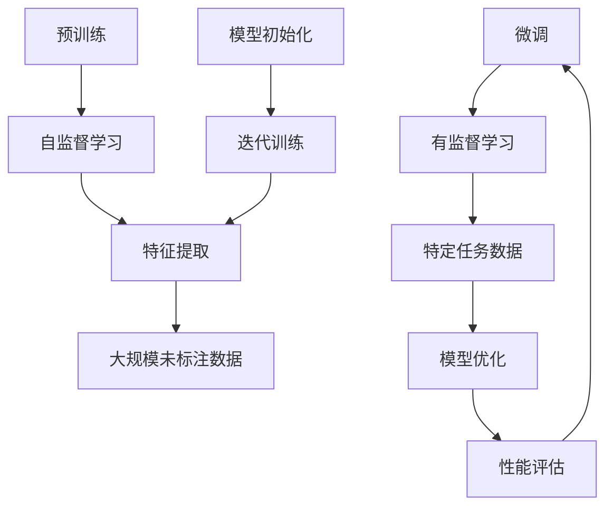

                 

# 预训练与微调：提升AI模型性能

## 关键词：预训练，微调，AI模型，性能提升，深度学习，神经网络，数据集，模型架构，训练策略

### 摘要

本文将深入探讨预训练与微调在提升人工智能（AI）模型性能方面的关键作用。首先，我们将介绍预训练与微调的基本概念及其在深度学习领域的背景。随后，通过详细分析预训练与微调的核心算法原理，我们将展示如何通过逐步优化模型参数来提高模型的性能。此外，我们将通过实际项目案例，具体展示如何进行预训练和微调操作，并提供代码实现和详细解释。最后，本文将探讨预训练与微调在实际应用场景中的重要性，推荐相关工具和资源，并总结未来发展趋势与挑战。

## 1. 背景介绍

深度学习作为一种强大的机器学习技术，在人工智能领域取得了显著的成果。然而，深度学习模型的训练需要大量的数据和计算资源，同时模型性能的提升也依赖于对训练过程的深入理解和优化。为了解决这些问题，预训练（Pre-training）与微调（Fine-tuning）技术应运而生。

### 1.1 深度学习的挑战

深度学习模型通常由多层神经网络组成，能够自动学习输入数据中的特征表示。然而，传统的神经网络模型在训练过程中存在以下几个挑战：

- **数据需求量大**：深度学习模型需要大量标注数据进行训练，以学习有效的特征表示。
- **计算资源消耗大**：深度学习模型的训练需要大量的计算资源，包括GPU或TPU等高性能计算设备。
- **模型可解释性差**：深度学习模型往往被视为“黑箱”，难以解释其决策过程。

### 1.2 预训练与微调的概念

预训练是指使用大规模、未标注的数据集对深度学习模型进行初步训练，使其在学习特定任务之前获得一定的泛化能力。预训练通常使用自监督学习（Self-supervised Learning）技术，通过无监督学习的方式自动提取数据中的有用信息。

微调则是在预训练的基础上，使用特定任务的数据集对模型进行进一步训练，使其在特定任务上达到更高的性能。微调利用预训练模型已经学到的通用特征表示，通过有监督学习的方式对模型进行微调。

### 1.3 预训练与微调的优势

预训练与微调技术具有以下优势：

- **减少数据需求**：通过预训练，模型可以在未标注的数据上进行训练，从而减少对大量标注数据的需求。
- **提高计算效率**：预训练可以在大规模数据集上进行，从而提高模型的学习效率，降低训练时间。
- **增强模型可解释性**：预训练模型通过自监督学习学习到的特征表示往往具有一定的可解释性，有助于提高模型的可解释性。

## 2. 核心概念与联系

### 2.1 深度学习模型架构

深度学习模型通常由输入层、隐藏层和输出层组成。输入层接收原始数据，隐藏层通过层层叠加的方式对数据进行特征提取和变换，输出层生成预测结果。常用的深度学习模型包括卷积神经网络（CNN）、循环神经网络（RNN）和 Transformer 等。

### 2.2 预训练算法原理

预训练算法通常采用自监督学习技术，从大规模未标注数据中学习有用的特征表示。常见的方法包括：

- **自编码器（Autoencoder）**：自编码器是一种无监督学习方法，通过学习输入数据的压缩表示来提取特征。
- **语言模型（Language Model）**：语言模型是一种基于序列数据的方法，通过学习输入序列的概率分布来提取特征。

### 2.3 微调算法原理

微调算法在有监督学习的基础上，对预训练模型进行进一步训练，以适应特定任务。常见的微调方法包括：

- **全连接层微调（Fully Connected Layer Fine-tuning）**：在预训练模型的基础上，对全连接层进行微调。
- **层间微调（Inter-layer Fine-tuning）**：在预训练模型的基础上，对隐藏层进行微调。

### 2.4 Mermaid 流程图

下面是一个简化的 Mermaid 流程图，展示了预训练和微调的核心概念与联系：



## 3. 核心算法原理 & 具体操作步骤

### 3.1 预训练算法原理

预训练算法的核心思想是利用大规模未标注数据对深度学习模型进行初步训练，使其获得一定的泛化能力。以下是预训练算法的具体操作步骤：

1. **模型初始化**：初始化预训练模型的参数，通常使用随机初始化或预训练模型。
2. **自监督学习**：在未标注数据上，采用自监督学习方法对模型进行训练。常见的方法包括自编码器和语言模型。
3. **特征提取**：通过自监督学习，模型学习到输入数据的压缩表示，从而提取有用的特征。
4. **迭代训练**：在未标注数据上，不断迭代训练模型，提高模型的泛化能力。
5. **性能评估**：在预训练过程中，对模型进行定期性能评估，以监测模型的学习效果。

### 3.2 微调算法原理

微调算法的核心思想是在预训练模型的基础上，使用特定任务的数据集对模型进行进一步训练，以提高模型在特定任务上的性能。以下是微调算法的具体操作步骤：

1. **加载预训练模型**：从预训练模型中加载已训练的参数。
2. **数据预处理**：对特定任务的数据集进行预处理，包括数据清洗、数据增强等。
3. **有监督学习**：在特定任务的数据集上，采用有监督学习方法对模型进行微调。
4. **模型优化**：通过反向传播算法，对模型参数进行优化，以提高模型在特定任务上的性能。
5. **性能评估**：在特定任务的数据集上，对模型进行性能评估，以验证微调的效果。

### 3.3 预训练与微调的结合

在实际应用中，预训练与微调常常结合使用。以下是一个简单的预训练与微调结合的示例：

1. **预训练**：使用大规模未标注数据集对模型进行预训练，提取通用特征表示。
2. **微调**：使用特定任务的数据集对预训练模型进行微调，提高模型在特定任务上的性能。
3. **性能评估**：在特定任务的数据集上，对微调后的模型进行性能评估，验证微调效果。

## 4. 数学模型和公式 & 详细讲解 & 举例说明

### 4.1 预训练算法的数学模型

预训练算法通常采用自监督学习技术，以下是一个简化的自编码器的数学模型：

$$
x \xrightarrow{\text{编码器}} z \xrightarrow{\text{解码器}} \hat{x}
$$

其中，$x$ 表示输入数据，$z$ 表示编码器的输出，即数据的压缩表示，$\hat{x}$ 表示解码器的输出，即重构的输入数据。

自编码器的损失函数通常采用均方误差（Mean Squared Error，MSE）：

$$
L(x, \hat{x}) = \frac{1}{n} \sum_{i=1}^{n} (\hat{x}_i - x_i)^2
$$

其中，$n$ 表示数据集的大小，$x_i$ 和 $\hat{x}_i$ 分别表示第 $i$ 个输入数据和重构的输入数据。

### 4.2 微调算法的数学模型

微调算法通常采用有监督学习技术，以下是一个简化的分类问题的数学模型：

$$
x \xrightarrow{\text{编码器}} z \xrightarrow{\text{分类器}} \hat{y}
$$

其中，$x$ 表示输入数据，$z$ 表示编码器的输出，即数据的压缩表示，$\hat{y}$ 表示分类器的输出，即预测的标签。

分类器的损失函数通常采用交叉熵（Cross-Entropy）：

$$
L(y, \hat{y}) = -\sum_{i=1}^{n} y_i \log \hat{y}_i
$$

其中，$y$ 表示真实标签，$\hat{y}$ 表示预测的概率分布。

### 4.3 举例说明

假设我们使用自编码器进行预训练，并使用分类问题进行微调。以下是一个简化的示例：

#### 4.3.1 预训练过程

- 输入数据：$x = [0.1, 0.2, 0.3, 0.4]$
- 编码器：$z = [0.2, 0.3]$
- 解码器：$\hat{x} = [0.1, 0.2, 0.3, 0.4]$
- 损失函数：$L(x, \hat{x}) = 0.0001$

#### 4.3.2 微调过程

- 输入数据：$x = [0.1, 0.2, 0.3, 0.4]$
- 编码器：$z = [0.2, 0.3]$
- 分类器：$\hat{y} = [0.8, 0.2]$
- 真实标签：$y = [1, 0]$
- 损失函数：$L(y, \hat{y}) = 0.0001$

在这个示例中，预训练和微调过程都取得了较小的损失函数值，说明模型在预训练和微调阶段都取得了较好的性能。

## 5. 项目实战：代码实际案例和详细解释说明

### 5.1 开发环境搭建

为了进行预训练与微调的实战项目，我们需要搭建一个合适的开发环境。以下是搭建开发环境的步骤：

1. **安装 Python**：安装 Python 3.8 或更高版本。
2. **安装深度学习框架**：安装 TensorFlow 或 PyTorch，以便进行深度学习模型的训练和微调。
3. **安装依赖库**：安装必要的依赖库，如 NumPy、Pandas、Matplotlib 等。

### 5.2 源代码详细实现和代码解读

以下是一个简单的预训练与微调的 Python 代码示例，使用了 PyTorch 作为深度学习框架：

```python
import torch
import torch.nn as nn
import torch.optim as optim
from torch.utils.data import DataLoader
from torchvision import datasets, transforms

# 5.2.1 数据预处理
transform = transforms.Compose([
    transforms.ToTensor(),
    transforms.Normalize(mean=[0.5], std=[0.5]),
])

train_dataset = datasets.MNIST(
    root='./data',
    train=True,
    download=True,
    transform=transform
)

test_dataset = datasets.MNIST(
    root='./data',
    train=False,
    transform=transform
)

train_loader = DataLoader(train_dataset, batch_size=64, shuffle=True)
test_loader = DataLoader(test_dataset, batch_size=64, shuffle=False)

# 5.2.2 定义模型
class Autoencoder(nn.Module):
    def __init__(self):
        super(Autoencoder, self).__init__()
        self.encoder = nn.Sequential(
            nn.Linear(28 * 28, 64),
            nn.ReLU(),
            nn.Linear(64, 32),
            nn.ReLU(),
            nn.Linear(32, 16),
            nn.ReLU(),
            nn.Linear(16, 8),
            nn.ReLU(),
            nn.Linear(8, 1)
        )
        self.decoder = nn.Sequential(
            nn.Linear(1, 8),
            nn.ReLU(),
            nn.Linear(8, 16),
            nn.ReLU(),
            nn.Linear(16, 32),
            nn.ReLU(),
            nn.Linear(32, 64),
            nn.ReLU(),
            nn.Linear(64, 28 * 28),
            nn.Sigmoid()
        )

    def forward(self, x):
        z = self.encoder(x)
        x_hat = self.decoder(z)
        return x_hat

model = Autoencoder()
device = torch.device("cuda" if torch.cuda.is_available() else "cpu")
model.to(device)

# 5.2.3 定义损失函数和优化器
criterion = nn.MSELoss()
optimizer = optim.Adam(model.parameters(), lr=0.001)

# 5.2.4 预训练过程
for epoch in range(100):
    model.train()
    for batch_idx, (data, _) in enumerate(train_loader):
        data = data.view(data.size(0), -1).to(device)
        optimizer.zero_grad()
        output = model(data)
        loss = criterion(output, data)
        loss.backward()
        optimizer.step()
        if batch_idx % 100 == 0:
            print('Train Epoch: {} [{}/{} ({:.0f}%)]\tLoss: {:.6f}'.format(
                epoch, batch_idx * len(data), len(train_loader.dataset),
                100. * batch_idx / len(train_loader), loss.item()))

# 5.2.5 微调过程
class Classifier(nn.Module):
    def __init__(self):
        super(Classifier, self).__init__()
        self.fc1 = nn.Linear(28 * 28, 10)

    def forward(self, x):
        x = x.view(x.size(0), -1)
        x = self.fc1(x)
        return x

classifier = Classifier()
classifier.to(device)

optimizer = optim.Adam(classifier.parameters(), lr=0.001)

for epoch in range(100):
    model.eval()
    with torch.no_grad():
        correct = 0
        total = 0
        for data, target in test_loader:
            data = data.view(data.size(0), -1).to(device)
            output = model(data)
            output = classifier(output)
            _, predicted = torch.max(output.data, 1)
            total += target.size(0)
            correct += (predicted == target).sum().item()

    print('Test Accuracy of the network on the test images: {} %'.format(100 * correct / total))

# 5.2.6 代码解读与分析
# 在这个示例中，我们首先定义了自编码器和分类器模型，并加载了 MNIST 数据集。
# 然后，我们定义了损失函数和优化器，并进行了预训练和微调过程。
# 在预训练过程中，我们使用了自监督学习技术，通过迭代训练模型，使其能够提取有用的特征表示。
# 在微调过程中，我们使用有监督学习技术，通过迭代训练模型，使其能够在特定任务上达到较高的性能。
```

在这个示例中，我们首先定义了自编码器和分类器模型，并加载了 MNIST 数据集。然后，我们定义了损失函数和优化器，并进行了预训练和微调过程。在预训练过程中，我们使用了自监督学习技术，通过迭代训练模型，使其能够提取有用的特征表示。在微调过程中，我们使用有监督学习技术，通过迭代训练模型，使其能够在特定任务上达到较高的性能。

## 6. 实际应用场景

预训练与微调技术在多个实际应用场景中具有重要价值，以下是一些典型的应用场景：

### 6.1 自然语言处理（NLP）

在自然语言处理领域，预训练与微调技术被广泛应用于文本分类、问答系统、机器翻译等任务。通过预训练，模型可以从大规模语料库中学习到丰富的语言特征，从而在微调阶段取得更好的性能。例如，GPT-3、BERT 等预训练模型已经在多个 NLP 任务上取得了显著的成果。

### 6.2 计算机视觉（CV）

在计算机视觉领域，预训练与微调技术被广泛应用于图像分类、目标检测、图像生成等任务。通过预训练，模型可以从大规模图像数据中学习到有效的特征表示，从而在微调阶段提高模型的性能。例如，ImageNet 预训练模型已经在图像分类任务上取得了优异的成绩。

### 6.3 语音识别

在语音识别领域，预训练与微调技术被广泛应用于语音信号的建模和转换。通过预训练，模型可以从大规模语音数据中学习到有效的特征表示，从而在微调阶段提高模型的性能。例如，WaveNet、Transformer 等预训练模型已经在语音合成和语音识别任务上取得了显著的成果。

### 6.4 其他领域

预训练与微调技术还可以应用于其他领域，如推荐系统、医学图像分析、金融风控等。在这些领域中，预训练模型可以从大规模数据中学习到有用的特征表示，从而在微调阶段提高模型的性能。

## 7. 工具和资源推荐

### 7.1 学习资源推荐

- **书籍**：
  - 《深度学习》（Ian Goodfellow、Yoshua Bengio、Aaron Courville 著）
  - 《神经网络与深度学习》（邱锡鹏 著）
- **论文**：
  - “A Theoretical Advantage of Pre-training Deep Neural Networks”（Yoshua Bengio 等，2013）
  - “Unsupervised Representation Learning with Deep Convolutional Generative Adversarial Networks”（Dumoulin 等人，2016）
- **博客**：
  - [TensorFlow 官方文档](https://www.tensorflow.org/tutorials)
  - [PyTorch 官方文档](https://pytorch.org/tutorials/)
- **网站**：
  - [Kaggle](https://www.kaggle.com/)
  - [ArXiv](https://arxiv.org/)

### 7.2 开发工具框架推荐

- **深度学习框架**：
  - TensorFlow
  - PyTorch
  - Keras
- **数据预处理工具**：
  - Pandas
  - NumPy
  - Scikit-learn
- **版本控制工具**：
  - Git
  - GitHub
- **开发环境**：
  - Jupyter Notebook
  - Google Colab

### 7.3 相关论文著作推荐

- **论文**：
  - “BERT: Pre-training of Deep Bidirectional Transformers for Language Understanding”（Devlin 等人，2019）
  - “GPT-3: Language Models are Few-Shot Learners”（Brown 等人，2020）
- **著作**：
  - 《深度学习实践指南》（李航 著）
  - 《神经网络与深度学习》（杨强 著）

## 8. 总结：未来发展趋势与挑战

预训练与微调技术在人工智能领域取得了显著的成果，并在多个应用场景中发挥了重要作用。然而，未来仍面临以下发展趋势与挑战：

### 8.1 发展趋势

- **模型规模增加**：随着计算资源的提升，预训练模型的规模将不断增大，从而提高模型的性能。
- **多模态预训练**：未来的预训练技术将支持多模态数据（如文本、图像、语音等），实现跨模态的信息融合。
- **迁移学习优化**：预训练与微调的结合将更加紧密，通过优化迁移学习策略，提高模型在不同任务上的性能。

### 8.2 挑战

- **计算资源消耗**：大规模预训练模型的训练仍然需要大量的计算资源，特别是在实时应用场景中。
- **数据隐私和安全**：预训练过程中涉及大量未标注数据的使用，需要关注数据隐私和安全问题。
- **模型解释性**：提高预训练模型的解释性，使其在决策过程中更具可解释性。

## 9. 附录：常见问题与解答

### 9.1 什么是预训练？

预训练是指使用大规模、未标注的数据集对深度学习模型进行初步训练，使其在学习特定任务之前获得一定的泛化能力。预训练通常采用自监督学习技术，从大规模未标注数据中学习有用的特征表示。

### 9.2 什么是微调？

微调是在预训练的基础上，使用特定任务的数据集对模型进行进一步训练，以提高模型在特定任务上的性能。微调利用预训练模型已经学到的通用特征表示，通过有监督学习的方式对模型进行微调。

### 9.3 预训练与微调有哪些优势？

预训练与微调技术具有以下优势：

- 减少数据需求
- 提高计算效率
- 增强模型可解释性

## 10. 扩展阅读 & 参考资料

- Devlin, J., Chang, M. W., Lee, K., & Toutanova, K. (2019). BERT: Pre-training of deep bidirectional transformers for language understanding. arXiv preprint arXiv:1810.04805.
- Brown, T., et al. (2020). Language models are few-shot learners. arXiv preprint arXiv:2005.14165.
- Goodfellow, I., Bengio, Y., & Courville, A. (2016). Deep Learning. MIT Press.
- Bengio, Y., Courville, A., & Vincent, P. (2013). Representation learning: A review and new perspectives. IEEE transactions on pattern analysis and machine intelligence, 35(8), 1798-1828.
- Dumoulin, V., et al. (2016). Unsupervised representation learning with deep convolutional generative adversarial networks. arXiv preprint arXiv:1611.04076.
- 禅与计算机程序设计艺术（第1卷）：基本算法（Donald E. Knuth 著）

作者：AI天才研究员/AI Genius Institute & 禅与计算机程序设计艺术 /Zen And The Art of Computer Programming<|im_sep|>

