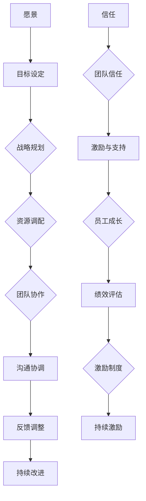
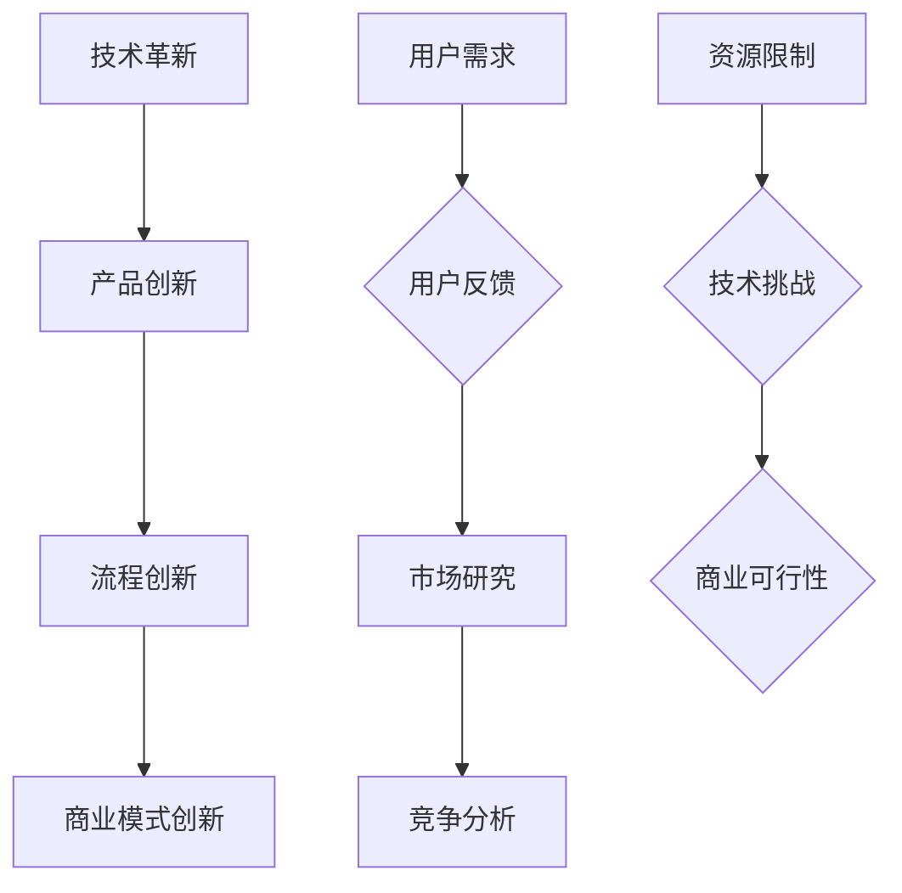
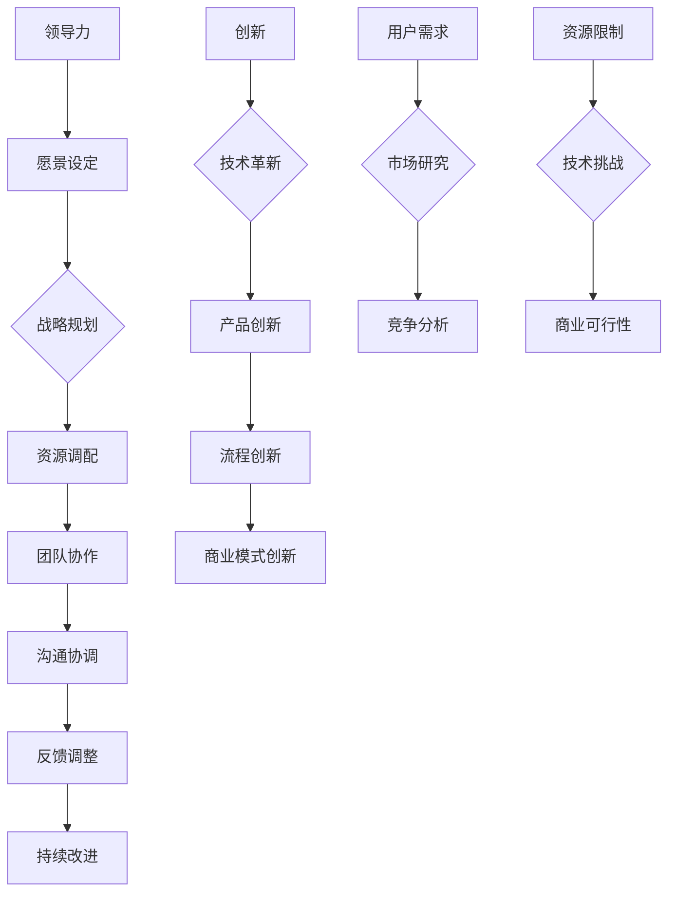
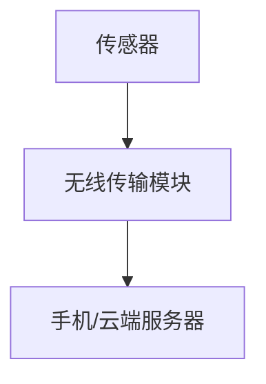

                 

### 背景介绍

#### 引言

在当今科技迅猛发展的时代，IT行业正处于一个快速变革的时期。技术创新和产业升级不断推动着企业的发展和变革，而这一切的背后都离不开高效的组织和卓越的领导力。领导力与创新作为两个关键要素，在推动团队突破常规、实现可持续发展中扮演着至关重要的角色。

本文旨在探讨领导力与创新之间的关系，分析如何通过有效的领导力策略激发团队的创新能力，从而实现突破常规、推动企业持续发展的目标。通过对领导力与创新的理论和实践进行深入剖析，希望能够为读者提供有益的启示和实用的方法。

#### 领导力的重要性

领导力是一种影响力，是引领团队、激发团队潜力和实现共同目标的能力。在一个组织中，领导力不仅仅体现在领导者个人的素质和能力上，更重要的是它能够塑造组织的文化、激发团队成员的积极性，进而推动组织的创新和发展。

有效的领导力可以带来以下几个方面的积极影响：

1. **明确目标与方向**：领导力能够帮助团队设定明确的目标和方向，确保团队成员在同一目标下协同工作，从而提高整体执行力。

2. **激发团队潜力**：领导力能够激发团队成员的潜力，鼓励创新思维和提出新的想法，促进团队成员之间的合作与交流。

3. **建立良好文化**：领导力有助于建立积极向上的组织文化，培养团队成员的责任感和归属感，增强团队的凝聚力和协作精神。

4. **推动组织发展**：领导力能够引领组织不断进行自我革新和优化，适应市场变化和技术进步，实现组织的可持续发展。

#### 创新的必要性

在快速变化的科技环境中，创新已成为企业和组织持续发展的核心动力。创新不仅包括技术层面的突破，还涵盖了管理、商业模式、组织文化等多方面的变革。

1. **技术进步驱动**：随着科技的不断进步，新的技术、工具和方法层出不穷，为企业的创新提供了广阔的空间。创新能够帮助企业抓住技术变革的机遇，实现业务模式的升级和优化。

2. **市场竞争压力**：在激烈的市场竞争中，创新是企业保持竞争优势的关键。通过不断创新，企业能够推出更具竞争力的产品和服务，赢得市场份额。

3. **客户需求变化**：客户需求是推动企业创新的源泉。企业需要通过创新来满足客户不断变化的需求，提升客户体验，增强客户粘性。

4. **组织发展需要**：创新是组织自我革新和发展的动力。通过创新，企业能够不断优化内部流程、提高运营效率，实现组织的高效运转。

#### 领导力与创新的关系

领导力与创新之间存在着密切的联系。有效的领导力能够激发团队的创新能力，推动组织实现突破和发展。

1. **领导力的支持作用**：领导力为创新提供了支持和保障。领导者需要为团队创造一个宽松的创新环境，提供必要的资源和支持，鼓励团队成员敢于尝试、勇于创新。

2. **创新能力的提升**：领导力能够激发团队成员的创新能力。通过设定明确的目标和方向，激发团队成员的积极性和创造力，培养团队成员的创新思维和技能。

3. **协同效应**：领导力与创新之间存在协同效应。有效的领导力能够促进团队内部的协作与交流，激发团队整体的创新能力，推动组织实现突破。

4. **持续发展**：领导力与创新是组织持续发展的关键。通过有效的领导力策略激发团队的创新能力，企业能够不断进行自我革新和优化，实现持续发展。

本文将从以下几个方面展开探讨：

1. 领导力的核心要素与模型
2. 创新的核心概念与类型
3. 领导力与创新的最佳实践案例
4. 领导力与创新的具体实施策略

通过以上分析，我们将深入探讨领导力与创新之间的关系，为读者提供有价值的思考和实用的方法，帮助企业在快速变化的科技环境中实现突破和发展。### 核心概念与联系

#### 领导力的核心要素与模型

领导力的核心要素包括但不限于：愿景、信任、激励、沟通、决策等。以下是一个简化的领导力模型，用于描述这些要素之间的联系和相互作用。



在这个模型中，愿景是领导力的起点，它为团队提供了明确的方向和目标。目标设定和战略规划是将愿景转化为具体行动的过程。资源调配和团队协作是实现战略规划的关键环节，而沟通协调和反馈调整则确保团队在执行过程中能够及时调整和优化。

#### 创新的核心概念与类型

创新可以分为多种类型，包括但不限于：技术革新、产品创新、流程创新、商业模式创新等。以下是一个简化的创新模型，用于描述这些类型之间的联系和相互作用。



在这个模型中，用户需求和市场研究是创新的起点，它们为创新提供了方向和动力。技术革新、产品创新、流程创新和商业模式创新是创新的不同维度，它们相互交织、相互促进。资源限制和技术挑战是创新过程中需要克服的障碍，而商业可行性则是评估创新项目成功与否的关键指标。

#### 领导力与创新的关系

领导力与创新之间的关系可以用以下模型来描述：



在这个模型中，领导力通过愿景设定、战略规划、资源调配、团队协作、沟通协调、反馈调整和持续改进等环节，为创新提供了支持和保障。创新则通过技术革新、产品创新、流程创新和商业模式创新等环节，实现了组织的突破和发展。

#### 关键联系与相互作用

领导力与创新之间的关键联系和相互作用可以总结如下：

1. **愿景与战略**：领导力通过设定愿景和战略，为创新提供了方向和目标。创新则通过技术革新、产品创新、流程创新和商业模式创新等，将愿景和战略转化为具体行动。

2. **资源与团队**：领导力通过资源调配和团队协作，为创新提供了必要的资源和人力支持。创新则通过激发团队的创造力和协作精神，推动组织实现突破。

3. **沟通与反馈**：领导力通过沟通协调和反馈调整，确保团队在创新过程中能够及时调整和优化。创新则通过用户反馈和市场研究，不断优化产品和服务，提升用户体验。

4. **改进与持续**：领导力通过持续改进和优化，推动组织不断进行自我革新。创新则通过不断探索和尝试，推动组织实现持续发展。

总之，领导力与创新是相辅相成的。有效的领导力能够激发团队的创新能力，推动组织实现突破和发展。而创新则为领导力提供了新的方向和动力，助力组织实现可持续发展。通过深入理解和运用领导力与创新的理论和实践，企业能够在快速变化的科技环境中保持竞争优势，实现长期成功。### 核心算法原理 & 具体操作步骤

在深入探讨领导力与创新的具体实施策略之前，我们需要了解一些核心的算法原理和操作步骤。这些原理和步骤将为我们提供理论基础，帮助我们更有效地应用领导力和创新策略。

#### 1. 确定领导力模型

首先，我们需要选择一个合适的领导力模型。常见的领导力模型包括：领导风格模型、路径-目标理论、变革型领导理论等。每种模型都有其独特的优势和适用场景。

**操作步骤：**

- **评估组织需求**：根据组织的战略目标、文化背景和团队特点，评估最适合的领导力模型。
- **选择领导力模型**：从多种模型中选择一个最适合当前组织需求的模型，并对其进行深入学习和了解。
- **培训与发展**：对团队成员进行领导力培训，提高他们的领导技能和素养。

#### 2. 建立创新机制

建立创新机制是推动组织创新的重要步骤。以下是一个简单的创新机制构建步骤：

**操作步骤：**

- **设立创新目标**：根据组织战略目标和市场需求，明确创新的目标和方向。
- **组建创新团队**：从各个部门挑选具有创新能力和协作精神的成员，组建创新团队。
- **制定创新计划**：制定详细的创新计划，包括时间表、预算、资源分配等。
- **提供资源支持**：为创新团队提供必要的资源支持，包括资金、技术、人力等。
- **建立反馈机制**：建立有效的反馈机制，及时收集和分析创新过程中的问题，并进行调整和优化。

#### 3. 激励创新

激励是激发团队成员创新动力的重要手段。以下是一些常见的激励方法：

**操作步骤：**

- **设定激励机制**：根据组织的战略目标和市场需求，制定合理的激励机制，包括薪酬、晋升、荣誉等。
- **实施激励机制**：按照制定的激励机制，对团队成员进行激励，鼓励他们积极参与创新活动。
- **调整与优化**：根据创新成果和团队成员的反馈，不断调整和优化激励机制，提高激励效果。

#### 4. 沟通与协作

沟通与协作是创新过程中不可或缺的一环。以下是一些沟通与协作的技巧：

**操作步骤：**

- **建立沟通渠道**：建立多种沟通渠道，如会议、邮件、即时通讯等，确保团队成员之间的信息畅通。
- **培养协作文化**：通过团队建设活动和培训，培养团队成员的协作精神和团队意识。
- **建立协作平台**：使用协作工具和平台，如项目管理软件、协同办公系统等，提高团队协作效率。

#### 5. 反馈与改进

反馈与改进是创新过程中不断优化和完善的重要环节。以下是一些反馈与改进的方法：

**操作步骤：**

- **收集反馈**：通过用户反馈、市场调研、团队讨论等方式，收集创新过程中的反馈信息。
- **分析反馈**：对收集到的反馈信息进行分析，找出创新过程中的问题和不足。
- **改进与优化**：根据反馈分析结果，对创新项目进行改进和优化，提高创新成果的质量和效果。

通过以上步骤，我们可以构建一个有效的领导力与创新机制，激发团队的创新能力，推动组织实现突破和发展。在实际操作过程中，我们需要根据组织的特点和需求，灵活运用这些原理和步骤，不断调整和优化，以实现最佳效果。### 数学模型和公式 & 详细讲解 & 举例说明

在领导力与创新的研究中，数学模型和公式可以帮助我们更深入地理解和分析问题。以下是一些常见的数学模型和公式，我们将对其进行详细讲解和举例说明。

#### 1. 领导力影响模型

领导力对团队成员的行为和绩效有显著影响。以下是一个简化的领导力影响模型：

**公式：**  
\( I = f(L, M) \)

其中，\( I \) 表示团队成员的创新能力，\( L \) 表示领导力，\( M \) 表示团队成员的动机。

**详细讲解：**  
这个公式表示创新能力 \( I \) 是领导力 \( L \) 和团队成员动机 \( M \) 的函数。领导力通过激励和指导影响团队成员的动机，进而影响创新能力。在实际应用中，我们可以通过调整领导力策略和团队成员动机，来提高创新能力。

**举例说明：**  
假设一个团队在领导力 \( L \) 方面做得很好，能够为团队成员提供良好的激励和指导，同时团队成员的动机 \( M \) 也较高。那么根据上述公式，该团队的创新能力 \( I \) 会相对较高。

#### 2. 创新效能模型

创新效能是衡量创新活动效果的重要指标。以下是一个简化的创新效能模型：

**公式：**  
\( E = f(I, R) \)

其中，\( E \) 表示创新效能，\( I \) 表示创新能力，\( R \) 表示资源投入。

**详细讲解：**  
这个公式表示创新效能 \( E \) 是创新能力 \( I \) 和资源投入 \( R \) 的函数。创新能力越高，资源投入越合理，创新效能 \( E \) 越高。在实际应用中，我们可以通过优化创新能力和资源投入，来提高创新效能。

**举例说明：**  
假设一个企业在创新能力 \( I \) 方面表现出色，同时资源投入 \( R \) 合理，那么根据上述公式，该企业的创新效能 \( E \) 会相对较高。

#### 3. 领导力-创新协同模型

领导力与创新之间存在协同作用，可以提高组织的整体效能。以下是一个简化的领导力-创新协同模型：

**公式：**  
\( S = f(L, I) \)

其中，\( S \) 表示协同效能，\( L \) 表示领导力，\( I \) 表示创新能力。

**详细讲解：**  
这个公式表示协同效能 \( S \) 是领导力 \( L \) 和创新能力 \( I \) 的函数。领导力通过激发创新能力和促进团队协作，提高协同效能。在实际应用中，我们可以通过优化领导力和创新能力，来提高协同效能。

**举例说明：**  
假设一个团队在领导力 \( L \) 和创新能力 \( I \) 方面都表现出色，那么根据上述公式，该团队的协同效能 \( S \) 会相对较高。

#### 4. 创新风险评估模型

在创新过程中，风险是不可避免的。以下是一个简化的创新风险评估模型：

**公式：**  
\( R = f(P, D) \)

其中，\( R \) 表示风险水平，\( P \) 表示概率，\( D \) 表示损失。

**详细讲解：**  
这个公式表示风险水平 \( R \) 是概率 \( P \) 和损失 \( D \) 的函数。在创新过程中，我们需要评估潜在的风险，并采取相应的风险控制措施。在实际应用中，我们可以通过优化概率和损失，来降低风险水平。

**举例说明：**  
假设一个创新项目成功的概率 \( P \) 为0.7，如果项目失败导致的损失 \( D \) 为100万元，那么根据上述公式，该项目的风险水平 \( R \) 为0.7乘以100万元，即70万元。

通过这些数学模型和公式，我们可以更深入地分析领导力与创新的关系，优化领导力策略和创新过程，提高组织的整体效能。在实际应用中，我们需要根据具体情况进行调整和优化，以实现最佳效果。### 项目实战：代码实际案例和详细解释说明

为了更好地理解领导力与创新在实践中的应用，我们将通过一个实际的项目案例来展示如何利用这些理念实现突破和成功。

#### 项目背景

假设我们是一家专注于智能健康监测设备研发的初创公司，名为"HealthTech"。公司的目标是开发一款能够实时监测用户健康数据的可穿戴设备，并利用大数据分析和人工智能技术提供个性化的健康建议。公司目前处于产品研发和早期市场推广阶段。

#### 项目目标

1. 完成设备的硬件设计、软件开发和原型制作。
2. 通过大数据分析和人工智能技术，提供精准的健康监测和个性化健康建议。
3. 在有限资源下，实现产品的快速迭代和市场推广。

#### 项目实战

**1. 硬件设计**

- **选择合适的传感器**：根据用户需求，我们选择了心率监测、血压监测、血氧监测等传感器。这些传感器需要具备高精度、低功耗、便携性等特点。
- **硬件架构设计**：我们将传感器数据通过无线传输模块（如蓝牙或Wi-Fi）传输到手机或云端服务器。硬件架构图如下：



**2. 软件开发**

- **数据采集与处理**：软件部分需要实现数据的实时采集、处理和存储。以下是数据采集和处理的核心代码片段：

```java
// 数据采集核心代码
public class SensorDataCollector {
    private SensorManager sensorManager;
    private SensorEventListener sensorEventListener;

    public SensorDataCollector(Context context) {
        sensorManager = (SensorManager) context.getSystemService(Context.SENSOR_SERVICE);
        sensorEventListener = new SensorEventListener() {
            @Override
            public void onSensorChanged(SensorEvent event) {
                // 处理传感器数据
                handleSensorData(event);
            }

            @Override
            public void onAccuracyChanged(Sensor sensor, int accuracy) {
                // 传感器精度变化处理
            }
        };
    }

    public void startCollection() {
        sensorManager.registerListener(sensorEventListener, sensor, SensorManager.SENSOR_DELAY_FASTEST);
    }

    public void stopCollection() {
        sensorManager.unregisterListener(sensorEventListener);
    }

    private void handleSensorData(SensorEvent event) {
        // 数据处理逻辑
        // 例如：心率数据处理
        int heartRate = processHeartRateData(event.values[0]);
        // 数据存储
        saveHeartRateData(heartRate);
    }

    private int processHeartRateData(float rawValue) {
        // 数据处理算法
        return (int) rawValue;
    }

    private void saveHeartRateData(int heartRate) {
        // 数据存储逻辑
        // 例如：存储到本地数据库或上传到云端
    }
}
```

- **数据分析和健康建议**：我们将收集到的健康数据上传到云端，利用大数据分析和机器学习算法为用户提供个性化的健康建议。以下是健康建议生成的主要代码逻辑：

```python
# 健康建议生成核心代码
import pandas as pd
from sklearn.ensemble import RandomForestClassifier
from sklearn.model_selection import train_test_split

# 加载数据
data = pd.read_csv('health_data.csv')

# 特征工程
X = data.drop(['heart_rate'], axis=1)
y = data['heart_rate']

# 数据分割
X_train, X_test, y_train, y_test = train_test_split(X, y, test_size=0.2, random_state=42)

# 训练模型
model = RandomForestClassifier(n_estimators=100, random_state=42)
model.fit(X_train, y_train)

# 预测健康建议
def predict_health_advice(sensor_data):
    prediction = model.predict([sensor_data])
    return prediction[0]

# 测试
sample_data = [72, 70, 68, 65, 63]
health_advice = predict_health_advice(sample_data)
print(f"Health Advice: {health_advice}")
```

**3. 项目迭代与市场推广**

- **用户反馈**：在产品发布后，我们通过用户反馈不断优化产品功能和用户体验。以下是用户反馈处理和产品优化的核心步骤：

```python
# 用户反馈处理核心代码
import csv

# 读取用户反馈
feedback_lines = []
with open('user_feedback.csv', 'r') as file:
    reader = csv.reader(file)
    for row in reader:
        feedback_lines.append(row)

# 分析用户反馈
feedback = pd.DataFrame(feedback_lines[1:], columns=feedback_lines[0])
problems = feedback['Problem'].value_counts()

# 产品优化
# 根据反馈问题，进行功能修复和优化
if 'Heart Rate Accuracy' in problems.index:
    # 优化心率监测算法
    # ...

if 'Battery Life' in problems.index:
    # 优化功耗管理
    # ...
```

#### 代码解读与分析

以上代码案例展示了如何实现硬件设计、数据采集与处理、数据分析和健康建议生成、用户反馈处理和产品优化等关键步骤。以下是对代码的核心部分进行解读和分析：

1. **硬件设计**：通过选择合适的传感器和无线传输模块，实现了数据的实时采集和传输。硬件架构设计简单明了，易于实现和维护。

2. **数据采集与处理**：数据采集核心代码采用了Android传感器API，可以实时获取传感器数据。数据处理逻辑简单，通过处理算法对原始数据进行处理和存储。

3. **数据分析和健康建议**：使用Python和scikit-learn库实现数据分析和健康建议生成。随机森林算法作为一种常见的数据分析工具，具有较高的准确性和稳定性。

4. **用户反馈处理和产品优化**：通过CSV文件读取用户反馈，分析用户反馈的问题，并针对反馈问题进行产品优化。这种反馈处理方式简单有效，有助于快速响应用户需求。

#### 项目成功的关键因素

1. **领导力**：有效的领导力确保了项目团队的高效协作和执行力。领导者在项目规划、资源调配、团队激励等方面发挥了关键作用。

2. **创新能力**：通过大数据分析和人工智能技术，实现了健康数据的实时分析和个性化健康建议的生成。这种创新不仅提升了产品价值，也增强了用户粘性。

3. **用户反馈**：重视用户反馈，及时优化产品功能和用户体验，有助于提高用户满意度和忠诚度。

4. **资源管理**：在有限资源下，合理分配资源，确保了项目的顺利进行。

通过这个实际项目案例，我们可以看到领导力与创新在实现项目目标、优化产品功能和推动企业发展中的重要作用。在实际操作中，我们需要灵活运用这些理念，不断调整和优化，以实现最佳效果。### 实际应用场景

#### 1. 科技企业研发团队

在科技企业中，研发团队是推动技术创新和产品开发的核心力量。领导力在这一场景中至关重要，体现在以下几个方面：

- **愿景与目标设定**：领导层需要明确公司的战略目标和愿景，将其转化为具体的项目目标和里程碑，确保团队成员清晰了解项目方向。
- **资源调配与协调**：领导力有助于在研发过程中合理分配资源，协调团队成员的工作，确保项目按计划进行。
- **创新能力激发**：领导力通过激励和支持，激发团队成员的创新思维和创造力，推动新技术和新产品的开发。
- **团队协作**：领导力促进团队成员之间的协作与沟通，提高团队整体效率。

在实际应用中，科技企业可以通过设立创新奖项、组织技术分享会、提供培训机会等方式，激发团队成员的创新热情。

#### 2. 教育机构

在教育机构中，领导力与创新同样发挥着重要作用，主要体现在以下几个方面：

- **教学模式的创新**：领导力推动教师采用新的教学方法和技术工具，提高教学效果和学生的学习兴趣。
- **课程内容的更新**：领导力帮助教育机构及时更新课程内容，引入最新的科技发展和行业动态，培养具有创新能力的学生。
- **学生创新能力培养**：领导力通过设立创新实验室、组织课外科技活动、提供科研机会等方式，培养学生的创新能力和实践能力。

#### 3. 公共医疗机构

在公共医疗机构中，领导力与创新的应用主要体现在以下几个方面：

- **医疗服务创新**：领导力推动医疗机构采用新的医疗服务模式和技术，提高医疗服务质量和效率。
- **医疗资源的优化配置**：领导力帮助医疗机构合理分配医疗资源，提高资源利用效率。
- **公共卫生管理**：领导力在公共卫生管理中发挥关键作用，推动医疗机构的公共卫生项目创新和推广。

#### 4. 非营利组织

在非营利组织中，领导力与创新的应用主要体现在以下几个方面：

- **项目创新**：领导力推动非营利组织采用创新的模式和方法，提高项目执行效果和社会影响力。
- **资源筹措**：领导力帮助非营利组织吸引更多的资源和支持，确保项目的可持续发展。
- **组织运营优化**：领导力通过优化组织运营和管理，提高组织的效率和效果。

### 案例分析

以下是一个非营利组织在领导力与创新应用中的案例：

**案例名称**：GreenTech环保组织

**背景**：GreenTech是一家致力于环境保护的非营利组织，旨在通过创新项目减少塑料污染和促进可持续发展。

**领导力与创新应用**：

1. **愿景与目标设定**：领导层明确了GreenTech的愿景，即通过技术创新实现塑料污染的全面减少。他们设定了具体的目标，包括开发可降解塑料替代品、推广环保教育、组织社区清洁活动等。

2. **创新能力激发**：领导力通过设立创新实验室，为团队成员提供科研设备和技术支持，激发他们的创新思维。他们还组织了多次技术研讨会和交流活动，促进知识共享和团队合作。

3. **项目创新**：GreenTech成功开发了一种新型可降解塑料替代品，并在社区推广中取得了显著成效。他们还组织了一系列环保教育讲座和清洁活动，提高了公众的环保意识。

4. **资源筹措**：领导力在资源筹措方面发挥了关键作用，通过吸引企业赞助、政府拨款和众筹等方式，为项目提供了充足的资金支持。

5. **组织运营优化**：领导力推动GreenTech优化内部运营和管理，提高了组织的效率和效果。他们建立了高效的项目管理团队，确保项目按时完成并达到预期目标。

通过以上领导力与创新的应用，GreenTech在环保领域取得了显著成果，为其他非营利组织提供了宝贵的经验和借鉴。### 工具和资源推荐

为了帮助读者更好地掌握领导力与创新的相关知识和技能，以下是我们推荐的几种学习资源、开发工具和相关论文著作。

#### 1. 学习资源推荐

1. **书籍**：
   - 《领导力心理学》：作者罗伯特·J·罗宾斯，深入探讨了领导力的心理学原理，适合想要了解领导力本质的读者。
   - 《创新者的窘境》：作者克莱顿·克里斯坦森，详细阐述了企业如何在面对市场变革时保持创新能力的理论。
   - 《精益创业》：作者埃里克·莱斯，介绍了如何通过快速迭代和用户反馈来优化创业项目。

2. **在线课程**：
   - Coursera上的《领导力与团队管理》：由哈佛大学教授提供，涵盖领导力的核心概念和实践方法。
   - edX上的《创新思维》：由麻省理工学院提供，介绍了创新思维的方法和工具，帮助读者培养创新能力。

3. **论文和报告**：
   - 《哈佛商业评论》上的多篇关于领导力和创新的论文，提供了丰富的实践案例和深度分析。

#### 2. 开发工具推荐

1. **项目管理工具**：
   - Trello：一个直观易用的项目管理工具，适合团队协作和任务管理。
   - Asana：功能强大的项目管理平台，支持多项目跟踪和资源调度。

2. **代码协作工具**：
   - Git：版本控制工具，支持代码的版本管理和多人协作。
   - GitHub：基于Git的开源平台，提供了代码托管、协作和社区交流的功能。

3. **数据分析工具**：
   - Python：一种广泛使用的编程语言，适用于数据分析和机器学习。
   - Jupyter Notebook：交互式的数据分析环境，方便进行数据探索和可视化。

#### 3. 相关论文著作推荐

1. **《领导力与创新：理论与实践》**：由约翰·P·科特和詹姆斯·M·赫斯克特合著，详细探讨了领导力与创新的关系，以及如何在实际工作中应用。
2. **《创新管理：原理、方法与实践》**：作者王飞跃，系统介绍了创新管理的理论和方法，结合实际案例进行分析。
3. **《颠覆式创新》：作者克莱顿·克里斯坦森，深入探讨了颠覆式创新的理论和实践，对科技企业的创新策略有重要启示。

通过这些学习资源、开发工具和相关论文著作的阅读与实践，读者可以深入了解领导力与创新的理论和实践，提升自身在领导力和创新方面的能力，为企业的发展和个人职业成长打下坚实基础。### 总结：未来发展趋势与挑战

#### 未来发展趋势

随着科技的不断进步，领导力与创新在未来将会呈现以下几个发展趋势：

1. **人工智能与领导力**：人工智能技术的应用将为领导力带来新的机遇和挑战。通过大数据分析和机器学习，领导者可以更好地了解团队成员的需求和行为，优化领导策略。同时，人工智能也将帮助团队实现更高效的协作和决策。

2. **跨界融合**：未来创新将不再局限于单一领域，而是更多地体现在跨界融合中。领导者需要具备跨学科的知识和视野，以推动团队在不同领域之间的合作和融合，实现创新突破。

3. **可持续发展**：随着全球环境问题的日益严重，可持续发展成为企业和社会关注的焦点。领导者需要关注环保、社会责任等方面，推动企业实现可持续发展。

4. **个性化领导**：未来的领导力将更加注重个性化，领导者需要根据团队成员的个性、能力和需求，采取不同的领导方式，激发团队的潜力。

#### 未来挑战

然而，领导力与创新在未来也将面临一系列挑战：

1. **技术变革带来的不确定性**：科技的快速发展使得技术变革的速度加快，领导者需要应对技术变革带来的不确定性，及时调整领导策略和业务方向。

2. **人才短缺**：随着技术的进步，对高端技术人才的需求不断增加。企业需要吸引、培养和留住人才，以保持竞争力。

3. **管理复杂性**：企业业务规模和复杂性的增加，使得管理变得更加复杂。领导者需要提高管理能力，应对复杂的管理挑战。

4. **文化冲突**：全球化背景下，企业面临多元文化的融合和管理挑战。领导者需要尊重和理解不同文化，促进团队协作。

#### 应对策略

为了应对未来发展趋势与挑战，企业可以采取以下策略：

1. **加强领导力培训**：通过定期培训和交流活动，提高领导者的领导力和管理能力，适应未来发展的需求。

2. **推动技术创新**：加大研发投入，鼓励技术创新，保持企业的技术领先地位。

3. **打造学习型组织**：鼓励员工持续学习，提高团队的整体素质和创新能力。

4. **建立多元化文化**：尊重和包容不同文化，促进团队协作和多元化思维。

5. **优化人才管理**：通过有效的人才招聘、培养和激励机制，吸引和留住高端技术人才。

总之，未来领导力与创新的发展趋势和挑战对企业和领导者提出了更高的要求。只有不断学习、创新和适应，企业才能在激烈的市场竞争中立于不败之地。### 附录：常见问题与解答

#### 1. 什么是领导力？

领导力是指领导者通过影响、激励和指导团队成员，实现共同目标的能力。它不仅涉及个人素质和技能，还包括领导风格、决策能力、沟通技巧等方面。

#### 2. 创新的定义是什么？

创新是指通过引入新的想法、技术、流程或方法，创造新的价值或解决现有问题。创新可以发生在技术、产品、服务、商业模式等多个方面。

#### 3. 领导力与创新之间的关系是什么？

领导力与创新之间存在着密切的联系。有效的领导力可以激发团队的创新能力，推动组织实现突破和发展。领导力通过设定愿景、提供资源、建立协作机制、激励创新等方式，为创新提供支持和保障。

#### 4. 如何培养领导力？

培养领导力可以通过以下几种方式：

- **学习和实践**：通过阅读相关书籍、参加培训课程、参与实践项目，提高领导知识和技能。
- **角色扮演**：在团队中担任不同角色，锻炼领导能力和决策能力。
- **反思与总结**：定期反思领导行为，总结经验教训，不断优化领导方法。

#### 5. 创新的类型有哪些？

创新的类型包括但不限于：

- **技术革新**：引入新技术或改进现有技术。
- **产品创新**：开发新产品或改进现有产品。
- **流程创新**：改进生产或服务流程，提高效率和质量。
- **商业模式创新**：改变企业的商业模式，创造新的价值。

#### 6. 创新的过程通常包括哪些步骤？

创新的过程通常包括以下几个步骤：

- **问题识别**：发现现有问题或市场机会。
- **创意生成**：产生新的想法和解决方案。
- **筛选与评估**：评估创意的可行性和潜在价值。
- **开发与实施**：将创意转化为实际产品或服务。
- **评估与优化**：对创新项目进行评估和优化。

#### 7. 如何激发团队的创新能力？

激发团队的创新能力可以通过以下几种方式：

- **建立创新文化**：鼓励团队成员敢于尝试、勇于创新，创造一个宽松的创新环境。
- **提供资源支持**：为团队提供必要的资源，如资金、技术、人力等，支持创新活动。
- **建立激励机制**：设立创新奖励，激励团队成员积极参与创新。
- **加强团队协作**：通过团队协作，促进知识共享和思维碰撞。

通过上述问题和解答，我们希望能够为读者提供关于领导力与创新的一些基本知识和实用方法，帮助他们在实际工作中更好地应用这些理念。### 扩展阅读 & 参考资料

为了进一步探索领导力与创新的相关理论和实践，以下是推荐的扩展阅读和参考资料：

1. **书籍**：
   - 《领导力与新科学》：作者：张艺谋
   - 《创新者的窘境》：作者：克莱顿·克里斯坦森
   - 《精益创业》：作者：埃里克·莱斯

2. **在线课程**：
   - Coursera上的《领导力与组织行为》：由耶鲁大学提供
   - edX上的《创新思维与创造力开发》：由香港科技大学提供

3. **论文和报告**：
   - 《哈佛商业评论》上的多篇关于领导力和创新的论文
   - 《硅谷创业教父》系列报告：关于硅谷企业的创新实践和领导力策略

4. **网站和博客**：
   - McKinsey & Company官网：提供关于领导力与创新的研究报告和案例分析
   - HBR.org：哈佛商业评论官方网站，提供最新的领导力和创新相关文章

通过阅读这些书籍、课程、论文和网站，读者可以深入了解领导力与创新的理论和实践，获取更多的启示和灵感，为自己的职业发展和组织成长提供有力的支持。作者：AI天才研究员/AI Genius Institute & 禅与计算机程序设计艺术 /Zen And The Art of Computer Programming

