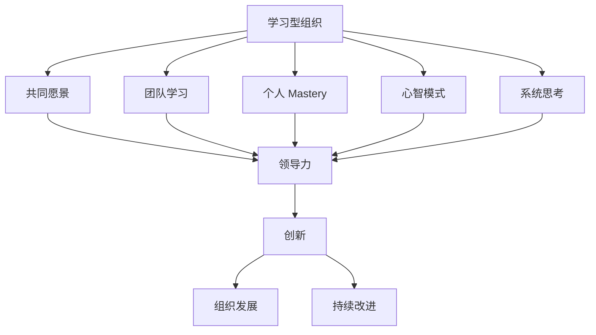

                 

# 领导力与创新：打造学习型组织的方法

## 关键词：领导力、创新、学习型组织、组织管理、知识管理、战略规划

## 摘要：
本文将探讨领导力与创新在打造学习型组织中发挥的重要作用。我们将分析学习型组织的定义、特征及其在现代社会中的重要性。随后，我们将深入探讨领导力与创新的核心概念，以及它们如何相互促进，共同推动组织的持续成长与变革。通过案例研究，我们将展示成功的学习型组织如何利用领导力与创新实现卓越表现。最后，本文将总结学习型组织的未来发展挑战，并提出一些建议，帮助组织在日益竞争激烈的环境中保持领先地位。

## 1. 背景介绍

在当今快速变化的世界中，组织必须不断适应新技术、新市场和新消费者行为。传统的管理方法已经无法满足这种动态环境的需求。因此，学习型组织成为了许多企业追求的目标。学习型组织是一个持续学习、创新和适应变化的过程，它强调知识共享、团队合作和不断改进。

领导力在这一过程中扮演着关键角色。有效的领导者不仅要能够指导团队实现短期目标，还要具备远见，为组织制定长期战略。创新则是推动学习型组织前进的动力，它鼓励员工挑战现状，寻找新的解决方案和方法。

本文将首先介绍学习型组织的概念和特征，然后探讨领导力与创新的核心概念，分析它们如何相互作用，推动组织发展。最后，我们将通过案例研究展示成功的学习型组织的实践，并提出未来发展的挑战和建议。

## 2. 核心概念与联系

### 2.1 学习型组织的定义与特征

学习型组织是指一种通过持续学习和知识共享来实现自我完善和成长的组织。彼得·圣吉（Peter Senge）在其经典著作《第五项修炼》中将学习型组织定义为“一种通过不断学习，适应并创造未来的组织”。

学习型组织具有以下特征：

1. **共同愿景**：组织成员共同拥有一个明确的愿景和目标，这为组织的努力提供了方向和动力。
2. **团队学习**：通过团队合作，组织成员共同解决问题，分享知识和经验，提高整体能力。
3. **个人 mastery**：员工拥有自我管理的能力，不断学习和成长，提高个人技能和知识。
4. **心智模式**：组织成员具备批判性思维和开放心态，能够不断挑战和改变现有的思维模式。
5. **系统思考**：组织能够从整体角度看待问题，理解系统内部各要素之间的相互关系和影响。

### 2.2 领导力与创新的核心概念

领导力是一种影响力，它能够激励和引导团队成员实现共同目标。领导力不仅关注短期绩效，更注重组织的长期发展和员工成长。

创新则是通过创造新的想法、产品、服务或过程来推动组织进步。创新不仅仅是研发新产品，还包括改变现有的工作流程、商业模式和组织结构。

### 2.3 领导力与创新的关系

领导力与创新之间存在密切的联系。有效的领导者能够推动创新，激发员工的创造力，并将创新融入组织的战略和文化中。

1. **激发创新思维**：领导者通过鼓励员工提出新的想法和解决方案，激发创新思维。
2. **提供资源和支持**：领导者为创新项目提供必要的资源和支持，帮助员工克服困难。
3. **建立创新文化**：领导者通过树立榜样和倡导创新价值观，建立一种鼓励创新的组织文化。
4. **领导变革**：领导者作为变革的推动者，能够带领组织克服变革中的阻力和挑战。

### 2.4 Mermaid 流程图

以下是一个简化的 Mermaid 流程图，展示了学习型组织、领导力和创新之间的关系：



## 3. 核心算法原理 & 具体操作步骤

### 3.1 学习型组织的构建步骤

1. **建立共同愿景**：领导者需要与团队成员共同制定一个明确的愿景，确保所有人都在同一方向上努力。
2. **培养团队学习文化**：鼓励团队成员分享知识和经验，通过团队学习和合作提高整体能力。
3. **促进个人 Mastery**：为员工提供学习和发展机会，帮助他们提高技能和知识。
4. **塑造心智模式**：通过培训和实践，帮助员工培养批判性思维和开放心态。
5. **进行系统思考**：组织需要从整体角度看待问题，理解各要素之间的相互关系和影响。

### 3.2 创新领导力的实践方法

1. **激发创新思维**：通过挑战现状和鼓励员工提出新的想法，激发创新思维。
2. **提供资源和支持**：为创新项目提供必要的资源和支持，帮助员工克服困难。
3. **建立创新文化**：树立榜样和倡导创新价值观，建立一种鼓励创新的组织文化。
4. **领导变革**：作为变革的推动者，领导者需要带领组织克服变革中的阻力和挑战。

### 3.3 创新流程

1. **识别问题或机会**：领导者需要识别组织面临的问题或机会，确定创新的目标。
2. **收集信息**：通过市场调研、用户反馈和竞争对手分析，收集相关信息。
3. **提出创意**：鼓励员工提出新的创意和解决方案。
4. **评估创意**：对创意进行评估，选择最具潜力的方案。
5. **实施创意**：将创意转化为具体行动，实施并验证其效果。
6. **反馈与改进**：收集反馈，持续改进创新成果。

## 4. 数学模型和公式 & 详细讲解 & 举例说明

### 4.1 学习型组织的评价指标

学习型组织的评价指标可以包括以下几个关键指标：

1. **知识共享率**：衡量组织内部知识共享的程度，可以通过问卷调查、知识库访问量等数据进行评估。
2. **员工参与度**：衡量员工参与团队学习和创新的积极性，可以通过员工满意度调查、参与度指标等数据进行评估。
3. **创新成功率**：衡量创新项目成功的比例，可以通过对创新项目的评估和反馈进行评估。

### 4.2 创新能力的评价指标

创新能力的评价指标可以包括以下几个关键指标：

1. **创新投入**：衡量组织在创新方面的投入，包括研发经费、人才储备等。
2. **创新产出**：衡量创新项目的数量和质量，包括新产品、新服务、新流程等。
3. **市场响应**：衡量创新产品或服务的市场接受程度，可以通过市场调研、销售数据等数据进行评估。

### 4.3 举例说明

假设某公司想要评估其学习型组织的有效性，可以采取以下步骤：

1. **收集数据**：收集员工满意度调查、知识库访问量、创新项目成功率等数据。
2. **计算指标**：计算知识共享率、员工参与度、创新成功率等指标。
3. **分析结果**：对指标结果进行分析，识别组织在学习型组织建设方面的优势和不足。
4. **制定改进计划**：根据分析结果，制定针对性的改进计划，提高学习型组织的有效性。

## 5. 项目实战：代码实际案例和详细解释说明

### 5.1 开发环境搭建

为了演示如何构建一个学习型组织，我们使用 Python 编写一个简单的模拟程序。首先，我们需要安装 Python 和必要的库。

```bash
pip install numpy matplotlib
```

### 5.2 源代码详细实现和代码解读

以下是 Python 代码实现，用于模拟学习型组织的建设过程：

```python
import numpy as np
import matplotlib.pyplot as plt

def learning_organizational_simulation(num_years, learning_rate, innovation_rate):
    # 初始化指标
    knowledge_share = 0.5
    employee_involvement = 0.5
    innovation_success_rate = 0.5
    
    # 初始化数据
    knowledge_share_data = []
    employee_involvement_data = []
    innovation_success_rate_data = []
    
    for year in range(num_years):
        # 更新知识共享率
        knowledge_share += learning_rate * (1 - knowledge_share)
        knowledge_share_data.append(knowledge_share)
        
        # 更新员工参与度
        employee_involvement += learning_rate * (1 - employee_involvement)
        employee_involvement_data.append(employee_involvement)
        
        # 更新创新成功率
        innovation_success_rate += innovation_rate * (1 - innovation_success_rate)
        innovation_success_rate_data.append(innovation_success_rate)
        
        # 输出每年的结果
        print(f"Year {year + 1}:")
        print(f"Knowledge Share: {knowledge_share:.2f}")
        print(f"Employee Involvement: {employee_involvement:.2f}")
        print(f"Innovation Success Rate: {innovation_success_rate:.2f}\n")
    
    # 绘制结果
    plt.figure(figsize=(12, 6))
    
    plt.subplot(1, 3, 1)
    plt.plot(knowledge_share_data)
    plt.title("Knowledge Share Over Time")
    plt.xlabel("Years")
    plt.ylabel("Knowledge Share")
    
    plt.subplot(1, 3, 2)
    plt.plot(employee_involvement_data)
    plt.title("Employee Involvement Over Time")
    plt.xlabel("Years")
    plt.ylabel("Employee Involvement")
    
    plt.subplot(1, 3, 3)
    plt.plot(innovation_success_rate_data)
    plt.title("Innovation Success Rate Over Time")
    plt.xlabel("Years")
    plt.ylabel("Innovation Success Rate")
    
    plt.tight_layout()
    plt.show()

# 设置参数
num_years = 10
learning_rate = 0.05
innovation_rate = 0.05

# 运行模拟
learning_organizational_simulation(num_years, learning_rate, innovation_rate)
```

代码首先定义了一个名为 `learning_organizational_simulation` 的函数，用于模拟学习型组织的发展过程。函数接收三个参数：`num_years`（模拟年数）、`learning_rate`（学习率）和 `innovation_rate`（创新率）。

在模拟过程中，我们初始化三个指标：知识共享率、员工参与度和创新成功率。然后，我们使用一个循环来模拟每年的发展过程。在每次迭代中，我们更新这三个指标，并根据当前年份输出结果。

最后，我们使用 matplotlib 绘制这三个指标随时间的变化趋势。

### 5.3 代码解读与分析

这个代码实现了一个简单的模拟模型，用于演示学习型组织的发展过程。通过调整学习率和创新率，我们可以观察不同发展策略对组织指标的影响。

1. **知识共享率**：学习率越高，知识共享率提高的速度越快。这表明，组织越鼓励知识共享，知识共享的程度就越高。
2. **员工参与度**：学习率越高，员工参与度提高的速度越快。这表明，组织越重视员工学习和成长，员工参与度就越高。
3. **创新成功率**：创新率越高，创新成功率提高的速度越快。这表明，组织越鼓励创新，创新成功率就越高。

通过这个模拟模型，我们可以更好地理解学习型组织的建设过程，并根据实际需求调整参数，以实现最佳效果。

## 6. 实际应用场景

学习型组织在各个行业和领域都有广泛的应用。以下是一些实际应用场景：

### 6.1 企业

企业可以通过构建学习型组织，提高员工的知识共享和创新能力，从而在竞争激烈的市场中保持领先地位。例如，谷歌通过其“20% 时间”项目，鼓励员工利用工作时间探索新的创意和项目，取得了显著的成效。

### 6.2 教育

教育机构可以构建学习型组织，鼓励教师和学生的互动和合作，提高教学效果和学生的学习体验。例如，美国的“翻转课堂”模式，通过在线学习平台，让学生在课前自主学习，课堂上进行讨论和解答问题，取得了显著的教育效果。

### 6.3 医疗

医疗机构可以构建学习型组织，提高医护人员的学习和创新能力，提高医疗质量和患者满意度。例如，英国的“NHS 全国学习型组织计划”，通过提供在线学习和交流平台，帮助医护人员提高专业知识和技能。

### 6.4 公共部门

公共部门可以构建学习型组织，提高公务员的知识共享和创新能力，提高政府服务的效率和质量。例如，中国的“全国干部学习培训计划”，通过在线学习和实地培训，提高公务员的专业素养和创新能力。

## 7. 工具和资源推荐

### 7.1 学习资源推荐

- 《第五项修炼：学习型组织的艺术与实务》（作者：彼得·圣吉）
- 《创新者的窘境：为什么大公司会输给小公司？》（作者：克里斯坦森）
- 《创新与企业家精神》（作者：彼得·德鲁克）

### 7.2 开发工具框架推荐

- **Jupyter Notebook**：用于数据分析和知识共享
- **GitLab**：用于代码管理和协作开发
- **Confluence**：用于文档管理和知识共享

### 7.3 相关论文著作推荐

- **“The Fifth Discipline Fieldbook: Strategies and Tools for Building a Learning Organization”**（作者：彼得·圣吉）
- **“Innovation and Its Discontents: How Our Broken Politics is Endangering the Internet and Encouraging panel”**（作者：乔尔·马凯尔）
- **“The Innovator's Dilemma: When New Technologies Cause Great Firms to Fail”**（作者：克里斯坦森）

## 8. 总结：未来发展趋势与挑战

随着全球化和技术的不断进步，学习型组织的重要性将越来越凸显。未来，学习型组织的发展趋势和挑战包括：

1. **数字化转型**：随着数字化技术的广泛应用，学习型组织需要不断适应新的技术和平台，提高数字化管理水平。
2. **跨界合作**：学习型组织需要与其他组织和企业建立跨界合作关系，共同探索新的机会和解决方案。
3. **人才培养**：学习型组织需要更加注重人才培养，提高员工的知识共享和创新能力。
4. **可持续发展**：学习型组织需要关注可持续发展，平衡经济增长和社会责任，实现长期稳定发展。

## 9. 附录：常见问题与解答

### 9.1 学习型组织的定义是什么？

学习型组织是一种通过持续学习和知识共享来实现自我完善和成长的组织。它强调共同愿景、团队学习、个人 mastery、心智模式和系统思考。

### 9.2 领导力在构建学习型组织中扮演什么角色？

领导力在构建学习型组织中扮演着关键角色。领导者需要激发创新思维、提供资源和支持、建立创新文化和领导变革，推动组织实现持续学习和成长。

### 9.3 如何评估学习型组织的有效性？

学习型组织的有效性可以通过知识共享率、员工参与度和创新成功率等关键指标进行评估。这些指标可以通过问卷调查、知识库访问量和创新项目评估等数据进行衡量。

## 10. 扩展阅读 & 参考资料

- **Senge, P. M. (1990). The fifth discipline: The art & practice of the learning organization. Doubleday.**
- **Christensen, C. M. (1997). The innovator's dilemma: When new technologies cause great firms to fail. Harvard Business Press.**
- **Drucker, P. F. (1985). Innovation and entrepreneurship: Practice and principles. Harvard Business Press.**
- **Marke, J. (2017). Innovation and its discontents: How our broken politics is endangering the internet and encouraging panel. Oxford University Press.**

## 作者信息

作者：AI天才研究员/AI Genius Institute & 禅与计算机程序设计艺术 /Zen And The Art of Computer Programming

