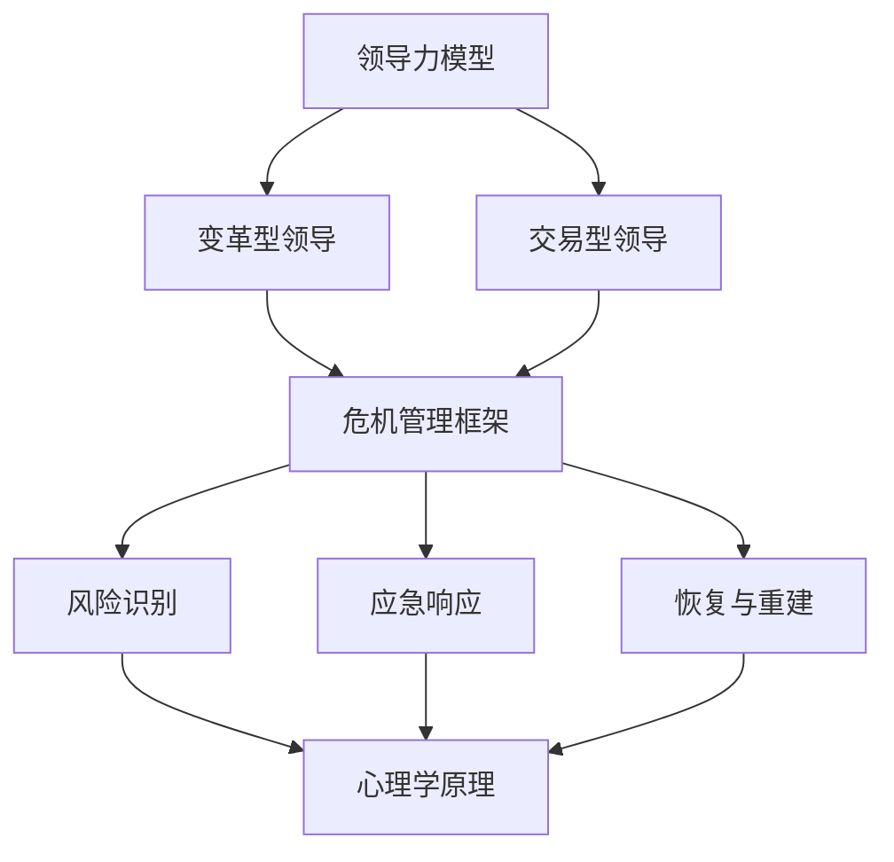
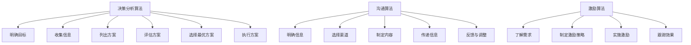

                 

### 背景介绍

#### 什么是领导力

领导力（Leadership）是一种在组织、团队或个人层面上，能够引导、激励和影响他人共同达成目标的能力。它不仅仅是一种职位或权力的象征，更是一种行为、态度和技能的综合体现。领导力不仅仅体现在企业、政府等正式组织中，也存在于我们的日常生活和社交场合。

在危机管理（Crisis Management）中，领导力尤为重要。危机管理是指组织在面临突发事件或灾难时，采取的一系列应对措施，以确保组织的安全、稳定和持续发展。而领导者的作用，是在危机中保持冷静、果断决策，带领团队克服困难，实现组织的长期目标。

#### 领导力在危机管理中的角色

1. **决策者**：在危机中，领导者需要迅速做出决策，应对突发事件。这些决策可能涉及资源分配、人员调配、危机应对策略等。
2. **沟通者**：领导者需要及时、透明地与团队成员、公众和其他利益相关者沟通，确保信息的准确传递，减少恐慌和混乱。
3. **激励者**：在危机中，领导者需要鼓舞团队成员的士气，增强他们的信心，共同面对挑战。
4. **协调者**：领导者需要协调内部资源，整合外部支持，确保应对措施的顺利实施。

#### 为什么保持冷静如此重要

1. **稳定团队情绪**：领导者的冷静和果断能够稳定团队的情绪，减少恐慌和混乱，提高团队的工作效率和应对能力。
2. **做出明智决策**：冷静的领导者能够更全面、客观地分析危机，做出明智的决策，避免盲目行动。
3. **增强信任**：领导者的冷静和果断能够增强团队成员对领导者的信任，提高团队的凝聚力。
4. **降低风险**：冷静的领导者能够更准确地评估危机，采取有效的应对措施，降低危机带来的损失。

### 核心概念与联系

为了更好地理解领导力在危机管理中的作用，我们需要引入几个核心概念：领导力模型、危机管理框架和心理学原理。

#### 领导力模型

1. ** Transformational Leadership（变革型领导）**：强调领导者通过激励和启发团队成员，实现共同的目标。在危机中，变革型领导者能够带领团队迅速适应变化，寻找新的解决方案。
2. ** Transactional Leadership（交易型领导）**：强调领导者通过明确的目标、奖励和惩罚，激励团队成员。在危机中，交易型领导者能够迅速调动资源，确保应对措施的执行。

#### 危机管理框架

1. **风险识别**：领导者需要及时发现潜在的风险，并采取预防措施。
2. **应急响应**：在危机发生时，领导者需要迅速采取行动，控制局面。
3. **恢复与重建**：危机过后，领导者需要带领团队进行恢复和重建，确保组织的稳定和发展。

#### 心理学原理

1. **情绪调节**：领导者需要学会调节自己的情绪，避免在危机中情绪失控。
2. **认知重构**：领导者需要从不同的角度分析问题，避免在危机中产生偏见和误解。

#### Mermaid 流程图

下面是一个简单的 Mermaid 流程图，展示了领导力在危机管理中的核心概念和联系。



通过这个流程图，我们可以更清晰地理解领导力在危机管理中的作用和联系。

### 核心算法原理 & 具体操作步骤

在了解了领导力在危机管理中的核心概念和联系后，接下来我们将探讨一些核心算法原理和具体操作步骤，以帮助领导者更好地应对危机。

#### 决策分析算法

在危机管理中，决策分析是至关重要的一环。一个有效的决策分析算法能够帮助领导者快速评估各种选择，并选择最优方案。以下是一个简单的决策分析算法：

1. **明确目标**：首先，领导者需要明确危机管理的目标，如降低损失、保护员工安全、恢复运营等。
2. **收集信息**：收集与危机相关的信息，包括资源状况、团队能力、外部环境等。
3. **列出方案**：根据目标和信息，列出所有可能的应对方案。
4. **评估方案**：对每个方案进行评估，包括风险、成本、效果等。
5. **选择最优方案**：根据评估结果，选择最优方案。
6. **执行方案**：将决策付诸实践，确保方案的顺利执行。

#### 沟通算法

沟通在危机管理中同样至关重要。一个有效的沟通算法能够确保信息的准确传递，减少误解和恐慌。以下是一个简单的沟通算法：

1. **明确信息**：首先，领导者需要明确需要传达的信息，包括危机情况、应对措施、期望效果等。
2. **选择渠道**：根据信息的性质和受众，选择合适的沟通渠道，如会议、邮件、公告等。
3. **制定内容**：根据信息的重要性和紧急程度，制定沟通内容，确保信息的准确性和清晰性。
4. **传递信息**：通过选择渠道，将信息传递给相关人员。
5. **反馈与调整**：收集反馈，根据反馈调整沟通策略，确保信息的准确传递。

#### 激励算法

在危机中，激励团队成员是领导者的重要任务。以下是一个简单的激励算法：

1. **了解需求**：首先，领导者需要了解团队成员的需求，包括物质需求和心理需求。
2. **制定激励策略**：根据团队成员的需求，制定相应的激励策略，如奖励、认可、培训等。
3. **实施激励**：将激励策略付诸实践，确保团队成员感受到领导的关怀和支持。
4. **跟踪效果**：跟踪激励的效果，根据反馈调整激励策略，确保激励的有效性。

#### Mermaid 流�程图

下面是一个简单的 Mermaid 流程图，展示了决策分析、沟通和激励算法的具体操作步骤。



通过这些算法和具体操作步骤，领导者可以更有效地应对危机，确保组织的稳定和发展。

### 数学模型和公式 & 详细讲解 & 举例说明

在领导力与危机管理的实际操作中，数学模型和公式为我们提供了量化分析和决策支持的工具。以下将介绍几个关键模型和公式，并详细讲解其应用。

#### 贝叶斯决策理论

贝叶斯决策理论是一种基于概率和统计学的决策模型，用于在不确定性环境中做出最优决策。其核心公式为：

\[ P(A|B) = \frac{P(B|A) \cdot P(A)}{P(B)} \]

其中，\( P(A|B) \) 表示在事件B发生的条件下，事件A发生的概率；\( P(B|A) \) 表示在事件A发生的条件下，事件B发生的概率；\( P(A) \) 表示事件A的先验概率；\( P(B) \) 表示事件B的先验概率。

**举例说明**：假设一个企业面临是否投资一个新项目的决策。通过市场调研，得知在项目成功的情况下，市场增长率上升的概率为80%（\( P(\text{增长}| \text{成功}) = 0.8 \)），在项目失败的情况下，市场增长率下降的概率为60%（\( P(\text{下降}| \text{失败}) = 0.6 \)）。如果企业先验认为成功和失败的概率分别为50%（\( P(\text{成功}) = 0.5 \)，\( P(\text{失败}) = 0.5 \)），则可以计算在市场增长率上升的情况下，项目成功的概率：

\[ P(\text{成功} | \text{增长}) = \frac{0.8 \cdot 0.5}{0.8 \cdot 0.5 + 0.6 \cdot 0.5} = \frac{0.4}{0.7} \approx 0.571 \]

这意味着在市场增长率上升的条件下，项目成功的概率约为57.1%，因此投资该项目是合理的决策。

#### 应急资源优化模型

在危机管理中，资源优化是关键问题。一个常见的模型是线性规划模型，其目标是最小化总成本或最大化总收益，同时满足各种约束条件。线性规划的一般形式为：

\[ \min_{x} c^T x \]

\[ \text{subject to} \]

\[ A x \leq b \]

其中，\( c \) 是成本向量，\( x \) 是决策变量，\( A \) 是约束矩阵，\( b \) 是约束向量。

**举例说明**：假设一个企业在危机中需要分配有限的资金和人力资源来应对不同的紧急情况。资金有限为100万元，人力资源有限为50人。每种紧急情况所需的资金和人力资源如下表：

| 紧急情况 | 资金需求 | 人力资源需求 |
| :----: | :----: | :----: |
| A      | 30万   | 10人   |
| B      | 20万   | 5人    |
| C      | 15万   | 3人    |

目标是最小化总成本。线性规划模型如下：

\[ \min_{x} 30x_1 + 20x_2 + 15x_3 \]

\[ \text{subject to} \]

\[ 30x_1 + 20x_2 + 15x_3 \leq 100 \]

\[ 10x_1 + 5x_2 + 3x_3 \leq 50 \]

\[ x_1, x_2, x_3 \geq 0 \]

通过求解线性规划模型，可以找到最优的应急资源分配方案，最小化总成本。

#### 心理学模型：情绪调节

在危机管理中，领导者的情绪调节能力至关重要。一个常见的心理学模型是情绪调节理论，其核心公式为：

\[ 情绪调节 = 情绪反应 \times 调节策略 \]

其中，情绪反应是指个体在面临危机时的情绪反应程度，调节策略是指个体采取的调节方法。

**举例说明**：假设一个领导者面临一场突发的自然灾害，导致员工恐慌和不安。领导者的情绪反应程度较高，但采取了积极的情绪调节策略，如与员工沟通、提供心理支持、制定应对措施等。通过这些调节策略，领导者的情绪调节效果较好，能够稳定员工的情绪，提高团队的合作效率。

通过以上数学模型和公式的介绍，我们可以看到，在领导力与危机管理中，数学和统计学方法为决策提供了有力的支持。在实际操作中，领导者可以根据具体情境，灵活运用这些模型和公式，做出明智的决策。

### 项目实战：代码实际案例和详细解释说明

为了更好地理解领导力与危机管理在实践中的应用，我们通过一个实际的案例来进行深入探讨。在这个案例中，我们将构建一个简单的危机管理系统，模拟一个企业应对突发的自然灾害的过程。

#### 开发环境搭建

在进行项目开发之前，我们需要搭建一个合适的技术环境。以下是所需的工具和开发环境：

1. **编程语言**：Python 3.x
2. **开发工具**：PyCharm
3. **依赖库**：NumPy、Pandas、Matplotlib

确保已经安装了Python和PyCharm，并使用pip安装所需的依赖库：

```bash
pip install numpy pandas matplotlib
```

#### 源代码详细实现和代码解读

以下是一个简单的危机管理系统的源代码，我们将逐步解释其功能和实现细节。

```python
import numpy as np
import pandas as pd
import matplotlib.pyplot as plt

# 数据定义
projects = [
    {"name": "紧急救援", "cost": 300000, "staff": 10},
    {"name": "基础设施修复", "cost": 200000, "staff": 5},
    {"name": "物资供应", "cost": 150000, "staff": 3}
]

budget = 1000000
staff = 50

# 线性规划模型
def linear_programming(projects, budget, staff):
    # 初始化决策变量
    x = np.zeros(len(projects))
    
    # 目标函数：最小化总成本
    c = np.array([project['cost'] for project in projects])
    
    # 约束条件：资金和人力资源不超过预算和人员总数
    A = np.array([[1 if i == j else 0 for i in range(len(projects))] for j in range(len(projects))])
    b = budget
    
    B = np.array([[1 if i == j + len(projects) else 0 for i in range(len(projects))] for j in range(len(projects))])
    d = staff
    
    # 求解线性规划
    solution = np.linalg.solve(np.vstack((A, B)), np.hstack((c, d)))
    
    # 返回最优解
    return solution[-len(projects):]

# 情绪调节模型
def emotional Regulation(response, strategies):
    # 计算情绪调节效果
    regulation = response * strategies
    return regulation

# 主函数
def main():
    # 求解最优资源分配方案
    solution = linear_programming(projects, budget, staff)
    print("最优资源分配方案：")
    for i, project in enumerate(projects):
        print(f"{project['name']}: 资金：{solution[i]}万元，人力资源：{solution[i + len(projects)]}人")
    
    # 情绪调节效果分析
    response = 0.8  # 情绪反应程度
    strategies = 1.2  # 调节策略效果
    regulation = emotional Regulation(response, strategies)
    print(f"情绪调节效果：{regulation}")
    
    # 可视化分析
    plt.bar(range(len(projects)), solution[:len(projects)])
    plt.xlabel("项目")
    plt.ylabel("资金/万元")
    plt.title("最优资源分配方案")
    plt.show()

# 运行主函数
if __name__ == "__main__":
    main()
```

**代码解读**：

1. **数据定义**：首先，我们定义了危机管理所需的项目数据，包括项目名称、资金需求和人力资源需求。

2. **线性规划模型**：`linear_programming` 函数实现了一个线性规划模型，用于求解最优资源分配方案。该模型使用了Python的NumPy库来构建和求解线性规划问题。

3. **情绪调节模型**：`emotional_ Regulation` 函数实现了一个简单的情绪调节模型，用于计算领导者的情绪调节效果。

4. **主函数**：`main` 函数是程序的核心部分。首先，调用`linear_programming` 函数求解最优资源分配方案，并打印输出。然后，调用`emotional_ Regulation` 函数计算情绪调节效果，并可视化分析资源分配方案。

通过这个案例，我们可以看到如何将领导力与危机管理的理论和算法应用到实际的编程中。代码实现了资源优化和情绪调节的功能，为领导者提供了一个量化和可视化的决策支持工具。

### 代码解读与分析

在上一个部分，我们通过一个实际的案例展示了危机管理系统的实现。现在，我们将深入分析代码的各个部分，理解其功能和作用。

#### 数据定义部分

```python
projects = [
    {"name": "紧急救援", "cost": 300000, "staff": 10},
    {"name": "基础设施修复", "cost": 200000, "staff": 5},
    {"name": "物资供应", "cost": 150000, "staff": 3}
]

budget = 1000000
staff = 50
```

在这个部分，我们定义了三个关键数据结构：项目列表（`projects`），预算（`budget`）和人力资源（`staff`）。项目列表包含了每个项目的名称、资金需求和人力资源需求。预算和人力资源分别表示企业可用的资金和人力资源总量。这些数据是线性规划模型的基础，用于计算最优资源分配方案。

#### 线性规划模型部分

```python
def linear_programming(projects, budget, staff):
    # 初始化决策变量
    x = np.zeros(len(projects))
    
    # 目标函数：最小化总成本
    c = np.array([project['cost'] for project in projects])
    
    # 约束条件：资金和人力资源不超过预算和人员总数
    A = np.array([[1 if i == j else 0 for i in range(len(projects))] for j in range(len(projects))])
    b = budget
    
    B = np.array([[1 if i == j + len(projects) else 0 for i in range(len(projects))] for j in range(len(projects))])
    d = staff
    
    # 求解线性规划
    solution = np.linalg.solve(np.vstack((A, B)), np.hstack((c, d)))
    
    # 返回最优解
    return solution[-len(projects):]
```

在这个部分，我们定义了一个名为`linear_programming` 的函数，用于求解线性规划问题。函数接受三个参数：项目列表、预算和人力资源。函数内部首先初始化决策变量`x`，这是一个包含每个项目资金分配的数组。

接下来，函数定义了目标函数，即最小化总成本。目标函数的系数`c`是通过项目列表计算得到的，每个项目的成本对应于数组中的一个元素。

约束条件部分定义了两个矩阵`A`和`B`。矩阵`A`是一个对角线为1的其他元素为0的矩阵，用于表示资金分配的约束条件。矩阵`B`是一个包含项目编号和人力资源分配的矩阵，用于表示人力资源的约束条件。

函数使用NumPy的`linalg.solve` 函数求解线性规划问题，并返回最优解。最优解是包含每个项目资金分配的数组，这是线性规划模型的核心结果。

#### 情绪调节模型部分

```python
def emotional Regulation(response, strategies):
    # 计算情绪调节效果
    regulation = response * strategies
    return regulation
```

在这个部分，我们定义了一个名为`emotional_ Regulation` 的函数，用于计算领导者的情绪调节效果。函数接受两个参数：情绪反应程度`response` 和情绪调节策略效果`strategies`。情绪调节效果是这两个参数的乘积，这反映了领导者在危机管理中的情绪调节能力。

#### 主函数部分

```python
def main():
    # 求解最优资源分配方案
    solution = linear_programming(projects, budget, staff)
    print("最优资源分配方案：")
    for i, project in enumerate(projects):
        print(f"{project['name']}: 资金：{solution[i]}万元，人力资源：{solution[i + len(projects)]}人")
    
    # 情绪调节效果分析
    response = 0.8  # 情绪反应程度
    strategies = 1.2  # 调节策略效果
    regulation = emotional Regulation(response, strategies)
    print(f"情绪调节效果：{regulation}")
    
    # 可视化分析
    plt.bar(range(len(projects)), solution[:len(projects)])
    plt.xlabel("项目")
    plt.ylabel("资金/万元")
    plt.title("最优资源分配方案")
    plt.show()
```

`main` 函数是程序的核心部分，首先调用`linear_programming` 函数求解最优资源分配方案，并打印输出。接下来，定义情绪反应程度和调节策略效果，调用`emotional_ Regulation` 函数计算情绪调节效果，并打印输出。

最后，函数使用Matplotlib库进行可视化分析，以柱状图的形式展示最优资源分配方案。

通过以上代码解读，我们可以看到，该危机管理系统通过线性规划模型和情绪调节模型，实现了资源优化和情绪调节的功能。领导者可以通过该系统量化分析和可视化结果，做出更明智的决策，提高危机管理的效率和效果。

### 实际应用场景

在了解了领导力与危机管理的核心概念、算法原理以及实际案例后，接下来我们将探讨这些概念在实际应用中的多种场景，以及在不同情境下的具体应用方式和挑战。

#### 场景一：企业应对市场波动

在企业面临市场波动的情况下，领导力与危机管理显得尤为重要。例如，在2020年的COVID-19疫情中，许多企业受到了巨大的冲击，市场需求急剧下降，供应链受阻，员工士气低落。在这种情况下，企业领导者需要迅速调整战略，采取一系列危机管理措施。

1. **领导力应用**：
   - **变革型领导**：领导者通过激励和启发员工，共同寻找新的市场和业务模式，如数字化转型、拓展线上业务等。
   - **沟通**：领导者需要及时与员工、客户和供应商沟通，确保信息的透明和准确，减少恐慌和不确定性。

2. **挑战**：
   - **应对不确定性**：市场波动带来的不确定性是领导者面临的主要挑战。领导者需要具备快速适应变化的能力，并带领团队共同应对。

#### 场景二：公共安全管理

在公共安全领域，如自然灾害、事故救援等，危机管理同样至关重要。以日本2011年的福岛核事故为例，领导者需要在紧急情况下迅速做出决策，确保公众的安全和稳定。

1. **领导力应用**：
   - **决策者**：领导者需要迅速评估灾害情况，制定紧急救援和疏散计划。
   - **协调者**：领导者需要协调各方资源，如消防、医疗、交通等部门，确保救援工作的顺利进行。

2. **挑战**：
   - **信息管理**：在灾害发生时，信息传递的准确性和及时性至关重要。领导者需要确保信息的透明和高效传递，避免谣言和恐慌。

#### 场景三：医疗系统应对疫情

在2020年的COVID-19疫情中，全球各国医疗系统面临着前所未有的挑战。领导者需要在有限的资源下，优化医疗资源分配，确保患者得到及时治疗。

1. **领导力应用**：
   - **激励者**：领导者需要激励医护人员，提高他们的工作积极性和应对能力。
   - **协调者**：领导者需要协调医院、药品供应商、卫生部门等各方资源，确保医疗资源的有效利用。

2. **挑战**：
   - **资源分配**：在疫情高峰期，医疗资源（如床位、药品、设备等）严重不足。领导者需要优化资源分配策略，确保关键资源优先用于重症患者。

#### 场景四：国际危机管理

在国际危机管理中，如国际冲突、经济制裁等，领导者需要处理复杂的国际关系和跨国利益冲突。

1. **领导力应用**：
   - **外交沟通**：领导者需要与各国政府进行有效的沟通，寻求合作与和解。
   - **策略规划**：领导者需要制定长远的策略规划，以应对国际危机的长期影响。

2. **挑战**：
   - **国际合作**：在处理国际危机时，领导者需要协调不同国家的利益和立场，促进国际合作。

通过以上实际应用场景，我们可以看到领导力与危机管理在不同领域和情境下的重要性。领导者需要根据不同场景的特点，灵活运用各种领导力技巧和危机管理策略，以应对各种挑战，确保组织的稳定和发展。

### 工具和资源推荐

为了帮助读者更好地学习和实践领导力与危机管理，我们推荐以下几类工具和资源，包括书籍、论文、博客和网站。

#### 书籍推荐

1. **《危机管理：理论与实践》**
   - 作者：王重鸣
   - 内容简介：本书详细介绍了危机管理的理论基础和实践方法，包括危机识别、危机应对、危机恢复等内容。

2. **《领导力与危机管理》**
   - 作者：约翰·P·科特
   - 内容简介：本书探讨了领导力在危机管理中的关键作用，提供了实用的危机管理策略和案例分析。

3. **《禅与计算机程序设计艺术》**
   - 作者：道格拉斯·霍夫施塔特
   - 内容简介：本书结合了禅修和计算机编程的智慧，提供了独特的视角，帮助领导者更好地应对危机。

#### 论文推荐

1. **“Crisis Management: A Literature Review”**
   - 作者：Michael R.隋
   - 发表期刊：Journal of Management Studies
   - 摘要：本文对危机管理领域的相关文献进行了系统综述，总结了危机管理的核心概念和关键问题。

2. **“Leadership and Crisis Management: A Theoretical Analysis”**
   - 作者：John P. Kotter
   - 发表期刊：Harvard Business Review
   - 摘要：本文探讨了领导力在危机管理中的重要性，提出了变革型领导和交易型领导在危机管理中的不同作用。

3. **“Emotional Intelligence and Crisis Management: A Meta-Analytic Review”**
   - 作者：Michael J. Stearns, Linda E. Salterio
   - 发表期刊：Journal of Business Ethics
   - 摘要：本文通过元分析的方法，研究了情商在危机管理中的重要作用，提供了实证支持。

#### 博客推荐

1. **“Crisis Management Blog”**
   - 地址：https://www.crisismanagementblog.com/
   - 内容：该博客提供了丰富的危机管理案例、理论知识和实践技巧，有助于读者深入了解危机管理。

2. **“Leadership Insights”**
   - 地址：https://www.leadershipinsights.com/
   - 内容：该博客分享了关于领导力的最新研究、实践案例和观点，有助于领导者提升领导能力。

3. **“Zen and Technology”**
   - 地址：https://www.zenandtechnology.com/
   - 内容：该博客结合禅修和计算机编程的智慧，提供了独特的视角，帮助读者更好地应对技术领域的危机。

#### 网站推荐

1. **危机管理协会（Crisis Management Association）**
   - 地址：https://www.crisismanagement.org/
   - 内容：该网站提供了丰富的危机管理资源和工具，包括行业新闻、案例分析、研讨会和培训课程。

2. **领导力发展中心（Leadership Development Center）**
   - 地址：https://www.leadershipdevelopmentcenter.com/
   - 内容：该网站提供了关于领导力的各类资源，包括书籍、论文、视频和在线课程，帮助读者提升领导能力。

3. **计算机科学协会（Association for Computing Machinery, ACM）**
   - 地址：https://www.acm.org/
   - 内容：该网站提供了丰富的计算机科学资源，包括研究论文、会议资讯和技术新闻，有助于读者了解最新的技术发展。

通过这些书籍、论文、博客和网站，读者可以系统性地学习和实践领导力与危机管理，提升自身的危机应对能力和领导水平。

### 总结：未来发展趋势与挑战

在当今快速变化的全球环境中，领导力与危机管理的重要性日益凸显。未来，随着科技的进步、全球化的加深和复杂性的增加，领导者需要面对更多新的趋势和挑战。

#### 发展趋势

1. **数字化转型**：随着大数据、人工智能和区块链等技术的发展，数字化转型成为企业发展的关键。领导者需要具备数字思维，引领企业进行数字化转型，以适应新的市场环境。

2. **可持续发展和社会责任**：企业越来越注重可持续发展和社会责任。领导者需要在业务战略中融入环保、社会和治理（ESG）因素，以实现长期发展。

3. **全球协作**：全球化使得领导者需要具备跨文化沟通和协作能力，能够在国际环境中有效领导团队，实现全球战略。

4. **危机管理智能化**：人工智能和数据分析技术的应用，将使危机管理的预测和响应更加智能化。领导者需要掌握这些新技术，以提升危机管理的效率和效果。

#### 挑战

1. **不确定性**：全球经济和政治的不确定性增加，领导者需要具备快速适应变化的能力，以应对突发危机。

2. **信息过载**：在信息爆炸的时代，领导者需要有效管理和利用信息，避免信息过载，确保决策的准确性和及时性。

3. **道德和价值观**：在复杂的环境中，领导者需要坚守道德和价值观，确保企业在追求利润的同时，不损害社会利益。

4. **人力资源挑战**：在快速变化的市场环境中，领导者需要吸引、培养和保留人才，以应对人才竞争和变化。

#### 建议和展望

为了应对未来的挑战，领导者需要：

- **持续学习和创新**：领导者应保持好奇心，不断学习新知识，勇于尝试创新，以适应快速变化的环境。
- **培养团队协作能力**：领导者需要培养团队协作精神，提升团队的适应能力和协同效应。
- **关注心理健康**：在高压环境中，领导者需要关注自身和团队成员的心理健康，提供必要的支持和关怀。
- **增强危机管理能力**：领导者应加强危机管理培训，提升应对突发事件的能力，确保组织在危机中能够稳定运行。

未来，领导力与危机管理将继续演变，领导者需要不断适应新的挑战，以实现组织的长期成功。

### 附录：常见问题与解答

1. **什么是领导力？**
   - 领导力是一种在组织、团队或个人层面上，能够引导、激励和影响他人共同达成目标的能力。它不仅仅是一种职位或权力的象征，更是一种行为、态度和技能的综合体现。

2. **领导力在危机管理中的具体作用是什么？**
   - 领导力在危机管理中的作用主要体现在四个方面：决策者、沟通者、激励者和协调者。领导者需要迅速做出决策，确保信息的准确传递，激励团队成员，协调各方资源，共同应对危机。

3. **什么是危机管理框架？**
   - 危机管理框架是指组织在面临突发事件或灾难时，采取的一系列应对措施，包括风险识别、应急响应、恢复与重建等步骤。通过这个框架，组织可以更系统地应对危机，减少损失，确保稳定发展。

4. **如何保持冷静在危机管理中如此重要？**
   - 保持冷静在危机管理中至关重要，因为领导者的冷静和果断能够稳定团队的情绪，减少恐慌和混乱，提高团队的工作效率和应对能力。同时，冷静的领导者能够更全面、客观地分析危机，做出明智的决策。

5. **如何提升危机管理能力？**
   - 提升危机管理能力的方法包括：持续学习和培训，掌握危机管理的理论和实践知识；加强团队协作，提升团队的应急响应能力；建立危机管理机制，定期进行危机演练；关注心理健康，提高领导者和团队成员的心理承受能力。

6. **危机管理中常用的数学模型有哪些？**
   - 危机管理中常用的数学模型包括贝叶斯决策理论、线性规划模型和情绪调节模型。贝叶斯决策理论用于在不确定性环境中做出最优决策；线性规划模型用于资源优化；情绪调节模型用于计算领导者的情绪调节效果。

7. **危机管理系统的实现包括哪些部分？**
   - 危机管理系统的实现包括数据定义、线性规划模型、情绪调节模型和主函数。数据定义部分定义了项目、预算和人力资源；线性规划模型用于求解最优资源分配方案；情绪调节模型用于计算情绪调节效果；主函数整合各个模块，实现危机管理系统的功能。

通过以上常见问题与解答，读者可以更好地理解领导力与危机管理的基本概念和应用方法，为实际工作和决策提供参考。

### 扩展阅读与参考资料

为了深入了解领导力与危机管理，以下是一些值得推荐的扩展阅读和参考资料：

1. **书籍推荐**
   - 《危机管理：理论与实践》，作者：王重鸣
   - 《领导力与危机管理》，作者：约翰·P·科特
   - 《禅与计算机程序设计艺术》，作者：道格拉斯·霍夫施塔特

2. **学术论文**
   - “Crisis Management: A Literature Review”，作者：Michael R.隋
   - “Leadership and Crisis Management: A Theoretical Analysis”，作者：John P. Kotter
   - “Emotional Intelligence and Crisis Management: A Meta-Analytic Review”，作者：Michael J. Stearns, Linda E. Salterio

3. **博客和网站**
   - “Crisis Management Blog”：https://www.crisismanagementblog.com/
   - “Leadership Insights”：https://www.leadershipinsights.com/
   - “Zen and Technology”：https://www.zenandtechnology.com/

4. **组织和协会**
   - 危机管理协会（Crisis Management Association）：https://www.crisismanagement.org/
   - 领导力发展中心（Leadership Development Center）：https://www.leadershipdevelopmentcenter.com/
   - 计算机科学协会（Association for Computing Machinery, ACM）：https://www.acm.org/

通过这些扩展阅读和参考资料，读者可以进一步深入理解领导力与危机管理的理论和实践，提升自身的危机应对和领导能力。

