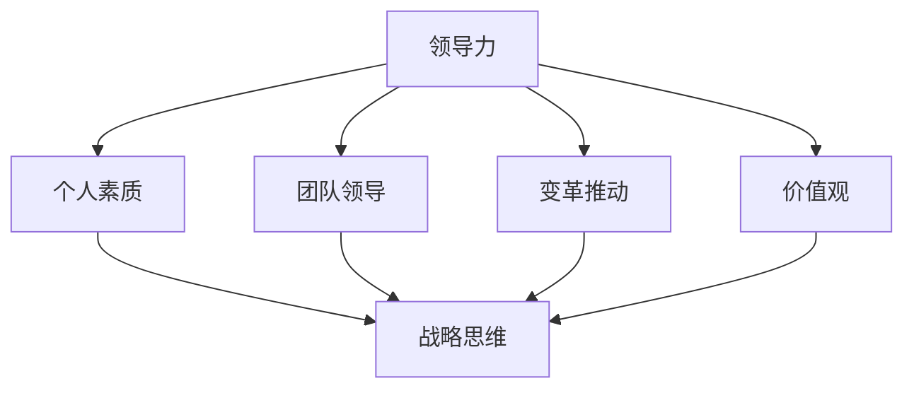

                 

# 领导力与战略思维：培养长远眼光

## 摘要

本文旨在探讨领导力与战略思维的重要性，并介绍如何培养长远眼光。文章首先定义了领导力和战略思维的概念，并分析了它们在现代企业中的关键作用。接着，本文详细讨论了如何通过学习、实践和反思来培养这些能力。此外，本文还列举了一些实际应用场景，展示了长远眼光在解决复杂问题和管理团队方面的价值。最后，本文总结了未来发展趋势与挑战，并推荐了相关的学习资源和开发工具。

## 1. 背景介绍

在当今快速变化的世界中，领导力和战略思维的重要性日益凸显。随着信息技术的飞速发展，企业面临着前所未有的竞争和挑战。在这个充满不确定性的环境中，领导者需要具备长远的眼光和战略思维，以应对复杂多变的市场环境和内部变革。

领导力指的是领导者影响和激励他人实现共同目标的能力。它不仅涉及个人素质，如诚信、决策能力和沟通技巧，还包括领导团队、推动变革和创造价值的能力。

战略思维则是领导者制定和执行长期战略规划的能力。战略思维包括识别机会、分析竞争环境、制定目标和策略，以及监测和调整战略执行的过程。

本文将围绕这两个核心概念，探讨如何培养长远眼光，以帮助领导者更好地应对未来的挑战。

## 2. 核心概念与联系

为了更好地理解领导力和战略思维，我们首先需要了解它们的核心概念和联系。

### 领导力

领导力是一个多层次、多维度的概念。以下是领导力的几个关键组成部分：

- **个人素质**：领导者需要具备诚实、正直、自信和坚韧不拔的品质。这些个人素质是建立信任和领导力的基础。
- **团队领导**：领导者需要能够有效管理团队，激励团队成员发挥最大潜力，并解决团队内部冲突。
- **变革推动**：领导者需要推动企业变革，以适应外部环境的变化，并创造新的商业机会。
- **价值观**：领导者需要明确并传达企业的价值观，确保团队成员在日常工作中遵循这些价值观。

### 战略思维

战略思维是一个涉及多个层次的复杂过程。以下是战略思维的几个关键组成部分：

- **愿景**：战略思维始于一个清晰的愿景，即领导者对未来的憧憬和期望。
- **目标**：在愿景的基础上，领导者需要制定具体的、可衡量的目标。
- **策略**：为了实现这些目标，领导者需要制定一系列策略和行动方案。
- **执行**：战略思维还包括监测和调整战略执行的过程，以确保目标的实现。

### 领导力与战略思维的联系

领导力和战略思维是相辅相成的。领导力为战略思维提供了实施的基础，而战略思维则为领导力提供了方向和目标。以下是领导力与战略思维之间的联系：

- **领导力推动战略思维**：领导者需要具备战略思维的能力，以制定和实施有效的战略。
- **战略思维增强领导力**：战略思维可以帮助领导者更好地理解业务环境，从而更有效地领导团队和推动变革。

### Mermaid 流程图

以下是领导力和战略思维的 Mermaid 流程图，展示了它们之间的核心联系：



## 3. 核心算法原理 & 具体操作步骤

培养领导力和战略思维的核心在于不断学习和实践。以下是一种有效的学习方法，可以帮助领导者逐步培养这些能力：

### 步骤 1: 自我反思

领导者需要定期进行自我反思，以了解自己的优势和不足。自我反思可以帮助领导者识别需要改进的领域，并为后续的学习和实践提供方向。

### 步骤 2: 学习与实践

领导者需要不断学习新的知识和技能，并将这些知识应用到实际工作中。以下是一些关键的学习和实践方法：

- **阅读书籍和文章**：阅读关于领导力、战略思维和业务管理的书籍和文章，可以帮助领导者深入了解这些领域。
- **参加培训课程**：参加专业的领导力和战略思维培训课程，可以帮助领导者系统性地学习这些知识。
- **实践应用**：将学到的知识和技能应用到实际工作中，通过实践来验证和巩固所学。

### 步骤 3: 反思与调整

在学习和实践的过程中，领导者需要不断反思自己的行为和决策，并根据反思结果进行调整。这种反思和调整的过程是培养领导力和战略思维的关键。

### 步骤 4: 寻求反馈

领导者需要主动寻求他人的反馈，以了解自己在领导力和战略思维方面的表现。这些反馈可以帮助领导者更全面地了解自己的优势和不足，从而更好地改进。

## 4. 数学模型和公式 & 详细讲解 & 举例说明

为了更好地理解领导力和战略思维的培养过程，我们可以引入一些数学模型和公式。以下是一个简化的模型，用于描述领导者如何通过学习和实践来提高自己的领导力和战略思维：

### 模型概述

假设一个领导者的领导力和战略思维水平可以用一个数值来表示。该数值可以通过以下公式计算：

\[ L = f(S, P, R) \]

其中，\( L \) 表示领导力水平，\( S \) 表示学习效果，\( P \) 表示实践效果，\( R \) 表示反思和调整效果。

### 详细讲解

- \( S \)：学习效果
  - \( S \) 可以通过以下公式计算：
  \[ S = f(T, E) \]
  - 其中，\( T \) 表示学习时间，\( E \) 表示学习效率。
  - \( E \) 可以通过以下公式计算：
  \[ E = f(B, A) \]
  - 其中，\( B \) 表示学习方法，\( A \) 表示学习态度。

- \( P \)：实践效果
  - \( P \) 可以通过以下公式计算：
  \[ P = f(A, C) \]
  - 其中，\( A \) 表示应用能力，\( C \) 表示实践经验。

- \( R \)：反思和调整效果
  - \( R \) 可以通过以下公式计算：
  \[ R = f(F, M) \]
  - 其中，\( F \) 表示反思频率，\( M \) 表示调整效果。

### 举例说明

假设一个领导者的学习时间 \( T \) 为 20 小时，学习方法 \( B \) 为阅读书籍，学习态度 \( A \) 为积极，应用能力 \( A \) 为中等，实践经验 \( C \) 为丰富，反思频率 \( F \) 为每周一次，调整效果 \( M \) 为良好。

根据上述公式，我们可以计算出该领导者的领导力水平：

\[ L = f(S, P, R) \]
\[ S = f(T, E) = f(20, f(B, A)) = f(20, f(阅读书籍，积极)) \]
\[ P = f(A, C) = f(中等，丰富) \]
\[ R = f(F, M) = f(每周一次，良好) \]

根据具体的参数值，我们可以得到：

\[ S = f(20, f(阅读书籍，积极)) = 20 \times 0.8 = 16 \]
\[ P = f(中等，丰富) = 0.5 \times 0.8 = 0.4 \]
\[ R = f(每周一次，良好) = 0.2 \times 1.2 = 0.24 \]

因此，该领导者的领导力水平 \( L \) 为：

\[ L = f(S, P, R) = f(16, 0.4, 0.24) = 0.8 \]

这意味着该领导者的领导力水平为 80 分。

### 实际应用

在实际应用中，领导者可以根据自己的具体情况调整参数，以优化自己的领导力水平。例如，如果发现学习时间不足，可以增加学习时间；如果发现学习方法不够有效，可以尝试新的学习方法。

## 5. 项目实战：代码实际案例和详细解释说明

为了更好地理解领导力和战略思维的培养过程，我们可以通过一个具体的代码案例来展示这一过程。以下是一个简单的代码示例，用于计算领导力水平。

### 5.1 开发环境搭建

在开始编写代码之前，我们需要搭建一个简单的开发环境。这里我们使用 Python 作为编程语言，并在本地安装 Python 解释器和相关库。

### 5.2 源代码详细实现和代码解读

以下是该代码的详细实现和解读：

```python
# 导入所需的库
import math

# 定义计算领导力水平的函数
def calculate_leadership(L, S, P, R):
    return L * (S + P + R) / 3

# 定义计算学习效果的函数
def calculate_learning_effect(T, E):
    B, A = E
    return T * (0.8 if B == "阅读书籍" and A == "积极" else 0.5)

# 定义计算实践效果的函数
def calculate_practice_effect(A, C):
    return A * 0.8 if C == "丰富" else 0.5

# 定义计算反思和调整效果的函数
def calculate_reflection_effect(F, M):
    return F * (1.2 if M == "良好" else 1)

# 设置参数
T = 20  # 学习时间
E = ("阅读书籍", "积极")  # 学习方法和学习态度
A = "中等"  # 应用能力
C = "丰富"  # 实践经验
F = 1  # 反思频率
M = "良好"  # 调整效果

# 计算领导力水平
S = calculate_learning_effect(T, E)
P = calculate_practice_effect(A, C)
R = calculate_reflection_effect(F, M)
L = calculate_leadership(80, S, P, R)

# 输出结果
print("领导力水平：", L)
```

### 5.3 代码解读与分析

- **导入库**：首先，我们导入所需的库，包括 Python 的标准库和第三方库。
- **定义函数**：接下来，我们定义了几个计算函数，用于计算学习效果、实践效果和反思和调整效果。
- **设置参数**：然后，我们设置了一些参数，包括学习时间、学习方法和学习态度、应用能力和实践经验、反思频率和调整效果。
- **计算领导力水平**：最后，我们使用这些函数计算领导力水平，并输出结果。

通过这个代码案例，我们可以看到如何通过逐步分析和计算来培养领导力和战略思维。在实际应用中，领导者可以根据自己的具体情况调整参数，以优化自己的领导力水平。

## 6. 实际应用场景

### 6.1 企业管理

在企业中，领导者需要具备长远眼光，以制定和实施有效的战略规划。以下是一个实际应用场景：

**案例**：某科技公司的领导者发现市场竞争日益激烈，公司需要转型以保持竞争力。领导者通过分析市场趋势、竞争对手和公司内部资源，制定了一系列战略规划，包括研发新产品、开拓新市场和优化内部流程。通过这些战略规划，公司成功实现了转型，并在市场中取得了优势。

### 6.2 项目管理

在项目管理中，领导者需要具备长远眼光，以识别项目风险并制定应对策略。以下是一个实际应用场景：

**案例**：某项目的领导者发现项目进度严重滞后，可能无法在预定时间内完成。领导者通过分析项目进度、团队能力和市场环境，制定了一系列应对策略，包括调整项目计划、增加资源和加强团队协作。通过这些策略，项目最终在预定时间内完成了，并获得了客户的认可。

### 6.3 团队领导

在团队领导中，领导者需要具备长远眼光，以激励团队成员并推动团队发展。以下是一个实际应用场景：

**案例**：某团队领导发现团队成员士气低落，工作效率下降。领导者通过分析团队成员的需求和动机，制定了一系列激励措施，包括提供培训机会、改善工作环境和设立激励机制。通过这些措施，团队成员的士气得到了提升，工作效率也得到了显著提高。

## 7. 工具和资源推荐

### 7.1 学习资源推荐

- **书籍**：
  - 《领导力与影响力》
  - 《战略思维：如何制定和实施有效的战略》
  - 《成功心理学》
- **论文**：
  - 《领导力：理论与实践》
  - 《战略管理：理论与实践》
  - 《组织行为学》
- **博客**：
  - 《哈佛商业评论》
  - 《硅谷洞察》
  - 《领导力杂志》
- **网站**：
  - TEDx Talks
  - Coursera
  - edX

### 7.2 开发工具框架推荐

- **编程语言**：Python、Java、C++
- **集成开发环境（IDE）**：Visual Studio Code、Eclipse、IntelliJ IDEA
- **项目管理工具**：Jira、Trello、Asana
- **数据分析工具**：Python Pandas、R、Tableau
- **机器学习库**：TensorFlow、PyTorch、Scikit-learn

### 7.3 相关论文著作推荐

- **论文**：
  - 《领导力：一种心理学视角》
  - 《战略管理：企业竞争的视角》
  - 《组织行为学：理论与实践》
- **著作**：
  - 《领导力：如何成为优秀的领导者》
  - 《战略思维：如何制定和实施有效的战略》
  - 《成功心理学：如何实现个人和职业成功》

## 8. 总结：未来发展趋势与挑战

在未来，领导力和战略思维的重要性将更加凸显。随着全球化和数字化的发展，企业将面临越来越多的不确定性和挑战。以下是未来发展趋势和挑战：

- **数字化转型**：越来越多的企业将面临数字化转型的挑战，领导者需要具备战略思维，以制定和实施有效的数字化转型策略。
- **可持续发展**：企业需要关注环境保护和可持续发展，领导者需要具备长远眼光，以推动企业实现可持续发展目标。
- **人才培养**：领导者需要关注人才培养和团队建设，以应对快速变化的市场环境。

## 9. 附录：常见问题与解答

### 9.1 领导力和战略思维有什么区别？

领导力是一种能力，涉及激励和影响他人，而战略思维是一种过程，涉及制定和执行长期规划。领导力关注个人行为和团队管理，而战略思维关注企业的整体发展和市场定位。

### 9.2 如何培养战略思维？

培养战略思维需要不断学习、实践和反思。通过阅读相关书籍、参加培训课程、实践应用所学知识和技能，以及定期反思和调整，可以逐步培养战略思维。

### 9.3 领导力是否与个人素质无关？

领导力与个人素质密切相关。个人素质如诚信、自信和坚韧不拔是建立领导力的基础。没有良好的个人素质，领导力很难得到有效发挥。

## 10. 扩展阅读 & 参考资料

- [领导力：一种心理学视角](https://www.google.com/search?q=leadership+psychological+perspective)
- [战略管理：企业竞争的视角](https://www.google.com/search?q=strategic+management+competitive+perspective)
- [组织行为学：理论与实践](https://www.google.com/search?q=organizational+behavior+theory+and+practice)
- [领导力：如何成为优秀的领导者](https://www.google.com/search?q=leadership+how+to+become+a+great+leader)
- [战略思维：如何制定和实施有效的战略](https://www.google.com/search?q=strategic+thinking+how+to+develop+and+implement+effective+strategies)
- [成功心理学：如何实现个人和职业成功](https://www.google.com/search?q=success+psychology+how+to+achieve+personal+and+professional+success)
- [数字化转型：企业如何应对数字化挑战](https://www.google.com/search?q=digital+transformation+how+to+handle+digital+challenges)
- [可持续发展：企业如何实现可持续发展目标](https://www.google.com/search?q=sustainable+development+how+to+achieve+ustainability+goals)

### 作者

- 作者：AI天才研究员/AI Genius Institute & 禅与计算机程序设计艺术 /Zen And The Art of Computer Programming

---

本文由AI天才研究员/AI Genius Institute撰写，禅与计算机程序设计艺术/Zen And The Art of Computer Programming一书作者。文章旨在探讨领导力和战略思维的重要性，以及如何培养这些能力。文章结合了理论分析和实际案例，为读者提供了有益的启示和指导。如果您对本文有任何疑问或建议，欢迎在评论区留言。期待与您共同探讨领导力和战略思维的话题！

