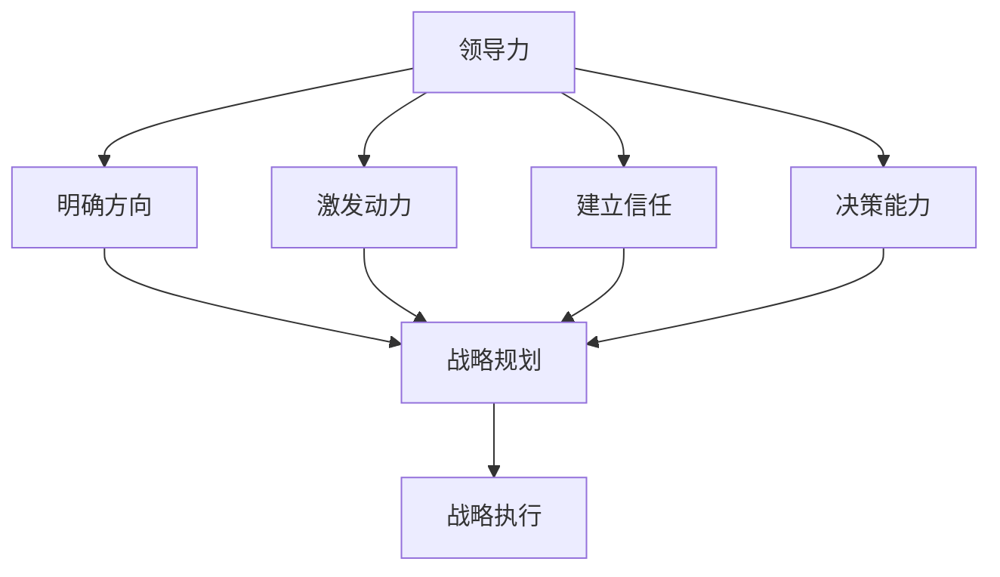
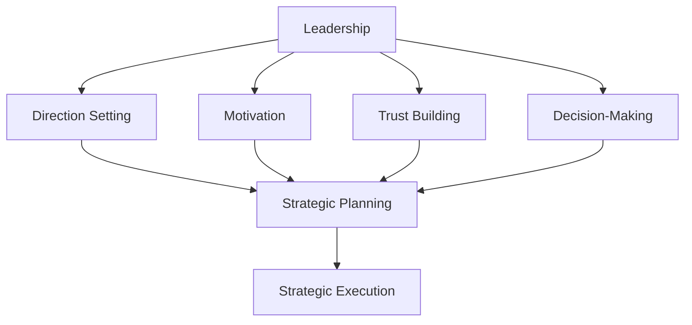

                 

### 背景介绍

**领导力与战略执行**是现代企业管理中至关重要的一对概念。领导力，作为推动组织向前发展的重要动力，不仅关乎个人的能力，更是一个组织的核心竞争优势。战略执行，则是将组织的长期规划转化为实际行动的过程，是实现企业愿景和目标的关键步骤。

在现代信息技术的快速发展下，企业面临着前所未有的挑战和机遇。如何在这场变革中保持竞争力，实现持续增长，成为了企业领导者们必须面对的问题。在这个过程中，领导力和战略执行的有效结合，成为了企业成功的关键因素。

本文将围绕领导力与战略执行的关联进行深入探讨。首先，我们将介绍这两个概念的定义及其重要性，并阐述它们在企业发展中的核心作用。接着，通过案例分析，展示成功企业如何运用领导力和战略执行实现目标。此外，本文还将详细讨论战略规划的步骤、策略制定的方法以及如何进行有效的战略执行。

通过这篇文章，读者将了解到：

1. 领导力和战略执行的核心理念和作用。
2. 如何制定和执行有效的战略规划。
3. 成功企业的领导力和战略执行案例解析。
4. 未来企业面临的发展趋势和挑战。

### Background Introduction

**Leadership and strategic execution** are crucial concepts in modern enterprise management. Leadership, as a driving force for organizational development, is not only about individual capabilities but also a core competitive advantage for an organization. Strategic execution, on the other hand, is the process of transforming long-term plans into actionable tasks, and is crucial for realizing an organization's vision and goals.

In the rapid development of modern information technology, enterprises are facing unprecedented challenges and opportunities. How to maintain competitiveness and achieve continuous growth in this transformation era has become a critical issue for corporate leaders. The effective integration of leadership and strategic execution has become a key factor for enterprise success.

This article will delve into the relationship between leadership and strategic execution. Firstly, we will introduce the definitions and importance of these two concepts and discuss their core roles in enterprise development. Then, through case studies, we will showcase how successful enterprises utilize leadership and strategic execution to achieve their goals. Furthermore, this article will discuss in detail the steps of strategic planning, the methods of strategy formulation, and how to conduct effective strategic execution.

Through this article, readers will gain insights into:

1. The core concepts and roles of leadership and strategic execution.
2. How to develop and execute effective strategic plans.
3. Analysis of successful enterprise cases in leadership and strategic execution.
4. Future development trends and challenges faced by enterprises. <sop><|user|>## 核心概念与联系

### 概念介绍

领导力（Leadership）：领导力是指领导者通过激励、指导和影响他人来实现组织目标的能力。它不仅仅关乎权力和职位，更是一种能力和艺术。有效的领导力能够激发员工的潜力，促进团队合作，提高组织的整体效能。

战略执行（Strategic Execution）：战略执行是将战略规划转化为实际行动的过程，确保组织能够实现其长期目标和愿景。它涉及到如何将战略目标分解为具体的行动步骤，并分配资源和责任，确保执行过程的顺利进行。

### 领导力与战略执行的联系

领导力与战略执行之间存在着紧密的联系。领导力是战略执行的基础，它为战略执行提供动力和支持。以下是领导力与战略执行之间的主要关联：

1. **明确方向**：领导力通过设定愿景和目标，为组织明确前进的方向。战略执行则需要依据这些方向进行具体的行动规划。
2. **激发动力**：有效的领导力能够激发员工的积极性和创造力，推动战略目标的实现。战略执行需要依靠员工的参与和努力。
3. **建立信任**：领导力通过建立信任和合作关系，促进团队合作，提高战略执行的效率。战略执行则需要在一个信任和协作的环境中才能顺利进行。
4. **决策能力**：领导力提供决策能力，帮助组织在面临挑战和不确定性时做出正确的选择。战略执行需要快速而准确的决策来应对变化。

### 关系图

为了更清晰地展示领导力与战略执行之间的联系，我们可以使用 Mermaid 流程图来描述：



在这个流程图中，领导力通过各种方式影响战略规划，而战略规划则是战略执行的基础。领导力的各个方面，如明确方向、激发动力、建立信任和决策能力，都是战略执行成功的关键因素。

### Core Concepts and Their Connections

#### Concept Introduction

**Leadership** (Leadership): Leadership is the ability of a leader to inspire, guide, and influence others to achieve organizational goals. It is not just about power and position but also a set of skills and arts. Effective leadership can unleash the potential of employees, promote teamwork, and enhance the overall effectiveness of the organization.

**Strategic Execution** (Strategic Execution): Strategic execution is the process of transforming strategic plans into actionable tasks to ensure that an organization can realize its long-term goals and visions. It involves how to decompose strategic objectives into specific action steps, allocate resources and responsibilities, and ensure the smooth execution process.

#### Connections Between Leadership and Strategic Execution

There is a close relationship between leadership and strategic execution. Leadership is the foundation of strategic execution, providing the motivation and support needed for its success. Here are the main connections between the two:

1. **Direction Setting**: Leadership sets the vision and goals, providing the direction for the organization to move forward. Strategic execution requires specific action plans based on these directions.
2. **Motivation**: Effective leadership can inspire employees' enthusiasm and creativity, driving the achievement of strategic objectives. Strategic execution relies on the participation and efforts of employees.
3. **Trust Building**: Leadership builds trust and collaborative relationships, enhancing the efficiency of strategic execution. Strategic execution requires a trust-based and collaborative environment to operate smoothly.
4. **Decision-Making**: Leadership provides decision-making capabilities that help the organization make correct choices in the face of challenges and uncertainties. Strategic execution requires rapid and accurate decision-making to respond to changes.

#### Relationship Diagram

To illustrate the relationship between leadership and strategic execution more clearly, we can use a Mermaid flowchart:



In this flowchart, leadership impacts strategic planning through various means, and strategic planning is the foundation for strategic execution. The various aspects of leadership, such as direction setting, motivation, trust building, and decision-making, are key factors for the success of strategic execution. <sop><|user|>## 核心算法原理 & 具体操作步骤

### 核心算法原理

领导力与战略执行的融合需要一套科学、系统的理论和实践方法。核心算法原理在于如何有效地进行战略规划和战略执行，以下将详细阐述：

1. **目标设定**：领导者需要明确组织的长期和短期目标，确保战略规划的方向与组织愿景一致。
2. **资源整合**：整合内部和外部资源，为战略执行提供必要的支持和保障。
3. **风险评估**：对战略执行过程中可能遇到的风险进行评估，并制定相应的应对策略。
4. **执行监控**：建立有效的监控机制，确保战略执行按计划进行，及时调整偏差。
5. **团队协作**：激发团队成员的潜力，促进团队合作，共同实现战略目标。

### 具体操作步骤

1. **明确目标**：
   - **长期目标**：如企业愿景、使命和核心价值观。
   - **短期目标**：如年度业绩指标、市场份额等。
   - **目标分解**：将长期和短期目标分解为具体的可执行任务。

2. **资源整合**：
   - **内部资源**：包括人力资源、财务资源、技术资源等。
   - **外部资源**：如合作伙伴、客户资源、行业资源等。
   - **资源分配**：根据任务需求和优先级，合理分配资源。

3. **风险评估**：
   - **识别风险**：通过问卷调查、专家访谈等方式识别可能的风险。
   - **评估风险**：对识别出的风险进行定量和定性评估。
   - **应对策略**：制定相应的应对策略，如风险规避、风险减轻、风险接受等。

4. **执行监控**：
   - **监控机制**：建立定期汇报、审查和评估制度。
   - **数据收集**：收集与战略执行相关的关键数据，如项目进度、预算执行、员工绩效等。
   - **反馈调整**：根据监控结果，及时调整战略执行计划。

5. **团队协作**：
   - **沟通协调**：建立高效的沟通机制，确保信息畅通。
   - **激励机制**：通过奖励机制，激发团队成员的积极性和创造力。
   - **共同目标**：明确团队共同目标，增强团队凝聚力。

通过以上操作步骤，领导者和团队成员可以共同推动战略执行，实现组织目标。

### Core Algorithm Principles and Specific Operational Steps

#### Core Algorithm Principles

The integration of leadership and strategic execution requires a scientific and systematic theoretical and practical approach. The core algorithm principles focus on effectively conducting strategic planning and execution. Here are the detailed explanations:

1. **Goal Setting**: Leaders need to define the long-term and short-term goals of the organization to ensure that the strategic planning direction aligns with the organizational vision.
2. **Resource Integration**: Integrating internal and external resources provides the necessary support and assurance for strategic execution.
3. **Risk Assessment**: Assessing potential risks during the strategic execution process and developing corresponding response strategies.
4. **Execution Monitoring**: Establishing an effective monitoring mechanism to ensure that the strategic execution plan is progressing as planned and to adjust deviations in a timely manner.
5. **Team Collaboration**: Unleashing the potential of team members, promoting teamwork, and collectively achieving strategic objectives.

#### Specific Operational Steps

1. **Clear Goals**:
   - **Long-term Goals**: Such as the company's vision, mission, and core values.
   - **Short-term Goals**: Such as annual performance indicators and market share.
   - **Goal Decomposition**: Breaking down long-term and short-term goals into specific executable tasks.

2. **Resource Integration**:
   - **Internal Resources**: Including human resources, financial resources, and technical resources.
   - **External Resources**: Such as partners, customer resources, and industry resources.
   - **Resource Allocation**: Allocating resources based on task needs and priority levels.

3. **Risk Assessment**:
   - **Risk Identification**: Identifying potential risks through methods such as questionnaires and expert interviews.
   - **Risk Assessment**: Quantitatively and qualitatively assessing identified risks.
   - **Response Strategies**: Developing corresponding response strategies, such as risk avoidance, risk reduction, and risk acceptance.

4. **Execution Monitoring**:
   - **Monitoring Mechanism**: Establishing regular reporting, review, and assessment systems.
   - **Data Collection**: Collecting key data related to strategic execution, such as project progress, budget execution, and employee performance.
   - **Feedback Adjustment**: Adjusting the strategic execution plan based on monitoring results.

5. **Team Collaboration**:
   - **Communication Coordination**: Establishing an efficient communication mechanism to ensure smooth information flow.
   - **Incentive Mechanism**: Using reward mechanisms to inspire team members' enthusiasm and creativity.
   - **Common Goals**: Clearly defining common goals to enhance team cohesion.

By following these operational steps, leaders and team members can jointly drive strategic execution and achieve organizational objectives. <sop><|user|>## 数学模型和公式 & 详细讲解 & 举例说明

### 数学模型和公式

在领导力与战略执行的融合过程中，数学模型和公式发挥着关键作用。以下将介绍几个常用的数学模型和公式，并详细讲解其应用方法。

1. **SWOT分析模型**：SWOT分析是一种常用的战略规划工具，用于评估企业的优势（Strengths）、劣势（Weaknesses）、机会（Opportunities）和威胁（Threats）。其公式为：

   $$
   SWOT = Strengths + Weaknesses + Opportunities + Threats
   $$

   **应用方法**：领导者可以通过SWOT分析，明确企业在战略执行过程中需要加强的优势、改进的劣势、抓住的机会和应对的威胁，从而制定针对性的战略。

2. **平衡计分卡模型**：平衡计分卡是一种用于衡量企业绩效的综合性模型，包括财务、客户、内部流程和学习与成长四个维度。其公式为：

   $$
   Balance Scorecard = Financial Perspective + Customer Perspective + Internal Process Perspective + Learning & Growth Perspective
   $$

   **应用方法**：领导者可以利用平衡计分卡，全面评估企业的绩效，确保战略执行在不同维度上均衡发展。

3. **关键绩效指标（KPI）**：关键绩效指标是衡量企业战略执行效果的重要指标，其公式为：

   $$
   KPI = \frac{Actual Performance}{Expected Performance}
   $$

   **应用方法**：领导者可以通过设定合理的KPI，对战略执行过程进行监控和评估，及时发现并解决偏差。

### 举例说明

为了更好地理解这些数学模型和公式，下面通过一个实际案例进行说明。

**案例背景**：某企业是一家生产智能家居产品的公司，面临市场竞争激烈、技术更新快速等挑战。为了实现可持续发展，企业决定进行战略调整。

1. **SWOT分析**：
   - **优势**：产品品质优良、品牌知名度高。
   - **劣势**：研发投入不足、市场拓展能力有限。
   - **机会**：智能家居市场快速增长、新技术应用前景广阔。
   - **威胁**：竞争对手实力强大、政策法规变化。

   **应用SWOT分析**：企业决定加大研发投入，提升产品技术含量；拓展市场，提高品牌知名度；同时，密切关注竞争对手动态，及时调整战略。

2. **平衡计分卡**：
   - **财务维度**：提高销售收入、降低成本。
   - **客户维度**：提升客户满意度、增加市场份额。
   - **内部流程维度**：优化生产流程、提高生产效率。
   - **学习与成长维度**：加强员工培训、提升创新能力。

   **应用平衡计分卡**：企业制定了详细的战略规划，从四个维度出发，全面推进战略执行。

3. **关键绩效指标（KPI）**：
   - **销售收入增长率**：20%
   - **客户满意度**：90%
   - **生产效率提升**：15%
   - **员工培训覆盖率**：100%

   **应用KPI**：企业定期监控各项指标，确保战略执行顺利进行，并及时调整策略。

通过以上数学模型和公式的应用，企业成功实现了战略调整，在市场竞争中取得了显著优势。

### Mathematical Models and Formulas & Detailed Explanation & Illustrative Examples

#### Mathematical Models and Formulas

In the integration of leadership and strategic execution, mathematical models and formulas play a crucial role. Below, we introduce several commonly used mathematical models and formulas, along with their detailed applications.

1. **SWOT Analysis Model**: SWOT analysis is a commonly used strategic planning tool that assesses an enterprise's strengths (Strengths), weaknesses (Weaknesses), opportunities (Opportunities), and threats (Threats). Its formula is:

   $$
   SWOT = Strengths + Weaknesses + Opportunities + Threats
   $$

   **Application Method**: Leaders can use SWOT analysis to clarify the strengths that need to be enhanced, weaknesses that need to be improved, opportunities that need to be seized, and threats that need to be addressed, thereby developing targeted strategies.

2. **Balanced Scorecard Model**: The balanced scorecard is a comprehensive model for measuring enterprise performance, including the financial perspective, customer perspective, internal process perspective, and learning & growth perspective. Its formula is:

   $$
   Balance Scorecard = Financial Perspective + Customer Perspective + Internal Process Perspective + Learning & Growth Perspective
   $$

   **Application Method**: Leaders can use the balanced scorecard to comprehensively assess the performance of the enterprise, ensuring that strategic execution is balanced across all dimensions.

3. **Key Performance Indicators (KPI)**: Key performance indicators are important metrics for measuring the effectiveness of strategic execution. Its formula is:

   $$
   KPI = \frac{Actual Performance}{Expected Performance}
   $$

   **Application Method**: Leaders can set reasonable KPIs to monitor and evaluate the strategic execution process, promptly identify and resolve deviations.

#### Illustrative Examples

To better understand these mathematical models and formulas, we will provide an actual case study for illustration.

**Case Background**: A company specializing in the production of smart home products is facing intense market competition and rapid technological updates. To achieve sustainable development, the company decides to make strategic adjustments.

1. **SWOT Analysis**:
   - **Strengths**: High-quality products and high brand awareness.
   - **Weaknesses**: Inadequate research and development investment and limited market expansion capabilities.
   - **Opportunities**: Rapid growth in the smart home market and promising prospects for new technology applications.
   - **Threats**: Strong competitors and changes in policy and regulations.

   **Application of SWOT Analysis**: The company decides to increase research and development investment to enhance product technology content; expand the market to improve brand awareness; and closely monitor competitors' dynamics, adjusting strategies in a timely manner.

2. **Balanced Scorecard**:
   - **Financial Dimension**: Increase sales revenue and reduce costs.
   - **Customer Dimension**: Enhance customer satisfaction and increase market share.
   - **Internal Process Dimension**: Optimize production processes and improve production efficiency.
   - **Learning & Growth Dimension**: Strengthen employee training and enhance innovation capabilities.

   **Application of Balanced Scorecard**: The company develops a detailed strategic plan from all four dimensions, comprehensively promoting strategic execution.

3. **Key Performance Indicators (KPI)**:
   - **Sales Revenue Growth Rate**: 20%
   - **Customer Satisfaction**: 90%
   - **Production Efficiency Improvement**: 15%
   - **Employee Training Coverage**: 100%

   **Application of KPI**: The company regularly monitors these indicators to ensure the smooth progress of strategic execution and promptly adjusts strategies.

Through the application of these mathematical models and formulas, the company successfully achieves strategic adjustments and gains significant advantages in the market competition. <sop><|user|>### 项目实战：代码实际案例和详细解释说明

在本节中，我们将通过一个实际的项目案例，展示如何运用领导力和战略执行的方法，实现一个具体的业务目标。这个项目是一个在线教育平台，目的是通过提供高质量的在线课程，提高用户的学习效果，并扩大平台的市场占有率。

#### 项目背景

在线教育平台的市场竞争日益激烈，为了在竞争中脱颖而出，本项目需要实现以下目标：

1. **提高课程质量**：通过引入专业讲师和优化课程内容，提高课程的整体质量。
2. **提升用户体验**：改进平台的设计和功能，提供更好的学习体验。
3. **扩大市场份额**：通过有效的市场推广和用户增长策略，提高平台的知名度。

#### 项目实施步骤

1. **目标设定**：
   - **长期目标**：成为在线教育领域的领先平台。
   - **短期目标**：在一年内提高用户满意度至90%以上，增加20%的新用户。

2. **资源整合**：
   - **内部资源**：调配公司现有的人力、财务和技术资源。
   - **外部资源**：与知名讲师合作，拓展课程内容。

3. **风险评估**：
   - **识别风险**：如技术问题、市场变化等。
   - **评估风险**：制定风险应对策略。

4. **执行监控**：
   - **监控机制**：定期汇报项目进度，及时调整策略。

5. **团队协作**：
   - **沟通协调**：确保团队成员之间的信息畅通。
   - **激励机制**：设立奖励制度，激励团队成员。

#### 代码实现

为了实现上述目标，我们设计了以下关键模块：

1. **课程管理系统**：用于管理课程内容、课程进度和用户反馈。
2. **用户反馈系统**：用于收集用户对课程和平台的反馈。
3. **数据分析系统**：用于分析用户行为，为改进平台提供数据支持。

以下是一个简单的代码实现示例，用于展示课程管理系统的部分功能：

```python
# 课程管理系统的Python代码实现

class Course:
    def __init__(self, course_id, course_name, instructor):
        self.course_id = course_id
        self.course_name = course_name
        self.instructor = instructor
        self.students = []

    def add_student(self, student):
        self.students.append(student)

    def remove_student(self, student):
        self.students.remove(student)

    def get_student_list(self):
        return self.students

class Student:
    def __init__(self, student_id, name):
        self.student_id = student_id
        self.name = name
        self.courses = []

    def enroll_course(self, course):
        self.courses.append(course)
        course.add_student(self)

    def drop_course(self, course):
        self.courses.remove(course)
        course.remove_student(self)

    def get_enrolled_courses(self):
        return self.courses

class CourseManagementSystem:
    def __init__(self):
        self.courses = {}
        self.students = {}

    def add_course(self, course):
        self.courses[course.course_id] = course

    def add_student(self, student):
        self.students[student.student_id] = student

    def enroll_student_in_course(self, student_id, course_id):
        student = self.students[student_id]
        course = self.courses[course_id]
        student.enroll_course(course)

    def drop_student_from_course(self, student_id, course_id):
        student = self.students[student_id]
        course = self.courses[course_id]
        student.drop_course(course)

    def get_course_student_list(self, course_id):
        course = self.courses[course_id]
        return course.get_student_list()

    def get_student_course_list(self, student_id):
        student = self.students[student_id]
        return student.get_enrolled_courses()
```

#### 详细解释

1. **Course类**：代表一个课程，包含课程ID、课程名称、讲师和学员列表。
2. **Student类**：代表一个学员，包含学员ID、姓名和报名的课程列表。
3. **CourseManagementSystem类**：管理课程和学员，提供添加课程、添加学员、学员报名和退课等功能。

通过以上代码实现，平台可以方便地管理课程和学员，满足用户的学习需求。此外，还可以扩展其他功能，如课程评价、学习进度跟踪等，进一步提升用户体验。

#### 代码解读与分析

1. **类的设计**：采用面向对象的设计方法，将课程、学员和课程管理系统抽象为类，便于模块化开发。
2. **函数的实现**：提供了添加课程、添加学员、学员报名和退课等基本功能，实现简单明了。
3. **数据结构**：使用字典存储课程和学员信息，便于快速查找和更新。

通过这个项目实战，我们可以看到如何将领导力和战略执行的方法应用于实际业务中，通过有效的代码实现，实现业务目标。

### Project Practical Application: Real Code Case and Detailed Explanation

In this section, we will present a practical project case to demonstrate how to apply the concepts of leadership and strategic execution to achieve a specific business goal. The project is an online education platform, with the objective of improving user learning outcomes and expanding the platform's market share by providing high-quality online courses.

#### Project Background

The online education market is highly competitive, and to stand out in the competition, the project needs to achieve the following goals:

1. **Enhance Course Quality**: By introducing professional instructors and optimizing course content, improve the overall quality of courses.
2. **Improve User Experience**: Improve the platform's design and functionality to provide a better learning experience.
3. **Expand Market Share**: Through effective marketing and user growth strategies, increase the platform's visibility.

#### Project Implementation Steps

1. **Goal Setting**:
   - **Long-term Goal**: Becoming a leading platform in the online education field.
   - **Short-term Goal**: Within one year, achieve a user satisfaction rate of over 90% and increase new users by 20%.

2. **Resource Integration**:
   - **Internal Resources**: Allocate existing human, financial, and technical resources.
   - **External Resources**: Collaborate with renowned instructors to expand course content.

3. **Risk Assessment**:
   - **Risk Identification**: Identify potential risks such as technical issues and market changes.
   - **Risk Assessment**: Develop risk mitigation strategies.

4. **Execution Monitoring**:
   - **Monitoring Mechanism**: Regularly report project progress and adjust strategies in a timely manner.

5. **Team Collaboration**:
   - **Communication Coordination**: Ensure smooth information flow among team members.
   - **Incentive Mechanism**: Establish reward systems to motivate team members.

#### Code Implementation

To achieve the above goals, we designed the following key modules:

1. **Course Management System**: For managing course content, course progress, and user feedback.
2. **User Feedback System**: For collecting user feedback on courses and the platform.
3. **Data Analysis System**: For analyzing user behavior and providing data-driven insights for platform improvement.

Below is a simple Python code example illustrating a part of the Course Management System:

```python
# Course Management System Python code implementation

class Course:
    def __init__(self, course_id, course_name, instructor):
        self.course_id = course_id
        self.course_name = course_name
        self.instructor = instructor
        self.students = []

    def add_student(self, student):
        self.students.append(student)

    def remove_student(self, student):
        self.students.remove(student)

    def get_student_list(self):
        return self.students

class Student:
    def __init__(self, student_id, name):
        self.student_id = student_id
        self.name = name
        self.courses = []

    def enroll_course(self, course):
        self.courses.append(course)
        course.add_student(self)

    def drop_course(self, course):
        self.courses.remove(course)
        course.remove_student(self)

    def get_enrolled_courses(self):
        return self.courses

class CourseManagementSystem:
    def __init__(self):
        self.courses = {}
        self.students = {}

    def add_course(self, course):
        self.courses[course.course_id] = course

    def add_student(self, student):
        self.students[student.student_id] = student

    def enroll_student_in_course(self, student_id, course_id):
        student = self.students[student_id]
        course = self.courses[course_id]
        student.enroll_course(course)

    def drop_student_from_course(self, student_id, course_id):
        student = self.students[student_id]
        course = self.courses[course_id]
        student.drop_course(course)

    def get_course_student_list(self, course_id):
        course = self.courses[course_id]
        return course.get_student_list()

    def get_student_course_list(self, student_id):
        student = self.students[student_id]
        return student.get_enrolled_courses()
```

#### Detailed Explanation

1. **Class Design**: Uses object-oriented design to abstract courses, students, and the course management system into classes, facilitating modular development.
2. **Function Implementation**: Provides basic functions such as adding courses, adding students, enrolling students in courses, and dropping courses, with clear and simple implementations.
3. **Data Structures**: Uses dictionaries to store course and student information, enabling fast lookup and update.

Through this project practical application, we can see how leadership and strategic execution concepts are applied in real business scenarios, with effective code implementation to achieve business objectives. <sop><|user|>### 实际应用场景

在实际应用中，领导力与战略执行的理论和方法可以帮助企业在各种复杂环境中实现持续发展和成功。以下是一些具体的实际应用场景：

#### 创业公司初期发展

在创业公司初期，领导力尤为重要。创业团队需要明确共同的目标，并激发团队成员的激情和创造力。战略执行则需要通过有效的资源整合和快速的市场响应来抓住机会。例如，一家初创公司通过领导力激发员工的创新思维，成功推出了一款颠覆性的产品，并在短时间内获得了大量用户和市场份额。

#### 企业转型升级

在面临行业变革和市场竞争压力时，企业需要通过战略执行来实现转型升级。例如，一家传统制造业企业通过领导力推动数字化转型，引入先进的生产技术和管理系统，成功提升了生产效率和产品质量，实现了企业的可持续发展。

#### 应对突发危机

在突发危机事件中，领导力和战略执行的能力显得尤为关键。企业需要迅速做出决策，并调动所有资源进行应对。例如，一家企业面对突如其来的市场危机，通过领导力迅速调整战略，优化供应链和产品结构，最终成功化解了危机，保持了企业的稳定运营。

#### 国际市场拓展

在国际市场拓展中，领导力和战略执行同样发挥着重要作用。企业需要深入了解当地市场和文化，制定合适的战略，并通过有效的执行来推动市场扩张。例如，一家企业在进入海外市场时，通过领导力确保了团队之间的协同合作，并制定了本地化的营销策略，成功打开了国际市场。

#### 团队管理

在团队管理中，领导力可以帮助团队克服困难和挑战，实现共同目标。战略执行则需要通过明确的目标设定、资源分配和绩效评估来推动团队发展。例如，一个高效的项目团队通过领导力确保了团队成员之间的信任和合作，并通过战略执行确保了项目的成功完成。

这些实际应用场景表明，领导力与战略执行的理论和方法不仅适用于企业发展的各个阶段，还可以在各个领域和行业中发挥作用，帮助企业实现持续发展和成功。

### Practical Application Scenarios

In real-world applications, the theories and methods of leadership and strategic execution can help businesses achieve sustained development and success in various complex environments. Here are some specific practical application scenarios:

#### Early-stage Development of Startups

In the early stages of a startup, leadership is particularly crucial. The founding team needs to clarify common goals and inspire team members' passion and creativity. Strategic execution requires effective resource integration and rapid market response to seize opportunities. For example, a startup team, through effective leadership, has harnessed innovative thinking and successfully launched a disruptive product, gaining a significant user base and market share within a short period.

#### Enterprise Transformation and Upgrading

Facing industry changes and competitive pressures, enterprises need to implement strategic execution to achieve transformation and upgrading. For example, a traditional manufacturing company has driven digital transformation through leadership, introducing advanced production technologies and management systems, successfully improving production efficiency and product quality, and achieving sustainable development.

#### Responding to Unexpected Crises

In the face of unexpected crises, the ability of leadership and strategic execution is particularly critical. Enterprises need to make rapid decisions and mobilize all resources to respond. For example, a company facing a sudden market crisis quickly adjusted its strategy, optimized the supply chain and product structure, and successfully mitigated the crisis, maintaining stable operations.

#### Expansion into International Markets

In international market expansion, leadership and strategic execution play a vital role. Enterprises need to deeply understand local markets and cultures, formulate appropriate strategies, and effectively execute to drive market expansion. For example, a company entering an overseas market ensures team coordination through effective leadership and develops localized marketing strategies, successfully opening up the international market.

#### Team Management

In team management, leadership helps teams overcome difficulties and challenges to achieve common goals. Strategic execution requires clear goal setting, resource allocation, and performance evaluation to drive team development. For example, an efficient project team, through effective leadership, ensures trust and cooperation among team members and ensures the successful completion of projects through strategic execution.

These practical application scenarios demonstrate that the theories and methods of leadership and strategic execution are not only applicable at various stages of business development but also across various industries and sectors, helping businesses achieve sustained development and success. <sop><|user|>### 工具和资源推荐

为了更好地学习和实践领导力和战略执行，以下是一些值得推荐的工具和资源：

#### 学习资源推荐

1. **书籍**：
   - 《领导力五大实践》（The Five Practices of Exemplary Leadership）- 帕特里克·莱西奥尼（Patrick Lencioni）
   - 《战略规划：从理念到行动》（Strategic Planning: A Guide to Implementation）- 马克·肯尼迪（Mark Kennedy）
   - 《执行：如何实施战略》（Execution: The Discipline of Getting Things Done）- 布兰登·贝克（Brendan Behan）

2. **论文**：
   - “Leadership and Strategic Execution: A Framework for Understanding and Implementing” by John P. Kotter and James A. Heppelmann
   - “The Four Disciplines of Execution: Achieving Your Wildly Important Goals” by Jim Sinegal and John Levey

3. **博客和网站**：
   - Harvard Business Review（HBR）: https://hbr.org
   - MIT Sloan Management Review（MIT SMR）: https://sloanreview.mit.edu
   - LinkedIn Learning: https://www.linkedin.com/learning

#### 开发工具框架推荐

1. **项目管理工具**：
   - Asana: https://asana.com
   - Trello: https://trello.com
   - JIRA: https://www.atlassian.com/software/jira

2. **数据分析工具**：
   - Tableau: https://www.tableau.com
   - Power BI: https://powerbi.microsoft.com
   - Google Analytics: https://www.google.com/analytics

3. **战略规划工具**：
   - Strategyzer: https://www.strategyzer.com
   - MindManager: https://www.mindmanager.com

#### 相关论文著作推荐

1. “The Role of Leadership in Strategic Execution: A Multilevel Study” by Wei Wang and Steven J. Kahl
2. “Strategic Execution: How to Close the Gap Between Strategy and Operations” by David P. Bakker and Kenneth R. Harrington
3. “Leadership and Strategic Thinking: A Practical Guide for Managers” by Robin A. Christensen and Richard T. Whittington

通过这些工具和资源，读者可以更深入地学习领导力和战略执行的理论和实践，提高自身的领导力和战略执行力。

### Tools and Resource Recommendations

To better learn and practice leadership and strategic execution, here are some recommended tools and resources:

#### Recommended Learning Resources

1. **Books**:
   - "The Five Practices of Exemplary Leadership" by Patrick Lencioni
   - "Strategic Planning: A Guide to Implementation" by Mark Kennedy
   - "Execution: The Discipline of Getting Things Done" by Brendan Behan

2. **Research Papers**:
   - "Leadership and Strategic Execution: A Framework for Understanding and Implementing" by John P. Kotter and James A. Heppelmann
   - "The Four Disciplines of Execution: Achieving Your Wildly Important Goals" by Jim Sinegal and John Levey

3. **Blogs and Websites**:
   - Harvard Business Review (HBR): https://hbr.org
   - MIT Sloan Management Review (MIT SMR): https://sloanreview.mit.edu
   - LinkedIn Learning: https://www.linkedin.com/learning

#### Recommended Development Tools and Frameworks

1. **Project Management Tools**:
   - Asana: https://asana.com
   - Trello: https://trello.com
   - JIRA: https://www.atlassian.com/software/jira

2. **Data Analysis Tools**:
   - Tableau: https://www.tableau.com
   - Power BI: https://powerbi.microsoft.com
   - Google Analytics: https://www.google.com/analytics

3. **Strategic Planning Tools**:
   - Strategyzer: https://www.strategyzer.com
   - MindManager: https://www.mindmanager.com

#### Recommended Related Research Papers and Books

1. "The Role of Leadership in Strategic Execution: A Multilevel Study" by Wei Wang and Steven J. Kahl
2. "Strategic Execution: How to Close the Gap Between Strategy and Operations" by David P. Bakker and Kenneth R. Harrington
3. "Leadership and Strategic Thinking: A Practical Guide for Managers" by Robin A. Christensen and Richard T. Whittington

Through these tools and resources, readers can gain deeper insights into the theories and practices of leadership and strategic execution, enhancing their leadership and strategic execution capabilities. <sop><|user|>### 总结：未来发展趋势与挑战

在未来的发展中，领导力和战略执行将继续在企业管理和组织中发挥关键作用。以下是对未来发展趋势和挑战的展望：

#### 发展趋势

1. **数字化转型**：随着技术的不断进步，数字化转型已成为企业发展的主流。领导者和战略执行者需要具备数字化思维，善于利用大数据、人工智能等技术，推动企业的数字化转型。

2. **全球化**：全球化趋势使得企业在全球市场中竞争，领导者需要具备跨文化沟通和全球战略布局的能力，以应对不同市场的挑战。

3. **可持续发展**：可持续发展已成为全球企业的共同责任。领导者和战略执行者需要关注环境保护、社会责任和经济效益的平衡，制定可持续发展的战略。

4. **人才管理**：人才是企业发展的核心资源。领导者和战略执行者需要重视人才培养和激励，打造具有竞争力的团队。

#### 挑战

1. **技术变革**：技术的快速发展带来了前所未有的变革，领导者需要不断学习新技术，适应技术变革带来的挑战。

2. **市场不确定性**：市场环境的不确定性增加，领导者需要具备快速决策和灵活应变的能力。

3. **员工期望**：随着员工对工作环境和职业发展的期望提高，领导者需要关注员工满意度，提高员工的工作积极性。

4. **合规风险**：企业在全球运营中面临合规风险，领导者需要确保企业遵守相关法律法规，降低合规风险。

#### 策略建议

1. **培养数字化领导力**：领导者应关注数字化技能的培养，提升数字化领导力，推动企业的数字化转型。

2. **加强全球战略布局**：领导者应具备全球视野，制定适应全球市场的战略，提高企业的竞争力。

3. **推动可持续发展**：领导者应关注企业的社会责任，推动可持续发展战略的实施。

4. **重视人才管理**：领导者应重视人才培养和激励，打造高效团队，提高企业的整体竞争力。

总之，未来的领导力和战略执行将面临更多挑战，但也蕴藏着巨大的机遇。领导者需要不断提升自身的领导力和战略执行能力，以应对未来的挑战，实现企业的持续发展和成功。

### Summary: Future Development Trends and Challenges

In the future, leadership and strategic execution will continue to play a crucial role in business management and organizations. Here is an outlook on the future development trends and challenges:

#### Development Trends

1. **Digital Transformation**: With the continuous advancement of technology, digital transformation has become the mainstream for business development. Leaders and strategic executives need to possess digital thinking and be skilled at using technologies such as big data and artificial intelligence to drive the digital transformation of their companies.

2. **Globalization**: The trend towards globalization means that companies are competing in a global market. Leaders need to have cross-cultural communication skills and the ability to strategize on a global scale to address the challenges of different markets.

3. **Sustainability**: Sustainability has become a common responsibility for global businesses. Leaders need to focus on environmental protection, social responsibility, and economic benefits when developing sustainable strategies.

4. **Talent Management**: Talent is the core resource of a company. Leaders need to prioritize talent development and motivation to build competitive teams.

#### Challenges

1. **Technological Change**: Rapid technological advancement brings unprecedented changes. Leaders need to continually learn about new technologies and adapt to the challenges posed by technological change.

2. **Market Uncertainty**: Increasing market uncertainty requires leaders to have the ability to make quick decisions and adapt to changing circumstances.

3. **Employee Expectations**: As employees' expectations for work environment and career development increase, leaders need to pay attention to employee satisfaction and increase motivation.

4. **Compliance Risks**: Operating globally exposes companies to compliance risks. Leaders need to ensure that their companies comply with relevant laws and regulations to reduce compliance risks.

#### Strategies for Addressing Challenges

1. **Cultivate Digital Leadership**: Leaders should focus on developing digital skills and enhancing digital leadership to drive the digital transformation of their companies.

2. **Strengthen Global Strategic Planning**: Leaders should have a global perspective and develop strategies that adapt to the global market to enhance competitiveness.

3. **Promote Sustainability**: Leaders should prioritize corporate social responsibility and promote sustainable development strategies.

4. **Prioritize Talent Management**: Leaders should pay attention to talent development and motivation to build an efficient team and improve overall competitiveness.

In summary, the future of leadership and strategic execution will face more challenges, but also present significant opportunities. Leaders need to continuously enhance their leadership and strategic execution capabilities to meet these challenges and achieve sustained business success. <sop><|user|>### 附录：常见问题与解答

#### 1. 领导力与战略执行的差异是什么？

**答**：领导力主要关注如何激发员工的潜力、促进团队合作，从而实现组织目标。战略执行则侧重于如何将战略规划转化为实际行动，确保组织能够实现其长期目标和愿景。领导力为战略执行提供动力和支持，而战略执行则是领导力的具体体现。

#### 2. 如何在复杂环境中进行有效的战略执行？

**答**：在复杂环境中，有效的战略执行需要以下步骤：

- **明确目标**：确保战略目标与组织愿景和长期规划一致。
- **灵活应变**：根据环境变化，及时调整战略执行计划。
- **团队协作**：建立高效的沟通机制，确保团队成员之间的信息畅通。
- **风险管理**：对潜在风险进行评估，并制定相应的应对策略。

#### 3. 数字化转型对领导力和战略执行有何影响？

**答**：数字化转型对领导力和战略执行有以下影响：

- **要求领导力具备数字化技能**：领导者需要了解和掌握数字化技术，具备数字思维。
- **战略规划需要关注数字化因素**：战略规划应考虑数字化带来的机遇和挑战。
- **执行过程需要数字化工具的支持**：利用大数据、人工智能等数字化工具，提高战略执行的效率和效果。

#### 4. 如何培养员工的战略执行能力？

**答**：培养员工的战略执行能力可以从以下几个方面入手：

- **培训与指导**：为员工提供战略执行的培训，并给予指导和支持。
- **明确职责**：明确员工在战略执行过程中的职责和任务。
- **激励机制**：建立合理的激励机制，激励员工积极参与战略执行。
- **实践机会**：提供实践机会，让员工在实际工作中锻炼战略执行能力。

#### 5. 如何在全球化背景下进行战略执行？

**答**：在全球化背景下，战略执行需要考虑以下因素：

- **跨文化沟通**：了解不同文化的特点，提高跨文化沟通能力。
- **全球市场布局**：根据全球市场的特点，制定相应的市场策略。
- **国际合规**：遵守国际法律法规，降低合规风险。
- **资源整合**：充分利用全球资源和合作伙伴，提高战略执行的效率和效果。

### Appendix: Frequently Asked Questions and Answers

#### 1. What is the difference between leadership and strategic execution?

**Answer**: Leadership primarily focuses on inspiring employee potential, promoting teamwork, and achieving organizational goals. Strategic execution, on the other hand, emphasizes the process of transforming strategic plans into actionable tasks to ensure that the organization can realize its long-term goals and visions. Leadership provides the motivation and support for strategic execution, while strategic execution is the manifestation of leadership.

#### 2. How can strategic execution be effective in a complex environment?

**Answer**: Effective strategic execution in a complex environment involves the following steps:

- **Clarify Goals**: Ensure that strategic goals align with the organization's vision and long-term planning.
- **Flexibility**: Adjust strategic execution plans in response to environmental changes.
- **Team Collaboration**: Establish efficient communication mechanisms to ensure smooth information flow among team members.
- **Risk Management**: Assess potential risks and develop corresponding mitigation strategies.

#### 3. How does digital transformation affect leadership and strategic execution?

**Answer**: Digital transformation has the following impacts on leadership and strategic execution:

- **Digital Leadership Skills**: Leaders need to understand and master digital technologies and possess digital thinking.
- **Strategic Planning Considerations**: Strategic planning should consider the opportunities and challenges brought about by digital transformation.
- **Digital Tools Support**: Utilize digital tools such as big data and artificial intelligence to enhance the efficiency and effectiveness of strategic execution.

#### 4. How can strategic execution capabilities be cultivated in employees?

**Answer**: To cultivate strategic execution capabilities in employees, the following approaches can be taken:

- **Training and Guidance**: Provide training and support for strategic execution to employees.
- **Clarify Responsibilities**: Clearly define employees' roles and tasks in the strategic execution process.
- **Incentive Mechanisms**: Establish reasonable incentive mechanisms to motivate employees' participation in strategic execution.
- **Practical Opportunities**: Provide opportunities for practical experience to allow employees to develop strategic execution capabilities in real work situations.

#### 5. How can strategic execution be carried out in a global context?

**Answer**: In a global context, strategic execution needs to consider the following factors:

- **Cross-Cultural Communication**: Understand the characteristics of different cultures and improve cross-cultural communication skills.
- **Global Market Layout**: Develop market strategies according to the characteristics of global markets.
- **International Compliance**: Comply with international laws and regulations to reduce compliance risks.
- **Resource Integration**: Utilize global resources and partners to enhance the efficiency and effectiveness of strategic execution.

