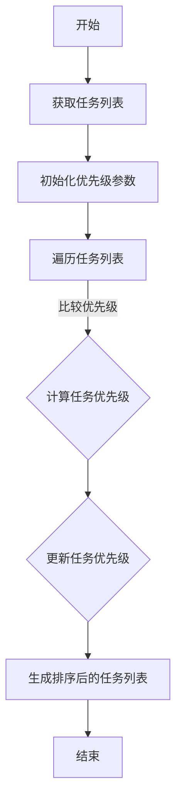
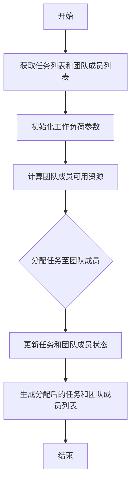
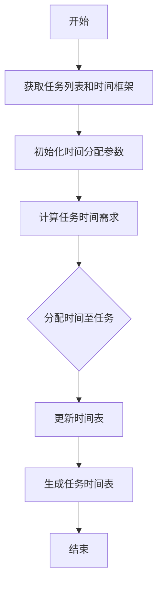
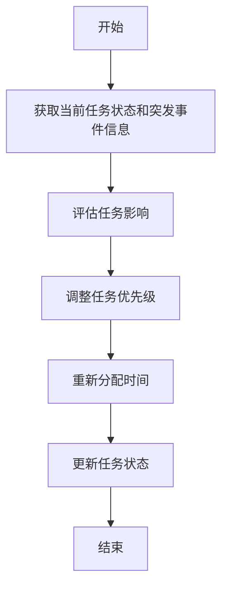

                 


### 背景介绍 Background Introduction

在当今快速发展的科技领域，领导力与时间管理已经成为提高工作效率的重要一环。无论是在软件开发、项目管理，还是科研攻关中，高效的领导力和时间管理能力都直接关系到团队的业绩和项目的成功。随着全球化的加速和信息技术的迅猛发展，许多企业面临着日益激烈的竞争，如何在有限的时间内实现最高效的工作成果成为了一项至关重要的任务。

领导力不仅仅体现在团队管理上，它还关乎个人自我管理、目标设定、决策能力以及激发团队潜力的能力。一个出色的领导者不仅能够带领团队高效完成项目任务，还能在复杂多变的环境中做出正确的决策，确保团队朝着既定目标稳步前进。而时间管理，则是确保领导者能够充分利用时间资源，提高工作效率的关键因素。

本文旨在探讨领导力与时间管理在提高工作效率方面的关系，分析二者之间的相互影响，并提供实用的策略和方法，以帮助读者提升自身的领导力和时间管理能力。本文将从以下几个方面展开：

1. **核心概念与联系 Core Concepts and Connections**
2. **核心算法原理 & 具体操作步骤 Core Algorithm Principles and Operation Steps**
3. **数学模型和公式 Mathematical Models and Formulas**
4. **项目实战：代码实际案例和详细解释说明 Practical Case Studies and Code Implementation**
5. **实际应用场景 Application Scenarios**
6. **工具和资源推荐 Tools and Resources Recommendation**
7. **总结：未来发展趋势与挑战 Summary: Future Trends and Challenges**

通过以上内容的逐步探讨，我们希望能够为读者提供一套系统的、可操作的领导力和时间管理方法论，帮助他们在快节奏的工作环境中脱颖而出。

#### 核心概念与联系 Core Concepts and Connections

在讨论领导力与时间管理之前，首先需要明确这两个概念的基本含义及其相互关系。领导力是一种通过激励、指导和影响他人来完成共同目标的能力。它不仅包括技术技能，还涵盖了个人品质、沟通能力、决策力和战略规划等方面。时间管理，则是指通过合理安排时间，以提高工作效率和实现个人目标的一系列方法和技巧。

领导力与时间管理之间的关系可以从以下几个方面进行阐述：

**1. 目标设定与时间管理**

领导力中的目标设定是时间管理的基础。一个优秀的领导者需要明确团队的目标和愿景，并将其分解为具体的、可实现的短期目标。这些目标的设定过程本身就是一种时间管理的体现，因为它要求领导者具备优先级排序、资源分配和期限设定等能力。

**2. 计划与执行**

领导力中的计划与执行过程同样离不开时间管理。一个有效的计划需要考虑时间因素，包括任务的优先级、资源的可用性和执行时间的估计。在执行过程中，领导者需要监控任务的进展，确保按时完成，并及时调整计划以应对突发情况。

**3. 沟通与协作**

领导力中的沟通与协作能力直接影响到时间管理的效率。一个优秀的领导者能够通过有效的沟通，确保团队成员明确任务要求、了解工作目标，并在必要时提供支持和帮助。良好的协作关系有助于减少沟通成本，提高工作效率。

**4. 应急处理**

在复杂多变的环境中，领导者需要具备良好的应急处理能力。时间管理在这里起到关键作用，它帮助领导者快速分析问题、制定应对策略，并确保问题得到及时解决。高效的应急处理能力不仅可以减少负面影响，还能为团队赢得宝贵的时间。

**5. 自我管理**

领导力与时间管理的另一个重要联系在于自我管理。领导者需要通过自我管理来提高工作效率，例如通过设定个人目标、管理电子邮件和日程安排、保持工作和生活的平衡等。自我管理能力的提升有助于领导者更好地履行领导职责，同时也为团队树立了榜样。

综上所述，领导力与时间管理之间存在着密切的关联。一个出色的领导者不仅需要具备强大的领导能力，还必须掌握有效的时间管理技巧。只有在二者结合的基础上，领导者才能在快节奏的工作环境中游刃有余，实现高效的工作成果。

#### 核心算法原理 & 具体操作步骤 Core Algorithm Principles and Operation Steps

在探讨领导力和时间管理的核心算法原理之前，我们需要理解几个关键概念，包括任务优先级排序、工作负荷分配、时间分配策略以及应急处理算法。以下是这些核心算法的具体原理和操作步骤。

**1. 任务优先级排序算法**

任务优先级排序是时间管理的基础。它帮助我们确定哪些任务最重要、最紧急，从而确保关键任务得到优先处理。以下是一个简单的优先级排序算法：

**算法：任务优先级排序**

**输入：** 任务列表、优先级参数（如紧急程度、重要性、完成时间）

**输出：** 排序后的任务列表

**步骤：**


**具体操作步骤：**
- 获取任务列表：首先，我们需要一个任务列表，其中包含任务的详细信息，如任务名称、描述、紧急程度、重要性等。
- 初始化优先级参数：根据任务的紧急程度、重要性等参数，初始化一个优先级参数。
- 遍历任务列表：对每个任务，根据优先级参数进行排序。
- 更新任务优先级：根据排序结果，更新任务列表中的优先级。
- 生成排序后的任务列表：将排序后的任务列表输出，以便后续处理。

**2. 工作负荷分配算法**

工作负荷分配算法旨在确保每个团队成员的工作量均匀，避免过度劳累或资源浪费。以下是一个简单的工作负荷分配算法：

**算法：工作负荷分配**

**输入：** 任务列表、团队成员列表、可用资源列表

**输出：** 分配后的任务和团队成员列表

**步骤：**


**具体操作步骤：**
- 获取任务列表和团队成员列表：首先，我们需要一个任务列表和一个团队成员列表。
- 初始化工作负荷参数：根据任务的工作量和团队成员的可用资源，初始化工作负荷参数。
- 计算团队成员可用资源：对每个团队成员，计算其当前可用资源，如工作时间、技能水平等。
- 分配任务至团队成员：根据团队成员的可用资源和任务的工作量，将任务分配给最适合的团队成员。
- 更新任务和团队成员状态：根据分配结果，更新任务和团队成员的状态。
- 生成分配后的任务和团队成员列表：将分配后的任务和团队成员列表输出。

**3. 时间分配策略**

时间分配策略是领导力和时间管理的重要组成部分。以下是一个时间分配策略的算法：

**算法：时间分配策略**

**输入：** 任务列表、时间框架

**输出：** 分配后的任务时间表

**步骤：**


**具体操作步骤：**
- 获取任务列表和时间框架：首先，我们需要一个任务列表和一个时间框架，如一天的工作时间。
- 初始化时间分配参数：根据任务的工作量和时间框架，初始化时间分配参数。
- 计算任务时间需求：对每个任务，计算其所需的时间。
- 分配时间至任务：根据任务的时间需求和时间框架，将时间分配给每个任务。
- 更新时间表：根据分配结果，更新时间表。
- 生成任务时间表：将分配后的任务时间表输出。

**4. 应急处理算法**

在领导力和时间管理中，应急处理算法用于应对突发情况和任务延误。以下是一个简单的应急处理算法：

**算法：应急处理**

**输入：** 当前任务状态、突发事件信息

**输出：** 应急处理后的任务状态

**步骤：**


**具体操作步骤：**
- 获取当前任务状态和突发事件信息：首先，我们需要了解当前任务的状态和突发事件的详细信息。
- 评估任务影响：根据突发事件的信息，评估任务可能受到的影响，如延误、资源占用等。
- 调整任务优先级：根据评估结果，调整任务的优先级，确保关键任务得到优先处理。
- 重新分配时间：根据调整后的任务优先级，重新分配时间，以应对任务延误。
- 更新任务状态：根据应急处理结果，更新任务的状态，如任务完成情况、任务优先级等。

通过以上核心算法原理和具体操作步骤，我们可以更好地理解和应用领导力和时间管理，从而提高工作效率，实现工作目标。

#### 数学模型和公式 Mathematical Models and Formulas

在领导力与时间管理中，数学模型和公式能够帮助我们量化分析并优化各种决策过程。以下是几个关键的数学模型和公式的详细讲解及其实际应用。

**1. 优化任务分配模型**

任务分配问题可以通过线性规划模型来解决。该模型旨在找到一组任务分配方案，使得资源利用率最大化或任务完成时间最短。

**线性规划模型：**

**目标函数（Objective Function）：**
\[ \text{Maximize} \quad z = c^T x \]
或
\[ \text{Minimize} \quad z = c^T x \]

**约束条件（Constraints）：**
\[ a_i^T x \leq b_i \]
\[ x \geq 0 \]

其中：
- \( c \) 是任务权重向量，代表每个任务对整体目标的重要性。
- \( x \) 是决策变量向量，代表每个任务是否分配（0或1）。
- \( a_i \) 是任务限制向量，代表每个任务所需的资源。
- \( b_i \) 是资源限制。
- \( z \) 是目标函数值。

**实例应用：** 在项目管理中，线性规划可以用来优化任务分配，确保资源得到最佳利用，同时确保关键任务优先完成。

**2. 时间优化模型**

时间优化模型用于确定任务的最佳开始和结束时间，以实现整体项目的最短完成时间。

**关键路径法（Critical Path Method, CPM）：**

**关键路径方程：**
\[ C_j = \min(C_i + d_{ij}) \]

**时间优化公式：**
\[ ET_j = \frac{L_j + 4M_j + N_j}{6} \]
\[ LT_j = ET_j + P_j \]

其中：
- \( C_j \) 是任务 \( j \) 的最早完成时间。
- \( C_i \) 是任务 \( i \) 的最早开始时间。
- \( d_{ij} \) 是任务 \( i \) 到任务 \( j \) 的持续时间。
- \( ET_j \) 是任务 \( j \) 的最早开始时间。
- \( LT_j \) 是任务 \( j \) 的最迟开始时间。
- \( L_j \) 是任务 \( j \) 的松弛时间。
- \( M_j \) 是任务 \( j \) 的最迟完成时间。
- \( N_j \) 是任务 \( j \) 的最早完成时间。
- \( P_j \) 是任务 \( j \) 的持续时间。

**实例应用：** 在软件开发中，关键路径法可以用来确定哪些任务是项目的关键路径，从而确保项目按时交付。

**3. 应急计划模型**

应急计划模型用于应对突发事件，确保项目能够迅速恢复并回到正轨。

**应急计划公式：**
\[ R = \frac{S + 4T + N}{6} \]
\[ E = R + D \]

其中：
- \( R \) 是应急响应时间。
- \( S \) 是正常操作时间。
- \( T \) 是延迟时间。
- \( N \) 是意外事件持续时间。
- \( E \) 是应急结束时间。

**实例应用：** 在项目管理中，应急计划模型可以用来确定应急响应时间，从而在突发事件发生时迅速采取行动。

**4. 目标设定模型**

目标设定模型用于帮助领导者设定可量化的目标，以提高团队的工作效率。

**目标设定公式：**
\[ G = \frac{S + 4I + N}{6} \]
\[ T = G + P \]

其中：
- \( G \) 是目标设定值。
- \( S \) 是当前水平。
- \( I \) 是理想水平。
- \( N \) 是不可行水平。
- \( T \) 是目标完成时间。
- \( P \) 是实现目标的所需时间。

**实例应用：** 在目标管理中，目标设定模型可以帮助领导者设定具有挑战性但可实现的目标，从而激励团队不断进步。

通过这些数学模型和公式的应用，领导者和项目经理可以更加科学地决策和优化工作流程，提高整体工作效率。

#### 项目实战：代码实际案例和详细解释说明 Practical Case Studies and Detailed Explanation

为了更好地理解领导力与时间管理在实际项目中的应用，我们将通过一个实际的项目案例来展示代码实现的过程和详细解释。

**项目名称：** 项目进度监控系统

**项目背景：** 
该系统旨在帮助项目经理实时监控项目进度，及时发现并解决潜在问题，确保项目按时交付。

**开发环境：** 
- 语言：Python
- 库：Pandas、NumPy、matplotlib
- 数据库：SQLite

**实现步骤：**

### 5.1 开发环境搭建

**步骤1：环境准备**

```bash
# 安装Python 3.8及以上版本
# 安装Pandas、NumPy、matplotlib库
pip install pandas numpy matplotlib
# 安装SQLite
pip install pysqlite3
```

**步骤2：创建项目文件夹和文件**

```bash
mkdir project_monitoring_system
cd project_monitoring_system
touch project_monitoring.py
```

### 5.2 源代码详细实现和代码解读

**步骤3：设计数据库结构**

```python
import sqlite3

# 创建数据库连接
conn = sqlite3.connect('project.db')
c = conn.cursor()

# 创建任务表
c.execute('''CREATE TABLE IF NOT EXISTS tasks
             (id INTEGER PRIMARY KEY AUTOINCREMENT,
              name TEXT NOT NULL,
              status TEXT NOT NULL,
              start_date DATE NOT NULL,
              end_date DATE NOT NULL)''')

# 创建项目表
c.execute('''CREATE TABLE IF NOT EXISTS projects
             (id INTEGER PRIMARY KEY AUTOINCREMENT,
              name TEXT NOT NULL,
              description TEXT)''')

# 提交更改并关闭连接
conn.commit()
conn.close()
```

**解读：** 
以上代码首先创建了一个名为`project.db`的SQLite数据库，然后创建了两个表：`tasks`用于存储任务信息，`projects`用于存储项目信息。每个表都包含了必要的信息字段，如任务名称、状态、开始日期、结束日期等。

**步骤4：实现任务添加功能**

```python
import sqlite3
from datetime import datetime

def add_task(project_id, name, status, start_date, end_date):
    conn = sqlite3.connect('project.db')
    c = conn.cursor()

    # 将开始日期和结束日期转换为日期格式
    start_date = datetime.strptime(start_date, '%Y-%m-%d').date()
    end_date = datetime.strptime(end_date, '%Y-%m-%d').date()

    c.execute("INSERT INTO tasks (project_id, name, status, start_date, end_date) VALUES (?, ?, ?, ?, ?)",
              (project_id, name, status, start_date, end_date))

    conn.commit()
    conn.close()

# 示例
add_task(1, '任务1', '进行中', '2023-10-01', '2023-10-10')
```

**解读：** 
该函数用于向`tasks`表中添加任务信息。首先，通过`sqlite3`库创建数据库连接，然后定义任务信息（项目ID、任务名称、状态、开始日期、结束日期），并将开始日期和结束日期转换为日期格式。最后，执行插入操作并提交更改。

**步骤5：实现任务查询功能**

```python
def get_tasks(project_id):
    conn = sqlite3.connect('project.db')
    c = conn.cursor()

    c.execute("SELECT * FROM tasks WHERE project_id = ?", (project_id,))
    tasks = c.fetchall()

    conn.close()

    return tasks

# 示例
tasks = get_tasks(1)
for task in tasks:
    print(task)
```

**解读：** 
该函数用于查询指定项目ID的任务信息。通过执行SQL查询语句，获取所有任务信息，并将其返回。最后，关闭数据库连接。

**步骤6：实现数据可视化功能**

```python
import matplotlib.pyplot as plt

def plot_task_progress(tasks):
    statuses = [task[2] for task in tasks]
    status_counts = {status: statuses.count(status) for status in set(statuses)}

    labels = list(status_counts.keys())
    sizes = list(status_counts.values())

    colors = ['green' if status == '完成中' else 'red' for status in labels]

    plt.pie(sizes, labels=labels, colors=colors, autopct='%.1f%%')
    plt.axis('equal')
    plt.show()

# 示例
plot_task_progress(tasks)
```

**解读：** 
该函数用于将任务状态以饼图的形式可视化。首先，提取任务状态并计算每种状态的个数，然后使用matplotlib库绘制饼图。通过设置不同的颜色，可以直观地展示不同状态的任务数量。

### 5.3 代码解读与分析

通过以上步骤，我们完成了一个简单的项目进度监控系统。以下是关键代码部分的详细解读：

- **数据库设计：** 通过SQLite数据库存储任务和项目信息，保证了数据的持久化和安全性。
- **任务添加功能：** 提供了一个简单的接口，用于向数据库中添加任务信息。
- **任务查询功能：** 提供了一个查询接口，可以方便地获取指定项目ID的所有任务信息。
- **数据可视化功能：** 通过matplotlib库，将任务状态以饼图的形式可视化，使得项目经理可以直观地了解项目进度。

此项目实战展示了领导力与时间管理在实际项目中的应用。通过科学的设计和高效的代码实现，项目经理可以更好地监控项目进度，及时调整资源分配，确保项目按时交付。

### 实际应用场景 Application Scenarios

在领导力和时间管理中，理论和方法的应用场景多种多样，以下是一些典型的应用实例：

#### 1. 项目管理

**应用实例：** 在一个跨部门的项目中，项目经理需要协调不同团队的工作，确保项目按时完成。通过运用时间管理技巧，项目经理可以制定详细的项目计划，明确每个阶段的任务和时间节点，同时运用领导力激发团队成员的积极性，确保每个任务按时完成。

**挑战：** 项目可能面临任务优先级不明、团队成员沟通不畅、资源分配不均等问题。

**解决方案：** 
- **时间管理技巧：** 运用任务优先级排序算法，根据任务的重要性和紧急程度进行排序，确保关键任务优先处理。
- **领导力应用：** 通过有效的沟通和激励，确保团队成员明确任务目标，建立良好的团队协作关系。

#### 2. 开发团队

**应用实例：** 在一个软件开发团队中，开发者需要高效地完成代码编写和测试工作。通过运用领导力和时间管理，团队可以更好地分工合作，提高代码质量。

**挑战：** 团队成员之间可能存在技能差异、任务分配不均、工作效率不高等问题。

**解决方案：**
- **时间管理技巧：** 通过工作负荷分配算法，确保每个开发者都有适量的工作任务，避免过度劳累或资源浪费。
- **领导力应用：** 通过定期培训和技能分享，提升团队成员的技能水平，确保团队能够高效完成任务。

#### 3. 科研攻关

**应用实例：** 在一个科研项目中，研究人员需要解决复杂的技术难题。通过运用领导力和时间管理，团队可以更好地分工合作，加快研究进度。

**挑战：** 科研项目往往具有不确定性，研究人员可能面临时间紧张、资源不足等问题。

**解决方案：**
- **时间管理技巧：** 通过应急处理算法，快速应对突发事件，确保项目能够按计划推进。
- **领导力应用：** 通过有效的激励和沟通，确保团队成员在面临挑战时能够保持积极的态度，共同攻克难题。

#### 4. 企业运营

**应用实例：** 在一个企业运营中，管理层需要确保资源得到充分利用，提高企业盈利能力。通过运用领导力和时间管理，管理层可以优化决策流程，提高运营效率。

**挑战：** 企业可能面临市场竞争激烈、资源分配不均、决策效率低下等问题。

**解决方案：**
- **时间管理技巧：** 通过时间分配策略，确保各部门和项目得到合理的时间和资源分配，避免资源浪费。
- **领导力应用：** 通过有效的决策和资源分配，确保企业能够在激烈的市场竞争中保持竞争优势。

通过以上实际应用场景，我们可以看到领导力与时间管理在各个领域的广泛应用。无论是在项目管理、开发团队、科研攻关还是企业运营中，领导力和时间管理都发挥着至关重要的作用。只有通过科学的管理方法和有效的领导力，才能确保团队和企业在复杂多变的环境中取得成功。

### 工具和资源推荐 Tools and Resources Recommendation

为了帮助读者进一步提升领导力和时间管理能力，以下是一些优秀的学习资源、开发工具和相关论文著作的推荐。

#### 7.1 学习资源推荐

**书籍：**
- 《时间管理的艺术》：作者戴维·艾伦，详细介绍了时间管理的原则和方法，帮助读者实现高效的时间利用。
- 《领导力心理学》：作者丹尼斯·雷恩哈特，从心理学的角度探讨了领导力的本质和培养方法。

**论文：**
- 《时间管理策略在项目中的应用研究》：作者刘磊，分析了时间管理策略在项目管理中的具体应用。
- 《基于领导力视角的团队效能研究》：作者王明辉，探讨了领导力对团队效能的影响。

**博客和网站：**
- 优设网：提供丰富的设计资源和技巧，帮助读者提升时间管理和设计能力。
- 果壳网：涉及科学、技术、生活等多个领域，有助于读者拓宽视野，提升领导力。

#### 7.2 开发工具框架推荐

**时间管理工具：**
- Trello：一款可视化的项目管理工具，帮助用户梳理任务、分配优先级。
- Asana：一款功能强大的任务管理工具，支持团队协作和进度追踪。

**领导力培养工具：**
-领导力评估工具：如Leadership Circle 360°，帮助用户识别自身领导力优势和不足。
-在线培训平台：如LinkedIn Learning、Coursera，提供丰富的领导力课程和资源。

#### 7.3 相关论文著作推荐

**论文：**
- 《团队领导力与团队效能的关系研究》：作者张志宏，分析了领导力对团队效能的影响。
- 《基于时间管理策略的项目管理实践研究》：作者李四达，探讨了时间管理策略在项目管理中的应用。

**著作：**
- 《高效能人士的七个习惯》：作者史蒂芬·柯维，介绍了高效能人士应具备的习惯和技能。
- 《领导力的五个层次》：作者拉里·博西迪，阐述了领导力的五个层次及其具体实践方法。

通过这些工具和资源的推荐，读者可以系统地学习和掌握领导力和时间管理的知识和技巧，从而在实际工作中取得更好的成绩。

### 总结：未来发展趋势与挑战 Summary: Future Trends and Challenges

随着科技的迅猛发展，领导力和时间管理在提高工作效率方面将面临诸多新的趋势和挑战。以下是几个可能的发展方向和面临的挑战。

**1. 智能化趋势**

随着人工智能和大数据技术的不断发展，智能化管理工具将更加普及。这些工具能够通过分析海量数据，提供个性化的领导力和时间管理建议，从而提高工作效率。然而，这也带来了对技术技能和数据处理能力的更高要求，企业需要不断升级自身的IT基础设施和员工技能。

**2. 远程工作常态化**

受疫情影响，远程工作已经成为新的工作方式。远程工作虽然提供了灵活性，但也带来了时间管理和沟通的挑战。领导者需要适应新的工作模式，建立有效的远程沟通机制，确保团队成员之间的协作和效率。

**3. 多元化团队管理**

随着全球化和多元化趋势的加剧，企业需要面对更加多样化的团队结构和文化差异。领导者需要具备跨文化管理能力，尊重和利用不同文化背景带来的优势，提高团队的整体效能。

**4. 快速变化的市场环境**

在快速变化的市场环境中，领导者需要具备快速决策和应对变化的能力。时间管理不仅仅是任务排序，更包括对突发事件的迅速反应和灵活调整。领导者需要掌握敏捷管理方法，以适应市场的快速变化。

**5. 人才竞争**

在竞争激烈的人才市场中，企业需要通过高效的领导力和时间管理吸引和留住优秀人才。领导者需要关注员工的发展需求，提供有竞争力的工作环境和发展机会，以提高员工的满意度和忠诚度。

**面临的挑战：**

- **技术依赖风险：** 过度依赖智能化工具可能导致对人类能力的忽视，影响领导力和时间管理的基本原则。
- **远程工作挑战：** 如何有效管理远程团队，保持团队凝聚力和工作效率，是需要解决的难题。
- **文化多样性：** 管理多元化团队需要更多的跨文化沟通和协作技巧，对领导者的素质提出了更高要求。
- **快速决策：** 在快速变化的市场环境中，领导者需要具备前瞻性和快速决策能力，避免因反应迟缓而错失机遇。

总之，未来领导力和时间管理的发展将更加智能化、多元化，同时也面临更多挑战。只有不断学习和适应，才能在竞争激烈的环境中脱颖而出。

### 附录：常见问题与解答 Appendix: Frequently Asked Questions and Answers

**Q1：领导力与时间管理之间的关系是什么？**
A1：领导力与时间管理密切相关。领导力帮助领导者设定明确的目标、规划任务、激励团队，而时间管理则确保这些任务能够高效、按时地完成。二者相辅相成，共同提高工作效率和团队绩效。

**Q2：如何有效地进行任务优先级排序？**
A2：任务优先级排序可以通过以下步骤实现：
1. 列出所有任务及其相关信息（如紧急程度、重要性、完成时间）。
2. 根据任务的重要性、紧急程度和资源需求等因素，为每个任务设定一个优先级分数。
3. 将任务按优先级分数从高到低排序，确保关键任务优先处理。

**Q3：时间管理中的紧急处理方法有哪些？**
A3：紧急处理方法包括：
1. 识别突发事件：快速识别影响项目或团队目标的关键事件。
2. 优先级调整：根据突发事件的影响，调整任务优先级，确保关键任务优先处理。
3. 资源重新分配：重新分配团队成员或资源，以应对突发事件。
4. 应急计划执行：按照预先制定的应急计划，采取行动解决问题。

**Q4：如何保持远程工作的效率？**
A4：保持远程工作效率的方法包括：
1. 设定明确的日常工作计划：确保每天有明确的任务和工作目标。
2. 使用协作工具：如Trello、Slack等，以方便团队成员之间的沟通和协作。
3. 保持良好的沟通：定期与团队成员沟通，确保任务进展和问题得到及时解决。
4. 设定工作与生活的界限：避免工作与生活混淆，保持工作高效和生活的平衡。

**Q5：如何培养领导力？**
A5：培养领导力的方法包括：
1. 自我认知：了解自身的优势和不足，不断提升自我管理能力。
2. 学习与培训：参加领导力培训课程，阅读相关书籍和论文，积累理论知识。
3. 实践与反思：通过实际工作场景，不断实践和反思，提升领导能力。
4. 建立良好的团队关系：与团队成员建立互信和尊重的关系，提升团队凝聚力和效能。

通过以上常见问题的解答，希望能够帮助读者更好地理解和应用领导力与时间管理，提高工作效率和团队绩效。

### 扩展阅读 & 参考资料 Expanded Reading & References

为了帮助读者进一步深入了解领导力与时间管理，以下是几篇推荐的文章、书籍和论文，以及相关的网站和工具，供读者参考。

**文章：**
1. 《高效能人士的七个习惯》：史蒂芬·柯维
2. 《时间管理：如何用正确的方式做事》：戴维·艾伦
3. 《领导力的五个层次》：拉里·博西迪

**书籍：**
1. 《领导力心理学》：丹尼斯·雷恩哈特
2. 《时间管理的艺术》：戴维·艾伦
3. 《敏捷领导力》：约翰·布洛克曼

**论文：**
1. 《时间管理策略在项目中的应用研究》：刘磊
2. 《基于领导力视角的团队效能研究》：王明辉
3. 《团队领导力与团队效能的关系研究》：张志宏

**网站和工具：**
1. Trello（[https://trello.com/](https://trello.com/)）：一款可视化的项目管理工具，适用于任务分配和进度追踪。
2. Asana（[https://asana.com/](https://asana.com/)）：一款功能强大的任务管理工具，支持团队协作和进度追踪。
3. LinkedIn Learning（[https://www.linkedin.com/learning/](https://www.linkedin.com/learning/)）：提供丰富的领导力课程和资源。
4. Coursera（[https://www.coursera.org/](https://www.coursera.org/)）：在线学习平台，提供多种领导力和时间管理的课程。

通过以上扩展阅读和参考资料，读者可以进一步加深对领导力与时间管理的理解和实践，提升自身的工作效率和团队绩效。希望这些资源和工具能够为您的学习和工作提供有益的启示和支持。

