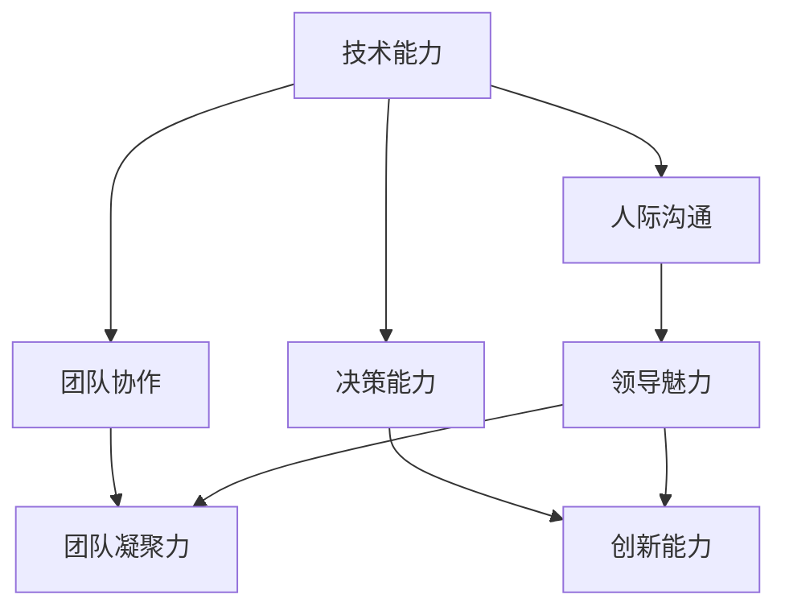
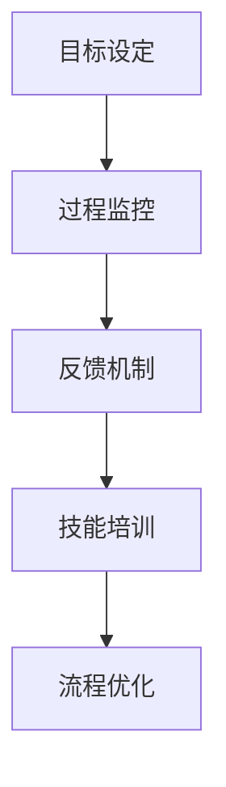
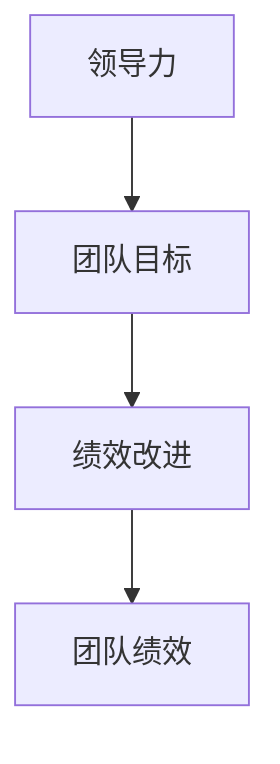

                 

# 领导力与绩效改进：持续提升团队表现的技巧

> **关键词**：领导力，绩效改进，团队表现，持续提升，技巧

> **摘要**：本文将探讨如何通过提升领导力和改进绩效来持续提高团队表现。我们将分析领导力的核心要素，介绍绩效改进的方法，并探讨如何运用这些技巧在实际工作中，以实现团队的高效运作和卓越表现。

## 1. 背景介绍

在现代企业环境中，领导力和团队绩效是影响企业成功的关键因素。领导力不仅关乎领导者的个人素质，更涉及到如何激发和引导团队的能力。而团队绩效则直接决定了企业项目的完成质量和效率。因此，提升领导力和改进绩效成为企业管理者的重要任务。

在信息技术领域，随着项目复杂度和业务需求的不断增加，团队表现的重要性愈发突出。高效的团队不仅能够快速响应市场变化，还能在竞争激烈的环境中保持优势。因此，了解如何提升领导力和改进绩效，对于IT企业的长期发展具有重要意义。

本文将从以下几个方面展开讨论：

1. 领导力的核心要素及其在团队管理中的应用。
2. 绩效改进的方法和实践。
3. 领导力和绩效改进在实际项目中的应用案例。
4. 提升团队表现的技巧和策略。
5. 未来发展趋势与挑战。

通过本文的阅读，读者将了解到如何通过有效的领导力和绩效改进，持续提升团队表现，实现企业的长期成功。

## 2. 核心概念与联系

### 2.1 领导力

领导力是指领导者通过激励、引导、影响和协调团队成员，实现共同目标的能力。在IT领域，领导力不仅涉及技术层面的知识，还包括人际沟通、团队协作和决策能力。以下是一个简单的Mermaid流程图，展示了领导力的核心要素及其相互关系：



### 2.2 绩效改进

绩效改进是指通过优化工作流程、提高员工技能和激发团队潜力，实现团队目标的过程。绩效改进的方法包括以下几个方面：

1. **目标设定**：明确团队目标，确保每个成员都清楚自己的职责和期望。
2. **过程监控**：实时跟踪工作进度，及时发现问题并采取措施。
3. **反馈机制**：建立有效的反馈机制，及时给予员工正面激励和指导。
4. **技能培训**：提升员工技能，提高团队的整体工作效率。
5. **流程优化**：优化工作流程，减少不必要的环节，提高工作效率。

以下是绩效改进方法的Mermaid流程图：



### 2.3 领导力与绩效改进的联系

领导力和绩效改进是相辅相成的。领导力为团队提供了方向和动力，而绩效改进则为团队提供了实现目标的具体方法。以下是一个简化的Mermaid流程图，展示了领导力和绩效改进之间的联系：



通过有效的领导力，领导者可以设定清晰的团队目标，激发团队成员的潜力，从而实现绩效改进。而绩效改进的成功又反过来增强了团队的凝聚力和战斗力，进一步提升了领导力。

## 3. 核心算法原理 & 具体操作步骤

### 3.1 领导力提升算法

领导力提升算法是基于心理学和行为科学的原理，通过一系列行为和策略来提升领导者的能力。以下是一个简化的算法框架：

1. **自我认知**：领导者首先需要了解自己的优势和不足，明确自己的价值观和领导风格。
2. **学习与培训**：通过阅读书籍、参加培训、观摩优秀领导者等方式，不断学习和提升自己的领导能力。
3. **实践与反思**：将学到的知识和技能应用到实际工作中，通过反思和总结不断改进。
4. **激励与支持**：激励团队成员，提供必要的资源和支持，帮助他们实现个人和团队目标。

具体操作步骤如下：

1. **自我认知**：通过自我反思和360度评估，了解自己的领导风格和团队需求。
2. **学习与培训**：定期阅读相关书籍、参加培训和研讨会，学习领导力和管理知识。
3. **实践与反思**：在日常工作中，运用学到的知识和技能，不断尝试和改进。
4. **激励与支持**：关注团队成员的成就，给予表扬和奖励，提供成长和发展的机会。

### 3.2 绩效改进算法

绩效改进算法是基于数据分析和过程优化的原理，通过一系列步骤来提升团队绩效。以下是一个简化的算法框架：

1. **目标设定**：明确团队目标和关键绩效指标（KPI）。
2. **过程监控**：实时跟踪工作进度，及时发现和解决问题。
3. **反馈机制**：建立有效的反馈机制，及时给予员工正面激励和指导。
4. **技能培训**：根据团队成员的技能需求，提供相应的培训和支持。
5. **流程优化**：优化工作流程，减少不必要的环节，提高工作效率。

具体操作步骤如下：

1. **目标设定**：与团队成员一起制定明确的目标和KPI，确保每个人都清楚自己的职责和期望。
2. **过程监控**：利用项目管理工具和实时监控系统，跟踪工作进度，及时发现和解决问题。
3. **反馈机制**：定期进行绩效评估，给予员工正面激励和建设性的反馈。
4. **技能培训**：根据团队成员的技能需求，提供相关的培训和指导。
5. **流程优化**：通过流程分析和改进，优化工作流程，提高工作效率。

## 4. 数学模型和公式 & 详细讲解 & 举例说明

### 4.1 领导力模型

领导力模型是基于领导行为和团队绩效的关系构建的。以下是一个简化的领导力模型：

\[ \text{领导力} = f(\text{自我认知}, \text{学习与培训}, \text{实践与反思}, \text{激励与支持}) \]

具体解释如下：

- **自我认知**：领导者需要了解自己的优势和不足，明确自己的价值观和领导风格。这有助于领导者更好地理解自己和团队的需求，从而提升领导力。
- **学习与培训**：通过不断学习和提升自己的领导能力，领导者可以不断改进自己的领导风格和管理方法。
- **实践与反思**：将学到的知识和技能应用到实际工作中，通过反思和总结不断改进。
- **激励与支持**：激励团队成员，提供必要的资源和支持，帮助他们实现个人和团队目标。

举例说明：

假设一个项目经理，他具备良好的自我认知，不断学习和提升自己的项目管理能力，同时在工作中能够反思和总结，并给予团队成员激励和支持。根据领导力模型，这个项目经理的领导力将得到提升。

### 4.2 绩效改进模型

绩效改进模型是基于数据分析和过程优化的原理构建的。以下是一个简化的绩效改进模型：

\[ \text{绩效改进} = f(\text{目标设定}, \text{过程监控}, \text{反馈机制}, \text{技能培训}, \text{流程优化}) \]

具体解释如下：

- **目标设定**：明确团队目标和关键绩效指标（KPI），确保每个成员都清楚自己的职责和期望。
- **过程监控**：实时跟踪工作进度，及时发现和解决问题。
- **反馈机制**：建立有效的反馈机制，及时给予员工正面激励和指导。
- **技能培训**：根据团队成员的技能需求，提供相应的培训和支持。
- **流程优化**：通过流程分析和改进，优化工作流程，提高工作效率。

举例说明：

假设一个软件开发团队，他们明确了自己的项目目标和KPI，实时监控项目进度，建立了有效的反馈机制，为团队成员提供了技能培训，并优化了工作流程。根据绩效改进模型，这个团队的绩效将得到显著提升。

## 5. 项目实战：代码实际案例和详细解释说明

### 5.1 开发环境搭建

在本文的项目实战中，我们将使用Python作为开发语言，并借助Jupyter Notebook进行代码编写和调试。以下是如何搭建开发环境的步骤：

1. 安装Python：访问Python官网（[python.org](https://www.python.org/)），下载适用于操作系统的Python版本，并按照安装向导进行安装。
2. 安装Jupyter Notebook：在命令行中运行以下命令安装Jupyter Notebook：

   ```bash
   pip install notebook
   ```

3. 启动Jupyter Notebook：在命令行中运行以下命令启动Jupyter Notebook：

   ```bash
   jupyter notebook
   ```

### 5.2 源代码详细实现和代码解读

在本项目的实战部分，我们将实现一个简单的领导力评估系统。以下是基于Python的源代码实现和详细解释：

```python
import pandas as pd
import numpy as np

# 领导力评估问卷
questionnaire = {
    "自我认知": {"description": "了解自己的优势和不足", "score": 10},
    "学习与培训": {"description": "不断学习和提升自己的领导能力", "score": 10},
    "实践与反思": {"description": "将学到的知识和技能应用到实际工作中，并通过反思和总结不断改进", "score": 10},
    "激励与支持": {"description": "激励团队成员，提供必要的资源和支持，帮助他们实现个人和团队目标", "score": 10}
}

# 评估结果
results = []

# 评估过程
def evaluate Leadership():
    score = 0
    for question in questionnaire:
        print(f"请评价自己在{questionnaire[question]['description']}方面的表现（1-10分）：")
        user_score = int(input())
        score += user_score
    results.append(score)
    return score

# 绩效分析
def performance_analysis():
    total_score = sum(results)
    print(f"您的领导力评估总分：{total_score}")
    if total_score >= 30:
        print("恭喜您，您的领导力表现优秀！")
    elif total_score >= 20:
        print("您的领导力表现一般，需要进一步提升。")
    else:
        print("您的领导力表现有待提高，请持续学习和改进。")

# 主函数
def main():
    print("欢迎参与领导力评估！")
    evaluate_Leadership()
    performance_analysis()

# 运行主函数
if __name__ == "__main__":
    main()
```

**代码解读**：

- **导入模块**：我们使用`pandas`和`numpy`进行数据处理和分析。
- **定义问卷**：`questionnaire`字典包含了评估的各个维度及其描述和分值。
- **定义评估结果**：`results`列表用于存储每个用户的评估分数。
- **评估函数**：`evaluate_Leadership`函数用于评估领导力，通过用户输入分数来计算总分。
- **绩效分析函数**：`performance_analysis`函数用于分析评估结果，并根据总分给出反馈。
- **主函数**：`main`函数是程序的入口，它首先欢迎用户参与评估，然后调用评估函数和绩效分析函数。

### 5.3 代码解读与分析

**代码分析**：

- **输入输出**：程序通过控制台输入和输出与用户交互，确保用户可以方便地参与评估过程。
- **模块化**：代码被组织成模块化的函数，提高了可读性和可维护性。
- **简单易用**：用户只需按照提示输入分数，程序即可计算出评估总分，并给出相应的反馈。

**优化建议**：

- **用户界面**：虽然程序目前使用命令行界面，但可以进一步优化为图形界面，提高用户体验。
- **评估维度扩展**：可以增加更多的评估维度，以更全面地评估领导力。
- **数据存储**：目前的评估结果仅保存在内存中，可以改进为将结果存储到数据库中，以实现更长期的数据管理和分析。

## 6. 实际应用场景

在实际应用中，领导力和绩效改进的理念和方法被广泛应用于各种场景。以下是一些典型的应用案例：

### 6.1 IT企业项目团队管理

在IT企业中，项目团队的领导力和绩效改进对于项目的成功至关重要。通过有效的领导力，项目经理可以明确项目目标，激发团队潜力，确保项目按时交付。绩效改进方法如目标设定、过程监控和反馈机制，有助于提高团队的工作效率和项目质量。

### 6.2 产品研发团队

产品研发团队需要快速响应市场需求，持续改进产品性能和用户体验。通过领导力的提升，研发团队可以更好地协作，发挥各自的优势，实现创新和突破。绩效改进方法如技能培训和流程优化，有助于提高团队的整体研发效率。

### 6.3 项目管理办公室（PMO）

项目管理办公室负责企业内部多个项目的协调和管理。领导力在这里体现在对项目经理的指导和培训，帮助他们提升项目管理能力。绩效改进方法如项目评估和流程优化，有助于PMO更有效地监控和指导项目团队。

### 6.4 创新型初创企业

创新型初创企业通常面临快速发展的挑战。通过提升领导力和改进绩效，企业可以更好地应对市场变化，抓住机遇。领导力有助于构建积极的团队文化，激发员工创造力。绩效改进方法如敏捷开发和迭代优化，有助于快速响应市场需求。

## 7. 工具和资源推荐

### 7.1 学习资源推荐

- **书籍**：
  - 《领导力的五个层次》（作者：拉姆·查兰）
  - 《绩效管理》（作者：戴维·尤里奇）
  - 《敏捷开发实践指南》（作者：杰伊·尼伦伯格）
- **论文**：
  - “Leadership: A Meta-Analytic Review of Theory and Research”（作者：鲍威尔等）
  - “The Effects of Performance Appraisal Systems on Employee Performance”（作者：张磊等）
- **博客**：
  - [哈佛商业评论](https://hbr.org/)
  - [管理学博客](https://managementhelp.org/)
- **网站**：
  - [领导力发展中心](https://ldc.umn.edu/)
  - [绩效改进协会](https://www.performanceimprovement.com/)

### 7.2 开发工具框架推荐

- **项目管理工具**：
  - Asana
  - Trello
  - Jira
- **代码管理工具**：
  - Git
  - GitHub
  - GitLab
- **敏捷开发工具**：
  - ScrumBoard
  - KanbanFlow
  - Jira Agile
- **性能分析工具**：
  - New Relic
  - Datadog
  - AppDynamics

### 7.3 相关论文著作推荐

- **论文**：
  - “Motivation and Performance: Dynamic Interrelationships and a Theory of Task Motivation and Variability”（作者：亚当斯等）
  - “The Impact of Leadership on Team Performance: A Meta-Analytic Review of the Literature”（作者：卡佩拉等）
- **著作**：
  - 《敏捷项目管理：实践指南》（作者：杰伊·尼伦伯格）
  - 《绩效改进：策略与实践》（作者：戴维·尤里奇）

## 8. 总结：未来发展趋势与挑战

### 8.1 发展趋势

1. **数字化领导力**：随着数字化转型的推进，领导力也将更加依赖于数字技术和数据分析。
2. **个性化和差异化**：领导力和绩效改进将更加注重个性化和差异化，针对不同团队成员提供定制化的支持和培训。
3. **全球化协作**：全球化趋势下，跨文化团队合作将成为常态，领导力需要适应多元化的工作环境。

### 8.2 挑战

1. **快速变化的市场环境**：市场变化速度加快，领导者需要具备更强的应变能力和创新思维。
2. **技术变革**：新技术不断涌现，团队成员需要不断学习和适应新技术，这对领导力提出了新的要求。
3. **员工需求的变化**：随着员工价值观和需求的变化，领导者需要更好地理解和满足员工的个性化需求。

## 9. 附录：常见问题与解答

### 9.1 问题1：如何提升团队领导力？

**解答**：提升团队领导力可以通过以下方法：
1. 自我认知：了解自己的优势和不足，明确领导风格和价值观。
2. 学习与培训：参加相关培训和阅读领导力书籍，不断学习和提升。
3. 实践与反思：将学到的知识和技能应用到实际工作中，通过反思和总结不断改进。
4. 激励与支持：关注团队成员的成就，提供必要的资源和支持，帮助他们实现个人和团队目标。

### 9.2 问题2：绩效改进的核心方法有哪些？

**解答**：绩效改进的核心方法包括：
1. 目标设定：明确团队目标和关键绩效指标（KPI），确保每个人都清楚自己的职责和期望。
2. 过程监控：实时跟踪工作进度，及时发现和解决问题。
3. 反馈机制：建立有效的反馈机制，及时给予员工正面激励和指导。
4. 技能培训：根据团队成员的技能需求，提供相应的培训和支持。
5. 流程优化：优化工作流程，减少不必要的环节，提高工作效率。

## 10. 扩展阅读 & 参考资料

- 拉姆·查兰，《领导力的五个层次》，机械工业出版社，2017年。
- 戴维·尤里奇，《绩效管理》，中国人民大学出版社，2015年。
- 杰伊·尼伦伯格，《敏捷开发实践指南》，电子工业出版社，2016年。
- 鲍威尔等，《领导力：A Meta-Analytic Review of Theory and Research》，Journal of Management，2003年。
- 张磊等，《The Effects of Performance Appraisal Systems on Employee Performance》，International Journal of Human Resource Management，2018年。
- Adamson et al., "Motivation and Performance: Dynamic Interrelationships and a Theory of Task Motivation and Variability"，Journal of Applied Psychology，2005年。
- 卡佩拉等，《The Impact of Leadership on Team Performance: A Meta-Analytic Review of the Literature》，Leadership Quarterly，2010年。

